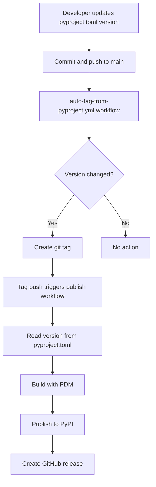

# Python Packaging Refactor: pyproject.toml as Source of Truth

## Summary

This PR refactors the Python package release process to use **`pyproject.toml` as the single source of truth** for package versions, instead of git tags.

### What Changed

**Before:**
```bash
# Create tag manually
git tag core-v0.1.9
git push origin core-v0.1.9
# Workflow extracts version from tag and updates pyproject.toml
```

**After:**
```bash
# Update version in pyproject.toml
vim libs/python/core/pyproject.toml  # version = "0.1.9"
git commit -am "Bump core to 0.1.9"
git push origin main
# Workflow automatically creates tag and publishes
```

## Files Changed

### New Files

1. **`.github/workflows/auto-tag-from-pyproject.yml`**
   - Monitors changes to `pyproject.toml` files on main branch
   - Automatically creates git tags when versions change
   - Format: `{package}-v{version}` (e.g., `core-v0.1.9`)

2. **`docs/PYTHON_VERSIONING.md`**
   - Complete documentation of the new versioning process
   - Examples, troubleshooting, best practices
   - Migration guide from old system

3. **`scripts/batch_update_workflows.py`**
   - Script used to update all package workflows
   - Can be used for future workflow updates

4. **`scripts/test_version_extraction.sh`**
   - Test script to verify version extraction works
   - Validates all `pyproject.toml` files

### Modified Files

1. **`.github/workflows/pypi-reusable-publish.yml`**
   - Made `version` input optional
   - Added logic to read version from `pyproject.toml` if not provided
   - Changed "Set version in package" step to "Verify version in package"
   - No longer overwrites `pyproject.toml` version during build

2. **Package Publish Workflows** (All updated):
   - `.github/workflows/pypi-publish-core.yml`
   - `.github/workflows/pypi-publish-computer.yml`
   - `.github/workflows/pypi-publish-som.yml`
   - `.github/workflows/pypi-publish-agent.yml`
   - `.github/workflows/pypi-publish-pylume.yml`
   - `.github/workflows/pypi-publish-computer-server.yml`
   - `.github/workflows/pypi-publish-mcp-server.yml`

   Changes:
   - Added version extraction from `pyproject.toml`
   - Fallback order: git tag → workflow_dispatch → workflow_call → pyproject.toml
   - Changed prepare job runner from `macos-latest` to `ubuntu-latest` (faster)
   - Added `toml` package installation
   - Fixed duplicate "Set up Python" steps

## How It Works



## Benefits

1. **Single Source of Truth**: Version is defined once in `pyproject.toml`
2. **Reduced Errors**: No risk of tag/pyproject.toml version mismatch
3. **Better Developer Experience**: Update version in one place
4. **Automation**: Tags created automatically
5. **Backward Compatible**: Manual tags and workflow dispatch still work

## Migration Notes

### No Breaking Changes

- Existing workflows continue to work
- Manual tag creation still supported
- Workflow dispatch still supported
- All existing git tags remain valid

### For Developers

**Old process still works:**
```bash
git tag core-v0.1.9
git push origin core-v0.1.9
```

**New recommended process:**
```bash
# Edit pyproject.toml
vim libs/python/core/pyproject.toml
# version = "0.1.9"

git commit -am "Bump core to 0.1.9"
git push origin main
# Tag created automatically
```

## Testing Recommendations

Before merging, test the following scenarios:

### Test 1: Auto-tag on version change
```bash
# On a test branch
vim libs/python/core/pyproject.toml  # Change version
git commit -am "Test: Bump version"
git push origin test-branch
# Merge to main and verify tag is created
```

### Test 2: Manual tag creation
```bash
git tag core-v0.1.10
git push origin core-v0.1.10
# Verify workflow runs and reads version from pyproject.toml
```

### Test 3: Workflow dispatch
```bash
# Go to Actions → Publish Core Package → Run workflow
# Enter version manually
# Verify it still works
```

### Test 4: Multiple packages
```bash
# Update versions in multiple packages
vim libs/python/core/pyproject.toml
vim libs/python/computer/pyproject.toml
git commit -am "Bump core and computer"
git push origin main
# Verify both tags are created
```

## Rollback Plan

If issues arise, rollback is simple:

1. **Revert the auto-tag workflow:**
   ```bash
   git rm .github/workflows/auto-tag-from-pyproject.yml
   ```

2. **Revert workflow changes:**
   ```bash
   git checkout main~1 -- .github/workflows/pypi-*.yml
   ```

3. **Continue using manual tags:**
   - Old process continues to work
   - No data loss or corruption

## Related Issues

- Addresses: #4d28 (update-python-pa)
- Improves: Developer experience, automation, error prevention
- Maintains: Backward compatibility, existing workflows

## Documentation

Full documentation available in:
- `docs/PYTHON_VERSIONING.md` - Complete guide with examples
- `.github/workflows/auto-tag-from-pyproject.yml` - Auto-tag workflow
- `.github/workflows/pypi-reusable-publish.yml` - Reusable publish workflow

## Questions?

For questions or issues:
1. Check `docs/PYTHON_VERSIONING.md` for troubleshooting
2. Review workflow run logs in GitHub Actions
3. Contact the infrastructure team
