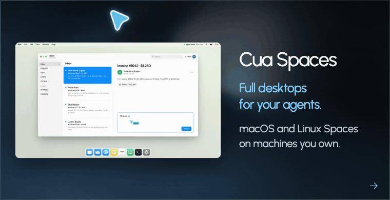
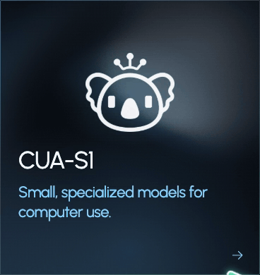
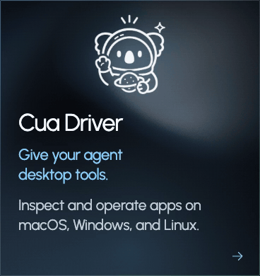
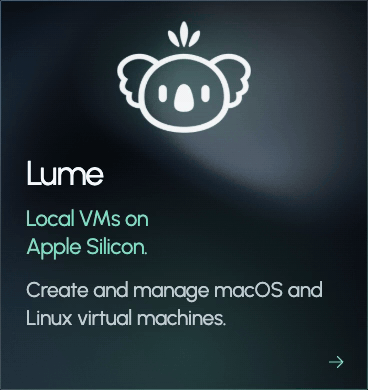
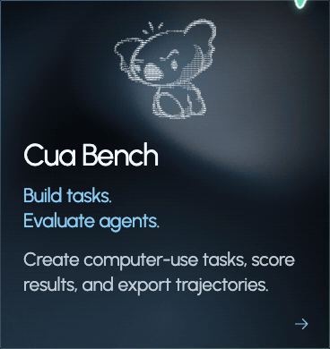

<div align="center">
  <a href="https://cua.ai" target="_blank" rel="noopener noreferrer">
    <picture>
      <source media="(prefers-color-scheme: dark)" alt="Cua logo" width="150" srcset="img/logo_white.svg">
      <source media="(prefers-color-scheme: light)" alt="Cua logo" width="150" srcset="img/logo_black.svg">
      
    </picture>
  </a>

  <p align="center"><strong>Give AI agents computers they can use.</strong><br>Cua Spaces gives your agents full desktops on your Mac and on machines you own. This repository also holds Cua Driver for desktop automation, Lume for local VMs, CUA-S1 decision models and Cua Bench for evaluating computer-use agents.</p>

  <p align="center"><strong><a href="#cua-spaces">Get Cua Spaces for macOS</a></strong></p>

  <p align="center">
    <a href="https://cua.ai" target="_blank" rel="noopener noreferrer"></a>
    <a href="https://discord.gg/mVnXXpdE85" target="_blank" rel="noopener noreferrer"></a>
    <a href="https://x.com/trycua" target="_blank" rel="noopener noreferrer"></a>
    <a href="https://cua.ai/docs" target="_blank" rel="noopener noreferrer"></a>
    <br>
<a href="https://trendshift.io/repositories/13685" target="_blank"></a>
  </p>

</div>

## Choose your path

<div align="center">
  <table width="100%">
    <tr>
      <td colspan="2" align="center" valign="top" width="66.66%">
        <a href="#cua-spaces">
          
        </a>
      </td>
      <td align="center" valign="top" width="33.33%">
        <a href="https://github.com/trycua/cua/tree/main/libs/cua-s1">
          
        </a>
      </td>
    </tr>
    <tr>
      <td align="center" valign="top" width="33.33%">
        <a href="#cua-driver">
          
        </a>
      </td>
      <td align="center" valign="top" width="33.33%">
        <a href="#lume">
          
        </a>
      </td>
      <td align="center" valign="top" width="33.33%">
        <a href="#cua-bench">
          
        </a>
      </td>
    </tr>
  </table>
</div>

- **Cua Spaces:** [Install the app and run your first Space](https://cua.ai/docs/spaces/quickstart).
- **Cua Driver:** [Operate Calculator and verify its result](https://cua.ai/docs/cua-driver/quickstart).
- **Lume:** [Create a Tahoe VM and connect over SSH](https://cua.ai/docs/lume/quickstart).
- **Cua SDK and CLI:** [Install `cua` and create a local sandbox](#cua-sdk-and-cli).
- **CUA-S1:** [Explore small, specialized models for computer-use decisions](#cua-s1).
- **Cua Bench:** [Create and verify a simulated task](https://cua.ai/docs/cua-bench/quickstart).

Bring your own agent and model, or explore CUA-S1 for specialized decisions. Cua provides the computer and automation tools. [Computer-Use 2.0](https://cua.ai/docs/cua-driver/concepts/how-cua-driver-works) describes an agent moving between code, APIs, and graphical interfaces within the same task.

---

## Cua Spaces

Cua Spaces is a desktop app that gives your agents full desktops. Each desktop is a Space: a macOS VM built locally on your Mac, or a Linux or Omarchy image. Spaces run on your Mac, on other machines you own, and in [your own cloud account](https://cua.ai/docs/cua-sdk/guides/your-cloud) (AWS, Google Cloud or Modal), and the app keeps them in your menu bar and notch.

- **Teleport.** Move a signed-in app, such as Chrome or Slack, into a Space and it opens there still signed in. Your sessions stay in the Cua Keyvault, encrypted on your Mac, and reach a Space only after you approve.
- **Multiplayer.** You and your agents work on the same desktop, each with your own cursor. Step in to make a choice, then hand the desktop back.
- **Agent-ready images.** Spaces images ship with [cua-spacesd](libs/cua-spacesd/README.md), so agents get processes, files, screenshots and input as soon as a Space starts.

https://github.com/user-attachments/assets/a2ccc86b-10d0-48c0-bee6-7ae652ba1c59

**Install on macOS 26 or later**

```sh
curl -fsSL https://cua.ai/install.sh | sh
```

On macOS the installer selects the Cua Spaces app by default and adds the `cua` CLI. You can also [download the signed `.dmg`](https://github.com/trycua/cua/releases/download/cua-spaces-v0.1.0/cua-spaces-0.1.0-darwin-universal.dmg), or get the `.pkg` from the [Cua Spaces 0.1.0 release](https://github.com/trycua/cua/releases/tag/cua-spaces-v0.1.0).

Spaces is free for individuals. Pro and Teams plans are coming soon. The app is source-available under [FSL-1.1-MIT](#licensing).

**[Quickstart](https://cua.ai/docs/spaces/quickstart)** | **[Teleport an app](https://cua.ai/docs/spaces/guides/teleport-an-app)** | **[Share a Space](https://cua.ai/docs/spaces/guides/share-a-space)** | **[Host Spaces on a spare Mac (relay, Tailscale or SSH)](https://cua.ai/docs/start-here/host-spaces-on-your-spare-mac)** | **[Your own cloud](https://cua.ai/docs/cua-sdk/guides/your-cloud)** | **[App source](apps/cua-spaces-macos/README.md)**

---

## Cua Driver

Give your agent tools to inspect and operate native desktop apps and browsers on macOS, Windows, and Linux. Connect through the CLI, MCP, or typed SDKs. Background delivery lets agents work without moving your pointer or taking focus when the app and platform support it; see [platform support](https://cua.ai/docs/cua-driver/concepts/platform-support) for the boundaries.

**macOS / Linux**

```sh
/bin/bash -c "$(curl -fsSL https://cua.ai/driver/install.sh)"
```

**Windows (PowerShell)**

```powershell
irm https://cua.ai/driver/install.ps1 | iex
```

**Your first result:** connect your agent, ask it to compute 6 × 7 in Calculator, and have it verify that the app displays 42. The tutorial covers platform setup, permissions, and agent connection.

**[Drive your first app](https://cua.ai/docs/cua-driver/quickstart)** | **[Installation](https://cua.ai/docs/cua-driver/quickstart)** | **[CLI Reference](https://cua.ai/docs/cua-driver/reference/cli)**

Using Claude Code, Codex, Cursor, OpenClaw, or another agent? [Find your integration](https://cua.ai/docs/cua-driver/guides/connect-your-agent). Source documentation and architecture notes live in [`libs/cua-driver/README.md`](libs/cua-driver/README.md).

### See Cua Driver in action

Two Cua Driver sessions select cells in LibreOffice Calc and objects in Inkscape on an Omarchy desktop while a terminal stays in the foreground. Watch the 50-second demo.

https://github.com/user-attachments/assets/b4e5517c-d2db-4758-b4cf-07131b0753b2

---

## Lume

Create and manage local macOS and Linux VMs on Apple Silicon using Apple's Virtualization.Framework.

```bash
/bin/bash -c "$(curl -fsSL https://cua.ai/lume/install.sh)"
```

**Your first result:** create a vanilla macOS Tahoe VM from an Apple restore image, start it, and connect over SSH. The tutorial uses the Lume CLI directly and explains the unattended setup defaults.

**[Create your first Lume VM](https://cua.ai/docs/lume/quickstart)** | **[Installation](https://cua.ai/docs/lume/quickstart)** | **[CLI reference](https://cua.ai/docs/lume/reference/cli)**

---

## Cua SDK and CLI

One SDK and one `cua` command for local VMs and containers, and for any machine that runs [cua-spacesd](libs/cua-spacesd/README.md).

**macOS / Linux**

```sh
curl -fsSL https://cua.ai/install.sh | sh
```

**Windows (PowerShell)**

```powershell
irm https://cua.ai/install.ps1 | iex
```

In a terminal the script shows a short checklist: the `cua` CLI, the Cua Spaces app (default on macOS), the cua-driver MCP and skill for your agents, and hosting this machine. It then runs `cua auth login`, which signs you in and offers to install cua skills and the cua MCP server into your AI coding agents (Claude Code, Codex, Cursor, and others). Preselect items with `sh -s -- --select cua-driver`, or skip the checklist with `--only cua-driver`. See [the installer options](scripts/install/README.md).

```sh
cua sb create ubuntu --name dev          # a gVisor container, set up on first use
cua sb exec dev uname -a
cua sb screenshot dev
cua sb rm dev
```

The same sandbox from Python:

```python
from cua_sandbox import Image, Sandbox

async with Sandbox.ephemeral(Image.linux(), local=True) as sb:
    print((await sb.shell.run("uname -a")).stdout)
```

- **SDK:** the same API in Python (`pip install cua`), TypeScript (`@trycua/cua`), Swift (`Cua`) and Kotlin (generated bindings), running embedded in your process or through a shared `cua daemon`.
- **Sandboxes need no agent inside.** Readiness comes from the runtime and optional port probes. Images that ship cua-spacesd (port 3211) add processes, files, screenshots, input through cua-driver, and low-latency video and audio streaming.
- **Your own machines.** `cua host setup` makes this machine reachable through the cua.ai relay with no port forwarding.

**[SDK README](libs/cua/README.md)** | **[Quickstart](https://cua.ai/docs/cua-sdk/quickstart)** | **[CLI reference](https://cua.ai/docs/cua-cli/reference/cli)** | **[Sandbox SDK reference](https://cua.ai/docs/cua-sdk/reference/sandbox)**

---

## CUA-S1

CUA-S1 is our family of small, specialized System 1 models for computer use. We use "System 1" as an engineering analogy for fast, bounded decisions, such as choosing which value belongs in a field or whether to leave an element alone. It is not a strict classification of model architectures or a replacement for a general-purpose agent's planning and reasoning.

The first research profile focuses on forms: scoring decisions from structured interface elements and document values rather than generating a response token by token. Application code orders the actions, and the optional Cua Driver integration handles execution with explicit action boundaries.

The project includes Python model code, synthetic-data generation, training, and evaluation. The GitHub component is an early, source-only research release; model weights are hosted separately on Hugging Face. The source is MIT-licensed. Check each model and dataset card for its scope, limitations, and artifact-specific license.

**[Explore CUA-S1](libs/cua-s1)** | **[Model card](libs/cua-s1/MODEL_CARD.md)** | **[Safety and deployment guidance](libs/cua-s1/SECURITY.md)**

**CUA-S1-FORMS on Hugging Face:** **[Model weights](https://huggingface.co/cua-ai/cua-s1-forms)** | **[Dataset](https://huggingface.co/datasets/cua-ai/cua-s1-forms)**

---

## Cua Bench

Build computer-use tasks, evaluate agents, and export trajectories for training. Start with a simulated task that requires no VM, Docker, or model API key.

With Python 3.12 or 3.13 and [uv](https://docs.astral.sh/uv/) installed:

```bash
uv tool install 'cua-bench[browser]'
uv tool run --from 'cua-bench[browser]' playwright install chromium
```

**Your first result:** create a small task, run its reference solution, and verify that its evaluator reports a reward of `1.0`. Then try the same task yourself.

**[Build your first task](https://cua.ai/docs/cua-bench/quickstart)** | **[What is Cua-Bench?](https://cua.ai/docs/cua-bench)** | **[CLI reference](https://cua.ai/docs/cua-bench/reference/cli)** | **[Partner with us](https://cuabench.ai/)**

---

## Packages

| Package                                                 | Description                                                                          |
| ------------------------------------------------------- | ------------------------------------------------------------------------------------ |
| [cua-driver](libs/cua-driver/README.md)                 | Background computer-use agent for macOS, Windows, and Linux                          |
| [cua SDK and CLI](libs/cua/README.md)                   | Rust core and the `cua` command: sandboxes, local runtimes, images, Spaces           |
| [cua (Python)](libs/cua/python/README.md)               | The cua SDK for Python (`pip install cua`)                                           |
| [@trycua/cua](libs/cua/typescript/README.md)            | The cua SDK for Node and the browser, plus `@trycua/cua/spaces`                      |
| [Cua (Swift)](libs/cua/swift/README.md)                 | The cua SDK for Swift (SwiftPM, XCFramework)                                         |
| [cua-sandbox](libs/python/cua-sandbox/README.md)        | High-level Python `Sandbox`/`Image`/`Pool` API, a thin wrapper over the cua SDK      |
| [cua-spacesd](libs/cua-spacesd/README.md)         | In-sandbox daemon on port 3211: processes, files, desktop, streaming (gRPC)          |
| [Cua Spaces for macOS](apps/cua-spaces-macos/README.md) | The Spaces app on macOS: menu bar and notch, live streams, teleport, agent threads   |
| [Cua Spaces core](apps/cua-spaces/README.md)            | The shared Spaces app core, and the Tauri app for Linux and Windows                  |
| [cua-agent](libs/python/agent/README.md)                | AI agent framework for computer-use tasks                                            |
| [cua-bench](libs/cua-bench/README.md)                   | Benchmarks and RL environments for computer-use                                      |
| [lume](https://cua.ai/docs/lume/reference/cli) | macOS/Linux VM management on Apple Silicon                                          |
| [lumier](libs/lumier/README.md)                         | Docker-compatible interface for Lume VMs                                             |

---

## Resources

- [Documentation](https://cua.ai/docs): guides, examples, and API reference
- [Blog](https://cua.ai/blog): tutorials, updates, and research
- [Discord](https://discord.com/invite/mVnXXpdE85): community support and discussions
- [GitHub Issues](https://github.com/trycua/cua/issues): bug reports and feature requests
- [Security](SECURITY.md): private vulnerability reporting

## Citation

If Cua supports your research, please cite the software:

```bibtex
@software{cua2025,
  author  = {{Cua AI, Inc.}},
  title   = {Cua},
  year    = {2025},
  url     = {https://github.com/trycua/cua},
  license = {MIT}
}
```

For reproducibility, include the Cua release or commit used in your experiments. Citation metadata is also available in [`CITATION.cff`](CITATION.cff).

## Contributing

We welcome contributions. See our [Contributing Guidelines](CONTRIBUTING.md) for details.

## Licensing

Everything outside Cua Spaces is MIT-licensed ([LICENSE](LICENSE.md)): the cua SDK and its Python, TypeScript, Swift and Kotlin packages, the `cua` command and `cua daemon`, Cua Driver, Lume and the rest of this repository unless a directory says otherwise.
Cua Spaces is source-available under [FSL-1.1-MIT](https://fsl.software): the Spaces apps, cua-spacesd, the Cua Keyvault, teleport, Cua Volume (`cua-volume`) and the streaming client, codecs and viewers. The streaming wire protocol stays MIT. It is free to use, self-host and build on, with no competing hosted service, and each release becomes MIT two years after it ships.
The MIT parts never depend on the FSL parts. Some subdirectories carry their own licence; [LICENSING.md](LICENSING.md) lists each one and how the two fit together.
Offering Spaces as a hosted or managed service? See [COMMERCIAL.md](COMMERCIAL.md). For use of our names and logo, see [TRADEMARKS.md](TRADEMARKS.md).

Third-party components have their own licenses:

- [Kasm](libs/kasm/LICENSE) (MIT)
- [`cua-som`](libs/python/som) is an optional package licensed under
  AGPL-3.0-or-later. Its Ultralytics dependency retains its own license; inspect
  the resolved dependency version and its notices before redistribution.
- The Microsoft OmniParser repository [states
  CC-BY-4.0](https://github.com/microsoft/OmniParser/blob/master/LICENSE) for its
  repository content. Model files downloaded from the separate OmniParser model
  repository are distinct artifacts; verify the terms published with the exact
  model revision before redistributing them.
- The optional `cua-perception` extension is installed separately from the MIT
  Cua Driver, from the signed assets of a `cua-perception-v<version>` GitHub
  release. Each release combines an AGPL-3.0-only OmniParser model artifact,
  Apache-2.0 PP-OCR model artifacts, and a separately packaged ONNX Runtime.
  The extension is not MIT licensed. Redistributing it, or offering it
  to users over a network, can trigger AGPL-3.0 source obligations. Cua does
  not relicense the detector and cannot grant other terms for it. Read the
  [perception third-party notices and precautions](libs/cua-driver/docs/perception-third-party-notices.md)
  before you install, redistribute, or host an extension artifact.

## Trademarks

Apple, macOS, Ubuntu, Canonical, and Microsoft are trademarks of their respective owners. This project is not affiliated with or endorsed by these companies.

---

## Sponsors

<div align="center">

Thank you to all our [GitHub Sponsors](https://github.com/sponsors/trycua).

|                                                       [Adam Cohen Hillel](https://github.com/adamcohenhillel)                                                        |                                                         [CodeRabbit](https://github.com/coderabbitai)                                                         |                                                         [Zephyr Cloud IO](https://github.com/ZephyrCloudIO)                                                         |
| :------------------------------------------------------------------------------------------------------------------------------------------------------------------: | :-----------------------------------------------------------------------------------------------------------------------------------------------------------: | :-----------------------------------------------------------------------------------------------------------------------------------------------------------------: |
| <a href="https://github.com/adamcohenhillel"></a> | <a href="https://github.com/coderabbitai"></a> | <a href="https://github.com/ZephyrCloudIO"></a> |

</div>
