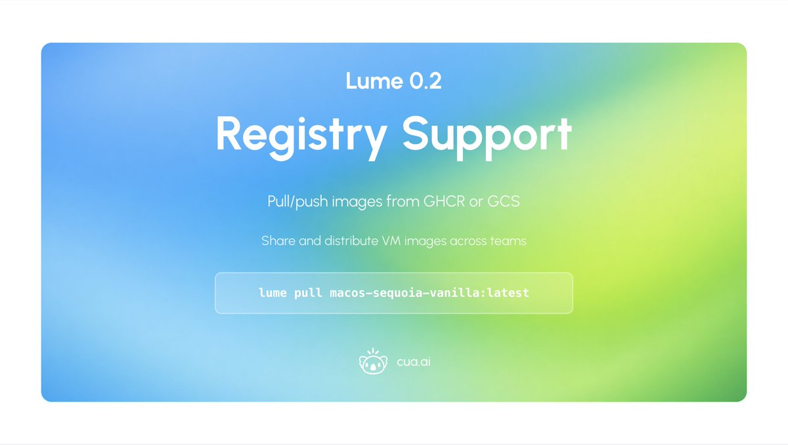

# Day 1 of 5 Days of OSS Releases: Lume 0.2

_Published on January 29, 2026 by the Cua Team_

One year ago, Cua started with an experiment deploying a computer-use agent on a macOS VM. Ahead of what's coming next, we've revamped the Lume CLI based on real-world usage deploying agents to customers.

## Unattended Setup

Apple provides no headless provisioning for macOS. So we built a VNC + OCR system that clicks through Setup Assistant like a human would - language, country, user account, terms, accessibility settings. Go from IPSW to a fully configured VM without touching the keyboard. Write custom YAML configs to set up any macOS version your way.


```bash
lume create my-vm --os macos --ipsw latest --unattended tahoe
```

## HTTP API + Daemon

A REST API on port 7777 that runs as a background service. Your scripts and CI pipelines can create, start, stop, and clone VMs programmatically. VMs persist even if your terminal closes.


```bash
curl -X POST localhost:7777/lume/vms/my-vm/run -d '{"noDisplay": true}'
```

## MCP Server

Native integration with Claude Cowork, Claude Code and AI coding agents. Add Lume to your Claude config and ask it to "create a sandbox VM and run my tests" - it just works. Perfect for agentic workflows that need isolated macOS environments.


See our example cookbooks for spinning up macOS sandboxes in Claude Cowork: [https://cua.ai/docs/lume/examples](https://cua.ai/docs/lume/examples)

## Multi-location Storage

macOS disk space is always tight. Now you can add external SSDs as storage locations and move VMs between them. Keep your working VMs on fast internal storage, archive others to external drives.


```bash
lume config storage add external-ssd /Volumes/ExternalSSD/lume
lume clone my-vm backup --dest-storage external-ssd
```

## Registry Support

Push and pull VM images to GHCR or GCS like Docker images. Create a golden image once with all your tools and configs, push it to a registry, and your whole team can pull it in seconds. No more shipping disk images around.

<div align="center">
  
</div>

```bash
lume push my-vm ghcr.io/myorg/my-vm:latest
lume pull ghcr.io/myorg/my-vm:latest
```


---

This is the foundation for what's coming next. Lume handles the VM layer on macOS - tomorrow we ship what runs on top.

**MIT licensed. Apple Silicon only.**

- [GitHub Repository](https://github.com/trycua/cua)
- [Lume Documentation](https://cua.ai/docs/lume)
