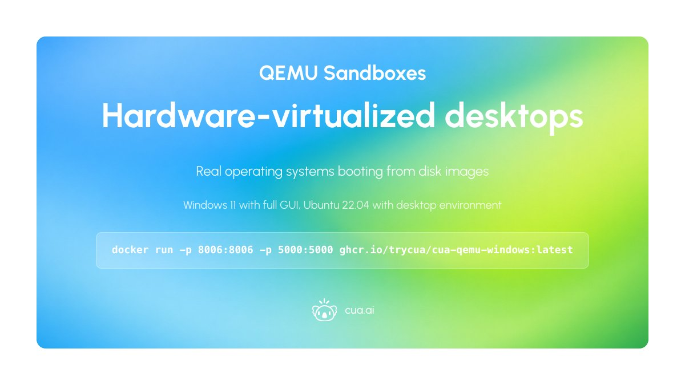
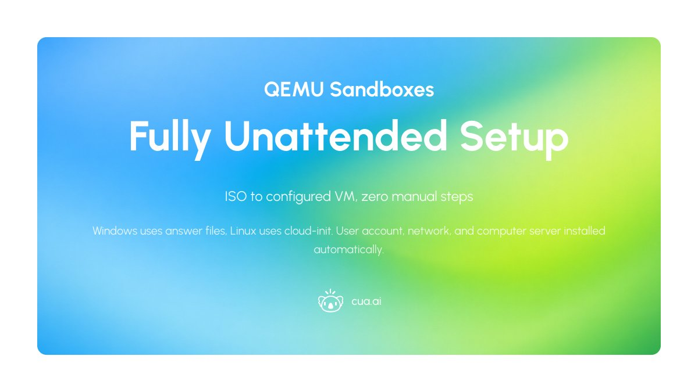
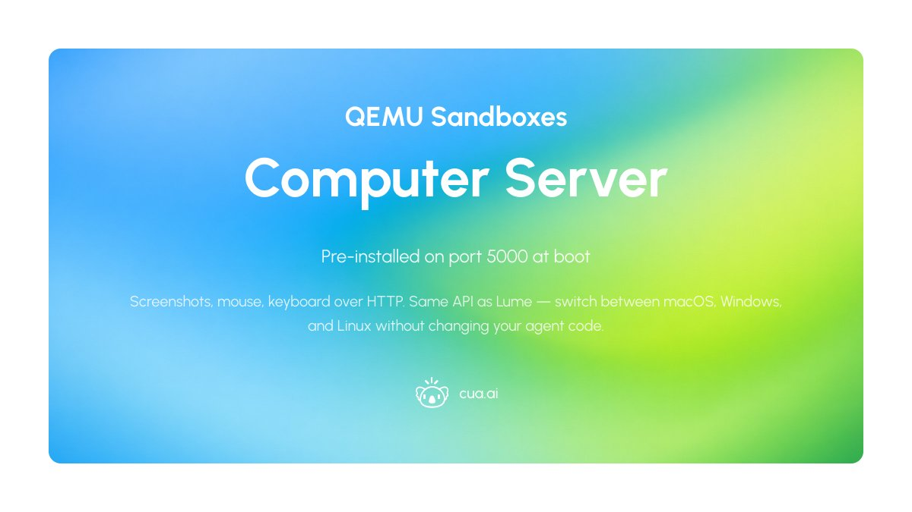
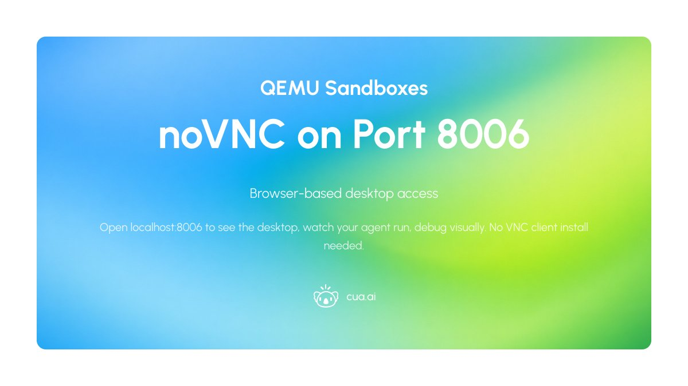
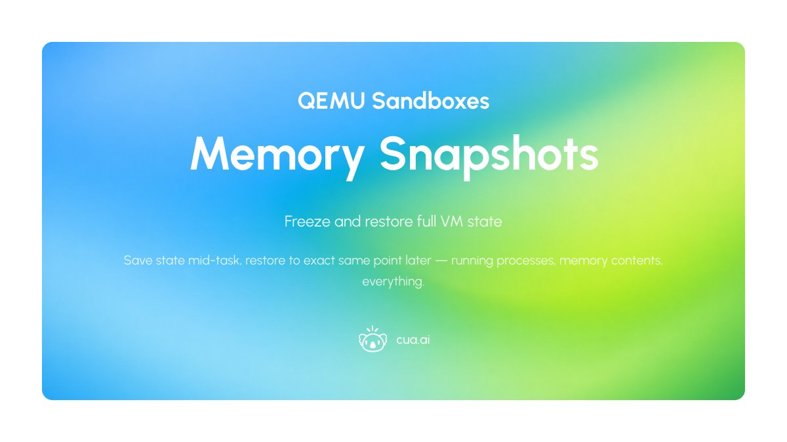
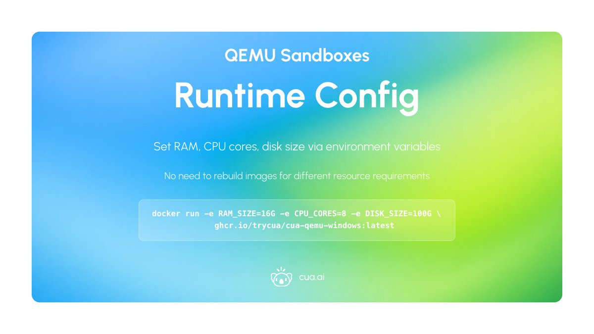
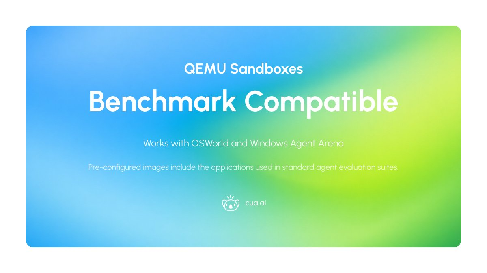

# Day 2 of 5 Days of OSS Releases: QEMU Sandboxes

_Published on January 30, 2026 by the Cua Team_

Today we're releasing Windows 11 and Ubuntu VMs running in Docker via QEMU/KVM, available for self-hosting and MIT-licensed.

## Hardware-virtualized Desktops

Real operating systems booting from disk images. Windows 11 with full GUI, Ubuntu 22.04 with desktop environment. GPU passthrough supported for running local models on the sandbox or GUI apps that need graphics acceleration.

<div align="center">
  
</div>

```bash
docker run -p 8006:8006 -p 5000:5000 ghcr.io/trycua/cua-qemu-windows:latest
```

## Fully Unattended Setup

Windows uses an unattended answer file, Linux uses cloud-init. Go from ISO to configured VM with user account, network, and computer server installed — no manual steps.

<div align="center">
  
</div>

## Computer Server Pre-installed

cua-computer-server runs on port 5000 at boot. Screenshots, mouse, keyboard, all over HTTP. Same API as Lume sandboxes — switch between macOS, Windows, and Linux without changing your agent code. Built-in autoupdater keeps the server current without rebuilding images.

<div align="center">
  
</div>

## noVNC on Port 8006

Browser-based desktop access. Open localhost:8006 to see the desktop, watch your agent run, debug visually. No VNC client install needed.

<div align="center">
  
</div>

## Memory Snapshots

Freeze and restore full VM state via QEMU's snapshot support. Save state mid-task, restore to exact same point later — running processes, memory contents, everything.

<div align="center">
  
</div>

## Runtime Config

Set RAM, CPU cores, disk size via environment variables. No need to rebuild images for different resource requirements.

<div align="center">
  
</div>

```bash
docker run -e RAM_SIZE=16G -e CPU_CORES=8 -e DISK_SIZE=100G ghcr.io/trycua/cua-qemu-windows:latest
```

## Benchmark Compatible

Works with OSWorld and Windows Agent Arena. Pre-configured images include the applications used in standard agent evaluation suites.

<div align="center">
  
</div>

---

**Requires Docker and KVM support.**

- [GitHub Repository](https://github.com/trycua/cua)
- [Desktop Sandbox Documentation](https://cua.ai/docs/cua/guide/get-started/what-is-desktop-sandbox)
