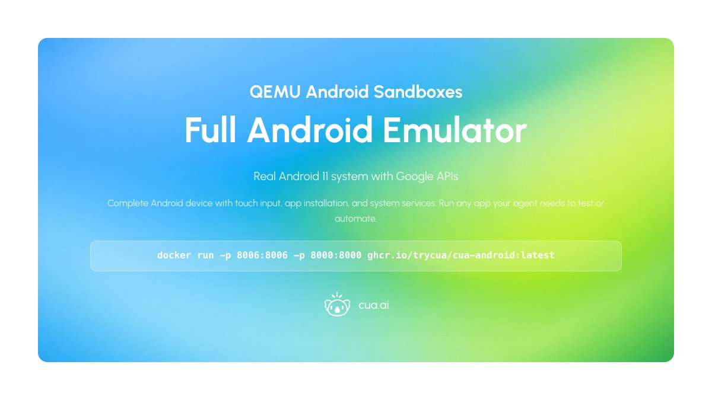
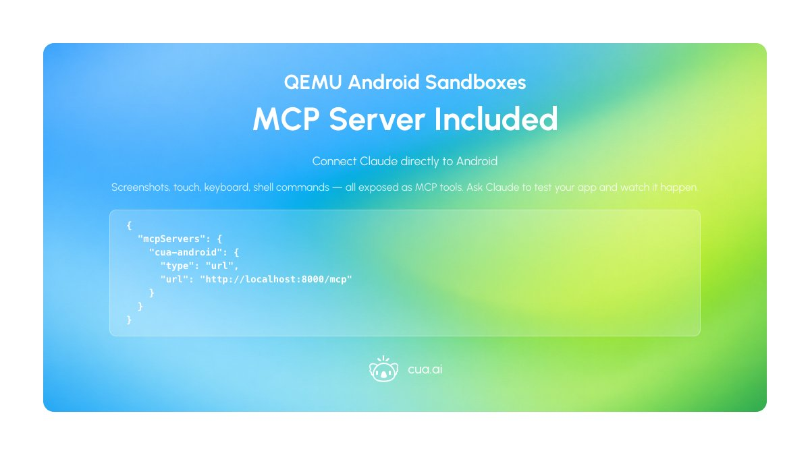
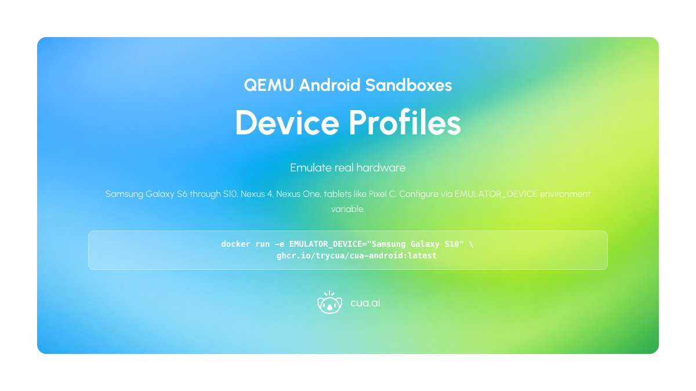
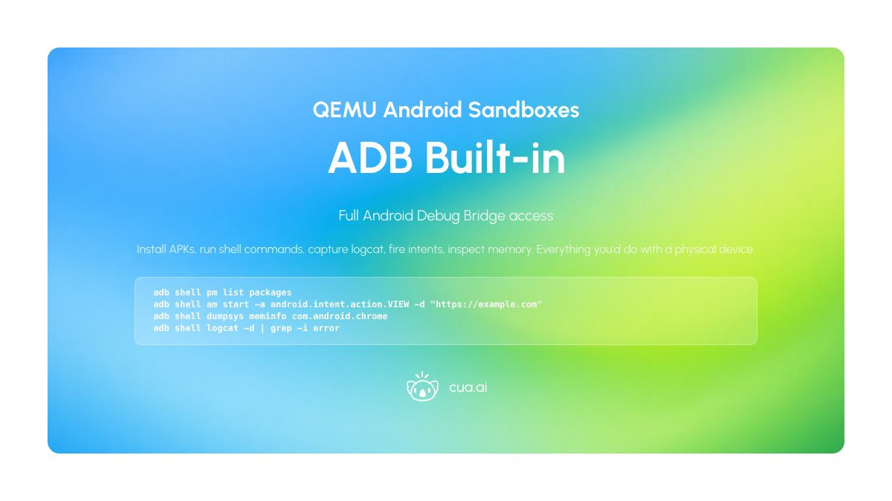
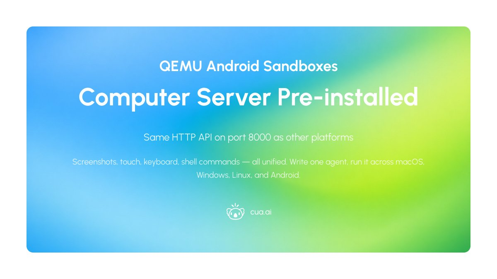
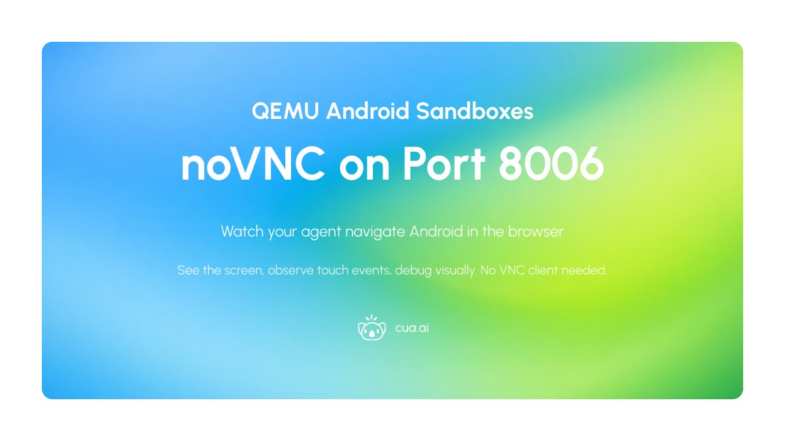
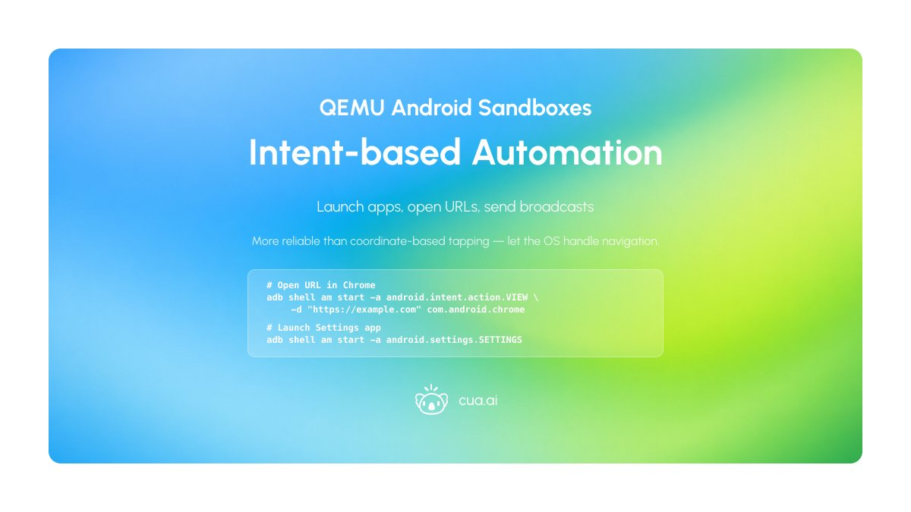
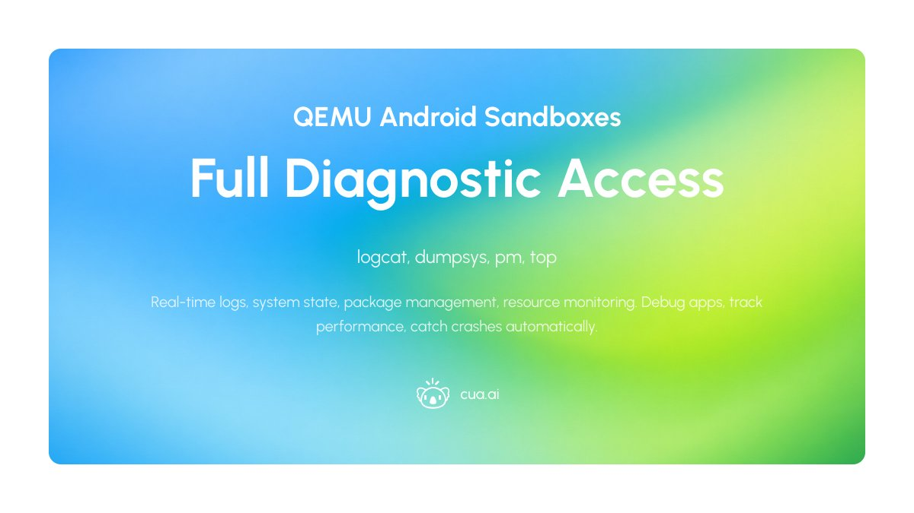
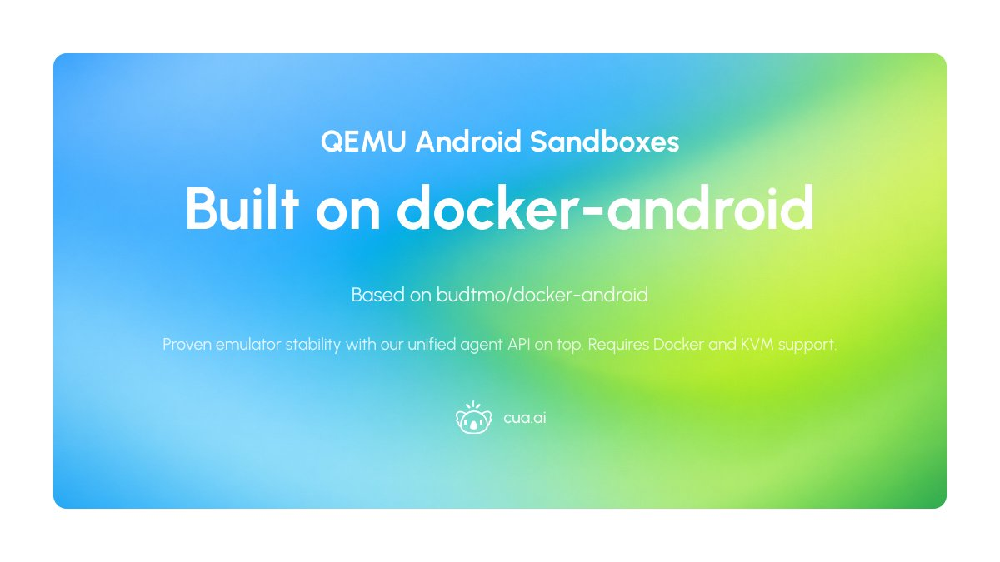

# Day 3 of 5 Days of OSS Releases: QEMU Android Sandboxes

_Published on January 31, 2026 by the Cua Team_

We're halfway through 5 Days of OSS Releases! Today we're releasing QEMU Android Sandboxes running in Docker, available for self-hosting and MIT-licensed.

## Full Android Emulator

Real Android 11 system with Google APIs running via QEMU/KVM. A complete Android device with touch input, app installation, and system services. Run any app your agent needs to test or automate.

<div align="center">
  
</div>

```bash
docker run -p 8006:8006 -p 8000:8000 ghcr.io/trycua/cua-android:latest
```

## MCP Server Included

Connect Claude Code, Claude Desktop, or any MCP-compatible client directly to the Android device over HTTP. Screenshots, touch, keyboard, shell commands — all exposed as MCP tools. Ask Claude to test your app and watch it happen.

<div align="center">
  
</div>

```json
{
  "mcpServers": {
    "cua-android": {
      "type": "url",
      "url": "http://localhost:8000/mcp"
    }
  }
}
```

## Device Profiles

Emulate real hardware. Samsung Galaxy S6 through S10, Nexus 4, Nexus One, tablets like Pixel C. Configure via EMULATOR_DEVICE environment variable.

<div align="center">
  
</div>

```bash
docker run -e EMULATOR_DEVICE="Samsung Galaxy S10" ghcr.io/trycua/cua-android:latest
```

## ADB Built-in

Full Android Debug Bridge access. Install APKs, run shell commands, capture logcat, fire intents, inspect memory. Everything you'd do with a physical device, all from the container.

<div align="center">
  
</div>

```bash
adb shell pm list packages
adb shell am start -a android.intent.action.VIEW -d "https://example.com"
adb shell dumpsys meminfo com.android.chrome
adb shell logcat -d | grep -i error
```

## Computer Server Pre-installed

Same HTTP API on port 8000 as macOS, Windows, and Linux sandboxes. Screenshots, touch, keyboard, shell commands — all unified. Write one agent, run it across every platform.

<div align="center">
  
</div>

## noVNC on Port 8006

Watch your agent navigate Android in the browser. See the screen, observe touch events, debug visually. No VNC client needed.

<div align="center">
  
</div>

## Intent-based Automation

Launch apps, open URLs, send broadcasts via Android intents. More reliable than coordinate-based tapping — let the OS handle navigation.

<div align="center">
  
</div>

```bash
# Launch Settings app
adb shell am start -a android.settings.SETTINGS

# Open URL in Chrome
adb shell am start -a android.intent.action.VIEW -d "https://example.com" com.android.chrome
```

## Full Diagnostic Access

logcat for real-time logs, dumpsys for system state, pm for package management, top for resource monitoring. Debug apps, track performance, catch crashes automatically.

<div align="center">
  
</div>

## Built on docker-android

Based on budtmo/docker-android with cua-computer-server added. Proven emulator stability with our unified agent API on top.

<div align="center">
  
</div>

---

**Requires Docker and KVM support.**

- [GitHub Repository](https://github.com/trycua/cua)
- [Desktop Sandbox Documentation](https://cua.ai/docs/cua/guide/get-started/what-is-desktop-sandbox)
