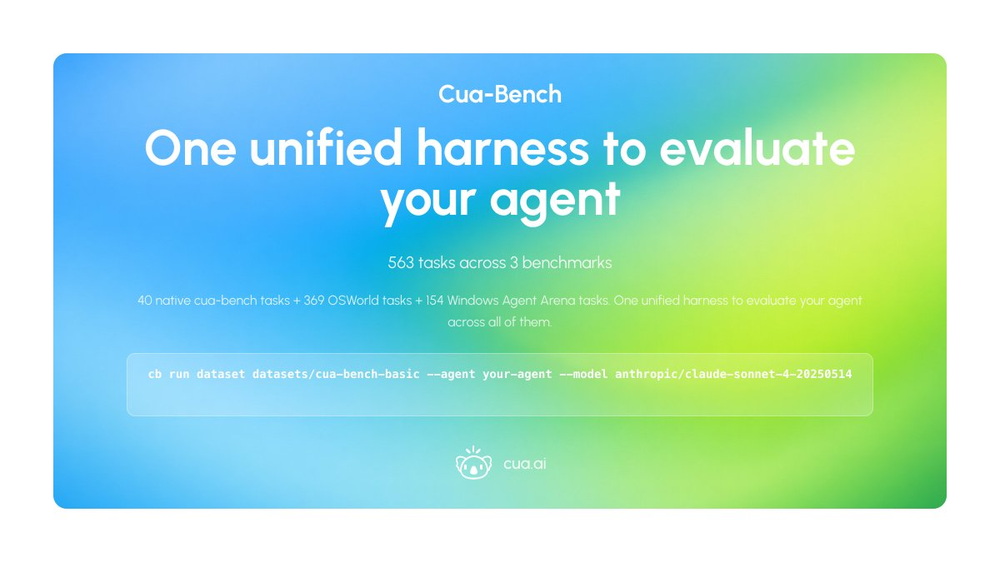
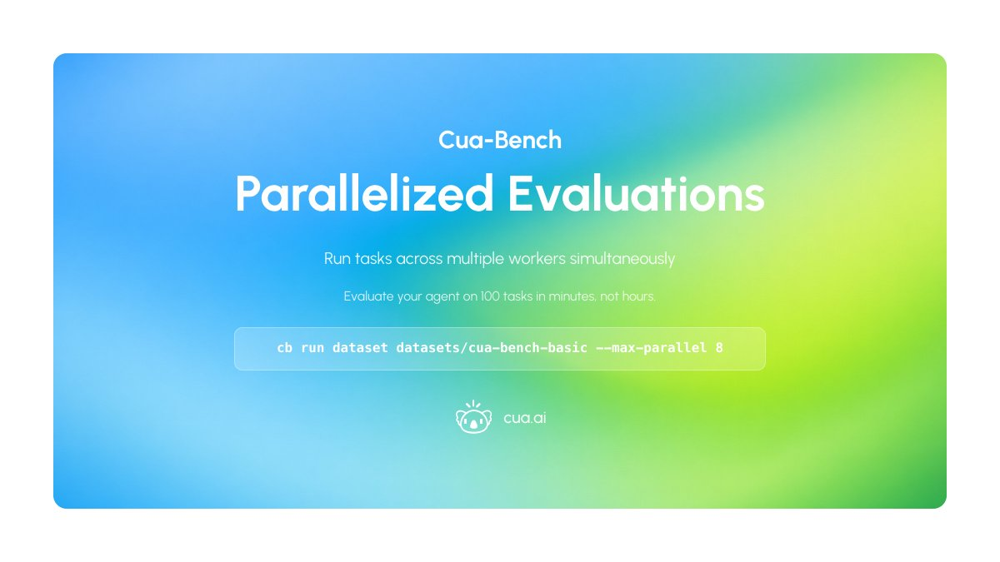
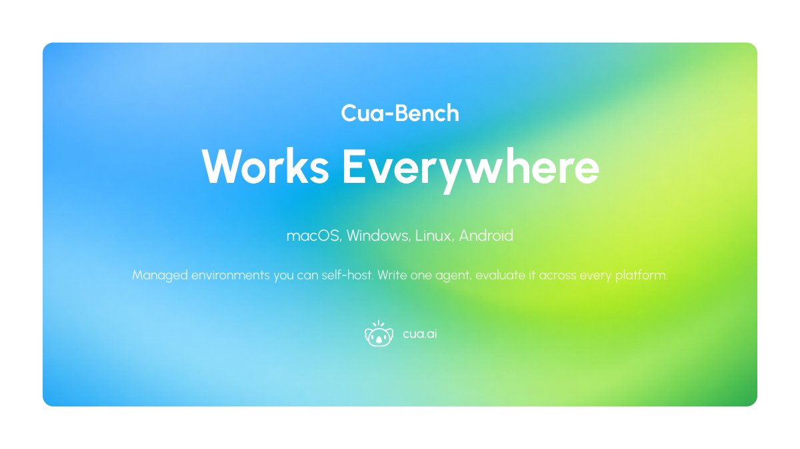
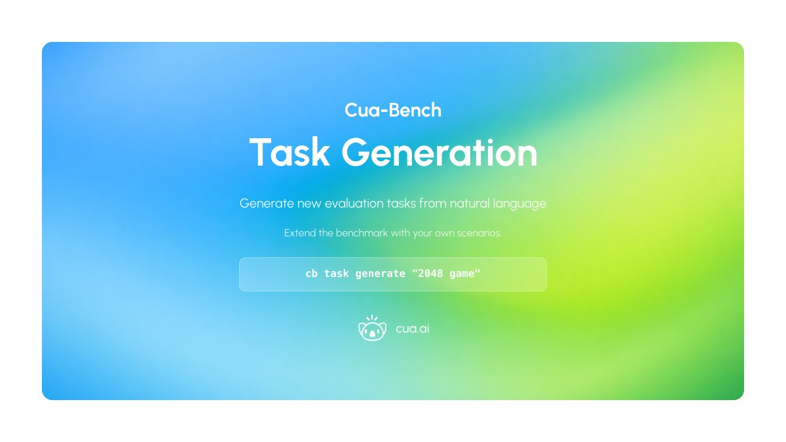
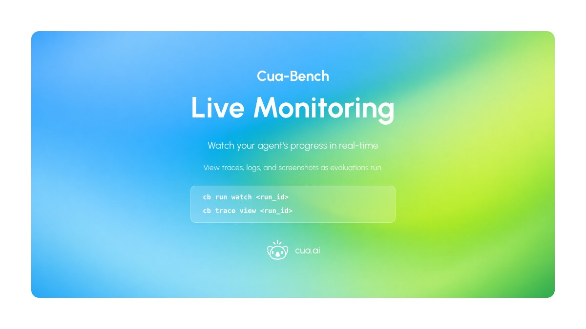
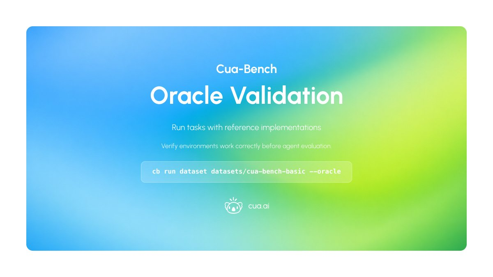
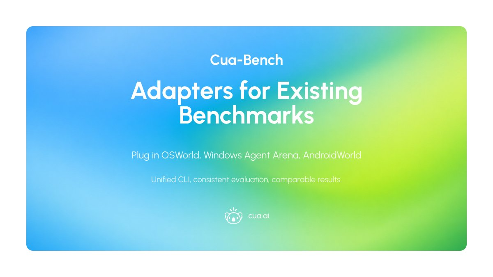
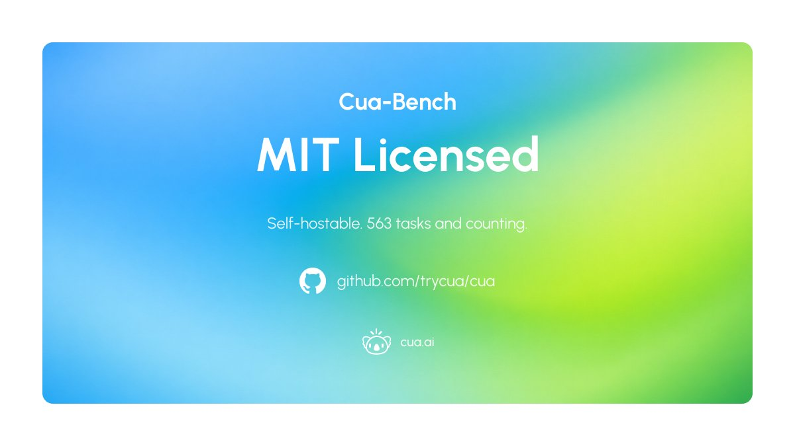

# Day 4 of 5 Days of OSS Releases: Cua-Bench

_Published on February 1, 2026 by the Cua Team_

Day 4 — the benchmark we use internally—and with customers—to evaluate CUA agents. Now open-source and MIT-licensed.

## 563 Tasks Across 3 Benchmarks

40 native cua-bench tasks + 369 OSWorld tasks + 154 Windows Agent Arena tasks. One unified harness to evaluate your agent across all of them.

<div align="center">
  
</div>

```bash
cb run dataset datasets/cua-bench-basic --agent your-agent --model anthropic/claude-sonnet-4-20250514
```

## Parallelized Evaluations

Run tasks across multiple workers simultaneously. Evaluate your agent on 100 tasks in minutes, not hours.

<div align="center">
  
</div>

```bash
cb run dataset datasets/cua-bench-basic --max-parallel 8
```

## Works Everywhere

macOS, Windows, Linux, Android. Managed environments you can self-host. Write one agent, evaluate it across every platform.

<div align="center">
  
</div>

## Interactive Exploration

Step through any task manually before running your agent. Understand what you're evaluating.

<div align="center">
  
</div>

```bash
cb interact tasks/slack_env --variant-id 0
```

## Task Generation

Generate new evaluation tasks from natural language descriptions. Extend the benchmark with your own scenarios.

<div align="center">
  
</div>

```bash
cb task generate "2048 game"
```

## Live Monitoring

Watch your agent's progress in real-time. View traces, logs, and screenshots as evaluations run.

<div align="center">
  
</div>

```bash
cb run watch <run_id>
cb trace view <run_id>
```

## Oracle Validation

Run tasks with reference implementations to verify environments work correctly before agent evaluation.

<div align="center">
  
</div>

```bash
cb run dataset datasets/cua-bench-basic --oracle
```

## Adapters for Existing Benchmarks

Plug in OSWorld, Windows Agent Arena, AndroidWorld. Unified CLI, consistent evaluation, comparable results.

<div align="center">
  
</div>

---

<div align="center">
  
</div>

**MIT licensed. Self-hostable. 563 tasks and counting.**

- [GitHub Repository](https://github.com/trycua/cua)
