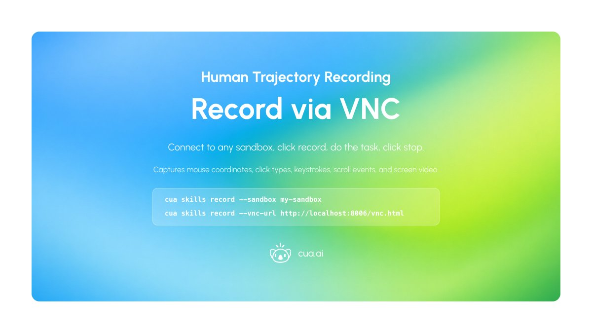
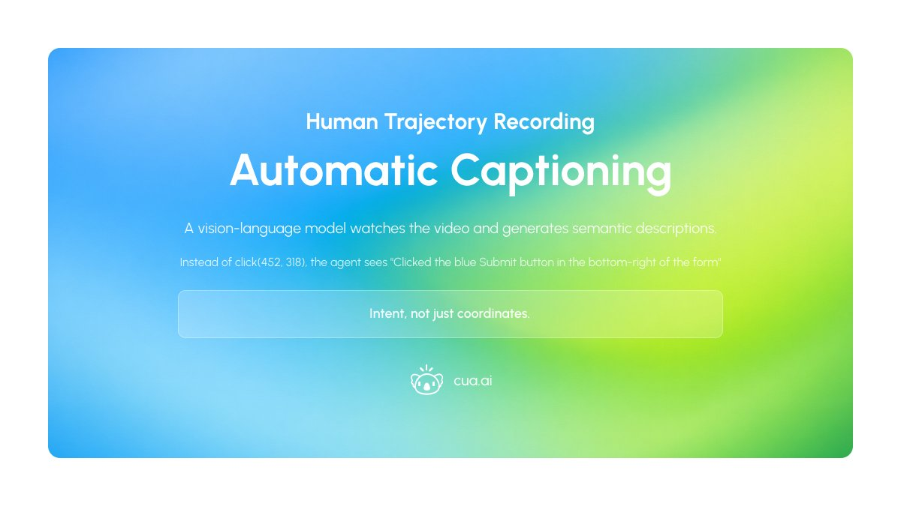
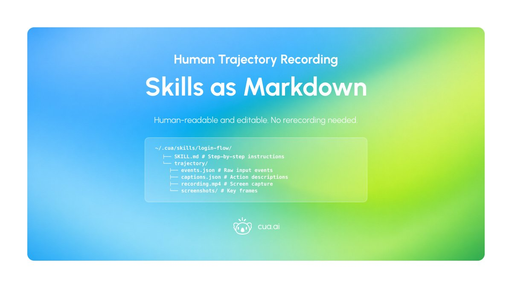
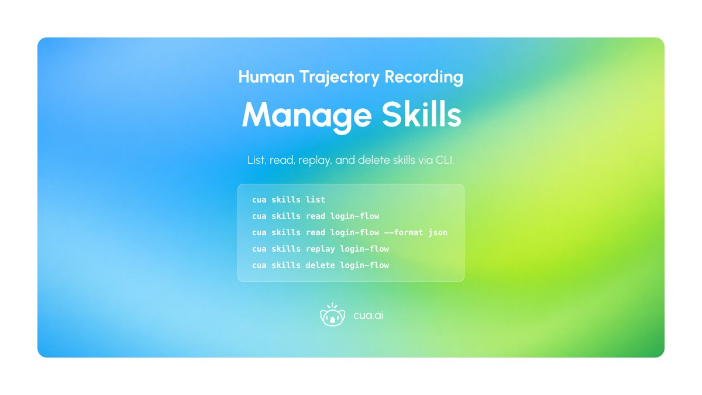
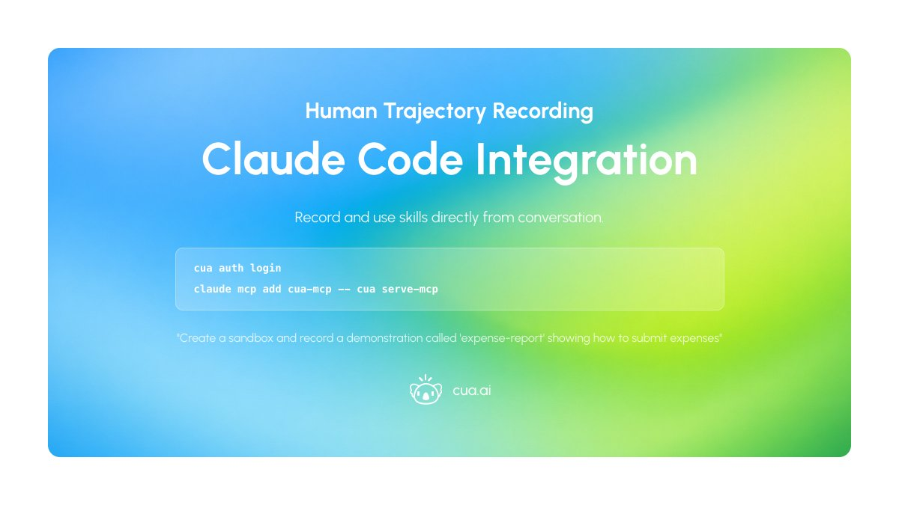
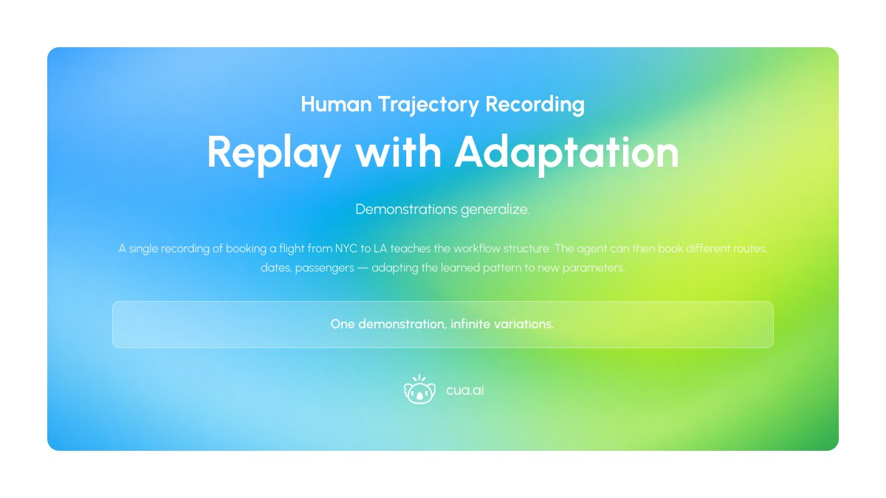
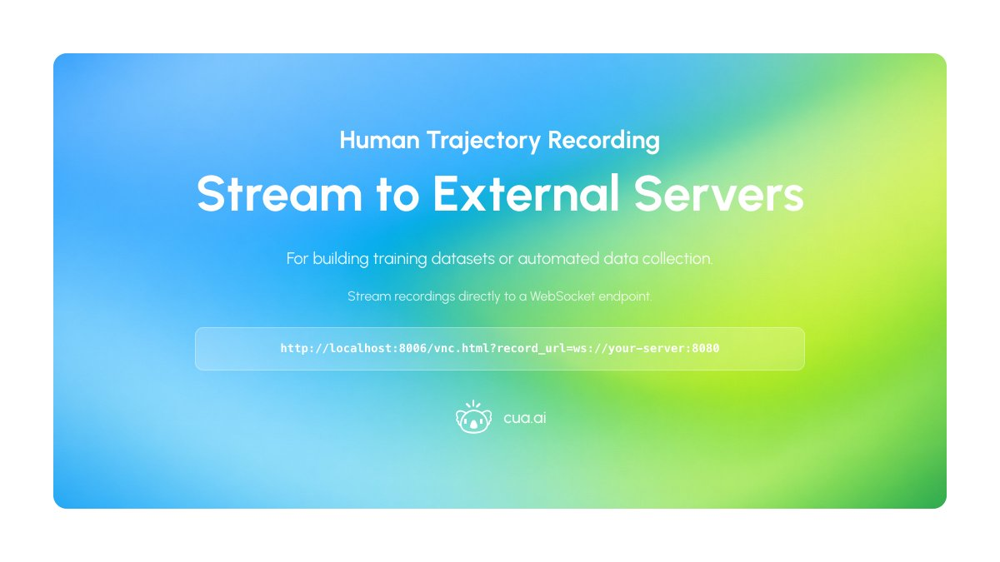
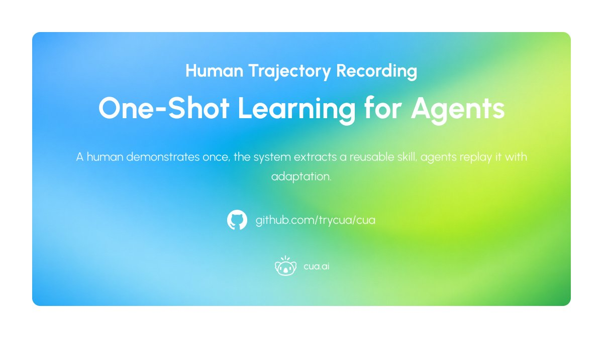

# Day 5 of 5 Days of OSS Releases: Human-Taught Skills for Claude Code / Cowork Agents

_Published on February 2, 2026 by the Cua Team_

Final day of OSS releases. We're shipping one of the most requested OSS features — trajectory recording — and more!

The workflow: recording a human demonstration via noVNC, turning it into a Claude skill, then a CUA agent replaying it on the same spreadsheets task from the ShowUI-Aloha paper. ShowUI-Aloha measured 60% success on OSWorld tasks with human demonstrations vs 31% zero-shot.

## Record via VNC

Connect to any sandbox, click record, do the task, click stop. The system captures everything: mouse coordinates, click types, keystrokes, scroll events, and screen video at the native resolution. Works with cloud sandboxes, Docker containers, or any VNC URL.

The recorder runs in the browser — no additional software to install. Add `autorecord=1` to the URL to start capturing immediately on connection.

<div align="center">
  
</div>

```bash
cua skills record --sandbox my-sandbox
cua skills record --vnc-url http://localhost:8006/vnc.html
```

## Automatic Captioning

Raw event logs aren't useful for language models. So after recording, a vision-language model watches the video and generates semantic descriptions for each action. Instead of `click(452, 318)`, the agent sees "Clicked the blue Submit button in the bottom-right of the form". These captions capture intent, not just coordinates.

The processing extracts key frames, correlates them with input events, and outputs a structured trajectory with timestamps, screenshots, actions, and natural language descriptions.

<div align="center">
  
</div>

## Skills as Markdown

Each skill saves to `~/.cua/skills/<name>/` containing:

<div align="center">
  
</div>

```
~/.cua/skills/login-flow/
├── SKILL.md              # Description + step-by-step instructions
└── trajectory/
    ├── events.json       # Raw input events with timestamps
    ├── captions.json     # VLM-generated action descriptions
    ├── recording.mp4     # Screen capture video
    └── screenshots/      # Key frames as PNGs
```

The SKILL.md file is human-readable and editable. Fix a typo in the instructions, add clarifying notes, adjust for UI changes — no rerecording needed.

## Manage Skills

List, read, replay, and delete skills via CLI.

<div align="center">
  
</div>

```bash
cua skills list                          # View all skills
cua skills read login-flow               # Display SKILL.md
cua skills read login-flow --format json # Include trajectory data
cua skills replay login-flow             # Watch the recording
cua skills delete login-flow             # Remove a skill
```

## Claude Code Integration

Add the Cua MCP server to Claude Code:

<div align="center">
  
</div>

```bash
cua auth login
claude mcp add cua-mcp -- cua serve-mcp
```

Now you can record and use skills directly from conversation:

- "Create a sandbox and record a demonstration called 'expense-report' showing how to submit expenses"
- "Read the expense-report skill and replay those steps on my-sandbox"
- "Use the expense-report skill but submit a different amount this time"

Claude opens the VNC interface, you demonstrate the workflow, it processes and saves the skill, then uses it to guide future runs.

## Replay with Adaptation

The key insight from ShowUI-Aloha: demonstrations generalize. A single recording of booking a flight from NYC to LA teaches the agent the booking workflow structure. It can then book different routes, dates, passengers — adapting the learned pattern to new parameters. Same for filling forms, navigating settings, editing documents.

Load a skill into context, describe what's different this time, and the agent follows the demonstrated sequence while substituting new values where appropriate.

<div align="center">
  
</div>

## Stream to External Servers

For building training datasets or automated data collection, stream recordings directly to a WebSocket endpoint instead of downloading manually:

<div align="center">
  
</div>

```bash
http://localhost:8006/vnc.html?record_url=ws://your-server:8080
```

The recording data arrives as a websockify stream, ready for processing the moment the session ends.

---

<div align="center">
  
</div>

**One-shot learning for computer-use agents.** A human demonstrates once, the system extracts a reusable skill, agents replay it with adaptation. The same approach that doubled success rates in academic benchmarks, now available as an open tool.

- [GitHub Repository](https://github.com/trycua/cua)
- [Human Demonstrations Example](https://cua.ai/docs/cua/examples/claude-code/human-demonstrations)
- [Demonstration-Guided Skills](https://cua.ai/docs/cua/guide/advanced/demonstration-guided-skills)
- [VNC Recorder Documentation](https://cua.ai/docs/cua/guide/advanced/vnc-recorder)
