# A Story of Computer-Use: Where We Started, Where We're Headed

_Published on February 5, 2026 by the Cua Team_

Last week, Clawdbot went from a niche open-source project to 80,000 GitHub stars. TechCrunch wrote about it. Everyone's suddenly talking about "computer-use agents."

  

But this didn't happen overnight. The idea of AI agents that can see your screen and click around has been brewing for almost a decade. Here's the timeline of how we got here—and why it's all converging now.

## 2016: The Seed

OpenAI released Universe—a platform for training AI on games and websites. The pitch: measure intelligence by how well AI can navigate the same digital environments humans use.

  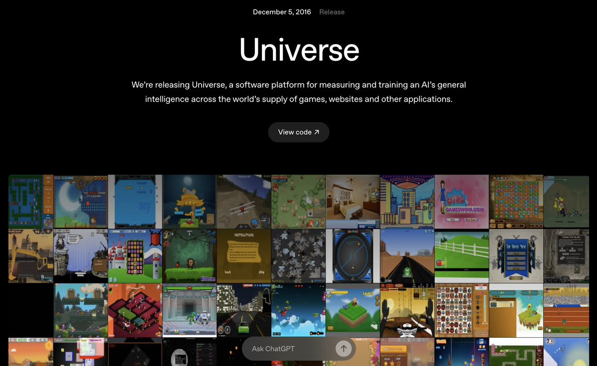

It was too early. The models weren't there. But the idea was planted: **pixels in, actions out**.

## 2023: Vision Arrives

Everything changed when GPT-4V dropped. Suddenly we had models that could actually _see_.

  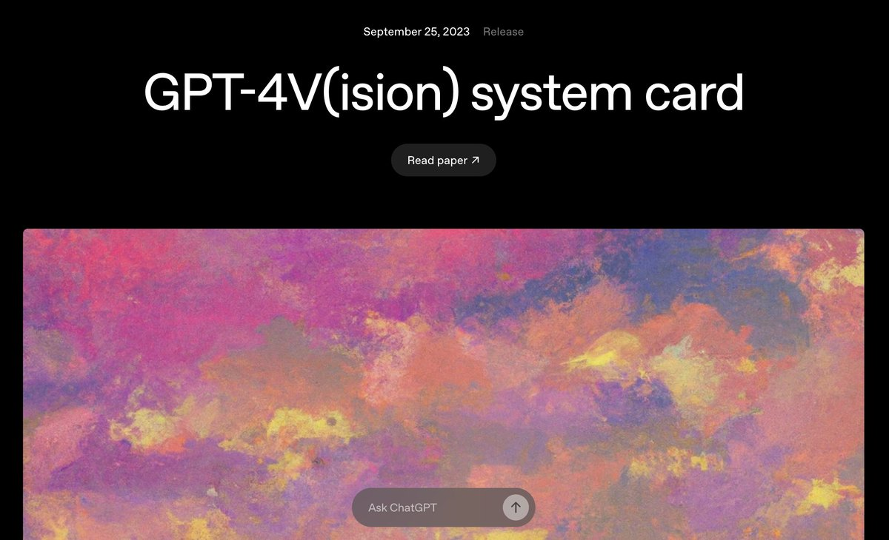

Andrej Karpathy started riffing on "LLM OS"—the idea that language models could become the CPU of a new kind of computer, with peripherals like video, audio, browsers, and file systems all connected.

  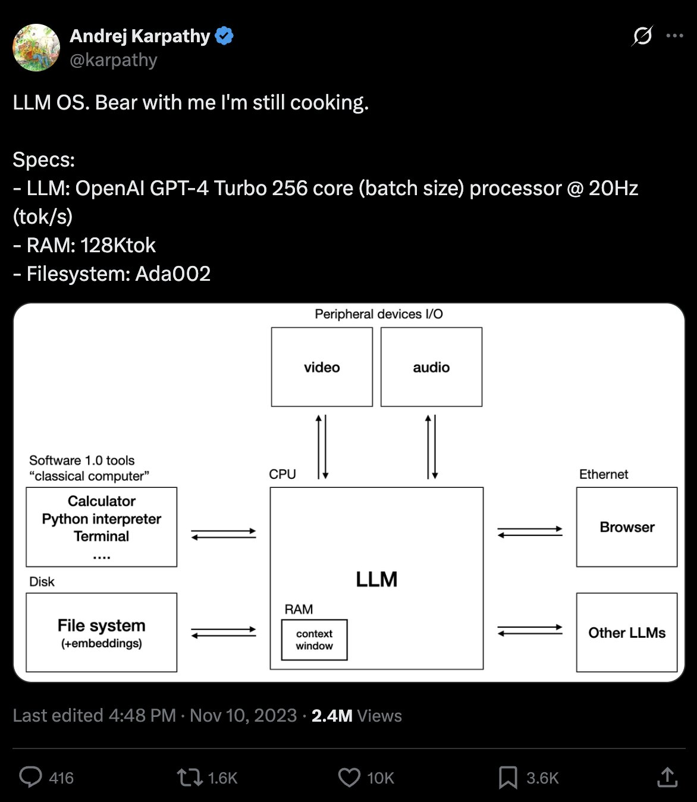

People started building. GPT-4V-Act appeared on Reddit—a proof-of-concept browser agent that could actually navigate websites.

  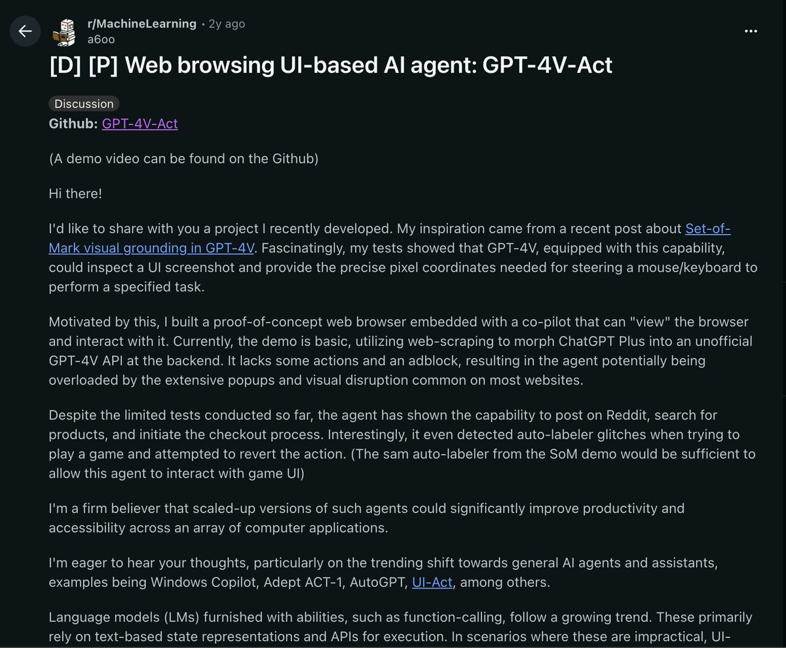

Microsoft started talking about "The AI PC"—local agents running on your machine, controlling your computer.

  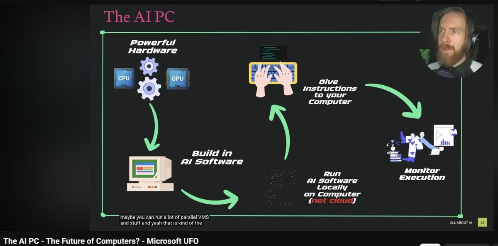

## The Gap

But there was a problem. The benchmark numbers were brutal:

  

Humans: 72%. Best AI: ~12%.

The models could see, but they couldn't act reliably. Every demo looked impressive until you tried it yourself.

## Late 2024: The Race Begins

Microsoft released OmniParser—a way to convert screenshots into structured elements that models could reason about.

  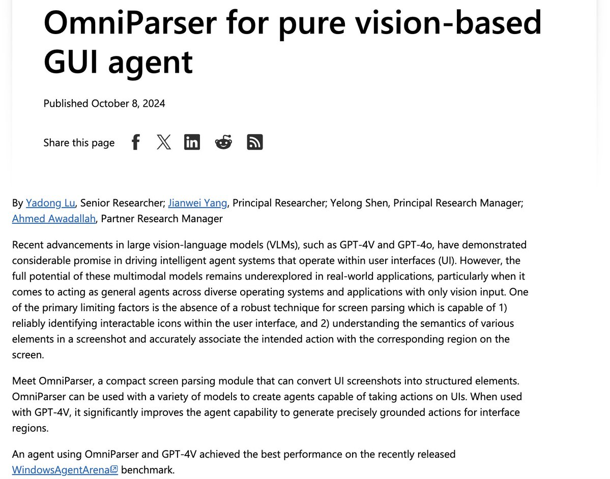

Then Anthropic made their move. October 22, 2024: Claude Computer Use.

  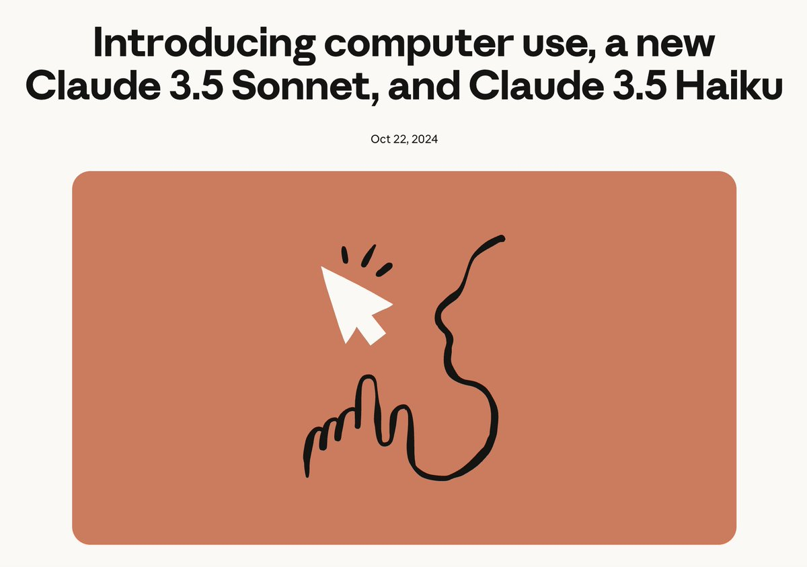

Ethan Mollick wrote about it immediately: "When you give a Claude a mouse."

  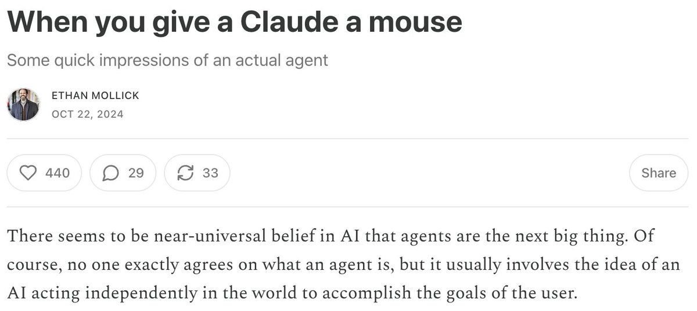

A week later, Browser-Use hit Hacker News—open-source browser automation that anyone could run. 77K stars eventually.

  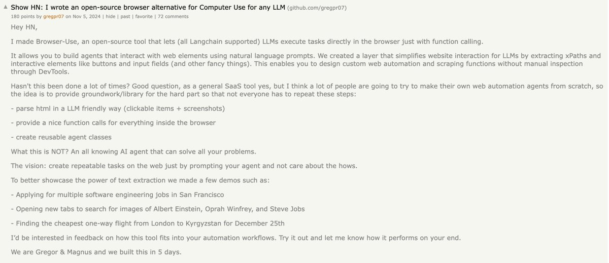

## 2025: Mainstream Adoption

January 2025: OpenAI launched Operator. Computer-use for the masses.

  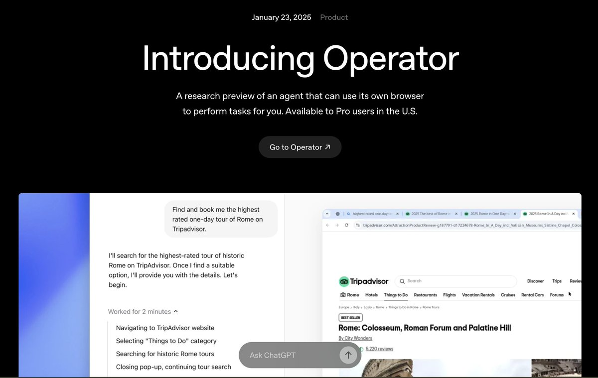

The benchmarks started improving:

  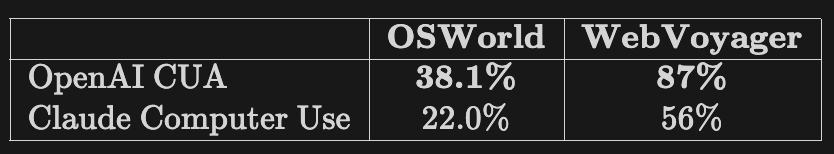

March 2025: Manus AI came out of nowhere with a 2 million person waitlist. The "general AI agent" promise was resonating.

  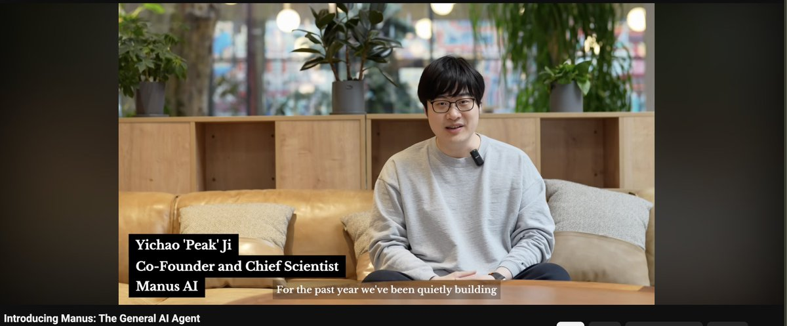

Then CoAct-1 hit 60.76% on OSWorld—finally closing the gap with humans.

  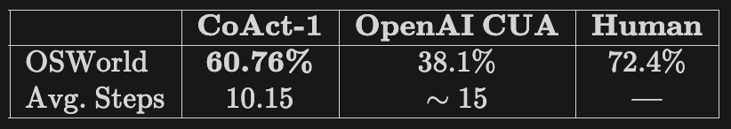

## The CLI Insight

December 2025: Geohot wrote something that reframed everything.

  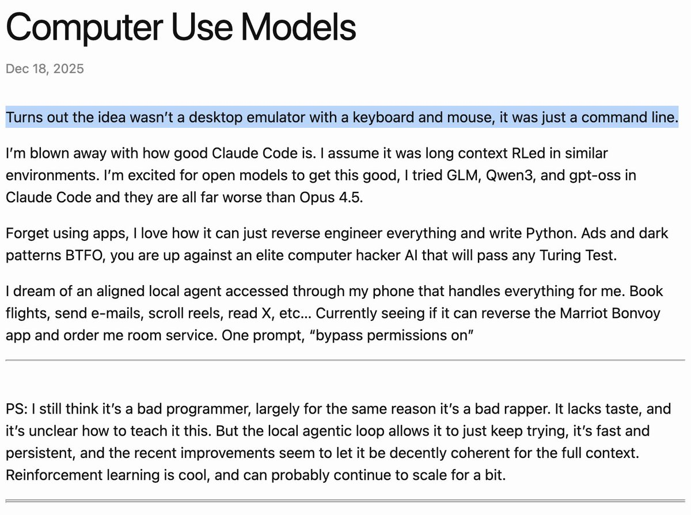

"Turns out the idea wasn't a desktop emulator with a keyboard and mouse, it was just a command line."

Claude Code was crushing it—not by clicking pixels, but by running programs. The insight spread. Guillermo Rauch put it plainly:

  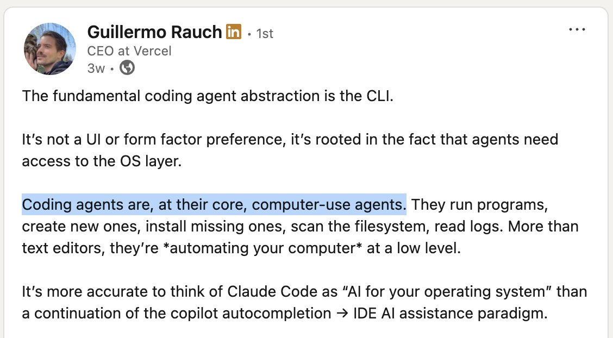

"Coding agents are, at their core, computer-use agents."

## January 2026: Clawdbot

And then Clawdbot happened.

  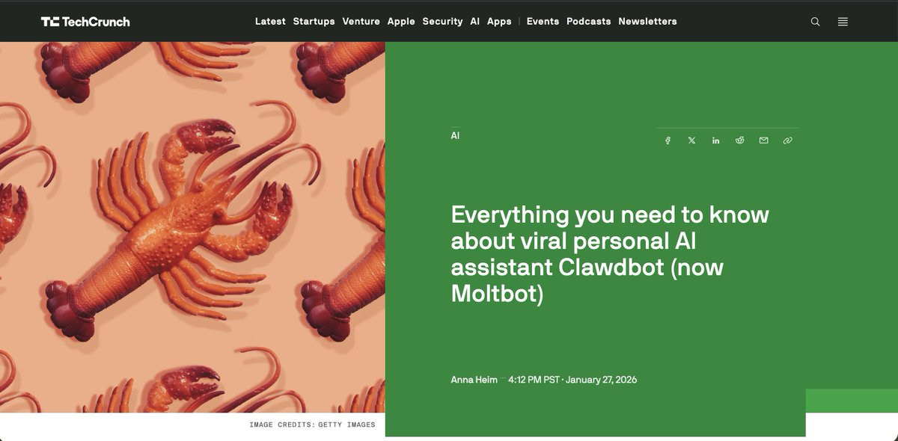

A composable plugin paradigm. Personal AI assistant over messaging. Suddenly everyone wanted one.

80K stars in a week. TechCrunch coverage. The moment computer-use agents stopped being a research curiosity and became something people actually use.

## The Full Timeline

  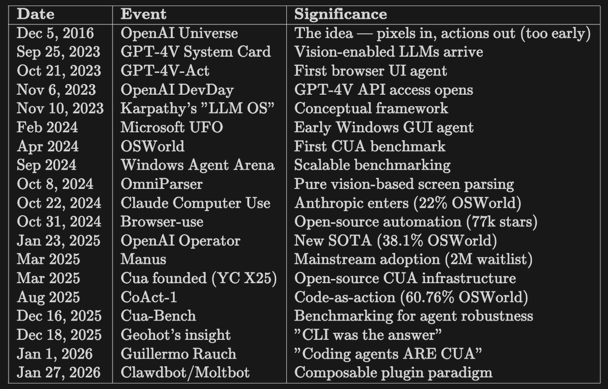

Ten years from Universe to Clawdbot. The models got better. The benchmarks caught up. The paradigm shifted from "click pixels" to "run programs." And now we're here.

At Cua, we've been building the infrastructure for this moment—sandboxes, VMs, computer-servers. The plumbing that makes computer-use agents actually work.

The next chapter is being written right now.

---

- [Cua Repository](https://github.com/trycua/cua)
- [Clawdbot](https://github.com/clawdbot/clawdbot)
