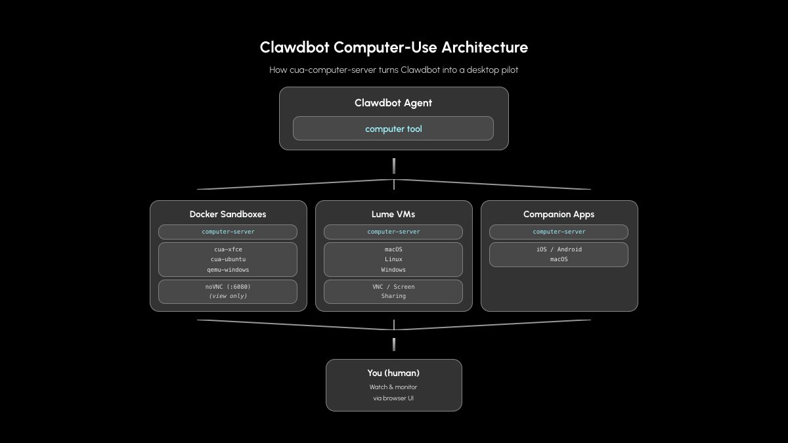
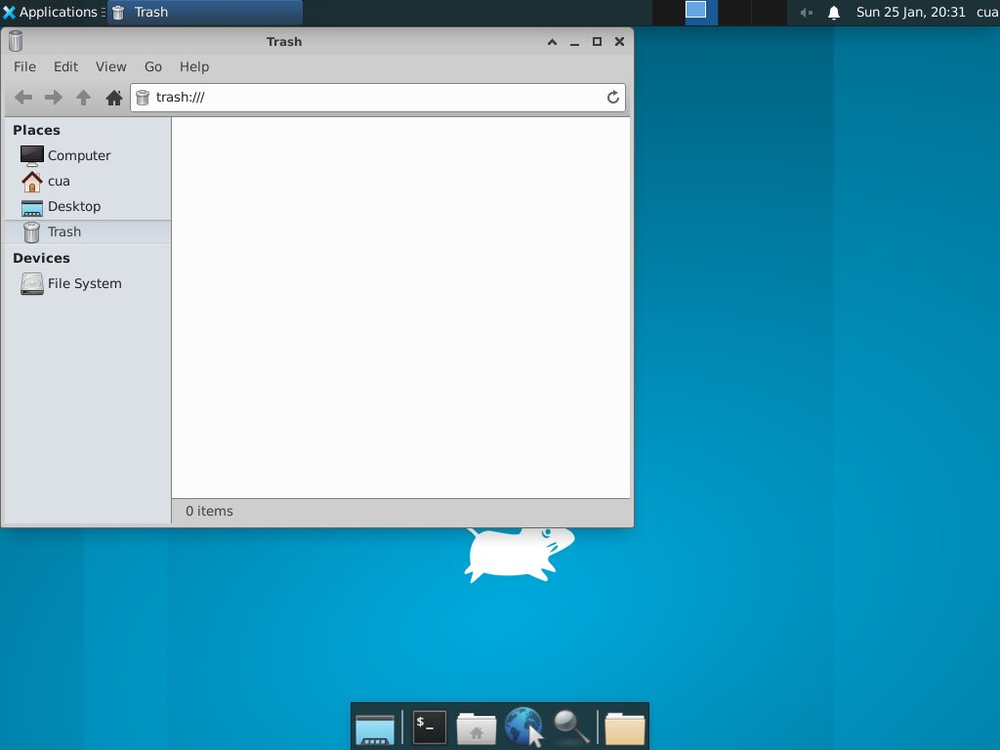

# We Gave Clawdbot Better Eyes, a Mouse, and a Keyboard

_Published on February 4, 2026 by the Cua Team_

_How Cua turns Clawdbot into a desktop pilot_

Yesterday we showed how to run [@steipete](https://x.com/steipete)'s Clawdbot in a macOS VM using [@trycua](https://x.com/trycua) Lume. Cool—but your agent is still blind. It could run shell commands, browse the web, connect to some apps via MCP, send messages... but it couldn't see your screen or click on things.

With [@trycua](https://x.com/trycua) cua-computer-server, Clawdbot can now:

- **See** - Take screenshots of the desktop
- **Click** - Left-click, right-click, double-click anywhere on screen
- **Type** - Enter text, press keys, use hotkeys (Cmd+C, anyone?)
- **Scroll** - Navigate through content
- **Drag** - Move things around

This means your agent can automate any application—not just CLI tools and browsers. Photoshop. Excel. That legacy app from 2008 that only runs on Windows. Whatever.

## How It Works

We've just created a PR to introduce a computer tool in the Clawdbot Agent. Clawdbot now talks to [@trycua](https://x.com/trycua) computer-server, which handles the actual screen capture and input simulation.

<div align="center">
  
</div>

You can run this in:

- **Docker sandboxes** - Isolated containers with full desktop environments
- **Lume VMs** - Native macOS/Linux/Windows virtual machines on Apple Silicon
- **Standalone Nodes** - Control your iPhone, Android, Windows, Linux or Mac directly

You can watch what your agent is doing via noVNC or screen sharing.

## Quick Start: Docker Sandbox

This is the easiest way. Our cua-xfce image comes with everything pre-installed.

### 1. Start the sandbox

```bash
docker run -d --name my-sandbox \
  -p 8000:8000 \
  -p 6080:6080 \
  trycua/cua-xfce:latest
```

### 2. See the desktop

Open http://localhost:6080 in your browser. You'll see a full Linux desktop:

<div align="center">
  
</div>

### 3. Let Clawdbot loose

```
You: Open Firefox and go to news.ycombinator.com

Clawdbot: [takes screenshot]
          I can see the XFCE desktop. Let me open Firefox.
          [clicks on Firefox icon in taskbar]
          [takes screenshot]
          Firefox is open. Navigating to Hacker News.
          [clicks URL bar]
          [types "news.ycombinator.com"]
          [presses Enter]
          [takes screenshot]
          Done! I can see Hacker News is loaded.
```

That's it. Your agent can now see and interact with a full desktop environment.

## What Can You Actually Do With This?

**Automate legacy apps** - That ancient inventory system that only has a GUI? Your agent can drive it now.

**Test desktop applications** - "Click through the onboarding flow and tell me if anything looks broken."

**Data entry at scale** - Fill out forms, copy data between apps, click through wizards.

**Screen monitoring** - "Watch this dashboard and alert me if the error count spikes."

**Anything you'd do with your mouse and keyboard** - Seriously. If you can click it, your agent can click it.

## Sandbox Options

We've got images for different needs:

[View all sandbox options](https://cua.ai/docs/cua/guide/get-started/what-is-desktop-sandbox#sandbox-options-in-cua)

For macOS, use Lume (see our [previous post](./clawdbot-lume-macos-vm.md)).

## The Sandbox Advantage

Running in Docker means:

- **Isolation** - Agent can't escape the container
- **Reproducibility** - Same environment every time
- **Easy reset** - Container misbehaving? Kill it, start fresh
- **Safe experimentation** - Let your agent try things without fear

This is computer-use without the anxiety. Your actual desktop stays untouched.

## For the Adventurous: Node Mode

Want your agent to control a real device? Install computer-server directly:

```bash
pip install cua-computer-server
cua-computer-server --port 8000
```

Then point Clawdbot at it. But fair warning—this gives your agent control of your actual screen. Use with caution, or better yet, use a dedicated machine.

We intentionally don't support "gateway mode" (running on your main desktop). The last thing you want is an AI agent clicking around while you're trying to work.

## What's Next

This is just the beginning. Computer-server also exposes an MCP interface, so as tooling evolves, integration options will too.

We're also working on:

- Better accessibility tree support (find elements by label, not just coordinates)
- Window management (focus, resize, arrange)
- Multi-monitor support

The goal is simple: make computer-use as reliable as shell commands.

---

## Links

- [Cua Repo](https://github.com/trycua/cua)
- [Computer-Server](https://github.com/trycua/cua/tree/main/libs/python/computer-server)
- [Desktop Sandboxes](https://cua.ai/docs/cua/guide/get-started/what-is-desktop-sandbox)
- [Clawdbot PR](https://github.com/clawdbot/clawdbot/pull/1946)
- [Clawdbot Docs](https://docs.clawd.bot)
