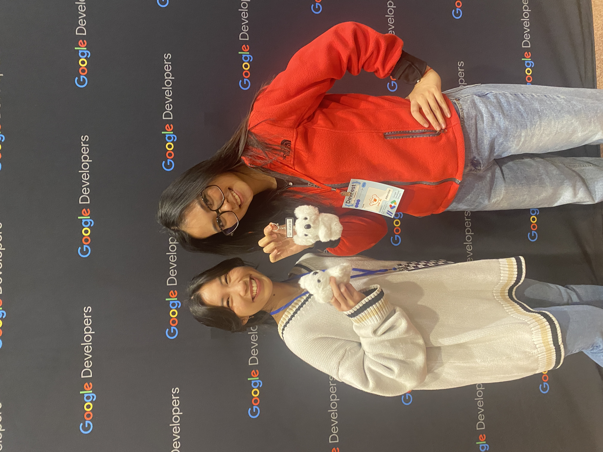
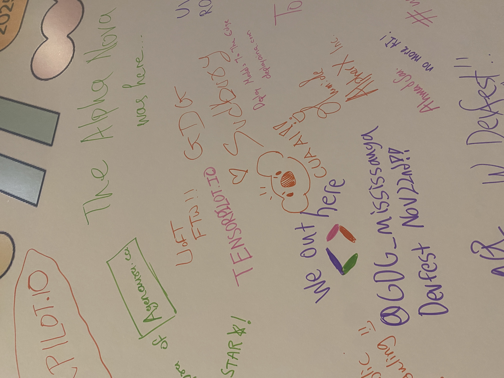
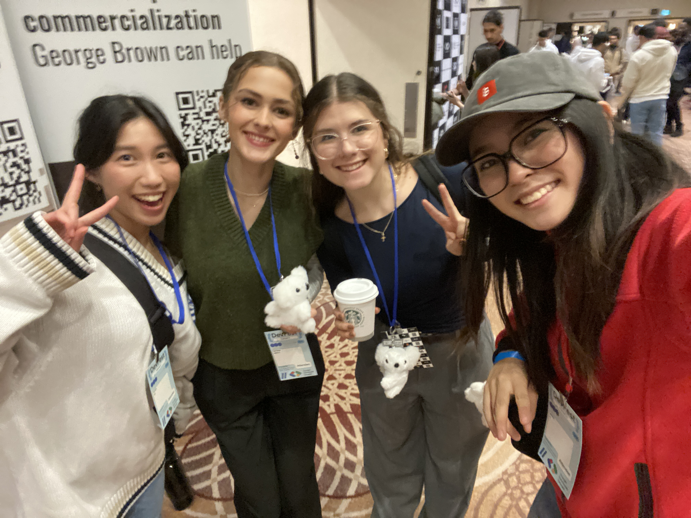

# Computer Use Agents for Growth Hacking: The Cua-la Strategy

_Published on January 16, 2025 by Sarina Li_

Growing a developer-focused product is hard. Traditional marketing doesn't work. Booth rentals cost thousands. Sponsorships cost tens of thousands.

So we tried something different at Google DevFest Toronto: show up with backpacks full of cute koala keychains and see what happens.

This is the story of how two new hires—a growth engineer and a designer/artist—guerrilla marketed their way through a major tech conference with $200 worth of merch and a post-event automation pipeline.

## Meet the Team

**Sarina** (Growth Engineering): Built the post-event automation pipeline that extracts LinkedIn connections and generates personalized messages while you sleep.

**Esther** (Design + Art): Hand-crafted every piece of artwork, giving life to CUA through illustrations, branding, and yes, extremely cute koala keychains.

The thesis: what if we could draw people in with irresistible physical merch, then use computer use agents to handle all the tedious follow-up work?

## The Koala Strategy

Google DevFest Toronto brought together hundreds of developers and AI enthusiasts. We didn't have a booth. We didn't have demos. We showed up with backpacks full of koala keychains with the cua.ai logo and started handing them out.

That's it. Pure guerrilla marketing.

The koalas were absurdly effective.

People would literally crowd around us—not because they were interested in computer use (at first), but because they wanted a koala. We'd pitch CUA while handing out keychains, and suddenly we had an engaged audience. No booth required.

### The Magic Moment

A few people stuck the koalas on their bags immediately. Then, throughout the event, we started getting approached:

"Wait, are you the CUA girls?"

They'd seen the koalas on someone's bag, asked about it, and tracked us down. The keychains became walking advertisements.

Even better: two attendees recognized CUA from Hack the North. Our previous event marketing was actually working. People remembered us.

## Part 2: The Automation (Try It Yourself)

After DevFest, we had 20+ new LinkedIn connections. Normally, this means hours of:

- Manually copying names, roles, companies
- Opening each profile to find contact info
- Crafting personalized follow-up messages
- Updating your CRM

Sarina had a better idea: build the automation we wish existed, then open source it.

**The automation is live**: [Post-Event Contact Export cookbook](https://code.cua.dev/docs/example-usecases/post-event-contact-export)

### How It Works

<video controls width="100%">
  <source src="./assets/linkedin-scraping.mp4" type="video/mp4">
  LinkedIn scraping automation in action
</video>

The agent navigates LinkedIn like a human would—click profile, extract info, navigate back, repeat. But it does it overnight while you sleep.

The secret sauce: **VM session persistence**. By logging into LinkedIn once through CUA's VM, the session stays alive. No captchas, no bot detection, just smooth automation.

<video controls width="100%">
  <source src="./assets/adding-row-csv.mp4" type="video/mp4">
  Automatic CSV generation
</video>

Wake up to a clean CSV with:

- First name, last name
- Current role and company
- LinkedIn profile URLs
- Pre-generated messaging links

Then use that data to craft personalized messages. Sarina wrote unique follow-ups for each person, mentioning specific conversations from DevFest.

**Works for any platform**: LinkedIn, X/Twitter, or wherever your connections are. The cookbook includes full setup instructions and customizable code.

## The Results

**Cost Breakdown**

- Booth rental: $0 (didn't have one)
- Sponsorship: $0 (didn't buy one)
- Koala keychains: ~$200
- Automation: Built by Sarina in a few hours post-event
- **Total spend: $200**

**What We Got**

- People crowding around us for koalas
- Walking advertisements on bags throughout the event
- Instant brand recognition ("Are you the CUA girls?")
- Two people who remembered us from Hack the North
- 20+ quality connections extracted and messaged within 24 hours
- Several demo requests from personalized follow-ups

**ROI**
Traditional event marketing at this scale: $5-10K minimum for booth + sponsorship.

Our approach: $200 + scrappy execution.

The automation is reuseable and will save hours of manual work, and the koalas created more organic conversations than any booth could have.

## What Didn't Work (Yet)

**Koala Distribution**
We ran out faster than expected! Next time: bigger bag, or limit to one per person.

**Automation Setup**
The VM login step added friction. "Log in manually first, then run the script" confused some people who wanted to try it themselves. Need better first-run UX.

**Message Personalization**
While the extraction was automated, Sarina still wrote each follow-up message manually. The automation saved the data collection part, but not the creative writing part. (Though this probably led to better messages.)

## What's Next: NeurIPS 2025

NeurIPS is the biggest AI conference of the year. Thousands of researchers, hundreds of companies, and endless networking opportunities.

**The good news**: We still have one giant bag of koalas left. They're already packed and ready.

**The better news**: We're upgrading the automation.

### The Hypothesis

The koalas get people interested. The automation ensures we actually follow through.

Most event marketing fails at the follow-up stage. You collect business cards, connect on LinkedIn, and then... nothing. The moment passes. People forget.

With CUA handling the mechanical work (data organization, connection tracking, follow-up scheduling), we can focus on the human part: genuine conversations, valuable introductions, and actually helping people.

## The Framework: Cute Merch + Smart Automation

Traditional event marketing: show up, pitch, collect cards, never follow up.

Our approach: combine two forces that shouldn't work together but do.

**The Physical Hook**

- Make something people actually want (not another branded pen)
- Hand-crafted, memorable, Instagram-worthy
- Turns attendees into walking billboards
- Creates natural conversation starters

**The Digital Follow-Through**

- Automate the tedious post-event work
- Extract connections while you sleep
- Personalize follow-ups with real context
- Actually close the loop before the moment passes

**Why It Works**
The koalas get you in the door. The automation ensures you don't waste the opportunity.

Most companies nail one or the other:

- Great merch, terrible follow-up → missed opportunities
- Amazing automation, boring presence → no one cares

Do both, and you create a flywheel: each event builds brand recognition for the next, while automation ensures maximum value from every connection.

## The Meta Lesson

We built CUA to build CUA. Every automation we create for growth becomes:

1. A real-world test of the product
2. Documentation of what works (and what doesn't)
3. An example for others to copy
4. Marketing material that's actually useful

Esther hand-draws artwork that makes people smile. Sarina builds automations that save time. Together, they're proving that developer tools can be both powerful and delightful.

See you at NeurIPS 2025. We'll be the ones with the koalas.

---

_Want to build your own growth hacking automations? Check out [CUA on GitHub](https://github.com/trycua/cua) or join our [Discord](https://discord.gg/cua) to share your experiments. Koalas not included (yet)._
