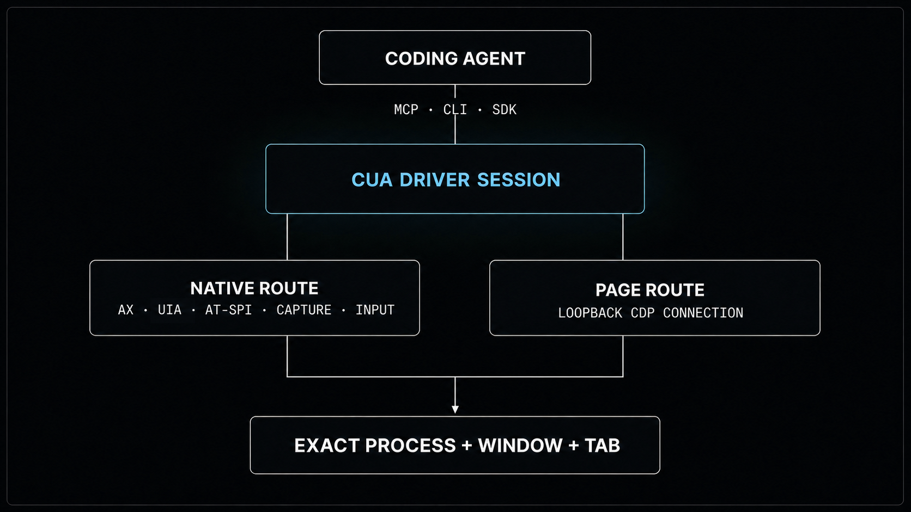

# Blending the best of computer and browser use, without a Chrome extension

_Published on July 29, 2026 by Francesco Bonacci_

Today, we're excited to announce browser use in Cua Driver. It gives coding agents an exact, page-aware browser interface alongside native desktop control, **without requiring a Chrome extension**. It is stable and available today in Cua Driver 0.14.0.

When we started working on Cua Driver, we saw it as a CLI that would let coding agents operate desktop apps. As we worked through window discovery, accessibility, capture, input delivery, focus, and session isolation, we realized the larger opportunity. Low-level operating-system plumbing could give agents a much wider action surface.

That plumbing lets an agent move between a terminal and the native applications involved in a development workflow. It can run commands, inspect windows, handle a permission prompt, and verify what changed without turning every step into a screenshot and a coordinate.

Browser use is already becoming part of coding agents. [Claude Code connects to a Chrome extension](https://code.claude.com/docs/en/chrome) that shares the user's signed-in browser state and exposes DOM, console, network, multi-tab, and file-upload tools. [Codex offers an in-app browser](https://learn.chatgpt.com/docs/browser?surface=app) with a separate profile, annotations, and optional full CDP access, plus [a Chrome extension](https://learn.chatgpt.com/docs/chrome-extension) when it needs the user's existing tabs and profile. Both can pair browser work with code, files, and commands. The missing capability is not simply browser automation.

We wanted a different integration boundary. Cua Driver puts the bridge in an agent-neutral computer-use driver rather than a specific agent host or browser integration. It binds an operating-system process and native window to an exact Chrome or Edge tab, then keeps page-aware CDP actions and native desktop control inside the same named session. A connected agent can move from the document to browser chrome, permission UI, file pickers, terminals, editors, and other desktop apps without installing an extension or moving the workflow into an embedded browser.

<div align="center">
  <video src="https://trycua.github.io/assets/videos/cua-driver/macos-background-chrome.mp4" poster="https://trycua.github.io/assets/posters/cua-driver/macos-background-chrome.jpg" width="760" controls></video>
</div>

_Claude Code starts a video in Chrome while the browser stays behind the agent terminal._

## From coding agents to agents that can do work

Cua Driver started with coding agents, but I soon found myself using it from more general agent harnesses, including [the Codex app](https://openai.com/index/introducing-the-codex-app/) and [Claude Cowork](https://www.anthropic.com/product/claude-cowork). Once an agent can combine files, commands, native apps, and browser state, it becomes useful for much more than testing code.

I have been using this setup for the mundane work that accumulates during a normal week: filling forms, working through payroll portals, and automating repetitive tasks in Slack and Discord. These workflows look simple to a person, but they rarely live inside one interface. The source data may be in a local file, the main task in an authenticated browser, a confirmation in a native dialog, and the follow-up in a messaging app. For consequential steps, I keep the final decision or submission behind an approval.

Cua Driver treats the browser as one part of that work. The agent harness can choose the right interface at each step:

- local files and shell commands for source data, exports, and transformations;
- semantic browser state for page content;
- typed browser actions for navigation, clicking, typing, scrolling, dialogs, uploads, and approved downloads;
- native accessibility and input for tabs, address bars, browser permission UI, file pickers, and other desktop apps;
- window screenshots when visual evidence matters.

Many routine work tasks happen mainly in the browser, but they do not end there. Browser use in Cua Driver lets a general agent carry the task across those boundaries without handing it back to the person at every transition.

## No extension, one exact browser connection

Cua Driver uses the Chrome DevTools Protocol, or CDP, for page-aware browser operations. CDP can inspect a document, address a specific tab, and perform declared actions without borrowing the user's keyboard or physical pointer.

Using CDP safely requires more than opening a debugging port. A browser has two identities:

- the operating system sees a process and a native window;
- the browser runtime sees DevTools targets and tabs.

Before Cua Driver allows a page mutation, it proves that both identities describe the same surface.



_Cua Driver keeps native OS actions and page-aware CDP actions inside one exact, session-scoped browser binding._

The agent starts from a concrete process id and native window id. Cua Driver then verifies that the DevTools endpoint is bound to loopback and belongs to that process, correlates the browser and native window, and returns opaque capabilities for the target and its tabs.

Those capabilities belong to one named session. Element references also belong to one semantic snapshot. Navigation, a newer snapshot, a browser reconnect, or the end of the session invalidates old references. The agent has to inspect fresh state instead of acting on a selector or tab id that may now point somewhere else.

This gives the agent a browser interface without adding an extension to the profile. It also keeps the operating-system bridge intact. When a task leaves page content, the same Cua Driver session can continue through native controls.

## Remote debugging is an explicit boundary

CDP has broad authority over a Chromium profile. That is useful, but it deserves a real consent boundary.

Cua Driver never enables remote debugging as a side effect of inspection. If a browser needs setup, the agent must call `browser_prepare` as a separate approved operation.

The recommended route creates a driver-owned isolated profile. Cua Driver launches it separately, never copies the user's normal profile into it, and removes an `isolated_new` profile when its session ends.

If the task needs the user's signed-in Chrome profile, Cua Driver can attach to it in bounded or unrestricted mode. [Bounded mode](https://cua.ai/docs/how-to-guides/driver/write-a-bounded-manifest) is the recommended unattended path: a reviewed session manifest can allow `kind: existing_profile` and restrict the agent to named tools, applications, browser origins, and files. [Unrestricted mode](https://cua.ai/docs/reference/cua-driver/permission-modes) is available for disposable or fully trusted environments through `cua-driver serve --dangerously-bypass-approvals`. It bypasses Cua approval checks after that launch-time acknowledgement, so it should not be the default for a personal browser.

An existing authenticated profile has a stronger boundary. On supported Chrome and Edge configurations, Cua Driver can open the browser's fixed remote-debugging page in the approved native window, toggle the exact per-instance setting, prove that the resulting endpoint belongs to the approved process, handle the browser-owned consent action, and close the temporary setup tab. It does not edit profile files, copy the profile, restart the browser, or terminate it.

The resulting grant is scoped to the daemon, session, process, window, and browser generation. It expires, and a daemon restart or session end revokes it.

There is one important limit to understand: loopback keeps remote machines from connecting directly, but it is not authentication against other software running as the same operating-system user. That is why Cua Driver recommends isolated profiles by default and treats existing-profile attachment as a higher-trust operation.

No extension does not mean no consent. It means the connection uses the browser's own debugging interface through an explicit, inspectable setup path.

## Exact tabs, including inactive ones

This makes one of the release's most important capabilities possible: precise background computer use on inactive browser tabs. An agent can inspect and operate an exact tab without selecting it, foregrounding the browser, or disturbing the tab the person is using.

Once the native window and browser target are bound, `get_browser_state` returns the available tabs and their selection state.

Cua Driver does not guess which tab is active from list order. If the native window title proves one selected tab, that tab reports `active: true`. If duplicate or empty titles make selection ambiguous, the candidates report `active: null`. The agent can still address a returned tab explicitly, but it cannot pretend an ambiguous tab is selected.

The browser tools can take a semantic snapshot of an exact inactive tab under that rule. An optional CDP screenshot captures that tab's viewport without making it visible.

Some actions can also stay fully in the background. Navigation, ref-bound text insertion, and an explicit DOM click can address an occluded Chromium tab. Trusted pointer behavior depends on the platform. Windows Chrome and Edge have validated trusted background pointer delivery. Standalone Chromium on macOS and Linux would activate for that route, so Cua Driver refuses before dispatch and lets the caller choose the explicit DOM event route when its semantics are acceptable.

The distinction matters. The driver does not silently replace a trusted click with a synthetic JavaScript click just to report success.

## Multiple sessions you can actually follow

Browser automation is hard to understand when a recording shows a page changing without any visible explanation.

On macOS and Windows, typed browser actions now drive the same session-scoped cursor overlay as native Cua Driver actions. A browser click or type action moves the synthetic agent cursor to the live page target and pulses there. It does not move the user's physical pointer.

For multi-tab workflows, each tab can use a separate declared session and a stable cursor color. The matching cursor appears while its tab is active. An agent can still inspect or act on an inactive tab through a supported background route, but Cua Driver does not paint that tab's cursor over the page the person is currently viewing.

This makes concurrent browser sessions easier to record and audit:

- each session has its own identity and color;
- inactive tabs remain addressable;
- the active tab's corresponding pointer is shown, while inactive tab pointers stay hidden;
- browser navigation does not invent pointer motion, so recordings can use a short text overlay to explain that step;
- the synthetic pointer is visual feedback, while CDP remains the delivery mechanism.

## The browser loop

The public browser interface follows the same snapshot, action, verification pattern as the rest of Cua Driver:

```text
start_session
list_windows
get_browser_state(pid, window_id, session)
get_browser_state(target_id, tab_id, session, semantic_v2)
browser_navigate / browser_click / browser_type / browser_pointer
get_browser_state(target_id, tab_id, session, semantic_v2)
end_session
```

The initial browser-state call binds the native window. The following call returns a semantic outline and action references for the selected tab. Actions use those short-lived references. A fresh snapshot verifies the result and refreshes the available controls.

The current typed surface includes:

- exact tab discovery and semantic snapshots;
- opt-in screenshots of inactive tabs;
- navigation, ref-bound clicking, and text input;
- hover, right-click, double-click, scroll, and drag;
- page-owned JavaScript dialogs;
- direct assignment to proven file inputs;
- approval-gated downloads into an approved directory;
- same-process frames, open shadow roots, and capability-tested out-of-process frames.

Unsupported or ambiguous routes return structured refusals. Safari and Firefox remain available through native desktop fallbacks, but Cua Driver does not currently advertise typed browser mutation for them.

## What an OSWorld 2.0 ablation is telling us

We are testing the bridge on [OSWorld 2.0](https://arxiv.org/abs/2606.29537), a benchmark of 108 long-horizon workflows that cross websites, desktop apps, and local artifacts. [OpenAI reports a 62.6% aggregate OSWorld 2.0 score for GPT-5.6 Sol](https://openai.com/index/gpt-5-6/). Our experiment is not a reproduction of that result. It is a narrower paired ablation designed to isolate what changes when the same agent receives typed CDP state and actions in addition to screenshots and native accessibility.

We prespecified a census of 46 Chrome-related tasks with a fixed $590 campaign cap and a $35 cap per pair. Each pair runs GPT-5.6 Sol at medium reasoning for at most 80 steps per arm on the official OSWorld 2.0 `v2026.06.24` task. The two arms use the same fresh 2-vCPU, 8-GiB Linux VM, with an official task reset between them. The control receives screenshots and native accessibility. The treatment receives those same surfaces plus exact-tab CDP snapshots and typed browser actions. The current experiment uses a source-pinned development build based on Cua Driver 0.12.6, not the public release binary. Infrastructure-invalid attempts are excluded from the treatment estimate instead of being counted as failures.

The capped July 29 release snapshot contains 37 valid pairs. Nine prespecified tasks were deferred rather than converted into model failures. The result is positive but inconclusive:

| Paired OSWorld 2.0 result | Screenshot + accessibility | Screenshot + accessibility + CDP |
| --- | ---: | ---: |
| Mean official score | 0.0043 | 0.0298 |
| Mean model cost per task | $4.49 | $7.57 |
| Mean wall time per task | 9.0 min | 10.2 min |

The paired mean difference is **+0.0255**, or 2.55 percentage points. The 95% task-cluster bootstrap interval runs from **-0.0054 to +0.0766**, and the exact paired sign-flip test gives **p = 0.5**. The treatment has two wins, 34 ties, and one loss. The direction is promising, but this snapshot does not establish a statistically significant improvement.

The individual tasks explain why we still think the combination is the right interface. On a route-planning task that required reading local registration guidance and building an exact multi-stop route in Google Maps, the combined arm scored 0.2857 while the control scored 0. On a reviewer-assignment task that required reconciling TeamChat, MailHub, and ReviewSphere, it scored 0.7583 in 73 steps while the control scored 0 after 80. The combined trajectory used 64 typed browser clicks and six typed text actions; the control spent its budget on 69 native clicks and 11 hotkeys. The one loss went the other way: native-only control earned 0.1 on a phone-plan checkout task while the combined arm earned 0.

Four lessons are already clear. Semantic browser tools help most when an agent must track dense page state across tabs, but they do not remove the need for screenshots or native controls. The operating-system bridge still matters for local files, browser chrome, permission UI, and every transition outside the document.

The bridge also has to fail soft. Browser-owned surfaces can temporarily leave the selected page without a normal CDP window while the native Chrome window remains visible and actionable. Cua Driver can keep the OS route available, retry the typed binding on later observations, and avoid turning a transient page-topology change into a failed desktop workflow.

Finally, a richer action surface is not free. It costs more tokens and time today, and the combined agent selected typed browser actions in 26 of 37 valid pairs. State compression and better tool selection are part of the product work: making a capable tool available does not guarantee that the model will choose it at the right moment. On one browser-to-Writer workflow, for example, the combined arm spent 79 of 80 actions clicking semantic browser refs and never transitioned into document production. It tied the control at zero while costing more. Exact actions solve grounding; they do not solve planning or orchestration.

## Use it today

Browser use is stable and available today in Cua Driver 0.14.0 on macOS, Windows, and validated Linux configurations.

Install Cua Driver on macOS or Linux:

```bash
/bin/bash -c "$(curl -fsSL https://cua.ai/driver/install.sh)"
```

Install it on Windows:

```powershell
irm https://cua.ai/driver/install.ps1 | iex
```

Verify the installation:

```bash
cua-driver --version
cua-driver doctor
```

On macOS, grant Accessibility and Screen Recording to the signed Cua Driver app:

```bash
open -n -g -a CuaDriver --args serve
cua-driver permissions grant
cua-driver permissions status
```

Then connect your agent. Cua Driver can print the current registration command for Codex, Claude Code, Cursor, and other MCP clients:

```bash
cua-driver mcp-config --client codex
cua-driver mcp-config --client claude
```

Install the agent skill so the model follows the exact browser binding, consent, and verification workflow:

```bash
cua-driver skills install
cua-driver skills status
```

Now give the agent an end-to-end task. For example:

> Use Cua Driver to open a driver-owned isolated Chrome profile, test the app at the preview URL printed by the development server, complete the onboarding flow, and verify each page change from a fresh semantic snapshot. Keep the browser in the background where the supported route allows it.

For the complete setup and tool contracts, read [Drive a Web Page](https://cua.ai/docs/how-to-guides/driver/drive-a-web-page), [Browser Targeting and Background Delivery](https://cua.ai/docs/concepts/browser-targeting-and-background-delivery), and [Browser Profile Attachment](https://cua.ai/docs/reference/cua-driver/browser-profile-attachment).

The boundaries are part of the stable interface: an exact route acts, and an unproven route refuses.

That is the foundation we want for coding agents. They can use the browser without being trapped inside it, cross back into the operating system when a workflow demands it, and leave behind evidence that shows what actually happened.

Source: [github.com/trycua/cua](https://github.com/trycua/cua)

Release: [Cua Driver 0.14.0](https://github.com/trycua/cua/releases/tag/cua-driver-rs-v0.14.0)

This browser-use capability was made possible thanks to contributions from [Gabriel Handford](https://github.com/gabriel), [Haoqing Wang](https://github.com/hqhq1025), [Manfred](https://github.com/ai-ag2026), [HsiangNianian](https://github.com/HsiangNianian), and [injaneity](https://github.com/injaneity). Their work spans exact Chromium window targeting and page actions, dialogs and uploads, inactive-tab capture, field replacement, browser-chrome certification, and honest verification of web input.
