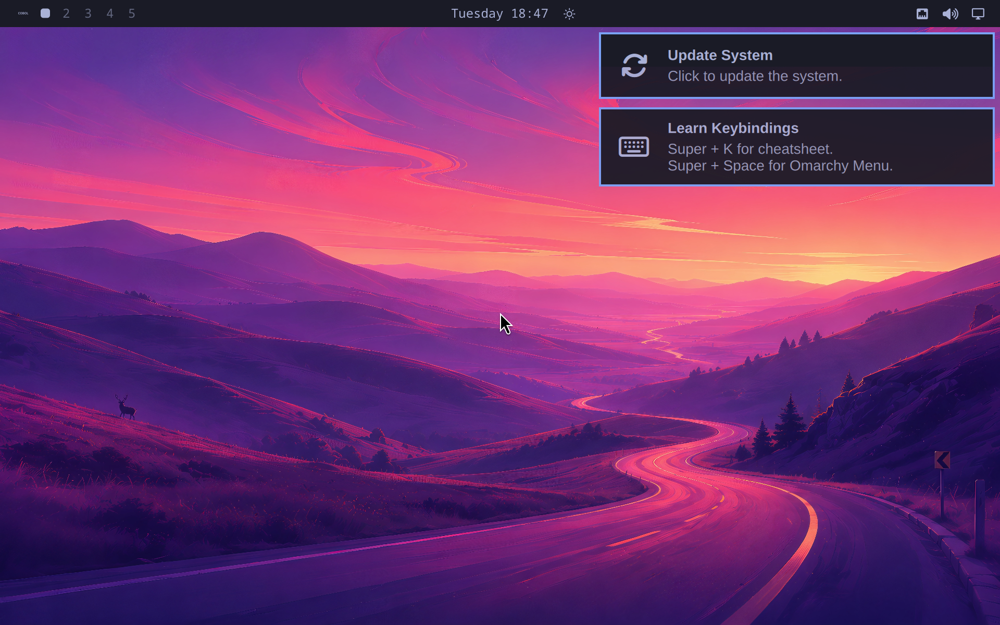
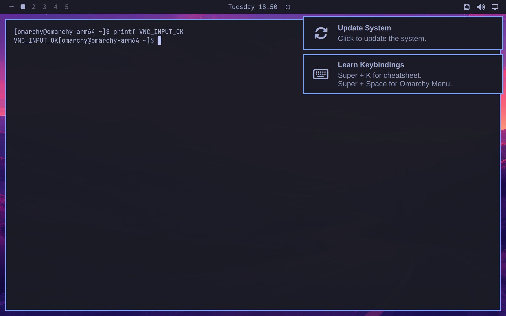
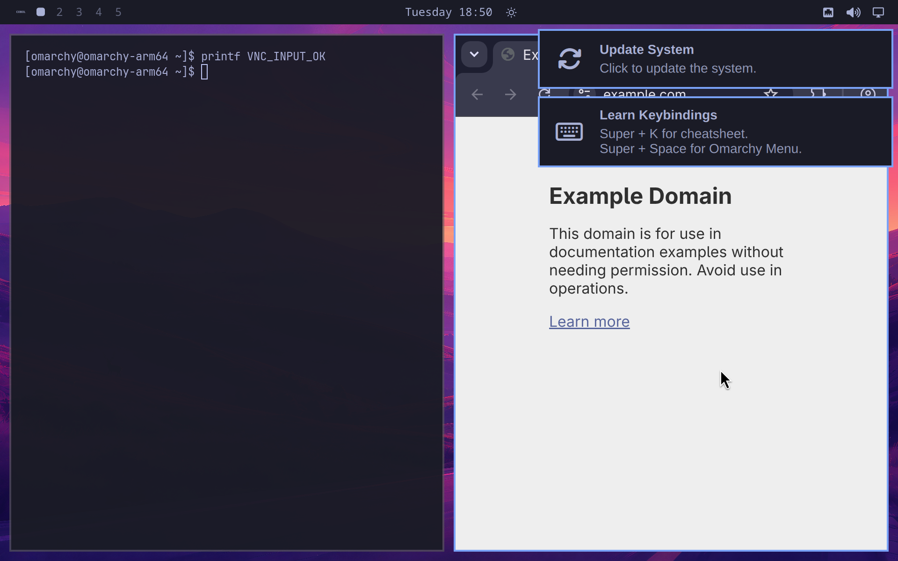

# Run Omarchy 4.0.1 on Apple Silicon with Lume

_Tested on August 25, 2026 by the Cua team_

You can run the official Omarchy 4.0.1 source on an ARM64 Linux VM backed by Apple's Virtualization.framework. The result boots into Hyprland, renders the Omarchy shell, accepts keyboard and mouse input, runs native ARM64 applications, and can translate self-contained x86-64 Linux programs with Rosetta.

This is an experimental compatibility install, not an official ARM build of Omarchy. Omarchy's published ISO and package repository are x86-64-only. We start with Arch Linux ARM, pin the official Omarchy source, install the native package subset, and make the minimum changes needed for Lume's virtual hardware.



## What was tested

The tested VM used:

- Lume 0.5.3 on an Apple Silicon Mac running macOS 26.6.1
- 8 virtual CPUs, 8 GiB of memory, and an 80 GiB disk
- Archboot `2026.08.25-02.28-7.2.0-2-aarch64`
- Arch Linux ARM kernel `7.2.0-2-aarch64-ARCH`
- Omarchy tag `v4.0.1`
- Omarchy tag object `23ffe6792b297755f3c4a6dd799689388a884dff`
- Omarchy source commit `13f18b2cb7286fb54f87daf571a031aa6af3d8f0`
- Hyprland 0.56.1, Quickshell 0.3.1, Chromium 151.0.7922.137, and Mesa 26.2.1

The VM passed two cold desktop boots, a guest reboot, VNC keyboard and pointer input, HTTPS networking, Chromium page loading, and transparent Rosetta execution after reboot.

## Know the limitations first

This setup is useful for experimentation, computer-use development, and testing the Omarchy desktop on Apple Silicon. It is not equivalent to the official Omarchy ISO.

- Graphics use Mesa `llvmpipe`. `glxinfo` reports `Accelerated: no`, and Vulkan cannot enumerate a physical device. Apple's Virtualization.framework does not expose VirGL-grade accelerated Linux graphics here.
- Lume exposes a virtio-sound PCI device, but the tested Arch Linux ARM kernel has `CONFIG_SND_VIRTIO` disabled. PipeWire therefore shows only `Dummy Output`.
- 27 package names from Omarchy's base set were absent from the tested ARM repositories. A follow-up audit found that 16 are packaging or substitution gaps, seven are plausible native source builds, one needs an alternative, and three are not useful in this VM. These paths are not yet E2E-validated.
- Rosetta translates x86-64 user-space code. It cannot boot the x86-64 Omarchy ISO, translate an x86-64 kernel, or provide missing x86-64 shared libraries.
- Chromium can ask you to create a default GNOME keyring on first launch. The tested VM canceled that optional prompt.

## Install Lume

You need an Apple Silicon Mac running macOS 13 or later with at least 50 GiB of free disk space. Install Lume from Cua's official installer:

```bash
/bin/bash -c "$(curl -fsSL https://cua.ai/lume/install.sh)"
lume --version
```

The commands in this guide were tested with Lume 0.5.3.

## Download the ARM64 installer

The official Omarchy ISO is x86-64-only, so use the ARM64 Archboot environment to install an ARM64 base system:

```bash
curl -fLO https://release.archboot.com/aarch64/2026.08/iso/archboot-2026.08.25-02.28-7.2.0-2-aarch64-ARCH-aarch64.iso
```

The expected BLAKE2b-512 digest is:

```text
562bd4c54d879d7d2b80f565186b3804456f99a6e3913f7eda7bf9b0e9f132d6e9fcbd083998cb3dcbbf065528a2a404c4ce6151f90b3228dade788237ae1bc7
```

Verify it against Archboot's signed `b2sum.txt` before booting the image:

```bash
curl -fLO https://release.archboot.com/aarch64/2026.08/b2sum.txt
curl -fLO https://release.archboot.com/aarch64/2026.08/b2sum.txt.sig

gpg --keyserver hkps://keyserver.ubuntu.com \
  --recv-keys 5B7E3FB71B7F10329A1C03AB771DF6627EDF681F
gpg --fingerprint 5B7E3FB71B7F10329A1C03AB771DF6627EDF681F
gpg --verify b2sum.txt.sig b2sum.txt

b2sum archboot-2026.08.25-02.28-7.2.0-2-aarch64-ARCH-aarch64.iso
```

The tested signature was valid for Tobias Powalowski's key with fingerprint `5B7E 3FB7 1B7F 1032 9A1C 03AB 771D F662 7EDF 681F`. Importing a key from a keyserver does not establish its identity by itself, so verify that fingerprint through an independent Archboot or Arch Linux channel. If your Mac does not have `b2sum`, install GNU coreutils or verify the digest with another trusted BLAKE2b-512 implementation.

## Create and boot the VM

Create a blank ARM64 Linux VM:

```bash
lume create omarchy-arm64 \
  --os linux \
  --cpu 8 \
  --memory 8GB \
  --disk-size 80GB \
  --display 1920x1200
```

Boot the Archboot ISO:

```bash
lume run omarchy-arm64 \
  --mount "$PWD/archboot-2026.08.25-02.28-7.2.0-2-aarch64-ARCH-aarch64.iso" \
  --display vnc
```

Open a root shell in Archboot after networking comes up.

## Install the ARM64 base system

The companion [`install-arch.sh`](assets/omarchy-arm64-lume/install-arch.sh) script partitions `/dev/vda`, formats it, and installs Arch Linux ARM. It erases the entire virtual disk and refuses any disk name other than `/dev/vda`.

Download and run it inside the Archboot shell:

```bash
curl -fLO https://raw.githubusercontent.com/trycua/cua/main/blog/assets/omarchy-arm64-lume/install-arch.sh
chmod +x install-arch.sh
TIMEZONE=UTC ./install-arch.sh /dev/vda
```

Change `TIMEZONE` to a valid name from `/usr/share/zoneinfo` if needed. The script includes `archlinuxarm-keyring` in `pacstrap`; this is important because the ARM repositories use their own signing keys.

Set a password for the desktop user while the installed system is still mounted:

```bash
arch-chroot /mnt passwd omarchy
umount -R /mnt
poweroff
```

When the guest turns off, boot it again without the ISO:

```bash
lume run omarchy-arm64 --display vnc
```

Log in as `omarchy` on the text console.

## Install the pinned Omarchy source

The companion [`install-omarchy.sh`](assets/omarchy-arm64-lume/install-omarchy.sh) script does not run Omarchy's stock x86-64 installer. Instead, it:

1. Installs the tested native ARM64 package subset.
2. Clones the official `basecamp/omarchy` repository to `/usr/share/omarchy`.
3. Checks out commit `13f18b2cb7286fb54f87daf571a031aa6af3d8f0`, the commit referenced by tag `v4.0.1`.
4. Installs Omarchy's commands, configuration, applications, Wayland session, and SDDM theme from that source tree.
5. Enables SDDM autologin and forces Hyprland onto its software-rendering path.

Run it from the installed ARM64 system:

```bash
curl -fLO https://raw.githubusercontent.com/trycua/cua/main/blog/assets/omarchy-arm64-lume/install-omarchy.sh
chmod +x install-omarchy.sh
sudo ./install-omarchy.sh
sudo reboot
```

The guest should boot directly into the Omarchy desktop.

## Enable Rosetta for x86-64 user applications

Lume 0.5.3 automatically attaches Apple's Rosetta directory share when Rosetta is installed on the macOS host. The guest still needs to mount the share and register its translator with Linux `binfmt_misc`.

Run the companion [`enable-rosetta.sh`](assets/omarchy-arm64-lume/enable-rosetta.sh) script in the guest:

```bash
curl -fLO https://raw.githubusercontent.com/trycua/cua/main/blog/assets/omarchy-arm64-lume/enable-rosetta.sh
chmod +x enable-rosetta.sh
sudo ./enable-rosetta.sh
sudo reboot
```

The registration uses the ELF magic and mask from Lima's Rosetta setup. It mounts Lume's `rosetta` virtiofs share at `/mnt/rosetta` and persists both the mount and `binfmt_misc` entry.

To verify translation with a self-contained x86-64 program, download BusyBox 1.35.0 and check its digest before executing it:

```bash
curl -fsSL \
  https://busybox.net/downloads/binaries/1.35.0-x86_64-linux-musl/busybox \
  -o /tmp/busybox-x86_64

echo '6e123e7f3202a8c1e9b1f94d8941580a25135382b99e8d3e34fb858bba311348  /tmp/busybox-x86_64' \
  | sha256sum -c -

chmod +x /tmp/busybox-x86_64
file /tmp/busybox-x86_64
/tmp/busybox-x86_64 uname -m
```

The final command should print `x86_64`. Without Rosetta registration, the same binary fails with `Exec format error`.

For dynamically linked x86-64 software, you must also provide compatible x86-64 libraries. Rosetta supplies translation, not a complete x86-64 Linux filesystem.

## Verify the desktop

Check that the expected processes and source revision are active:

```bash
uname -m
uname -r
pgrep -a Hyprland
pgrep -a quickshell
sudo git -C /usr/share/omarchy rev-parse HEAD
curl -fsSI https://example.com | sed -n '1p'
```

Expected highlights are `aarch64`, the pinned Omarchy commit, running Hyprland and Quickshell processes, and an HTTP success response.

Keyboard and pointer input worked through Lume's VNC display. The following screenshot shows text entered into Foot through VNC:



Native ARM64 Chromium also loaded an HTTPS page:



## Inspect graphics and audio

Run the graphics checks from a terminal inside the desktop session:

```bash
glxinfo -B
vulkaninfo --summary
```

The tested VM reported:

```text
OpenGL renderer string: llvmpipe (LLVM 22.1.8, 128 bits)
Accelerated: no
vkEnumeratePhysicalDevices failed with ERROR_INITIALIZATION_FAILED
```

For audio, inspect PipeWire and ALSA:

```bash
wpctl status
aplay -l
zgrep CONFIG_SND_VIRTIO /proc/config.gz
```

The tested kernel reported `# CONFIG_SND_VIRTIO is not set`, `aplay` found no sound cards, and PipeWire exposed only `Dummy Output`. Lume does attach a virtio-sound PCI device, so a guest kernel built with `CONFIG_SND_VIRTIO` is the likely path to audio support.

## Package compatibility audit

The compatibility installer records the 27 Omarchy 4.0.1 package names that were absent from the tested repositories. The raw count does not mean 27 hard blockers. An August 26, 2026 source and package-metadata audit produced four groups.

### Packaging or substitution gaps: 16

`aether`, `cliamp`, `dotnet-runtime`, `herdr`, `hyprland-preview-share-picker`, `localsend`, `mise-bin`, `nvim`, `omarchy-nvim`, `tobi-try`, `ttf-ia-writer`, `ttf-jetbrains-mono-nerd-basic`, `ufw-docker`, `xdg-terminal-exec`, `yaru-icon-theme`, and `yay`.

These are the lowest-risk recovery group. Upstream recipes or releases declare ARM64 support, the package is architecture-independent, or a native substitute already exists. In particular, the missing `nvim` package does not mean Neovim is absent: the native Arch Linux ARM `neovim` package is already installed.

Current AUR recipes for `aether`, `cliamp`, `herdr`, `hyprland-preview-share-picker`, `localsend`, `mise-bin`, and `yay` explicitly include `aarch64`. Several fonts, configurations, and shell utilities declare `any`, while Microsoft publishes a Linux ARM64 .NET runtime. These are packaging findings, not completed E2E tests.

### Native source-build candidates: 7

`omacalc`, `omacut`, `omawrite`, `pinta`, `tensaku`, `ttfx`, and `tzupdate`.

Their C++, .NET, or Rust sources are plausible ARM64 builds, but their current Omarchy or AUR package is x86-64-only or has an ARM64 dependency gap. Each requires a reproducible build, dependency review, and runtime test before it should enter the compatibility installer.

### Alternative needed: 1

`obsidian` does not publish a native Linux ARM64 desktop artifact. The practical options are its web app, another Markdown editor, or an explicit experiment with the x86-64 desktop app through Rosetta and a compatible x86-64 userspace.

### Defer for this VM: 3

`asdcontrol` targets physical Apple displays, `qemu-user-static-binfmt` is redundant for the tested Rosetta translation path, and `obs-studio` is not useful until this VM has accelerated graphics and working audio.

Omarchy's package repository still has no `aarch64` database. Even the low-risk group therefore needs an ARM64 build channel or explicit installation path. Treat each package as a separate compatibility and licensing review rather than installing arbitrary x86-64 packages into the ARM root filesystem.

## Result

This process produces a usable, reboot-persistent Omarchy desktop on an ARM64 Lume VM with native ARM applications and optional Rosetta translation. The main remaining gaps are accelerated graphics, the guest kernel's missing virtio-sound driver, and a tested ARM64 packaging channel for the recoverable package set.

The important distinction is provenance: this is official Omarchy source pinned to `v4.0.1`, adapted onto an Arch Linux ARM base. It is not an official Omarchy ARM64 release or a drop-in replacement for Omarchy's x86-64 ISO.
