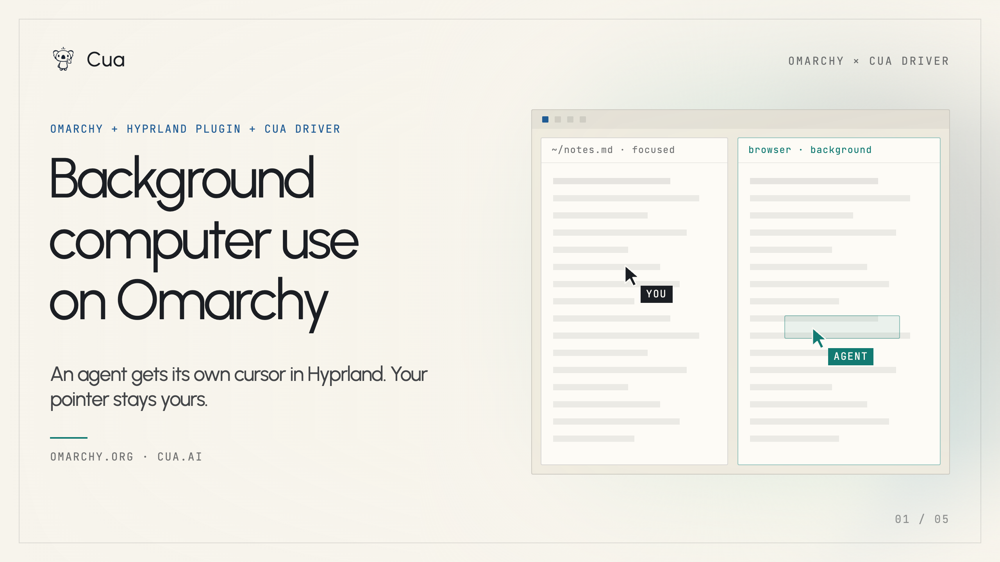
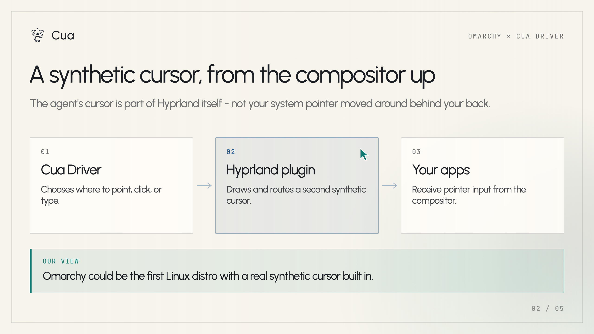
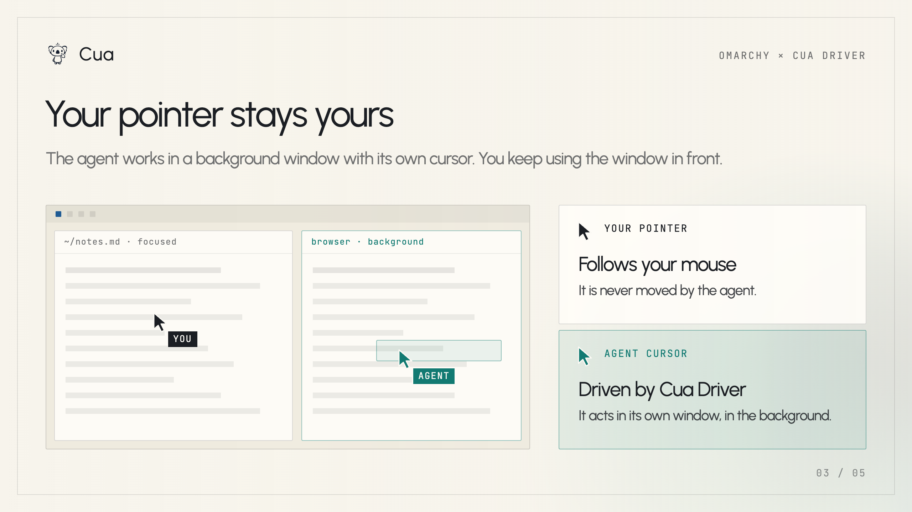
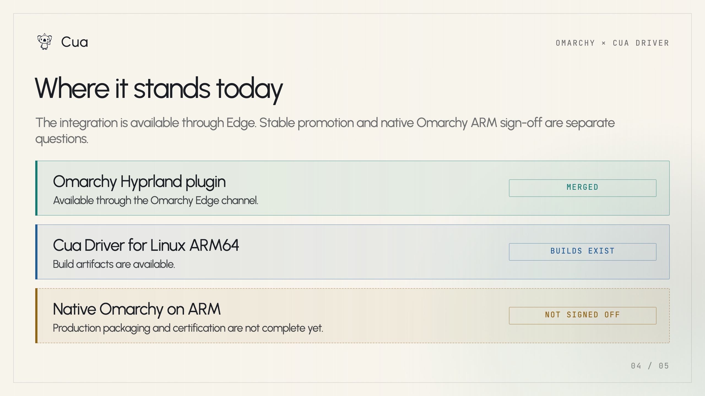
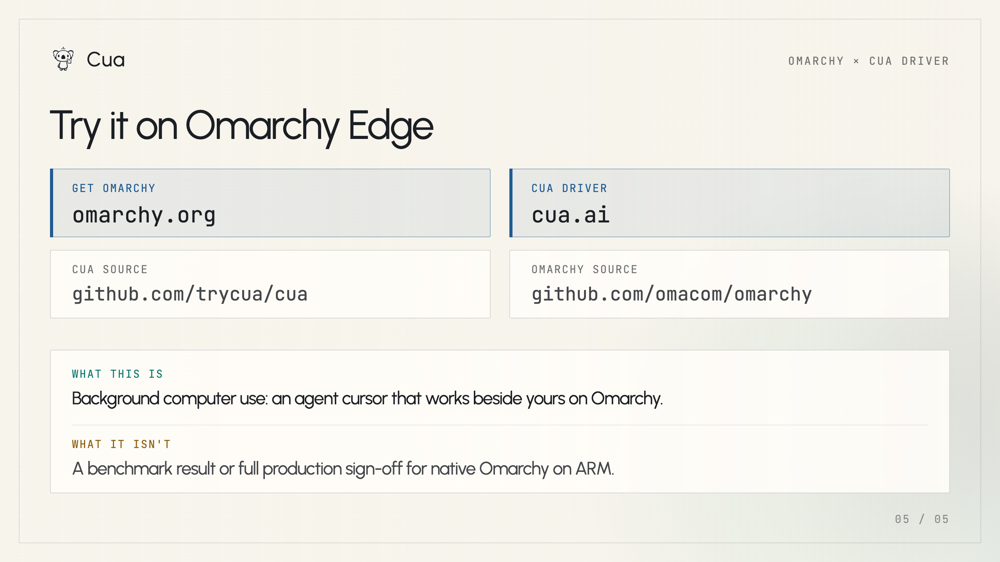

# Building Background Computer Use into Hyprland

_Published on September 25, 2026 by Francesco Bonacci_

Background computer use is easiest to understand as an input-routing problem. An agent needs to point, click, and type in a window without stealing the pointer, focus, or drag that a person is using in the foreground.

Over the last month, we worked directly with [David Heinemeier Hansson](https://x.com/dhh) and [Spencer Bull](https://x.com/SpencerGBull) to implement that model in Omarchy's [Hyprland compositor](https://hyprland.org/). The result is a compositor-native synthetic cursor that can coexist with the user's cursor.

## Why the compositor is the right boundary

Most desktop automation has to borrow the user's visible pointer or take over a remote session. That makes it difficult for an agent to work while a person continues using the computer.

On macOS and Windows, background input generally depends on compromises and window-server workarounds to approximate multiple synthetic cursors. Those mechanisms can be useful, but they are not the same as making the cursor a first-class object in the compositor's input model.

Hyprland gives us that boundary. A synthetic cursor can be represented, rendered, and routed alongside the physical cursor before application input is delivered. The agent can operate a background window while your own pointer remains available for the work in front of you.

## How the Hyprland integration works

The integration has three parts:

1. Cua Driver chooses where to point, click, or type and keeps the action associated with a target window.
2. The Hyprland plugin maintains a synthetic cursor and draws it independently of the user's cursor.
3. The compositor routes pointer motion, button, and keyboard delivery through the agent's isolated seat/input path.
4. The target application receives normal compositor-delivered input, while the foreground application keeps its own pointer state.

The important property is isolation: the agent's input path is separate from the user's pointer and pointer-focus state without pretending that the agent has taken over the whole desktop.

## What this enables

With a separate agent cursor, you can keep working in the window in front while an agent works in a background window. The two activities have distinct pointers and distinct destinations.

That is the practical difference between background computer use and software that simply moves your visible mouse around. The compositor owns both cursors and can route each one to the right window, so a foreground drag does not need to be interrupted just because an agent is acting elsewhere.

This also gives us a cleaner place to reason about permissions, window targeting, keyboard layout behavior, and the lifetime of an agent seat. Those are compositor and desktop-integration concerns, rather than application-specific automation tricks.

## Platform comparison

The same user-visible goal exists on every desktop platform, but the integration boundary differs:

- **Hyprland:** the synthetic cursor and its routing live in the compositor, giving background input a native seat and cursor model.
- **macOS:** background delivery can be assembled from WindowServer and accessibility mechanisms, but multiple independent cursors require platform-specific workarounds and careful focus restoration.
- **Windows:** background delivery can use window and input APIs, but a second cursor is not a universal first-class object across the desktop, so implementations must work around foreground, focus, and hit-testing behavior.

This is not a claim that one platform can do everything the others cannot. It is a description of where the control point lives. Hyprland lets us build the multi-cursor contract at the compositor boundary instead of reconstructing it above the window server.

## Current status and limitations

The current Omarchy Cua integration is available through the Omarchy Edge channel. Stable-channel promotion is not independently verified in this post.

Cua Driver publishes Linux ARM64 artifacts. Native Omarchy ARM production packaging and certification are separate work and are not signed off yet. Keyboard layouts, accessibility identity, and application-specific behavior still need platform and application coverage; the compositor-native cursor is the foundation, not a promise that every application behaves identically.

## Try it on Omarchy

To try the current integration, use the Omarchy Edge channel and explore the projects behind it:

- [Omarchy](https://omarchy.org/)
- [Cua Driver](https://cua.ai/)
- [Cua source](https://github.com/trycua/cua)
- [Omarchy source](https://github.com/omacom/omarchy)

This is background computer use with a compositor-native synthetic cursor. It is not a benchmark result or a claim of full ARM production support. The implementation is open source, and the next step is to keep turning the compositor contract into a portable, well-tested desktop capability.

