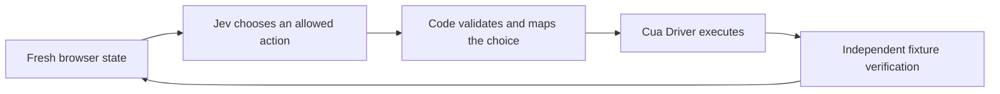

This walkthrough starts with a fresh checkout and ends with a value that Jev
selected an action to submit through Cua Driver. A separate HTTP endpoint
confirms that the form actually received it.

**Jev is not loaded into Cua Driver as a chat model.** The included Python agent
asks TypeSafe for a typed choice; code owns the arguments and execution. No
Codex, ChatGPT subscription, model weights, GPU, OCR, or video tools are needed.
The TypeScript version is an optional alternative, not a Python prerequisite.



## 1. Prepare the desktop Mac

The commands below are for **macOS**, with a logged-in, unlocked graphical
session and internet access. Run everything on the machine whose desktop Cua
Driver controls, not on a separate SSH client or controller: `127.0.0.1` must
refer to that same Mac. This walkthrough has not been certified on Windows or
Linux; see [platform installation](/how-to-guides/driver/install) for their
separate prerequisites.

Before an agent starts, the human must authorize installing the dependencies,
using an isolated browser for the harmless local fixture, and sending that
fixture's state to TypeSafe. A human must also approve macOS permission prompts
and provide a TypeSafe API key for the live step. An agent must stop and ask
when those prerequisites are missing; it must not bypass login, TCC, or host
permission policy.

Use a Bash terminal. Stop at any failed command before advancing. Agents with
stateless shell tools must repeat the working directory and environment exports
in later calls; shell variables do not persist between independent processes.
The agent's execution environment must allow dependency downloads, loopback
connections, and writes to its workspace, user installation/cache directories,
and macOS's per-user temporary directory (`getconf DARWIN_USER_TEMP_DIR`). If
an execution sandbox denies those writes, ask its operator to authorize those
specific paths. That is separate from Cua permissions; do not use `sudo` or
disable the sandbox as an installation workaround.

### Cua Driver and permissions

Reuse an existing installation. Install only if both the CLI and app-bundle
binary are absent:

```bash
export PATH="$HOME/.local/bin:$PATH"
if ! command -v cua-driver >/dev/null 2>&1 &&
   [ ! -x /Applications/CuaDriver.app/Contents/MacOS/cua-driver ]; then
  /bin/bash -c "$(curl -fsSL https://cua.ai/driver/install.sh)"
fi
export CUA_DRIVER_BIN="$(command -v cua-driver || printf '%s' /Applications/CuaDriver.app/Contents/MacOS/cua-driver)"
"$CUA_DRIVER_BIN" --version
"$CUA_DRIVER_BIN" status
```

If the daemon is not running, start its signed application identity in the
background, then repeat `status`:

```bash
open -n -g -a CuaDriver --args serve
```

Check the daemon's permissions and environment:

```bash
"$CUA_DRIVER_BIN" permissions status --json
"$CUA_DRIVER_BIN" doctor
```

Both `accessibility` and `screen_recording` must be `true`. If either is false
or unknown, have the human run:

```bash
"$CUA_DRIVER_BIN" permissions grant
```

In **System Settings → Privacy & Security**, enable **CuaDriver** under
**Accessibility** and **Screen & System Audio Recording**. Accept a requested
app restart, restart the daemon if necessary, and check again. The prompts
alone do not grant access. A `direct_capture_status` of `not_checked` in the
read-only permission report is not itself a failure. See
[macOS permissions](/reference/cua-driver/macos-permissions) if the app identity
is missing or stale. Do not change to unrestricted mode to make this example run.

### Browser

Install vendor-signed [Google Chrome](https://www.google.com/chrome/) at
`/Applications/Google Chrome.app` if it is not already present. Check:

```bash
test -d '/Applications/Google Chrome.app'
/usr/bin/codesign --verify --deep --strict '/Applications/Google Chrome.app'
```

The agent uses `browser_prepare` to create a **Driver-owned isolated profile**.
Do not launch a personal profile, grant existing-profile access, start a remote
Chrome debugging port, or reuse browser IDs from another run. A browser engine
downloaded by a test framework is not a substitute for this system installation.

### Python tooling

Install [uv](https://docs.astral.sh/uv/getting-started/installation/) if absent:

```bash
export PATH="$HOME/.local/bin:$PATH"
if ! command -v uv >/dev/null 2>&1; then
  curl -LsSf https://astral.sh/uv/install.sh | env UV_NO_MODIFY_PATH=1 sh
fi
export PATH="$HOME/.local/bin:$PATH"
uv --version
git --version
```

If `git --version` asks for Apple's Command Line Tools, the human must complete
that installation before continuing. The next step provisions Python 3.12;
the macOS system Python can be too old. Do not modify the system Python.

## 2. Get the example and install locked dependencies

Choose a new working directory; do not overwrite an existing checkout.

```bash
git clone --depth 1 https://github.com/trycua/cua.git cua-jev
cd cua-jev
```

**While [PR #3916](https://github.com/trycua/cua/pull/3916) is unmerged**, the
example is not on `main`. Use the following fallback inside this fresh clone:

```bash
if [ ! -f libs/cua-driver/examples/typesafe-jev/python/run.py ]; then
  git fetch --depth 1 origin refs/pull/3916/head
  git switch --detach FETCH_HEAD
fi
git rev-parse HEAD
cd libs/cua-driver/examples/typesafe-jev
uv sync --frozen --python 3.12
.venv/bin/python --version
```

Record the printed commit and Python version with your results. `--frozen`
uses the checked-in `uv.lock`; it should not modify dependency files. The
example installs the official `typesafe-sdk` and the MCP client. There is no
need to write an adapter, install an agent skill, or read a private worklog.

Run the credential-free unit checks:

```bash
uv run --frozen python -m unittest discover -s python/tests
```

These are code checks, not evidence of an operational desktop or live provider.

## 3. Start and check the local fixture

From the example directory, check that port 8765 is available:

```bash
.venv/bin/python - <<'PY'
import socket
with socket.socket() as listener:
    listener.bind(("127.0.0.1", 8765))
print("Port 8765 is available")
PY
```

If the port is occupied, stop here. Do not terminate an unknown listener or
reset another run's fixture. Choose an unused port and change both the server's
`--port` and every runner's `--fixture-url` and verification URL consistently.

Start only this example's server and save its PID for cleanup:

```bash
nohup .venv/bin/python fixture_server.py --port 8765 > fixture.log 2>&1 &
FIXTURE_PID=$!
printf '%s\n' "$FIXTURE_PID" > fixture.pid
```

Wait for the server, checking both the owned process and the independent state:

```bash
.venv/bin/python - <<'PY'
import json
import os
import time
from pathlib import Path
from urllib.request import urlopen
pid = int(Path("fixture.pid").read_text())
for attempt in range(30):
    os.kill(pid, 0)
    try:
        with urlopen("http://127.0.0.1:8765/state", timeout=1) as response:
            state = json.load(response)
        assert state == {"submitted": None}, state
        print("Fixture ready:", state)
        break
    except OSError:
        time.sleep(0.2)
else:
    raise SystemExit("Fixture not ready; inspect fixture.log")
PY
```

The fixture binds to loopback only. Do not expose it publicly. Keep it running
through the following steps, and run the examples **one at a time**: each run
resets this shared fixture.

## 4. Prove the Driver connection without Jev

In the same example directory and with `CUA_DRIVER_BIN` still exported:

```bash
uv run --frozen python/run.py --provider mock \
  --token jev-guide-mock --max-steps 4 --log mock.jsonl
```

The runner keeps one MCP connection and named session alive, discovers the
new browser's PID/window, types the token, and clicks Submit using fresh
`semantic_v2` page refs. It never borrows an existing CLI or MCP session.

Expected terminal output includes step events followed by:

```json
{"event":"outcome","outcome":"verified","token":"jev-guide-mock"}
```

Independently verify the exact token before running anything else:

```bash
.venv/bin/python - <<'PY'
import json
from urllib.request import urlopen
with urlopen("http://127.0.0.1:8765/state", timeout=2) as response:
    state = json.load(response)
assert state == {"submitted": "jev-guide-mock"}, state
print("PASS: mock Driver action reached the fixture")
PY
```

Require **both** the runner's `verified` outcome and this assertion. A zero exit
status, screenshot, or successful action response alone is not completion.
Never submit the token directly with HTTP or JavaScript to manufacture a pass.
The mock proves the desktop integration, not Jev authentication or decisions.

## 5. Provide a TypeSafe key and run live Jev

Create an API key in the [TypeSafe console](https://console.typesafe.ai/).
The [official SDK](https://docs.typesafe.ai/sdk/python) reads
`TYPESAFE_API_KEY` from its process environment.

For an unattended agent, the human or secret manager must supply that environment
variable to the agent's execution environment in advance. Do not paste the key
into chat, put it in a command argument, commit it, or print it. Disable shell
tracing and avoid environment dumps. There is no credential-free live mode.

For a human at an interactive terminal, the following command prompts without
echoing or putting the key in shell history. It also works without a prompt if
the environment variable was already provisioned. It passes the key only to
the child process and does not persist it to a file:

```bash
uv run --frozen python - <<'PY'
import getpass
import os
import subprocess
import sys
if not os.environ.get("TYPESAFE_API_KEY"):
    if not sys.stderr.isatty():
        raise SystemExit("Human prerequisite: provision TYPESAFE_API_KEY before this unattended run")
    key = getpass.getpass("TypeSafe API key: ").strip()
    if not key:
        raise SystemExit("No key supplied")
    os.environ["TYPESAFE_API_KEY"] = key
result = subprocess.run([
    sys.executable, "python/run.py", "--provider", "live",
    "--token", "jev-guide-live", "--max-steps", "4", "--log", "live.jsonl",
])
raise SystemExit(result.returncode)
PY
```

This makes billable TypeSafe requests. It sends the fixture's page observation,
action descriptions, and short action history—not your personal browser
profile—to the provider. Code supplies the token and tool arguments; Jev chooses
among the currently allowed action and abstention. This deliberately constrained
fixture is an integration proof, **not a general computer-use capability test**.

Expected final event:

```json
{"event":"outcome","outcome":"verified","token":"jev-guide-live"}
```

Verify the live result independently:

```bash
.venv/bin/python - <<'PY'
import json
from urllib.request import urlopen
with urlopen("http://127.0.0.1:8765/state", timeout=2) as response:
    state = json.load(response)
assert state == {"submitted": "jev-guide-live"}, state
print("PASS: live Jev-selected Driver action reached the fixture")
PY
```

Do not replace a failed live run with the mock and call it success. Preserve the
failure and its log; an abstention or exhausted step budget is not verification.
The SDK may perform transport retries, so the four-step bound is not a hard
request-count or billing cap. The logged `decision_ms` includes browser
observation time; it is not a pure inference-latency measurement.

## 6. Record the result and clean up

Keep the checkout SHA, Driver/Python versions, `mock.jsonl`, `live.jsonl`, and the
two independent assertion results. Record which host prerequisites already
existed and any human intervention. Do not attach credentials or unrelated
screenshots. The logs contain choices/probabilities and timings, but are not a
complete provider usage or billing audit.

The runner closes its MCP transport on exit. Do not reuse its session or refs.
Stop only the fixture process that this walkthrough started, then remove its
PID file:

```bash
kill "$(cat fixture.pid)"
rm fixture.pid
unset TYPESAFE_API_KEY
```

Do not stop a shared Cua daemon or kill unrelated Chrome processes. If a run was
interrupted, inspect the exact owned process before cleanup rather than killing
all Python or browser processes. Do not disable the screen lock or screen saver
to keep an unattended run alive; ask the human to keep the session available.

## Optional: use the TypeScript agent

The same checkout also contains the equivalent TypeScript loop. This route
additionally needs Node.js 20 or later and npm; install a supported Node release
from [nodejs.org](https://nodejs.org/en/download) if necessary.

```bash
node --version
npm --version
export npm_config_cache="$PWD/.venv/npm-cache"
npm ci
npm test
npm run typecheck
```

The local cache avoids an unwritable or root-owned global npm cache without
changing its ownership. Repeat the export in stateless agent shells. Complete
the Python proof first; then repeat step 3 if you already stopped the fixture.
Run sequentially:

```bash
npm run demo:mock -- --token jev-guide-mock --max-steps 4 --log mock-ts.jsonl
```

Repeat step 4's independent assertion. For live TypeScript, provision
`TYPESAFE_API_KEY` through the environment, then run:

```bash
npm run demo:live -- --token jev-guide-live --max-steps 4 --log live-ts.jsonl
```

Repeat step 5's independent assertion and step 6's cleanup. The one-shot Python
password prompt does not export the key into your parent terminal or future
TypeScript processes.

## Troubleshoot without changing the task

| Symptom | Next step |
| --- | --- |
| Example directory missing | Use step 2's unmerged-PR checkout fallback; record its SHA. |
| `uv` or `cua-driver` not found | Restore `PATH` and `CUA_DRIVER_BIN` in this shell. Agents must preserve exports across calls. |
| Python version error | Run `uv sync --frozen --python 3.12`; use `.venv/bin/python`, not macOS's system Python. |
| npm cache `EACCES` | Export `npm_config_cache="$PWD/.venv/npm-cache"` from the example directory before npm commands. Do not run `sudo chown` on a shared cache. |
| `browser_route_unavailable` / no vendor-signed executable | Install the signed system Chrome application from step 1; do not attach a personal profile. |
| Empty windows, locked desktop, or missing permissions | Stop and ask the human to unlock/check the logged-in desktop and CuaDriver's grants. |
| Permission or policy refusal | Ask the host owner to authorize the specific fixture operation; do not bypass the policy or switch modes. |
| `session_unavailable`, stale page ref, or old PID | Restart the complete runner after checking the prior outcome; do not transplant IDs between transports. |
| Connection refused at port 8765 | Check `fixture.log`, the recorded PID, and that fixture and Driver are on the same machine. |
| Missing key, HTTP 401/403, quota or rate limit | Check TypeSafe access with the human. Do not log the key, loop indefinitely, or silently use another provider. |
| `unknown`, `refuted`, `abstained`, or `budget_exhausted` | Retain the logs and read `/state`. An uncertain action may already have landed; never blindly repeat it. |
| `--dry-run` exits zero | It suppresses the candidate action, but still resets the fixture and prepares/navigates the browser. It is not a completed task or a side-effect-free preflight. |

## Continue beyond the fixture

Adapt the example's candidate builder, goal/state, and independent completion
oracle for a new authorized task. Do not expose arbitrary tools merely because
the model can name them. Keep fresh observations and arguments owned by code.

This example uses existing Driver tools, not the proposed `suggest_action`
tool in [PR #3914](https://github.com/trycua/cua/pull/3914). It was inspired by the
MIT-licensed [`awlevin/typesafe-computer-use`](https://github.com/awlevin/typesafe-computer-use)
project; its implementation uses Cua Driver's typed browser and MCP contracts
rather than copying that project's source.
