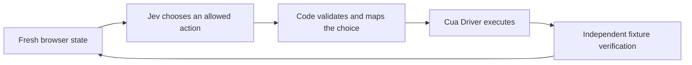

This walkthrough starts with a fresh checkout and ends with a value that Jev
selected an action to submit through Cua Driver. A separate HTTP endpoint
confirms that the form actually received it.

**Jev is not loaded into Cua Driver as a chat model.** The included Python agent
asks TypeSafe for a typed choice; code owns the arguments and execution. No
Codex, ChatGPT subscription, model weights, GPU, OCR, or video tools are needed.
The TypeScript agent is optional, not a prerequisite for the Python route.



## 1. Prepare the desktop Mac

The commands below are for **macOS**, with a logged-in, unlocked graphical
session and internet access. Run everything on the machine whose desktop Cua
Driver controls, not on a separate SSH client or controller: `127.0.0.1` must
refer to that same Mac. This walkthrough has not been certified on Windows or
Linux; see [platform installation](/how-to-guides/driver/install) for their
separate prerequisites.

Before an agent starts, the human must authorize installing the dependencies,
using an isolated browser for the harmless local fixture, and sending that
fixture's state to TypeSafe. A human must also approve macOS permission prompts
and provide a TypeSafe API key for the live step. An agent must stop and ask
when those prerequisites are missing; it must not bypass login, TCC, or host
permission policy.

Use a Bash terminal. Stop at any failed command before advancing. Agents with
stateless shell tools must repeat the working directory and environment exports
in later calls; shell variables do not persist between independent processes.
The execution environment must allow dependency downloads, loopback connections,
and writes to its workspace, user installation/cache directories, and macOS's
per-user temporary directory (`getconf DARWIN_USER_TEMP_DIR`). If a sandbox
denies those writes, ask its operator to authorize those specific paths. That
is separate from Cua permissions; do not use `sudo` or disable the sandbox as
an installation workaround.

### Cua Driver and permissions

Reuse an existing installation. Install only if both the CLI and app-bundle
binary are absent:

```bash
export PATH="$HOME/.local/bin:$PATH"
if ! command -v cua-driver >/dev/null 2>&1 &&
   [ ! -x /Applications/CuaDriver.app/Contents/MacOS/cua-driver ]; then
  /bin/bash -c "$(curl -fsSL https://cua.ai/driver/install.sh)"
fi
export CUA_DRIVER_BIN="$(command -v cua-driver || printf '%s' /Applications/CuaDriver.app/Contents/MacOS/cua-driver)"
"$CUA_DRIVER_BIN" --version
"$CUA_DRIVER_BIN" status
```

If the daemon is not running, start its signed application identity in the
background, then repeat `status`:

```bash
open -n -g -a CuaDriver --args serve
```

Check the daemon's permissions and environment:

```bash
"$CUA_DRIVER_BIN" permissions status --json
"$CUA_DRIVER_BIN" doctor
```

Both `accessibility` and `screen_recording` must be `true`. If either is false
or unknown, have the human run:

```bash
"$CUA_DRIVER_BIN" permissions grant
```

In **System Settings → Privacy & Security**, enable **CuaDriver** under
**Accessibility** and **Screen & System Audio Recording**. Accept a requested
app restart, restart the daemon if necessary, and check again. The prompts
alone do not grant access. A `direct_capture_status` of `not_checked` in the
read-only permission report is not itself a failure. See
[macOS permissions](/reference/cua-driver/macos-permissions) if the app identity
is missing or stale. Do not change to unrestricted mode to make this example run.

### Browser

Install vendor-signed [Google Chrome](https://www.google.com/chrome/) at
`/Applications/Google Chrome.app` if it is not already present. Check:

```bash
test -d '/Applications/Google Chrome.app'
/usr/bin/codesign --verify --deep --strict '/Applications/Google Chrome.app'
```

The agent uses `browser_prepare` to create a **Driver-owned isolated profile**.
Do not launch a personal profile, grant existing-profile access, start a remote
Chrome debugging port, or reuse browser IDs from another run. A browser engine
downloaded by a test framework is not a substitute for this system installation.

### Python tooling

Install [uv](https://docs.astral.sh/uv/getting-started/installation/) if absent:

```bash
export PATH="$HOME/.local/bin:$PATH"
if ! command -v uv >/dev/null 2>&1; then
  curl -LsSf https://astral.sh/uv/install.sh | env UV_NO_MODIFY_PATH=1 sh
fi
export PATH="$HOME/.local/bin:$PATH"
uv --version
git --version
```

If `git --version` asks for Apple's Command Line Tools, the human must complete
that installation before continuing. The next step provisions Python 3.12;
the macOS system Python can be too old. Do not modify the system Python.

## 2. Get the example and install locked dependencies

Choose a new working directory; do not overwrite an existing checkout.

```bash
git clone --depth 1 https://github.com/trycua/cua.git cua-jev
cd cua-jev
```

**While [PR #3916](https://github.com/trycua/cua/pull/3916) is unmerged**, the
example is not on `main`. Use the following fallback inside this fresh clone:

```bash
if [ ! -f libs/cua-driver/examples/typesafe-jev/verify_setup.py ]; then
  git fetch --depth 1 origin refs/pull/3916/head
  git switch --detach FETCH_HEAD
fi
git rev-parse HEAD
cd libs/cua-driver/examples/typesafe-jev
uv sync --frozen --python 3.12
.venv/bin/python --version
```

Record the printed commit and Python version with your results. `--frozen`
uses the checked-in `uv.lock`; it should not modify dependency files. The
example installs the official `typesafe-sdk` and the MCP client. There is no
need to write an adapter, install an agent skill, or read a private worklog.

Run the credential-free unit checks:

```bash
uv run --frozen python -m unittest discover -s python/tests
```

These are code checks, not evidence of an operational desktop or live provider.

## 3. Prove the Driver connection without Jev

From the example directory, with `CUA_DRIVER_BIN` still exported, run:

```bash
uv run --frozen python verify_setup.py --output-dir proof-mock
```

Use a new output directory for each attempt; existing directories are refused
so a retry cannot erase failed evidence.

The verification command owns the fixture's lifetime inside one process. It
starts the existing loopback-only form on an unused port, runs the existing
agent, independently reads `/state`, and closes the server on success or failure.
No separate terminal, `nohup`, remembered PID, or cross-call process control is
needed. Run the entire command in **one** agent shell call and allow it to finish.

The agent keeps one MCP connection and named session alive, discovers its new
browser's PID/window, types a verification token, and clicks Submit using fresh
`semantic_v2` page refs. It never borrows an existing CLI or MCP session.

Require all three pieces of evidence:

1. A runner event with `"outcome": "verified"` and `"token": "jev-guide-mock"`.
2. An `independently_verified` event whose `observed` value is
   `{"submitted": "jev-guide-mock"}`.
3. A final event with `"event": "setup_complete"`, `"checks": 1`, and
   `"fixture_closed": true`.

Inspect the saved summary without contacting a now-closed fixture:

```bash
.venv/bin/python -m json.tool proof-mock/summary.json
```

It must contain `"complete": true` and one verified Python/mock check. The
per-run log is `proof-mock/python-mock.jsonl`. The verifier requires both the
runner's final event and the exact independently observed token: a zero exit
status, screenshot, or successful action response alone is insufficient.
Never submit the token directly with HTTP or JavaScript to manufacture a pass.
The mock proves the desktop integration, not Jev authentication or decisions.

## 4. Provide a TypeSafe key and run live Jev

Create an API key in the [TypeSafe console](https://console.typesafe.ai/).
The [official SDK](https://docs.typesafe.ai/sdk/python) reads
`TYPESAFE_API_KEY` from its process environment.

For an unattended agent, the human or secret manager must supply that environment
variable to the agent's execution environment in advance. Do not paste the key
into chat, put it in a command argument, commit it, or print it. Disable shell
tracing and avoid environment dumps. There is no credential-free live mode.

For a human at an interactive terminal, the command below prompts securely if
the variable is absent. The input is not echoed, stored in shell history, or
persisted to a file. An unattended run without the variable fails before
starting the fixture or making provider calls.

```bash
uv run --frozen python verify_setup.py --live --output-dir proof-live
```

This runs a fresh Python mock check and then a **live** Jev check, sequentially
against the owned fixture. Each run resets its state. Require:

- `independently_verified` for `"provider": "live"`, with
  `"observed": {"submitted": "jev-guide-live"}`;
- `setup_complete` with `"checks": 2` and `"fixture_closed": true`; and
- `proof-live/summary.json` with `"complete": true`, including both checks.

```bash
.venv/bin/python -m json.tool proof-live/summary.json
```

Live verification makes billable TypeSafe requests. It sends the fixture's page
observation, action descriptions, and short action history—not your personal
browser profile—to the provider. Code supplies the token and tool arguments;
Jev chooses among the currently allowed action and abstention. This deliberately
constrained fixture is an integration proof, **not a general computer-use
capability test**.

Do not replace a failed live run with the mock and call it success. Preserve the
failure and its log; an abstention or exhausted step budget is not verification.
The runner allows four decisions per case and the verifier bounds each runner
process to 180 seconds. SDK transport retries mean this is not a hard
request-count or billing cap. Logged `decision_ms` includes browser observation
time; it is not a pure inference-latency measurement.

## 5. Record evidence and finish

Keep the checkout SHA, Driver/Python versions, the two proof directories, and
which host prerequisites already existed. Record any human intervention. Do
not attach credentials or unrelated screenshots. The logs contain choices,
probabilities, and timings, but are not a complete provider usage/billing audit.

Each runner closes its MCP connection; the verifier stops only its own fixture.
Do not reuse sessions or refs, stop a shared Cua daemon, or kill unrelated Chrome
processes. If the verifier fails, its summary stays `"complete": false`; inspect
the available logs before another attempt. After an abrupt external termination,
check the host's owned resources rather than assuming normal cleanup ran.

If you exported a key in your terminal, remove it when finished:

```bash
unset TYPESAFE_API_KEY
```

The interactive verifier prompt does not export the key back to your terminal.
Do not disable the screen lock or screen saver to keep an unattended run alive;
ask the human to keep the session available.

## Optional: verify the TypeScript agent

Complete the Python proof first. This route additionally needs Node.js 20 or
later and npm; install a supported release from
[nodejs.org](https://nodejs.org/en/download) if necessary.

From the same example directory:

```bash
node --version
npm --version
export npm_config_cache="$PWD/.venv/npm-cache"
npm ci
npm test
npm run typecheck
```

The local cache avoids an unwritable or root-owned global npm cache without
changing its ownership. Repeat the cache and Driver environment exports in
stateless agent shells.

With the key available again, verify all four cases in one managed invocation:

```bash
uv run --frozen python verify_setup.py --live --typescript --output-dir proof-both
```

Require Python/mock, Python/live, TypeScript/mock, and TypeScript/live checks
with exact independent token matches, followed by `setup_complete` with
`"checks": 4` and `"fixture_closed": true`. Inspect `proof-both/summary.json`
and its four JSONL logs. Without a key, omit `--live` to run the two mock cases,
but do not claim live verification.

## Troubleshoot without changing the task

| Symptom | Next step |
| --- | --- |
| Example/verifier missing | Use step 2's unmerged-PR checkout fallback; record its SHA. |
| `uv` or `cua-driver` not found | Restore `PATH` and `CUA_DRIVER_BIN` in this shell. Agents must preserve exports across calls. |
| Installer cannot write a temporary file | Ask the execution-environment operator to allow its normal user temp/install/cache paths. Do not bypass the sandbox. |
| Python version error | Run `uv sync --frozen --python 3.12`; use `.venv/bin/python`, not macOS's system Python. |
| npm cache `EACCES` | Export `npm_config_cache="$PWD/.venv/npm-cache"` before npm commands. Do not run `sudo chown` on a shared cache. |
| Existing output directory | Choose a new `--output-dir`; preserve the previous attempt. |
| `browser_route_unavailable` / no vendor-signed executable | Install the signed system Chrome application from step 1; do not attach a personal profile. |
| Empty windows, locked desktop, or missing permissions | Stop and ask the human to unlock/check the logged-in desktop and CuaDriver's grants. |
| Permission or policy refusal | Ask the host owner to authorize the specific fixture operation; do not switch modes. The verifier accepts `--port` if an approved fixed loopback port is required. |
| `session_unavailable`, stale page ref, or old PID | Check the prior outcome, then start a new complete invocation; never transplant IDs between transports. |
| Connection refused or terminated fixture | Keep the complete verifier in one shell call. Do not split out a background fixture; shell tools can terminate children or deny cross-call process signals. |
| Missing key, HTTP 401/403, quota or rate limit | Check TypeSafe access with the human. Do not log the key, loop indefinitely, or silently use another provider. |
| `unknown`, `refuted`, `abstained`, or `budget_exhausted` | Retain logs and the incomplete summary. An uncertain action may already have landed; never blindly repeat it. |
| Standalone runner `--dry-run` exits zero | It suppresses the candidate action but still resets the fixture and prepares/navigates the browser. It is not a completed task or a side-effect-free preflight. |

## Continue beyond the fixture

Adapt the example's candidate builder, goal/state, and independent completion
oracle for a new authorized task. Do not expose arbitrary tools merely because
the model can name them. Keep fresh observations and arguments owned by code.
The example README also describes the standalone runners for an application
that already owns a persistent fixture lifecycle.

This example uses existing Driver tools, not the proposed `suggest_action`
tool in [PR #3914](https://github.com/trycua/cua/pull/3914). It was inspired by the
MIT-licensed [`awlevin/typesafe-computer-use`](https://github.com/awlevin/typesafe-computer-use)
project; its implementation uses Cua Driver's typed browser and MCP contracts
rather than copying that project's source.
