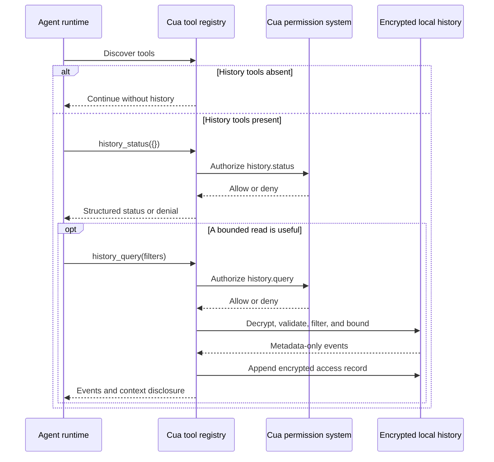

import { Callout } from 'fumadocs-ui/components/callout';

Computer History is an opt-in encrypted local record of actions performed
through Cua Driver. Agent runtimes can read bounded metadata through two
permission-gated tools. They cannot control capture or access the encryption
key and encrypted chunks.

<Callout type="info">
  This contract covers the early preview in nightly macOS, Windows, and Linux builds. Discover tools
  at runtime and tolerate their absence.
</Callout>

## Integration flow



The access record is appended only when a successful query returns at least
one event. The response that caused it does not include the new access record.

## Availability and feature detection

The runtime registers the tools only when the desktop daemon admits the
preview. Tool presence does not prove that the user granted the calling agent
access.

| Observed state                          | Meaning                                                                     | Host behavior                                              |
| --------------------------------------- | --------------------------------------------------------------------------- | ---------------------------------------------------------- |
| Neither tool is advertised              | The runtime does not admit the preview or the platform does not support it. | Continue without history.                                  |
| `history_status` is advertised          | The runtime admits the preview.                                             | Request `history.status` permission before reading status. |
| `enabled: false`                        | Capture is off. Earlier encrypted history may remain.                       | Query only when prior history is useful and authorized.    |
| `paused: true`                          | New capture is paused.                                                      | Treat history after the pause point as incomplete.         |
| Drops or unhealthy storage are reported | The record may contain gaps.                                                | Preserve the warning and avoid completeness claims.        |

## Consultation behavior

Tool discovery makes history available to a model. It does not cause the model
to call either tool. A history-aware host should consult history when the user
asks it to continue, resume, recall recent Cua activity, explain a prior Cua
run, or locate where a Cua-mediated workflow stopped.

For a matching request, the host should:

1. discover the history tools before broader desktop inspection;
2. call `history_status` and retain disabled, paused, unhealthy, and
   dropped-event state;
3. when useful and authorized, call `history_query` with a bounded recent
   slice;
4. treat events as metadata evidence rather than a transcript;
5. keep omitted content, geometry, arguments, results, and user intent
   unknown;
6. use the returned application or capability as a lead and verify current
   state through the least intrusive source; and
7. continue without history after absence, denial, empty results, or a
   recoverable history failure.

A trusted system instruction or bundled skill can guide this behavior. A host
may instead perform the status and query preflight before model execution when
deterministic consultation is required.

| Integration level          | Required behavior                                                                  | Accurate claim                                                               |
| -------------------------- | ---------------------------------------------------------------------------------- | ---------------------------------------------------------------------------- |
| Tool-capable               | The runtime advertises the tools and schemas.                                      | Agents can query Computer History.                                           |
| History-aware              | A trusted policy directs consultation for matching requests and handles fallbacks. | The agent checks Computer History for recent-work and continuation requests. |
| Deterministic consultation | The host enforces status and bounded-query preflight before broader discovery.     | The agent automatically checks Computer History for matching requests.       |

Prompt wording can guide tool selection but does not establish deterministic
consultation.

## `history_status`

Returns operational metadata without returning history events.

**Required capability:** `history.status`

**Properties:** read-only, non-destructive, idempotent, closed-world

**Input:** an empty object. Unknown fields are rejected.

Important response fields are:

| Field            | Type    | Meaning                                                            |
| ---------------- | ------- | ------------------------------------------------------------------ |
| `supported`      | boolean | The platform adapter supports the preview.                         |
| `admitted`       | boolean | The daemon admitted the experimental feature.                      |
| `enabled`        | boolean | The user enabled capture.                                          |
| `paused`         | boolean | New action capture is paused.                                      |
| `encrypted`      | boolean | The encrypted storage profile is active. Preview 0 returns `true`. |
| `profile`        | string  | Storage profile identifier.                                        |
| `retention_days` | integer | Query-visible retention. Default: `7`.                             |
| `quota_bytes`    | integer | Encrypted-store quota. Default: `104857600`.                       |
| `bytes_used`     | integer | Current encrypted bytes under the history root.                    |
| `dropped_events` | integer | Events dropped by the nonblocking capture path.                    |
| `health`         | string  | Fixed health category.                                             |

Health categories are `ready`, `disabled`, `paused`, `not_admitted`,
`key_unavailable`, `key_locked`, `key_corrupt`, `key_destroy_failed`,
`storage_unavailable`, `storage_corrupt`, `quota_reached`, `events_dropped`, and
`writer_stopped`.

## `history_query`

Returns a bounded event slice that may enter the current model context.

**Required capability:** `history.query`

**Properties:** read-only, non-destructive, closed-world. A successful
non-empty query appends an encrypted access record, so the call is not
idempotent.

| Field            | Type    | Required | Bounds              | Meaning                                                                                           |
| ---------------- | ------- | -------- | ------------------- | ------------------------------------------------------------------------------------------------- |
| `limit`          | integer | No       | `1..200`            | Maximum events. Default: `50`.                                                                    |
| `session_id`     | string  | No       | `1..128` characters | Opaque ID returned by history, or a caller-known session label resolved in the history namespace. |
| `since_sequence` | integer | No       | `>=1`               | Inclusive lower sequence bound.                                                                   |
| `until_sequence` | integer | No       | `>=1`               | Inclusive upper sequence bound.                                                                   |

Unknown fields are rejected. When both sequence bounds are present,
`since_sequence` must not exceed `until_sequence`.

Events are ordered by `data.sequence`. The query applies every filter, retains
the newest `limit` matching events, and returns that slice in ascending order.
The preview has no opaque pagination token. Missing sequence numbers are valid
gap evidence because capture uses a bounded nonblocking queue.

Every response includes:

```json
{
  "events": [],
  "metadata_only": true,
  "model_context_disclosure": true
}
```

## Event contract

Events use CloudEvents 1.0 JSON and
`urn:cua-driver:schema:history-event:v0`.

| Event type                               | Payload kind       | Meaning                                                   |
| ---------------------------------------- | ------------------ | --------------------------------------------------------- |
| `cua-driver.history.control.v0`          | `control`          | User lifecycle operation such as enable, pause, or flush. |
| `cua-driver.history.action_started.v0`   | `action_started`   | A Cua-mediated action began.                              |
| `cua-driver.history.action_completed.v0` | `action_completed` | The validated action outcome.                             |
| `cua-driver.history.session_started.v0`  | `session`          | A Cua Driver lifecycle session began.                     |
| `cua-driver.history.session_ended.v0`    | `session`          | A Cua Driver lifecycle session ended.                     |
| `cua-driver.history.access.v0`           | `access`           | A local CLI or agent query returned events.               |
| `cua-driver.history.health.v0`           | `health`           | A fixed writer-health or dropped-event marker.            |

Clients must branch on both `dataschema` and `type`. Stop interpreting an event
whose schema is unsupported.

## Permission contract

Status and query are separate private-observation operations. Permission for
`history.status` does not grant `history.query`.

In bounded mode, the approved manifest must name the tools and the matching
computer-history operations:

```yaml
version: 3
expires_after: 1h
idle_timeout: 10m
resources:
  computer_history:
    operations:
      - status
      - query
allow:
  tools:
    - history_status
    - history_query
```

An agent may propose this manifest. The trusted launcher selects and approves
it. Clients must surface a denial and continue without history. They must not
read the store directly, change permission modes, or reconstruct denied
history with another observation tool.

## Privacy and storage boundary

Returned events may contain timestamps, opaque identifiers, capability names,
fixed application identity fields, and fixed outcome, route, delivery,
evidence, lifecycle, access, and health categories.

The contract prohibits screenshots, video, audio, accessibility trees, typed
text, raw keystrokes, clipboard contents, raw tool arguments or results, file
paths, window titles, URLs, and free-form diagnostics.

Each CloudEvent is encrypted and authenticated inside a COSE_Encrypt0 record.
Records use RFC 8742 CBOR Sequence framing. A native credential-store key and
per-chunk HKDF keys protect data at rest. History payloads remain local and
history tools are excluded from per-tool and agent-session telemetry.

## Errors

Tool failures return a structured `code`. Authorization may deny the call
before tool execution through the normal authorization envelope.

| Code                           | Host behavior                                                          |
| ------------------------------ | ---------------------------------------------------------------------- |
| `invalid_history_query`        | Correct the request once. Do not retry it unchanged.                   |
| `invalid_history_query_range`  | Correct the sequence bounds.                                           |
| `history_preview_not_admitted` | Refresh tool discovery and continue without history.                   |
| `history_key_unavailable`      | Report history as unavailable.                                         |
| `history_key_locked`           | Let the user unlock the native credential store.                       |
| `history_key_corrupt`          | Stop querying and direct the user to local recovery controls.          |
| `history_storage_unavailable`  | Continue the primary task without history.                             |
| `history_storage_corrupt`      | Stop consuming results and direct the user to local recovery controls. |
| `history_quota_reached`        | Treat history after that point as incomplete.                          |
| `history_events_dropped`       | Treat the affected interval as incomplete.                             |
| `history_writer_stopped`       | Do not assume new events are recorded.                                 |

## Version identifiers

| Contract          | Identifier                                                            |
| ----------------- | --------------------------------------------------------------------- |
| Status tool       | `history_status`                                                      |
| Query tool        | `history_query`                                                       |
| Status capability | `history.status`                                                      |
| Query capability  | `history.query`                                                       |
| Event schema      | `urn:cua-driver:schema:history-event:v0`                              |
| Storage profile   | `cua-history-profile-v1/cbor-sequence+cose-encrypt0+cloudevents-json` |

The tool and capability names are intended to remain stable. The event schema
is experimental. Clients must use runtime tool discovery and advertised input
schemas.

## Source contracts

- [Full agent integration RFC](https://github.com/trycua/cua/blob/main/libs/cua-driver/docs/computer-history-agent-integration-rfc.md)
- [Event schema](https://github.com/trycua/cua/blob/main/libs/cua-driver/docs/computer-history-event-v0.schema.json)
- [Encrypted storage profile](https://github.com/trycua/cua/blob/main/libs/cua-driver/docs/computer-history-profile-v1.cddl)
- [Use Computer History](/how-to-guides/driver/use-computer-history)
