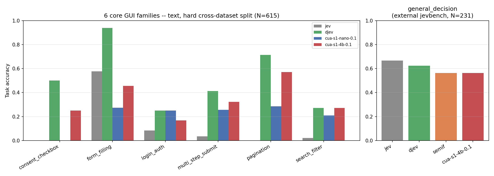

# cua-bench-s1

cua-bench-s1 is a benchmark for computer-use GUI decision-making. Given a
screen state (a screenshot and/or an accessibility tree) and a fixed, closed
set of candidate `(element, action)` options, a model under test must pick
the correct option for every element on screen. This is a "typed
bounded-decision" task shape: a model never generates free text, only scores
a probability distribution over a pre-enumerated option set, which makes
scoring exact and model-agnostic.

Each task carries a gold answer, and the full dataset is content-hashed
(`cua_bench_s1.task.dataset_hash`) before any model sees it, so a later
change to the eval set is visible as a hash change rather than silently
absorbed into a leaderboard number.

## Task schema

A `CuaTask` (`cua_bench_s1/task.py`) has:

- `state`: a screenshot path and/or an accessibility-tree text rendering of
  one viewport of one app/page at one moment. Modality is a property of an
  *eval run*, not of the task itself: the same task can be scored under
  `text` or `multimodal`, with the eval runner stripping whichever artifact
  the other modality would use before handing the task to a model.
- `options`: the fixed, enumerable set of `(element, action)` pairs to score
  -- e.g. `(Edit "Email", fill:<entity>)`, `(CheckBox "I consent...", check)`,
  `(Button "Submit", click)`, or `skip` for any element.
- `expected`: the gold action per element, used only for scoring.

Actions are drawn from a small, closed taxonomy: `fill`, `check`, `click`,
`select`, `scroll`, `skip`.

## Results



Task-level accuracy (every element in a task must be scored correctly). `jev`
is a hosted external API baseline; `djev` and `semif` are zero-shot/untrained
baselines for the two architectures `cua-s1-nano-0.1` and `cua-s1-4b-0.1`
descend from. `—` = not measured for that model; `n/a` = not applicable
(no modality or task shape for that model). **Bold** marks the best score in
each row; where `cua-s1-nano-0.1` is (or ties for) the best score, the bold
instead marks the next-best score.

| Family | Split / modality | N | `jev` | `djev` | `semif` (0-shot) | `cua-s1-nano-0.1` | `cua-s1-4b-0.1` |
| --- | --- | --- | --- | --- | --- | --- | --- |
| `consent_checkbox` | text, hard cross-dataset (GUI-360) | 615 total | 0.000 | **0.500** | — | 0.000 | 0.250 |
| `form_filling` | text, hard cross-dataset (GUI-360) | 615 total | 0.576 | **0.939** | — | 0.273 | 0.455 |
| `login_auth` | text, hard cross-dataset (GUI-360) | 615 total | 0.083 | **0.250** | — | 0.250 | 0.167 |
| `multi_step_submit` | text, hard cross-dataset (GUI-360) | 615 total | 0.034 | **0.412** | — | 0.256 | 0.322 |
| `pagination` | text, hard cross-dataset (GUI-360) | 615 total | 0.000 | **0.714** | — | 0.286 | 0.571 |
| `search_filter` | text, hard cross-dataset (GUI-360) | 615 total | 0.021 | **0.271** | — | 0.208 | **0.271** |
| `consent_checkbox` | multimodal, same-distribution | 14-86 | n/a | 0.071 | 0.357 | 1.000 | **1.000** |
| `form_filling` | multimodal, same-distribution | 14-86 | n/a | 0.000 | 0.100 | 1.000 | **1.000** |
| `login_auth` | multimodal, same-distribution | 14-86 | n/a | 0.000 | 0.235 | 1.000 | **1.000** |
| `multi_step_submit` | multimodal, same-distribution | 14-86 | n/a | 0.750 | 0.167 | 1.000 | **1.000** |
| `pagination` | multimodal, same-distribution | 14-86 | n/a | 0.444 | 0.000 | 1.000 | **1.000** |
| `search_filter` | multimodal, same-distribution | 14-86 | n/a | 0.429 | 0.214 | 1.000 | **1.000** |
| `safety_gate` | text, zero-shot | 14 | **0.286** | — | 0.000 | 0.000 | 0.071 |
| `safety_gate` | text, finetuned on own train split | 14 | — | — | — | 1.000 | **1.000** |
| `chess` | text, task accuracy | 800 | — | — | — | 0.000 | **0.000** (N=15, <=26-option subset) |
| `chess` | text, element accuracy | 800 | — | — | — | 0.035 | **0.515** (N=15, <=26-option subset) |
| `chess` | multimodal, task accuracy | 800 | — | — | — | 0.000 | **0.000** (N=15, <=26-option subset) |
| `chess` | multimodal, element accuracy | 800 | — | — | — | 0.035 | **0.409** (N=15, <=26-option subset) |
| `general_decision` (external `jevbench`) | text, zero-shot, out-of-domain | 231 | **0.667** | 0.623 | 0.563 | n/a | 0.563 |

`chess` uses a real Stockfish-backed, freshly generated 800-position dataset
where every legal move is scored as its own real click-vs-skip decision (a
prior version of this table reported a since-withdrawn 1.000 on a task
construction that let every non-gold move auto-score as correct). Task
accuracy requires the model to be right about every legal move in a
position, so 0.000 is the expected floor once move selection is genuinely
tested; element accuracy (per move) is the more informative number at this
model scale. `game_control` is temporarily withdrawn while its dataset is
regenerated under the same fix.

`cua-s1-4b-0.1`'s decoding contract assigns each candidate option a unique
single-token letter, capping it at 26 options per task -- most real chess
positions exceed that, so its chess numbers cover the 15 positions (of 800)
that fit.

<!-- TODO: latency and memory-footprint figures per checkpoint go here once a standardized measurement setup (hardware, batch size) is finalized. -->

## Task families

Families marked **trained-on** are represented in the synthetic generator and
the real-GUI-dataset converters and are intended to be used for both training
and evaluation. Families marked **held-out only** are provided purely as
out-of-domain generalization probes and are never mixed into a training
split by this package.

| Family | Status | Source |
| --- | --- | --- |
| `form_filling` | trained-on | synthetic generator, AndroidControl, GUI-360 |
| `login_auth` | trained-on | synthetic generator, AndroidControl, GUI-360 |
| `consent_checkbox` | trained-on | synthetic generator, AndroidControl, GUI-360 |
| `multi_step_submit` | trained-on | synthetic generator, AndroidControl, GUI-360 |
| `pagination` | trained-on | synthetic generator, AndroidControl, GUI-360 |
| `search_filter` | trained-on | synthetic generator, AndroidControl, GUI-360 |
| `safety_gate` | trained-on | synthetic generator only |
| `game_control` | held-out only | ViZDoom (ATTACK/turn/move decisions from a live game frame) |
| `chess` | held-out only | python-chess + Stockfish (real legal positions, real engine gold moves) |
| `general_decision` | held-out only | an external text-only typed-bounded-decision benchmark |

See [`docs/TASK_FAMILIES.md`](docs/TASK_FAMILIES.md) for the full description
of each family, the hard-negative and hard-distractor decoy design, and the
safety taxonomy behind `safety_gate`.

## Data sources and provenance

- **Synthetic generator** (`cua_bench_s1/datagen/generator.py`): hand-written
  `AppSpec`s covering form-filling, login, consent, multi-step forms,
  pagination, and search/filter, rendered deterministically to a page image
  and/or accessibility tree. No network access or external data required.
- **AndroidControl** (`datagen/androidcontrol.py`): Google Research,
  Apache-2.0. Converts real recorded mobile-app trajectories (screenshot +
  live accessibility tree + one gold action per step) into `CuaTask`s.
- **GUI-360** (`datagen/gui360.py`): MIT-licensed. Converts real recorded
  desktop Word/Excel/PowerPoint trajectories (screenshot + live Windows UI
  Automation control tree + one gold action per step).
- **Chess** (`datagen/chess_gym.py`): python-chess (GPL-3.0) for legal move
  generation and rendering, Stockfish (GPL-3.0) as the gold-move oracle when
  available on `PATH` (a documented weaker fallback is used otherwise, and
  the run always discloses which one via `provenance["gold_label_method"]`).
  Held out only.
- **ViZDoom `game_control`** (`datagen/vizdoom_gym.py`): MIT-licensed. Drives
  real, live ViZDoom episodes and derives gold actions from the engine's own
  ground-truth object-label buffer via a disclosed, local aim heuristic.
  Multimodal only -- there is no honest text representation of a Doom frame.
  Held out only.
- **External benchmark import** (`datagen/external_bench_import.py`):
  converts the public dataset from
  [fstandhartinger/jevbench](https://github.com/fstandhartinger/jevbench)
  (MIT-licensed) -- a real, independent, pure-text typed-bounded-decision
  benchmark -- into the same `CuaTask` shape, as a held-out, out-of-domain
  probe of whether a GUI-trained model's decision skill transfers to a
  domain with no screen at all.

A hard-negative/hard-distractor design note, honestly stated: an early decoy
design gave every non-gold "trap" element only a `skip`-only option set,
which a model could defeat by shallow text-matching (does this element's
label textually resemble a present source value) without ever having to
choose between two *plausible* candidate actions. The hard-distractor variant
(enabled per-generator/per-converter) closes that gap by giving a same-role,
lexically-similar decoy a real, present non-`skip` option that targets the
same entity or role as the genuine gold element elsewhere on the same screen
-- so a model must identify the correct *slot* for an action, not just that
the action is plausible somewhere on the page.

## Running an evaluation

Any architecture can be scored by implementing the `ModelAdapter` interface:

```python
from cua_bench_s1.eval.adapter import ModelAdapter, option_key

class MyAdapter(ModelAdapter):
    name = "my-model"

    def predict(self, task, modality):
        # Return a probability for every (element, action) option in
        # task.options, with each element's own options summing to ~1.
        ...
```

Then run it over a dataset:

```python
from pathlib import Path
from cua_bench_s1.task import load_jsonl
from cua_bench_s1.eval.runner import run_and_save

tasks = load_jsonl("tasks.jsonl")
summary = run_and_save(tasks, MyAdapter(), modality="text", out_dir=Path("results/my-model"))
print(summary)
```

`run_and_save` writes `raw.jsonl` (per-task results), `summary.json`
(accuracy, element accuracy, expected calibration error, a composite score,
and the dataset hash the run was scored against), and `diagnostics.json` (a
per-family / per-element-role / per-gold-action breakdown, plus a confusion
matrix) to `out_dir`. See `cua_bench_s1/eval/diagnostics.py` for why the
per-family/role/action breakdown exists: a single top-line accuracy number
can hide a failure isolated to one family or one action type that an
aggregate score averages away.

Distribution validation is fail-closed
(`cua_bench_s1.eval.scoring.validate_distribution`): an adapter's output must
cover exactly the task's option set, be non-negative, and have each
element's own options sum to ~1. Anything else scores as fully wrong, never
as a runner error that gets silently skipped.

To generate a small synthetic dataset yourself (no network access required):

```python
from pathlib import Path
from cua_bench_s1.datagen.generator import generate_dataset
from cua_bench_s1.datagen.specs import EXAMPLE_APPS
from cua_bench_s1.task import save_jsonl

tasks = generate_dataset(EXAMPLE_APPS, n_per_app=5, seed=0,
                         modality_available=("text", "multimodal"),
                         out_dir=Path("out/images"))
save_jsonl(tasks, "out/tasks.jsonl")
```

## Status

cua-bench-s1 is at an early research stage. This release includes the task
schema, the synthetic generator, external-dataset converters, and a
model-agnostic scoring/diagnostics harness. It does not include or download
model weights, pre-built datasets, or real external-dataset files -- the
converters read source data you supply yourself, and licensing terms for
each external dataset are as stated above and in `docs/PROVENANCE.md`. See
the [Results](#results) section above for the real, measured numbers this
release does establish.

The source code in this package is available under the repository's MIT
license. That license does not cover data licensed separately by its
external source (see `docs/PROVENANCE.md`), nor Cua trademarks.

## Responsible use

This benchmark measures a model's ability to pick the correct GUI action out
of a closed option set on a held-out task; it does not certify that a model
is safe to deploy with real execution privileges. The `safety_gate` family
specifically measures whether a model correctly *declines* to take a
superficially-available but harmful action -- treat a low score there as a
signal to add human review before granting execution privileges, not as
something to optimize away by narrowing the option set.
