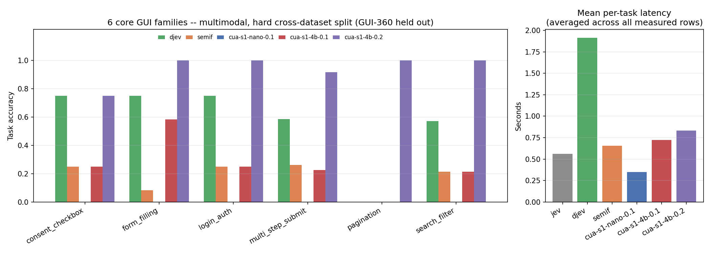

# cua-bench-s1

cua-bench-s1 is a benchmark for computer-use GUI decision-making. Given a
screen state (a screenshot and/or an accessibility tree) and a fixed, closed
set of candidate `(element, action)` options, a model under test must pick
the correct option for every element on screen. Scoring is exact and
model-agnostic: a model scores a probability distribution over a
pre-enumerated option set rather than generating free text.

The full dataset is content-hashed (`cua_bench_s1.task.dataset_hash`) before
any model sees it.

## Task schema

A `CuaTask` (`cua_bench_s1/task.py`) has:

- `state`: a screenshot path and/or an accessibility-tree text rendering of
  one viewport of one app/page at one moment. Modality is a property of an
  *eval run*, not of the task itself.
- `options`: the fixed, enumerable set of `(element, action)` pairs to score
  -- e.g. `(Edit "Email", fill:<entity>)`, `(CheckBox "I consent...", check)`,
  `(Button "Submit", click)`, or `skip` for any element.
- `expected`: the gold action per element, used only for scoring.

Actions: `fill`, `check`, `click`, `select`, `scroll`, `skip`.

## Results




Task-level accuracy (every element in a task must be scored correctly). `jev`
is a hosted external API baseline; `djev` and `semif` are zero-shot/untrained
baselines for the two architectures `cua-s1-nano-0.1`, `cua-s1-4b-0.1` and
`cua-s1-4b-0.2` descend from. `—` = not measured for that model; `n/a` = not
applicable (no modality or task shape for that model). **Bold** marks the
best score in each row; where `cua-s1-nano-0.1` is (or ties for) the best
score, the bold instead marks the next-best score. `p_chance` is the real,
measured chance-level accuracy for that row (see the calibration formula
below).

| Family | Split / modality | `p_chance` | `jev` | `djev` | `semif` (0-shot) | `cua-s1-nano-0.1` | `cua-s1-4b-0.1` | `cua-s1-4b-0.2` |
| --- | --- | --- | --- | --- | --- | --- | --- | --- |
| `consent_checkbox` | text, hard cross-dataset (GUI-360) | 0.250 | 0.000 | 0.750 | 0.417 | 0.000 | 0.250 | **0.833** |
| `form_filling` | text, hard cross-dataset (GUI-360) | 0.250 | 0.576 | 0.606 | 0.273 | 0.000 | 0.455 | **0.939** |
| `login_auth` | text, hard cross-dataset (GUI-360) | 0.250 | 0.083 | 0.833 | 0.167 | 0.000 | 0.167 | **1.000** |
| `multi_step_submit` | text, hard cross-dataset (GUI-360) | 0.250 | 0.034 | 0.696 | 0.340 | 0.000 | 0.322 | **0.867** |
| `pagination` | text, hard cross-dataset (GUI-360) | 0.250 | 0.000 | 0.000 | 0.286 | 0.000 | **0.571** | 0.429 |
| `search_filter` | text, hard cross-dataset (GUI-360) | 0.250 | 0.021 | 0.604 | 0.354 | 0.000 | 0.271 | **0.958** |
| `consent_checkbox` | multimodal, same-distribution (0.1's split) | 0.232 | n/a | 0.071 | 0.357 | **1.000** | 1.000 | 0.071 |
| `form_filling` | multimodal, same-distribution (0.1's split) | 0.044 | n/a | 0.000 | 0.100 | **1.000** | 1.000 | 0.000 |
| `login_auth` | multimodal, same-distribution (0.1's split) | 0.169 | n/a | 0.000 | 0.235 | **1.000** | 1.000 | 0.059 |
| `multi_step_submit` | multimodal, same-distribution (0.1's split) | 0.188 | n/a | 0.750 | 0.167 | **1.000** | 1.000 | 0.000 |
| `pagination` | multimodal, same-distribution (0.1's split) | 0.500 | n/a | 0.444 | 0.000 | **1.000** | 1.000 | 0.778 |
| `search_filter` | multimodal, same-distribution (0.1's split) | 0.130 | n/a | 0.429 | 0.214 | **1.000** | 1.000 | 0.214 |
| `consent_checkbox` | multimodal, hard cross-dataset (GUI-360), N=4 | 0.250 | n/a | **0.750** | 0.250 | 0.000 | 0.250 | **0.750** |
| `form_filling` | multimodal, hard cross-dataset (GUI-360), N=12 | 0.250 | n/a | 0.750 | 0.083 | 0.000 | 0.583 | **1.000** |
| `login_auth` | multimodal, hard cross-dataset (GUI-360), N=4 | 0.250 | n/a | 0.750 | 0.250 | 0.000 | 0.250 | **1.000** |
| `multi_step_submit` | multimodal, hard cross-dataset (GUI-360), N=133 | 0.250 | n/a | 0.586 | 0.263 | 0.000 | 0.226 | **0.917** |
| `pagination` | multimodal, hard cross-dataset (GUI-360), N=1 | 0.250 | n/a | 0.000 | 0.000 | 0.000 | 0.000 | **1.000** |
| `search_filter` | multimodal, hard cross-dataset (GUI-360), N=14 | 0.250 | n/a | 0.571 | 0.214 | 0.000 | 0.214 | **1.000** |
| `safety_gate` | text, zero-shot for others; in-distribution (not zero-shot) for 0.2 | 0.138 | 0.286 | 0.500 | 0.000 | 0.000 | 0.071 | **1.000** |
| `safety_gate` | multimodal, zero-shot | 0.138 | n/a | 0.286 | 0.000 | 0.000 | 0.000 | **0.643** |
| `safety_gate` | text, finetuned on own train split | 0.138 | n/a | n/a | n/a | 1.000 | 1.000 | **1.000** |
| `chess` | text, task accuracy (fair N=15, all models capped equally) | 0.072 | **0.133** | 0.000 | 0.000 | 0.000 | 0.000 | 0.067 |
| `chess` | text, element accuracy (fair N=15) | 0.500 | **0.682** | 0.227 | 0.424 | 0.227 | 0.515 | 0.576 |
| `chess` | multimodal, task accuracy (fair N=15) | 0.072 | n/a | 0.000 | 0.000 | 0.000 | 0.000 | 0.000 |
| `chess` | multimodal, element accuracy (fair N=15) | 0.500 | n/a | 0.227 | **0.409** | 0.227 | 0.227 | 0.258 |
| `game_control` | multimodal, task accuracy | 0.125 | n/a | 0.000 | 0.000 | 0.000 | 0.000 | **0.024** |
| `game_control` | multimodal, element accuracy | 0.500 | n/a | 0.333 | 0.333 | 0.333 | 0.333 | **0.569** |
| `general_decision` (external `jevbench`) | text, zero-shot, out-of-domain | 0.500 | 0.667 | 0.623 | 0.563 | n/a | 0.632 | **0.887** |
| `osworld_next_action` (external OSWorld) | multimodal, task accuracy, out-of-domain | 0.066 | n/a | 0.000 | **0.083** | 0.000 | 0.000 | 0.013 |
| `osworld_next_action` (external OSWorld) | multimodal, element accuracy, out-of-domain | 0.500 | n/a | 0.252 | **0.531** | 0.252 | 0.271 | 0.435 |
| `cua_bench_basic` (real live envs, agentic) | text, held-out task variants, N=18 | — | n/a | **0.889** | 0.333 | n/a | 0.000 | **0.944** |
| `cua_bench_basic` (real live envs, agentic) | multimodal, held-out task variants, N=18 | — | n/a | 0.667 | 0.389 | n/a | 0.333 | **0.722** |

Notes on reading the table above:

- The `text, hard cross-dataset (GUI-360)` rows are scored on one frozen
  615-task split (`dataset_hash` `b38d0f887fad6e719...5d946c82b90`).
  `djev`, `semif` and `cua-s1-4b-0.2` are scored under this package's current
  goal-conditioned prompt contract; `cua-s1-4b-0.1` is scored under the
  prompt contract it was trained on; `cua-s1-nano-0.1`'s per-element context
  carries no goal string at all. `jev` is a hosted external API.
- The `multimodal, hard cross-dataset (GUI-360)` rows are scored on one
  frozen 168-task split (`dataset_hash` `7463de306fe3d7e9...813ebc85070`),
  with `ax_tree` stripped. `djev`'s overall on these rows is 0.601 (ECE
  0.360); `semif` is 0.244 overall; `cua-s1-4b-0.2`'s overall is 0.929 (ECE
  0.069). `consent_checkbox` (N=4) is a tie between `djev` and
  `cua-s1-4b-0.2`, not a win.
- `cua-s1-4b-0.2`'s SFT training split (`crossdataset_hard_v2`) includes
  `safety_gate`-family tasks (no overlap with the `safety_gate` test set),
  so its `safety_gate` row is in-distribution, not zero-shot like the other
  models'. Its "finetuned" cell uses the same recipe as `cua-s1-4b-0.1`'s
  (a fresh LoRA on `data/safety_gate/train.jsonl`), not a further-tuned 0.2.
- The "multimodal, same-distribution" rows are `data/v1`, the split
  `cua-s1-nano-0.1`/`cua-s1-4b-0.1` trained on; `cua-s1-4b-0.2` trained on a
  different split (`crossdataset_hard_v2`) and never saw `data/v1`, so its
  cells in this row are out-of-distribution, not same-distribution.
- `pagination` (N=7 text, N=1 multimodal): every task in this family is a
  mid-episode `scroll` step misfiled by a family-taxonomy keyword heuristic
  (`datagen/androidcontrol.assign_family`), not a genuine pagination
  decision -- read the row as a labeling artifact, not a capability result.
- `cua-s1-4b-0.1` ships two independently trained LoRA adapters, `text/` and
  `multimodal/`, published together at `cua-ai/cua-s1-4b-0.1`;
  `cua_s1.four_b.FourBModel` loads the correct one for the requested
  modality. `cua-s1-4b-0.2` is a separate pair of adapters on the same frozen
  `Qwen/Qwen3.5-4B` base, published at `cua-ai/cua-s1-4b-0.2` under the same
  layout, and does not replace `cua-s1-4b-0.1`.
- `chess` uses a real Stockfish-backed, 800-position dataset. Because
  `cua-s1-4b-0.1`'s decoding contract caps it at 26 options per task, every
  model in the chess rows is scored on the same 15-position subset (options
  <=26).
- `game_control` uses a real, live 82-task ViZDoom dataset; gold actions come
  from the engine's own live labels-buffer heuristic.

### Chance-corrected results

Raw accuracy is misleading when task families offer different numbers of
options. This table applies

  `calibrated = max(0, (raw - p_chance) / (1 - p_chance))`

where `p_chance` is the real, measured chance-level accuracy for that row,
computed directly from the dataset files (average, over the row's scored
elements/tasks, of `1 / options`). A calibrated score of 0 means "no better
than guessing," not "the raw score was 0."

| Row | `p_chance` | `jev` | `djev` | `semif` (0-shot) | `cua-s1-nano-0.1` | `cua-s1-4b-0.1` | `cua-s1-4b-0.2` |
| --- | --- | --- | --- | --- | --- | --- | --- |
| `consent_checkbox`, text hard cross-dataset | 0.250 | 0.000 | 0.667 | 0.222 | 0.000 | 0.000 | **0.778** |
| `form_filling`, text hard cross-dataset | 0.250 | 0.435 | 0.475 | 0.030 | 0.000 | 0.273 | **0.919** |
| `login_auth`, text hard cross-dataset | 0.250 | 0.000 | 0.778 | 0.000 | 0.000 | 0.000 | **1.000** |
| `multi_step_submit`, text hard cross-dataset | 0.250 | 0.000 | 0.594 | 0.120 | 0.000 | 0.096 | **0.822** |
| `pagination`, text hard cross-dataset | 0.250 | 0.000 | 0.000 | 0.048 | 0.000 | **0.428** | 0.238 |
| `search_filter`, text hard cross-dataset | 0.250 | 0.000 | 0.472 | 0.139 | 0.000 | 0.028 | **0.944** |
| `consent_checkbox`, multimodal same-distribution | 0.232 | n/a | 0.000 | 0.163 | **1.000** | **1.000** | 0.000 |
| `form_filling`, multimodal same-distribution | 0.044 | n/a | 0.000 | 0.058 | **1.000** | **1.000** | 0.000 |
| `login_auth`, multimodal same-distribution | 0.169 | n/a | 0.000 | 0.079 | **1.000** | **1.000** | 0.000 |
| `multi_step_submit`, multimodal same-distribution | 0.188 | n/a | 0.692 | 0.000 | **1.000** | **1.000** | 0.000 |
| `pagination`, multimodal same-distribution | 0.500 | n/a | 0.000 | 0.000 | **1.000** | **1.000** | **0.556** |
| `search_filter`, multimodal same-distribution | 0.130 | n/a | 0.344 | 0.097 | **1.000** | **1.000** | 0.097 |
| `consent_checkbox`, multimodal hard cross-dataset | 0.250 | n/a | **0.667** | 0.000 | 0.000 | 0.000 | **0.667** |
| `form_filling`, multimodal hard cross-dataset | 0.250 | n/a | 0.667 | 0.000 | 0.000 | 0.444 | **1.000** |
| `login_auth`, multimodal hard cross-dataset | 0.250 | n/a | 0.667 | 0.000 | 0.000 | 0.000 | **1.000** |
| `multi_step_submit`, multimodal hard cross-dataset | 0.250 | n/a | 0.448 | 0.017 | 0.000 | 0.000 | **0.889** |
| `pagination`, multimodal hard cross-dataset | 0.250 | n/a | 0.000 | 0.000 | 0.000 | 0.000 | **1.000** |
| `search_filter`, multimodal hard cross-dataset | 0.250 | n/a | 0.428 | 0.000 | 0.000 | 0.000 | **1.000** |
| `safety_gate`, text (0.2 in-distribution, others zero-shot) | 0.138 | 0.171 | 0.420 | 0.000 | 0.000 | 0.000 | **1.000** |
| `safety_gate`, multimodal zero-shot | 0.138 | n/a | 0.171 | 0.000 | 0.000 | 0.000 | **0.586** |
| `safety_gate`, finetuned | 0.138 | n/a | n/a | n/a | 1.000 | 1.000 | **1.000** |
| `chess`, text, task accuracy (N=15) | 0.072 | **0.065** | 0.000 | 0.000 | 0.000 | 0.000 | 0.000 |
| `chess`, text, element accuracy (N=15) | 0.500 | **0.364** | 0.000 | 0.000 | 0.000 | 0.030 | 0.152 |
| `chess`, multimodal, task accuracy (N=15) | 0.072 | n/a | 0.000 | 0.000 | 0.000 | 0.000 | 0.000 |
| `chess`, multimodal, element accuracy (N=15) | 0.500 | n/a | 0.000 | 0.000 | 0.000 | 0.000 | 0.000 |
| `game_control`, task accuracy | 0.125 | n/a | 0.000 | 0.000 | 0.000 | 0.000 | 0.000 |
| `game_control`, element accuracy | 0.500 | n/a | 0.000 | 0.000 | 0.000 | 0.000 | **0.138** |
| `general_decision` (jevbench) | 0.500 | 0.334 | 0.246 | 0.126 | n/a | 0.264 | **0.775** |
| `osworld_next_action`, task accuracy | 0.066 | n/a | 0.000 | **0.018** | 0.000 | 0.000 | 0.000 |
| `osworld_next_action`, element accuracy | 0.500 | n/a | 0.000 | **0.062** | 0.000 | 0.000 | 0.000 |

`chess` and `game_control` do not show measurable signal on any model once
calibrated: their raw ties/edges over 0 sit at or below true chance level for
those rows. `cua-s1-4b-0.2`'s margins on the cross-dataset splits hold up
under calibration.

### Agentic (RL)

Everything above scores a single frozen screen state. This subsection scores
whole episodes: `cua-s1-4b-0.2` is stepped through the real, live
`cua-bench-basic` environments bundled at
`libs/cua-bench/datasets/cua-bench-basic/` under the `simulated` provider,
with a 20-step cap per episode and success decided by the environment's own
reward. Both adapters' RL stage trains on task variants 0-1; the numbers
below are on held-out variants 2-4, three episodes per environment.

Same protocol for every model below: held-out task variants 2-4, N=18,
20-step cap, success = terminal env reward. `n/a` = architecturally cannot
produce a comparable step-by-step decision (reason in the notes below).

| Environment | `semif` text | `semif` mm | `djev` text | `djev` mm | `cua-s1-4b-0.1` text | `cua-s1-4b-0.1` mm | `cua-s1-4b-0.2` text | `cua-s1-4b-0.2` mm |
| --- | --- | --- | --- | --- | --- | --- | --- | --- |
| `click-button` | 1/3 | 0/3 | 3/3 | 3/3 | 0/3 | 1/3 | 3/3 | 3/3 |
| `click-icon` | 1/3 | 1/3 | 3/3 | 3/3 | 0/3 | 0/3 | 3/3 | 2/3 |
| `color-picker` | 1/3 | 1/3 | 3/3 | 3/3 | 0/3 | 1/3 | 3/3 | 3/3 |
| `spreadsheet-cell` | 0/3 | 2/3 | 3/3 | 0/3 | 0/3 | 3/3 | 3/3 | 2/3 |
| `toggle-switch` | 0/3 | 0/3 | 1/3 | 0/3 | 0/3 | 1/3 | 2/3 | 0/3 |
| `typing-input` | 3/3 | 3/3 | 3/3 | 3/3 | 0/3 | 0/3 | 3/3 | 3/3 |
| **overall** | 0.333 | 0.389 | **0.889** | 0.667 | 0.000 | 0.333 | **0.944** | 0.722 |

`cua-s1-nano-0.1` and `jev` are `n/a`: neither can produce a single
cross-element comparable score for "which action to take now" (nano's
per-element scorer has no goal conditioning and no `done` option; jev's
per-question API returns a degenerate always-`done` step-0 result). `djev`'s
row is generation-based, not single-forward-pass logit readout -- its real
weights don't expose per-token logits through `generate()`, so it reads a
constrained SELECT/REJECT judgement per option instead (pre-existing
property of the `djev` architecture, not a new mechanism). `cua-s1-4b-0.1`
text collapses to `skip` on 340/360 steps (verified robust to its own
training-time prompt version); its SFT removed the agentic capability its
zero-shot base (`semif` 0.333) already had.

The text runs build state from the live DOM elements the environment
exposes; the multimodal runs get only the live screenshot with numbered
set-of-mark boxes drawn on it (`ax_tree=None`), so multimodal numbers are
pixel-grounded. `cua-s1-4b-0.2` multimodal `toggle-switch` (0/3) is
under-trained, not solved.

Only 7 of the 13 `cua-bench-basic` environments are reliably rewardable
under the `simulated` provider (an environment property, not a policy
failure -- see `cua_bench_s1.agentic.SIMULATED_UNSUPPORTED`, verifiable via
`oracle_reward_check()`). Excluded: `date-picker`, `drag-drop`, `fill-form`,
`select-dropdown`, `video-player` (not actuatable under `simulated`), and
`drag-slider` (intermittently rewardable). `right-click-menu` is separately
excluded because it exposes zero DOM elements, so no option set can be built
from it in either modality.

Both rollouts are backed by
`eval_results/agentic-cua_s1_4b_0_2-{text,multimodal}-cua_bench_basic-heldout`.

### Latency

Mean per-task inference latency (seconds), from the same eval runs as the
results table above. Hardware/batch-size setup is not standardized across
runs (`jev` is a hosted API round-trip; `djev`/`semif` ran locally on GPU;
`cua-s1-nano-0.1` is CPU-fast). `—` = not measured.

| Split / modality | `jev` | `djev` | `semif` (0-shot) | `cua-s1-nano-0.1` | `cua-s1-4b-0.1` | `cua-s1-4b-0.2` |
| --- | --- | --- | --- | --- | --- | --- |
| 6 core families, text, hard cross-dataset | 0.556 | 0.809 | 0.121 | 0.003 | 0.121-0.128 | 0.141 |
| 6 core families, multimodal, same-distribution | n/a | 1.195 | 0.293 | 0.222 | 0.345 | 0.401 |
| 6 core families, multimodal, hard cross-dataset | n/a | 1.017 | 0.283 | 0.667 | 0.301 | 0.282 |
| `safety_gate`, text | 0.553 | 3.061 | 1.078 | — | — | 1.613 |
| `safety_gate`, multimodal | n/a | 3.389 | 1.557 | 0.967 | 1.745 | 1.671 |
| `chess`, text (fair N=15, all models capped equally) | 0.534 | 3.168 | 1.117 | 0.015 | 1.274 | 1.515 |
| `chess`, multimodal (fair N=15) | n/a | 3.450 | 1.151 | 0.739 | 1.355 | 1.512 |
| `game_control`, multimodal | n/a | 1.172 | 0.300 | 0.206 | 0.343 | 0.395 |
| `general_decision` (external `jevbench`) | 0.597 | 0.858 | 0.157 | n/a | 0.203 | 0.224 |
| `osworld_next_action` | n/a | 1.029 | 0.496 | 0.306 | 0.445 | 0.569 |

## Task families

Families marked **trained-on** are represented in the synthetic generator and
the real-GUI-dataset converters and are intended to be used for both training
and evaluation. Families marked **held-out only** are provided purely as
out-of-domain generalization probes and are never mixed into a training
split by this package.

| Family | Status | Source |
| --- | --- | --- |
| `form_filling` | trained-on | synthetic generator, AndroidControl, GUI-360 |
| `login_auth` | trained-on | synthetic generator, AndroidControl, GUI-360 |
| `consent_checkbox` | trained-on | synthetic generator, AndroidControl, GUI-360 |
| `multi_step_submit` | trained-on | synthetic generator, AndroidControl, GUI-360 |
| `pagination` | trained-on | synthetic generator, AndroidControl, GUI-360 |
| `search_filter` | trained-on | synthetic generator, AndroidControl, GUI-360 |
| `safety_gate` | trained-on | synthetic generator only |
| `cua_bench_basic` | trained-on | cua-bench live environments |
| `game_control` | held-out only | ViZDoom (ATTACK/turn/move decisions from a live game frame) |
| `chess` | held-out only | python-chess + Stockfish (real legal positions, real engine gold moves) |
| `general_decision` | held-out only | an external text-only typed-bounded-decision benchmark |
| `osworld_next_action` | held-out only | real verified Ubuntu OSWorld agent trajectories (screenshot + task + action history -> next action) |

See [`docs/TASK_FAMILIES.md`](docs/TASK_FAMILIES.md) for the full description
of each family, the hard-negative and hard-distractor decoy design, and the
safety taxonomy behind `safety_gate`.

## Data sources and provenance

- **Synthetic generator** (`cua_bench_s1/datagen/generator.py`): hand-written
  `AppSpec`s covering form-filling, login, consent, multi-step forms,
  pagination, and search/filter, rendered deterministically to a page image
  and/or accessibility tree. No network access or external data required.
- **AndroidControl** (`datagen/androidcontrol.py`): Google Research,
  Apache-2.0. Converts real recorded mobile-app trajectories (screenshot +
  live accessibility tree + one gold action per step) into `CuaTask`s.
- **GUI-360** (`datagen/gui360.py`): MIT-licensed. Converts real recorded
  desktop Word/Excel/PowerPoint trajectories (screenshot + live Windows UI
  Automation control tree + one gold action per step).
- **Chess** (`datagen/chess_gym.py`): python-chess (GPL-3.0) for legal move
  generation and rendering, Stockfish (GPL-3.0) as the gold-move oracle when
  available on `PATH`. Held out only.
- **ViZDoom `game_control`** (`datagen/vizdoom_gym.py`): MIT-licensed. Drives
  real, live ViZDoom episodes and derives gold actions from the engine's own
  ground-truth object-label buffer. Multimodal only. Held out only.
- **cua-bench live environments** (`datagen/cua_bench_basic.py`): drives the
  13 real, live single-widget GUI task environments bundled at
  `libs/cua-bench/datasets/cua-bench-basic/` through real `reset()`/`solve()`
  episodes. Trained-on, split by holding out whole fresh task
  parameterizations. MIT (this repository).
- **External benchmark import** (`datagen/external_bench_import.py`):
  converts the public dataset from
  [fstandhartinger/jevbench](https://github.com/fstandhartinger/jevbench)
  (MIT-licensed) into the same `CuaTask` shape. Held out only.
- **OSWorld `osworld_next_action`** (`datagen/osworld_next_action.py`):
  converts real, verified-successful Ubuntu agent trajectories from
  [xlangai/ubuntu_osworld_verified_trajs](https://huggingface.co/datasets/xlangai/ubuntu_osworld_verified_trajs)
  (`claude-sonnet-4-5-20250929_15steps` run) into `CuaTask`s. Multimodal
  only. Held out only.

Hard distractors (enabled per-generator/per-converter): every non-gold "trap"
element gets a same-role, lexically-similar decoy with a real, present
non-`skip` option that targets the same entity or role as the genuine gold
element elsewhere on the same screen.

## Running an evaluation

Any architecture can be scored by implementing the `ModelAdapter` interface:

```python
from cua_bench_s1.eval.adapter import ModelAdapter, option_key

class MyAdapter(ModelAdapter):
    name = "my-model"

    def predict(self, task, modality):
        # Return a probability for every (element, action) option in
        # task.options, with each element's own options summing to ~1.
        ...
```

Then run it over a dataset:

```python
from pathlib import Path
from cua_bench_s1.task import load_jsonl
from cua_bench_s1.eval.runner import run_and_save

tasks = load_jsonl("tasks.jsonl")
summary = run_and_save(tasks, MyAdapter(), modality="text", out_dir=Path("results/my-model"))
print(summary)
```

`run_and_save` writes `raw.jsonl` (per-task results), `summary.json`
(accuracy, element accuracy, expected calibration error, a composite score,
and the dataset hash the run was scored against), and `diagnostics.json` (a
per-family / per-element-role / per-gold-action breakdown, plus a confusion
matrix) to `out_dir`.

Distribution validation is fail-closed
(`cua_bench_s1.eval.scoring.validate_distribution`): an adapter's output must
cover exactly the task's option set, be non-negative, and have each
element's own options sum to ~1. Anything else scores as fully wrong.

To generate a small synthetic dataset yourself (no network access required):

```python
from pathlib import Path
from cua_bench_s1.datagen.generator import generate_dataset
from cua_bench_s1.datagen.specs import EXAMPLE_APPS
from cua_bench_s1.task import save_jsonl

tasks = generate_dataset(EXAMPLE_APPS, n_per_app=5, seed=0,
                         modality_available=("text", "multimodal"),
                         out_dir=Path("out/images"))
save_jsonl(tasks, "out/tasks.jsonl")
```

## Live agentic rollouts (RL)

The `cua_bench_basic` family's source environments are also exposed as a raw
multi-step interface for RL training and eval -- no closed option set, just
real actions against the real environment and the environment's own real
reward:

```python
import asyncio
from cua_bench_s1.agentic import CuaBenchBasicEnv
from cua_bench.types import ClickAction

async def main():
    async with CuaBenchBasicEnv("click-button", max_steps=20) as env:
        obs = await env.reset()
        while not obs.done:
            obs = await env.step(ClickAction(x=72, y=145))
        print(obs.success, obs.reward)

asyncio.run(main())
```

`cua_bench_s1.agentic.cua_bench_basic_env` is a thin passthrough to a real
`cua_bench.environment.Environment` (`reset`/`step`/`evaluate`/`close`) with a
hard `max_steps=20` cap per episode. It requires the `cua_bench` package (not
a dependency of this package); see its module docstring for the `rollout()`
helper.

## Status

cua-bench-s1 is at an early research stage. This release includes the task
schema, the synthetic generator, external-dataset converters, and a
model-agnostic scoring/diagnostics harness. It does not include or download
model weights, pre-built datasets, or real external-dataset files -- the
converters read source data you supply yourself, and licensing terms for
each external dataset are as stated above and in `docs/PROVENANCE.md`.

The source code in this package is available under the repository's MIT
license. That license does not cover data licensed separately by its
external source (see `docs/PROVENANCE.md`), nor Cua trademarks.

## Responsible use

This benchmark measures a model's ability to pick the correct GUI action out
of a closed option set on a held-out task; it does not certify that a model
is safe to deploy with real execution privileges. The `safety_gate` family
specifically measures whether a model correctly *declines* to take a
superficially-available but harmful action -- treat a low score there as a
signal to add human review before granting execution privileges.
