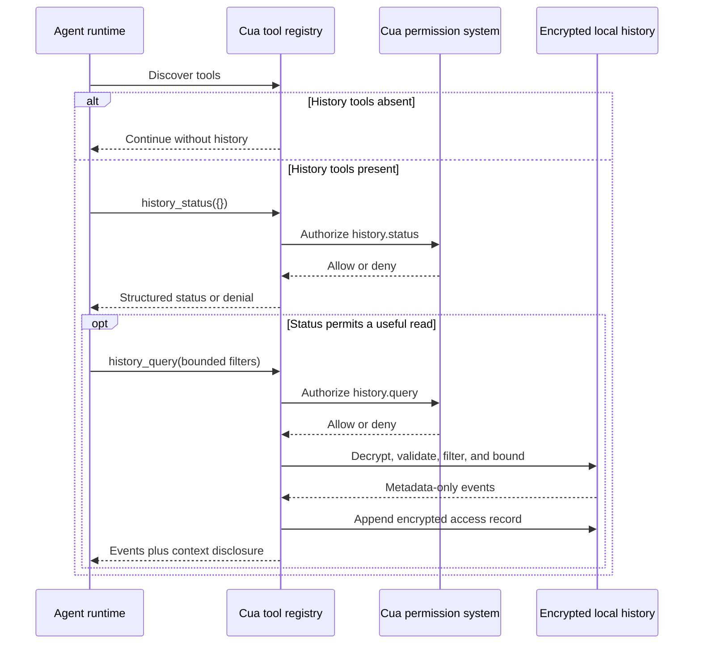

# RFC: Cua Driver Computer History Agent Integration Contract

## Summary

This RFC defines how agent runtimes read Cua Driver Computer History. The first
preview exposes two permission-gated, read-only tools:

- `history_status`, which maps to the `history.status` capability; and
- `history_query`, which maps to the `history.query` capability.

Computer History is an opt-in, encrypted local record of Cua-mediated actions.
Agents can check its state and request a bounded metadata-only event slice. They
cannot enable capture, change retention, export encrypted chunks, delete data,
or obtain encryption keys.

Agent integrations must discover the tools at runtime and tolerate their
absence, including on a supported operating system whose daemon did not admit
the preview.

## Motivation

An agent often starts a run without knowing what a prior run did. Existing
approaches either omit that context or ask the agent to inspect screenshots,
logs, and application state again. A durable history can reduce repeated work,
but desktop history may contain personal data even when it excludes screenshots
and typed text.

The integration contract needs a narrow answer to four questions:

1. How does a client detect that history is available?
2. Which permission authorizes each read?
3. Which fields may enter agent context?
4. How does a client continue when history is unavailable or incomplete?

## Goals

- Define a small read-only contract for agent runtimes.
- Keep status and event access under separate capabilities.
- Return bounded, typed data with an explicit model-context disclosure.
- Preserve the user's local encryption and retention boundaries.
- Let clients degrade safely when the feature, permission, or data is absent.
- Keep the tool and capability names usable by a later NVIDIA OpenShell adapter.

## Non-goals

- Give agents control over capture lifecycle, retention, quota, or deletion.
- Expose raw encrypted chunks, encryption keys, or filesystem paths.
- Record ambient desktop activity outside Cua-mediated actions.
- Return screenshots, typed text, clipboard contents, tool arguments, tool
  results, accessibility trees, window titles, or URLs.
- Add model-generated summaries in the first preview.
- Require NVIDIA OpenShell for the first preview.
- Claim support for an unqualified operating-system version, desktop session,
  or native credential-store configuration.
- Define product pricing, account eligibility, or release dates for other
  platforms.

## Community feedback themes

Anonymous community feedback consistently favors local data ownership, local
control, and code and format auditability. Respondents also emphasized a hard
boundary against capturing typed text, individual keystrokes, or passwords.
There is interest in Windows support and a broader cross-platform roadmap, but
this RFC makes no delivery-date promises. A recurring use case is giving agents
useful prior-run context while keeping that context bounded, permission-gated,
and private to the user's machine.

## Terminology

**Computer History**
: The user-controlled encrypted local record defined by this RFC.

**Admitted daemon**
: A Cua Driver daemon started with the experimental history capability. Tool
  admission does not enable capture.

**Enabled history**
: History for which the user completed the separate persistent opt-in flow.

**History event**
: A CloudEvents 1.0 JSON envelope containing one allowlisted metadata payload.

**Agent runtime**
: An MCP client, SDK host, coding agent, or agent framework that calls Cua
  Driver tools.

**Capability manifest**
: The immutable launch-time ceiling that narrows which tools a runtime may
  call. Bounded permission mode requires one.

## Availability and feature detection

The preview registers the two history tools only when a supported desktop
daemon admits the experimental feature. Clients must inspect the runtime tool
list before calling either tool.

| Observed state | Meaning | Client behavior |
| --- | --- | --- |
| Neither tool is advertised | The runtime does not admit this preview or the platform does not support it. | Continue without history. |
| `history_status` is advertised | The runtime admits the preview. | Request permission for `history.status` before reading status. |
| Status reports `enabled: false` | Capture is off, but earlier encrypted history may remain. | Query only if prior history is useful and `history.query` is authorized. |
| Status reports `paused: true` | New action capture is paused. Existing history remains queryable. | Treat the returned history as incomplete after the pause point. |
| Status reports dropped events or unhealthy storage | The record may contain gaps. | Preserve the health warning in agent reasoning and avoid claims of completeness. |

Tool presence does not prove that the user granted the calling agent access.
The normal Cua Driver authorization path evaluates every invocation.

## Proposed integration flow



The access record is appended when a successful query returns at least one
event. It is encrypted under the same history profile and is not included in
the response that caused it.

## Agent consultation policy

Tool discovery makes Computer History available to an agent, but it does not
by itself cause a model to call either tool. An agent host that supports
history-assisted continuation must add an explicit consultation policy through
a bundled skill, trusted system instruction, or deterministic host preflight.

The policy applies when the user asks the agent to continue, resume, recall
recent Cua activity, explain what a prior Cua run did, or find where a prior
Cua-mediated workflow stopped. It does not apply to unrelated tasks merely
because history is available.

For a matching request, the host must:

1. discover the history tools before broader desktop inspection;
2. call `history_status` and preserve any disabled, paused, unhealthy, or
   dropped-event state in its reasoning;
3. when useful and authorized, call `history_query` with a bounded recent
   slice before enumerating the live desktop;
4. treat returned events as metadata-only evidence rather than a transcript;
5. keep omitted content, geometry, arguments, results, and user intent unknown;
6. use an identified application or capability as a lead, then verify current
   state through the least intrusive appropriate source; and
7. continue without history after absence, denial, empty results, or a
   recoverable history failure.

A host may make more bounded queries when an initial slice contains a relevant
session or sequence boundary. It must not broaden the query merely to fill in
fields that the schema intentionally excludes.

A new agent process repeats this flow. History is not continuously injected
into every model request, and enabling capture does not grant any agent read
access. Query results enter only the current authorized model context unless
the host separately defines and obtains consent for another memory boundary.

The following integration levels keep product claims precise:

| Integration level | Required behavior | Accurate claim |
| --- | --- | --- |
| Tool-capable | The runtime advertises the tools and schemas. | Agents can query Computer History. |
| History-aware | A bundled policy instructs the agent to consult history for matching requests, with deterministic tests of the policy and fallbacks. | The agent checks Computer History for recent-work and continuation requests. |
| Deterministic consultation | The trusted host performs or enforces the status and bounded-query preflight before the model begins broader discovery. | The agent automatically checks Computer History for matching requests. |

Prompt wording alone can guide model behavior but cannot establish the
deterministic-consultation claim. A host making that claim must own the
preflight and prove it independently of model tool-selection variance.

## Tool contract

### `history_status`

`history_status` returns operational metadata. It never returns history events.

**Required capability:** `history.status`

**Tool properties:** read-only, non-destructive, idempotent, closed-world

**Input schema**

```json
{
  "type": "object",
  "properties": {},
  "additionalProperties": false
}
```

**Structured response fields**

| Field | Type | Meaning |
| --- | --- | --- |
| `supported` | boolean | The current platform adapter supports this preview. |
| `admitted` | boolean | The daemon admits the experimental feature. |
| `enabled` | boolean | The user enabled capture. |
| `paused` | boolean | New action capture is paused. |
| `encrypted` | boolean | History payloads use the encrypted storage profile. Preview 0 always returns `true`. |
| `profile` | string | Storage profile identifier. |
| `retention_days` | integer | Query-visible retention period. Default: `7`. |
| `quota_bytes` | integer | Encrypted store quota. Default: `104857600`. |
| `bytes_used` | integer | Current encrypted bytes under the history root. |
| `dropped_events` | integer | Number of events dropped by the nonblocking capture path. |
| `health` | string | Fixed health category. |

**Example response**

```json
{
  "supported": true,
  "admitted": true,
  "enabled": true,
  "paused": false,
  "encrypted": true,
  "profile": "cua-history-profile-v1/cbor-sequence+cose-encrypt0+cloudevents-json",
  "retention_days": 7,
  "quota_bytes": 104857600,
  "bytes_used": 48291,
  "dropped_events": 0,
  "health": "ready"
}
```

Health categories are:

```text
ready
disabled
paused
not_admitted
key_unavailable
key_locked
key_corrupt
key_destroy_failed
storage_unavailable
storage_corrupt
quota_reached
events_dropped
writer_stopped
```

### `history_query`

`history_query` returns a bounded event slice. Query results may enter model
context.

**Required capability:** `history.query`

**Tool properties:** read-only, non-destructive, non-idempotent because a
successful non-empty read appends an encrypted access record, closed-world

**Input fields**

| Field | Type | Required | Bounds | Meaning |
| --- | --- | --- | --- | --- |
| `limit` | integer | No | `1..200` | Maximum matching events. Default: `50`. |
| `session_id` | string | No | `1..128` characters | Opaque session ID returned by history, or a caller-known session label resolved inside the history namespace. |
| `since_sequence` | integer | No | `>=1` | Inclusive lower sequence bound. |
| `until_sequence` | integer | No | `>=1` | Inclusive upper sequence bound. |

Unknown fields are rejected. If both sequence bounds are present,
`since_sequence` must not exceed `until_sequence`.

**Example request**

```json
{
  "limit": 20,
  "session_id": "33333333333333333333333333333333",
  "since_sequence": 40
}
```

**Structured response**

```json
{
  "events": [
    {
      "specversion": "1.0",
      "id": "11111111111111111111111111111111",
      "source": "urn:cua-driver:history:22222222222222222222222222222222",
      "type": "cua-driver.history.action_completed.v0",
      "subject": "action/44444444444444444444444444444444",
      "time": "2026-08-14T12:00:00Z",
      "datacontenttype": "application/json",
      "dataschema": "urn:cua-driver:schema:history-event:v0",
      "data": {
        "session_id": "33333333333333333333333333333333",
        "action_id": "44444444444444444444444444444444",
        "sequence": 42,
        "platform": "macos",
        "process_model": "in_daemon",
        "capability": "computer.pointer.click",
        "caller_category": "cua_runtime",
        "application": {
          "bundle_id": "com.example.synthetic",
          "display_name": "Example App"
        },
        "payload": {
          "kind": "action_completed",
          "effect": "confirmed",
          "route": "accessibility",
          "delivery": "foreground",
          "delivered_count": 1,
          "evidence_kinds": ["accessibility_readback"]
        }
      }
    }
  ],
  "metadata_only": true,
  "model_context_disclosure": true
}
```

All sample identifiers and application values are synthetic.

The current schema has no `unavailable_fields` member or fixed platform
limitation codes. The `application` object is optional; when present, it may
contain only the optional `bundle_id` and `display_name` fields shown above.
Clients must treat omitted application fields as unavailable context. Adding
explicit limitation metadata would require a future schema revision.

### Ordering and bounded reads

Events are ordered by `data.sequence` in ascending order. A query applies all
filters, keeps the newest `limit` matching events, and returns that slice in
ascending sequence order.

The first preview has no opaque pagination token. A client can page toward
older records by setting `until_sequence` below the first sequence in its
current response. It can request newer records with `since_sequence` above the
last sequence it has processed. Sequence bounds are inclusive, so clients must
adjust the bound by one when they require non-overlapping pages.

Clients must treat missing sequence numbers as valid gap evidence. Capture uses
a bounded nonblocking queue, so storage pressure or a concurrent serialized
query can drop events without failing the computer action that produced them.

## Event contract

Every returned event uses CloudEvents 1.0 JSON and the schema identifier
`urn:cua-driver:schema:history-event:v0`.

| Event type | Payload kind | Meaning |
| --- | --- | --- |
| `cua-driver.history.control.v0` | `control` | User lifecycle operation such as enable, pause, or flush. |
| `cua-driver.history.action_started.v0` | `action_started` | A Cua-mediated state-changing action began. |
| `cua-driver.history.action_completed.v0` | `action_completed` | The validated action outcome. |
| `cua-driver.history.session_started.v0` | `session` | A Cua Driver lifecycle session began. |
| `cua-driver.history.session_ended.v0` | `session` | A Cua Driver lifecycle session ended. |
| `cua-driver.history.access.v0` | `access` | A local CLI or agent query returned events. |
| `cua-driver.history.health.v0` | `health` | A fixed writer-health or dropped-event marker. |

The checked-in JSON Schema is
[`computer-history-event-v0.schema.json`](computer-history-event-v0.schema.json).
The encrypted file profile is defined by
[`computer-history-profile-v1.cddl`](computer-history-profile-v1.cddl).

Clients must branch on both `dataschema` and `type`. A client that does not
support a returned schema must stop interpreting that event. It may still
report the schema identifier as unsupported.

## Permission contract

The two tools are separate private-observation operations. Both are classified
as operation-sensitive `R2` reads and use active authorization enforcement.
Permission for status does not imply permission to query events.

In standard mode, each operation requires an explicit host authorization grant;
the ordinary promptless private-observation default does not apply to Computer
History. In bounded mode, the approved manifest must name both the tool and the
matching `resources.computer_history.operations` value.

Tool discovery advertises the capability mapping:

| Tool | Capability |
| --- | --- |
| `history_status` | `history.status` |
| `history_query` | `history.query` |

In bounded mode, a trusted launcher must approve a capability manifest that
allows the exact tools. An illustrative manifest is:

```yaml
version: 3
expires_after: 1h
idle_timeout: 10m
resources:
  computer_history:
    operations:
      - status
      - query
allow:
  tools:
    - history_status
    - history_query
```

An agent may propose this manifest, but the trusted launcher selects and
approves it. A manifest can narrow the runtime's authority. It cannot grant
authority denied by built-in policy, managed policy, user policy, or the active
permission mode.

Clients must surface a denial and continue without history. They must not retry
with a broader tool, read the store directly, switch permission modes, or ask
the model to reconstruct denied history through another observation tool.

A future NVIDIA OpenShell policy adapter may feed the same `history.status` and
`history.query` decisions into the native host authorization broker. It will
not receive direct access to native credential-store items, history files, or
vault keys.

## Error contract

Tool argument and history-store failures return a structured `code`. The Cua
authorization layer may deny the call before the tool runs; that denial uses
the existing authorization error envelope.

| Code | Meaning | Client behavior |
| --- | --- | --- |
| `invalid_history_query` | Input does not match the closed schema. | Correct the request once. Do not retry unchanged input. |
| `invalid_history_query_range` | The lower sequence bound exceeds the upper bound. | Correct the bounds. |
| `history_preview_not_admitted` | Admission changed after tool discovery. | Refresh tool discovery and continue without history. |
| `history_key_unavailable` | The platform key cannot be loaded. | Report history as unavailable. |
| `history_key_locked` | The credential store is locked. | Let the user unlock it; do not prompt through another tool. |
| `history_key_corrupt` | The key reference or material is invalid. | Stop querying and direct the user to local recovery controls. |
| `history_storage_unavailable` | The encrypted store cannot be read. | Continue the agent task without history. |
| `history_storage_corrupt` | Framing, schema, sequence, or authentication validation failed. | Stop consuming results and direct the user to local recovery controls. |
| `history_quota_reached` | Capture reached its encrypted-byte quota. | Treat history after that point as incomplete. |
| `history_events_dropped` | The nonblocking writer dropped events. | Treat the affected interval as incomplete. |
| `history_writer_stopped` | The writer is unavailable. | Continue the agent task without assuming new events are recorded. |

Clients must use the structured code. Human-readable text may change.

## Security, privacy, and telemetry

The first preview stores only allowlisted structured metadata:

- event type and timestamp;
- opaque event, stream, session, and action identifiers;
- Cua capability name and fixed caller category;
- fixed-field platform application identifier and display name when available;
- fixed action outcome, route, delivery, and evidence categories; and
- fixed lifecycle, access, and health payloads.

The following data is prohibited:

- screenshots, video, audio, and accessibility trees;
- raw keystrokes, typed text, and clipboard contents;
- raw tool arguments and results;
- file paths, window titles, and URLs; and
- free-form diagnostic details or policy documents.

### Answers to common privacy questions

**Does Computer History observe everything a user does?** No. Preview 0 records
only actions mediated by Cua Driver after the user enables history. Manual
keyboard input, mouse input, and ambient application activity do not create
history events.

**How does it know an action happened?** The record comes from Cua Driver's own
action lifecycle and fixed delivery and evidence categories. When an action
uses an Accessibility, UI Automation, AT-SPI, or native window-management
route, history may record that fixed route and outcome, but it never stores or
later scans an accessibility tree to infer ambient activity.

**What happens when Cua types into a text field?** History may record that a
typing capability ran, which application received it, and whether delivery was
confirmed. It never records the characters, individual key events, raw tool
arguments, or clipboard contents. The same rule applies to passwords and other
sensitive text.

**Where does the data live?** The encrypted records stay in the local user
account on the host. The namespace key stays in macOS Keychain, Windows
Credential Manager, or Linux Secret Service. Agents cannot request the key,
encrypted chunks, or a filesystem path through this contract. Users can
inspect bounded metadata through the local CLI and delete the history with an
explicit local command.

**Can an integration audit the implementation and format?** Yes. Cua Driver is
open source, the event schema and CDDL storage profile are checked into the
repository, and this RFC defines the complete agent-visible field set. Direct
store access remains unsupported because it would bypass permission checks and
key custody.

**Is the contract portable across desktop systems?** Yes. The CloudEvents
schema, COSE and CBOR Sequence profile, tool names, and capability names are
platform-neutral. macOS, Windows, and Linux use separate native credential and
application-identity adapters while returning the same agent-visible contract.

History payloads stay local. Each CloudEvent is encrypted and authenticated
inside a COSE_Encrypt0 record before it reaches disk. Records use RFC 8742 CBOR
Sequence framing. The namespace root key is protected by the operating
system's native credential store, and each chunk uses a separate HKDF-derived
key.

History tools are excluded from per-tool product telemetry and agent-session
aggregate telemetry. Product telemetry may contain a fixed CLI command counter
showing that a local history command ran. It never contains history events,
query filters, counts, identifiers, paths, or results.

## Compatibility and versioning

The first preview has these identifiers:

| Contract | Identifier |
| --- | --- |
| Status tool | `history_status` |
| Query tool | `history_query` |
| Status capability | `history.status` |
| Query capability | `history.query` |
| Event schema | `urn:cua-driver:schema:history-event:v0` |
| Storage profile | `cua-history-profile-v1/cbor-sequence+cose-encrypt0+cloudevents-json` |

The two tool and capability names are intended to remain stable. The event
schema is experimental. A field or semantic change that an existing consumer
cannot safely ignore requires a new `dataschema` identifier. A storage-format
change requires a new profile identifier.

Clients must use runtime tool discovery and the advertised input schemas. They
must tolerate a history tool disappearing after a daemon restart,
configuration change, rollback, or move to an unsupported platform.

Disabling capture preserves the encrypted store. Returning to a release that
does not understand this preview also preserves the store unless the user runs
an explicit history deletion or purge operation.

## Alternatives considered

### Direct encrypted-store access

Rejected. It would make each agent responsible for filesystem coordination,
key custody, decryption, retention, schema validation, and authorization. It
would also bypass the native host policy boundary.

### One umbrella `history` capability

Rejected. Status and event retrieval expose different amounts of user data.
Separate capabilities let a host grant operational health without granting
event access.

### Expose lifecycle mutation to agents

Rejected for the first preview. Enabling, pausing, deleting, changing
retention, and exporting data are user controls. The agent surface remains
read-only.

### Return model-generated summaries

Deferred. A summary adds a model trust boundary and may require network egress.
The first preview returns deterministic structured events.

## Implementation roadmap

### Preview 0

- independent native verification on macOS, Windows, and Linux;
- explicit daemon admission and separate user opt-in;
- `history_status` and `history_query` through existing Cua permissions;
- seven-day retention and a 100 MiB encrypted quota; and
- event schema v0 with the Cua History Profile v1.

### Integration requirements

- provide generated tool schemas for MCP and SDK consumers;
- provide a bundled, product-neutral consultation policy for the main Cua
  agent with explicit recent-work and continuation triggers;
- keep lifecycle and settings mutation outside the agent consultation policy;
- make the policy call `history_status` before one bounded `history_query` and
  before broader desktop discovery for matching requests;
- require the policy to preserve unknown content, geometry, and intent rather
  than reconstructing excluded fields;
- provide synthetic status, event, denial, corruption, and gap fixtures;
- provide one bounded capability-manifest example;
- add transport-parity tests for MCP and the native SDK; and
- document runtime discovery and supported-platform requirements.

### Later stages

- query verification and optional context scopes;
- an isolated no-network vault process;
- an NVIDIA OpenShell policy adapter;
- optional model brokers with separate consent; and
- additional native application-identity fidelity where a desktop exposes a
  stable identifier without titles, paths, or other disallowed content.

Each later stage requires its own privacy and compatibility review.

## Test and acceptance plan

The public integration contract is ready when all of the following pass:

1. Tool discovery omits both tools when the daemon does not admit the preview.
2. Tool discovery advertises the exact capability mapping when admitted.
3. `history.status` permission does not authorize `history.query`.
4. Bounded mode refuses a manifest that omits either requested tool.
5. Status and query responses match their published schemas over MCP and SDK
   transports.
6. Query defaults to 50, caps at 200, applies inclusive sequence bounds, and
   returns the newest matching slice in ascending sequence order.
7. Unknown fields and reversed sequence bounds return the documented codes.
8. Synthetic fixtures prove that prohibited content never reaches a returned
   event or raw encrypted file.
9. Key, storage, corruption, quota, drop, and writer failures return fixed
   categories without failing the originating computer action.
10. A successful non-empty agent query appends an encrypted access record.
11. Disabled and paused stores remain queryable when admission and permission
    remain valid.
12. Clients can continue their primary task after absence, denial, empty
    results, or a recoverable history failure.
13. The main Cua agent's consultation policy selects `history_status` and then
    a bounded `history_query` for a fresh continuation or recent-work request
    before broader desktop discovery.
14. The same policy does not query history for an unrelated task solely
    because the tools are present.
15. A hydrated agent can recover synthetic application, capability, effect,
    route, and lifecycle metadata while preserving excluded content, geometry,
    arguments, results, and user intent as unknown.
16. A representative fresh-agent run proves the history-aware behavior through
    the public tool surface and makes no desktop mutation during consultation.

## Feedback requested

Reviewers should focus on the public integration boundary:

- Is tool absence the right feature-detection mechanism, or should status stay
  discoverable on unsupported and unadmitted runtimes?
- Are inclusive sequence bounds sufficient for pagination, or should the query
  return an opaque cursor and `has_more` field?
- Should `session_id` accept only opaque IDs returned by history, or also a
  caller-known public session label?
- Should an empty successful query append an access record?
- Does the structured error set support MCP, native SDKs, and embedded hosts
  without transport-specific interpretation?
- Which parts of schema v0 need stronger portability guarantees before the
  preview contract stabilizes?
