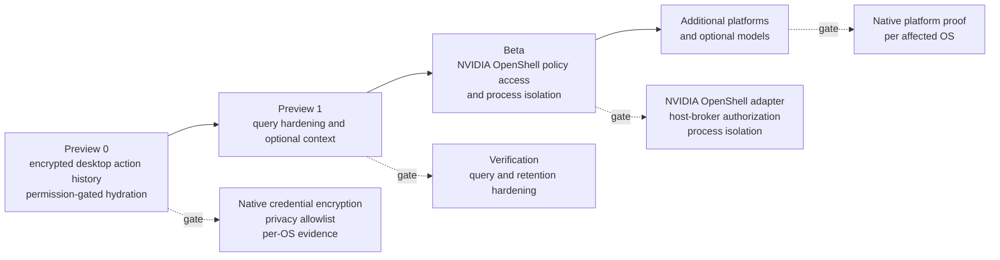
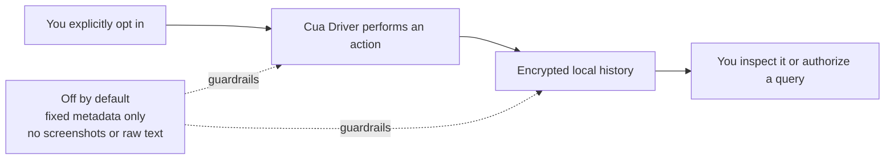
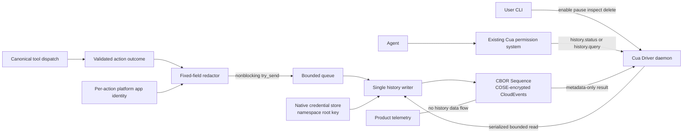
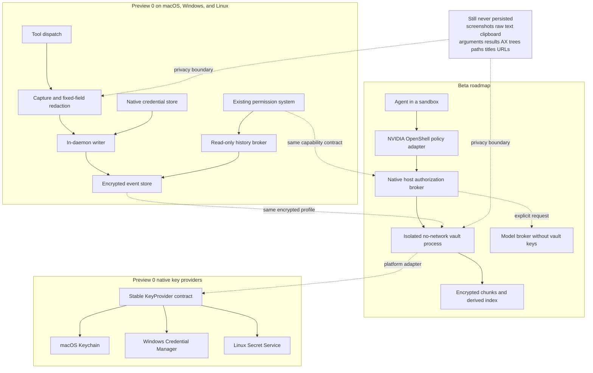
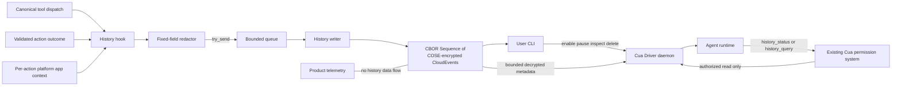
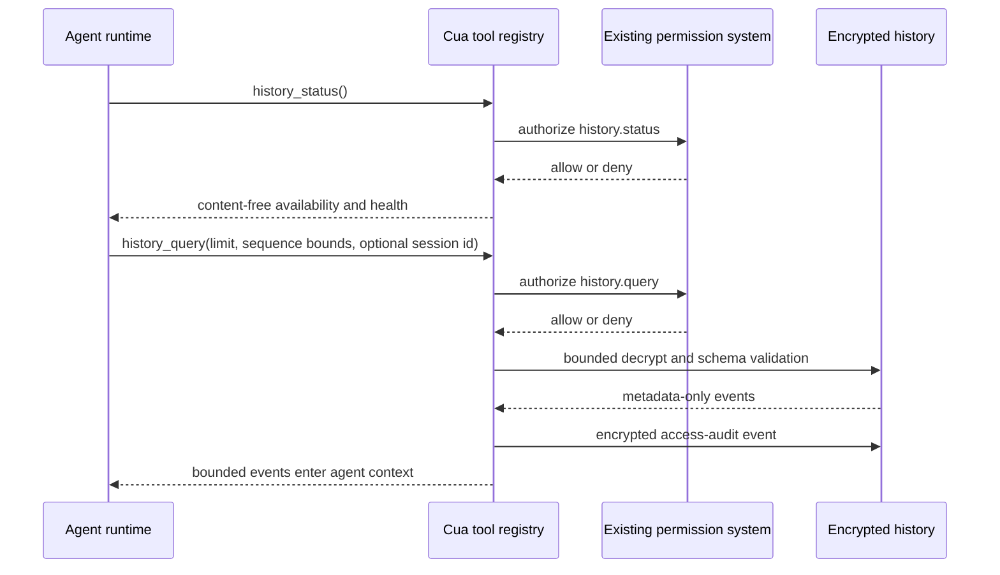
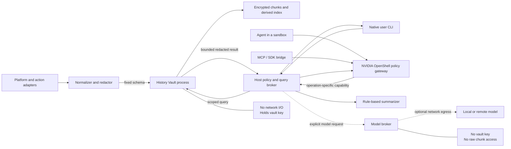

# Computer History for Cua Driver

**Last updated:** 2026-08-15

This document defines an opt-in computer-history capability for Cua Driver. It
is intentionally staged. The first stage records a narrow, encrypted history
of Cua-mediated actions on macOS, Windows, and Linux and exposes two
permission-gated read-only operations. Later stages may add richer local
context, stronger audit semantics, process isolation, and an NVIDIA OpenShell
policy adapter.

## Summary

Computer History gives users an encrypted local record of what Cua Driver did, when it did it, which application it targeted, and what outcome the driver could truthfully confirm. It is off by default and records only an explicit allowlist of structured metadata.

The defining privacy boundary is permanent:

- no screenshots;
- no raw keystrokes or typed text;
- no clipboard contents;
- no raw tool arguments or results;
- no accessibility trees;
- no file paths;
- no free-form diagnostic details.

Preview 0 is action-history-first. It does not continuously observe the desktop. It records only Cua Driver session lifecycle, history controls, permission-gated history reads, and Cua-mediated computer actions. Ambient app/window events, window titles, URLs, model summarization, agent mutation/export, and unsupported operating systems are later stages with independent gates.

## Motivation

Cua Driver already has strong internal representations of session lifecycle and action outcomes, but users do not have a durable, inspectable answer to questions such as:

- What actions did the driver perform during this session?
- Which applications did it act on?
- Which actions were confirmed, partial, refused, or unverifiable?
- When was history enabled, paused, resumed, or deleted?
- Did history drop events, reach its quota, or detect an incomplete/corrupt write?

A useful history feature must answer those questions without turning the driver into a screen recorder, keylogger, or background telemetry collector.

### Community feedback themes

Anonymous community feedback favors local data ownership, local control, and
the ability to audit both code and storage formats. Respondents also emphasized
that typed text, individual keystrokes, and passwords must never be captured.
Preview 0 targets macOS, Windows, and Linux under one cross-platform contract.
Each platform remains gated on its native privacy and compatibility evidence;
this design makes no delivery-date promises. Another recurring theme is the
value of giving agents bounded prior-run context without weakening user privacy.

## Decision

1. Ship an experimental desktop Preview 0 behind both a daemon admission flag and explicit persistent user opt-in.
2. Reuse the canonical tool-dispatch and action-outcome seams. Do not build a second action runtime.
3. Encrypt every Preview 0 history record at rest with a namespace key protected by macOS Keychain, Windows Credential Manager, or Linux Secret Service and per-chunk derived keys. Store records as the Cua History Profile: a CBOR Sequence of per-record COSE_Encrypt0 objects containing CloudEvents JSON. There is no plaintext fallback.
4. Keep history event data local and separate from product telemetry. Existing fixed-enum CLI command counters may report that a history command ran, but never include history fields, identifiers, results, counts, paths, or content.
5. Never block or fail a computer action because history is slow or unavailable.
6. Keep the event, storage, and permission contracts platform-neutral and keep native adapters thin.
7. Expose exactly two read-only agent operations in Preview 0: `history_status` (`history.status`) and `history_query` (`history.query`). Route both through the existing Cua risk, permission, policy, and capability-manifest evaluator, and audit successful reads inside encrypted history.
8. Add mutation/export operations, optional sensitive-metadata scopes, process isolation, an NVIDIA OpenShell policy adapter, model summarization, and additional platforms only after independent privacy and compatibility review.

## Goals

- Give users an inspectable history of Cua-mediated computer actions.
- Preserve a strict metadata-only privacy boundary.
- Make consent, pause, resume, retention, quota, deletion, and access visible.
- Reuse Cua Driver's existing daemon, session, authorization, action-result, and platform contracts.
- Keep one schema across macOS, Windows, and Linux without changing Preview 0 records per platform.
- Define a storage profile that has interoperable implementations across macOS, Windows, and Linux.
- Keep storage, key custody, and authorization behind separate contracts so a future NVIDIA OpenShell policy adapter can govern callers without owning native host keys or files.
- Fail closed on privacy and fail open on action execution: unsafe data is never written, while history failures never break the requested computer action.

## Non-goals

- Recording the user's entire desktop activity in Preview 0.
- Capturing screenshots, video, audio, raw text, clipboard contents, or accessibility trees.
- Reusing trajectory recordings as history storage.
- Exposing agent mutation, deletion, raw encrypted chunks, keys, unrestricted queries, or model-generated summaries in Preview 0.
- Claiming physical secure erasure or complete rollback resistance.
- Claiming parity where an operating system or desktop cannot supply the same native evidence.
- Using history as product telemetry or uploading it to Cua services.

## Terminology

- **Computer History:** the user-controlled local feature defined here.
- **History event:** one allowlisted structured lifecycle, control, action, or health record.
- **History writer:** the non-blocking in-daemon Preview 0 component that persists events.
- **History store:** the namespace-aware encrypted local directory holding history chunks and non-sensitive format metadata.
- **Cua History Profile:** the versioned composition of CBOR Sequence framing, COSE_Encrypt0 record protection, and a CloudEvents JSON event envelope defined by this document.
- **Key provider:** the platform adapter that creates, loads, and destroys device-local history keys without exposing them to callers.
- **Vault:** the separate, least-privilege encrypted storage process introduced at Beta. Preview 0 is encrypted but remains daemon-owned.
- **Query broker:** the policy-enforcing boundary that mediates access to the hardened vault.
- **History capability:** one operation-specific permission, such as `history.query` or `history.pause`, evaluated independently from tool arguments.
- **Model broker:** a separate optional component that can call local or remote models without holding vault keys or reading encrypted chunks directly.
- **Raw content:** screenshots, video, audio, typed text, clipboard contents, accessibility trees, raw tool arguments/results, file paths, window titles, URLs, or free-form diagnostics.

## Current state and reusable seams

The implementation must extend current source-of-truth contracts:

- [`cua-driver-core/src/tool.rs`](../rust/crates/cua-driver-core/src/tool.rs) is the canonical dispatch chokepoint. It joins the resolved tool name, sanitized arguments, timing, dispatch, and resulting action record.
- [`cua-driver-core/src/action_record.rs`](../rust/crates/cua-driver-core/src/action_record.rs) provides `ActionExecutionRecord::stable_projection()`, the validated source for fixed effect, route, delivery, evidence-kind, and escalation-kind fields.
- [`cua-driver-core/src/session.rs`](../rust/crates/cua-driver-core/src/session.rs) owns session lifecycle. Its current `SessionObserver` is a single `OnceLock` registration already used by telemetry; history must not try to register a competing observer.
- [`cua-driver-core/src/server.rs`](../rust/crates/cua-driver-core/src/server.rs) exposes a deliberately content-free `ToolCompletionObservation`. It is useful for fixed classifications but is not, by itself, a complete history event.
- [`cua-driver-core/src/recording.rs`](../rust/crates/cua-driver-core/src/recording.rs) demonstrates begin/finish hooks around dispatch and argument sanitization. History may reuse that hook shape but never its screenshot-bearing storage or consent model.
- The `platform-macos`, `platform-windows`, and `platform-linux` history adapters
  provide native key custody and per-action application identity without adding
  a continuous observer or widening the shared event schema.
- [`cua-driver/src/serve.rs`](../rust/crates/cua-driver/src/serve.rs), [`cua-driver-core/src/daemon.rs`](../rust/crates/cua-driver-core/src/daemon.rs), and [`cua-driver-core/src/socket_io.rs`](../rust/crates/cua-driver-core/src/socket_io.rs) own the daemon and client transport.
- [`cua-driver/src/cli.rs`](../rust/crates/cua-driver/src/cli.rs) preserves the
  verified installed product, namespace, permission mode, grants, compatibility
  mode, socket, and history admission across daemon relaunch on each platform.
- [`scripts/uninstall.sh`](../scripts/uninstall.sh) and
  [`scripts/uninstall.ps1`](../scripts/uninstall.ps1) preserve history during a
  normal uninstall and perform exact installed-helper cryptographic purge before
  package removal when purge is explicit.
- [`cua-driver-core/src/authorization.rs`](../rust/crates/cua-driver-core/src/authorization.rs), [`cua-driver-core/src/policy.rs`](../rust/crates/cua-driver-core/src/policy.rs), and [`cua-driver-core/src/session_manifest.rs`](../rust/crates/cua-driver-core/src/session_manifest.rs) are authoritative for the Preview 0 read-only history operations and remain the stable seam for a later NVIDIA OpenShell adapter.
- [`cua-driver/src/bundle.rs`](../rust/crates/cua-driver/src/bundle.rs) is authoritative for release/local namespace separation and default state paths.

Preview 0 adds a dedicated history hook beside recording's dispatch hooks. It does not widen product telemetry and does not depend on a new `AXObserver` stream.

## Staged architecture



No later-stage guarantee may be used to describe an earlier stage.

### Progressive architecture views

These views explain the design at increasing levels of detail. The advanced
view describes the roadmap. Preview 0 does not include those components.

#### Simple: the user mental model



#### Intermediate: the Preview 0 data path



#### Advanced: later trust boundaries and platform adapters



## Preview 0: experimental desktop action history

### Scope

Preview 0 records:

- history enable, disable, pause, resume, flush, quota, recovery, and delete events;
- Cua Driver session start and end events;
- the start and completion of Cua-mediated, state-changing computer actions;
- fixed action outcome fields derived from the validated action record;
- per-action fixed-field application identity available during target resolution;
- writer health and dropped-event counts.

Preview 0 does not record:

- passive activity outside Cua-mediated actions;
- read-only snapshots or accessibility-tree reads;
- window titles or URLs;
- text-entry length, text classifications, key events, or clipboard events;
- model-generated summaries.

### Preview 0 component flow



### Admission and consent

Two independent gates are required:

1. `cua-driver serve --experimental-history` admits the preview capability for that daemon generation. Without it, history mutation commands are unavailable.
2. `cua-driver history enable` records explicit user consent and persists `history_enabled: true` in the namespace-specific driver configuration.

Admission alone never starts capture. Opt-in alone cannot bypass a daemon that was started without the experimental admission flag.

For the standard installed product, the CLI owns the admission transition so
the flag is not lost when the daemon is relaunched. If `history enable` reaches
a healthy installed daemon that is not admitted, the CLI:

1. records a namespace-specific, non-secret `history_preview_admitted` preference as the user's explicit request to enter the preview;
2. asks the current daemon to stop cleanly;
3. relaunches the same verified installed product through LaunchAgent, the
   Windows scheduled task, the Linux systemd user unit, or an exact detached
   installed binary, with `serve --experimental-history`;
4. verifies that the replacement daemon reports the expected namespace,
   installed source, version, and admitted state, plus the macOS signing
   identity where applicable; and
5. invokes the normal atomic enable operation only after that verification succeeds.

The standard auto-launch path consults `history_preview_admitted` and supplies
the admission flag on later daemon starts. An absent, false, malformed, or
unsupported preference never supplies the flag. A manually staged binary that
is not the exact installed product is never allowed to perform lifecycle
control. Disabling capture leaves preview admission intact but sets
`history_enabled: false`, so a later enable does not require another relaunch.
Admission still cannot capture anything without the separate enabled state.
Purge removes both states.

If stop, relaunch, or replacement-daemon verification fails, the CLI restores the previous admission preference, leaves `history_enabled: false`, and makes a best-effort attempt to restore the prior daemon mode. It reports a fixed lifecycle error rather than silently switching installations or treating admission as successful.

Enablement is atomic with respect to capture state: the daemon creates or opens
the namespace-specific native credential, initializes the encrypted control
stream, completes an authenticated write/read self-test, and only then persists
`history_enabled: true`. A failure may leave an authenticated encrypted chunk
for diagnosis, but it never persists enabled state or writes plaintext history.

`history enable` must print:

- that the feature is experimental;
- the exact Preview 0 field allowlist;
- that Preview 0 files are encrypted with keys protected by the platform's native
  credential store;
- that capture will refuse to start if the native credential store or encrypted
  storage is unavailable;
- the retention period and disk quota;
- the commands to pause, disable, inspect, and delete history;
- whether the CLI completed an installed-daemon relaunch or a manual daemon restart is still required.

### Standards profile

The Cua History Profile composes these open specifications:

- [RFC 8949](https://www.rfc-editor.org/rfc/rfc8949.html) for CBOR;
- [RFC 8610](https://www.rfc-editor.org/rfc/rfc8610.html) for the CDDL definition of profile items;
- [RFC 8742](https://www.rfc-editor.org/rfc/rfc8742.html) for appendable CBOR Sequences;
- [RFC 9052](https://www.rfc-editor.org/rfc/rfc9052.html) for COSE_Encrypt0 record protection;
- [RFC 9053](https://www.rfc-editor.org/rfc/rfc9053.html) algorithm 24 for ChaCha20/Poly1305;
- [RFC 5869](https://www.rfc-editor.org/rfc/rfc5869.html) for HKDF-SHA-256 chunk-key derivation; and
- [CloudEvents 1.0](https://github.com/cloudevents/spec/blob/main/cloudevents/spec.md) and its [JSON event format](https://github.com/cloudevents/spec/blob/main/cloudevents/formats/json-format.md) for the logical event envelope.

These specifications define the primitives. This document defines the Cua-specific profile that composes them, including key derivation, nonce construction, limits, recovery behavior, event types, and the privacy allowlist. The implementation must check in the exact CDDL for the file header and sequence items beside the event JSON Schema. A conforming reader does not need Cua-specific cryptographic or framing code, but it must implement this profile's validation rules.

### Event envelope

Every Preview 0 record is a CloudEvents 1.0 JSON event inside the encrypted COSE payload:

```json
{
  "specversion": "1.0",
  "id": "11111111111111111111111111111111",
  "source": "urn:cua-driver:history:22222222222222222222222222222222",
  "type": "cua-driver.history.action_completed.v0",
  "subject": "action/44444444444444444444444444444444",
  "time": "2026-08-14T12:00:00Z",
  "datacontenttype": "application/json",
  "dataschema": "urn:cua-driver:schema:history-event:v0",
  "data": {
    "session_id": "33333333333333333333333333333333",
    "action_id": "44444444444444444444444444444444",
    "sequence": 42,
    "platform": "macos",
    "process_model": "in_daemon",
    "capability": "computer.pointer.click",
    "caller_category": "cua_runtime",
    "payload": {
      "kind": "action_completed",
      "effect": "confirmed",
      "route": "accessibility",
      "delivery": "foreground",
      "delivered_count": 1,
      "evidence_kinds": ["accessibility_readback"]
    }
  }
}
```

The sample values are synthetic. The `source` contains only a namespace-local opaque store identifier. Preview 0 does not persist transport ids, policy documents, raw authorization errors, or caller-provided labels.

Session identifiers are deterministic only within one history namespace. The writer derives a dedicated session-id key from the namespace key with HKDF-SHA-256 and stores the first 128 bits of HMAC-SHA-256 over the effective session identifier. This prevents unkeyed offline guessing from the stored value and lets explicit and implicit runtime sessions be grouped without persisting their labels. Action, event, stream, and chunk identifiers use independent random inputs and are not derived from the session identifier.

Readers must reject unknown `dataschema` identifiers and unknown fields they cannot safely interpret, and preserve ordering by `data.sequence` rather than wall clock alone. Additive fields require a new event schema identifier. The pair of `source` and `id` is unique within the store. CloudEvents fields and all `data` fields remain inside the encrypted payload; no application, session, action, caller, or timestamp value is exposed as a COSE header.

### Preview 0 events

| Event | Allowlisted payload |
|---|---|
| `cua-driver.history.control.v0` | one fixed operation: `enable`, `disable`, `pause`, `resume`, `flush`, or `delete` |
| `cua-driver.history.session_started.v0` / `session_ended.v0` | fixed phase and optional opaque session id |
| `cua-driver.history.action_started.v0` | opaque action/session ids, one fixed capability, optional bounded application identity |
| `cua-driver.history.action_completed.v0` | the same opaque ids/capability/application plus fixed effect, route, delivery, delivered count, evidence kinds, and escalation kind |
| `cua-driver.history.access.v0` | fixed caller operation (`agent_query` or `local_cli`) and returned-event count |
| `cua-driver.history.health.v0` | fixed health category and count; reserved for writer-emitted health summaries |

Delete-all closes the writer and writes no plaintext or encrypted tombstone after destroying the namespace key. Its fixed outcome is returned only to the local CLI.

The application identity is limited to:

- bundle identifier, when available;
- bounded display name, when available.

PID is diagnostic context, not a stable identity. Window IDs, titles, URLs, tab IDs, document names, profile names, and paths are excluded.

### Normative privacy allowlist

| Data | Preview 0 | Later possibility |
|---|---:|---|
| Raw tool name and operation arguments | prohibited | prohibited |
| Fixed capability and caller-category enums | stored | stored |
| Target coordinates, selectors, and element labels | prohibited | prohibited |
| Authorization decision IDs, policy text, or caller labels | prohibited | possible opaque fixed metadata after review |
| External account, credential, or telemetry identity | prohibited | prohibited |
| Fixed effect, route, delivery, evidence, refusal, and error classes | stored | stored |
| Wall time | stored | stored |
| Monotonic timings and durations | prohibited | possible fixed buckets after review |
| App bundle ID and process name | stored | stored under user scope controls |
| PID | prohibited | prohibited |
| Window ID | never stored in Preview 0 | possible as ephemeral/tokenized metadata after review |
| Window title | prohibited | separate opt-in after encryption |
| URL/domain | prohibited | separate opt-in after encryption |
| Raw tool arguments or results | prohibited | prohibited |
| Free-form action, evidence, escalation, or error details | prohibited | prohibited |
| Typed text, key events, or text length | prohibited | prohibited |
| Clipboard contents or metadata | prohibited | prohibited |
| Screenshots, video, or audio | prohibited | prohibited |
| Accessibility trees | prohibited | prohibited |
| File and profile paths | prohibited | prohibited |

There is no debug mode that widens this table. Debugging may increase logs for fixed internal state categories, but it may never persist raw content.

### Capture and dispatch integration

The history hook is constructed at the canonical dispatch boundary beside the existing recording begin/finish flow:

1. After tool resolution and authorization, derive only the stable capability and fixed caller category.
2. Inspect only an optional numeric PID for bounded application resolution, then discard argument values. History never serializes the raw argument object.
3. Derive fixed-field platform application identity from already-available
   process/window context without adding a continuous observer or persisting a
   title or executable path.
4. Allocate an `action_id` and enqueue `action_started` with non-blocking `try_send`.
5. Execute the tool normally.
6. Validate the resulting `ActionExecutionRecord` and transform its stable projection through a second history-specific fixed-field allowlist. Free-form `detail` fields are discarded.
7. Enqueue `action_completed` using the same `action_id`.

The history capture hook is internal. Separately, Preview 0 registers `history_status` and `history_query` only on an admitted history-enabled host. Their distinct `history.status` and `history.query` capabilities are evaluated by the existing authorization and capability-manifest path before invocation. The hook does not use or replace the host-facing SDK activity observer, and it does not register a second value in the current single `SessionObserver` slot.

### Backpressure and action isolation

- The queue is bounded; the initial capacity is 512 events.
- Dispatch uses `try_send` and never waits for the writer.
- When the queue is full or unavailable, the current history event is dropped and an atomic counter is incremented.
- The status surface exposes the accumulated drop count. When the live queue next accepts a record after drops, the dispatch hook attempts to enqueue one fixed health record whose category is `events_dropped` before later action records; failure to enqueue that health record leaves the pending count for a later attempt.
- History initialization, serialization, rotation, sync, quota, and deletion errors never change the computer-action result.
- A panic in history code must be contained at the hook/writer boundary and must not unwind through dispatch.
- Repeated identical lifecycle/control events may be coalesced, but action records are never deduplicated.

### Pause, disable, shutdown, and crash behavior

- `pause` stops admission of new action-start records.
- An action admitted before the pause completes its matching action-completed record when possible.
- `resume` creates a new control record and admits subsequent actions.
- `disable` pauses capture, drains the bounded queue up to a short fixed deadline, flushes, closes the writer, and persists `history_enabled: false`.
- Daemon shutdown performs the same bounded drain. It must not hang daemon exit.
- At startup, the writer validates every prior CBOR Sequence and authenticated COSE item before creating a new chunk. Preview 0 fails closed on an incomplete or corrupt tail and never appends to that stream. Authenticated partial-tail recovery is a later compatible hardening step; the v1 framing preserves that option without changing valid records.
- A missing start/completion pair is valid evidence of a crash or dropped event and must not be silently synthesized.

### Preview 0 storage

The default root is derived from the product namespace and native user-state
location:

```text
macOS:   ~/Library/Application Support/{cua-driver|cua-driver-local}/computer-history/
Windows: %LOCALAPPDATA%\{cua-driver|cua-driver-local}\computer-history\
Linux:   ${XDG_STATE_HOME:-~/.local/state}/{cua-driver|cua-driver-local}/computer-history/
```

`CUA_DRIVER_HISTORY_DIR` may override the file root for tests and explicitly managed deployments. It does not override native credential namespaces or encryption, and it must not merge release and local-development history implicitly.

```text
computer-history/
├── admission.json             # non-secret preview admission preference
├── state.json                 # enabled and paused booleans only
├── writer.lock                # empty OS-lock coordination file
└── chunks/
    ├── <opaque-chunk-id>.cborseq
    └── <opaque-chunk-id>.cborseq
```

Chunk filenames use random store-local identifiers that are not the session or action identifiers inside an event. The only plaintext state files are the preview-admission boolean and enabled/paused booleans shown above. They contain no event timestamps, application identity, session/client identity, action fields, authorization identifiers, or queryable history.

### Key-provider boundary

`cua-driver-core` depends on a narrow `KeyProvider` contract: create or load a random device-local key, load one exact opaque key reference into zeroizing memory, and destroy that exact reference. Every operation takes an explicit release or local-development namespace. The contract never exposes a platform credential-store path, account name, raw operating-system error, export operation, or plaintext fallback. Its key epoch and per-chunk key reference fields allow later rotation without changing the v1 file framing.

Preview 0 implements this contract with macOS Keychain, Windows Credential
Manager, and Linux Secret Service. Each provider creates a random 256-bit key,
reads it back before enabling capture, maps locked/corrupt/unavailable failures
to fixed categories, zeroizes key bytes, and verifies absence after deletion.
There is no file-key or environment-key fallback.

Release builds use the macOS Data Protection Keychain and a signing-team-qualified access group tied to `com.trycua.driver`. Apple's [Data Protection Keychain guidance](https://developer.apple.com/documentation/technotes/tn3137-on-mac-keychains) and [provisioning-profile guidance](https://developer.apple.com/documentation/technotes/tn3125-inside-code-signing-provisioning-profiles) make the embedded Developer ID provisioning profile part of this boundary: it must authorize the exact restricted access-group entitlement carried by the packaged executable. `history enable` verifies those signed entitlements before admitting the installed preview. A build that cannot access its item returns a fixed key-unavailable, key-locked, or key-corrupt category, keeps capture disabled, and never creates a replacement key over an existing stream. Ad-hoc local-development builds cannot use that release access group, so their separate `cua-driver-local` namespace uses a non-synchronizing login-Keychain item. It remains encrypted and has no plaintext fallback, but it does not claim the release build's `ThisDeviceOnly` Data Protection class.

### Preview 0 encryption format

Encryption is a Preview 0 requirement:

- Preview 0 uses one random 256-bit namespace key epoch stored as a
  namespace-specific native credential. Every chunk receives a distinct
  HKDF-derived key. The header already carries the key reference and epoch, so
  later key rotation or per-session key policy is additive rather than a
  framing migration.
- The installed Keychain item uses the Data Protection Keychain with
  `kSecAttrAccessibleWhenUnlockedThisDeviceOnly`,
  `kSecAttrSynchronizable=false`, and a signing-team-qualified access group.
  Installed packages verify those entitlements. The separate ad-hoc
  local-development namespace uses a non-synchronizing login-Keychain item
  because an ad-hoc signature has no installed-product access group.
- Windows uses the current user's Credential Manager through the native
  credentials API. The exact product namespace and fixed history account name
  select one credential; another Windows user or Cua release/local namespace
  cannot enumerate it through the provider contract.
- Linux uses the current desktop user's Secret Service collection. An absent,
  locked, denied, or malformed Secret Service fails closed. Cua Driver never
  substitutes an environment variable, plaintext file, or process-local key.
- Release and local-development builds use different native credential service
  namespaces and cannot unwrap each other's history.
- Decrypted key material lives only in zeroizing memory owned by the writer/query path; it is never logged, serialized, included in diagnostics, or returned over daemon protocols.
- Chunk keys are derived from the namespace key with HKDF-SHA-256. The random 128-bit chunk identifier is the salt. The info value contains `cua-driver/history-profile/v1/chunk-key`, the opaque stream identifier, and the key epoch. This separates keys across chunks, streams, epochs, and profile versions.
- Each `.cborseq` file is an RFC 8742 CBOR Sequence. Its first item is a deterministic, definite-length CBOR header containing only the profile version, COSE algorithm identifier, key epoch, opaque key reference, opaque stream and chunk identifiers, and bounded format metadata. The exact encoded header bytes become external authenticated data for every record in that file.
- Every later sequence item is a tagged COSE_Encrypt0 object whose ciphertext contains exactly one CloudEvents JSON event. The COSE protected header contains only the standard algorithm identifier. The unprotected header contains only the standard 96-bit IV parameter. The exact encoded file header is external authenticated data. Neither COSE header contains a history payload field.
- Preview 0 uses RFC 9053 algorithm 24, ChaCha20/Poly1305 with a 256-bit key, 128-bit authentication tag, and 96-bit nonce.
- The chunk-local record sequence starts at zero. The 96-bit nonce is `random_32_bit_chunk_prefix || uint64_be(record_sequence)`. The per-chunk derived key, random prefix, and strictly increasing record sequence make each `(key, nonce)` pair unique. Writers must rotate the chunk before sequence exhaustion. The encrypted CloudEvent's `data.sequence` is stream ordering and is distinct from this chunk-local nonce counter.
- A chunk is appendable only by the writer instance that created it. Every writer initialization, including daemon start and in-process reinitialization after a contained writer failure, seals prior chunks as read-only and creates a new random chunk identifier, derived chunk key, and nonce counter. This prevents reuse if a crash or contained failure loses the last previously used counter value before it becomes durable.
- Before reading the next stream sequence or creating a chunk, a writer takes an exclusive operating-system file lease on `writer.lock` and holds it for the writer lifetime. A competing daemon fails closed before writing. Exact duplicate `(source,id)` events from an older store are ignored during bounded reads; distinct duplicate sequence numbers remain corruption evidence.
- The COSE protected header, IV, and file header's external authenticated data bind the algorithm, profile version, key epoch, opaque key/stream/chunk references, nonce prefix, and record position to the ciphertext.
- COSE headers and the file header are authenticated but visible. They may contain only the generic format fields listed above. The CloudEvents envelope, event type, timestamp, application identity, session/action identifiers, authorization context, and payload remain encrypted.
- Total bytes read are bounded by the configured quota before decoding. Header, schema, nonce, sequence, and fixed-string validation then fail closed before any event is returned.
- Query snapshots are serialized with the writer. Producer hooks remain nonblocking and may drop events while the snapshot holds the writer handle lock; fixed health accounting reports those drops.
- On recovery, the reader accepts only the deterministic header followed by a contiguous sequence of authenticated COSE items. For the item at zero-based position `N`, it requires the IV suffix to equal `uint64_be(N)` and the prefix to equal the file header. A missing, duplicated, reordered, mismatched, incomplete, or unauthenticated item marks the chunk corrupt. Preview 0 does not auto-repair or append past that evidence.

Control and action records use the same namespace root-key epoch and profile; each chunk receives a distinct HKDF-derived key. There is no environment variable, command-line option, debug mode, or recovery path that permits plaintext history.

If native credential lookup, random-key generation, key derivation, nonce
construction, encryption, authentication, or permissions fail, capture remains
disabled and the CLI reports a fixed error category. Existing computer actions
continue normally without history.

Preview 0 storage requirements:

- the storage root and `chunks` directory use user-only `0700` permissions;
- files use user-only `0600` permissions;
- the writer appends complete COSE records and syncs periodically without performing encryption or sync on the dispatch thread;
- every writer instance starts a new chunk and never appends to a chunk created by an earlier instance;
- every writer generation creates a new chunk and treats all prior chunks as read-only;
- default retention is 7 days and query-visible expiry is exact by encrypted event timestamp;
- default total quota is 100 MiB;
- the writer seals live chunks on a fixed sub-hour cadence and prunes expired sealed chunks during long-lived maintenance; while the writer remains active this bounds physical ciphertext deletion slack to at most one hour beyond query-visible retention. When history is disabled or the daemon is offline, expired ciphertext may remain until the next enable or query checkpoint, but reads still enforce the exact event-time cutoff. On quota exhaustion, the writer stops accepting records, reports a fixed `quota_reached` health category, and never affects the originating computer action;
- no plaintext history index is permitted;
- `history show` scans bounded chunks in Preview 0; a derived index is deferred until query requirements justify it.

Preview 0 supports delete-all only. It closes the writer, destroys the exact namespace key reference, and then removes the recognized `.cborseq` files. A deletion command reports success only after mandatory key destruction and file removal succeed. The CLI does not claim physical erasure from filesystem snapshots, backups, copy-on-write storage, SSD wear leveling, copied ciphertext, or already-decrypted process memory.

### Preview 0 CLI

Preview 0 exposes lifecycle and destructive controls only through local CLI
requests to a daemon-private method. The daemon authenticates the same-user
Unix-socket or named-pipe peer, resolves its executable from the kernel-reported
peer PID, and requires the exact helper inside the verified installed product.
macOS release admission additionally pins the Cua signing team and Apple
code-signing trust anchor. Caller-declared direct-CLI routing fields remain
defense in depth and cannot authenticate an arbitrary same-user process:

```text
cua-driver history enable
cua-driver history disable
cua-driver history pause
cua-driver history resume
cua-driver history status [--json]
cua-driver history list [limit] [--json]
cua-driver history show <sequence> [--json]
cua-driver history flush
cua-driver history delete --yes
```

Mutation commands follow the driver's protected-action rules. `delete` requires an explicit human-facing confirmation unless the caller supplies an existing trusted confirmation mechanism defined by the driver; it is never exposed as an agent tool in Preview 0.

### Preview 0 agent hydration

An agent runtime hydrates from history through the normal Cua Driver tool path:



The agent first checks `history_status`. If history is available, it requests at most 200 metadata-only events with optional sequence and session bounds. A session bound may be the opaque id returned by an earlier query or a caller-known session label, which is transformed with the same namespace-local keyed derivation before comparison; the raw label is never written. The existing Cua permission mode, policy ceilings, and capability manifest decide whether each distinct tool may run. Standard mode requires an explicit operation-scoped history grant. In bounded mode the manifest must grant both the exact tool and the matching `resources.computer_history.operations` value. Query results can enter the model context, so the tool description and response explicitly disclose that fact. The agent cannot enable, pause, resume, delete, change retention, export raw chunks, or obtain keys.

A future NVIDIA OpenShell policy adapter may constrain sandboxed callers and
feed the same stable `history.status` and `history.query` capability decision.
It will not replace the native credential store, encrypted store, or host-side
authorization check.

`history status --json` includes only fixed operational fields:

- supported, admitted, enabled, paused, and encrypted booleans;
- the fixed storage-profile identifier;
- retention days, quota bytes, and current encrypted bytes;
- dropped-event count; and
- one fixed writer-health category.

### Uninstall, reinstall, and purge

Normal uninstall preserves encrypted history files, the enabled and preview-admission preferences, and the exact namespace's native credential. The uninstaller must say that these data remain and name the explicit purge command. A later compatible reinstall can reopen the store; local-development and release installs still cannot access each other's namespace.

`uninstall --purge` is a cryptographic deletion operation, not only file cleanup. Before removing the history directory, the uninstaller must use a packaged offline lifecycle helper to:

1. stop the daemon and prove that no writer for the exact namespace remains active;
2. enumerate opaque key references only within that namespace's exact native credential service;
3. destroy and verify absence of the exact namespace root-key item, including an orphaned item no longer referenced by readable store metadata;
4. verify that every enumerated key can no longer be loaded; and
5. only after key absence is verified, remove recognized history files and then the enabled/admission lifecycle state.

The Unix uninstaller rejects a process-wide root invocation. Every uninstaller
must run as the interactive login user so the helper resolves that user's home
or local-app-data directory and native credential store; the macOS script may
elevate only the exact protected app-bundle removal after cryptographic purge
succeeds.

The purge path never performs broad credential-store deletion and never
touches the other release/local-development namespace. If enumeration,
destruction, or verification fails, it reports `history_purge_incomplete`,
preserves the history directory and lifecycle state needed to retry, and does
not claim that history was purged. Retained copied ciphertext is expected to
become unreadable after successful key destruction, subject to the
physical-erasure limits stated above.

### Preview 0 launch gate

Preview 0 may launch on a platform only when all of these requirements pass:

1. The feature is off by default. Daemon admission and explicit persistent user
   opt-in are separate requirements, and neither can substitute for the other.
2. Every history record is encrypted and authenticated with a namespace key in
   the platform's native user credential store. Missing, locked, corrupt, or
   denied credentials disable capture without a plaintext fallback.
3. Persisted-field allowlist and adversarial-redaction tests prove that typed
   text, keystrokes, passwords, clipboard data, screenshots, paths, titles,
   URLs, raw arguments/results, and free-form diagnostics never reach disk.
4. Retention, quota, queue saturation, writer failure, corrupt-record handling,
   pause, resume, and restart behavior remain bounded and never change the
   originating computer-action result.
5. Normal uninstall, compatible reinstall, upgrade, and rollback preserve the
   encrypted store. Explicit deletion and purge destroy only the selected
   namespace, verify key absence, and never report success while retained
   ciphertext remains decryptable.
6. Local CLI and agent reads use the existing authenticated authorization path.
   History content, query fields, identifiers, counts, and results remain absent
   from product telemetry.
7. Schema and storage-profile compatibility tests cover upgrades, unsupported
   newer formats, corruption, and rollback. An older binary must leave an
   unknown store untouched; a newer binary must refuse unsafe mutation rather
   than guess or perform an implicit plaintext migration.
8. The packaged application passes integrity, install, upgrade, rollback,
   reinstall, and purge tests. Source-only tests do not replace package tests.
9. The platform's canonical desktop E2E harness passes with history disabled,
   and a feature-enabled native smoke proves opt-in, encrypted capture, status,
   restart hydration, pause, resume, disable, preservation, and purge.
10. The synchronous capture hook performs no disk, credential-store, network,
    or blocking synchronization work and adds less than 1 ms p99 latency when
    enabled, including the full-queue path.
11. Public documentation states supported platforms, opt-in behavior, stored
    and excluded fields, local encryption, retention and quota, recovery and
    purge limits, rollback behavior, and known operating-system or compositor
    limitations.

### Staged native qualification

The shared schema, encrypted profile, writer, authorization contract, and
privacy tests qualify as one cross-platform core. Native support qualifies
separately:

- macOS must pass its Keychain, signed-package identity, application-identity,
  lifecycle, purge, and canonical desktop E2E checks;
- Windows must pass its Credential Manager, installed-control identity,
  application-identity, lifecycle, purge, and canonical desktop E2E checks; and
- Linux must pass its Secret Service, installed-control identity, X11 or
  compositor-specific application-identity, lifecycle, purge, and canonical
  desktop E2E checks.

A passing result on one platform does not qualify another. If a native
credential backend, desktop session, or compositor cannot satisfy the contract,
capture remains disabled or the limitation is documented without substituting
screenshots, OCR, raw text, or guessed identity fields.

## Preview 1: audit, query, and optional-context hardening

Preview 1 keeps the Preview 0 encrypted format and event schema additive while hardening verification, local queries, retention, key lifecycle, and optional metadata policy.

### Key lifecycle hardening

- Add explicit key inventory and health checks without printing key material.
- Define atomic key rotation that rewrites or rewraps one stream at a time and remains resumable after a crash.
- Distinguish a locked Keychain from missing, revoked, or corrupt keys in fixed error categories.
- Make backup/restore behavior explicit: encrypted files without their device-local Keychain keys are intentionally unrecoverable.
- Preserve the Preview 0 rule that loss or revocation fails closed and never falls back to plaintext.

### Audit semantics

Preview 1 adds cross-record and cross-chunk hash links over the exact encoded COSE items plus `history verify`.

The guarantee is deliberately narrow: verification detects accidental corruption, missing records within the available chain, partial modification, and some truncation. It does not prove absence of a complete rollback by an attacker able to replace both local data and local anchors. Strong rollback resistance would require an independently protected or external monotonic checkpoint and is not part of this stage.

### Optional sensitive metadata

Window-title and URL/domain capture are separate opt-ins, not one broad content switch. Each scope has:

- an independent enable/disable control;
- a user-visible preview of what will be stored;
- deny rules for applications, window-title patterns, and domains;
- a record of policy changes;
- encryption as a hard prerequisite;
- query-time access controls.

Typed text, raw arguments/results, screenshots, clipboard contents, accessibility trees, and paths remain prohibited.

## Beta: isolated vault and NVIDIA OpenShell-backed access

Beta moves key ownership and storage into a separate least-privilege process
and adds an NVIDIA OpenShell policy adapter around the read-only capability
contract introduced in Preview 0. Cua Driver keeps a platform-neutral internal
capability contract so native policy and NVIDIA OpenShell reach the same
host-side authorization decision.



### Process boundary

- The vault process performs no network I/O.
- It cannot execute Cua tools.
- Agent transports cannot connect to it directly.
- IPC follows the driver's existing authenticated local socket/framing conventions.
- The host policy/query broker authenticates the caller, maps one requested operation to one history capability, and evaluates the current Cua Driver authorization contract. It holds caller and policy context but not the vault key.
- The model broker holds neither vault keys nor direct raw-chunk access.

An external sandbox policy may govern the caller, tool selection, network path,
and credential exposure without governing the native host process. The Cua
Driver daemon and vault therefore remain host-side security boundaries, and
the host broker still authenticates and authorizes every request before it
reaches history data.

The integration must use a narrow authenticated bridge or relay. It must not grant the sandbox direct access to the history directory, Keychain items, vault socket, or a bearer credential that grants more than one scoped operation.

### Query and authorization

Preview 0 exposes the first two rows. Beta may add the later rows only after independent review:

| Tool operation | Required capability | Notes |
|---|---|---|
| `history_status` | `history.status` | Preview 0: content-free operational state |
| `history_query` | `history.query` | Preview 0: bounded metadata-only event retrieval |
| `history.summarize` | `history.summarize` | Rule-based or explicitly selected model-backed summary |
| `history.pause` | `history.pause` | Elevated risk; stops admission of new action-start records and preserves caller attribution in the control event |
| `history.resume` | `history.resume` | Resumes capture after an explicit pause |
| `history.flush` | `history.flush` | Flushes the bounded writer |
| `history.retention.set` | `history.retention.set` | Agent-reachable calls may only extend the current retention within managed limits |
| `history.export` | `history.export` | Separate explicit scope; absent until a portable export profile ships |

Destructive deletion remains protected by the driver's human-confirmation contract and is not exposed as an agent tool in this stage.

Reducing retention can destroy history and follows the same human-confirmation contract as deletion. An agent-reachable `history.retention.set` call must request a value greater than or equal to the current value. `history.pause` is an elevated-risk operation because it can hide later actions; its audit record must retain caller category and any available opaque authorization decision and policy revision identifiers.

The NVIDIA OpenShell integration must preserve a distinct tool name and
capability for each privilege boundary rather than depend on policy inspection
of arbitrary tool arguments. A generic `history.controls` or
`history(action: ...)` tool is prohibited because a tool-name allow rule could
grant every action hidden behind its arguments.

Before exposure, each operation requires:

- an explicit risk classification in `authorization.rs`;
- one stable capability and session-manifest scope key per operation;
- policy-listability rules;
- matching daemon, CLI, MCP, SDK, and generated-contract handling;
- an encrypted access audit record containing caller category, capability, optional opaque authorization decision and policy revision identifiers, query shape, time range, applied scope, and row count, but not returned content;
- advertisement in `tools/list` only when history is enabled and the operation is grantable.

There is no raw SQL, raw-chunk, or unrestricted vault endpoint.

### Query index and migrations

The encrypted event chunks remain authoritative. Any index is derived, encrypted, versioned independently, and rebuildable.

Migrations must be:

- schema-version aware;
- crash resumable;
- reversible when no destructive transformation has occurred;
- backup-first when authoritative data changes;
- idempotent across daemon restarts;
- testable against fixtures from every previously shipped schema.

## Model summarization stage

The rule-based summarizer is the default and runs without network access. It produces fixed structured aggregates such as action counts, application transitions, outcome distributions, and bounded timelines.

Model-backed summarization is optional and separate:

- local models receive only the policy-gated, redacted query result needed for the request;
- remote models receive only an additional synthetic sketch produced locally, never raw events or raw chunks;
- each request shows the provider, destination category, included field classes, and time range before opt-in;
- approval is scoped and expires;
- prompts, template versions, provider identity, and result lineage are auditable without storing API keys;
- the vault process never opens HTTP, loopback, Unix-socket, or other model connections.

## Platform adapters and parity limits

The normalized event envelope is shared from Preview 0, but platform support is not claimed until the relevant adapter and native evidence exist.

| Capability | macOS | Windows | Linux/X11 | Linux/Wayland |
|---|---|---|---|---|
| Cua-mediated action history | Preview 0 | Preview 0 | Preview 0 | Preview 0 |
| App identity | bundle ID | executable identity | `WM_CLASS`, then process identity | compositor `app_id`, then process identity |
| Ambient focus history | later | later | later | compositor-dependent |
| Window title opt-in | Preview 1 or later | later | later | partial/compositor-dependent |
| Browser URL/domain opt-in | later | later | later | later |

The current event schema does not define `unavailable_fields` or platform
limitation codes. An adapter may omit the application object, or include only
its optional `bundle_id` and `display_name` fields when they are available.
Missing OS or compositor capabilities therefore produce less context. Adapters
never substitute screenshots, OCR, raw text, or guessed values. Explicit
limitation metadata would require a future schema revision.

Each platform supplies a reviewed `KeyProvider` adapter for the same Cua History
Profile. Preview 0 uses macOS Keychain, Windows Credential Manager, and Linux
Secret Service. The exact backend must pass native locked, missing, corrupt,
namespace-isolation, and key-destruction tests before that platform qualifies
for preview support. If no conforming user-scoped provider is available, capture
remains disabled; there is no cross-platform plaintext or file-key fallback.

The encrypted record format is cross-platform, but a live store is device-bound because its keys remain in the native credential store. Cross-device transfer is not implicit. A future portable export must decrypt through the host broker after explicit authorization and re-encrypt into a separately versioned recipient-based COSE envelope. Copying the history directory alone must never be described as a portable backup.

Every affected platform requires focused contract tests and either native
verification or a documented OS/compositor limitation, following
[`test-harnesses-guide.md`](test-harnesses-guide.md).

## Compatibility and migration

### Day-0 migration rules

The initial rollout must not silently import development prototypes or mutate
an unknown store. A pre-history binary leaves the history directory and native
credential namespace untouched. A history-aware binary opens only supported
profiles, performs explicit encrypted-to-encrypted migrations, and refuses
mutation when it encounters a newer schema. Upgrade, rollback, reinstall, and
purge tests must exercise these rules against packaged applications before a
platform qualifies.

- Preview 0 uses Cua History Profile `v1` and event data schema `urn:cua-driver:schema:history-event:v0`; both are explicitly experimental.
- Additive fields may be introduced within v0 only when old readers safely ignore them.
- Removing, reinterpreting, or making an optional field required creates a new schema version.
- Changing CBOR sequence structure, COSE message type, algorithm, nonce construction, header meaning, key derivation, or event media type creates a new profile version. An algorithm or key rotation within the existing profile uses a new key epoch only when every reader can select it without ambiguity.
- No supported Preview 0 format is plaintext. Development-only plaintext prototypes are never imported automatically; the preview must identify and refuse them, and an explicit cleanup path must remove them before capture can start.
- Preview 1 preserves the Cua History Profile or performs an explicit encrypted-to-encrypted migration that verifies record counts and authentication before switching formats.
- The Beta vault reads supported earlier schemas or runs an explicit migration; it never silently drops unsupported records.
- Disabling the feature leaves data intact. Deletion is a separate explicit operation.
- Normal uninstall also leaves encrypted data, preferences, and namespace-scoped keys intact; only explicit purge performs key destruction and file cleanup.

## Security, privacy, and telemetry

### Trust boundaries

- Preview 0 history is encrypted, daemon-owned local user data. The namespace root key is a user-scoped native credential; per-chunk keys and the keyed session-ID domain are derived from it, while decrypted events exist transiently in daemon memory during writes and user queries.
- Preview 1 hardens key lifecycle, verification, and optional metadata policy without weakening Preview 0 encryption.
- Beta isolates key/storage ownership from agent transports and network-capable
  components. NVIDIA OpenShell may constrain sandboxed callers, while the native
  host broker remains authoritative for history capabilities and vault access.
- A privileged same-user or root/admin attacker able to inspect process memory is outside the threat model.
- Full local-store rollback is not claimed to be detectable without an independent checkpoint.
- Encryption does not hide filesystem metadata. Directory and chunk counts, file sizes, modification times, and the configured rotation cadence can reveal coarse activity timing to a local observer who can inspect the history root.

### Telemetry firewall

History and product telemetry are separate systems:

- no history event, field, identifier, result, count, path, title, URL, query, summary, or content is copied into telemetry;
- the existing CLI telemetry classifier may emit only a closed command name and closed history operation such as `enable`, `status`, or `delete`;
- telemetry enablement does not enable history;
- history enablement does not change telemetry payloads;
- telemetry identifiers are never written into history;
- history access cannot be inferred as permission to upload data;
- any future aggregate measurement requires a separate privacy review and explicit contract change.

### Network policy

- Preview 0 and Preview 1 history code performs no network I/O.
- The Beta vault performs no network I/O.
- The NVIDIA OpenShell bridge exposes only operation-specific, authenticated
  requests and bounded redacted responses. It never forwards raw chunks or keys.
- Only the optional model broker may perform network I/O, after explicit scoped authorization.
- Local HTTP and local sockets still count as network/IPC egress for this policy.

## Alternatives considered

### Reuse trajectory recording storage

Rejected. Trajectory recording is caller-directed and may contain screenshots, application state, and caller-selected output paths. Sharing storage or consent would blur the permanent no-screenshot boundary.

### Use the SDK activity observer

Rejected as the internal persistence seam. It is host-facing and per-runtime. The canonical dispatch hook has the authoritative tool and action outcome context.

### Register history as the session observer

Rejected for Preview 0 because the current registration is single-owner and already used by telemetry. A future multi-observer registry may be useful independently, but history does not require it to ship.

### Start with continuous desktop accessibility observers

Rejected for Preview 0. It expands TCC, lifecycle, privacy, deduplication, and cross-platform work. The preview starts with action-associated context already available during dispatch.

### Start with model summarization

Rejected. Useful deterministic history and user controls must exist before models receive any derived context.

### Allow a plaintext metadata preview

Rejected. Application identity, timestamps, and action history are personal data even without screenshots or text. Preview 0 must encrypt them at rest and fail closed if its native-credential-backed encrypted writer is unavailable.

### Use a custom encrypted frame format

Rejected. A custom frame codec would make every platform reimplement parsing, algorithm identifiers, and record protection. The Cua History Profile uses CBOR Sequence and COSE for those mechanics and limits custom code to the profile rules and event schema.

### Store NVIDIA OpenShell policy documents with history or make them the storage format

Rejected. Policy is an authorization input, not a portable event or encryption
format. Preview 0 stores only fixed capability and caller categories; policy
documents and decision diagnostics stay in their owning control plane. The
NVIDIA OpenShell adapter remains replaceable.

### Use SQLite immediately

Deferred. Bounded authenticated-record scanning is sufficient while the experimental schema is small. Beta may add an encrypted, rebuildable derived index after measured query requirements justify it.

## Implementation plan

### Increment 0A: schema and redaction boundary

- Add CloudEvents-compatible platform-neutral history event types, stable operation-specific capability names, and a closed JSON serializer in `cua-driver-core`.
- Add persisted-field allowlist and adversarial privacy tests.
- Add a namespace-aware configuration/storage resolver and a platform-neutral
  `KeyProvider` contract with macOS Keychain, Windows Credential Manager, and
  Linux Secret Service implementations.
- Implement and check in Cua History Profile v1 CDDL and event JSON Schema: deterministic CBOR headers, fail-closed RFC 8742 sequence validation, tagged COSE_Encrypt0 records, HKDF chunk-key derivation, and RFC 9053 ChaCha20/Poly1305.
- Select maintained cryptographic and serialization crates, pin them through the repository lockfile, document their versions and rationale, and pass repository license and advisory checks without handwritten cryptographic primitives.
- Add standards-profile fixtures that can be decoded by an independent CBOR/COSE implementation.
- Add nonce-uniqueness across clean and writer restart; positional sequence/IV validation; wrong-key; authentication-failure; incomplete-final-item refusal; complete-item corruption refusal; and no-plaintext-fallback tests.
- No capture or public commands yet.

### Increment 0B: non-blocking desktop dispatch hook

- Add the begin/complete history hook beside the recording dispatch hook.
- Derive only fixed action projection fields and existing per-action application identity.
- Add the bounded encrypted writer queue, drop accounting, writer-generation rotation, fail-closed recovery, retention, quota, and exact-namespace key destruction.
- Add a checked-in hook-boundary benchmark and prove feature-off behavior is unchanged, feature-on work performs no synchronous disk, native-credential, network, or blocking sync operation, and enabled p99 added hook latency remains below 1 ms on each canonical desktop environment.

### Increment 0C: installed lifecycle and CLI controls

- Add persisted preview admission, verified installed-app relaunch, admission-aware auto-launch, and private CLI control methods.
- Add enable, disable, pause, resume, status, list, show, flush, and deletion.
- Add `history_status` and `history_query` as distinct read-only tools with `history.status` and `history.query` capabilities, existing-permission-system enforcement, bounded responses, and encrypted access auditing.
- Integrate normal-uninstall preservation and exact-namespace offline purge with
  the packaged Unix and Windows uninstallers.
- Add focused native feature-on smoke coverage, including disk-content
  inspection and native-credential-unavailable refusal.
- Document enable, disable, preservation, deletion, purge, and recovery behavior.
- Run platform-native lifecycle, package-integrity, upgrade, rollback-refusal,
  and purge tests.

### Increment 0D: Windows and Linux native support

- Add thin Windows and Linux application-identity adapters without titles,
  paths, typed text, screenshots, or raw arguments.
- Protect the namespace root key with Windows Credential Manager and Linux
  Secret Service, preserving the same Cua History Profile and fail-closed
  behavior.
- Authenticate local control callers by their exact installed executable and
  preserve the managed Windows task or Linux systemd user service across
  history relaunches.
- Exercise installed enable, recorded native action, encrypted query hydration,
  disable-preservation, and exact-namespace purge through each native desktop
  harness.
- Verify each platform's package, native credential lifecycle, limitations, and
  rollback path independently.

### Increment 1: audit, query, and optional-context hardening

- Add key inventory, key epochs, algorithm rotation, encrypted-to-encrypted migration, and recovery UX.
- Add ciphertext-chain verification with honest rollback limits.
- Harden local queries, retention, and deny rules.
- Only then consider independently controlled title/domain opt-ins.

### Increment 2: Beta vault and NVIDIA OpenShell access

- Split the vault process.
- Add the host policy/query broker, stable capability evaluator, and encrypted access audit.
- Add an NVIDIA OpenShell adapter and authenticated bridge without granting sandbox filesystem or key access.
- Add rule-based summarization.
- Extend generated contracts only for reviewed new operations; keep the Preview 0 read-only tool and capability names stable.
- Verify allow and deny policies for each history tool name, including proof that one granted tool cannot invoke another operation through arguments.
- Prove that agent-reachable retention calls cannot reduce the current value and that an agent-granted pause remains attributable.
- Freeze the stable schema and migration contract.

### Increment 3: additional platforms and optional models

- Add and certify any additional desktop adapters independently.
- Add optional local/remote model broker with scoped approval and egress audit.
- Document every native limitation without claiming unsupported parity.

## Test and acceptance plan

### Unit and contract tests

- serialization snapshots for every event type;
- CDDL and JSON Schema conformance tests for every checked-in fixture;
- CloudEvents required-attribute, unique `source`/`id`, type, subject, and data-schema validation tests;
- forbidden-field and adversarial-redaction tests;
- stable action-projection mapping tests;
- sequence, wall-clock, and monotonic-clock tests;
- RFC 8742 CBOR Sequence and RFC 9052 COSE interoperability fixtures decoded by an implementation outside the history codec;
- ChaCha20/Poly1305 record round-trip, nonce-uniqueness, reordered/missing/duplicated record refusal, sequence/IV mismatch, wrong-key, modified-ciphertext, modified-protected-header, and modified-external-AAD tests;
- native-credential namespace, stable release-identity upgrade, changed-identity refusal, locked/missing-key refusal, namespace-root-key destruction, and no-plaintext-fallback tests;
- exact-namespace native-credential enumeration, orphaned-key purge, cross-namespace purge refusal, and incomplete-purge retry tests;
- bounded-queue and drop-accounting tests;
- installed admission preference, launch-argument construction, verified-relaunch state transition, malformed-preference refusal, and enable-after-self-test ordering tests;
- hook-boundary benchmarks for accepted and full-queue paths, with checks that dispatch-thread code cannot reach disk, native credential stores, network, or blocking sync operations;
- chunk rotation, incomplete-final-item recovery, complete-item corruption refusal, retention, and quota tests;
- permission, pause-attribution, retention-reduction confirmation, and namespace-isolation tests;
- one-to-one operation/capability mapping tests that reject generic argument-selected privilege changes;
- unknown additive field and unsupported schema-version tests;
- telemetry firewall tests;
- feature-off no-op tests.

### Preview 0 integration tests

- daemon admission without opt-in records nothing;
- opt-in without admission cannot start capture;
- enable/action/status/show/pause/resume/disable flow;
- in-flight action completion across pause;
- writer failure does not change action result;
- raw-file scans cannot find fixture event content or serialized JSON payloads;
- visible CBOR and COSE headers contain only the profile's generic allowlist;
- an independent standards-based reader parses the sequence and COSE structure before Cua-specific event validation;
- delete-all closes the writer, destroys every exact-namespace native-credential reference, and removes original readable paths;
- restart restores explicit enabled/disabled state and refuses an incomplete or corrupt tail without appending;
- installed auto-launch restores preview admission without conflating it with enabled state and refuses a mismatched source, namespace, version, or signing identity during the enable relaunch;
- retention and quota cleanup remain bounded and never fall back to plaintext or unbounded growth;
- local and release installs cannot read, decrypt, or mutate each other's default stores;
- normal uninstall preserves history and permits a compatible reinstall to decrypt and append;
- purge stops writers, destroys all exact-namespace keys including orphans, leaves the other namespace untouched, and makes a copied ciphertext fixture undecryptable;
- an injected key-destruction failure leaves retryable history state and produces `history_purge_incomplete` rather than a success result.

### Native verification

- Run a focused native smoke with synthetic fixture applications and known
  actions on each supported platform.
- Inspect both decrypted fields and raw encrypted files after the smoke.
- Verify installed lifecycle behavior, encrypted continuity across daemon
  restart, forged-client refusal, uninstall preservation, and explicit purge.
- Measure the enabled hook and require less than 1 ms p99 added latency with no
  synchronous disk, credential-store, network, or blocking synchronization work.
- Contract-test compositor-specific adapters and document any application
  identity limitations.
- Record platform results separately. A passing result on one desktop does not
  imply that another platform passed.

## Unresolved questions

The Preview 0 encryption construction is decided above. These later-stage questions remain:

1. Should optional title and URL/domain scopes ship in Preview 1 or remain deferred until Beta policy/query isolation?
2. Does Beta need SQLite/FTS or is a smaller encrypted derived index sufficient for measured query volumes?
3. What independent checkpoint, if any, is worth adding for stronger rollback detection?
4. Should the process-isolated vault become mandatory on every platform or may constrained embedded hosts use a separately documented lower-assurance mode?
5. What minimum retention and quota controls should managed deployments be allowed to enforce without weakening user-visible privacy controls?
6. Which recipient and recovery-key modes should the separately consented portable COSE export profile support?
7. Which authenticated bridge should carry operation-specific NVIDIA OpenShell
   requests to the native host broker on each platform?
8. What NVIDIA OpenShell policy-interface compatibility guarantees should Beta support?

## Decision summary

The architecture constraints are:

- narrow the first stage on each supported desktop to Cua-mediated action
  history;
- use real dispatch/action/session seams instead of hypothetical capture components;
- make the Preview 0 privacy schema an explicit allowlist;
- compose the disk format from CBOR Sequence, COSE_Encrypt0, and CloudEvents while defining the Cua-specific profile with checked-in CDDL and JSON Schema;
- define one cross-platform `KeyProvider` boundary with native macOS, Windows,
  and Linux implementations, and fail closed on release-identity changes;
- make nonce uniqueness structural across crashes and in-process writer restarts, and reject missing, reordered, duplicated, or position-mismatched records;
- separate the networkless storage boundary from all model access;
- require native-credential-backed authenticated encryption in Preview 0 with
  no plaintext fallback;
- treat retention reduction as deletion-equivalent and preserve a versioned key-reference boundary for exact-namespace orphan cleanup and future rotation;
- keep NVIDIA OpenShell outside the native host vault boundary and
  expose one operation-specific capability per privilege boundary;
- state honest limits for key destruction, physical deletion, hash chains, and rollback detection;
- make installed desktop admission survive verified auto-launch without
  conflating admission with capture enablement;
- distinguish normal uninstall preservation from exact-namespace cryptographic purge and move namespace-scoped key enumeration into the Preview 0 provider contract;
- verify native packages independently, including upgrade, rollback refusal,
  purge, and applicable platform-integrity checks;
- document Preview 0 disclosures, review dependency licenses and advisories,
  and enforce a measured sub-1-ms p99 synchronous-hook budget;
- ship only permission-gated, read-only agent hydration in Preview 0; defer
  agent mutation/export, process isolation, models, ambient observers, and
  additional platform adapters behind explicit gates;
- keep the proposal independent and grounded in Cua Driver's requirements and current repository contracts.
