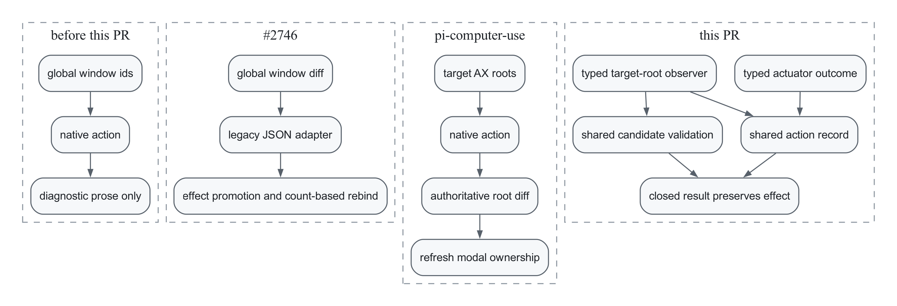

# Post-action surface rediscovery

Issue [#2238](https://github.com/trycua/cua/issues/2238) describes a stale-target failure: an action opens a sheet, dialog, popover, or Open/Save panel, but the caller remains bound to the blocked parent window. Cua Driver's old macOS detector compared all desktop windows and appended changes to diagnostic prose. It could neither prove causality nor return a stable rebind address.

This implementation resolves the structured-rebind rung. It does not add the issue's later privacy-sensitive desktop-frame fallback or inert-resnapshot backstop.



## Sources

The implementation retains Cua Driver's native action routes, focus-suppression leases, shared action record, closed result contract, and harness-owned escalation policy. From [#2746](https://github.com/trycua/cua/pull/2746), it retains typed `window_change` metadata, explicit `rebind` advice, and generated Rust, Python, TypeScript, and manifest bindings.

The target-root observer adapts `injaneity/pi-computer-use` commit `022a280a377065c95736cc15f684bf1fad46479e`: snapshot the target accessibility domain before dispatch, use a cheap target-window signature only to end the bounded wait early, then treat one accessibility snapshot diff as authoritative. If the early signal beats the accessibility tree, bounded catch-up retries let it settle. Appeared roots plus modal or focused state resolve the next interaction surface.

The persistent AXObserver ring is intentionally not copied. That commit established that sheet creation emits no reliable AX notification, so events improve latency for some roots but do not improve correctness. Cua Driver's bounded signature poll preserves the useful early-exit behavior without adding observer lifecycle state.

Cua Driver adds its existing focus-suppression lease, typed action record, and WindowServer ownership verification at the macOS platform boundary. This keeps AppKit Open/Save panels hosted by a separate service process addressable without treating unrelated desktop changes as action results. `AXSheets` and `AXChildren` are merged because recent macOS versions do not expose sheets consistently through one attribute.

## Flow

```text
macOS action decorator
  → target accessibility snapshot
  → native actuator
  → target accessibility diff
  → WindowServer ownership proof
  → shared candidate resolver
  → typed action record
  → closed action result
```

The observer reports facts; the shared resolver chooses policy; the action record accounts for actuator effect. A surface change cannot promote `effect` to `confirmed` because confirmation still requires value readback.

An exact rebind requires one owner-verified candidate that is modal or focused. Otherwise the result retains candidates without inventing a target, and the caller can correlate them with one fresh `list_windows` call. Rebinding itself never activates, raises, captures, or sends input to the new surface.

Windows and Linux currently omit topology instead of substituting an unscoped desktop heuristic.

## Removed path

The implementation removes the global `WindowChangeDetector`, per-tool diagnostic suffix mutations, the dead observation-skip hook, topology transport through legacy JSON, and `window_change` as duplicate effect evidence. One macOS action decorator now owns observation for every affected action tool.

## Contract invariants

- `window_change` is independent from actuator effect.
- an exact escalation target also appears in `window_change.new_windows`.
- unrelated foreground or desktop changes do not create a surface delta.
- ambiguous candidates never produce an exact target.
- partial and failed delivery retain observed topology internally.
- logical rebinding does not change foreground focus or z-order.

The canonical TextEdit Open-panel case exercises the foreign panel-service owner, exact rebound addressability, unchanged foreground and z-order, stable cursor position, and input isolation. The complete macOS Lume matrix remains the readiness gate for the final candidate SHA.
