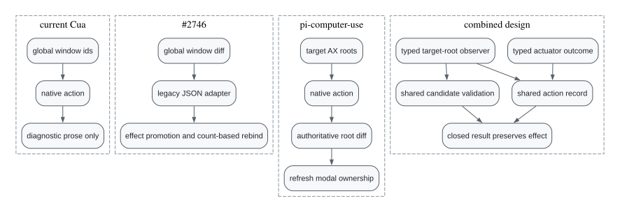

# Post-action surface rediscovery

This document records the implementation boundary for issue
[#2238](https://github.com/trycua/cua/issues/2238). The change
keeps Cua Driver's typed action-result contract while replacing its global
window-count heuristic with target-scoped root observation and shared candidate
validation.

## Existing Cua Driver flow

Cua Driver already protects foreground focus and detects visible native windows,
but the topology survives only in diagnostic text.

## What pull request [#2746](https://github.com/trycua/cua/pull/2746) contributes

Pull request [#2746](https://github.com/trycua/cua/pull/2746) adds a closed `window_change` record and explicit `rebind`
escalation. Those are useful public semantics and remain in this implementation.
Its detector, however, still treats every new desktop window as action-related,
selects an exact target from list length alone, and promotes any topology change
to confirmed action effect.

This implementation preserves from
[#2746](https://github.com/trycua/cua/pull/2746):

- the portable `window_change` record;
- explicit, non-activating `rebind` advice;
- exact target metadata when one replacement surface is validated;
- generated Rust, Python, TypeScript, and manifest parity; and
- rebind-before-pixel, page, foreground, or desktop recovery guidance.

It does not preserve the global-window causality inference, effect promotion, or
branch-local JSON mutation.

## What is adapted from pi-computer-use

The target-root observer adapts the architecture proven in
`injaneity/pi-computer-use` commit
`022a280a377065c95736cc15f684bf1fad46479e`:

- capture accessibility roots for the target process before and after an action;
- treat the accessibility snapshot diff as authoritative;
- use accessibility notifications, focus state, and cheap native-window polling
  only to end the bounded wait early;
- report appeared, closed, and focused roots with modality facts; and
- refresh target resolution before selecting a visible modal surface.

The design is adapted rather than copied verbatim. Cua Driver keeps its Rust
platform boundary, focus-suppression leases, action execution record, closed
contract vocabulary, and explicit harness-owned escalation policy.

## Combined architecture

Detection answers what changed. Resolution answers which surface is safe to
bind. Action accounting answers what the actuator proved. None substitutes for
another.

### Platform observer

Each platform adapter owns native root discovery and never chooses rebind
policy. macOS diffs target-process accessibility windows and their sheet,
dialog, and popover children, then verifies each mapped CGWindow owner. This
keeps AppKit's out-of-process Open/Save panel service addressable without
scanning unrelated desktop changes. Windows and Linux currently omit topology instead
of substituting an unscoped desktop heuristic; equivalent UIA or AT-SPI
observers can later feed the same core resolver.

A cross-application handoff becomes exact only when it appears in the target's
AX roots and WindowServer independently verifies the mapped owner. Temporal
proximity alone never creates a candidate.

### Shared action coordinator

One macOS action decorator starts observation immediately before dispatch and
finishes it afterward. The core dispatch seam attaches its typed delta to the
action execution record, including partial and failed delivery. Platform tools
do not serialize topology to JSON or ask the legacy adapter to parse it back.

### Shared resolver

An exact rebind requires exactly one eligible candidate after validation. The
candidate must be a target-owned blocking modal, a newly focused target-owned
root, or a separately verified cross-application handoff. Otherwise the result
retains candidates and asks the harness to correlate them with `list_windows`.

Logical rebinding never activates, raises, captures, or sends input to the new
surface. The caller refreshes window-scoped state and restarts with background
delivery.

## Contract invariants

- `window_change` is independent from `effect`; topology cannot promote an
  unverifiable, partial, suspected-noop, or refused action to confirmed.
- an exact escalation target must also appear in the accompanying topology.
- unrelated desktop windows cannot become target-owned candidates.
- an empty or unchanged delta cannot produce rebind advice.
- partial and failed delivery retain observed topology internally; successful
  public action results expose it through the closed contract.
- platform adapters report limitations explicitly instead of substituting a
  global desktop heuristic.

## Recovery ladder

Use an exact validated target when present. Otherwise correlate the candidates
with `list_windows`; use one request-scoped, privacy-sensitive desktop frame
only when structured correlation fails. After recovery, refresh window-scoped
state and resume background semantic actions. The fallback must not silently
widen persistent capture scope.

## Validation plan

Before the pull request is made ready:

1. contract tests must reject inconsistent rebind targets and effect promotion;
2. shared resolver tests must cover one modal, several candidates, unrelated
   windows, cross-app handoff, partial delivery, and malformed producer data;
3. macOS observer tests must cover AX-only sheets and delayed root appearance;
4. the TextEdit Open-panel harness case must consume structured topology,
   rebind without activation, and prove the user's foreground app is unchanged;
5. Windows and Linux receive focused contract coverage plus either native
   behavior evidence or an explicit limitation; and
6. the complete canonical macOS harness runs once on the stable candidate SHA.
