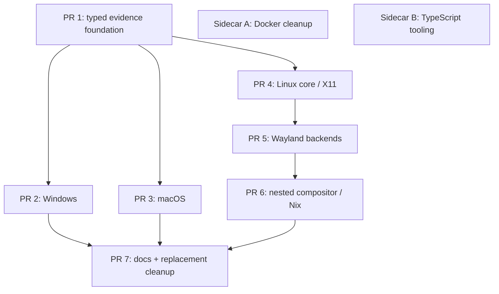

# PR #2161 Landing Plan - Second-Wave E2E Convergence

**Status:** proposed - **Author:** convergence audit follow-up - **Date:** 2026-07-12
**Source PR:** #2161 (`codex/link-e2e-videos`, draft) - 229 files, +24,821 / -17,033, 310 commits.
**Merge state vs `main`:** conflicts only in `docs/content/docs/concepts/meta.json`.

---

## 1. Decision and rationale

**Decision: do not merge #2161. Re-land its delta as a stack of 7 fresh PRs cut from
current `main`, each built from a scoped final-state patch for its owned path set, not
by cherry-picking commits or overwriting current `main` with whole files blindly.**

Rationale:

- **The first-wave split already landed.** The #2135 split plan was executed in merged
  PRs #2138-#2154. #2161 is the _second-wave convergence delta_ that accumulated on the
  long-lived branch afterwards. Only that delta needs to land; the branch history is
  unreviewable as-is (310 commits, many of which rework each other).
- **Cherry-picks are the wrong tool here.** The 310 commits repeatedly rewrite the same
  files (e.g. `recording.rs`, the e2e workflows). Cherry-pick sequences would conflict
  with each other and reproduce dead intermediate states. The branch's _final tree_ is
  the reviewed artifact; scoped binary patches preserve its final add, modify, delete,
  and rename intent while still forcing conflicts against newer `main` to be resolved.
- **The branch also contains intentional work outside the Cua Driver convergence
  scope.** The TypeScript tooling migration and Docker cleanup need their own review
  and rollback boundaries. The Lume 0.3.14 regeneration has already been superseded
  by newer 0.3.15 generated output on `main`. A preservation queue keeps this work
  visible without mixing it into the seven Cua Driver PRs.
- **7 PRs matches the natural seams**: one shared foundation (typed evidence testkit)
  that everything compiles against, three platform silos with disjoint crates, two
  Linux-display follow-ons with a real dependency chain, and one docs/cleanup capstone.
  Fewer PRs would recreate the unreviewable blob; more would multiply shared-file
  splits (Cargo manifests, `platform-linux/src/lib.rs`) for no review benefit.

### Historical evidence vs fresh gates - the governing rule

- **Historical evidence** = CI runs on #2161 / the convergence branch, and the run
  records in `libs/cua-driver/docs/e2e-convergence-journal.md`. It proves the _final
  tree_ once worked as a whole. Cite it in PR descriptions for reviewer context.
- **Fresh required gates** = commands/workflow runs executed **on each new stack
  branch at its head SHA**. Only these gate merging. Historical evidence never
  substitutes for a fresh gate, because each stack PR is a tree state that never
  existed on the convergence branch (foundation without platforms, X11 without
  Wayland, etc.).

---

## 2. Global allowlist and preservation queue

### 2.1 Strict global allowlist (in scope for the 7-PR stack)

Everything in the #2161 delta under:

- `libs/cua-driver/rust/**` (crates, tests, Skills, `Cargo.toml`, `Cargo.lock`, READMEs)
- `libs/cua-driver/tests/**` (fixtures, runners - including the deletions)
- `libs/cua-driver/docs/**`, `libs/cua-driver/README.md`, `libs/cua-driver/scripts/**`
- `libs/cua-driver/wayland-helper/**`
- `scripts/ci/**` (`README.md`, `link-e2e-evidence.sh`, `linux/`, `macos/`, `windows/`)
- `nix/cua-driver/**`, `flake.nix`
- `.github/workflows/`: `e2e-rust-windows.yml`, `e2e-rust-linux.yml`,
  `e2e-rust-linux-wayland.yml`, `ci-rust-linux.yml`, `ci-rust-windows.yml`,
  `ci-nix-linux.yml`, `cd-rust-cua-driver.yml`, `ci-release-reminder.yml`,
  and the deletions `ci-cua-driver-interactive-linux.yml`, `nix-build.yml`,
  `nix-screenshot.yml`, `nix-wayland.yml`
- `.github/scripts/tests/test_cua_driver_release_wiring.py`
- `docs/content/docs/concepts/{how-cua-driver-is-validated.mdx,index.mdx,meta.json}`
- `docs/content/docs/reference/cua-driver/**`
- Root docs: `README.md`, `CONTRIBUTING.md`, `Development.md`, `TESTING.md`

### 2.2 Preservation queue (excluded from the seven Cua Driver PRs)

| Owner                         | Paths                                                                                                                                                                                                  | Intent                                                                                                                 | Disposition                                                                                               |
| ----------------------------- | ------------------------------------------------------------------------------------------------------------------------------------------------------------------------------------------------------ | ---------------------------------------------------------------------------------------------------------------------- | --------------------------------------------------------------------------------------------------------- |
| Sidecar A: Docker cleanup     | `Dockerfile`, `.dockerignore`                                                                                                                                                                          | Remove the obsolete root development image and its ignore file                                                         | Fresh two-file PR from current `main`                                                                     |
| Sidecar B: TypeScript tooling | `package-lock.json`, `libs/typescript/package.json`, `libs/typescript/.prettierignore`, `.github/workflows/ci-lint-typescript.yml`, `.pre-commit-config.yaml`, `.github/workflows/claude-auto-fix.yml` | Make the TypeScript workspace own pnpm setup, build core before typecheck, and keep generated output out of formatting | Fresh six-file PR from current `main`                                                                     |
| Superseded by `main`          | `docs/content/docs/reference/lume/cli-reference.mdx`, `docs/content/docs/reference/lume/http-api.mdx`                                                                                                  | Regenerate Lume references at 0.3.14                                                                                   | Record as satisfied by the newer generated 0.3.15 files already on `main`; do not replay the older output |

Separation enforcement: every Cua Driver stack branch must satisfy
`git diff --name-only origin/main...HEAD | grep -E -x '(Dockerfile|\.dockerignore|package-lock\.json|\.pre-commit-config\.yaml|libs/typescript/.*|\.github/workflows/(ci-lint-typescript|claude-auto-fix)\.yml|docs/content/docs/reference/lume/.*)'`
-> **empty output** (add as a pre-push checklist item on each PR).

#### Sidecar A - `codex/conv2-sidecar-docker-cleanup`

Suggested title: `chore(repo): remove obsolete development Docker image`.

Fresh gates:

- [ ] Repo-wide reference search proves no maintained command, workflow, or guide uses
      the root `Dockerfile` or `.dockerignore`
- [ ] Existing container workflows still point to their owned Dockerfiles
- [ ] The PR contains exactly the two deletions

#### Sidecar B - `codex/conv2-sidecar-typescript-tooling`

Suggested title: `ci(typescript): use workspace-local pnpm tooling`.

Fresh gates:

- [ ] `pnpm -C libs/typescript install --frozen-lockfile`
- [ ] `pnpm -C libs/typescript typecheck`
- [ ] `pnpm -C libs/typescript format:check`
- [ ] The TypeScript lint workflow passes on the sidecar head SHA
- [ ] The pre-commit TypeScript hook invokes the same workspace command

The sidecars are independent of the seven-PR stack and may land while PR 1 is under
review. They still belong to the #2161 preservation record.

### 2.3 Coverage invariant

Every file in `git diff --name-status origin/main...codex/link-e2e-videos` is owned by
**exactly one** stack PR, sidecar PR, or superseded-by-main row. The audit in Section 7
verifies this mechanically;
if a file turns out unowned or double-owned during execution, stop and amend this plan
first.

---

## 3. The 7-PR stack

Branch prefix: `codex/conv2-0N-<slug>`. PR titles: conventional-commit style with a
`(conv2 N/7)` suffix. All PRs squash-merge. All PR bodies link #2161 and this plan.

Common transfer recipe (per PR, from a clean worktree). Replace `<owned paths>` with
the explicit files for that PR; do not use a broad directory when the directory also
contains sidecar-owned or shared files:

```bash
git fetch origin
git switch -c codex/conv2-0N-<slug> origin/main
# Preserve the final #2161 add/modify/delete/rename intent and three-way it
# against the current main tree.
SNAPSHOT_BASE=$(git merge-base origin/main codex/link-e2e-videos)
git diff --binary --find-renames "$SNAPSHOT_BASE" codex/link-e2e-videos -- \
  <owned paths> | git apply --3way --index
# shared-file hunks (see Section 4): hand-edit, do NOT checkout the whole file
cd libs/cua-driver/rust && cargo check --workspace   # regenerates Cargo.lock honestly
```

Common fresh gates (every PR that touches `libs/cua-driver/rust`):

```bash
cargo fmt --all --check
cargo clippy --workspace --all-targets -- -D warnings
cargo test --workspace          # host-runnable subset
cargo test --workspace --no-run # proves e2e/platform tests still compile
```

---

### PR 1 - `codex/conv2-01-typed-evidence` - "test(cua-driver): typed e2e evidence foundation (conv2 1/7)"

**Purpose:** land the typed testkit (journal/observer/sentinel/e2e result types), the
`cua-e2e-report` binary, core recording rework, the shared scenario catalog and
cross-platform fixture updates, and the evidence-linking script. Everything later PRs
compile against.

**Owns (final state):**

- `libs/cua-driver/rust/crates/cua-driver-testkit/**` - whole crate: `Cargo.toml`,
  `src/lib.rs`, `src/bin/cua-e2e-report.rs` (A), `driver.rs`, `e2e.rs` (A),
  `journal.rs` (A), `mcp.rs`, `observer.rs` (A), `paths.rs`, `reaper.rs`,
  `response.rs`, `sentinel.rs` (A), `windows_setup.rs` (A - cfg-gated, ships here so
  `lib.rs` can be final-state)
- `crates/cua-driver-core/src/`: `cdp.rs`, `recording.rs`, `recording_tools.rs`, `tool.rs`
- `crates/cua-driver/src/`: `main.rs`, `serve.rs`; `crates/cua-driver/tests/README.md`
- Cross-platform tests: `capture_contract_test.rs` (rename of
  `modality_capture_mode_test.rs`), `cross_platform_behavior_test.rs`,
  `e2e_environment_preflight_test.rs` (A), `protocol_schema_test.rs`
- **Deletes** superseded cross-platform modality tests (they consume the pre-typed
  testkit API and won't compile after this PR): `modality_background_test.rs`,
  `modality_desktop_scope_test.rs`, `modality_dispatch_test.rs`,
  `modality_focus_test.rs`, `modality_input_e2e_test.rs`
- Shared fixtures: `tests/fixtures/shared/scenarios.json`,
  `tests/fixtures/shared/web/index.html`, electron `build.sh`, `main.js`,
  `preload.js` (A), `tauri/src-tauri/src/main.rs`
- `scripts/ci/link-e2e-evidence.sh` (A)
- Dev tooling: `libs/cua-driver/scripts/_install-local-rust.sh`, `sync-vm-worktree.sh`
- `rust/Skills/cua-driver/RECORDING.md` (documents recording behavior changed here)
- `Cargo.lock` (regenerated via `cargo check`, not copied)

**Excludes:** all platform crate changes, all workflows, all `libs/cua-driver/docs/**`,
electron `build.ps1` / `launcher-linux.sh` (platform PRs).

**Dependencies:** none (base = `main`).

**Fresh gates:**

- [ ] Common cargo gates (above), on Linux CI at minimum; `cargo test --no-run` on a
      Windows and macOS host or cross-check to prove cfg-gated testkit compiles
- [ ] `shellcheck scripts/ci/link-e2e-evidence.sh libs/cua-driver/scripts/*.sh`
- [ ] `cargo run -p cua-driver-testkit --bin cua-e2e-report -- --help` (or its
      self-test invocation) exits 0
- [ ] Existing `ci-rust-*` workflows green on the PR (unchanged workflow files must
      still pass against the new testkit)

**Historical evidence:** #2161 CI runs; `e2e-convergence-journal.md` (lands in PR 7 -
link to the branch copy).

**Rollback boundary:** revert restores the pre-typed testkit and the five deleted
modality tests; nothing on `main` yet depends on the new API. Must be reverted only
if PRs 2-4 haven't merged (they consume `e2e::*`/`journal::*`).

---

### PR 2 - `codex/conv2-02-windows` - "fix(cua-driver): Windows e2e convergence (conv2 2/7)"

**Purpose:** Windows platform fixes (input injection, WGC capture, UIA cache,
recording hooks), typed Windows e2e tests, sandbox/runner + CI wiring; retire
`focus-monitor-win`.

**Owns:**

- `crates/platform-windows/src/`: `capture.rs`, `input/{delivery,inject,keyboard,mod,mouse}.rs`,
  `recording_hooks.rs`, `tools/impl_.rs`, `uia/{cache,windows_enum}.rs`, `wgc.rs`,
  `win32/windows.rs`
- **Deletes** `crates/focus-monitor-win/{Cargo.toml,src/main.rs}`; owns the one-line
  member removal in workspace `rust/Cargo.toml` (hand-edit, see Section 4)
- Tests: `agent_cursor_windows_test.rs` (A), `desktop_scope_windows_test.rs` (A),
  `launch_windows_test.rs` (A), `harness_winui3_test.rs`, `harness_wpf_test.rs`;
  `harness_web_test.rs` (Windows-only WPF + WebView2/Electron CDP coverage);
  **deletes** `guard_ux_test.rs` (superseded by the typed agent-cursor/launch suites)
- Fixtures: `windows/webview2/MainWindow.xaml{,.cs}`, `windows/wpf/MainWindow.xaml{,.cs}`,
  `fixtures/build/windows.ps1`, electron `build.ps1`
- Runners: `tests/runners/windows-sandbox/{run-tests-in-sandbox,sandbox-runner}.ps1`,
  `tests/runners/windows/{README.md,run-all.ps1}`
- CI: `scripts/ci/windows/{build-harnesses,run-rust-e2e}.ps1`,
  `.github/workflows/{e2e-rust-windows.yml,ci-rust-windows.yml}`
- `Cargo.lock` regen

**Excludes:** testkit sources (PR 1), all docs.

**Dependencies:** PR 1 (typed testkit API, `windows_setup` module).

**Fresh gates:**

- [ ] Common cargo gates on a Windows runner (`cargo test -p platform-windows`,
      `cargo test --no-run` for the e2e suites)
- [ ] `workflow_dispatch` of `e2e-rust-windows.yml` **on this branch head** -> green,
      with `cua-e2e-report` summary artifact and evidence links present
- [ ] `ci-rust-windows.yml` green on the PR
- [ ] Grep proves no residual `focus-monitor-win` references:
      `git grep -n focus-monitor-win` -> empty

**Historical evidence:** #2161 `e2e-rust-windows` runs; `windows-hosted-e2e` /
`windows-px-background-clicks` branch history. Context only.

**Rollback boundary:** revert restores old Windows behavior + `guard_ux_test.rs` +
`focus-monitor-win`; independent of PRs 3-6. Safe to revert alone before PR 7 (whose
docs describe the new Windows surface).

---

### PR 3 - `codex/conv2-03-macos` - "fix(cua-driver): macOS e2e convergence (conv2 3/7)"

**Purpose:** macOS AX/input/tool fixes, typed macOS suites (desktop scope, installed
app launch, TextEdit), fixture and smoke updates, hosted-runner e2e script.

**Owns:**

- `crates/platform-macos/src/`: `ax/bindings.rs`, `input/mouse.rs`,
  `tools/{click,drag,mod,scroll,type_text}.rs`, `window_change_detector.rs`
- Tests: renames `modality_desktop_scope_macos_test.rs -> desktop_scope_macos_test.rs`
  and `modality_launch_focus_macos_test.rs -> installed_app_launch_macos_test.rs`;
  `installed_app_textedit_macos_test.rs` (A), `harness_appkit_test.rs`,
  `harness_swiftui_test.rs`
- Fixtures: `macos/appkit/main.swift`, `macos/swiftui/main.swift`,
  `macos/wkwebview/main.swift`, `fixtures/build/macos.sh`, `fixtures/smoke/macos.sh`
- `scripts/ci/macos/run-rust-e2e.sh` (A)
- `Cargo.lock` regen (if any)

**Excludes:** testkit, docs, everything Windows/Linux. Note: there is no macOS e2e
GitHub workflow in the delta - the script is invoked on self-hosted/local runners.

**Dependencies:** PR 1 only. Parallel with PR 2 and PR 4.

**Fresh gates:**

- [ ] Common cargo gates on a macOS host
- [ ] `bash libs/cua-driver/tests/fixtures/build/macos.sh` +
      `bash libs/cua-driver/tests/fixtures/smoke/macos.sh` pass locally
- [ ] `bash scripts/ci/macos/run-rust-e2e.sh` full run on a macOS host with
      Accessibility/Screen Recording grants -> summary posted to the PR (paste the
      `cua-e2e-report` output; this is the fresh gate standing in for hosted CI)

**Historical evidence:** convergence-journal macOS entries; #2161 local run logs.

**Rollback boundary:** revert restores old macOS tool behavior and the `modality_*`
test names. Independent of PRs 2/4-6.

---

### PR 4 - `codex/conv2-04-linux-x11` - "fix(cua-driver): Linux core and X11 e2e convergence (conv2 4/7)"

**Purpose:** Linux platform core (AT-SPI, input delivery, overlay, health report,
recording hooks), X11 path, typed Linux desktop-scope suite, X11 e2e scripts and
workflows; retire the interactive-Linux workflow.

**Owns:**

- `crates/platform-linux/src/`: `a11y.rs`, `atspi/{mod,native}.rs`, `health_report.rs`,
  `input/{delivery,mod}.rs`, `overlay.rs`, `recording_hooks.rs` (A),
  `tools/{impl_,stubs}.rs`, `x11/mod.rs`
- `platform-linux/src/lib.rs` - **hunk only**: `pub mod recording_hooks;` (see Section 4)
- Tests: `desktop_scope_linux_test.rs` (A), `harness_gtk3_test.rs`; **deletes**
  `modality_desktop_scope_linux_test.rs`, `modality_dispatch_linux_test.rs`
- Fixtures: `linux/gtk3/main.py`, `fixtures/build/linux.sh`,
  electron `launcher-linux.sh` (A)
- CI: `scripts/ci/linux/run-rust-e2e.sh`, `run-rust-e2e-desktop.sh` (A),
  `.github/workflows/{e2e-rust-linux.yml,ci-rust-linux.yml}`;
  **deletes** `.github/workflows/ci-cua-driver-interactive-linux.yml`
- `rust/Skills/cua-driver/LINUX.md`
- `Cargo.lock` regen

**Excludes:** everything under `platform-linux/src/wayland/`, `video_wayland.rs`,
`platform-linux/Cargo.toml` (all PR 5).

**Compile caveat:** if `recording_hooks.rs` in final state imports `video_wayland` or
`wayland::sway_ipc`, `cargo check` fails here - in that case move the offending file(s)
to PR 5 and note the move in both PR bodies. The `--no-run` gate catches this.

**Dependencies:** PR 1. Parallel with PRs 2-3.

**Fresh gates:**

- [ ] Common cargo gates on Linux
- [ ] `workflow_dispatch` of `e2e-rust-linux.yml` on this branch head -> green X11
      canonical matrix, evidence artifacts present
- [ ] `ci-rust-linux.yml` green on the PR
- [ ] `shellcheck scripts/ci/linux/run-rust-e2e*.sh`
- [ ] Confirm nothing still references the deleted interactive workflow:
      `git grep -n ci-cua-driver-interactive-linux` -> empty

**Historical evidence:** "record Linux completion evidence" commits; journal entries.

**Rollback boundary:** revert restores old Linux core + interactive workflow. Must
revert PR 5 first if PR 5 has merged (Wayland modules reference core changes).

---

### PR 5 - `codex/conv2-05-wayland` - "fix(cua-driver): Wayland backend convergence (conv2 5/7)"

**Purpose:** Wayland backend work (ext-toplevel, sway IPC, portal screenshot,
persistent virtual pointer, libei, and the shared nested-injection protocol code),
Wayland video, the `portal-libei -> portal-input + portal-capture` feature split,
Wayland e2e workflow/script, GNOME helper extension, and shipping `portal-input` in
release binaries. The nested route remains dormant/experimental until PR 6 packages
and validates its owned compositor environment.

**Owns:**

- `crates/platform-linux/src/wayland/` - everything: `ext_toplevel.rs` (A),
  `libei.rs`, `mod.rs`, `persistent_vptr.rs`, `portal_screenshot.rs`,
  `shell_helper.rs`, `sway_ipc.rs` (A)
- `platform-linux/src/video_wayland.rs` (A); `platform-linux/src/lib.rs` -
  **hunk only**: `pub mod video_wayland;`
- Manifests (whole-file final state - the delta in each is entirely this PR's):
  `crates/platform-linux/Cargo.toml` (feature split), `crates/cua-driver/Cargo.toml`
  (feature forwarding)
- CI: `scripts/ci/linux/run-rust-e2e-wayland.sh` (A),
  `.github/workflows/e2e-rust-linux-wayland.yml`,
  `.github/workflows/cd-rust-cua-driver.yml` (release builds gain
  `--features portal-input` + `libxkbcommon-dev`)
- `libs/cua-driver/wayland-helper/{README.md,winrects@cua/extension.js,winrects@cua/metadata.json}`
- `Cargo.lock` regen

**Excludes:** X11/core files (PR 4), Nix (PR 6).

**Dependencies:** PR 4 (shares `platform-linux`; core/input changes land first).

**Fresh gates:**

- [ ] Common cargo gates, plus feature-matrix compiles:
      `cargo check -p platform-linux`, `... --features portal-input`,
      `... --features portal-capture`, `... --features portal-libei`
- [ ] `workflow_dispatch` of `e2e-rust-linux-wayland.yml` on this branch head with
      environment `sway` -> green canonical matrix
- [ ] `cd-rust-cua-driver.yml` build job dry-run (workflow_dispatch or `act`/container
      rehearsal) proves the Debian 11 container builds with `--features portal-input`
- [ ] `.github/scripts/tests/` release-wiring tests still pass **unmodified**
      (`python -m unittest` - the reminder-text update itself lands in PR 7)

**Historical evidence:** `wayland-e2e-dbus`/`wayland-e2e-dispatch` branch runs;
journal Wayland entries.

**Rollback boundary:** revert restores `portal-libei`-only gating and the old release
build. Must revert PR 6 first if merged (Nix consumes the new feature names).

---

### PR 6 - `codex/conv2-06-nix` - "ci(cua-driver): nested compositor Nix consolidation (conv2 6/7)"

**Purpose:** consolidate the Nix story - rewritten `flake.nix` and
`nix/cua-driver/package.nix` (new feature names), nested-compositor patch, delete the
21 superseded `.nix` test files and the three standalone nix workflows in favor of
`ci-nix-linux.yml`.

**Owns:**

- `flake.nix`, `nix/cua-driver/{README.md,package.nix,compositor/cua_compositor_patch.py,tests/README.md}`
- `scripts/ci/linux/run-rust-e2e-inject.sh` (A), which activates the nested
  environment packaged by this PR
- **Deletes** `nix/cua-driver/tests/*.nix` (integration, linux-background-gui,
  linux-background-terminal-gif, linux-cursor-click-gif, linux-parallel-drag-gif,
  linux-parallel-drag-xserver, openbox-rc, record-x11-gif, screenshot, set-config)
  and `nix/cua-driver/tests/wayland/**` (README.md + 10 `.nix` files)
- CI: `.github/workflows/ci-nix-linux.yml`; **deletes**
  `.github/workflows/{nix-build.yml,nix-screenshot.yml,nix-wayland.yml}`

**Excludes:** all Rust sources (PRs 1-5), docs.

**Dependencies:** PR 5 (`package.nix` builds with the split features).

**Fresh gates:**

- [ ] `nix flake check` and `nix build .#cua-driver` (or the flake's package attr)
      succeed locally/CI
- [ ] `ci-nix-linux.yml` green on this branch head (workflow_dispatch), covering what
      the three deleted workflows covered
- [ ] Dispatch `e2e-rust-linux-wayland.yml` with the nested-compositor environment on
      this branch head. Native and capture owners must remain green; any experimental
      shared-row failures must match the named PR description exactly, with no new
      setup, protocol, or evidence regression. This run is evidence, not a promotion
      of the experimental lane.
- [ ] `git grep -nE 'nix-(build|screenshot|wayland)\.yml'` -> empty (no dangling refs)

**Historical evidence:** nested-compositor GIF/screenshot runs recorded in the journal.

**Rollback boundary:** revert restores the old nix tests/workflows; independent of
Rust code paths (Nix is packaging/CI only). Safe to revert alone.

---

### PR 7 - `codex/conv2-07-docs-cleanup` - "docs(cua-driver): convergence docs and replacement cleanup (conv2 7/7)"

**Purpose:** land all documentation describing the converged state, delete the
superseded recording/fixture corpora that the typed evidence pipeline replaces, and
wire the release-reminder validation checklist. **Resolves the sole `main` conflict.**

**Owns:**

- `docs/content/docs/concepts/`: `how-cua-driver-is-validated.mdx` (A), `index.mdx`;
  `meta.json` - **hand-merge, never final-state** (see Section 4): insert the
  `how-cua-driver-is-validated` entry into _current main's_ `meta.json`
- `docs/content/docs/reference/cua-driver/`: `development.mdx`, `limits.mdx`,
  `mcp-tools.mdx`, `meta.json`, `platform-roadmap.mdx` (A), `platform-support.mdx` (A)
- `libs/cua-driver/docs/`: adds `action-support.md`, `e2e-convergence-journal.md`,
  `e2e-results-summary-design.md`, `linux-desktop-validation.md`,
  `linux-support-completion-plan.md`, `test-harness-convergence-plan.md`,
  `test-harnesses-guide.md`, `test-matrix.md`; modifies `e2e-ci-reporting.md`;
  **deletes** `cross-platform-ci-test-plan.md`, `pr-split-plan.md`; includes this
  file (`pr-2161-landing-plan.md`) for the record
- Root docs: `README.md`, `CONTRIBUTING.md`, `Development.md`, `TESTING.md`,
  `libs/cua-driver/README.md`, `libs/cua-driver/rust/README.md`
- Replacement cleanup - **deletes whole directories**:
  `libs/cua-driver/tests/fixtures/linux-container/**` (5 files),
  `libs/cua-driver/tests/fixtures/modality-recordings/**` (15 files),
  `libs/cua-driver/tests/fixtures/vision-agent-test/**` (2 files);
  modifies `tests/fixtures/README.md` to match
- `scripts/ci/README.md` (final state - documents scripts landed in PRs 1-5)
- Release wiring: `.github/workflows/ci-release-reminder.yml` +
  `.github/scripts/tests/test_cua_driver_release_wiring.py` (checklist links the
  workflows finalized in PRs 4-5)

**Excludes:** the superseded Lume generated docs (Section 2.2), even though they sit
next to owned docs paths. Current `main` already contains their newer generated form.

**Dependencies:** PRs 2-6 all merged (docs describe every platform; cleanup deletes
corpora only once every replacement suite is live; reminder links final workflows).

**Fresh gates:**

- [ ] Docs site builds: `pnpm install && pnpm build` in `docs/` (or the repo's docs
      build command) with zero broken-link errors for the new pages
- [ ] `python -m unittest .github/scripts/tests/test_cua_driver_release_wiring.py` passes
- [ ] `git grep -n 'modality-recordings\|linux-container\|vision-agent-test' -- ':!libs/cua-driver/docs'`
      -> empty (nothing references deleted fixtures)
- [ ] Rendered-page spot check of `platform-support.mdx` / `platform-roadmap.mdx` /
      `how-cua-driver-is-validated.mdx`

**Historical evidence:** n/a - docs are the evidence record itself; verify links resolve.

**Rollback boundary:** pure docs + inert fixture deletions + reminder text; safe to
revert alone at any time.

---

## 4. Shared-file overlap and conflict handling

Disjoint path ownership eliminates most conflicts. The exceptions, with their rule:

| Shared file                                                        | Touched by                                           | Rule                                                                                                                                                                                                              |
| ------------------------------------------------------------------ | ---------------------------------------------------- | ----------------------------------------------------------------------------------------------------------------------------------------------------------------------------------------------------------------- |
| `rust/Cargo.lock`                                                  | PRs 1, 2, 4, 5 (+3 if deps shift)                    | **Never final-state-copied.** Each PR hand-edits its manifests and regenerates via `cargo check --workspace`. Parity audit compares it semantically (`cargo tree`), not byte-wise.                                |
| `rust/Cargo.toml` (workspace)                                      | PR 2 only                                            | Whole delta is the `focus-monitor-win` member removal -> PR 2 hand-edits that one line.                                                                                                                           |
| `crates/cua-driver-testkit/**`                                     | PR 1 only                                            | Entire crate (incl. cfg-gated `windows_setup.rs`) lands in PR 1 so `lib.rs` is final-state and compiles everywhere.                                                                                               |
| `crates/platform-linux/src/lib.rs`                                 | PRs 4, 5                                             | Hunk-split: PR 4 adds `pub mod recording_hooks;`, PR 5 adds `pub mod video_wayland;`. Neither checks out the whole file.                                                                                          |
| `crates/platform-linux/Cargo.toml`, `crates/cua-driver/Cargo.toml` | PR 5 only                                            | Verified: the entire delta in both is the portal feature split -> PR 5 takes final state.                                                                                                                         |
| `platform-linux/src/wayland/mod.rs`                                | PR 5 only                                            | All Wayland module wiring (incl. `sway_ipc`, `ext_toplevel`, feature-gate renames) is PR 5's.                                                                                                                     |
| Shared scenario catalog `tests/fixtures/shared/scenarios.json`     | PR 1 only                                            | Final-state superset lands in PR 1; entries for platform suites not yet landed are inert data. Platform PRs must not touch it - if a platform needs a catalog fix, it amends PR 1 before landing, not its own PR. |
| `tests/fixtures/README.md`                                         | PR 7 only                                            | Final state; documents both adds (PRs 1-5) and deletions (PR 7). Acceptable to be momentarily ahead/behind between merges.                                                                                        |
| `scripts/ci/README.md`                                             | PR 7 only                                            | Same rule as above.                                                                                                                                                                                               |
| Workflows                                                          | one owner each (table in Section 2.1 / per-PR lists) | A workflow file never spans two PRs. `cd-rust-cua-driver.yml` -> PR 5; `ci-release-reminder.yml` -> PR 7 (its wiring test rides with it).                                                                         |
| `docs/content/docs/concepts/meta.json`                             | PR 7 only                                            | **The only `main` conflict.** Hand-merge: apply the #2161 _intent_ (add the new page entry) onto current main's file; do not `git checkout` the branch version.                                                   |

Conflict-with-main policy for the whole stack: because every branch is cut fresh from
current `origin/main` and transfers final state per path, the only possible conflicts
are files that changed on `main` after #2161 diverged. Before each transfer, run
`git diff origin/main...codex/link-e2e-videos --name-only -- <owned paths>` vs
`git log origin/main --since=<branch-point> -- <owned paths>`; any path with fresh
`main` history gets the `meta.json` treatment (hand-merge, note in PR body).

## 5. Dependency graph



PRs 2, 3, 4 may be prepared and reviewed in parallel once PR 1 merges. PRs 5-7 are
strictly sequential behind their parents. Sidecars A and B are independent and may
land at any point before #2161 closes.

## 6. Sequential landing procedure

For each PR, in dependency order:

- [ ] Cut `codex/conv2-0N-<slug>` from **current** `origin/main` (never from a sibling
      stack branch) and run the transfer recipe (Section 3)
- [ ] Run the sidecar-separation grep (Section 2.2) -> empty
- [ ] Run the PR's fresh gates; attach workflow-run links / command output to the PR body
- [ ] PR body: purpose, owned-path list, link to #2161 + this plan, historical-evidence
      links clearly labeled "historical - superseded by fresh runs above"
- [ ] Review -> squash-merge
- [ ] After merge: the next PR in line re-cuts from the new `main` (re-running the
      final-state transfer is cheap and conflict-free by construction - prefer re-cut
      over rebase)
- [ ] Post a progress comment on #2161: "conv2 N/7 landed as #NNNN"

If a fresh gate fails on a stack PR: fix **on that stack branch** (these are real
review findings - the point of the split); if the fix belongs to an earlier layer,
land a follow-up to that layer first. Never "fix" a Cua Driver PR by pulling in a
sidecar-owned file.

## 7. Final allowlisted tree-parity audit

After PR 7 merges, from an up-to-date checkout:

```bash
git fetch origin
# 1) Allowlisted parity: for every Section 2.1 path, main must equal the #2161 tree.
git diff origin/main codex/link-e2e-videos -- \
  libs/cua-driver nix/cua-driver flake.nix scripts/ci \
  .github/workflows/e2e-rust-windows.yml .github/workflows/e2e-rust-linux.yml \
  .github/workflows/e2e-rust-linux-wayland.yml .github/workflows/ci-rust-linux.yml \
  .github/workflows/ci-rust-windows.yml .github/workflows/ci-nix-linux.yml \
  .github/workflows/cd-rust-cua-driver.yml .github/workflows/ci-release-reminder.yml \
  .github/scripts/tests/test_cua_driver_release_wiring.py \
  docs/content/docs/concepts docs/content/docs/reference/cua-driver \
  README.md CONTRIBUTING.md Development.md TESTING.md
```

Expected residual diff - exactly three explainable classes, anything else is a missed
file and blocks closing #2161. Maintain an **adaptation ledger** in the final #2161
comment: one row per intentionally divergent path, with the stack PR/commit and exact
reason. A generic "main advanced" exception is not acceptable.

1. `libs/cua-driver/rust/Cargo.lock` - regenerated, semantically compared via
   `cargo tree --workspace` on both trees
2. `docs/content/docs/concepts/meta.json` - hand-merged against newer `main`
3. Files intentionally adapted while landing against newer `main`, each listed in the
   adaptation ledger with its owning stack PR and commit

```bash
# 2) Preservation parity: after both sidecars merge, their paths should match
# the intended #2161 state unless the adaptation ledger says otherwise.
git diff --name-only origin/main codex/link-e2e-videos -- \
  Dockerfile .dockerignore package-lock.json .pre-commit-config.yaml \
  libs/typescript .github/workflows/ci-lint-typescript.yml \
  .github/workflows/claude-auto-fix.yml
# expected: empty after Sidecars A and B merge, except ledgered adaptations.

# The Lume references are intentionally different: main must remain newer than
# the snapshot's 0.3.14 generated output.
rg -n 'Version: 0\.3\.15|Documented against Lume \*\*0\.3\.15\*\*' \
  docs/content/docs/reference/lume/{cli-reference,http-api}.mdx

# 3) Coverage invariant: every delta file is stack-owned, sidecar-owned, or
# superseded by the two newer Lume files.
git diff --name-only origin/main...codex/link-e2e-videos | sort > /tmp/delta.txt
# compare against the union of Section 3 ownership lists + Section 2.2 - must match 1:1.
```

Record the audit output as a final comment on #2161.

## 8. Disposition of PR #2161 and its branch

**Link:** each stack PR body carries `Part of the #2161 second-wave landing
(conv2 N/7, plan: libs/cua-driver/docs/pr-2161-landing-plan.md)`. #2161's description
gets a checklist of the seven PRs, updated as they merge.

**Close #2161 when all of:**

- [ ] All 7 stack PRs merged to `main`
- [ ] Sidecars A and B merged to `main`
- [ ] Section 7 parity audit run and posted, residual diff limited to the three explained classes
- [ ] The two Lume paths are recorded as superseded by newer generated output on `main`
- [ ] Closing comment maps every #2161 theme -> landing PR, sidecar PR, or
      superseded-by-main record

Close as **closed, not merged**.

**Delete `codex/link-e2e-videos` when all of:**

- [ ] #2161 closed for at least 30 days (not before 2026-08-11) with no parity regressions reported
- [ ] The first post-landing cua-driver release (per the `ci-release-reminder`
      validation checklist) has shipped green on the converged workflows
- [ ] A final `git diff` against `main` over the allowlist is re-run and still clean -
      confirming the branch holds nothing unlanded outside the two explicitly
      superseded Lume files

Until then the branch stays as the forensic reference for the parity audit and the
historical-evidence links in the stack PRs.
