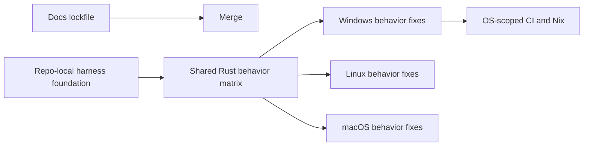

# Cua-driver PR Split Plan

Status: implemented historical record; PR #2135 is closed

## Decision

PR #2135 was not merged as one change. It contained 204 files and roughly 11.5k
additions/deletions across fixture migration, Rust test ownership, Windows
behavior, Linux/macOS behavior, and CI/Nix architecture.

The branch was kept as a snapshot while smaller PRs were built from `main`.
This document remains as the review and sequencing record.

## Target PRs

### PR 0: Documentation lockfile housekeeping

Suggested title:

```text
chore(docs): sync pnpm lockfile with pnpm 9
```

Scope:

- `docs/pnpm-lock.yaml`
- Current provenance: `8fee84dd`

This is independent and can merge first. It should not be coupled to desktop
behavior or CI changes.

Acceptance:

- Docs dependency install/check passes.
- No `libs/cua-driver` files change.

### PR 1: Repo-local Rust harness foundation

Suggested title:

```text
test(cua-driver): make repo-local Rust harnesses canonical
```

Purpose: establish where fixtures, Rust integration tests, and runner scripts
live. This PR should make the source tree coherent without changing the
platform input algorithms.

Scope by file family:

- Move `libs/cua-driver/test-harness` content to
  `libs/cua-driver/tests/fixtures`.
- Add the repo-local Electron and Tauri source/build scripts for each host.
- Move the Windows sandbox runner to `tests/runners/windows-sandbox`.
- Add the Rust-only Windows `tests/runners/windows/run-all.ps1` entrypoint.
- Remove the old Python e2e harness and downloaded desktop binaries.
- Port the optional LibreOffice and macOS launch-focus tests to Rust where
  needed, keeping them outside the default run-all path.
- Update path references, `.gitignore` files, fixture READMEs, Rust test README,
  and the small contributor-facing Fumadocs page.
- Include `libs/cua-driver/scripts/sync-vm-worktree.sh` because it belongs to
  the host-owned fixture workflow.

Historical provenance:

- `811ffa6d`, `d44971c`, `98e59d75`, `d9e4311f`, `9ab85981`,
  `5e8759e1`, and `4e1636b9`.

Do not take the platform implementation portions of `a759840b` or
`d01c7a14` into this PR. If a test path needs a behavior change to compile,
make the smallest path-only adjustment and leave the behavioral assertion
change for the relevant behavior PR.

Acceptance:

- No old downloaded Electron/Tauri application is tracked.
- No Python behavioral suite remains under the cua-driver test tree.
- Fixture build scripts pass shell/PowerShell parsing on their native hosts.
- `cargo test -p cua-driver --tests --no-run` passes on macOS, Linux, and
  Windows.
- Staged outputs remain under ignored `rust/test-apps`.
- Optional external-app tests are visibly excluded from the default runner.

### PR 2: Shared Rust behavioral matrix

Suggested title:

```text
test(cua-driver): add shared external-oracle behavior matrix
```

Purpose: make the trusted user-behavior scenarios explicit before wiring them
into expensive CI. The same scenario IDs, fixture DOM, delivery modes, and
external-state oracles should be used on every supported host.

Scope:

- Add `cross_platform_behavior_test.rs`.
- Add/update the shared web fixture and scenario catalog.
- Add only the generic testkit response/tree helpers required by the matrix.
- Keep the matrix ignored by default and runnable through one Rust command.
- Keep assertions based on fresh application state, not driver success alone.

Historical provenance: primarily `ca60e0ba`, but extract only the matrix,
fixture, and generic testkit pieces. The platform algorithm changes from that
commit belong in PRs 3 and 4.

Acceptance:

- Matrix compiles on all three hosts.
- Electron and Tauri are selected from repo-local source-built fixtures.
- Every scenario has an external oracle and a documented outcome rule.
- Missing fixtures are visible as a runner/setup failure on dedicated e2e
  lanes, not a green silent skip.

### PR 3: Windows delivery and interactive UX fixes

Suggested title:

```text
fix(cua-driver): harden Windows delivery and GUI validation
```

Scope:

- Windows Session 0 and interactive-desktop diagnostics.
- Focus sentinel and guard UX behavior.
- Background keyboard/click refusal reporting and preserved actuator causes.
- UIA focus, scroll, WebView2/Tauri, WPF, and WinUI3 behavior changes.
- Windows-specific test assertions and fixture details that validate those
  behaviors.

Historical provenance: Windows portions of `a759840b`, `98e59d75`,
`d01c7a14`, and `ca60e0ba`.

Acceptance:

- Windows unit and compile checks pass on `windows-latest`.
- SSH/Session 0 runs skip GUI-only assertions with an explicit reason.
- An active user-session run passes the action-owned shared and native harness
  matrix with the cross-cutting desktop observers attached.
- W1-style background input never reports verified delivery without an
  external state change.
- W8-style unsupported background delivery returns a structured refusal with
  the concrete cause.

### PR 4: Linux delivery fixes

Suggested title:

```text
fix(cua-driver): harden Linux AT-SPI and input delivery
```

Scope:

- Linux AT-SPI reference handling, action delivery, input capability errors,
  and related external-oracle test updates.
- Linux focused tests and strict known-gap assertions.

Historical provenance: Linux portions of `a759840b`, `ca60e0ba`, and
`d848e365`. The VM sync helper from `d848e365` belongs in PR 1, not here.

Acceptance:

- Linux unit and interactive Xvfb/AT-SPI checks pass.
- Known gaps remain strict and visible; no assertion is weakened to fit the
  current driver behavior.
- Linux behavior changes are covered by the shared matrix where the platform
  supports the scenario.

### PR 5: macOS input and capture delivery

Suggested title:

```text
fix(cua-driver): harden macOS input and capture delivery
```

Scope:

- macOS background click, drag, targeted wheel, and accessibility scrolling.
- macOS Swift runtime/build fixes required for Rust test binaries.
- macOS focused tests and strict nested-scroll known-gap assertions.

Historical provenance: macOS portions of `a759840b`, `ca60e0ba`, and
`9c3c719a`, plus the macOS portions of `0447bd52`.

Acceptance:

- macOS default tests and installed-daemon harness checks pass with TCC
  already authorized.
- Electron and Tauri click/drag rows use external application-state oracles.
- The nested web scrolling gap remains strict and visible.

### PR 6: OS-scoped CI and Nix e2e architecture

Suggested title:

```text
ci(cua-driver): add OS-scoped Rust and manual e2e lanes
```

Scope:

- Testkit path overrides and their unit test:
  `CUA_TEST_DRIVER_BIN`, `CUA_TEST_APPS_ROOT`, and
  `CUA_TEST_WORKSPACE_ROOT`.
- Strict fixture preflight for canonical e2e runs.
- Linux and Windows OS-scoped unit workflows.
- Maintainer-dispatched Linux and Windows interactive e2e workflows.
- Source-built Linux Rust check in Nix.
- Nix and workflow READMEs describing canonical versus supporting coverage.
- Move the legacy GUI/toolkit and compositor matrices to maintainer dispatch;
  preserve them as supporting diagnostics.
- Keep new canonical Linux tests free of GIF requirements.

Historical provenance: `eef79f2a` and `0447bd52`, after extracting the Linux
and macOS driver edits from `0447bd52` into PRs 4 and 5.

Acceptance:

- Shared Rust changes trigger both OS unit workflows.
- Platform-specific changes trigger only the relevant OS unit workflow.
- Linux Rust source check passes in Nix.
- Manual Linux e2e builds repo-local fixtures from source.
- Windows e2e verifies an interactive user session and supports an Azure
  active-RDP runner label.
- No VM or GitHub runner can push source changes.
- The PR description says clearly that fully sandboxed Nix Electron/Tauri
  packaging remains a follow-up requiring committed dependency lockfiles.

## Dependency Graph



PR 0 is independent. PR 6 is based on PR 3 because its Windows unit workflow
compiles the Windows desktop-state tests and therefore needs the corresponding
diagnostics. It can merge after PR 3; PRs 4 and 5 remain independent platform
slices and should merge before enabling the full cross-platform e2e gate.

## Branching Procedure

1. Freeze PR #2135. Do not add more mixed commits to it.
2. Preserve the current branch as the snapshot containing all work. The
   private `cross-platform-fix-journal.md` stays untracked and must not be
   included in any PR.
3. Create each split branch from `main`, then apply the final file families
   from the snapshot. Use `git diff --find-renames main...HEAD -- <paths>` to
   preserve moves and deletions.
4. Do not cherry-pick `a759840b`, `ca60e0ba`, `d848e365`, or `0447bd52`
   wholesale. Each mixes concerns that belong in different PRs.
5. Cherry-picking `8fee84dd` is safe for PR 0. `eef79f2a` is safe only after
   confirming the old interactive workflow remains compatible with the new CI
   split.
6. Run the acceptance checks for each branch before opening its PR. Keep PR
   descriptions narrowly scoped and list known failures instead of hiding
   them behind broad “cross-platform fixes” language.
7. Open the PRs in dependency order. Stack PR 2 on PR 1 if needed, then
   retarget it to `main` after PR 1 merges. Repeat for later PRs.
8. Close PR #2135 only after the smaller PRs are open and its body links to
   them. Keep the snapshot branch available until all split PRs merge.

## Review and Rollback Rules

- A PR must have one primary reason to change and one obvious owner.
- Fixture moves must be reviewed with rename detection enabled.
- Deleting the Python suite and downloaded binaries is only part of PR 1 when
  the Rust replacement and build scripts are present in the same diff.
- Platform behavior PRs must not change CI trigger policy.
- CI/Nix PRs must not contain opportunistic platform algorithm changes.
- If a split branch cannot compile independently, either add the missing
  foundation to its parent PR or make the dependency explicit; do not silently
  retain unrelated files from PR #2135.
- Revert the smallest PR that caused a regression. The dependency order keeps
  the harness foundation and behavior fixes independently revertible from CI.

## Final State

After all PRs merge, the repository should have:

- Rust harnesses as the canonical behavioral source of truth.
- One shared scenario matrix with platform-specific implementations behind it.
- Cheap OS-scoped unit checks on normal PRs.
- Manual, real-session e2e gates for expensive desktop behavior.
- Nix retained as the Linux environment, with legacy visual checks clearly
  labeled as supporting coverage.
- No opaque downloaded desktop fixture in the canonical test path.
