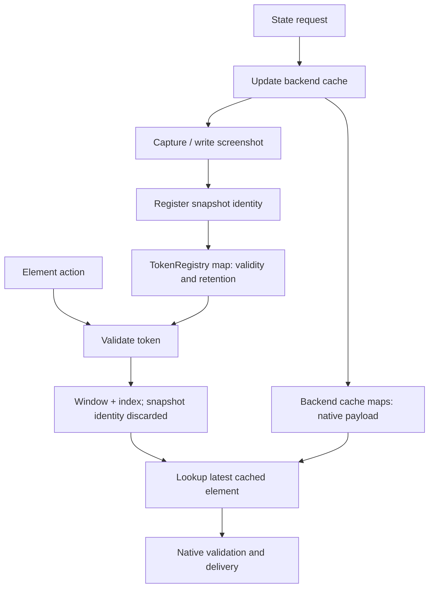
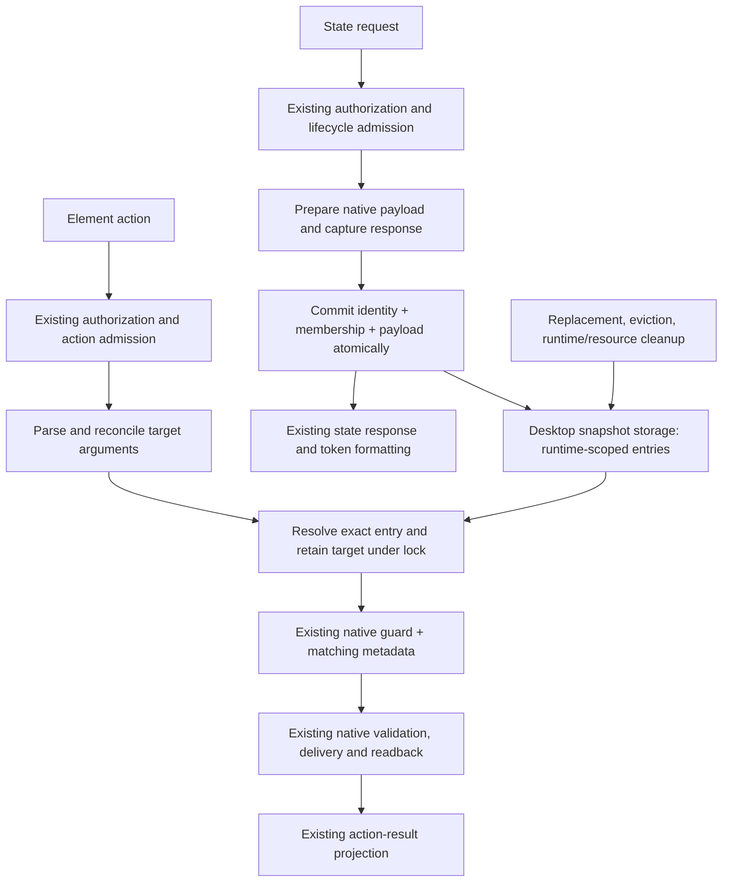
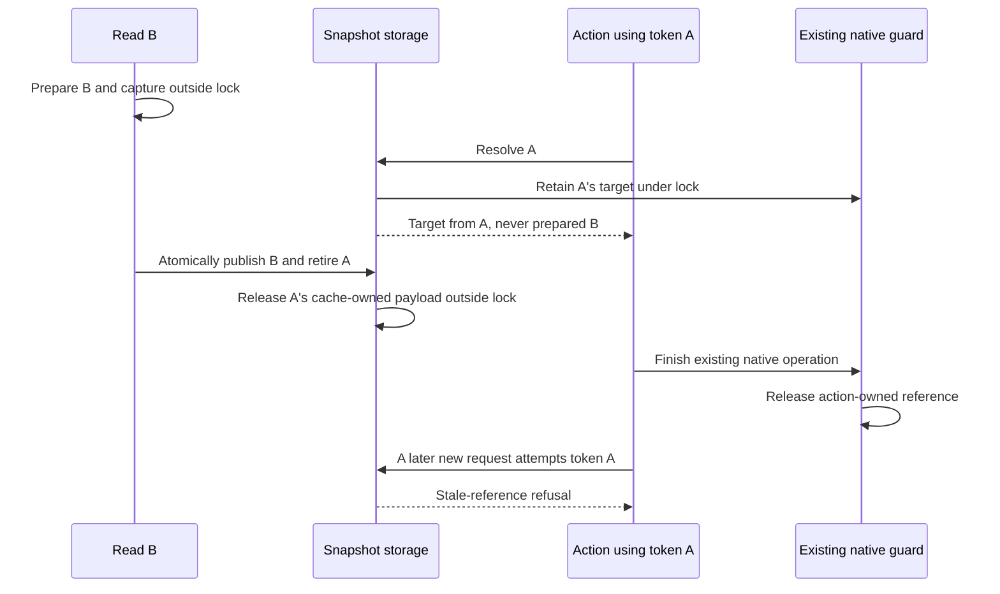

# Technical specification: unified desktop snapshot ownership

Status: simplified desktop implementation selected; local implementation remains uncertified.
Decision record: [RFC 3473](https://github.com/trycua/cua/issues/3473).
Evidence: [local invariant and native review](rfc-3473-local-review.md).
Progress: [worklog](rfc-3473-worklog.md).
The existing [draft PR #3616](https://github.com/trycua/cua/pull/3616) carries this
workstream and its source revision. It remains unready pending native certification.

The problem and original consolidation goal derive from `injaneity`'s RFC. This
specification follows the tests-first investigation and supersedes the earlier
whole-record-lease proposal. It does not record acceptance of the parent RFC.

## 1. Selected decision

Replace independent desktop token validity and native cache ownership with one
authoritative collection of self-identifying snapshot entries. Evolve or replace
`ElementCacheCore` in place; do not put a manager above two surviving stores.

Publication installs identity and lookup payload together. Resolution validates
that identity and acquires the native target from the same entry under the same
lock. Retirement removes that entry; existing native retained-element guards keep
only the resources already admitted to an action alive.

**The architectural improvement is removal of split authority, not another
runtime, scheduler, or whole-snapshot lease abstraction.**

## 2. Problem and evidence

Current macOS state publication does this:

1. Update the native cache.
2. Await optional screenshot capture/output.
3. Register the new snapshot identity in TokenRegistry.

Actions separately validate a token, receive only a window/index pair, and fetch
that index from the current native cache. Snapshot identity is lost between the
two operations. Separate mutexes protect each map, not their relationship.

The AppKit reproduction now invokes the built-in state and click tools. It holds
the actual screenshot file write with FIFO backpressure after cache replacement,
then uses an old token. The fixture independently records a click on the replacement
button. Fresh-token recovery increments that same replacement control again.

| Baseline fact | Evidence |
| --- | --- |
| Old token activated the replacement | `original_clicks=0`, `replacement_clicks=1` while publication remained pending |
| Positive control | Fresh-token click produced `replacement_clicks=2` |
| Native delivery evidence | AXPress response, fixture journal and finalized MP4 |
| Installed version | `0.23.2`; embedded `source_sha` is null |
| Installed binary SHA-256 | `67ccfc99e69ebb5881fdfc3787d85abcd8cc2beb7423f255549557623cab6907` |
| Source inspected | `ed289df50257bd6a65f9ee7964bb842777a1a10a` plus local tests-only changes |

This is an installed-binary reproduction, not exact-source certification of a
candidate or a complete Lume result. The local review preserves failed setup
attempts and the later successful reproduction. No latency improvement is claimed.

Other tests distinguish separate concerns:

- Empty snapshots incorrectly admit index zero in the current registry.
- Token eviction and SDK shutdown can precede native cache release; handle
  destruction balances the measured CF references.
- Native retained-element guards already survive replacement and cache destruction.
- Runtime isolation and normal SDK shutdown draining work.
- Cancelled blocking work can outlive shutdown, but the tested cancelled async
  publisher does not publish late. Global cancelled-worker draining is separate.

## 3. Vertical slice and boundaries

The slice runs end to end from an existing desktop state request to snapshot-bound
action delivery and cleanup. It includes shared storage semantics and complete
producer/consumer migration for macOS, Windows, and Linux. A macOS-only fix is not
the completed cross-platform slice.

### Included

- Atomic desktop snapshot publication, identity resolution and retirement.
- Existing token and snapshot/index argument forms.
- Reference membership, including empty and sparse snapshots.
- Native target acquisition and snapshot-consistent action metadata.
- Existing bounded retention applied to the authoritative entries and their payloads.
- Explicit retirement when the owning runtime shuts down, even if its closed SDK
  handle remains alive; cleanup on owner destruction remains a backstop.
- Deletion of independent token-validity maps, per-platform authoritative cache
  maps, split publication calls and Linux's unused element-key mirror.
- Recording/verification consumers that currently look into those desktop caches.

### Excluded

- New public tools, arguments, token formats, constructors or result envelopes.
- Historical actionable snapshots or revision-ordered writes.
- Automatic successor capture, extra native reads, batching or cached queries.
- New desktop/browser scheduling or longer input-lock scope.
- Browser snapshot migration, browser capability ownership or typed action-family
  migration; those remain separate RFC slices.
- A general ABI cancellation/drain rewrite. Native guards must still be held for
  every use touched by this slice; an unsafe producer cannot be waved through as
  an out-of-scope limitation.
- Geometry freshness changes from [PR #2075](https://github.com/trycua/cua/pull/2075).
  Coordinate with that work rather than absorb or reimplement it without credit.

## 4. Before and after

### Before: two independent authorities



### After: one authoritative entry



There is no authoritative TokenRegistry beside this collection, and no independently
mutable platform cache behind it. Backend facades may construct or project native
payloads; they may not decide snapshot validity or retain another snapshot map.

## 5. Ownership and internal data model

### One authority does not mean one giant application state

The single authority covers desktop snapshot identity, lookup data and lifetime.
Authorization, native targeting, input scheduling, browser bindings, recording
sessions and history policies keep their existing owners.

Shared storage and policy live in `cua-driver-core`. Native payload construction,
retention and release stay in platform crates. Core must not depend on AX, UIA,
MSAA or AT-SPI SDK types.

### Runtime-owned storage layout

Evolve the existing `ElementCacheCore<S: SnapshotPayload>` in place. Each runtime
owns its cache through the platform ToolState; there is no process-wide payload
collection or new manager. The cache holds its runtime scope and one
`Mutex<HashMap<i32, Vec<Snapshot<S>>>>`. Each process lane retains at most eight
publication-ordered entries containing snapshot identity, window identity and
native payload. Same-window publication replaces the previous entry.

Parsing and refusal projection remain in `element_token.rs`; independent token
validity storage is deleted. Platform wrappers collapse into payload types and
existing native guards. Resolution retains the matching target under the storage
lock. Replacement, eviction and cleanup release retired payloads outside it.

A weak runtime-cache directory replaces the existing recording-hook discovery
maps. It supports recording and foreign-generation diagnostics by consulting the
actual caches; it contains neither payload ownership nor copied token validity.

Provisional shapes, not new public APIs:

| Data | Required fields or responsibility |
| --- | --- |
| Snapshot entry | Snapshot identity, exact native window key, existing public window projection, actual reference membership, native payload |
| Runtime/process lane | Existing authenticated runtime scope and process identity; publication-order retention |
| Backend payload | Only the lookup data already required by the native path, with its native cleanup behavior |
| Parsed target | Reconciled token or snapshot/index identity, index and optional requested window; not an admitted target |
| Resolved target | Exact native scope, index and existing retained-element guard plus the matching copied metadata required by the action |

Keep native window widths intact: macOS uses u32 window IDs, Windows/Linux cache
keys use u64. Do not reconstruct a native cache key from a truncated compatibility
projection. Continue exposing the existing wire values; ambiguity in a projection
must fail closed, not alias another native window.

The token module retains parsing, formatting, and conflict/refusal projection.
The platform action supplies the actual store to resolution; there is no global
identity-only resolution followed by a different backend lookup.

### Runtime and legacy lifetime

Use existing authenticated runtime scope, never a caller-supplied session label.
Scope-aware lookups cannot expose another runtime's payload. Foreign-generation
errors retain their current shape without exposing additional metadata.

Existing public constructors and the non-SDK legacy lane need explicit fixtures.
In particular, destroying one legacy binding must not retire another still-live
binding's records, and weak discovery must not turn short-lived binding
payloads into process-lifetime retention. Final constructor/cleanup wiring is a
review gate; do not add a second snapshot map to paper over this lifetime question.
Runtime-owned placement is selected. The ownership audit covers independent
binding destruction and weak-discovery lifetime. Shared storage and references
now preserve 64-bit window identity, with checked conversion at the macOS native
boundary. Legacy discovery still selects the last registered binding per scope,
as the previous hook maps did; it owns no payload. Native recertification remains
required; do not weaken isolation or introduce a second authority.

## 6. Operations and linearization points

### Publish

Conceptually: `publish(scope, membership, owned_payload) -> snapshot_identity`.

1. Use existing authorization, lifecycle admission and native scope checks.
2. Walk native accessibility using the existing backend path. Immediately give
   captured native references an owned preparation guard; do not leave raw retains
   without a cleanup owner across screenshot work or errors.
3. Prepare screenshot data/output and response content outside the storage lock.
   This is the existing capture, not an additional read. Observation-only reads
   used by recording/verification do not publish or replace actionable state.
4. Under the storage lock, install identity, membership and payload as one entry,
   replace the previous entry for the same exact scope, and apply the lane cap.
   Use the existing identifier format/allocator; a reserved identity alone is not
   discoverable or valid. Publication order is commit order, not capture-start order.
5. Detach replaced/evicted entries, unlock, and run native destructors outside the
   lock. Return the committed identity for existing response token formatting.

**Linearization point:** installation of the complete entry under the lock.

Until commit, the previous entry remains the only published entry for that scope.
It may still fail native freshness validation, but it can never resolve into the
prepared replacement payload. Two concurrent reads commit in completion order;
this slice adds no revision-based writes or global capture serialization.

### Resolve and acquire

Conceptually: `resolve(scope, parsed_target, native_projection) -> resolved_target`.

1. Preserve existing malformed/missing/conflicting argument checks and their
   precedence. Coordinate-only addressing bypasses snapshot resolution as today.
2. Under the storage lock, select the requesting runtime/process lane, match the
   exact snapshot identity and scope, and validate actual reference membership.
3. Still under that lock, acquire the backend's existing retained-element guard
   and copy any corresponding geometry, kind or role data required by this action.
   Linux instead projects validated lookup metadata for its existing live path.
4. Release the lock and return the resolved target. All subsequent action lookups
   use this target; none may consult the latest per-window entry.
5. Perform existing native freshness/permission checks, targeting, delivery and
   readback. Transfer guards into native worker closures when those closures own
   the use; do not merely move a raw pointer while its guard can be dropped.
6. Release guards after their last native use. Keep existing result projection.

**Linearization point:** identity validation and target retention/projection under
one storage lock. Token parsing by itself is not action admission.

No entire snapshot Arc/lease is required for an action that only needs one native
object and a small metadata projection. A live handle does not authorize future
work and does not prove the UI is unchanged.

### Retire

Conceptually: `retire_scope(scope)` and `retire_runtime(runtime_scope)`.

Remove entries from lookup under the storage lock, then destroy their cache-owned
payloads outside it. Operations are idempotent. Existing admitted native guards
retain their own necessary references until native work finishes; unused entries
and unrelated elements are not kept alive for that action.

Replacement and eviction use this same removal path. Existing resource invalidation
paths retire the corresponding entries rather than clearing just a native mirror.
Runtime shutdown closes admission and drains normally admitted invocations using
the existing lifecycle gate, then retires its records before reporting completion.
A closed SDK handle must not retain unadmitted snapshot payloads merely by remaining
allocated. Runtime destruction repeats idempotent retirement as a safety net.

Today ToolRegistry's retained cleanup callbacks run on drop. Make the existing
cleanup facility explicitly usable at the appropriate shutdown boundary, or wire
snapshot retirement through that boundary directly. Do not assume that the current
drop-only callbacks already satisfy shutdown, and do not introduce another shutdown
state machine. Review ordering with recording finalization and any other consumers
before changing the timing of unrelated cleanup callbacks.

Publishing remains in the admitted async producer after native work returns, not
inside a detached blocking worker. This uses existing lifecycle admission rather
than introducing store-owned runtime-revocation tombstones. The separately observed
cancelled-worker drain gap remains an explicit limitation until addressed in its
own reviewed scope.

## 7. End-to-end state-read flow

```mermaid
sequenceDiagram
    participant Client as SDK / CLI / MCP client
    participant Dispatch as Existing dispatch and lifecycle
    participant Backend as Native state producer
    participant Store as Snapshot storage
    Client->>Dispatch: get_window_state(pid, window, existing options)
    Dispatch->>Dispatch: Authorize and admit runtime operation
    Dispatch->>Backend: Invoke existing state tool
    Backend->>Backend: Validate native scope and walk accessibility
    Backend->>Backend: Own prepared references; capture/write screenshot
    Note over Backend,Store: Previous entry remains published; no storage lock during capture
    Backend->>Store: Publish complete identity + membership + payload
    Store->>Store: Replace same scope and enforce lane bound atomically
    Store-->>Backend: Committed snapshot identity
    Store->>Store: Release retired payloads outside lock
    Backend-->>Dispatch: Existing response with snapshot ID and tokens
    Dispatch-->>Client: Existing result envelope
```

Response serialization uses the committed identity and the prepared response's
matching element indices. It must not re-read the latest store after commit: a
concurrent later read may already have replaced it. Such a response can legitimately
contain immediately stale references under the existing replacement model; it must
never describe one snapshot while issuing another snapshot's tokens.

## 8. End-to-end action flow

```mermaid
sequenceDiagram
    participant Client as SDK / CLI / MCP client
    participant Dispatch as Existing dispatch and action admission
    participant Tokens as Token argument helpers
    participant Store as Snapshot storage
    participant Backend as Native action backend
    Client->>Dispatch: click(element_token) or click(snapshot_id, element_index)
    Dispatch->>Dispatch: Authorize and acquire existing action admission
    Dispatch->>Tokens: Parse and reconcile addressing fields
    Tokens-->>Dispatch: Exact snapshot identity + index
    Dispatch->>Store: Resolve exact target for authenticated runtime
    alt Missing, retired, foreign, or conflicting target
        Store-->>Dispatch: Existing structured refusal category
        Dispatch-->>Client: Refusal; no native input
    else Valid target
        Store->>Store: Retain target and copy matching metadata under lock
        Store-->>Backend: Existing native guard + exact target metadata
        Backend->>Backend: Existing native validation, delivery and readback
        Backend->>Backend: Finish native use and release guard
        Backend-->>Dispatch: Existing producer outcome
        Dispatch-->>Client: Existing public result projection
    end
```

This diagram expresses the data flow, not a new dispatcher-owned backend routing
layer. Platform tool implementations still orchestrate their existing native calls.

## 9. Replacement race and cleanup flow



If B commits before the first resolution, A refuses instead. Both orderings are
valid; combining A's identity with B's native target is never valid.

## 10. Failure and compatibility behavior

| Situation | Required behavior |
| --- | --- |
| Preparation fails or is cancelled before commit | Release prepared native resources; publish no partial entry |
| Screenshot fails but existing policy returns usable AX state | Preserve that degraded response policy; publish the matching AX payload only when returning the state result |
| Capture output blocks | No new payload is visible before commit; no storage lock is held |
| Successful matched empty state | Publish empty membership and replace prior state; index zero does not resolve |
| Unresolved scope where existing code clears its native cache | Retire that scope's actionable entry; do not publish references to another surface |
| Observation-only/recording read | No actionable publication or replacement |
| Response delivery fails after commit | Do not restore the previous entry or republish a different identity |
| Replacement races admitted target | Retained target remains from its resolved snapshot; existing native validation may still refuse it |
| Lookup fails | No fallback to latest index, another window, or pixels |
| Shutdown with normally admitted capture | Drain producer, retire its resulting entry, refuse new work |
| Cancelled async producer with outstanding blocking work | No late publication; preserve native-use guards. General worker-drain behavior is not redefined here |

Preserve public names, schemas, token syntax (`s{snapshot_id:08x}:{index}`), snapshot
handle shape and existing argument conflict rules. Preserve the existing cap of
eight per runtime/process and publication-order eviction: reads of an existing
entry do not move it to the back despite the historical LRU name.

Membership is the actual set of assigned indices, not the displayed query result
and not `count.saturating_sub(1)`. Derive it from payload keys or a proven dense
range where possible; do not introduce a second shadow membership set merely to
populate an abstraction. Query filtering must leave the underlying full snapshot
membership unchanged. Use an exclusive count for proven dense indexing;
use actual assigned membership for sparse indexing. Do not renumber Linux refs to
fit a vector offset assumption.

Wrong-target prevention, empty-membership refusal and earlier cleanup are deliberate
correctness changes. Capture their public/error and resource effects explicitly;
do not claim byte-for-byte compatibility with the erroneous behavior. Keep all
unrelated refusal precedence and public envelopes unchanged.

## 11. Backend and consumer integration

| Area | Required work and deletion |
| --- | --- |
| Core `element_cache.rs` | Evolve/replace the existing locked-map foundation with self-identifying entries and one retention/removal path |
| Core `element_token.rs` | Keep parsing/formatting/refusal helpers; delete independent SnapshotEntry validity storage and identity-only action resolution |
| macOS `ax/cache.rs` | Keep payload construction and CF retain/release; remove owned per-window map; project existing RetainedElement from the exact entry |
| macOS state/action tools | Prepare before publish; migrate every element action to resolved target ownership rather than latest-cache lookup |
| Windows `uia/cache.rs` and tools | Keep UIA/MSAA distinction and COM cleanup; acquire pointer, kind, center, rect and roles from one entry; no independent latest-geometry lookup |
| Linux `atspi/cache.rs` and tools | Delete element-key mirror/population/count dependency; publish actual membership and native scope metadata; retain live AT-SPI lookup and exact-target checks |
| Recording hooks / observation providers | Reuse the same entry authority; retain observation-only reads. A diagnostic marker must not claim that the latest snapshot identifies an earlier action target |
| SDK runtime shutdown / registry cleanup | Retire the runtime's entries explicitly using existing lifecycle admission; do not wait for the last closed handle to drop |

State tools and all their element-target consumers move together for each backend.
Inventory consumers beyond click: double/right click, scroll, text entry, keys,
set_value, recovery paths, geometry accessors and recording annotations. A symbol
rename is not evidence that identity-only lookup was eliminated.

Windows native tests must cover UIA and MSAA release and metadata provenance.
Linux must cover the actual AT-SPI path on X11 and supported Wayland lanes; record
concrete compositor limitations separately. Snapshot lifetime consolidation does
not create missing Wayland targeting, capture or cursor-observation capabilities.

## 12. Deletion and migration contract

There must be no shipping dual-write transition. Fixture preparation may compare
baseline and candidate in separate runs, but each production backend has one
snapshot authority at any point.

The final slice must delete:

- `TokenRegistry::by_runtime_and_pid` and independently authoritative validity;
- backend-owned authoritative per-window cache maps;
- split cache-update/register-snapshot publication sequences;
- action and geometry paths that discard snapshot identity and query the latest cache;
- Linux's unused element-key mirror and obsolete state wiring.

Do not delete native destructors, exact-target gates, existing retain guards or
public addressing forms. A compatibility facade is acceptable only if it owns
no separate validity/payload state. Browser's nested snapshot store is explicitly
not part of this desktop deletion audit.

Stage the implementation locally as shared tests/storage, complete backend
producer/consumer migrations, then lifecycle/consumer cleanup. Open no second
workstream merely for a platform. Do not make the eventual PR ready until every
affected backend is migrated and evidenced or a narrower scope is explicitly
reviewed as such. A macOS diagnostic is not cross-platform completion.

## 13. Acceptance and validation

### Required correctness evidence

| Gate | Acceptance evidence |
| --- | --- |
| Publication | Deterministic pending-capture test cannot expose replacement payload through the old identity; failed prepare leaves no partial entry |
| Resolution | Identity check and native retention/metadata projection have one linearization point; both race orderings covered |
| Membership | Empty, dense, sparse and query-projected snapshots; malformed/conflicting target forms |
| Retention | Same-window replacement, eight-entry lane bound, unchanged publication ordering, native release after eviction |
| Lifecycle | Closed SDK handles retain no unadmitted payloads; normally admitted capture drains; independent runtimes survive each other's cleanup |
| Native lifetime | Existing guards survive replacement/entry destruction; release after final native use; relevant error and cancellation paths |
| Native behavior | Built-in AppKit FIFO reproduction passes its no-wrong-target and fresh-recovery oracles; Windows/Linux native counterparts and ordinary targeting tests |
| Architecture | Final owner identified; replaced maps, split publication and latest-cache fallbacks removed |
| Public contract | Existing tools/schemas/constructors/result envelopes; intentional correctness differences documented |

Retain the local probes as investigation evidence, but migrate eventual regression
tests to the owning production APIs as those APIs change. A test that constructs
two intentionally unrelated stores must not force retention of obsolete APIs.
Preserve its behavioral invariant, not the flawed fixture architecture. Do not
ignore or mark an expected failure merely to get a green PR. The unrelated global
cancelled-worker-drain experiment must either remain outside this slice's landing
diff or receive its own explicitly accepted implementation scope.

Run focused unit/contract/native smoke tests during development. Freeze one clean,
source-identified candidate and run the canonical desktop matrix once the slice
is stable, before readiness:

```text
Windows: .\scripts\ci\windows\run-rust-e2e.ps1 -RequireGui
Linux:   scripts/ci/linux/run-rust-e2e.sh
macOS:   libs/cua-driver/tests/runners/macos-lume/run-all.sh
```

Follow [test-harness authority](test-harnesses-guide.md). Include standalone-browser
coverage when installed-browser behavior is affected, and keep Wayland evidence
compositor-specific. Native failure on an installed binary with no embedded SHA
is valuable baseline evidence, not candidate certification. Record final diff
accounting; rerun affected evidence when executable code/environment changes.
After merge, run short main-branch and release-path smoke.

### Performance and complexity gate

Before production edits, freeze the exact source baseline, compiler, environments,
fixtures and benchmark settings. Record publication, resolution, retirement,
allocations, lock wait/hold time, native retains/reads and retained memory. Exercise
multiple runtimes and many windows so a shared physical collection cannot hide
contention or lifetime regressions in a single-window test.

Compare the RFC's representative semantic/physical/text/browser tasks per platform
under identical conditions. Accept no functional, contract, platform or task-success
regression. The 95% confidence bound must exclude a task-latency slowdown greater
than 5%. Native reads and memory must not exceed baseline without a measured
task-time improvement justifying the increase. No extra capture is introduced by
design, but measurement must confirm it.

Count deleted authoritative maps and coordination steps alongside any new locks,
allocations and lifetime bookkeeping. Fewer source lines alone is not sufficient;
neither is a new type named "owner". There is no promised speedup for this slice.

## 14. Release and rollback

The observed wrong-target delivery is a user-visible correction: an implementation
PR that fixes it should use `fix(cua-driver): ...`, not `test` or non-releasing
`refactor`. The currently parked tests-only PR's metadata does not determine the
future implementation's release impact. Inspect the actual final scope and live
GitHub title and wait for release-metadata validation before readiness.

Rollback restores the previous certified component version or reverts the complete
migration. Do not leave old and new stores active or weaken authorization. Resolve
component versions through Cua Driver's own tagged artifacts and installer path,
not the repository-wide Latest designation.

## 15. Review decisions before implementation

- [ ] Accept this desktop vertical-slice scope and record the parent RFC disposition.
- [ ] Confirm shared physical collection versus existing per-runtime placement,
  including foreign-generation refusal, legacy constructors, cleanup ownership
  and contention. Exactly one authority is non-negotiable; placement is reviewable.
- [ ] Approve commit timing after capture/preparation and the failure/empty/unresolved
  state compatibility fixtures.
- [ ] Confirm native target-projection and worker guard ownership on each backend.
- [ ] Select the narrow shutdown retirement integration without changing unrelated
  cleanup timing or taking on global cancelled-worker draining.
- [ ] Revalidate active overlapping contributions and preserve attribution.
- [ ] Identify exact-source baseline/candidate builds and native test environments.

The next implementation decision should be made from this contract and its deletion
audit, not by beginning a generic owner/lease framework and filling in semantics later.
