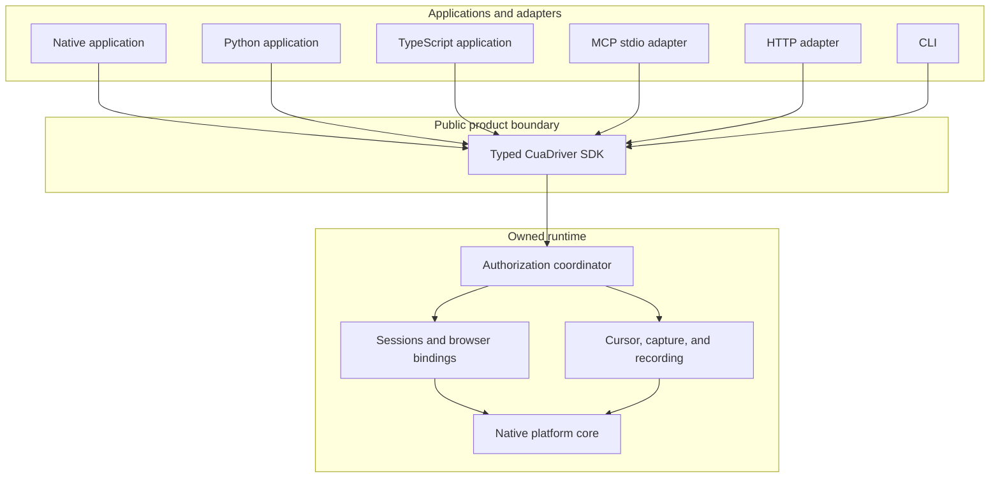
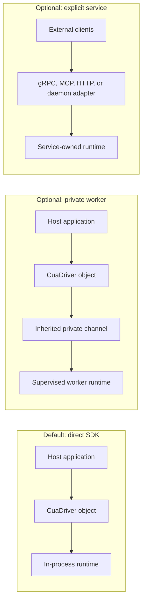
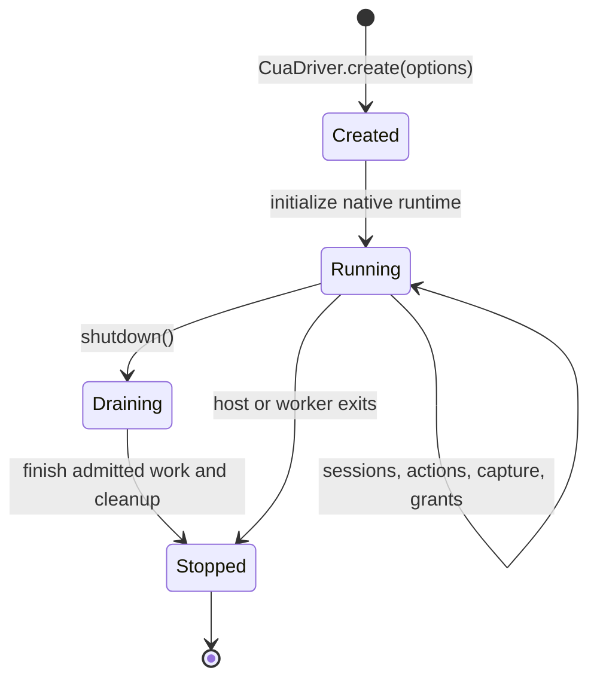
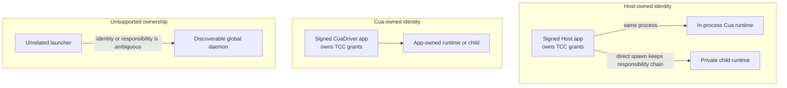
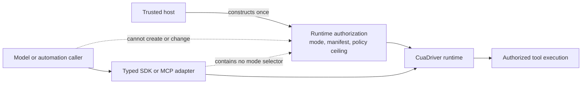
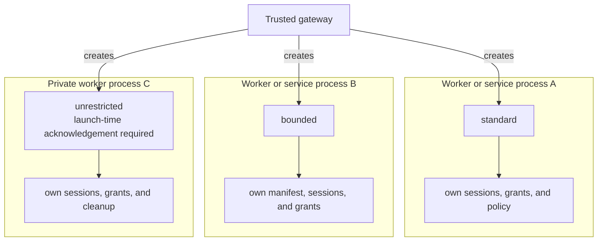
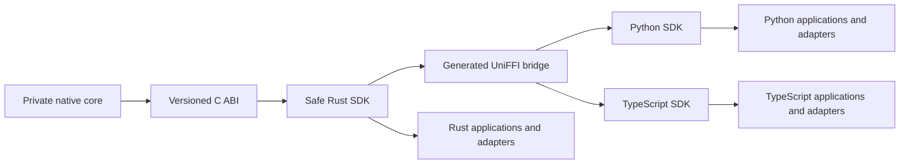
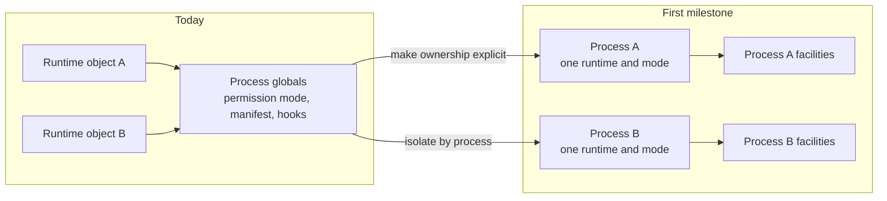
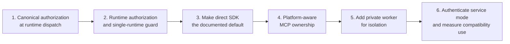

# Cua Driver SDK-First Runtime North Star

**Status:** Draft for architecture discussion

**Direction:** Make the typed SDK and its owned native runtime the product
boundary. Keep daemon and server topologies as optional adapters.

**RFC:** [RFC 2549](../../../rfcs/2549-cua-driver-sdk-owned-runtime.md)

**Supersedes:** [RFC 2447](../../../rfcs/2447-cua-driver-native-core-and-mcp-adapter.md)

**Related:**
[permission adapters and session modes](permission-adapters-and-session-modes-plan.md),
[#2385](https://github.com/trycua/cua/issues/2385), and
[#2437](https://github.com/trycua/cua/issues/2437).

## Decision at a glance

Cua Driver is a stateful native runtime exposed through typed SDKs. An
application creates the runtime, uses it, and shuts it down. MCP, HTTP, a
private worker, and a long-lived daemon can expose that runtime when a consumer
needs a transport or process boundary.

The daemon remains supported, but it stops defining the application contract.
The migration preserves the released CLI, MCP, Rust, Python, and TypeScript
interfaces. Runtime ownership may change behind them only after compatibility
and behavior-parity gates pass.

The runtime and public SDK stay transport-free. gRPC, MCP, HTTP, local sockets,
and environment forwarding carry generated Driver envelopes outside the core.

## One contract, several topologies

The topology changes ownership and isolation. It does not change tool
semantics, authorization, results, or generated SDK types.

| Need | Preferred topology |
| --- | --- |
| One application owns automation | Direct SDK |
| The host wants native crash containment | Private supervised worker |
| An MCP client owns one stdio process on Windows or Linux | MCP adapter with its own runtime |
| Standalone installed MCP runs on macOS | CuaDriver.app-owned service runtime |
| Several external clients must share state | Explicit service or daemon |
| CuaDriver.app must own a stable macOS permission identity | App-owned runtime or child |
| Short-lived scripts need persistent shared state | Explicit service or daemon |

## Daemonless still means stateful

The runtime owns state until its SDK object shuts down. Removing the required
daemon does not turn tools into independent stateless functions.

The runtime owns:

- session and browser-binding state;
- permission mode and bounded manifest;
- consent grants, indicators, and revocation;
- cursor overlays where the topology provides a main-thread owner, plus
  capture and recording;
- platform threads and event loops;
- cleanup for shutdown, expiry, and host death.

## Compatibility is a hard constraint

The architecture is not permission to disrupt current users. The CLI keeps its
commands, defaults, flags, socket behavior, platform identity, exit codes, and
machine-readable output. The SDKs keep `create`, `connect`, typed operation
names, package exports, result envelopes, structured errors, and lifecycle
behavior.

Private-worker options and new runtime configuration are additive. Changing a
released interface or an observably different default requires a separate
compatibility decision and the appropriate semantic-versioning release.
Browser-use improvements can continue shipping on the current daemon-backed
CLI while the SDK-owned refactor proceeds behind these gates.

## macOS TCC ownership

TCC needs a stable responsible process. It does not require a global socket
daemon.

The host must load the runtime directly or spawn its private worker without
breaking the macOS responsibility chain. CuaDriver.app can own the identity for
standalone use. LaunchServices handoffs remain outside the supported embedding
contract, but standalone installed MCP may use LaunchServices to reach
CuaDriver.app and preserve its stable TCC identity.

Direct permission checks are read-only. The embedding host owns permission UX
and any restart required after Accessibility or Screen Recording grants
change.

## Permission modes belong to runtimes

The trusted host chooses an immutable authorization configuration when it
creates a runtime. Agent-visible tools and session IDs cannot select or widen
that configuration.

An unrestricted runtime suppresses Cua approval prompts only. Managed policy,
user policy, hard invariants, TCC, resource ownership, revocation, and cleanup
still apply.

## Mixed trust uses separate runtime-owner processes

A gateway can host several authorization modes without teaching one shared
daemon to delegate authority through caller-selected sessions. The first
milestone permits one direct runtime per process, so each mode has a separate
private worker or authenticated service process.

An unrestricted runtime co-hosted with standard or bounded work always uses a
separate process. Multiple in-process runtimes are a possible later
optimization after every process-global facility has been isolated. They are
not the initial gateway mechanism or a boundary against arbitrary host code.

## Generated SDK direction

The generated SDKs carry one typed contract into each supported language.
Transports consume this contract instead of defining a second one.

MCP stdio can create and own `CuaDriver` directly on Windows, Linux, and
embedded macOS paths. Standalone installed macOS MCP keeps the signed
CuaDriver.app service identity by default. It does not add a second proxy layer
unless the deployment asks for service ownership or shared state.

Remote applications use the same generated SDK through an internal remote
connection backend. The backend exchanges generated Driver envelopes through a
minimal authenticated channel. gRPC may implement that channel, but it does not
become the native core, public SDK contract, or a second tool vocabulary.

## Explicit single-runtime ownership is the first refactor

The current implementation still has process-global authorization and platform
state. The first milestone makes one direct runtime per process explicit and
moves generation-scoped authorization and resource ownership behind that
runtime. Complete same-process multi-runtime isolation is later work.

State that must become runtime-owned includes:

- permission mode and unrestricted acknowledgement;
- bounded manifest;
- authorization context and policy view;
- consent provider and grant broker;
- session registry and teardown hooks;
- browser bindings and resource ownership;
- mutable platform callbacks that currently assume one runtime.

Shared process facilities must be read-only, synchronized, or represented by
an explicit process coordinator. A second direct runtime returns a structured
conflict until those facilities can no longer merge authority.

## Migration path

### Current work under this direction

- PR #2542 remains necessary. Every topology needs canonical authorization at
  runtime dispatch and an honest enforcement-adapter inventory.
- PR #2545 should remain a foundation draft until its types are evaluated
  against runtime-owned authorization. Keep its effective authorization and
  mode-ceiling concepts; freeze connection leases and delegated-session
  binding until an authenticated service consumer requires them.
- Issue #2437 is narrowed, not replaced. Separate runtime-owner processes meet
  the current gateway need with less authority plumbing. A future shared
  service may still need delegation after connection authentication exists.
- Issue #2385 remains topology-independent. Each sensitive capability still
  needs a scoped enforcement adapter before Cua can claim active protection.

## Invariants

These are target-state requirements. The compatibility daemon must meet the
service-authentication invariant before it is presented as a mixed-trust
service.

1. The typed SDK is the only application contract.
2. Direct SDK, worker, MCP, HTTP, and daemon paths produce the same behavior.
3. Each runtime receives immutable authorization at construction.
4. No public tool, session ID, metadata field, environment value controlled by
   the caller, or reconnect request can widen authority.
5. Runtime shutdown drains admitted work and revokes owned resources.
6. A private worker dies with its host and exposes no reusable public endpoint.
7. macOS permission status names the responsible signed application.
8. Unrestricted mode changes prompt behavior but does not bypass policy or OS
   security.
9. One direct runtime is allowed per process until shared facilities pass a
   separate isolation gate.
10. Browser and CDP bindings do not migrate between runtime generations.
11. Every service endpoint authenticates its peer; endpoint location is not
    identity.
12. Released CLI, MCP, and SDK interfaces remain compatible across topology
    changes.
13. gRPC and other remote protocols remain adapters outside the native runtime
    and typed application contract.
14. The daemon remains available only where a service topology earns its
    operational cost.

## Exit criteria

The SDK-first architecture is ready to become the default when:

- direct Rust, Python, and TypeScript SDK tests exercise the same typed
  operations and error contract;
- CLI help, subcommand, flag, exit-code, JSON, and MCP-schema fixtures remain
  compatible;
- Python and TypeScript export and signature snapshots remain compatible with
  the previous supported release;
- representative applications written against the previous supported SDK
  release run without source changes;
- a second direct runtime returns a structured conflict;
- different modes run in separate runtime-owner processes without sharing
  authority;
- Windows and Linux MCP stdio can own a runtime without opening a daemon
  socket;
- shutdown, host death, cancellation, and in-flight side effects have tested
  outcomes;
- macOS tests prove embedded host-owned and standalone CuaDriver.app-owned TCC
  attribution;
- private-worker tests prove parent-liveness cleanup and generation isolation;
- direct macOS overlays use a certified main-thread adapter or report
  structured unavailability;
- local and remote service endpoints reject unauthenticated peers;
- browser bindings, recordings, overlays, and grants remain generation-scoped;
- compatibility telemetry shows which consumers still need `connect()` and the
  long-lived daemon.

## Open decisions

- Which platform services can safely remain process-global?
- Does the private worker use the stable C ABI directly or a narrow inherited
  control channel above the SDK?
- How long should `CuaDriver.connect()` remain a supported compatibility path?
- Which existing daemon administrative tools need typed SDK replacements?
