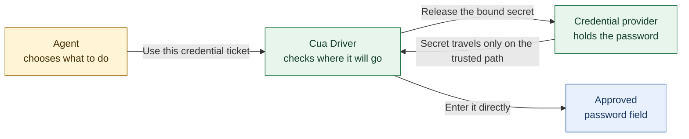
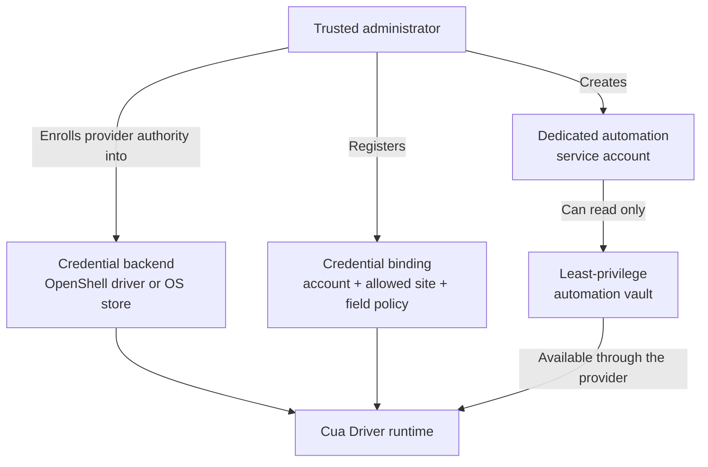
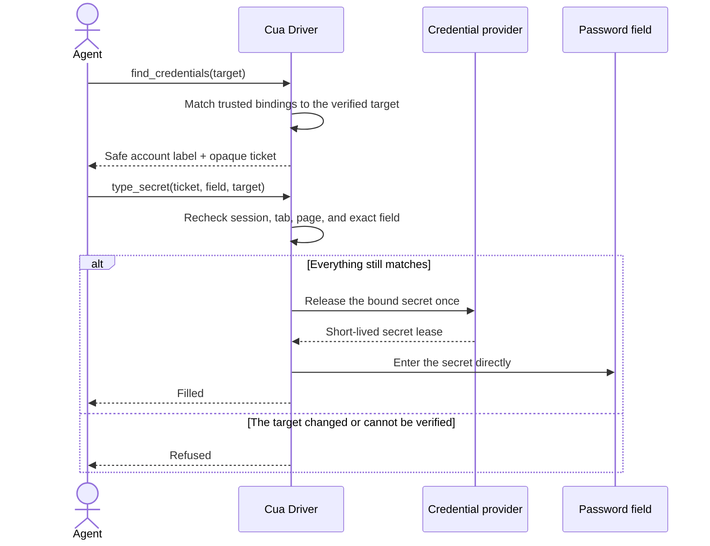
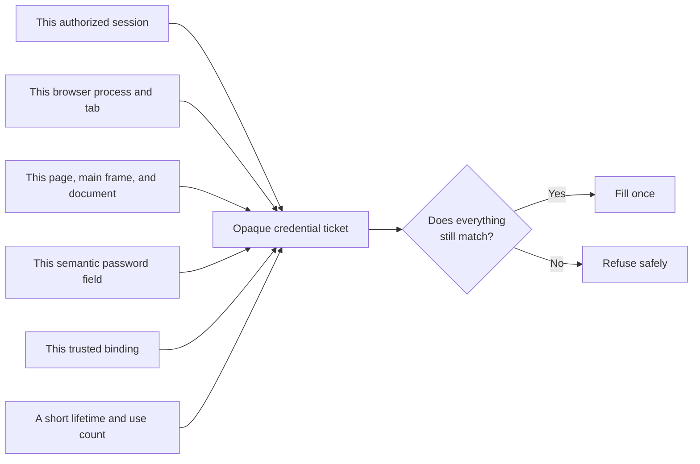
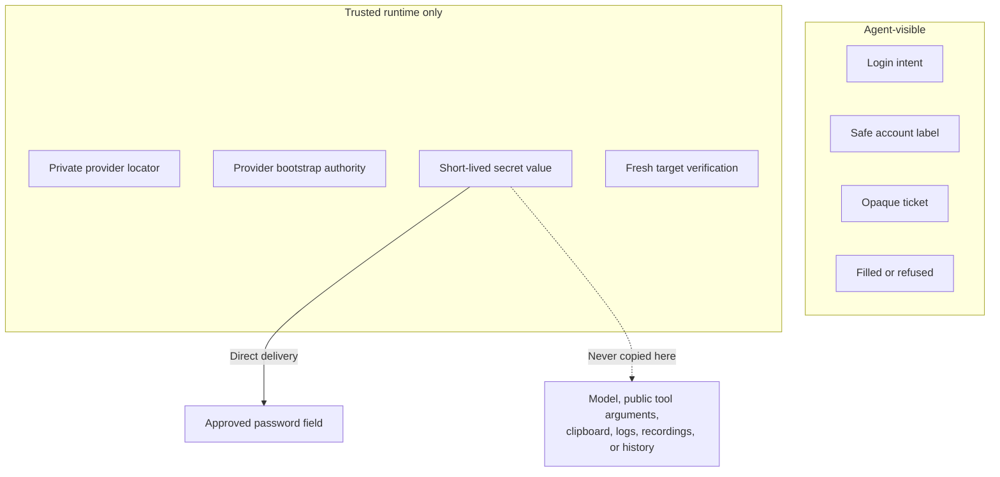
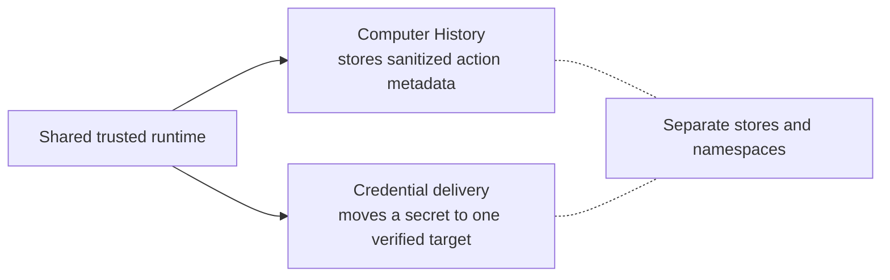
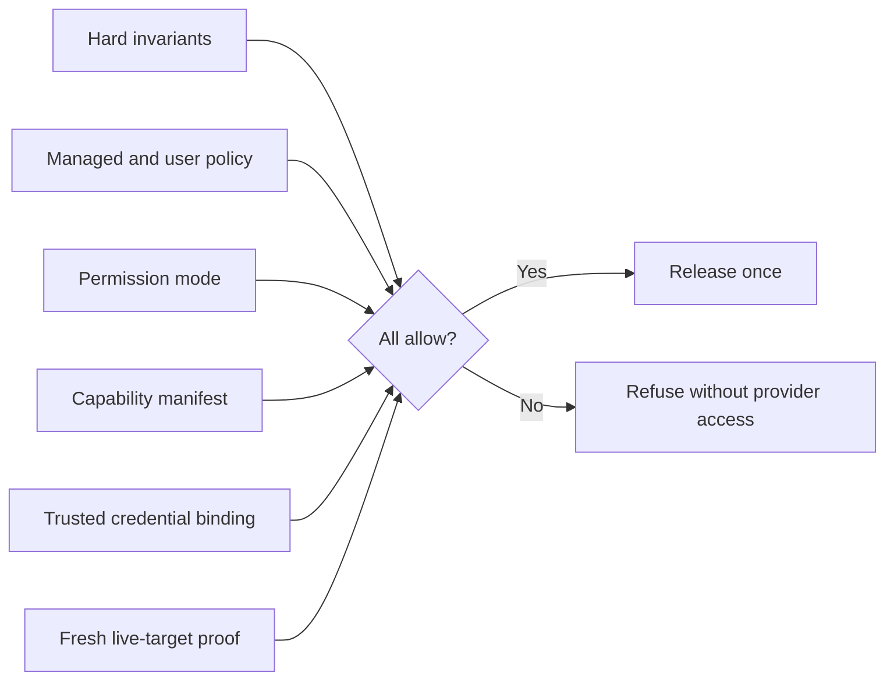
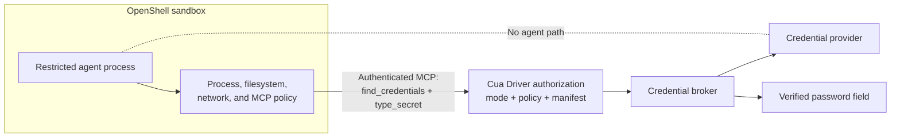
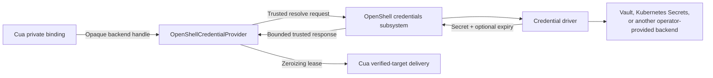

# Target-bound credential delivery architecture

This document is a diagram-first companion to
[RFC 2942](../../../rfcs/2942-cua-driver-secret-reference-typing.md). It
explains how Cua Driver can use a credential without giving the credential to
the agent, how the design fits Cua Driver's permission model, and which parts
should follow NVIDIA OpenShell and established security standards.

This is an architecture document, not an availability statement. Version one
is intentionally limited to a trusted host, standalone Chrome or Edge, and a
semantic password input in the main frame.

## The decision

The agent controls the login intent. The trusted runtime controls the
credential, authorization, destination, and delivery.



The agent sees a safe account label, an opaque ticket such as `ch-...`, and a
fixed result. It does not see the secret, a provider locator, or a provider
bootstrap token.

## One-time setup

A trusted administrator configures the provider and decides where each
credential may be used.



For a service such as 1Password, the recommended setup is a dedicated service
account with read-only access to a separate automation vault. Provider
authority belongs in an OpenShell credential driver, platform credential
store, or another trusted host-only backend. It does not belong in an agent
prompt, public MCP configuration, shell command, or model-visible environment
variable.

This setup supports unattended use because the service account is already
authorized. It does not let an agent unlock a person's vault, bypass MFA,
approve a passkey, or bypass provider-required user presence.

## One login attempt

The agent first discovers a suitable credential for the verified destination.
Cua Driver returns a short-lived ticket that is already tied to that
destination. The agent then asks Cua Driver to use the ticket in the password
field.



Cua Driver does not submit the form. Submission remains a separate action with
its own authorization and consequence checks.

## What the ticket is bound to



Navigation, a replaced field, a different tab, runtime restart, expiration,
revocation, or an earlier use can invalidate the ticket. Cua Driver checks
again immediately before delivery instead of trusting an earlier observation.

## What crosses each boundary



Computer History may reuse authorization, lifecycle, revocation, and audit
machinery, but it remains a separate data path with a separate credential-store
namespace.



## Fit with the Cua Driver permission model

The design fits the existing model well because secret release is a new
protected resource, not a special case of ordinary text input.

The effective decision remains an intersection:



The candidate implementation applies these boundaries:

| Operation                          | Classification                               | Current behavior                                                                                                                                              |
| ---------------------------------- | -------------------------------------------- | ------------------------------------------------------------------------------------------------------------------------------------------------------------- |
| `find_credentials`                 | R2 private observation                       | Matches only trusted host-registered bindings after the browser target is verified. It returns safe descriptors and fresh opaque handles.                     |
| `type_secret`                      | R3 browser-bound input plus `secret_release` | Requires both the exact browser-bound input route and the distinct secret-release resource. Generic typing authority does not imply secret-release authority. |
| `secret_release` in `standard`     | Denied in version one                        | A future protected grant can enable interactive use, but an agent or an outer policy layer cannot manufacture that grant.                                     |
| `secret_release` in `bounded`      | Manifest required                            | The approved manifest must allow secret release and name the exact trusted authorization identifier and canonical origin.                                     |
| `secret_release` in `unrestricted` | No Cua prompt                                | Trusted launch acknowledgement removes the prompt, but hard checks, target proof, revocation, and managed or user policy denials remain effective.            |

This is the right shape for unattended automation. `bounded` is the preferred
mode: the manifest grants one named binding authorization at one or more exact
origins, while the runtime still binds every minted handle to a specific live
tab, document, and password node.

The main permission-model gap is intentional. Version one has no protected
consent adapter for `standard`, so `standard` refuses secret release instead of
reusing a generic input grant. Later standard-mode support should add an
operation-specific trusted-host decision. It should not weaken `type_secret`
to R1, inherit authorization from `type_text`, or accept a model-supplied
confirmation flag.

## OpenShell as the standard outer runtime

For unattended agents, treat NVIDIA OpenShell as the standard outer execution
and policy boundary. Cua Driver remains the inner GUI authorization and target
delivery boundary.



The layers have different jobs and should both authorize the request:

| Boundary           | OpenShell owns                                                                               | Cua Driver owns                                                                                                 |
| ------------------ | -------------------------------------------------------------------------------------------- | --------------------------------------------------------------------------------------------------------------- |
| Agent execution    | Restricted process identity, filesystem access, network egress, and sandbox lifecycle        | No duplicate sandbox implementation                                                                             |
| MCP admission      | Destination and protocol enforcement, plus an allowlist for MCP methods and tool names       | Canonical tool schema, authorization, and operation semantics                                                   |
| Caller identity    | Sandbox workload identity and authenticated gateway-supervisor relationship                  | Binding that authenticated connection to one immutable Cua authorization context                                |
| Credential backend | Credential-driver handles, backend-specific storage, rotation, deletion, and optional expiry | Provider-neutral release planning and a short-lived secret lease for the selected field                         |
| GUI target         | No live browser element proof                                                                | Browser process, endpoint generation, tab, frame, origin, document, semantic ref, and secure-field verification |
| Audit              | Sandbox, network, policy, and credential-safe OCSF events                                    | Content-free action and delivery outcomes without target or secret-derived data                                 |

OpenShell supports Streamable HTTP MCP policy that can allow individual
`tools/call` tool names. A deployment can permit only the Cua credential tools:

```yaml
network_policies:
  cua_driver_mcp:
    endpoints:
      - host: cua-driver.example.test
        port: 443
        path: /mcp
        protocol: mcp
        enforcement: enforce
        rules:
          - allow:
              method: initialize
          - allow:
              method: notifications/initialized
          - allow:
              method: tools/call
              tool: find_credentials
          - allow:
              method: tools/call
              tool: type_secret
```

Add `tools/list` only when the client needs runtime discovery. Do not use
`mcp.allow_all_known_mcp_methods: true` for this narrow bridge.

Two OpenShell limitations make Cua's inner checks necessary:

- OpenShell's MCP policy matches method and tool name, but it does not yet
  authorize `tools/call` arguments. It cannot prove the requested origin,
  handle, tab, or semantic field.
- OpenShell does not currently inspect MCP server response bodies for policy
  enforcement. Cua Driver must keep every public response secret-free by
  construction.

The OpenShell MCP policy applies to Streamable HTTP traffic that crosses its
proxy. Local stdio MCP does not provide that network boundary. The standard
deployment for this feature should therefore use authenticated Streamable
HTTP or an equivalently authenticated host bridge from the sandbox to the
trusted Cua runtime. A same-user socket plus a caller-selected session label is
not enough.

## Reuse OpenShell credential drivers without exposing them

OpenShell's internal `CredentialDriver` contract already defines capabilities,
opaque handles, storage, resolution, deletion, optional listing, and optional
expiration. Cua should align provider integrations with those semantics instead
of building another general-purpose secret store.

A future `OpenShellCredentialProvider` can implement Cua Driver's internal
`CredentialProvider` trait through a trusted gateway or host-broker route:



The raw OpenShell credential-driver RPC is gateway-internal and must not become
an agent tool. OpenShell environment placeholders are useful for inspected
network requests, but they should not become Cua credential tickets. Cua
tickets are minted only after live target discovery and carry Cua-specific
session and target binding.

Network credentials should stay on OpenShell's existing endpoint-bound
injection or signing path. Use Cua target-bound delivery only for a browser or
native UI credential field that has no safer protocol-level authentication
route.

## Standards to reuse

Most of the system should be assembled from existing standards and proven
patterns.

| Concern                    | Reuse                                                                                                                        | Do not invent                                         |
| -------------------------- | ---------------------------------------------------------------------------------------------------------------------------- | ----------------------------------------------------- |
| Agent isolation and egress | OpenShell supervisor, policy proxy, filesystem/process restrictions, and default-deny network policy                         | A second sandbox or network proxy inside Cua Driver   |
| Tool-level outer policy    | OpenShell `protocol: mcp` rules for `initialize`, `tools/list`, and selected `tools/call` names                              | A separate outer tool-filter protocol                 |
| MCP authentication         | MCP's HTTP authorization profile based on OAuth 2.1 and Protected Resource Metadata                                          | A Cua-specific login or bearer-token discovery scheme |
| Workload identity          | SPIFFE/SPIRE SVIDs where available: JWT-SVIDs for OpenShell token grants and X.509-SVIDs for mTLS                            | Long-lived shared agent secrets                       |
| Service token exchange     | OAuth 2.0 Token Exchange, short lifetimes, narrow audience, and sender-constrained tokens with mTLS or DPoP where supported  | A custom delegation-token format                      |
| Secret storage             | OpenShell credential drivers, provider-native vaults, and platform credential stores                                         | A Cua password database                               |
| Policy language            | Existing Cua YAML/Rego and OpenShell OPA policy at their respective boundaries                                               | A third general policy language                       |
| Security events            | OCSF-compatible outer-runtime events plus Cua's fixed content-free action outcomes                                           | Secret-bearing free-form audit logs                   |
| Cryptographic credentials  | WebAuthn/passkeys, OAuth, provider-owned signing, or PKCS #11-style non-exportable operations when the service supports them | Password typing when a stronger protocol is available |

The opaque ticket and short-lived lease follow the same proven principle used
by signing agents and hardware-token APIs: the caller receives a capability to
request one bounded operation, not the protected value itself. Those systems
do not provide a GUI password-fill API, but they validate the non-exportable
capability pattern.

## What remains Cua-specific

There is no general cross-platform standard that binds a password-manager
secret to a live GUI element and then proves that the intended element received
the mutation without returning the secret to the automation client. Cua Driver
still needs to own this narrow layer:

- live browser process, endpoint, tab, main-frame, document, origin, and
  semantic-node identity;
- secure-field classification and refusal of generic or pixel-only targets;
- single-use handles bound to the runtime and lifecycle generation;
- provider cancellation, timeout, and zeroizing lease lifecycle;
- direct target delivery without clipboard, generic `type_text`, or plaintext
  readback;
- fixed `filled`, `misdirected`, `unverified`, and refusal outcomes; and
- secret-free recordings, overlays, telemetry, diagnostics, and public tool
  responses.

This is not a new vault, identity system, or sandbox. It is a GUI-specific
secret sink behind existing provider, policy, identity, and storage systems.

## Recommendation

Adopt the following architecture:

1. Use OpenShell as the standard runtime for unattended agents.
2. Expose Cua Driver through authenticated Streamable HTTP MCP or an
   equivalently authenticated bridge, with OpenShell allowing only the exact
   Cua tools needed by the task.
3. Keep Cua Driver's canonical authorization as a second, mandatory decision.
   OpenShell allow and Cua allow compose with `AND`, never `OR`.
4. Use `bounded` mode and a reviewed capability manifest for unattended
   credential release. Keep version-one `standard` denial until a protected
   trusted-host grant exists.
5. Align credential providers with OpenShell `CredentialDriver` semantics and
   existing vault or OS backends. Do not expose driver resolution RPCs to the
   agent.
6. Prefer OAuth, workload identity, passkeys, provider-owned fill, or
   protocol-level credential injection whenever available. Use `type_secret`
   only for the remaining GUI field.
7. Keep `find_credentials` and `type_secret` as distinct tool names so
   OpenShell and Cua policy can grant discovery and delivery independently.
8. Correlate OpenShell and Cua audit decisions with opaque, content-free
   identifiers. Never copy provider handles, Cua tickets, target IDs, secret
   lengths, or values into audit events.

## References

- [RFC 2942: Cua Driver target-bound credential delivery](../../../rfcs/2942-cua-driver-secret-reference-typing.md)
- [Cua Driver permission modes](driver-permission-modes-and-consent-plan.md)
- [Cua Driver SDK-owned runtime and optional services](../../../rfcs/2549-cua-driver-sdk-owned-runtime.md)
- [NVIDIA OpenShell architecture](https://github.com/NVIDIA/OpenShell/blob/main/architecture/README.md)
- [NVIDIA OpenShell security policy](https://github.com/NVIDIA/OpenShell/blob/main/architecture/security-policy.md)
- [NVIDIA OpenShell policy schema](https://github.com/NVIDIA/OpenShell/blob/main/docs/reference/policy-schema.mdx)
- [NVIDIA OpenShell credential-driver contract](https://github.com/NVIDIA/OpenShell/blob/main/proto/credential_driver.proto)
- [Model Context Protocol authorization](https://modelcontextprotocol.io/specification/2025-11-25/basic/authorization)
- [SPIFFE concepts and Workload API](https://spiffe.io/docs/latest/spiffe-about/spiffe-concepts/)
- [RFC 8693: OAuth 2.0 Token Exchange](https://www.rfc-editor.org/rfc/rfc8693)
- [RFC 8705: OAuth 2.0 Mutual-TLS Client Authentication and Certificate-Bound Access Tokens](https://www.rfc-editor.org/rfc/rfc8705)
- [RFC 9449: OAuth 2.0 Demonstrating Proof of Possession](https://www.rfc-editor.org/rfc/rfc9449)
- [Web Authentication Level 3](https://www.w3.org/TR/webauthn-3/)
- [PKCS #11 Cryptographic Token Interface](https://docs.oasis-open.org/pkcs11/pkcs11-spec/v3.2/os/pkcs11-spec-v3.2-os.html)
- [Open Cybersecurity Schema Framework](https://schema.ocsf.io/)
