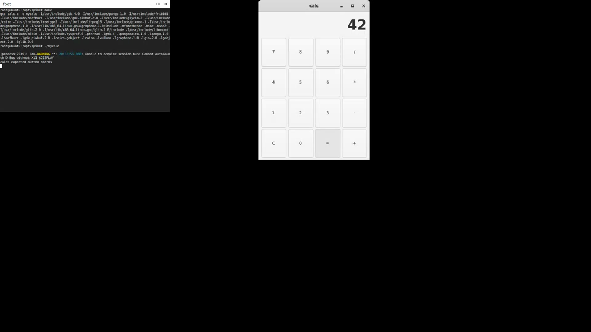

# Demo — code a Linux app, compile it in a terminal, run it, and use it

End-to-end agent-style session driven entirely through **libei → EIS server →
background injection** (no real input devices, no focus stealing). Adds
**keyboard** injection on top of the pointer work in the parent spikes.




▶️ **`videos/terminal-compile-run-use.webm`**

What the video shows, all via injected input:

1. A **foot** terminal (left). The driver **types `make`** (keyboard injection) →
   `gcc calc.c -o mycalc …` runs and **compiles the app**.
2. The driver **types `./mycalc`** → the GTK4 **calculator** launches (right).
3. The driver **clicks `7 × 6 =`** (pointer injection) → the calculator computes
   and displays **42**.

Keyboard goes to the terminal window, pointer to the calculator window — two
different windows, routed by device index in the compositor; neither is focused
or raised by a real seat.

## Pieces

| File | Role |
|---|---|
| `calc.c` | The app being built/used: a real GTK4 calculator. Also exports each button's on-screen center to `/tmp/calc_coords.txt` (stands in for an a11y tree). Repaints on a timer so a screen recorder always captures the latest state. |
| `type_use.c` | The driver (libei client): binds a virtual **keyboard** + **absolute pointer**, types `make` / `./mycalc` into the terminal, then clicks `7 * 6 =` on the calculator. |
| `phase_e_patch.py` | The EIS-server compositor (patched tinywl): adds **keyboard injection** — builds an xkb keymap (memfd), advertises a keyboard device, and sends `wl_keyboard` keymap/enter/key to the target window — alongside the pointer routing. Device `i` → window `i` (keyboard→terminal, pointer→calc). |
| `Makefile`, `run_termdemo.sh` | Build rule the demo's `make` runs; orchestration (launch terminal, record with `wf-recorder`, run the driver). |

## How keyboard injection works

The compositor creates an xkb keymap, writes it to a `memfd`, and exposes a
virtual keyboard device over EIS (`eis_device_new_keymap`). The libei client
sends evdev keycodes (`ei_device_keyboard_key`); the compositor forwards them as
`wl_keyboard.key` to the target client's keyboard resource — after a one-time
`wl_keyboard.keymap` + `enter` + `modifiers(0)` — bypassing `wlr_seat` focus, the
same pattern as the pointer path. The commands here use only lowercase + `.` `/`
so no modifier handling is needed yet (shift/symbols are future work).

## Run

```bash
../wayland-bg-input-phase-a/provision.sh      # build deps + libei/libeis
sudo apt-get install -y foot
# build calc.c -> calc once (or let the demo's `make` do it), build tinywl_e + type_use
# (see phase_e_patch.py header + run_termdemo.sh), then:
WLR_BACKENDS=headless WLR_RENDERER=pixman WLR_HEADLESS_OUTPUTS=1 \
CUA_NDEV=2 CUA_NKBD=1 CUA_COLS=2 CUA_CELLW=840 CUA_CELLH=700 \
CUA_EIS_SOCKET=$XDG_RUNTIME_DIR/cua-eis-0 \
  ./tinywl_e -s 'bash run_termdemo.sh'
# -> /tmp/demo_term.webm
```

## Still a spike

Compositor is tinywl; device→window mapping is positional; keyboard is
lowercase/no-modifiers; targets are real apps (foot, GTK4) but the click/type
sequence is scripted (a stand-in for cua-driver's planner). Same remaining work
as the parent spikes (labwc port, real addressing, modifiers, `reis`).
