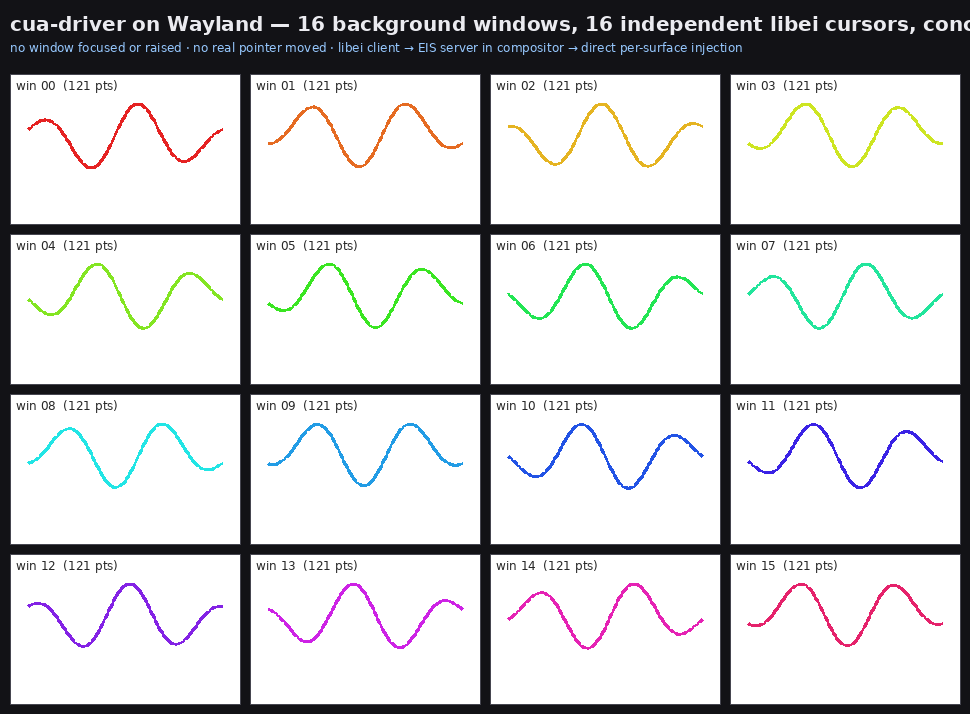

# Phase B — coordinate-accurate, multi-cursor, per-window routing (the demo)

Evolves [Phase A](../wayland-bg-input-phase-a/) from "click all unfocused
windows at center" into the real thing: **N independent libei cursors, each
driving a distinct background window along its own coordinate-accurate path**,
with correct `enter`/`leave`/`motion` bookkeeping — i.e. the mechanics of the
16-window cursive multi-cursor demo.



Each tile is one **background** window's view of the pointer path it received.
16 windows, 16 libei devices (one per "session"), all drawn **concurrently**,
none focused or raised, with no real pointer moved.

## What changed vs Phase A

- The EIS server creates **N virtual absolute-pointer devices** (`CUA_NDEV`,
  default 16), each tagged with an index via `eis_device_set_user_data`.
- Device `i` routes to **toplevel `i`** (`cua_toplevel_by_index`); its absolute
  coordinates map to that window's **surface-local** space (`geometry` offset).
- **`enter`/`leave` is tracked per device** (`cua_dev[idx].entered`): `enter` is
  sent once when the target surface changes (with a `leave` of the previous
  one), then a clean `motion` stream — fixing the back-to-back-enter protocol
  violation Qt flagged in the spike. Drags (button-down → motion path →
  button-up) therefore render as a single continuous stroke.

## Verified end-to-end (headless VM, wlroots 0.19)

```
CLIENT: connected, want 16 devices → 16 devices resumed → drew 16 concurrent cursive strokes
win00..win15: enter=1  motion=121      (all 16/16 windows, one clean stroke each)
```

Path: libei client → direct socket → EIS server in the compositor → per-device
surface-local `wl_pointer` injection into 16 unfocused windows. No portal, no
real input device, no global cursor, no focus change, no raise.

## Files

| File | Purpose |
|---|---|
| `tinywl.eis-multicursor.patch` / `phase_b_patch.py` | EIS server with N-device, per-window, coordinate-accurate routing + enter/leave bookkeeping. |
| `ei_client_b.c` | libei client: binds N abs-pointers and traces one cursive stroke per device, concurrently. |
| `render_demo.py` | Renders each window's received path into the montage above. |
| `run.sh` | One-shot: build + run (N=`CUA_NDEV`) + render. |
| `cursive_montage.png` | The rendered demo. |

## Run

```bash
../wayland-bg-input-phase-a/provision.sh         # once per (ephemeral) VM boot
sudo apt-get install -y python3-pil fonts-dejavu-core
./run.sh                                         # CUA_NDEV=16 by default
# -> /tmp/cursive_montage.png
```

## Still a spike — what's left for the product

- **Targets are `wev`** (raw clients that log the received path); the visual is
  rendered from those logs. Toolkit acceptance (GTK4/Qt6/Chromium) is already
  proven in Spike 0 — combine the two for in-app ink.
- **Device→window mapping is positional** (`device i → toplevel i`). The product
  needs real addressing (by foreign-toplevel handle / app) so a cua-driver
  session targets a chosen window.
- **Keyboard, scroll, real coordinate source** (currently a synthetic cursive
  curve) and **per-session agent-cursor overlays** are not wired.
- Compositor is still **tinywl**; port to a vendored **labwc** fork, and drive
  it from cua-driver's `platform-linux` via the `reis` crate.
