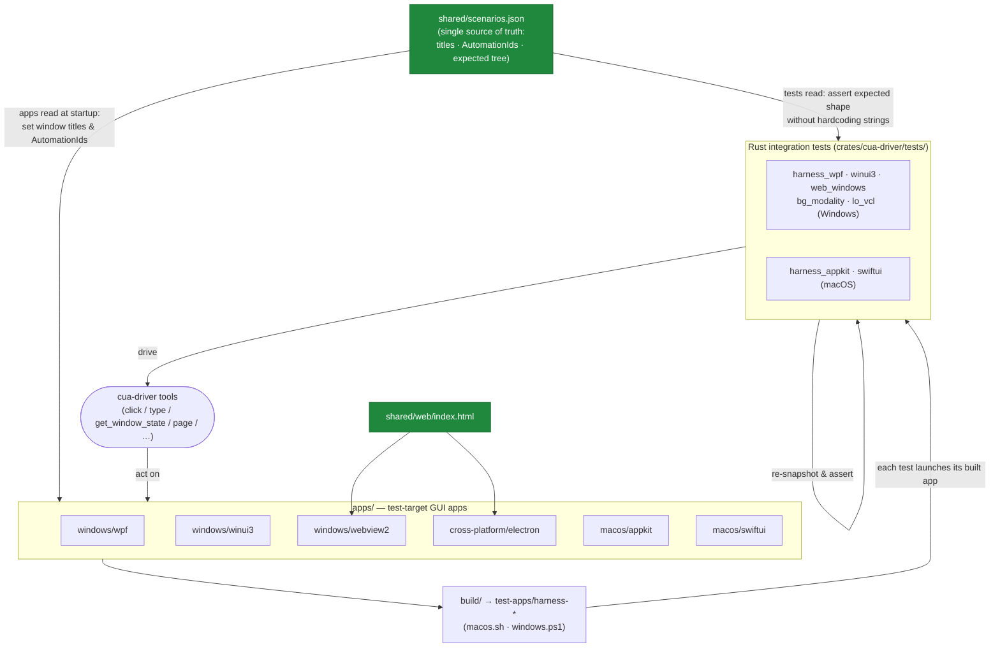

# cua-driver test harnesses — how they're structured

The harness is built around **one principle**: a single source of truth (`shared/scenarios.json`) that both the **test apps** and the **Rust integration tests** read, so they can never drift. The directory tree itself encodes *which app runs on which OS* and *what's shared* (this layout landed in #1727).

## Directory layout

```
libs/cua-driver/test-harness/
│
├── shared/                       ◀── cross-OS single source of truth
│   ├── scenarios.json            #   defines every app + scenario (titles, AutomationIds,
│   │                             #   expected tree shape). Read by BOTH the apps and the tests.
│   └── web/index.html            #   the page WebView2 AND Electron both load
│
├── apps/                         ◀── the test-target GUI apps, grouped by where they run
│   ├── cross-platform/
│   │   └── electron/             #   main.js · package.json        (Win / macOS / Linux)
│   ├── macos/
│   │   ├── appkit/               #   main.swift                    (macOS)
│   │   └── swiftui/              #   main.swift                    (macOS)
│   └── windows/
│       ├── wpf/                  #   WPF: MainWindow, Owned/Layered popups,
│       │                         #        NativeButtonHost, Scenarios.cs   (Windows)
│       ├── winui3/               #   WinUI3: App, MainWindow, Program.cs    (Windows)
│       └── webview2/             #   WebView2 host (WPF) → loads shared/web  (Windows)
│
├── build/                        ◀── host-OS build scripts
│   ├── macos.sh                  #   swiftc the macOS apps + electron
│   └── windows.ps1               #   dotnet publish the .NET apps + electron
│
├── smoke/                        ◀── per-tool CLI smoke runner + baseline
│   ├── macos.sh
│   └── results/macos.txt
│
├── CuaTestHarness.sln            #   .NET solution tying the Windows apps together
└── README.md

libs/cua-driver/rust/crates/cua-driver/tests/   ◀── the CONSUMERS (Rust integration tests)
│   (all build on the cua-driver-testkit crate; named by 4-family taxonomy —
│    harness_ / modality_ / protocol_ / guard_. See TEST_SUITE.md.)
├── harness_wpf_test.rs           (Windows)
├── harness_winui3_test.rs        (Windows)
├── harness_web_test.rs           (Windows — WebView2 + Electron via CDP)
├── harness_libreoffice_test.rs   (Windows — LibreOffice VCL/SAL via MSAA)
├── harness_appkit_test.rs        (macOS)
└── harness_swiftui_test.rs       (macOS)
    (the focus-steal sentinel + deprecated capture_mode compatibility tests now live under
     modality_background_test.rs — see TEST_SUITE.md for the full inventory)
```

## How the pieces connect



The loop per test: **launch the built app → read `scenarios.json` for the expected shape → drive cua-driver against the app → re-snapshot and assert.** Because both sides read the same `scenarios.json`, a changed AutomationId or title updates the apps and the assertions together.

## Coverage matrix

| App (`apps/…`) | OS | `scenarios.json` key | What it exercises | Rust test(s) |
|---|---|---|---|---|
| `windows/wpf` | Windows | `wpf` | UIA Invoke, PostMessage type, right/double-click, scroll, modal MessageBox, owned + layered popups, native child HWNDs, accelerators | `harness_wpf_test`, `modality_background_test` |
| `windows/winui3` | Windows | `winui3` | UIA ValuePattern text, CommandBarFlyout, XAML Popup primitive | `harness_winui3_test` |
| `windows/webview2` | Windows | `webview` | Chromium DevTools Protocol (CDP) `page` tool over the shared web page | `harness_web_test` |
| `cross-platform/electron` | Win / macOS / Linux | `electron` | CDP `page` tool over the shared web page | `harness_web_test` (+ macOS) |
| `macos/appkit` | macOS | `appkit` | AX tree, NSButton AXPress, NSTextField, NSScrollView, NSMenu | `harness_appkit_test` |
| `macos/swiftui` | macOS | `swiftui` | AX tree, SwiftUI `.popover()` (separate AXWindow) | `harness_swiftui_test` |
| *(LibreOffice — not a harness app)* | Windows | — | VCL/SAL SplitButton, modal dialogs, color picker via MSAA fallback | `harness_libreoffice_test` |
| *(WPF + focus sentinel)* | Windows | `wpf` | background-modality / no-focus-steal sentinel + `capture_mode` (deprecated/ignored) | `modality_background_test` |

## Runtime requirements (why CI coverage is uneven)

- **Linux** (Electron via CDP, plus the Nix GUI scenarios) → runs **headless in CI** (Xvfb / NixOS VMs on `ubuntu-latest`).
- **Windows** (WPF / WinUI3 / WebView2 / bg-modality) and **macOS** (AppKit / SwiftUI) → need a **real interactive desktop** (UIA / AX / SendInput / z-order / TCC), so they need self-hosted runners; they're not in CI today.

## TL;DR

- **`shared/scenarios.json` is the contract.** Apps and tests both read it ⇒ no drift.
- **Tree = topology:** `apps/{cross-platform,macos,windows}/…` says exactly where each runs; `shared/` is reusable.
- **Tests live with the driver** (`crates/cua-driver/tests/harness_*`), launch the built app, and assert against the same scenarios.
- The layout itself is the standardization — landed in **#1727**; Linux parity is still being extended in **#1693**.
