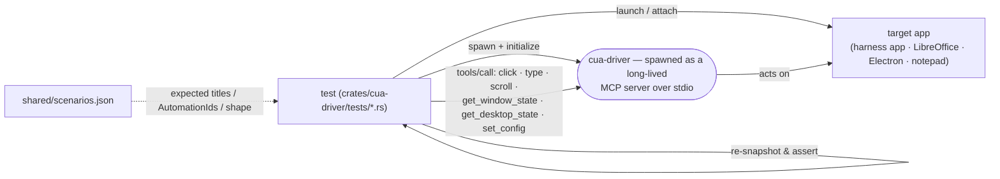

# cua-driver test suite — how the tests look

Companion to `TEST_HARNESS_STRUCTURE.md` (which covers the harness *apps*). This is the **test layer**: the integration tests in `libs/cua-driver/rust/crates/cua-driver/tests/` that launch the driver, drive a real app, and assert.

## The loop every harness test runs



One MCP server per test (long-lived) — important for `set_config`, whose overrides are **session-scoped** (they persist for that one server connection, not across separate `cua-driver call` processes).

## Inventory (13 files, ~135 test fns)

| Test file | OS | #fns | What it covers |
|---|---|---:|---|
| `harness_wpf_test.rs` | Windows | 18 | WPF: UIA Invoke, type, right/double-click, scroll, modal, owned/layered popups, native child HWNDs, accelerators |
| `harness_winui3_test.rs` | Windows | 7 | WinUI3: ValuePattern, CommandBarFlyout, XAML Popup |
| `harness_web_windows_test.rs` | Windows | 5 | WebView2 + Electron via CDP `page` tool |
| `harness_lo_vcl_test.rs` | Windows | 7 | LibreOffice VCL/SAL via MSAA — **uses `dispatch:"foreground"`** for SALFRAME cases |
| `harness_appkit_test.rs` | macOS | 5 | AppKit: AX tree, AXPress, NSTextField, NSScrollView, NSMenu |
| `harness_swiftui_test.rs` | macOS | 2 | SwiftUI: AX tree, `.popover()` |
| `harness_bg_modality_test.rs` | Windows | 8 | **Background modality** (no-focus-steal sentinel) + `capture_mode` ax/vision/som |
| **`harness_desktop_scope_test.rs`** ◀ NEW | Windows | 3 | **Desktop-scope / foreground modality**: `capture_scope=desktop`, `get_desktop_state`, window-less screen-absolute click/scroll, negative gate |
| `e2e_windows_bg_input_test.rs` | Windows | 6 | Unified **background** input across Electron/Tauri/Win32 — asserts no `dispatch:foreground` needed, no z-raise |
| `focus_check_test.rs` | macOS | 1 | Background automation does **not** steal focus (Terminal stays active) |
| `ux_guard_test.rs` | Windows | 6 | UX guards: background focus, click-opens-window, launch-visible, background menu shortcut |
| `mcp_protocol_test.rs` | any | 65 | MCP JSON-RPC 2.0 protocol (headless — **runs in CI**) |
| `element_token_test.rs` | any | 3 | Surface 6 opaque `element_token` (headless — **runs in CI**) |

Everything except `mcp_protocol_test` / `element_token_test` is `#[ignore]` — they need a real GUI session and are run explicitly:
`cargo test -p cua-driver --test <name> -- --ignored --nocapture --test-threads=1`

## Modality coverage — the two halves

```
                         ┌─────────────────────────── MODALITY ───────────────────────────┐
                         │                                                                 │
   BACKGROUND (default)  │  no focus steal · no z-raise · per-window · element/pixel       │
   ─────────────────────▶│  ✅ harness_bg_modality (sentinel) · e2e_windows_bg_input        │
                         │     focus_check (macOS) · ux_guard · all per-app harness tests   │
                         │                                                                 │
   FOREGROUND /          │  raises target · vision-only · screen-absolute (capture_scope=  │
   DESKTOP-SCOPE         │  desktop) · the "Computer-Use 1.0" loop                          │
   ─────────────────────▶│  ✅ harness_desktop_scope  ◀ NEW (capture + click/scroll + gate) │
                         │  (~) harness_lo_vcl (dispatch:foreground — VCL edge cases only)   │
                         └─────────────────────────────────────────────────────────────────┘
```

- **Background** was already well covered (4 dedicated tests + every per-app test runs background by default).
- **Foreground** used to be tested only *incidentally* (LibreOffice/VCL via `dispatch:"foreground"`). The new **`harness_desktop_scope_test`** is the first dedicated foreground/desktop-scope test.

### What `harness_desktop_scope_test` asserts
1. `set_config capture_scope=desktop` → `get_desktop_state` returns a full-display capture with real `screen_width/height` (proves capture works in a live session; it fails in Session 0).
2. Window-less screen-absolute `click` + `scroll` (no pid/window_id) land via `WindowFromPoint`, reported as `(desktop scope)`.
3. Negative gate: a window-less click under `capture_scope=window` is **rejected** (`desktop_scope_disabled`), not silently retargeted.

## Where they run

| Lane | Tests | Runner |
|---|---|---|
| **Headless / CI** | `mcp_protocol_test`, `element_token_test`, + the Linux Nix GUI scenarios | GitHub-hosted `ubuntu-latest` (Xvfb / NixOS VMs) |
| **Interactive Windows** | all `*_windows*` + `harness_wpf/winui3/web/bg_modality/lo_vcl/desktop_scope`, `e2e`, `ux_guard` | needs a real desktop (UIA/SendInput/z-order) → self-hosted / VM |
| **Interactive macOS** | `harness_appkit/swiftui`, `focus_check` | needs a logged-in session + TCC → self-hosted Mac |

## Status of the new test
`harness_desktop_scope_test.rs` is on branch **`test/desktop-scope-harness`** (off latest `main`, which already has #2019). Compile-verifying on the Windows VM; a live run uses the interactive-session method. Not yet PR'd — pending decision on its own PR vs. folding into the harness suite.
