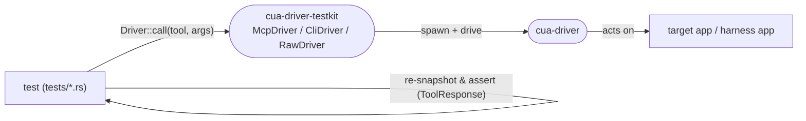

# cua-driver test suite — how the tests look

The integration tests in `libs/cua-driver/rust/crates/cua-driver/tests/` all sit
on one shared foundation — the **`cua-driver-testkit`** crate — and are named by
a four-family taxonomy so `ls tests/` reads as a map. Companion:
`TEST_HARNESS_STRUCTURE.md` (the harness *apps* the `harness_*` tests drive).

## The shared foundation: `cua-driver-testkit`

A dev-only crate (`crates/cua-driver-testkit`) that every test builds on, so no
test re-implements process plumbing:

- **Two transports, one shape.** `McpDriver` (one long-lived `cua-driver` server
  over stdio JSON-RPC, session-scoped state) and `CliDriver` (stateless
  `cua-driver call` per action) both implement the `Driver` trait and normalize
  their differing payloads — the CLI prints `structuredContent` directly, MCP
  returns the JSON-RPC envelope — into one `ToolResponse` (`text()` /
  `structured()` / `is_error()`). `RawDriver` adds raw send/recv with no
  auto-initialize for the protocol tests that drive the handshake themselves.
- **`ChildReaper`** kills every spawned child on drop; on Windows it assigns them
  to a kill-on-close Job Object (no orphaned windows / held ports).
- **`paths`** (`driver_binary()` resolves release-or-debug + `.exe`), **`ax`**
  (snapshot-text parsers), `McpDriver::find_window`.

## The loop every behavior test runs



## Inventory by family (18 files)

| Family | File | Platform | What it covers |
|---|---|---|---|
| **protocol_** | `protocol_handshake_test` | mac+win | initialize handshake, tools/list registration, per-tool capability + version fields, unknown-method/tool errors |
| | `protocol_tools_call_test` | mac+win | per-tool `tools/call` shape: list_apps, get_config, permissions, AX tree, list_windows, screen size, scroll, type_text, hotkey, press_key, click, set_value |
| | `protocol_schema_test` | mac+win | inputSchema shape for the `type_text` chars variants |
| | `protocol_media_test` | mac+win | screenshot / zoom (jpeg) / recording / replay / screenshot-resize |
| | `protocol_session_test` | mac+win | concurrent clients, multi-driver isolation, cursor-overlay liveness |
| | `protocol_element_token_test` | mac/linux | Surface 6 opaque `element_token` in schema + capabilities |
| **transport_** | `transport_config_persistence_test` | any | `set_config` persists to disk across stateless **CLI** invocations (#2034) vs visible within an **MCP** session |
| **harness_** | `harness_wpf_test` | win | WPF: UIA Invoke, type, clicks, scroll, modal, owned/layered popups, native child HWNDs |
| | `harness_winui3_test` | win | WinUI3: ValuePattern, CommandBarFlyout, XAML Popup |
| | `harness_web_test` | win | WebView2 + Electron via CDP `page` |
| | `harness_libreoffice_test` | win | LibreOffice VCL/SAL via MSAA (some `dispatch:"foreground"`) |
| | `harness_appkit_test` | mac | AppKit: AX tree, AXPress, NSTextField, NSScrollView, NSMenu |
| | `harness_swiftui_test` | mac | SwiftUI: AX tree, `.popover()` |
| **modality_** | `modality_background_test` | win | background-modality / no-focus-steal sentinel + `capture_mode` ax/vision/som |
| | `modality_capture_mode_test` | mac+win+linux | `capture_mode` axis on each native harness: `ax`→tree-only, `vision`→image-only, `som`→both |
| | `modality_input_e2e_test` | win | unified background input across Electron/Tauri/Win32, no z-raise |
| | `modality_desktop_scope_test` | win | desktop-scope (foreground): `capture_scope=desktop`, `get_desktop_state`, window-less screen-absolute actions |
| | `modality_focus_test` | mac | background automation does not steal focus |
| **guard_** | `guard_ux_test` | win | UX guards: background focus, click-opens-window, launch-visible, menu shortcut |

The `protocol_*` family is the renamed + split successor of the old
`mcp_protocol_test` (3,412 lines / 65 tests). The split deduped 24 macOS↔Windows
mirror pairs into single `cfg!`-branching tests, sharing one `RawDriver`.

## Coverage on three axes: transport × modality × platform

```
                    ┌────────────── MODALITY ──────────────┐
                    │ background    foreground/desktop-scope│
   ─────────────────┼───────────────────────────────────────
   MCP transport    │ ✅ thorough    ✅ desktop_scope (win)   │
                    │ (background,   focus (mac)             │
                    │  input_e2e,                            │
                    │  focus, guard)                         │
   CLI transport    │ ⬚              ✅ config-persistence    │
                    │                (transport_ test)       │
                    └───────────────────────────────────────┘
   Per-app AX (MCP): harness_{wpf,winui3,web,libreoffice}=win · {appkit,swiftui}=mac
   Protocol (RawDriver): mac+win, deduped; element_token = mac/linux
```

- **Background modality** is the most-covered: the sentinel oracle
  (`modality_background`), unified input (`modality_input_e2e`), the macOS
  no-focus-steal check (`modality_focus`), and the UX guards.
- **Foreground / desktop-scope** is covered by `modality_desktop_scope`.
- **Transport** is now a first-class axis: `transport_config_persistence`
  exercises CLI (disk) vs MCP (session) directly; most other tests run over MCP.

### The modality matrix: `capture_mode` × `dispatch` × `capture_scope`

The user-facing matrix is documented in
`docs/content/docs/explanation/capture-and-dispatch-modalities.mdx`. Coverage of
its five valid cells, per platform:

| Cell (`scope`/`mode`/`dispatch`) | Windows | macOS | Linux |
|---|---|---|---|
| `window`/`ax`/`background` (default) | `harness_*`, `modality_background` | `harness_{appkit,swiftui}`, `modality_focus`, `modality_capture_mode` | `harness_gtk3`, `modality_capture_mode` |
| `window`/`ax`/`foreground` | `harness_wpf` (`dispatch:"foreground"`) | activation differs | activation differs |
| `window`/`vision`/`background` | `modality_background`, `modality_capture_mode`, `modality_input_e2e` | `modality_capture_mode` | `modality_capture_mode` |
| `window`/`vision`/`foreground` | gap | n/a (no `bring_to_front`) | n/a (stubbed) |
| `desktop`/`vision`/`foreground` | `modality_desktop_scope` | rolling out | rolling out |
| **negative gate** (`desktop_scope_disabled`) | `window_scope_rejects_windowless_click` | — | — |

`modality_capture_mode_test` is the cross-platform spine of the `capture_mode`
axis: it drives each platform's native harness and asserts `ax`→tree-only,
`vision`→image-only, `som`→both. It closes the prior "`capture_mode` only on
Windows" gap.

- **Remaining gaps** (honest): `window`/`vision`/`foreground` has no explicit
  test on any platform; the desktop-scope window-less actuator is Windows-only
  (macOS click still requires `pid`), so the desktop cell and its negative gate
  are Windows-only until that loop lands on macOS/Linux; CLI transport is
  otherwise lightly exercised.

## Where they run

| Lane | Tests | Runner |
|---|---|---|
| **Runs without `#[ignore]`** | `protocol_*` (mac/win dev machines; linux excludes them via cfg) | local / VM |
| **Interactive Windows** (`#[ignore]`) | `harness_{wpf,winui3,web,libreoffice}`, `modality_*` (win), `guard_ux`, `transport_*` | real desktop / VM |
| **Interactive macOS** (`#[ignore]`) | `harness_{appkit,swiftui}`, `modality_focus` | logged-in session + TCC |

Run an `#[ignore]` suite explicitly:
`cargo test -p cua-driver --test <name> -- --ignored --nocapture --test-threads=1`

### Run the whole matrix for the host OS

`test-harness/run-suite.sh` (macOS + Linux) and `test-harness/run-suite.ps1`
(Windows) build the host harness and run every `#[ignore]` modality/harness test
for that OS in one shot, printing a `PASS / FAIL / SKIP` summary. Each test file
is `#![cfg(target_os = "…")]`-gated, so the runner lists the full matrix and cfg
selects the host's subset (non-host files compile to empty binaries).

```sh
libs/cua-driver/test-harness/run-suite.sh               # macOS / Linux
pwsh -File libs/cua-driver/test-harness/run-suite.ps1   # Windows (Session 2)
```

Flags: `--no-build` reuse the staged harness, `--release` use the release driver.
Headless Linux CI runs the capture_mode + gate subset
(`.github/workflows/ci-cua-driver-interactive-linux.yml`); the desktop-scope
landing needs a real display.
