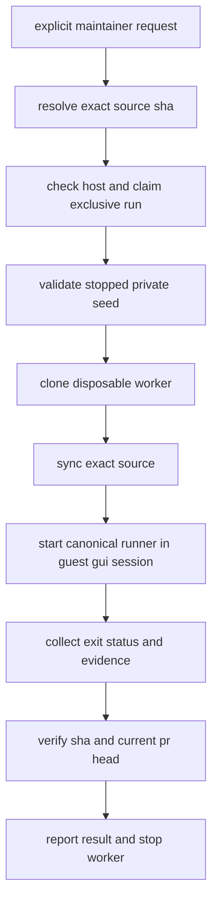

# maintainer-triggered lume e2e orchestration

Refs #3570.

## status

implementation and unattended acceptance are not complete. this document records
scope and acceptance for the linked draft pull request, not a replacement for
[the canonical runner instructions](README.md).

## execution boundary

an explicit maintainer request authorizes one immutable source revision. public
issue or pull request events never invoke a privileged host or guest. the host
retains github access; only the selected source archive and non-secret run
metadata enter the disposable guest. repository content remains untrusted input.

## ownership

| component | responsibility |
| --- | --- |
| host command | immutable source selection, readiness, exclusive ownership, worker lifecycle, artifact retrieval |
| private seed | versioned toolchain, stable guest signing identity, approved consent, desktop login |
| guest launcher | fixed runner entrypoint, proven gui ancestry, bounded run request, exit status |
| existing `run-all.sh` | source build, preflights, canonical matrix, evidence validation, daemon restoration |
| agent skill | invoke the host command only after explicit selection and explain the verified result |

## first milestone: prove gui launch

build a minimal launcher experiment in a disposable clone before implementing
the full host workflow. compare its runtime context with a clean Terminal-started
run: console user, launchd domain, process ancestry, inherited environment,
Automation attribution, app-owned capture, and fixture execution. a GUI
LaunchAgent is a candidate, not an established substitute for Terminal.

never make an SSH-started process look acceptable by merely deleting SSH
environment variables. do not remove or weaken the existing session preflight.
if the launcher changes Automation attribution, obtain the appropriate consent
through normal setup and test that it survives a fresh clone. update the runner
only when the replacement ownership is demonstrated.

## seed and secret handling

prepare a new versioned private seed through the documented consent flow. do not
promote a used test worker or one with disposable seeded grants into an immutable
trusted seed. never boot the seed for testing. record the public base, toolchain,
signing certificate fingerprint, permissions, and optional browser consent state.

keep unlock credentials in host-owned secure storage. define and test a transient
handoff that does not persist secrets in source, command lines, logs, evidence,
or the seed image. never transfer host private keys or github credentials.

## host command requirements

- fail before cloning when host desktop login, storage, dependencies, seed
  provenance, or secure unlock access are unavailable;
- claim one exclusive host run and release only the lock owned by this run;
- pin the selected PR head once and verify the transferred source identity;
- generate worker and artifact names locally, never from unchecked PR text;
- admit a fixed structured run request rather than arbitrary shell commands;
- retain machine-readable progress, source identity, runner exit status, and
  evidence collection status independently;
- preserve failure evidence and report incomplete collection as incomplete;
- recheck the PR head before publishing a current-head claim;
- stop only the run-owned worker after collection and retain it by default;
- keep installed-browser inclusion explicit and never hide missing browsers;
- distinguish infrastructure failure, behavioral failure, and a passed old SHA.

## validation

focused tests must exercise readiness failures, malformed requests, concurrent
invocations, stale ownership, SHA mismatch, runner failure, disconnects, evidence
collection failure, and a moved PR head. shell syntax and the existing runner
unit tests remain required for affected scripts.

final acceptance requires two complete runs from fresh clones at the exact
candidate SHA with no clicks, typing, passwords, or consent prompts. both must
retain the full typed matrix, video validation, source and installed-binary
identity, exit status, and daemon restoration evidence. no hidden retries or
single-cell substitutes are allowed. run the expensive matrix only after the
launcher and implementation are stable.

## non-goals

no public driver or Lume API changes, general remote command service, webhook
dispatch, new scheduler, release automation, or replacement E2E suite. SIP-on
permission-flow testing remains separate. any required public permission or
cross-component architecture change must follow the RFC process before coding.
