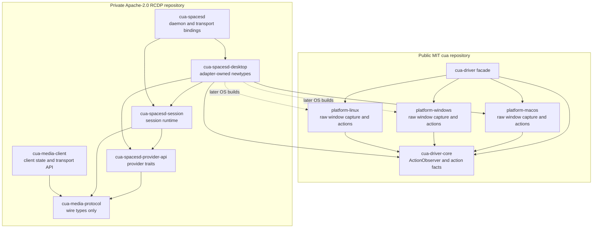

# RCDP and cua-driver integration plan

> Design history imported from rcdp. Current behavior of the `cua.env.v1` server is in the [README](../README.md); media wire v2 is in [`MEDIA.md`](../../cua/proto/MEDIA.md).

- Status: audited design, ready for staged implementation
- Scope: macOS first, with contracts that can support Windows and Linux
- Repository boundary: RCDP stays private and Apache-2.0 during the first
  phases; `cua-driver` stays public and MIT

## Executive decision

Build the integration as a Y-shaped adapter:

- `cua-driver` owns general-purpose action dispatch and operating-system capture
  primitives.
- RCDP owns streaming sessions, target capabilities, freshness rules, action to
  frame correlation, transports, and policy.
- A private `cua-spacesd-desktop` crate adapts the CUA primitives to RCDP provider
  traits.
- Neither project depends on the other at its core. The adapter is the only
  place where both dependency graphs meet.

During private development, the dependency points from RCDP to public CUA.
The public CUA repository must not name, fetch, or lock the private RCDP
repository, even through a disabled optional feature. Once RCDP packages are
available to CUA users, optional RCDP features may be added to the top-level
`cua-driver` facade. The default build must remain RCDP-free.

This plan preserves the useful work in the current CUA prototype while moving
the protocol-specific parts to the repository that owns them.

## Definition of done

The first production-shaped slice is complete when all of the following are
true:

1. A RCDP client can discover or pick a macOS window without sending a PID or
   native window identifier.
2. The daemon can stream that window continuously with bounded buffering.
3. The client can request supported pixel, keyboard, and semantic actions
   against the session target.
4. A background-only session never activates an application silently. An
   action that cannot meet the policy returns `WouldRequireActivation`.
5. Action completion and subsequent frames carry enough ordering data for a
   client to correlate them without treating a frame as proof of a visual
   change.
6. `cua-driver` builds and tests without RCDP access, and its normal dependency
   graph contains no RCDP or temporary `window-*` package.
7. The same provider contracts compile for Windows and Linux test adapters,
   even if their first capture and input implementations have different
   capability sets.
8. The private RCDP workspace builds against a pinned CUA revision and passes
   protocol, policy, stale-target, and macOS end-to-end tests.

## Audited dependency shape



### Why the adapter owns newtypes

Rust does not allow a RCDP crate to implement a RCDP trait directly for a CUA
type when both the trait and type are foreign to the adapter crate. The adapter
therefore owns wrappers such as `CuaCaptureProvider` and `CuaActionProvider`
and implements the RCDP traits for those wrappers. This also gives the adapter
a clear place to hold target maps, permission state, and platform-specific
translation.

## Crate responsibilities

### `cua-media-protocol`

Keep this crate limited to transport-neutral wire data:

- protocol negotiation and feature identifiers;
- opaque target and session identifiers;
- lifecycle, frame, action, capability, and error messages;
- freshness identifiers and frame descriptors;
- serialization and conformance vectors.

It must not contain async runtimes, sockets, provider traits, CUA types, native
handles, PIDs, or platform window identifiers.

### `cua-spacesd-provider-api`

Add this small crate for the server-side service provider interface:

- target discovery, interactive picking, and grant restoration;
- capture source creation and lifecycle events;
- action capability lookup and action execution;
- accessibility snapshot and semantic action access where supported;
- provider-neutral error types.

This split prevents `cua-media-client` from acquiring server, platform, or CUA
dependencies just to share protocol types.

### `cua-spacesd-session`

Keep the session engine responsible for:

- target ownership and target epochs;
- geometry and codec epochs;
- frame sequencing and latest-frame delivery;
- lifecycle event ordering;
- action policy checks and action to frame ordering;
- subscriber state and teardown.

It depends on `cua-media-protocol` and `cua-spacesd-provider-api`, but not on CUA or an
operating-system crate.

### `cua-media-client`

Add a client library that depends only on `cua-media-protocol` plus its chosen
transport dependencies. It should expose discovery, session, stream, action,
and lifecycle concepts without linking the daemon runtime.

### `cua-spacesd-desktop`

Keep this adapter private with RCDP during the first phases. It will:

- wrap CUA capture and action entry points in adapter-owned newtypes;
- map opaque RCDP targets to trusted native CUA arguments;
- translate platform capability data into RCDP capabilities;
- implement RCDP action policy and correlation semantics;
- convert CUA capture output to the RCDP v1 owned frame format;
- contain no reusable protocol types that need to move back into CUA.

### `cua-spacesd`

The first daemon links the adapter in-process. Do not add a plugin ABI or a
second internal IPC protocol yet. One process simplifies macOS permission
ownership and avoids version skew while the provider interface is changing.

## Contracts to settle before implementation

### Target selection

Clients should choose targets through capabilities issued by the daemon, not
through native identifiers.

The provider interface needs three paths because the operating systems differ:

1. `enumerate_targets` for systems that allow passive discovery;
2. `pick_target` for a user-mediated system picker;
3. `restore_grant` for a previously authorized target or portal grant.

macOS can support enumeration and a RCDP-owned picker. Windows can enumerate
capturable windows and can later use system-mediated capture selection where
appropriate. X11 can enumerate windows. Wayland often requires a portal picker
and a restorable portal grant, so enumeration alone cannot be the common
contract.

The public protocol should expose an opaque `TargetHandle` and a
`TargetEpoch`. The daemon keeps the native PID, window ID, portal token, or
capture item in its provider-owned map. Requests that include native target
fields should fail instead of being silently rewritten.

`TargetEpoch` protects against a native identifier being recycled after a
window closes. It remains separate from:

- `GeometryEpoch`, which invalidates pixel coordinates after a resize or scale
  change;
- `FrameSequence`, which orders video frames;
- `AccessibilitySnapshotId`, which scopes semantic element tokens;
- `CodecEpoch`, which signals decoder reinitialization.

### Capture

The first portable frame contract should use an owned CPU buffer with explicit
pixel format, dimensions, stride, timestamp, and freshness metadata. This is
not the final performance ceiling. The provider API should leave room for
future platform frame variants, but v1 should not standardize Metal textures,
D3D textures, dma-buf handles, or other zero-copy resources before there are
measured consumers for them.

Platform capture APIs in CUA should expose native lifecycle and frame events
without importing RCDP session types. Existing CUA window managers can become
temporary consumers of that raw API during migration.

### Actions and background guarantees

A session policy is a ceiling, not a claim that every action can run in the
background:

- `ViewOnly` rejects all actions.
- `BackgroundOnly` permits only actions whose provider capability says they can
  meet the background guarantee for that target.
- `AllowActivation` permits actions that may activate or foreground the target.

Each advertised action capability should state its actual guarantee for the
selected target. A semantic value operation, target-routed click, or background
keystroke path may qualify on one platform or application and not another.
The provider must return a typed `WouldRequireActivation` error when it cannot
meet the requested policy. It must never fall back to foreground input without
the client's permission.

`cua-spacesd-session` should call an interface shaped like:

```text
perform(session_target, action, policy) -> action_result
```

The CUA adapter resolves `session_target` and constructs native CUA arguments.
The generic session service must not import or operate a `ToolRegistry`.

### Action observation and frame correlation

The current prototype needs action facts while a tool invocation is in flight.
Add a small, no-op-by-default `ActionObserver` interface to
`cua-driver-core`. It should report facts that are useful outside RCDP, such as
action identity, resolved target identity, start, completion, and failure. It
must not depend on RCDP types or make capture calls.

The adapter implements the observer and owns all RCDP correlation semantics.
Capture frames continue through the capture provider, not through the action
observer. The session runtime can then mark the first subsequent frame with an
action ordering value and publish the same boundary as a lossless control
event. This ordering says that the action preceded the frame. It does not claim
that the pixels changed.

## Dependency and licensing rules

### Private phase

- RCDP may depend on public CUA crates through a pinned, reproducible source.
- The adapter and daemon stay in the private RCDP repository.
- CUA must not contain a path, Git, registry, or optional dependency on private
  RCDP.
- CUA's lockfiles must not contain the private RCDP URL.
- Extracted CUA primitives remain MIT. RCDP provider interfaces, adapter code,
  session logic, and protocol code remain Apache-2.0.
- Do not copy Apache-2.0 target or session types back into MIT CUA. Define small,
  general-purpose CUA interfaces independently and record provenance during
  extraction.

The exact private dependency mechanism needs a short packaging spike because
CUA currently lives in a larger repository and its Rust packages are below the
repository root. Whatever mechanism is selected must pin a revision and work
in CI without changing the public-to-private dependency direction.

### Public integration phase

Only add CUA integration after RCDP packages are accessible to intended CUA
users. Put optional features on the top-level `cua-driver` facade, not on
`cua-driver-core` or platform crates. A possible shape is:

```toml
[features]
default = []
cua-media-client = ["dep:cua-media-client"]
rcdp-server = ["dep:cua-spacesd-session", "dep:cua-spacesd-desktop"]
picture-in-picture = ["cua-media-client", "dep:cua-pip-ui"]
```

These names are placeholders. The invariant matters more than the labels:
default CUA users should not compile or distribute RCDP. Users who enable an
Apache-2.0 RCDP feature receive the notices and obligations for that optional
dependency, while CUA's own source remains MIT licensed.

## Migration plan

### Phase 0: baseline and provenance inventory

Do not rewrite or commit the current dirty CUA prototype as part of this plan.
First capture a local baseline:

- `git status` and the relevant diffs;
- current Cargo metadata and dependency trees;
- tests that prove existing PiP, capture, action correlation, and background
  behavior;
- a file-by-file inventory that labels reusable MIT primitives, RCDP-specific
  code, and code whose provenance needs a decision.

Exit criteria:

- the current behavior and dependency cycle are documented;
- every file to move or extract has a licensing decision;
- no CUA changes have been committed merely to create the baseline.

### Phase 1: remove session ownership from `cua-driver-core`

1. Add the MIT `ActionObserver` interface with a no-op default.
2. Make `ToolRegistry` emit general action facts through the observer.
3. Keep a temporary local shim so the prototype continues to work during
   extraction.
4. Remove `window-session` from `cua-driver-core`.

Exit criteria:

- core action tests cover observer ordering and error paths;
- no observer payload imports RCDP or window session types;
- `cargo tree -p cua-driver-core -e normal` contains no `window-*` or RCDP
  package.

### Phase 2: expose raw platform capture primitives

1. Define a small MIT capture interface around frames, lifecycle, and teardown.
2. Implement it first with the current macOS ScreenCaptureKit path.
3. Convert the existing PiP or session manager into a temporary thin consumer.
4. Give Windows and Linux compile-time adapters the same contract, with honest
   capability differences.
5. Remove `window-session` from each platform package.

Exit criteria:

- macOS continuous capture, resize, minimize, restore, occlusion, and close
  behavior remain covered;
- capture callbacks do not wait on encoding or transport work;
- platform dependency trees contain no `window-session` or RCDP package;
- Windows and Linux contract tests compile.

### Phase 3: split the RCDP provider interface

1. Add `cua-spacesd-provider-api`.
2. Move provider traits out of wire and session concerns.
3. Add opaque target handles, target epochs, picker and restore flows, and typed
   provider errors.
4. Add `cua-media-client` with a protocol-only dependency graph.
5. Settle the owned CPU frame contract for v1.

Exit criteria:

- `cua-media-client` has no server, provider, CUA, or platform dependencies;
- provider conformance tests cover discovery, picker, restored grant, target
  closure, and epoch changes;
- protocol fixtures contain no native identifiers.

### Phase 4: implement the CUA adapter and daemon

1. Add adapter-owned capture, target, action, and observer newtypes.
2. Map RCDP target handles to provider-owned native state.
3. Translate CUA frames and lifecycle events into RCDP session events.
4. Construct trusted CUA action arguments inside the adapter.
5. Link the adapter into `cua-spacesd` in-process.
6. Move the macOS explicit streaming and follow-actions behavior behind this
   boundary.

Exit criteria:

- a macOS client can list or pick, open, stream, act, resize, minimize, restore,
  and close a target;
- two independently owned sessions can stream at once;
- a slow subscriber cannot block capture and cannot grow an unbounded frame
  queue;
- the generic RCDP session service does not import `ToolRegistry`;
- the public CUA default graph has no RCDP or `window-*` dependency.

### Phase 5: enforce the control contract

1. Add the session policy ceiling and per-target, per-action guarantees.
2. Add `WouldRequireActivation` and other typed policy errors.
3. Reject client-supplied native identifiers.
4. Validate target, geometry, accessibility, and codec freshness separately.
5. Verify action to frame ordering through the observer and capture paths.

Exit criteria:

- `BackgroundOnly` tests verify both success paths and typed rejection;
- rejection leaves the foreground application unchanged;
- recycled native identifiers fail through a target epoch mismatch;
- stale pixel and semantic inputs fail in their own freshness domains;
- correlation remains valid when intermediate video frames are replaced.

### Phase 6: add optional CUA products after RCDP publication

1. Publish or otherwise make the required RCDP packages accessible to intended
   users.
2. Add optional features only to the CUA facade.
3. Rebuild PiP as a RCDP client rather than a privileged session owner.
4. Add recording, browser preview, or paid transports as independent clients or
   providers.

Exit criteria:

- default CUA builds on a machine with no RCDP credentials or repository
  access;
- each optional feature has an explicit dependency and license report;
- enabling PiP does not change core action or capture contracts;
- disabling every RCDP feature restores the ordinary CUA dependency graph.

## Verification matrix

| Boundary | Evidence |
| --- | --- |
| CUA default closure | `cargo tree -p cua-driver --no-default-features -e normal` contains no `rcdp` or temporary `window-*` package |
| CUA core closure | `cargo tree -p cua-driver-core -e normal` contains no RCDP or session runtime package |
| Public repository privacy | CUA manifests and lockfiles contain no private RCDP URL or package source |
| Source boundary | A repository search finds no RCDP imports in CUA core or platform crates |
| Client isolation | `cargo tree -p cua-media-client -e normal` contains no session, provider, CUA, or platform package |
| Wire neutrality | Golden protocol messages contain no PID, native window ID, portal token, or native frame handle |
| Target freshness | A recycled native identifier cannot satisfy an older target epoch |
| Background policy | Activation-required actions return `WouldRequireActivation`; foreground ownership does not change |
| Correlation | Action observer and capture tests preserve ordering across frame replacement |
| Flow control | Each subscriber has bounded control delivery and at most one replaceable pending frame |
| Cross-platform shape | macOS, Windows, Linux, X11, and Wayland provider test doubles compile against the same API |
| Licenses | `cargo-deny` or equivalent checks allowed licenses and notices for each feature set; default CUA has no Apache-2.0 RCDP dependency |
| Revision compatibility | RCDP CI builds against a pinned CUA revision, with a separate advisory job against CUA main |

After RCDP becomes available to public builds, run a feature-power-set check on
the CUA facade. Before that point, no public CUA job should need RCDP access.

## Decisions to make now

- Split provider traits into `cua-spacesd-provider-api`.
- Keep protocol types free of provider and I/O concerns.
- Use adapter-owned newtypes for CUA implementations.
- Put general action facts in an MIT CUA observer and RCDP semantics in the
  adapter.
- Keep the adapter and daemon in the private RCDP repository.
- Use opaque target handles plus target epochs.
- Model background behavior as a session policy ceiling plus per-action
  guarantees.
- Reject native target identifiers from clients.
- Use owned CPU frames for v1 and leave room for later platform frame variants.
- Keep extracted CUA capture and observer primitives MIT; keep RCDP code
  Apache-2.0.

## Decisions to defer

- exact public package and feature names;
- crates.io publication timing;
- PiP UI packaging;
- an out-of-process provider or plugin ABI;
- native zero-copy frame variants;
- QUIC, WebRTC, and hosted transport choices;
- Wayland grant persistence format;
- retained or resumable sessions;
- exact native encoder ownership on Windows and Linux.

## Main risks

### Background input varies by target

Operating systems expose several background paths, but applications can handle
them differently. Keep capabilities target-specific, test focus behavior, and
return typed failures instead of claiming a universal guarantee.

### Wayland changes the discovery model

A portal-mediated picker is not equivalent to enumerating windows. Treat pick
and restore as first-class provider operations from the start.

### Private interfaces will change

Keep the provider API small, pin the CUA revision used by RCDP, and run a
separate compatibility job against CUA main. Do not promise a stable plugin ABI
during the private phase.

### CPU copies may limit quality or frame rate

Measure the macOS v1 pipeline before adding native handle variants. Preserve
timestamps, stride, and pixel format now so a later zero-copy path can coexist
without changing session semantics.

### Monorepo dependency packaging may be awkward

Run a short spike before wiring CI. The result must be reproducible and must
not introduce a private dependency into the public CUA repository.

### Prototype extraction has licensing risk

Record the origin and target license of each extracted file. Prefer small,
general interfaces in CUA and fresh adapter implementations in RCDP over moving
mixed-purpose modules wholesale.

## Audit notes

This plan incorporates a read-only architecture audit performed with Claude
Code Fable against the current CUA prototype and RCDP scaffold. The audit
confirmed the repository boundary and corrected four points in the earlier
design:

1. provider implementations need adapter-owned newtypes because of Rust's
   orphan rule;
2. provider traits belong in a dependency-light crate outside the wire model;
3. action observation needs a small CUA-side seam because correlation facts are
   produced during dispatch;
4. background behavior must be advertised per action and target, not inferred
   from a session-wide label.

The audit also proposed standardizing native zero-copy frame handles in the
first API and treated background typing too narrowly. This plan defers native
handles until measurement justifies them and models all actions through
provider-advertised guarantees, including existing target-routed and semantic
background paths.
