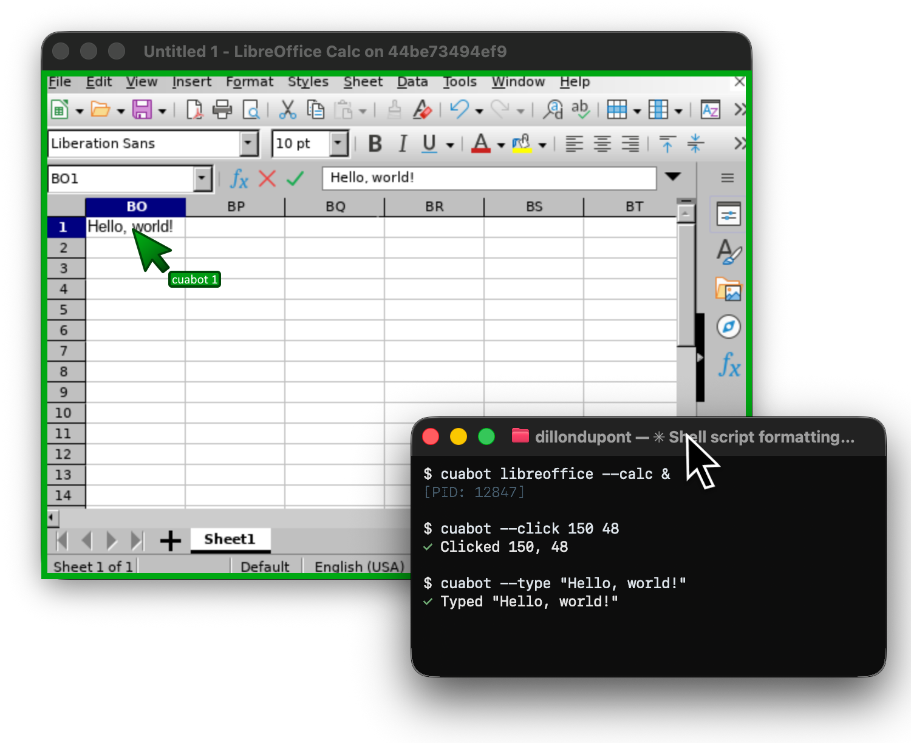

# cuabot

> [!CAUTION]
> **Deprecated and unsafe to run:** `cuabot` has known security issues and is no longer maintained. Do not run it.
>
> If it is installed, stop it, uninstall it and remove its data:
>
> ```bash
> cuabot --stop                      # also: cuabot --name <session> --stop, for each named session
> npm uninstall -g cuabot            # or delete any local node_modules/cuabot
> docker rm -f cuabot-xpra           # the sandbox container it created
> docker images -q trycua/cuabot | xargs docker rmi
> rm -rf ~/.cuabot
> ```
>
> There will be no fixes or new releases. To give a coding agent a computer, use [Cua Driver](https://cua.ai/docs/cua-driver/guides/connect-your-agent) over MCP, or a sandbox from the [`cua` CLI](https://cua.ai/docs/cua-sdk/quickstart) or [Cua Spaces](https://cua.ai/docs/spaces/quickstart). See [Migrate from deprecated packages](https://cua.ai/docs/cua-sdk/guides/migrate-from-deprecated-packages).

Co-op computer-use for any agent.

Multi-user computing sandbox that gives any coding agent (Claude Code, Gemini CLI, Codex, OpenClaw, Vibe) seamless computer-use capabilities.

<div align="center">
  
</div>

## Quick Start

```bash
npx cuabot
```

## Usage

```bash
cuabot                     # Run default agent (or setup if not configured)
cuabot claude              # Run Claude Code in the sandbox
cuabot gemini              # Run Gemini CLI in the sandbox
cuabot codex               # Run Codex CLI in the sandbox
cuabot chromium            # Open sandboxed Chromium window

cuabot --screenshot        # Take screenshot
cuabot --type "hello"      # Type text
cuabot --click 100 200     # Click at coordinates
```

## Requirements

- [Node.js](https://nodejs.org/) v18+
- [Docker Desktop](https://www.docker.com/products/docker-desktop/)
- [Xpra client](https://github.com/Xpra-org/xpra/wiki/Download)

## Documentation

- [Getting Started](https://docs.trycua.com/cuabot/guide/getting-started/introduction)
- [Installation Guide](https://docs.trycua.com/cuabot/guide/getting-started/installation)
