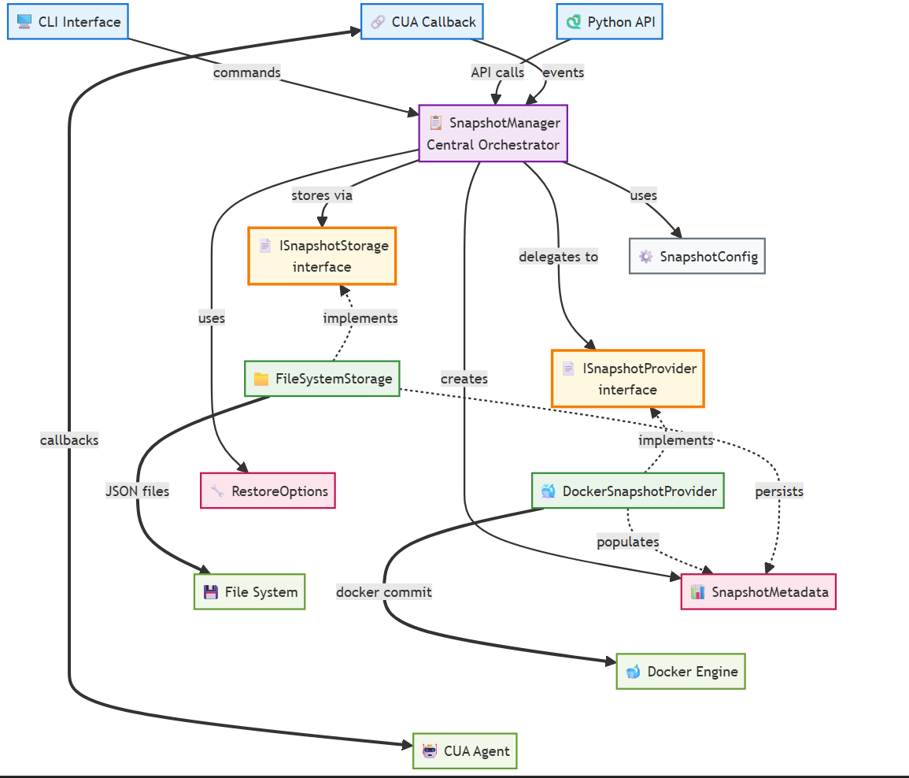

<div align="center">
<h1>
  <div class="image-wrapper" style="display: inline-block;">
    <picture>
      <source media="(prefers-color-scheme: dark)" alt="logo" height="150" srcset="img/logo_white.png" style="display: block; margin: auto;">
      <source media="(prefers-color-scheme: light)" alt="logo" height="150" srcset="img/logo_black.png" style="display: block; margin: auto;">
      
    </picture>
  </div>

  [](#)
  [](#)
  [](https://discord.com/invite/mVnXXpdE85)
  [](https://pypi.org/project/cua-snapshot-manager/)
</h1>
</div>

**CUA Snapshot Manager** is a Docker container snapshot management system for the CUA Agent SDK, enabling automated state capture, storage, and restoration during AI agent execution.

<div align="center">

</div>

```bash
pip install cua-snapshot-manager
```

## Features

- **🔄 Automatic Snapshots**: Integrate with CUA Agent callbacks for hands-free operation
- **🐳 Docker Native**: Uses `docker commit` for efficient container snapshots  
- **📦 Volume Support**: Automatic backup/restore of named volumes with bind mount warnings
- **⚡ Configurable Triggers**: Manual, run start/end, before/after actions
- **🧹 Smart Retention**: Automatic cleanup with configurable policies
- **📊 Rich Metadata**: Timestamps, descriptions, agent context tracking
- **⚙️ CLI Interface**: Command-line tools for snapshot management
- **🔌 Pluggable Design**: Easy integration without modifying existing workflows

## Quick Start

### Basic Usage

```python
import asyncio
from snapshot_manager import SnapshotManager, SnapshotTrigger, SnapshotConfig

async def main():
    config = SnapshotConfig(storage_path="./snapshots")
    manager = SnapshotManager(config=config)
    
    # Create snapshot
    metadata = await manager.create_snapshot(
        container_id="my-container",
        trigger=SnapshotTrigger.MANUAL,
        description="Before risky operation"
    )
    print(f"Created snapshot: {metadata.snapshot_id}")

asyncio.run(main())
```

### CUA Agent Integration

```python
from agent import ComputerAgent
from computer import Computer
from snapshot_manager import SnapshotCallback, SnapshotConfig, SnapshotTrigger

async def agent_with_snapshots():
    # Configure automatic snapshots
    config = SnapshotConfig(
        triggers=[SnapshotTrigger.RUN_START, SnapshotTrigger.RUN_END]
    )
    
    snapshot_callback = SnapshotCallback(config=config)
    
    async with Computer(os_type="linux", provider_type="docker") as computer:
        agent = ComputerAgent(
            model="anthropic/claude-3-5-sonnet-20241022",
            tools=[computer],
            callbacks=[snapshot_callback]  # Enable automatic snapshots
        )
        
        async for result in agent.run("Take a screenshot"):
            print(result)
```

### CLI Usage

```bash
# Create snapshot
cua-snapshot create my-container --description "Initial state"

# List snapshots
cua-snapshot list

# Restore snapshot
cua-snapshot restore <snapshot-id> --container-name restored-container

# Cleanup old snapshots
cua-snapshot cleanup --max-age-days 7
```

## Architecture

The system consists of pluggable components for maximum flexibility:

- **SnapshotManager**: Central orchestrator coordinating all operations
- **DockerSnapshotProvider**: Docker-specific implementation using `docker commit`
- **FileSystemSnapshotStorage**: JSON-based metadata storage with indexing
- **SnapshotCallback**: CUA Agent SDK integration for automatic snapshots

See [ARCHITECTURE.md](./ARCHITECTURE.md) for detailed design decisions and technical overview.

## Examples & Testing

**Examples** in [examples/](./examples/):
- [`cua_volume_example.py`](./examples/cua_volume_example.py) - CUA Agent integration with volume support
- [`cua_callback_integration.py`](./examples/cua_callback_integration.py) - Automatic callback triggers demonstration

**Tests** in [tests/](./tests/):
- Comprehensive test suite covering snapshot manager core functionality
- Volume support tests for detection, backup, storage, and restore
- All 19 tests passing with full coverage of critical features

## Contributing

We welcome and greatly appreciate contributions to CUA Snapshot Manager! Whether you're improving documentation, adding new features, fixing bugs, or enhancing integrations, your efforts help make the system better for everyone.

Join our [Discord community](https://discord.com/invite/mVnXXpdE85) to discuss ideas or get assistance.

## License

CUA Snapshot Manager is open-sourced under the MIT License - see the [LICENSE](LICENSE) file for details.
