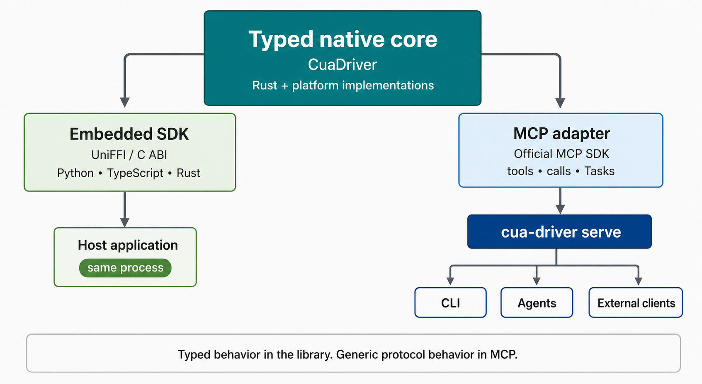
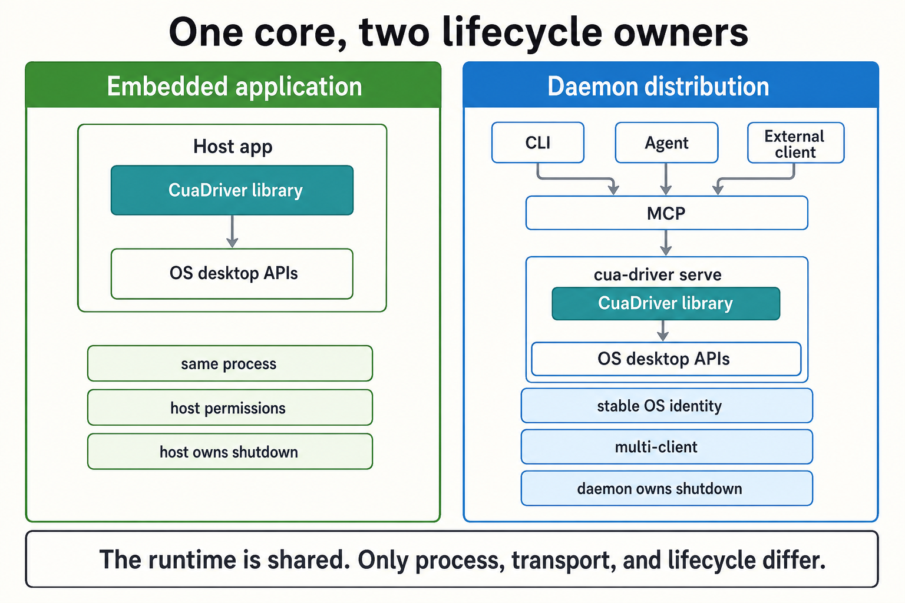

# RFC: Typed native Cua Driver core with MCP as a protocol adapter

## Summary

Cua Driver should have one reusable, typed Rust runtime that owns desktop
behavior and can either run inside an application through UniFFI or inside the
standalone daemon. MCP should sit downstream of that runtime as the standard
agent and process protocol. The public SDK must expose typed driver operations,
not a parallel `list_tools_json()` and `call_tool(name, JSON)` abstraction that
duplicates MCP discovery, invocation, and result semantics.



**Figure 1.** One typed native implementation feeds an embedded application SDK
and an official MCP adapter. The two surfaces solve different product needs.

## Motivation

The current Python and TypeScript packages load a Rust UniFFI library, but that
library is a daemon client rather than the desktop engine. In the app-hosted
mode, `EmbeddedCuaDriverHost.start()` spawns `cua-driver serve --embedded`, and
`CuaDriver.connect()` invokes the child over a private socket or named pipe.
This preserves a useful application-owned child lifecycle, but it is not true
in-process desktop automation.

The current boundary is visible in:

- [`cua-driver-sdk/src/lib.rs`](../libs/cua-driver/rust/crates/cua-driver-sdk/src/lib.rs),
  which identifies the SDK as a daemon client and exports generic list/call
  operations;
- [`cua-driver-sdk/src/embedded.rs`](../libs/cua-driver/rust/crates/cua-driver-sdk/src/embedded.rs),
  which starts the driver executable;
- [`cua-driver-core/src/daemon.rs`](../libs/cua-driver/rust/crates/cua-driver-core/src/daemon.rs),
  which defines the custom daemon request and response protocol; and
- [`cua-driver-core/src/tool.rs`](../libs/cua-driver/rust/crates/cua-driver-core/src/tool.rs),
  where runtime tool definitions are already shaped like MCP tools.

The existing [integration-surface decision](../libs/cua-driver/docs/why-cua-driver-uses-mcp-instead-of-uniffi.md)
correctly distinguishes an imported application SDK from an agent-facing MCP
server. This RFC preserves that distinction while changing what the imported
SDK embeds.

A native ABI is not itself a reinvention of MCP. The duplication appears when
the supposedly protocol-neutral library publishes:

```text
list_tools_json()
call_tool(name, arguments_json)
ToolResult { content, structured_json, is_error, ... }
```

That surface recreates MCP's tool discovery, generic invocation, and result
envelope without gaining a typed application API. It also makes the internal
runtime contract and the external protocol contract difficult to distinguish.

## Goals

- Make one Rust runtime the source of truth for desktop behavior, sessions,
  policy, authorization, recording, telemetry, and shutdown.
- Let Python, TypeScript, and Rust applications invoke that runtime in their own
  process through typed methods.
- Make the standalone daemon host the same runtime instead of owning a separate
  implementation.
- Use the official MCP SDK for generic tool discovery, calls, cancellation, and
  optional Tasks behavior.
- Preserve the daemon as the recommended surface for agents, short-lived CLI
  clients, stable OS permission identity, and multi-client coordination.
- Prove contract and behavioral parity across the embedded SDK and MCP adapter
  on macOS, Windows, and Linux.
- Migrate published packages and current clients without requiring an immediate
  flag-day removal of the socket protocol.

## Non-goals

- Removing MCP as the agent-facing boundary.
- Removing `cua-driver serve`, the CLI, or the standalone distribution.
- Reimplementing desktop tools in Python or TypeScript.
- Requiring applications that import the SDK to expose an MCP server.
- Supporting arbitrary direct C consumers in the first release. UniFFI remains
  the supported binding generator over the generated C ABI.
- Making embedded and daemon execution operationally identical. They share
  behavior but intentionally have different process, permission, isolation,
  and lifecycle properties.
- Stabilizing experimental MCP Tasks as a Cua-owned compatibility promise.

## Terminology

| Term | Meaning |
| --- | --- |
| `CuaDriver` | The public typed runtime object in Rust, Python, and TypeScript. |
| `cua-driver-runtime` | The proposed canonical Rust crate containing driver behavior. |
| `libcua_driver` | The packaged native library artifact loaded by an embedded application. |
| Embedded SDK | The same-process Python, TypeScript, or Rust application API. |
| MCP adapter | The only layer that translates typed operations into MCP tools and results. |
| Daemon | `cua-driver serve`, a long-lived process that hosts `CuaDriver` and the MCP adapter. |
| `DaemonClient` | The temporary compatibility name for today's private socket client. |

`InProcessCuaDriver` is deliberately not a public type. Whether an operation is
in process is a deployment property; application code should simply use
`CuaDriver`. The explicit `DaemonClient` name is reserved for callers that
choose the remote process boundary.

## Current state

### Runtime and contracts

Platform crates register dynamically dispatched tools in `ToolRegistry`. A
tool receives untyped `serde_json::Value` arguments and returns a shared
`ToolResult`. `ToolDef::to_list_entry()` emits MCP-shaped fields including
`inputSchema` and MCP annotations.

The `cua-driver-contract` crate is the source of truth for only the currently
migrated subset. Remaining platform tools still declare their live schemas
separately, so generated client contracts and runtime behavior require manual
parity work.

### Daemon and MCP

The daemon speaks a private newline-delimited request protocol with generic
`list` and `call` methods. The MCP proxy maps those private messages back into
MCP `tools/list` and `tools/call`. Streamable HTTP handling and parts of the
JSON-RPC server are maintained locally rather than delegated to an official MCP
SDK.

### Imported SDK

The UniFFI object stores a socket path. Typed convenience calls serialize their
input, send a generic daemon request, and normalize the response. The embedded
host helper still launches an executable. Therefore the current SDK provides a
Rust-authored daemon client, not an embedded GUI runtime.

## Proposal

### 1. Establish a protocol-neutral typed runtime

Create `cua-driver-runtime` and move runtime construction, platform selection,
desktop operations, sessions, policy, authorization, recording, observation,
and shutdown into it. Its public object is `CuaDriver`:

```rust
pub struct CuaDriver { /* owned runtime state */ }

impl CuaDriver {
    pub async fn create(options: DriverOptions) -> Result<Self, DriverError>;
    pub async fn get_desktop_state(
        &self,
        input: GetDesktopStateInput,
    ) -> Result<GetDesktopStateOutput, DriverError>;
    pub async fn click(&self, input: ClickInput) -> Result<ClickOutput, DriverError>;
    pub async fn start_session(
        &self,
        input: StartSessionInput,
    ) -> Result<StartSessionOutput, DriverError>;
    pub async fn shutdown(&self) -> Result<(), DriverError>;
}
```

This example is illustrative rather than an API freeze. The important contract
is that public operations have typed request, result, and error structures.

The runtime may retain an internal registry or typed request enum to apply
shared middleware consistently. That dispatcher is not a public language or
network protocol. It must not expose MCP method names, JSON schemas, generic
JSON arguments, or MCP result envelopes from `CuaDriver`.

### 2. Make Rust types the complete contract source

Move every exported operation's request and result structures into the shared
Rust contract layer. Protocol-neutral operation metadata may include:

- stable operation identifier;
- human description;
- typed request and result associations;
- read-only, destructive, idempotent, and open-world characteristics;
- Cua capability and authorization metadata; and
- platform availability.

The MCP adapter converts that metadata into MCP tool annotations and extension
metadata. UniFFI generates language records and typed methods from the same Rust
types. Platform implementations must stop declaring an independent live schema
after each operation passes parity tests.

Schema generation must fail CI if checked-in Python or TypeScript bindings
drift from Rust. A complete inventory test must fail for a missing, duplicated,
or platform-only exported operation.

### 3. Embed the runtime through UniFFI

Change `cua-driver-sdk` from a daemon-client implementation into bindings over
`CuaDriver`. Python and TypeScript expose an asynchronous construction and
lifecycle surface conceptually equivalent to:

```python
driver = await CuaDriver.create(options)
state = await driver.get_desktop_state(GetDesktopStateInput(...))
await driver.shutdown()
```

```ts
const driver = await CuaDriver.create(options);
const state = await driver.getDesktopState({ /* typed input */ });
await driver.shutdown();
```

Creating this object must not spawn `cua-driver`, connect to a socket, or
require an installed executable. The native package contains the relevant
platform runtime and implementation.

The ABI uses opaque object handles and explicit buffer ownership. Rust panics
must be caught before crossing the ABI. Async calls, callbacks, and cancellation
must not block the Python or JavaScript event loop. Shutdown and handle
destruction must be idempotent, with documented behavior for in-flight calls.

### 4. Put MCP downstream of the typed runtime

Create a `cua-driver-mcp` adapter crate using the
[official Rust MCP SDK](https://github.com/modelcontextprotocol/rust-sdk). Only
this adapter owns:

- MCP initialization and capability negotiation;
- `tools/list` and JSON Schema representation;
- `tools/call` argument decoding;
- MCP content, structured content, and error conversion;
- progress, cancellation, and protocol notifications; and
- experimental Tasks integration when enabled.

The adapter validates MCP arguments into typed Rust inputs, invokes
`CuaDriver`, and converts the typed result back into MCP. Cua-specific metadata
must use a documented MCP extension point rather than modifying the core tool
shape ad hoc.

`cua-driver serve` instantiates `CuaDriver` and this adapter. The first
implementation increment should prove that the official SDK can serve the
selected Unix-domain-socket and Windows named-pipe transports, or choose a
supported authenticated loopback transport. A custom local transport is
acceptable; a second custom tool protocol is not.

The CLI topology becomes:

```text
cua-driver serve -> CuaDriver + official MCP adapter
cua-driver call  -> MCP client
cua-driver mcp   -> thin stdio-to-daemon MCP transport bridge
```

If daemon metadata, readiness, ownership, or shutdown cannot be represented
cleanly through MCP lifecycle behavior, a small versioned administrative
control plane may remain. It must not contain generic tool list or call
operations.

An application may build its own JavaScript MCP server on the embedded
TypeScript SDK using the
[official TypeScript MCP SDK](https://github.com/modelcontextprotocol/typescript-sdk).
This is an adapter example, not a second Cua server implementation. Shared
conformance fixtures must verify that Rust-hosted and application-hosted MCP
servers expose equivalent Cua tool contracts.

MCP Tasks remain experimental in the
[2025-11-25 MCP specification](https://modelcontextprotocol.io/specification/2025-11-25/basic/utilities/tasks).
Cua must put Tasks support behind explicit capability negotiation and a feature
flag until the upstream contract is stable enough to support.

### 5. Preserve two intentional lifecycle modes



**Figure 2.** Both modes instantiate the same library. The difference is who
owns process identity, transport, isolation, multi-client coordination, and
shutdown.

#### Embedded application

The host creates and destroys `CuaDriver`. Desktop calls execute under the
host's OS identity and permissions. The host is responsible for:

- granting and explaining required permissions;
- keeping the necessary platform event loop or thread available;
- cancelling operations and shutting down deterministically;
- avoiding use after shutdown; and
- accepting that a native crash may terminate the application.

This mode is appropriate when a desktop application needs to reuse its own
permission identity and owns the complete computer-use lifecycle.

#### Daemon distribution

`cua-driver serve` owns `CuaDriver`, a stable process identity, long-lived
state, recovery, and coordination across clients. This remains the default for
agents, the CLI, remote or short-lived callers, and clients that cannot safely
host the platform runtime.

The daemon is not a second backend. It is a host around the same runtime.

### 6. Define platform responsibilities

#### macOS

Embedded calls run under the importing signed application's TCC identity. The
SDK must provide permission status and request helpers without claiming that it
can transfer grants between identities. Signed-host E2E must prove
Accessibility and Screen Recording attribution, desktop observation, input, and
shutdown without a child driver process.

The standalone daemon keeps its own stable permission identity for CLI, agent,
and external clients. This avoids prompting a different short-lived process for
every invocation.

#### Windows

The embedded runtime must run in the logged-in interactive user session and
document its thread, message-loop, integrity-level, and desktop requirements.
It is not a solution for a service or Session 0 caller. Those clients continue
to use a daemon placed in the interactive session.

#### Linux

The embedded runtime inherits the host's display server, compositor, seat, and
environment. Supported X11 and Wayland behavior and compositor-specific
constraints remain explicit. Daemon mode remains available when a long-lived
desktop-session process is operationally preferable.

### 7. Package one implementation for each distribution

Move target-specific platform dependencies from the binary-only composition
root into the reusable runtime crate. Build `libcua_driver` for each supported
OS and architecture and include it in the corresponding Python wheel and npm
platform package. The embedded package must not require the driver executable.

Continue publishing the `cua-driver` executable for CLI and MCP users. Native
package loaders must verify architecture and version compatibility and produce
actionable errors for a missing library, signing rejection, or unsupported
host runtime.

## Alternatives considered

### Keep the current app-hosted child daemon

This preserves crash isolation and is already implemented, but it does not let
an application reuse the host process's native runtime or present a genuinely
embedded SDK. Keep it temporarily as compatibility, not as the end state.

### Expose generic list/call through the native library

This is convenient for adapters but recreates the part of MCP that already
defines discovery, invocation, results, and errors. It also gives application
developers an untyped API despite shipping generated bindings. Reject it as the
public SDK contract. A private internal dispatcher remains acceptable.

### Remove the daemon entirely

This would simplify the product grid but remove stable OS identity, crash
isolation, multi-client coordination, remote access, and a sensible home for
short-lived CLI and agent clients. Reject it. The daemon should become a thin
host, not disappear.

### Use only MCP, including for imported applications

MCP already solves agent and process interoperability, but an application that
needs same-process execution, typed calls, and its own permission identity does
not gain those properties from another MCP client. Reject MCP as the only
application surface.

### Maintain custom MCP-compatible server logic

Cua would own protocol negotiation, framing, cancellation, Tasks evolution,
and conformance. Use official SDKs instead, retaining custom code only for Cua
operation conversion and any required local transport.

## Compatibility and migration

Migration is staged so each boundary can be proven independently.

1. **Add the runtime without changing transport.** Extract `CuaDriver`, make
   the current daemon instantiate it, and retain the current private protocol.
   Existing users should observe no behavior change.
2. **Add true embedding.** Publish `CuaDriver.create()` in Python and
   TypeScript. Rename the current socket object to `DaemonClient` or
   `CuaDriverClient`, preserve `connect()` as deprecated compatibility, and
   switch embedded documentation and examples to the native path.
3. **Introduce the official MCP adapter.** Make the daemon serve MCP and make
   CLI calls use an official MCP client. Retain a temporary bridge for released
   clients that still speak the old protocol.
4. **Change defaults and observe.** Prefer typed embedding for imported
   applications and daemon MCP for agents and CLI. Record aggregate execution
   mode and client kind without task content.
5. **Remove compatibility.** Delete generic SDK list/call and private daemon
   tool list/call only after supported released clients have migrated and the
   removal has an explicit pre-1.0 breaking-change notice.

This work should not be bundled into an unrelated release. Each additive slice
can ship in a minor pre-1.0 release. The final removal may also use a pre-1.0
minor release with explicit migration notes; it does not justify manufacturing
a `1.0.0` major release before the product contract is ready.

Rollback remains available until the compatibility bridge is removed: the
daemon can keep serving the old private protocol while the new MCP path is
disabled. The runtime extraction itself must not require rollback because both
hosts use the same implementation.

## Security, privacy, and telemetry

- Embedded mode executes with the host application's permissions and trust
  boundary. Documentation must make this explicit before permission prompts.
- Daemon IPC or loopback transport must authenticate or otherwise restrict
  access to the intended local user and reject cross-user connections.
- Policy and authorization middleware live in the shared runtime so an embedded
  caller cannot bypass behavior enforced in daemon mode.
- Rust panics and invalid FFI buffers must not unwind across the ABI.
- Telemetry may record driver version, binding language, coarse client kind,
  platform, execution mode (`embedded` or `daemon`), operation identifier,
  success category, and duration when permitted by the telemetry policy.
- Telemetry must not record arguments, typed results, text entered, screenshots,
  accessibility trees, window titles, application content, file paths, session
  transcripts, or host identifiers.
- Public RFC discussion must not include private reports, credentials, user or
  partner identities, sensitive screenshots, or exploit instructions.

## Implementation plan

### PR 1: Runtime extraction and architecture decision

- Add this RFC and the repository RFC process.
- Add `cua-driver-runtime` with `CuaDriver` construction and owned lifecycle.
- Move platform registry composition and shared state behind the runtime.
- Make `cua-driver serve` use the runtime while preserving current IPC.
- Add an exact operation inventory and behavior-parity tests.

### PR 2: Complete typed contract parity

- Define typed Rust inputs, results, and errors for every exported operation.
- Replace canonical MCP-shaped definitions with protocol-neutral metadata.
- Generate and drift-check Rust, Python, and TypeScript surfaces.
- Remove platform-local live schemas only when each parity fixture passes.

### PR 3: True embedded UniFFI SDK

- Bind `CuaDriver` through UniFFI.
- Add async lifecycle, cancellation, idempotent shutdown, and error mapping.
- Bundle the native runtime in wheels and npm platform packages.
- Add Python, Node, signed macOS host, Windows interactive-session, and Linux
  display-server E2E.

### PR 4: Official MCP adapter

- Add the Rust MCP adapter using the official SDK.
- Prove or select the daemon's supported local transport.
- Move `serve`, `call`, and `mcp` to the new topology.
- Add protocol negotiation, cancellation, conformance, and opt-in Tasks tests.
- Provide an application-owned TypeScript MCP adapter example using the
  official TypeScript SDK.

### PR 5: Migration, cleanup, and documentation

- Deprecate and then remove generic SDK list/call.
- Retire private daemon list/call after the compatibility window.
- Update process-model, embedding, permissions, SDK, CLI, MCP, packaging, and
  telemetry documentation.
- Run final published-package smoke tests and cross-platform certification.

## Test and acceptance plan

The RFC is complete only when all of the following are proven at the exact
release source revision:

- Every exported operation has one canonical typed Rust input and result
  contract and no independently maintained live schema.
- An inventory test detects missing, duplicated, renamed, or platform-only
  exported operations.
- `cua-driver serve` and embedded `CuaDriver` instantiate the same runtime and
  apply the same policy and authorization middleware.
- Python and Node clean installs perform at least one desktop observation, one
  input action, session creation and cleanup, cancellation, and shutdown without
  spawning a process or opening daemon IPC.
- Official MCP clients pass initialization, tool listing, calls, structured
  results, errors, cancellation, and notification conformance against the
  daemon.
- If enabled, Tasks tests cover capability negotiation, creation, status,
  cancellation, retention, and unsupported-client behavior.
- Rust-hosted and application-hosted TypeScript MCP adapters pass shared tool
  contract fixtures.
- macOS signed-host E2E proves host TCC attribution and daemon E2E proves stable
  daemon attribution.
- Windows E2E covers embedded interactive use and an external client reaching a
  daemon in the interactive session.
- Linux E2E covers supported X11 and Wayland paths and reports exact structured
  refusals for unsupported environments.
- Concurrency tests cover different capture scopes across simultaneous
  sessions, cancellation races, shutdown with in-flight work, repeated
  destruction, and client disconnects.
- Fault-injection tests document the loss of crash isolation in embedded mode
  and prove daemon recovery behavior.
- Published PyPI and npm artifacts load the matching library on each supported
  OS and architecture without requiring a separately installed executable.
- Telemetry tests prove execution mode and client kind are observable while
  arguments, results, screenshots, and host identifiers are absent.

## Unresolved questions

- Should the canonical Rust crate be named `cua-driver-runtime` while the
  packaged artifact remains `libcua_driver`, or should one name be used for
  both?
- Which official-MCP-compatible local transport should replace the current
  newline-delimited Unix socket and Windows named-pipe protocol?
- Can all operation outputs become fully typed immediately, or do a small
  number require a versioned extension map during migration?
- Which MCP extension field should carry Cua capability and risk metadata
  without creating an incompatible tool shape?
- What minimum compatibility window is required before removing the released
  socket-backed SDK and daemon list/call methods?
- Should the TypeScript application-owned MCP adapter ship as package code, an
  example, or a separately versioned optional package?
- Which Tasks use cases are valuable enough to justify enabling the
  experimental upstream facility before it stabilizes?

## Decision record

Pending review. The discussion issue should capture the final decision,
material feedback, accepted amendments, rejected alternatives, remaining
risks, implementation links, and any superseded documents.
