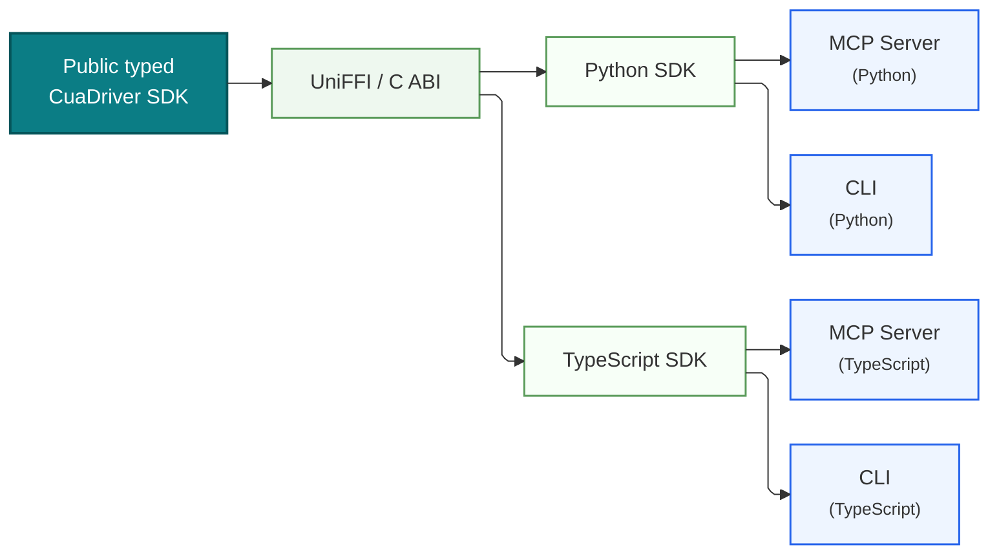

# RFC 2447: CUA Driver: Native Core and MCP Adapter

## Summary

CUA Driver has one public, typed SDK contract above a native core. The native
core is the foundation that owns desktop behavior and the binary interface used
to expose that behavior across language boundaries. The public `CuaDriver` SDK
is the stable application boundary: native applications consume it directly,
and generated Python and TypeScript SDKs consume it through the UniFFI/C ABI.

MCP is downstream of that SDK. An MCP server is an application of the same
public typed contract available to every application; it is not a peer API to
the native core and does not bypass the SDK. HTTP servers, including FastAPI,
Go, and equivalent implementations, occupy the same transport layer as MCP:
they adapt the typed SDK contract for a network protocol rather than defining a
second driver contract.

Light green elements in the diagram are generated code. They show the generated
bridge and language bindings that carry the public SDK contract from the native
implementation into Python and TypeScript.



**Figure 1.** The public typed SDK is the application boundary. Generated
bindings project that contract into Python and TypeScript, where MCP servers,
HTTP servers, CLIs, and other applications consume it.

## Architecture

The diagram is read from the foundation upward:

1. The **native core** implements CUA Driver behavior and remains below the
   public SDK boundary. It is not a transport endpoint.
2. The **public typed `CuaDriver` SDK** is the native-facing contract exposed
   by the core. It defines typed operations, inputs, outputs, errors, and
   lifecycle behavior.
3. The **UniFFI / C ABI** is the generated language bridge from that contract.
   It is light green because it is generated code, not a hand-maintained second
   API.
4. The **Python SDK** and **TypeScript SDK** are generated bindings that expose
   the same public typed contract in their respective languages. They are also
   light green.
5. **MCP servers, HTTP servers, CLIs, and applications** are consumers above
   the SDK. They select a transport or user interface without changing driver
   semantics.

The diagram draws MCP and CLI consumers explicitly. HTTP servers belong at the
same consumer/transport layer: a FastAPI server, a Go HTTP server, or another
HTTP adapter calls the public typed SDK in the same way as an MCP server. The
transport is above the SDK and binary bridge; it does not sit between the SDK
and native core.

## Components

### Native core

The native core is the implementation foundation. It owns platform-specific
work and the internal state needed to perform CUA Driver operations. Its
implementation details and binary protocol are private to the core and SDK
boundary. Consumers do not invoke the core through MCP, HTTP, or a parallel
generic JSON interface.

### Public typed `CuaDriver` SDK

The `CuaDriver` SDK is the canonical public contract. It presents typed
operations to every supported consumer and is the only public path from an
application or adapter to native behavior. A direct native application uses
this SDK without first creating an MCP or HTTP server.

### UniFFI / C ABI

UniFFI and the generated C ABI bridge the native SDK into other languages. This
layer is generated from the SDK contract, preserving one source of truth for
operation types and semantics. It is a binary interoperability layer, not a
network transport and not a public replacement for the SDK.

### Python and TypeScript SDKs

The Python and TypeScript SDKs are generated projections of the public typed
contract. They make the same driver operations available to Python and
TypeScript applications without each language maintaining an independent
protocol definition. Their light green styling identifies them as generated
bindings.

### MCP adapters

A Python or TypeScript MCP server consumes its corresponding generated SDK and
maps typed driver operations to MCP requests and responses. It is downstream of
the embedded SDK: it cannot depend directly on native-core internals or invent
its own driver contract. MCP therefore remains a transport adapter for agents,
not the foundation of application integration.

### HTTP adapters

HTTP servers use the same SDK contract and occupy the same layer as MCP
adapters. A FastAPI, Go, or equivalent server maps typed SDK calls to HTTP
requests and responses. HTTP is chosen for its clients and deployment model;
it does not alter the binary bridge below it or create a separate native-core
interface.

### CLIs and other applications

CLIs and applications are ordinary SDK consumers. They may be written in
Python, TypeScript, or a native language, and they receive the same typed
behavior as transport adapters. A CLI can remain local while an MCP or HTTP
adapter makes the contract available to remote clients.

## Layer Relationships

The dependency direction is fixed:

```text
MCP adapters, HTTP adapters, CLIs, and applications
                         |
                         v
           Public typed CuaDriver SDK
                         |
                         v
          UniFFI / C ABI and generated bindings
                         |
                         v
                    Native core
```

The SDK is the public boundary above the native core. Generated bindings carry
that boundary to Python and TypeScript. MCP and HTTP both sit above those
bindings as optional transports, while native applications can call the SDK
directly. No transport adapter may bypass the SDK to call the native core, and
no adapter defines a second public driver contract.
