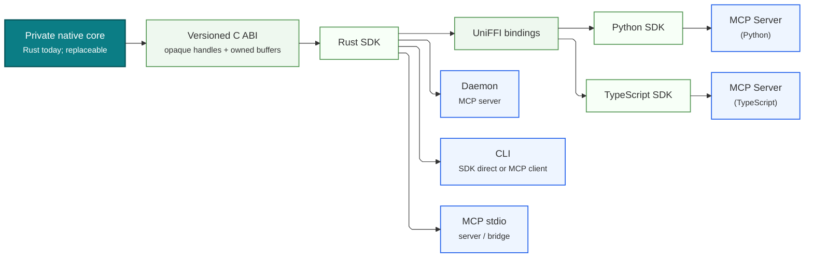

# RFC 2447: CUA Driver: Native Core and MCP Adapter

> **Superseded by [RFC 2549](2549-cua-driver-sdk-owned-runtime.md).**
> RFC 2549 carries forward the typed-contract and native-ABI decisions while
> replacing the runtime-ownership and process-topology guidance.

## Summary

CUA Driver has one public, typed SDK contract above a native core. The native
core is the foundation that owns desktop behavior. A versioned C ABI is the
implementation-substitution seam, while the public `CuaDriver` SDK is the
stable application boundary. The safe Rust SDK and generated Python and
TypeScript SDKs expose the same typed contract above that seam.

MCP is downstream of that SDK. An MCP server is an application of the same
public typed contract available to every application; it is not a peer API to
the native core and does not bypass the SDK. HTTP servers, including FastAPI,
Go, and equivalent implementations, occupy the same transport layer as MCP:
they adapt the typed SDK contract for a network protocol rather than defining a
second driver contract.

Light green elements in the diagram are generated code. They show the generated
bridge and language bindings that carry the public SDK contract from the native
implementation into Python and TypeScript.



**Figure 1.** Every language SDK exposes the same typed application contract.
The versioned C ABI allows the private native core to be replaced without a
source-level rewrite of the safe Rust SDK or downstream Python and TypeScript
applications.
MCP servers and CLIs are downstream consumers; MCP stdio is a server or bridge,
not the product CLI.

## Architecture

The diagram is read from the foundation upward:

1. The **native core** implements CUA Driver behavior and remains below the
   public SDK boundary. It is not a transport endpoint.
2. The **versioned C ABI** is Cua's implementation-substitution seam. It uses
   opaque handles, explicit ownership, and version negotiation.
3. The **safe Rust `CuaDriver` SDK** wraps that ABI and defines typed
   operations, inputs, outputs, errors, and lifecycle behavior.
4. **UniFFI** consumes the safe Rust SDK metadata and generates the Python and
   TypeScript bridge from its canonical typed contract.
5. The **Python SDK** and **TypeScript SDK** are generated bindings that expose
   the same public typed contract in their respective languages. They are also
   light green.
6. **MCP servers, HTTP servers, CLIs, and applications** are consumers above
   the SDK. They select a transport or user interface without changing driver
   semantics.

The diagram draws MCP and CLI consumers explicitly. HTTP servers belong at the
same consumer/transport layer: a FastAPI server, a Go HTTP server, or another
HTTP adapter calls the public typed SDK in the same way as an MCP server. The
transport is above the SDK and binary bridge; it does not sit between the SDK
and native core.

## Components

### Native core

The native core is the implementation foundation. It owns platform-specific
work and the internal state needed to perform CUA Driver operations. Its
implementation details and binary protocol are private to the core and SDK
boundary. Consumers do not invoke the core through MCP, HTTP, or a parallel
generic JSON interface.

### Public typed `CuaDriver` SDK

The `CuaDriver` SDK is the canonical public contract. It presents typed
operations to every supported consumer and is the only public path from an
application or adapter to native behavior. A direct native application uses
this SDK without first creating an MCP or HTTP server.

### Versioned C ABI and UniFFI

The Cua-owned C ABI bridges the replaceable native core to the safe Rust SDK.
UniFFI then generates Python and TypeScript bindings for that same canonical
typed contract. These are binary interoperability layers, not network
transports and not peer driver contracts.

UniFFI's generated C-callable symbols are an implementation detail, not by
themselves Cua's stable ABI. Treating them as stable would require a future Zig,
C++, or other core to reproduce UniFFI checksums, async plumbing, and buffer
conventions. The explicit ABI must instead define opaque driver handles,
version negotiation, owned buffers, error/status mapping, async completion and
cancellation, idempotent destruction, and a rule that native panics never cross
the boundary.

The first implementation keeps the safe Rust SDK and Rust core in one library,
but the safe wrapper imports the versioned exported C symbols instead of
calling private Rust functions. The ABI owns its asynchronous executor, so C,
Python, and TypeScript callers do not need to supply a Tokio runtime. The
distributed C header is generated from the Rust `#[repr(C)]` exports with a
pinned `cbindgen` tool and checked byte-for-byte in CI; it is not a second
hand-maintained declaration. CI compiles a client against that generated header
and exercises version negotiation, ownership, asynchronous completion,
shutdown, and exported-symbol parity. Rust unit tests additionally cover
cancellation and panic containment.

UniFFI still generates the Python and TypeScript binding scaffolding, including
the private FFI symbols those bindings use. That generated scaffolding is not
the implementation-neutral C SDK contract: its symbols and layout are an
internal detail of the UniFFI bindings. The stable `cua_driver_*_v1` header is
therefore generated separately, but from the same Rust implementation, using
`cbindgen`. Neither header nor language bindings are maintained by hand.

### Python and TypeScript SDKs

The Python and TypeScript SDKs are generated projections of the public typed
contract. They make the same driver operations available to Python and
TypeScript applications without each language maintaining an independent
protocol definition. Their light green styling identifies them as generated
bindings.

### MCP adapters

A Python or TypeScript MCP server consumes its corresponding generated SDK and
maps typed driver operations to MCP requests and responses. It is downstream of
the embedded SDK: it cannot depend directly on native-core internals or invent
its own driver contract. MCP therefore remains a transport adapter for agents,
not the foundation of application integration.

### HTTP adapters

HTTP servers use the same SDK contract and occupy the same layer as MCP
adapters. A FastAPI, Go, or equivalent server maps typed SDK calls to HTTP
requests and responses. HTTP is chosen for its clients and deployment model;
it does not alter the binary bridge below it or create a separate native-core
interface.

### CLIs and other applications

CLIs and applications are ordinary SDK consumers. They may be written in
Python, TypeScript, or a native language, and they receive the same typed
behavior as transport adapters. A CLI can remain local while an MCP or HTTP
adapter makes the contract available to remote clients.

`cua-driver mcp` is an MCP stdio server or bridge, not “the CLI” in architecture
terminology. A human/script-oriented CLI either calls the SDK directly or acts
as an MCP client of a daemon, depending on the required permission identity and
lifecycle.

## Layer Relationships

The dependency direction is fixed:

```text
MCP adapters, HTTP adapters, CLIs, and applications
                         |
                         v
          Safe typed CuaDriver SDKs
                         |
                         v
       UniFFI bindings / versioned C ABI
                         |
                         v
                    Native core
```

The SDK is the public boundary above the native core. Generated bindings carry
that boundary to Python and TypeScript, and the safe Rust SDK wraps the same ABI.
MCP and HTTP both sit above those SDKs as optional transports. No transport
adapter may bypass its language SDK to call the ABI or native core, and no
adapter defines a second public driver contract.
