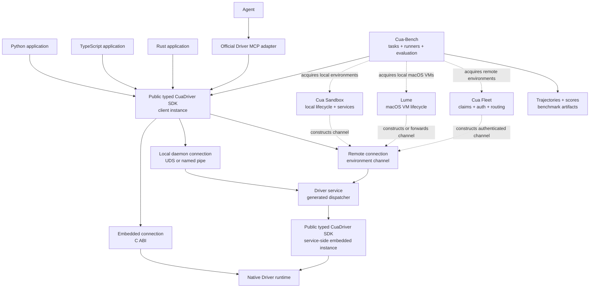
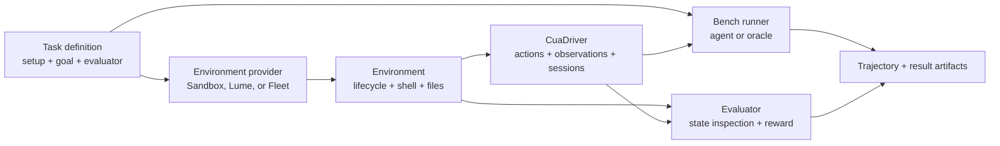

# RFC 2512: Cua Driver convergence across hosts, local sandboxes, Lume, and Fleets

## Summary

Cua should expose one typed `CuaDriver` application contract regardless of
whether it is used by an application, an agent adapter, or Cua-Bench, and
regardless of where the controlled desktop runs:

- the caller's existing host;
- a local Docker, QEMU, or Hyper-V sandbox;
- a local macOS virtual machine managed by Lume; or
- a remote machine obtained through a Cua Fleet claim.

Cua Driver owns desktop perception, actions, sessions, permissions, capability
reporting, and the agent-facing MCP adapter. Cua Sandbox, Lume, and Cua Fleet
own machine lifecycle and environment services such as provisioning, images,
claims, snapshots, shell, files, PTY, and tunnels.

Cua-Bench owns benchmark definitions, task setup, runners, trajectories,
evaluation, scoring, and result artifacts. It acquires environments through
the appropriate environment product and drives native desktop tasks through
the same `CuaDriver` contract used by applications. It does not maintain a
separate native desktop automation implementation.

Environment SDKs return the same generated `CuaDriver` interface to
applications. Internally, the SDK selects a `DriverConnection` appropriate for
the environment: embedded native calls, a local daemon channel, or an
environment-provided authenticated remote channel. Most users never construct
or configure that connection.

The remote request and result envelopes, client dispatch, and server dispatch
must be generated from the canonical Rust Driver contract. They must not be
maintained independently in Python, TypeScript, computer-server, Fleet, or an
MCP schema. MCP remains the application of the typed SDK intended for agents;
it is not the programmatic connection used to manufacture a typed
`CuaDriver`.

computer-server remains during migration as a compatibility service for its
existing `/cmd`, shell, file, PTY, accessibility, and other consumers. Its Cua
Driver backend allows existing GUI calls to converge on Driver behavior while
callers migrate. It is not a new foundational layer, and new desktop behavior
must be implemented in Cua Driver.

## Relationship to RFC 2447

[RFC 2447](2447-cua-driver-native-core-and-mcp-adapter.md) establishes that:

1. the public typed `CuaDriver` SDK is the canonical application contract;
2. a versioned C ABI separates that contract from the replaceable native core;
3. UniFFI generates the language bindings; and
4. MCP, HTTP servers, CLIs, and other applications consume the typed SDK
   downstream.

This RFC does not replace that layering. It extends it across machine
boundaries by defining how an application receives the same typed SDK object
when the native implementation runs in another process, VM, container, or
Fleet machine.

## Motivation

The current product story changes depending on where the desktop runs.

On an existing host, Python and TypeScript applications use the generated Cua
Driver SDK directly. They can create an embedded runtime or connect to a local
daemon.

Local Cua Sandbox runtimes provision a machine and expose a convenient set of
GUI, shell, file, and tunnel interfaces. Their GUI operations currently travel
through computer-server's JSON `/cmd` protocol rather than through the typed
Cua Driver SDK.

Lume provides a strong direct CLI and API for local macOS VM lifecycle.
`cua-sandbox` uses Lume as a runtime, but desktop control inside those VMs still
depends on computer-server. An application using Lume directly cannot obtain a
typed Cua Driver connection to the VM.

Fleet has a generated Rust lifecycle SDK with language bindings, claims,
authentication, routing, and a service proxy. Fleet examples can expose Cua
Driver MCP to agents. However, an external Python or TypeScript application
cannot yet obtain the same typed `CuaDriver` object for a Fleet claim. Other
examples continue to use computer-server or expose both MCP servers, creating
overlapping GUI action spaces.

The result is four avoidable problems:

1. **Interface divergence.** Application code must change with the execution
   environment.
2. **Behavioral duplication.** Cua Driver, computer-server, and two MCP
   vocabularies can all claim to control the same desktop.
3. **Per-language risk.** A remote Python client and a remote TypeScript client
   could become independently maintained protocol implementations.
4. **Unclear ownership.** Environment lifecycle, guest services, desktop
   behavior, and agent transport are not consistently separated.

Convergence is needed before the compatibility paths become de facto permanent
public architecture.

## Goals

- Expose the same generated `CuaDriver` methods and result types for embedded,
  local-daemon, local-sandbox, Lume, and Fleet execution.
- Let environment SDKs return a ready-to-use Driver without requiring users to
  understand an internal channel, RPC protocol, service port, or MCP.
- Generate the remote wire envelopes and dispatchers from the canonical Rust
  contract.
- Keep Cua Driver responsible for desktop semantics across every environment.
- Keep Sandbox, Lume, and Fleet responsible for machine lifecycle and
  environment-specific routing.
- Preserve an explicit separation between GUI control and environment services
  such as shell, files, PTY, tunnels, snapshots, and claims.
- Make Cua-Bench a first-class consumer of the same Driver and environment
  boundaries, so a task can move between a local sandbox and Fleet without
  changing its desktop action contract.
- Keep MCP as the official agent-facing adapter downstream of the typed SDK.
- Define ownership, cleanup, cancellation, retry, version negotiation, and
  stale-handle behavior.
- Preserve existing consumers during an incremental computer-server migration.
- Prove behavior on macOS, Windows, and Linux with shared application-level
  tests.
- Establish safe authentication, permission-identity, telemetry, and
  observability boundaries.

## Non-goals

- Adding VM lifecycle, Fleet claims, shell, files, PTY, tunnels, snapshots, or
  package installation to the Cua Driver contract.
- Making Cua Driver depend on Cua Sandbox, Lume, or Cua Fleet.
- Replacing Lume's direct CLI or requiring all Lume users to adopt Cua
  Sandbox.
- Requiring application SDK clients to speak MCP.
- Removing computer-server before its current consumers have a compatible
  replacement.
- Standardizing every environment service behind one universal protocol.
- Exposing a desktop-control service on an unauthenticated public interface.
- Guaranteeing that every environment offers every non-Driver service.
- Defining Fleet scheduling, image formats, pool semantics, or pricing.
- Redesigning Cua-Bench task definitions, evaluators, reward models, simulated
  browser environments, or trace formats except where they depend directly on
  the native desktop session boundary.

## Terminology

### Cua Driver

The public typed computer-use SDK and its native implementation. It owns
desktop sessions, capture, accessibility and browser targeting where supported,
input delivery, capability reporting, and normalized results.

### Driver connection

The internal mechanism used by a `CuaDriver` object to invoke the canonical
Driver implementation.

A connection may be:

- **embedded**, invoking the native core through the versioned C ABI in the
  caller's process;
- **local daemon**, invoking a stable local process identity through a Unix
  socket or Windows named pipe; or
- **remote**, sending generated Driver envelopes through a channel supplied by
  an environment.

`DriverConnection` is explanatory architecture terminology. It does not imply
that users must instantiate a public class with that name.

### Driver channel

The small internal callback used by a remote Driver connection to exchange
bytes with a remote Driver service. A Fleet channel uses Fleet's authenticated
service proxy. A local Sandbox or Lume channel may use a private socket,
loopback port, VM tunnel, or runtime-native forwarding.

The channel transports Driver envelopes but does not interpret clicks,
screenshots, session policy, or other computer-use semantics.

### Environment

The machine or isolated execution context containing the controlled desktop.
Examples include a Docker container, QEMU VM, Lume macOS VM, and Fleet claim.

### Environment SDK

The API responsible for creating, claiming, finding, and cleaning up an
environment. Cua Sandbox and Cua Fleet are environment SDKs. Lume is a
lower-level VM runtime and CLI.

### Driver service

The official process inside an environment that consumes generated Driver
request envelopes through the public typed SDK and returns generated result
envelopes. It may also expose the official Driver MCP adapter for agents.

### Environment services

Capabilities belonging to the machine rather than to desktop automation:
shell, files, PTY, tunnels, images, snapshots, process management, provisioning,
claims, renewal, and cleanup.

### Evaluation harness

Cua-Bench's task runner, task setup, agent or oracle execution, trajectory
collection, evaluator, and reward aggregation. It consumes an environment and
its Driver; it does not own either implementation.

## Current state

### Cua Driver

The Rust Driver SDK currently has two execution backends:

- embedded native execution through the versioned ABI; and
- a local daemon connection over a Unix socket or Windows named pipe.

The generated Python and TypeScript SDKs expose the public typed application
contract. The SDK also has generic tool discovery and invocation for tools that
have not yet received dedicated convenience methods.

The Driver HTTP MCP adapter binds to loopback. That is appropriate for a local
agent adapter, but it is not an authenticated application connection for
another machine.

There is no remote typed Driver backend today.

### computer-server

computer-server exposes an HTTP `/cmd` API, WebSockets, PTY, shell, files,
accessibility, window management, and its own MCP vocabulary.

Its optional `cua-driver` backend replaces the automation handler with the
generated Python Driver SDK. It currently delegates capture and common input
operations to Cua Driver and falls back to native computer-server behavior for
operations outside that portable subset. Other handler families remain owned
by computer-server.

This backend is a valuable migration adapter because it can make existing
`/cmd` consumers execute Driver behavior without an immediate API migration.
It is not enabled as the canonical backend in all current Sandbox and VM
images.

### Cua Sandbox

Cua Sandbox chooses a local runtime such as Docker, QEMU, Hyper-V, or Lume,
then exposes environment and GUI interfaces.

Its local GUI transports currently call computer-server. Its Fleet transport
uses the generated Fleet SDK for provisioning and authenticated service
routing, but the routed guest service is still computer-server on port 8000.

Cua Sandbox does not currently expose a typed `sandbox.driver()` handle.

### Lume

Lume owns local macOS VM creation, images, cloning, start, stop, networking,
SSH, and API/CLI lifecycle. It is usable directly and is also a runtime beneath
Cua Sandbox.

The current Sandbox Lume integration starts and configures computer-server
inside the guest. A direct Lume user has no standard host-side route for
obtaining a typed `CuaDriver` object connected to the guest.

### Cua Fleet

The Fleet Rust SDK owns pools, claims, authentication, token refresh, routing,
service proxy requests, retention, renewal, and cleanup. Its generated language
bindings already demonstrate the intended pattern for providing foreign HTTP
and token-provider callbacks to a canonical Rust implementation.

Current examples demonstrate:

- remote Driver MCP for agents;
- remote computer-server MCP;
- both MCP servers exposed against the same desktop; and
- programmatic control through the older computer client and computer-server.

They do not demonstrate an external application receiving a generated Python
or TypeScript `CuaDriver` object for a claim.

### Cua-Bench

Cua-Bench defines a provider-neutral desktop session protocol and supports
simulated and native tasks. Native sessions currently use the older Computer
SDK and computer-server for lifecycle and desktop actions. Its local providers
also manage Docker and QEMU environments directly.

This gives Bench portability at its own abstraction boundary, but it also makes
Bench another place where machine provisioning and desktop control are
combined. Bench does not yet consume the generated Cua Driver SDK as its
canonical native desktop session.

The convergence preserves task, oracle, evaluator, and scoring contracts. Only
native environment acquisition and desktop control need to migrate.

## Proposed ownership model

### Cua Driver owns computer use

Cua Driver owns:

- operation names and typed inputs and results;
- tool discovery and capability metadata;
- desktop and window capture semantics;
- accessibility and browser targeting where supported;
- mouse, keyboard, text, scroll, hotkey, and related actions;
- sessions and capture-scope policy;
- permission diagnostics;
- error normalization;
- operation cancellation and deadlines;
- the native platform implementation; and
- the official MCP adapter for agents.

No environment SDK, proxy, image, or compatibility service defines a parallel
meaning for a Driver operation.

### Cua Sandbox owns local isolated environments

Cua Sandbox owns:

- selection and lifecycle of Docker, QEMU, Hyper-V, Lume, and other local
  runtimes;
- images and environment configuration;
- shell, files, PTY, tunnels, snapshots, and other environment services;
- installation and health checking of the guest Driver service; and
- construction of a typed Driver handle connected to that environment.

Cua Sandbox may preserve its high-level mouse, keyboard, and screen facades for
compatibility. Their implementation should converge on the Driver handle.

### Lume owns local macOS VM lifecycle

Lume remains independently useful. It owns:

- macOS VM lifecycle;
- images, disks, cloning, and virtualization;
- networking and SSH;
- CLI and runtime APIs; and
- optional private forwarding to a guest service.

Lume does not define desktop action semantics. A direct Lume user may:

1. run application code inside the guest and call `CuaDriver.create()`; or
2. connect from the host through an official Driver channel exposed for that
   VM.

Cua Sandbox may automate the second route, but the underlying Lume CLI remains
available without Sandbox.

### Cua Fleet owns remote environment lifecycle

Cua Fleet owns:

- authentication and token refresh;
- pools, claims, binding, renewal, release, and retention;
- service discovery and authenticated routing;
- deadlines and control-plane errors; and
- construction of a typed Driver handle connected to a claimed environment.

Fleet does not own or translate Driver operation semantics. Its channel moves
opaque, versioned Driver envelopes to the named Driver service.

### computer-server owns compatibility

computer-server continues to own its existing non-Driver environment services
until those services are deliberately extracted or replaced. Its GUI endpoints
become compatibility projections over Cua Driver.

New Driver actions and semantics must not be implemented first in
computer-server. New consumers should use the typed Driver SDK or the official
Driver MCP adapter.

### Cua-Bench owns evaluation

Cua-Bench owns:

- task definitions and variants;
- task setup;
- agent and oracle execution;
- trajectories and reproducibility metadata;
- evaluators and rewards;
- batch scheduling at the benchmark layer; and
- benchmark result artifacts.

For native tasks, Bench obtains an environment through Cua Sandbox, Lume, or
Cua Fleet and obtains the typed Driver associated with that environment.
Desktop actions and observations use Driver. Shell, files, snapshots, resets,
and other setup or evaluation operations use environment services.

Bench may keep its task-facing `DesktopSession` protocol when that protocol
adds evaluation-specific composition. Its native implementation must delegate
Driver operations to `CuaDriver` rather than project the older Computer SDK.
Simulated Playwright-based tasks remain outside this requirement.

## Architecture



The client and service use separate instances of the same public typed SDK.
The service-side instance always selects embedded native execution; it does not
open another remote connection.

## Public application model

### Existing host

The existing API remains:

```python
from cua_driver import CuaDriver

driver = CuaDriver.create()
state = await driver.get_desktop_state(...)
```

Applications that need a stable OS permission identity may continue to connect
to the local daemon.

### Local Cua Sandbox

Target API:

```python
from cua_sandbox import Sandbox

async with Sandbox.local(image="cua-ubuntu") as sandbox:
    driver = await sandbox.driver()

    session = await driver.start_session(...)
    state = await driver.get_desktop_state(...)
    await driver.click(...)

    result = await sandbox.shell.run("uname -a")
```

The returned object is the generated `cua_driver.CuaDriver`, not a separately
maintained Sandbox Driver client. Shell remains an environment interface.

The exact constructor names above are illustrative. This RFC standardizes the
ownership and returned Driver type, not the spelling of current Sandbox
creation APIs.

### Direct Lume

The direct Lume story remains lifecycle-first:

```text
lume creates or starts the macOS VM
    -> the guest runs the official Driver service
    -> Lume exposes a private connection descriptor or forwarding route
    -> the application obtains a typed CuaDriver
```

Application code running inside the guest uses `CuaDriver.create()` and avoids
a remote channel entirely.

Host-side applications use a small Lume integration package or helper to build
the Driver connection. They do not send desktop commands through Lume's VM API.

This RFC does not require the Lume CLI itself to become a Python SDK. It
requires that a Lume-managed VM have a documented, secure route to the same
Driver contract.

### Cua Fleet

Target API:

```python
from cua_fleet import Fleet

async with Fleet().claim(pool="desktop") as machine:
    driver = await machine.driver()

    session = await driver.start_session(...)
    state = await driver.get_desktop_state(...)
    await driver.click(...)
```

The corresponding TypeScript API returns the generated
`@trycua/cua-driver` object or its public interface.

The claim remains the owner of machine lifecycle. Closing a Driver does not
implicitly release the claim. Releasing the claim invalidates every Driver
created from it.

### Cua-Bench

Target composition:

```python
async with bench.acquire_environment(task) as environment:
    driver = await environment.driver()
    session = NativeDesktopSession(
        driver=driver,
        shell=environment.shell,
        files=environment.files,
    )

    trajectory = await bench.run(task, session)
    reward = await bench.evaluate(task, session, trajectory)
```

The names are illustrative. The required properties are:

- Bench chooses or receives an environment provider;
- the environment supplies the standard Driver and any setup or evaluation
  services;
- the task-facing session does not know whether the environment is local or a
  Fleet claim;
- actions and observations have Driver semantics;
- environment reset and teardown remain provider responsibilities; and
- evaluation output remains owned by Bench.

This creates a useful certification role for Cua-Bench: selected conformance
tasks can run the same action and observation expectations across Driver
connection modes and platforms. Product E2E tests remain required; benchmark
scores do not replace deterministic SDK tests.

## Internal Driver connection model

Conceptually, the safe Rust SDK gains a third backend:

```text
DriverBackend
├── Embedded
├── LocalDaemon
└── Remote
```

The final Rust names may differ. These are not intended as user-facing Python
or TypeScript configuration choices.

### Remote channel boundary

The remote backend receives an asynchronous channel with a minimal
responsibility:

```text
send(versioned_driver_request_bytes, deadline, cancellation)
    -> versioned_driver_response_bytes
```

The boundary must support:

- request and response bytes;
- a request identifier;
- an absolute deadline or remaining timeout;
- cancellation where the host language supports it;
- structured transport errors;
- connection metadata required for version and capability negotiation; and
- safe concurrent calls when permitted by Driver session policy.

The channel must not expose one method per Driver tool. A per-tool foreign trait
would reintroduce manual parity work in every environment binding.

### Generated remote protocol

The remote wire protocol must be generated from the canonical Rust Driver
contract.

Generation covers:

- operation identifiers;
- request payload types;
- result payload types;
- error envelopes;
- protocol version metadata;
- capability metadata;
- client serialization and deserialization;
- server dispatch; and
- parity fixtures used in Rust, Python, and TypeScript tests.

The generated protocol is an implementation detail beneath `CuaDriver`.
Applications use typed SDK methods rather than constructing envelopes.

The implementation should not declare the current daemon NDJSON frames stable
without first auditing them for:

- version negotiation;
- request IDs and duplicate detection;
- cancellation;
- deadlines;
- streaming or large payload behavior;
- structured error compatibility;
- capability negotiation; and
- forward-compatible unknown fields and operations.

The implementation may evolve the daemon to use the same generated envelopes,
but local-daemon compatibility must be preserved during rollout.

### Service adapter

The Driver service consumes the same typed SDK contract as any other
application. Its dispatcher:

1. authenticates and authorizes the environment connection;
2. parses and validates a generated request envelope;
3. applies a deadline and cancellation token;
4. invokes the embedded typed `CuaDriver`;
5. serializes the generated result or error envelope; and
6. emits content-free operation telemetry.

The dispatcher must be generated or mechanically exhaustive so that CI can
prove parity with the exported SDK contract.

### MCP adapter

MCP remains separately downstream:

```text
agent -> MCP protocol -> official MCP adapter -> typed CuaDriver
```

MCP and the remote application channel may share the same native runtime and
session manager, but the typed SDK must not be implemented as a client wrapper
around MCP.

This distinction provides:

- typed generated APIs for applications;
- an ecosystem-standard protocol for agents;
- one native behavior implementation; and
- independent evolution of agent protocol framing and application transport.

## Environment composition

### Sandbox composition

Each Sandbox runtime provides a private route to the guest Driver service:

| Runtime | Candidate route                          | Required property            |
| ------- | ---------------------------------------- | ---------------------------- |
| Docker  | private mapped loopback port or socket   | not exposed publicly         |
| QEMU    | runtime port forwarding or guest channel | scoped to VM                 |
| Hyper-V | runtime forwarding or private network    | interactive-session aware    |
| Lume    | VM forwarding, tunnel, or local proxy    | preserves guest TCC identity |
| Fleet   | authenticated `service_request` channel  | scoped to active claim       |

The route is an implementation choice. The public result remains a
`CuaDriver`.

### Lume composition

A Lume image intended for Driver use must provide:

- an installed, version-compatible Driver service;
- a stable guest identity suitable for macOS permissions;
- a logged-in graphical session;
- health and protocol-capability reporting;
- a private host-to-guest route; and
- cleanup behavior when the VM stops.

The host should not attempt to reuse the host application's TCC grants for
guest control. The relevant identity is the process inside the VM.

### Fleet composition

A Fleet image advertises a named Driver service with:

- a health endpoint that does not expose desktop contents;
- supported Driver protocol and capability versions;
- an authenticated invocation route;
- an interactive graphical session; and
- shutdown hooks bound to claim lifecycle.

The Fleet SDK constructs a remote Driver channel using its existing service
proxy. It may implement the generated foreign callback in Python and
TypeScript while authentication, refresh, path validation, and routing remain
in the canonical Fleet SDK.

Fleet must not deserialize or reinterpret Driver request payloads.

### Bench composition

Bench separates three concerns:



Setup and evaluation may use environment services when the task contract
requires filesystem or process inspection. Agent desktop control uses Driver
or Driver MCP. An evaluator should prefer state-based evidence over replaying
or depending on a particular action sequence.

## Lifecycle and ownership

### Environment outlives Driver handles

The environment handle owns the machine. A Driver handle borrows access to it.

- Closing a Driver ends its sessions and frees client resources.
- Closing a Driver does not stop a Sandbox or release a Fleet claim.
- Stopping a Sandbox, stopping a Lume VM, or releasing a Fleet claim invalidates
  every derived Driver handle.
- An invalidated handle returns a stable `EnvironmentUnavailable` or
  `StaleConnection` error rather than reconnecting to a potentially different
  machine.

### Claim and generation identity

Every remote connection is bound to an immutable environment generation:

- Fleet claim ID and binding generation;
- Sandbox instance ID;
- Lume VM instance and boot generation; or
- equivalent runtime identity.

Reusing a machine name, pool member, socket path, or forwarded port must not
make an old Driver handle silently control a new environment.

### Sessions

Driver sessions retain the semantics established by the typed Driver contract:

- explicit start and end;
- capture scope selected per session;
- recordings and session resources cleaned on end;
- idempotent end;
- automatic best-effort end when a Driver closes; and
- forced server-side cleanup when the environment ends.

An environment may allow multiple Driver objects, but concurrency against one
interactive desktop must follow an explicit session policy. The first rollout
should default to one active controlling session per environment unless a
platform implementation proves stronger isolation.

### Deadlines and cancellation

Every remote call carries a deadline. The client, proxy, service, and native
operation all observe the same remaining budget.

Cancellation is best effort for an operation already executing in the OS. The
result must distinguish:

- canceled before dispatch;
- canceled during execution;
- timed out with outcome unknown; and
- completed before cancellation was observed.

### Retries and idempotency

Observation calls may be retried only when the SDK knows they were not
dispatched or the operation is explicitly marked retry-safe.

Input actions are not automatically retried after an ambiguous transport
failure. A repeated click, keypress, or typed string can cause real unintended
behavior.

Requests carry unique IDs. The service keeps a bounded duplicate-response cache
for operations that reach dispatch, allowing the transport to recover a known
result without executing the action twice.

## Capability and version negotiation

The connection handshake reports:

- remote protocol major and minor version;
- Driver SDK and native runtime versions;
- platform and interactive-session state;
- supported typed operations;
- supported capture scopes and delivery modes;
- optional features such as accessibility or browser targeting;
- maximum request and response sizes; and
- relevant non-sensitive permission readiness.

A major protocol mismatch fails before the first action. A minor mismatch may
continue when required operations and envelope fields are compatible.

Environment SDKs must not claim a ready Driver until:

1. the environment is running;
2. the graphical session is ready;
3. the Driver service is healthy;
4. authentication is established;
5. protocol negotiation succeeds; and
6. requested mandatory capabilities are present.

## Errors

The public SDK normalizes native, connection, environment, and protocol
failures into stable typed categories:

- `PermissionDenied`;
- `UnsupportedOperation`;
- `InvalidSession`;
- `EnvironmentUnavailable`;
- `StaleConnection`;
- `AuthenticationFailed`;
- `ProtocolMismatch`;
- `DeadlineExceeded`;
- `Canceled`;
- `TransportFailure`;
- `OutcomeUnknown`; and
- `InternalError`.

Environment-specific details may appear in a sanitized diagnostic field.
Callers must not need to parse HTTP codes, MCP errors, computer-server strings,
or Fleet proxy responses to determine the category.

## Authentication and authorization

### Default binding

The Driver service remains loopback-only or bound to a private runtime channel
by default. Enabling a non-loopback listener requires explicit authenticated
configuration.

### Environment-scoped authority

A remote credential must authorize:

- one environment or claim;
- one service;
- a bounded lifetime;
- an explicit set of Driver operations or a declared full-control scope; and
- the active environment generation.

A general Fleet control-plane bearer must not automatically become an
unbounded reusable guest Driver credential. The Fleet proxy may authenticate
the caller and inject a claim-scoped service identity, or it may carry a
separately issued service token. The final mechanism must preserve end-to-end
claim scoping and refresh.

### Secret handling

Credentials must not appear in:

- command lines visible to other processes;
- request or result payload logs;
- screenshots or accessibility output;
- telemetry dimensions;
- exception strings returned to applications;
- image layers; or
- persisted connection descriptors.

### Authorization failure

Authentication and stale-claim checks occur before parsing or dispatching a
desktop action. Releasing a claim or stopping an environment revokes future
Driver calls promptly.

## Platform requirements

### macOS

The process that performs capture, accessibility, and input inside macOS must
have a stable, signed identity compatible with TCC.

For a Lume VM:

- permissions belong to the guest process;
- a host application cannot lend its TCC grants across the VM boundary;
- the Driver service must run in the logged-in guest GUI session;
- rebuilding or changing the guest executable identity must not be part of
  normal connection setup; and
- E2E images must document or automate safe guest-local permission readiness.

### Windows

Desktop automation must run in the intended logged-in interactive user
session. A service isolated in Session 0 cannot provide representative GUI
behavior.

The environment image must arrange an interactive host process or equivalent
session bridge. Fleet claim readiness includes verification that the interactive
session and Driver service are associated correctly.

### Linux

The Driver service must bind to the intended display server and user session.
Readiness includes display availability, session ownership, and required input
and capture facilities.

Containers and VMs must not accidentally bind to the host's real display unless
that is the explicit environment configuration.

## Observability and telemetry

Allowed operational telemetry includes:

- SDK language and version;
- native runtime version;
- connection mode: embedded, local daemon, local sandbox, Lume, or Fleet;
- platform;
- protocol and capability versions;
- operation identifier;
- latency buckets;
- success or normalized error category;
- cancellation and deadline outcomes;
- retry/deduplication outcome; and
- lifecycle cleanup outcome.

Telemetry must not contain:

- screenshots or encoded image bytes;
- accessibility trees;
- OCR or visible text;
- typed strings, key contents, or clipboard data;
- mouse coordinates when they could fingerprint content layout;
- shell commands or output;
- file names or contents;
- machine, pool, claim, customer, or user names;
- tokens or connection descriptors;
- raw request or result payloads; or
- persistent identifiers that allow reconstructing an individual desktop
  session.

Debug logs that developers explicitly enable may contain sanitized structural
metadata, but content-bearing payload logging remains opt-in, local, and
clearly warned.

## computer-server convergence

### Why it remains temporarily

computer-server provides working compatibility surfaces beyond Driver's
deliberate scope:

- `/cmd` clients;
- shell and command execution;
- files;
- PTY and WebSockets;
- existing Sandbox integrations;
- accessibility and window endpoints not yet projected through typed Driver
  methods; and
- legacy MCP clients.

Removing it before consumers migrate would cause unnecessary breakage.

### Why it is not the foundation

Making computer-server foundational would:

- put a Python process beneath the native typed SDK;
- preserve a separately maintained JSON operation contract;
- keep two MCP vocabularies;
- require Driver behavior to be translated through legacy handler families;
- create another place for platform semantics to diverge; and
- make embedded applications depend on an unnecessary server.

### Migration role

During migration:

1. images install Cua Driver and the computer-server Driver extra;
2. computer-server starts with its Cua Driver automation backend;
3. existing `/cmd` GUI calls execute through the typed Driver SDK;
4. Sandbox gains a direct typed Driver handle;
5. Sandbox GUI facades migrate to the handle;
6. examples stop exposing duplicate GUI MCP servers; and
7. computer-server GUI and MCP compatibility surfaces enter documented
   deprecation.

Non-GUI environment services may remain in computer-server or move into a
smaller environment agent through a separate decision. They must not be moved
into Cua Driver merely to accelerate removal.

## Alternatives considered

### Use MCP as the remote application connection

MCP is already language-neutral and available for agents.

It is not selected as the typed application connection because:

- applications would receive generic tool calls instead of generated methods
  and types;
- SDK lifecycle and error semantics would need translation through MCP;
- MCP task, resource, and transport evolution is independent of Driver ABI
  evolution;
- local embedded applications gain no benefit from routing through MCP; and
- using MCP beneath the SDK reverses the dependency direction established by
  RFC 2447.

MCP remains the preferred agent interface.

### Maintain remote clients separately in Python and TypeScript

This can produce a quick prototype, but every new operation, result type,
error, lifecycle rule, and version field would require parallel bookkeeping.
It recreates the problem solved by Rust contracts and generated bindings.

### Keep computer-server `/cmd` permanently

This preserves all existing consumers and offers environment services in one
process. It is not selected because `/cmd` is a second computer-use contract
with different types, errors, sessions, and release cadence.

computer-server remains a compatibility adapter, not the canonical Driver
connection.

### Put Cua Driver operations in the Fleet SDK

The Fleet SDK could expose `click`, `screenshot`, and other methods itself.
That would couple Fleet releases to Driver semantics and would not solve local
Sandbox or Lume composition.

Fleet instead returns or constructs the canonical Driver object.

### Require application code to run inside the guest

In-guest code can use embedded `CuaDriver.create()` and is the simplest option
for many workloads. It does not cover controller-side applications,
orchestrators managing multiple machines, or users who expect the Fleet or
Sandbox SDK to return a controllable machine.

It remains supported but is not the only route.

### Expose the native C ABI across the network

The C ABI is an in-process binary boundary, not a network protocol. Exposing it
remotely would not provide framing, authentication, versioned messages,
deadlines, cancellation, or safe platform-neutral ownership.

### Let each runtime choose its own remote protocol

Docker sockets, Lume forwarding, and Fleet proxies naturally differ. Their
outer routing may differ, but the transported Driver envelopes and public SDK
semantics must remain common. Allowing different Driver protocols per runtime
would prevent parity testing and cross-environment application reuse.

## Compatibility and migration

The proposal is additive at the public SDK boundary:

- embedded creation remains supported;
- local daemon connection remains supported;
- computer-server `/cmd` remains supported during migration;
- existing Sandbox GUI facades remain supported; and
- existing MCP agent integrations remain supported.

### Phase 0: contract and evidence

- Accept this RFC.
- Inventory every Driver tool, computer-server action, Sandbox GUI facade,
  image, and Fleet example.
- Mark each surface canonical, compatibility, or environment-only.
- Add generated-contract parity checks for the existing SDK.

**Gate:** reviewers agree on ownership, protocol generation, credential model,
and lifecycle semantics.

### Phase 1: generated remote vertical slice

- Generate a versioned remote envelope and exhaustive server dispatcher from
  the Rust Driver contract.
- Add the internal remote Driver connection and foreign channel callback.
- Add an authenticated Driver service invocation endpoint.
- Implement a Fleet-backed channel using the generated Fleet SDK's
  `service_request`.
- Exercise sessions, desktop state, screenshot, click, typing, and cleanup in
  Python and TypeScript.

**Gate:** one shared scenario produces compatible typed results against
embedded Driver and a Fleet claim.

**Rollback:** disable the new Driver service and continue using the existing
MCP or computer-server routes.

### Phase 2: image convergence

- Install Cua Driver in representative Linux, Windows, and macOS images.
- Start the Driver service in the correct graphical session.
- Enable computer-server's Cua Driver backend for compatibility.
- Advertise health, protocol, capability, and permission readiness.

**Gate:** existing Sandbox and computer-server suites pass without API changes,
and direct Driver E2E passes on representative images.

**Rollback:** select the previous computer-server backend and image version.

### Phase 3: environment SDK composition

- Add the typed Driver accessor to local Sandbox runtimes.
- Add the typed Driver accessor to Fleet claims.
- Add the documented direct-Lume connection route.
- Bind handles to environment generation and lifecycle.
- Preserve shell, files, PTY, and tunnels as environment services.
- Add a Bench native-session adapter that composes Driver with environment
  services without changing task and evaluator contracts.

**Gate:** the same application scenario runs against host, Docker/QEMU, Lume,
and Fleet with only environment acquisition changing. A representative native
Bench task runs locally and on Fleet through the same task-facing session.

### Phase 4: facade migration

- Reimplement Sandbox mouse, keyboard, and screen facades on the Driver handle.
- Expand generated typed Driver convenience methods where generic `call_tool`
  remains the only route for canonical desktop capabilities.
- Update examples to select one GUI contract.
- Deprecate computer-server's GUI MCP vocabulary.
- Migrate Bench's native Computer SDK projection to the typed Driver adapter.

**Gate:** repository consumers no longer require computer-server for canonical
GUI semantics.

### Phase 5: environment-service extraction and retirement

- Decide the long-term owner of shell, files, PTY, and other remaining
  computer-server services.
- Remove duplicate GUI implementations after a documented deprecation period.
- Retain or retire the local daemon compatibility path based on real host
  permission and lifecycle needs.

**Gate:** removal has usage evidence, migration documentation, and a tested
rollback release.

## Release sequencing

Each phase should be independently releasable:

1. Cua Driver minor release for the generated remote connection and service.
2. Fleet SDK and environment image releases adding the Driver service route.
3. Cua Sandbox minor release adding the Driver accessor.
4. Documentation and examples after packages and images are published.
5. Deprecation releases before any removal.

Package documentation must not advertise a phase until its published Python
and TypeScript artifacts and at least one supported image pass the public E2E
scenario.

Breaking removals require their own RFC amendment or implementation proposal
when the compatibility inventory is known.

## Test and acceptance plan

### Shared behavioral scenario

One parameterized scenario must run against:

- embedded Driver on a supported host;
- local daemon Driver;
- a Linux Docker or QEMU Sandbox;
- a Lume macOS VM;
- a Linux Fleet claim;
- a Windows Fleet claim; and
- a native Cua-Bench task using both a local provider and a Fleet provider.

The scenario must verify:

- connection and capability negotiation;
- session start and end;
- capture scope;
- desktop state and screenshot;
- click and pointer movement;
- text entry;
- scroll;
- hotkey;
- normalized errors;
- cancellation;
- deadline handling;
- cleanup; and
- stale-handle rejection after environment shutdown or claim release.

### Language parity

- Rust tests validate native and generated dispatcher exhaustiveness.
- Python runs the complete scenario.
- TypeScript runs the complete Fleet scenario plus generated type compilation.
- Wire fixtures generated in Rust are consumed by Python and TypeScript tests.
- CI fails when an exported Driver operation lacks a remote request, result,
  dispatcher case, or parity fixture.

### Protocol tests

- compatible minor versions;
- incompatible major versions;
- unknown optional fields;
- unknown operations;
- malformed envelopes;
- oversized requests and screenshots;
- duplicate request IDs;
- pre-dispatch transport failure;
- post-dispatch ambiguous failure;
- retry-safe observations;
- non-retry-safe input actions;
- cancellation before and during dispatch; and
- concurrent calls under the declared session policy.

### Lifecycle tests

- Driver close ends owned sessions but does not release the environment.
- Environment close invalidates every Driver handle.
- Fleet renewal preserves handles for the same claim generation.
- Fleet release rejects future calls promptly.
- Recycled machine names and forwarded ports do not revive stale handles.
- Guest Driver processes, recordings, sockets, ports, and credentials do not
  leak after cleanup.

### Security tests

- no unauthenticated non-loopback service;
- credential scope is limited to the environment generation;
- expired and revoked credentials fail before dispatch;
- token refresh does not duplicate an input action;
- logs and telemetry contain no content-bearing payloads;
- proxy and service reject cross-claim routing;
- local containers do not expose the Driver service beyond their intended
  interface; and
- malformed input cannot cause native panic to cross the service boundary.

### Platform tests

#### macOS

- stable guest executable identity;
- Screen Recording and Accessibility readiness;
- correct logged-in user session;
- desktop capture;
- input delivery;
- Lume stop and restart generation handling; and
- no reliance on host TCC grants.

#### Windows

- interactive desktop rather than Session 0;
- capture and input in the claimed user session;
- reconnect after transient service restart without crossing claim generation;
- named-pipe local daemon compatibility; and
- cleanup on claim release.

#### Linux

- correct display and user session;
- container and VM isolation;
- Wayland/X11 behavior where declared supported;
- capture and input;
- process cleanup; and
- no accidental host display binding.

### Compatibility tests

- existing computer-server `/cmd` consumers pass with the Driver backend;
- current Sandbox GUI facades pass before and after their internal migration;
- official Driver MCP tools report behavior compatible with typed SDK calls;
- shell, files, PTY, and tunnels remain available through environment services;
- older images fail with a clear capability error rather than hanging; and
- rollback to the previous image/backend remains tested until deprecation ends;
- existing Cua-Bench task definitions, oracle execution, evaluators, rewards,
  and result formats remain compatible when the native session adapter changes;
  and
- simulated Cua-Bench sessions remain unaffected.

### Bench portability tests

- One native task definition runs against local Docker and Fleet without
  changing its action or observation calls.
- One macOS task runs through a Lume-backed environment when its required
  application is available.
- Task setup and evaluators receive only the environment services they declare.
- Bench records the Driver, environment, image, protocol, and capability
  versions needed for reproducibility without recording secrets or desktop
  content as telemetry.
- Environment teardown occurs after evaluation and artifact persistence.
- A failed evaluator cannot leak the environment or active Driver session.
- Deterministic Driver conformance tasks remain separate from model-quality
  benchmark aggregation.

## Documentation plan

Documentation follows the product ownership model:

### Tutorials

- Drive a first application on the host with Cua Driver.
- Drive the same scenario in a local Sandbox.
- Drive a local macOS sandbox through Lume and Cua Driver.
- Drive a claimed Fleet machine with the Python and TypeScript Cua Driver SDKs
  after the Fleet surface is published.
- Run the same Cua-Bench native task locally and on Fleet after both provider
  routes are released.

### How-to guides

- Select embedded, daemon, or environment-hosted execution.
- Configure a Sandbox image with the Driver service.
- Configure a Lume VM with stable guest permission identity.
- Diagnose connection, capability, authentication, and graphical-session
  failures.
- Migrate computer-server GUI calls to Cua Driver.
- Migrate a native Cua-Bench session provider to the standard Driver and
  environment boundaries.

### Concepts

- Driver versus environment lifecycle.
- Application SDK versus agent MCP.
- Embedded, daemon, and remote Driver connections.
- Permission identity across hosts and guests.
- Session ownership, claims, and stale handles.
- How Cua-Bench composes tasks, environments, Driver sessions, and evaluators.

### Reference

- generated Driver Python, TypeScript, and Rust APIs;
- environment `driver()` accessors;
- protocol and capability versions;
- normalized errors;
- telemetry fields and exclusions; and
- compatibility and deprecation status.

Fleet documentation should not be published as a finished user path until the
public Fleet packages, image, and typed Driver E2E are available.

## Implementation ownership boundaries

The work should remain separable:

- **Cua Driver:** generated protocol, remote connection, dispatcher, service,
  typed errors, capability negotiation, and Driver telemetry.
- **Cua Fleet:** claim-scoped authenticated channel, lifecycle invalidation,
  service discovery, token refresh, and Fleet examples.
- **Cua Sandbox:** runtime-specific channels, Driver accessor, facade migration,
  and environment-service separation.
- **Lume:** stable guest lifecycle and private forwarding primitives required
  for the direct macOS route.
- **computer-server:** compatibility backend coverage and deprecation
  instrumentation.
- **Cua-Bench:** native session adapter, environment-provider composition,
  reproducibility metadata, and cross-environment conformance tasks.
- **Images and CI:** graphical-session startup, permissions, health, E2E, and
  rollback coverage.
- **Documentation:** staged Diátaxis content aligned with released capability.

## Unresolved questions

1. Should the internal callback type be named `DriverChannel`,
   `DriverTransport`, or something else? `DriverConnection` should remain the
   explanatory umbrella, while normal users see only `CuaDriver`.
2. Should the generated remote protocol replace the local daemon protocol
   immediately or coexist until a later migration?
3. What exact generator consumes the Rust tool contract to produce exhaustive
   client and service dispatch?
4. Does every exported tool become a dedicated typed convenience method, or is
   a generated typed `call_tool` union acceptable for less common operations?
5. What is the final path and framing for the service invocation endpoint?
6. Does Fleet inject claim-scoped service identity at the proxy, or forward a
   separate Driver service token?
7. Which component issues and rotates local Sandbox and Lume service
   credentials?
8. Should `sandbox.driver()` and `claim.driver()` be asynchronous methods,
   properties returning lazy handles, or context managers?
9. What is the supported concurrency policy for multiple Driver objects and
   sessions targeting one desktop?
10. Which computer-server environment services stay together, and which move
    into a smaller guest agent?
11. What usage and release criteria authorize removal of the duplicate
    computer-server MCP vocabulary?
12. Which Fleet image becomes the first canonical application-SDK image, and
    which current dual-MCP examples are retired?
13. Should Bench consume Cua Sandbox and Cua Fleet providers directly, or
    should both implement a smaller shared environment protocol owned outside
    Bench?
14. Which deterministic Driver conformance scenarios belong in Cua Driver CI,
    and which portable end-to-end workflows belong in Cua-Bench?

## Decision record

This section will be completed after review. The decision summary must record:

- the accepted connection and protocol design;
- how generation parity is proven;
- the authentication and claim-scoping decision;
- the public Sandbox, Lume, and Fleet API shapes;
- the computer-server compatibility and deprecation policy;
- material feedback and rejected alternatives;
- remaining cross-platform risks; and
- the final disposition and implementation owners.
