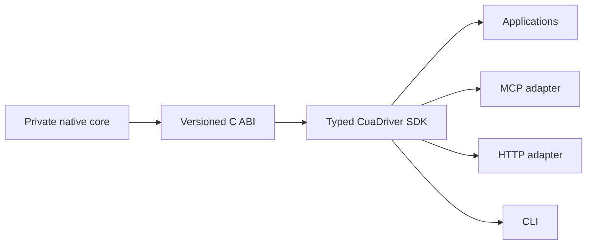
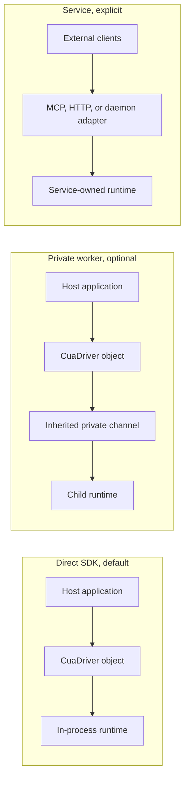
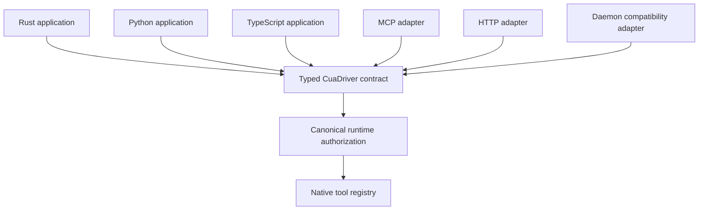
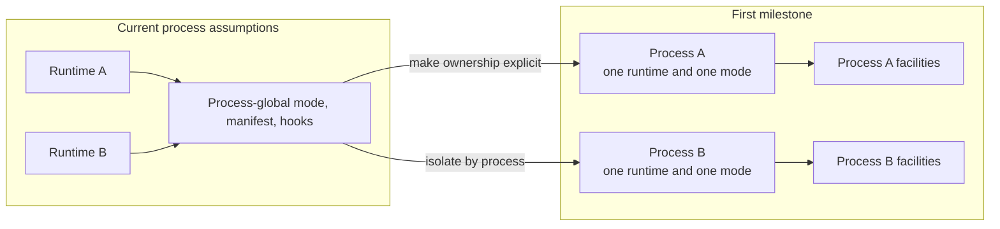
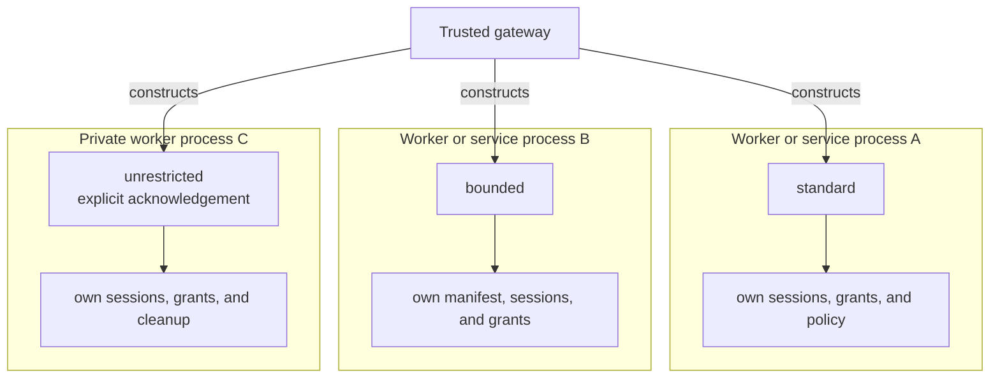
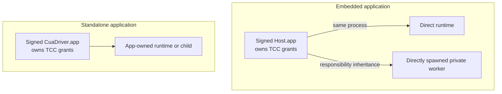
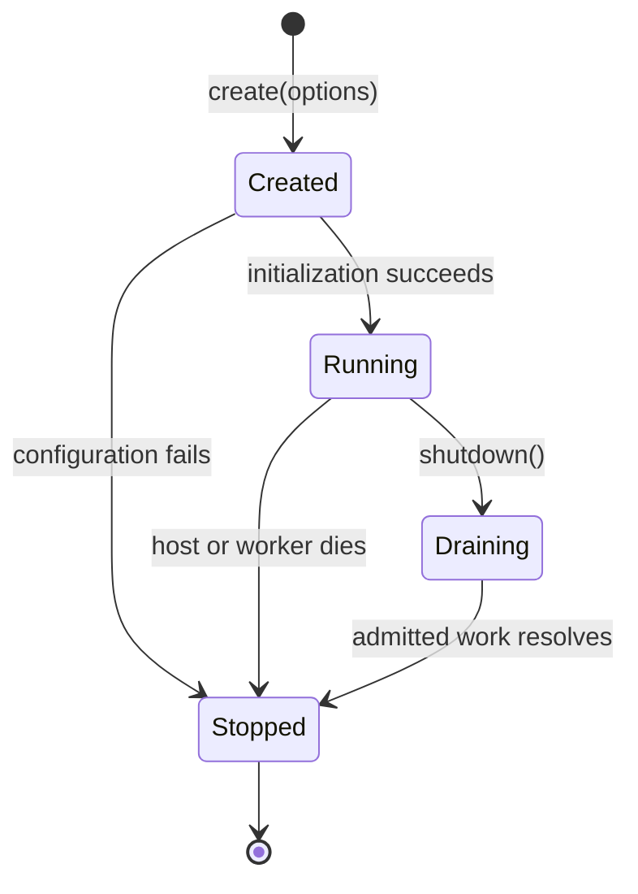
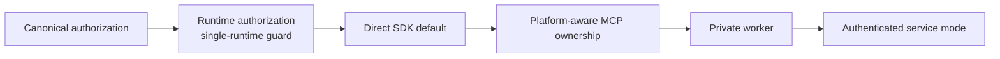

# RFC 2549: Cua Driver: SDK-Owned Runtime and Optional Services

## Summary

Cua Driver will make the typed `CuaDriver` SDK and its owned native runtime the
default application boundary. Applications create a stateful runtime, use it,
and shut it down without first starting or connecting to a shared daemon.

MCP, HTTP, private workers, and long-lived daemons remain supported as adapters
for deployments that need a protocol or process boundary. They consume the same
typed SDK and preserve the same behavior. A daemon becomes an explicit service
choice instead of a prerequisite for every integration.

Authorization moves from process-global configuration into each runtime.
Trusted host code selects an immutable permission mode and policy ceiling when
it constructs the runtime. Agent-visible requests, session IDs, and transport
metadata cannot select or widen that authority.

The first milestone supports one direct runtime per process. A second
`CuaDriver::create` call returns a structured conflict until process-global
facilities have been isolated. Gateways that need different trust levels use
separate private workers or service processes rather than co-hosting modes.

Standalone `cua-driver mcp` on macOS remains owned by the signed
CuaDriver.app service so it keeps a stable TCC identity. Embedded macOS hosts
may own the runtime directly. Windows and Linux MCP processes may own their
runtimes directly.

This RFC supersedes
[RFC 2447](2447-cua-driver-native-core-and-mcp-adapter.md). It carries forward
RFC 2447's typed SDK, generated bindings, native core, versioned C ABI, and
downstream transport model. It replaces RFC 2447's runtime-ownership and
daemon-topology guidance with the narrower decisions below.

### Supersession scope

The following RFC 2447 decisions remain normative through this RFC:

- the typed `CuaDriver` SDK is the public application contract;
- Rust, Python, and TypeScript expose generated forms of that contract;
- the native core remains private behind the SDK and versioned C ABI;
- MCP, HTTP, CLI, and daemon surfaces are downstream adapters;
- adapters cannot bypass canonical authorization or invent a second tool
  contract.

This RFC replaces RFC 2447 where it was underspecified or coupled unrelated
questions:

- runtime ownership defaults to the application SDK rather than a daemon;
- one direct runtime per process is the initial concurrency contract;
- mixed permission modes use separate runtime-owner processes;
- MCP ownership depends on platform identity, including the macOS standalone
  exception;
- private workers and authenticated services are explicit optional
  topologies;
- platform facilities, lifecycle failure, and service authentication have
  acceptance gates.

## Motivation

Cua Driver adopted a daemon for sound operational reasons:

- the process owned long-lived sessions and desktop resources;
- the installed macOS application gave TCC a stable responsible identity;
- MCP, CLI, and SDK clients could share one runtime;
- native failures stayed outside client processes.

The daemon later became both the runtime owner and the public integration
boundary. That coupling now creates costs:

- applications must manage a process, socket, readiness, reconnects, and
  generation changes before making a typed call;
- the daemon and each client can carry different versions of the contract;
- embedded hosts need extra lifecycle code to preserve their macOS
  responsibility chain;
- MCP often needs a stdio proxy in front of a socket daemon;
- shared-daemon permission modes require authenticated session delegation;
- SDK methods still inherit assumptions from the client-server topology.

RFC 2447 established a different contract direction. The native core sits below
a typed SDK, and MCP and HTTP consume that SDK. The first implementation now
supports `CuaDriver::create`, which constructs the runtime in the importing
process without starting an executable or opening a socket.

The architecture should follow that contract. Runtime ownership belongs to the
SDK object by default. Service processes remain available when a deployment
needs them.

## Goals

- Make direct SDK creation the documented default for Rust, Python, and
  TypeScript applications.
- Preserve the released CLI commands, defaults, flags, socket behavior, exit
  codes, and machine-readable output throughout the migration.
- Preserve the released Rust, Python, and TypeScript SDK constructors, typed
  methods, package exports, result envelopes, and error contracts.
- Keep sessions, browser bindings, grants, capture, overlays, and cleanup
  stateful for the lifetime of the runtime.
- Give each runtime an immutable authorization configuration selected by
  trusted host code.
- Let a trusted gateway run different permission modes through separate
  runtime-owner processes without a model-visible mode selector.
- Let MCP stdio own a runtime directly where platform identity permits it,
  without requiring a second daemon and socket proxy.
- Provide a private supervised-worker topology for hosts that want process
  isolation.
- Keep an explicit daemon or service topology for shared external clients and
  compatibility.
- Preserve one typed contract and one authorization path across every topology.
- Preserve stable macOS TCC ownership for host-owned and Cua-owned
  applications.

## Non-goals

- Make desktop operations stateless.
- Remove daemon support in this RFC.
- Deprecate `CuaDriver.connect()` before usage and migration data exist.
- Change the default CLI or standalone MCP topology as a prerequisite for
  shipping browser-use improvements.
- Rename or remove a released SDK method, constructor, option, result field, or
  package export.
- Support multiple direct runtimes in one process in the first milestone.
- Treat two runtime objects in one process as a security boundary against
  arbitrary code in that process.
- Let a model create, select, or upgrade a runtime permission mode.
- Replace the versioned C ABI or generated SDK bindings from RFC 2447.
- Define every future protected-consent adapter tracked by
  [#2385](https://github.com/trycua/cua/issues/2385).
- Change macOS TCC, Windows interactive-session, or Linux display security
  rules.

## Terminology

**Native core**
: The private platform implementation that performs desktop and browser work.

**Typed SDK**
: The public `CuaDriver` application contract exposed through Rust and
generated language bindings.

**Runtime**
: A stateful native instance owned by a `CuaDriver` SDK object. It owns
authorization, sessions, grants, bindings, overlays, capture, recording, and
cleanup.

**Direct runtime**
: A runtime loaded into the application process through
`CuaDriver.create(options)`.

**Private worker**
: A host-supervised child process that owns one runtime and communicates
through a private inherited channel. It does not expose a reusable system
endpoint.

**Service runtime**
: A runtime owned by a daemon, MCP server, HTTP server, or another process that
intentionally serves external clients.

**Adapter**
: A component that maps another interface, such as MCP or HTTP, to the typed
SDK.

**Runtime authorization**
: The immutable mode, policy ceiling, optional bounded manifest, consent
provider, and related authority assigned by trusted host code at construction.

## Current state

### The typed SDK already owns a native runtime

[`CuaDriver::create`](../libs/cua-driver/rust/crates/cua-driver-sdk/src/lib.rs)
constructs `NativeAbiDriver` in the importing process. It launches no driver
executable and opens no daemon socket.

The same SDK retains
[`CuaDriver::connect`](../libs/cua-driver/rust/crates/cua-driver-sdk/src/lib.rs)
as a compatibility client for the installed daemon. Both paths expose the same
typed methods.

### Transport adapters sit above the SDK

[RFC 2447](2447-cua-driver-native-core-and-mcp-adapter.md) defines the SDK as
the application contract. MCP, HTTP, and CLIs consume the SDK. They do not
define peer contracts to the core.



### The daemon still owns compatibility and embedding paths

`EmbeddedCuaDriverHost` starts a private daemon, waits for its socket, exposes
SDK and MCP connection details, and owns shutdown. This path preserves a signed
host application's macOS responsibility chain when it needs an external MCP
endpoint or process separation.

The preferred application path in
[the embedding guide](../libs/cua-driver/rust/Skills/cua-driver/EMBEDDING.md)
is already direct SDK creation.

### Some state remains process-global

Permission mode, managed and user policy, bounded manifests, consent-provider
identity, session authorization, session registries and end hooks, capture
scopes, recording and screenshot hooks, replay state, CDP port claims, browser
download gates, the macOS cursor overlay, and the shared ABI executor still
assume one process-wide runtime. Some setters also use first-writer-wins
behavior and silently ignore later configuration.

Two `CuaDriver` objects therefore cannot yet carry independent authorization
or resource ownership reliably inside one process. The first direct-runtime
milestone makes that constraint explicit instead of treating same-process
multi-runtime isolation as a prerequisite.

### Permission work reflects the shared-daemon topology

Issue [#2437](https://github.com/trycua/cua/issues/2437) proposes trusted
per-session modes in a shared daemon. The draft implementation in
[PR #2545](https://github.com/trycua/cua/pull/2545) introduces daemon ceilings,
connection-bound authorization contexts, leases, expiry, and revocation.

Those mechanisms address genuine shared-daemon threats. This RFC asks whether
separate runtime ownership can satisfy the same gateway need with fewer
authority-transfer mechanisms. It narrows rather than replaces #2437: a future
authenticated service may still need mixed-mode delegation, but no current
consumer justifies making that the default gateway design.

## Proposal

### 1. Make the SDK-owned runtime the default

Applications create one runtime through the typed SDK:

```text
host application
      |
      v
CuaDriver.create(options)
      |
      v
stateful native runtime
```

The runtime remains active until the host calls `shutdown()` and destroys the
SDK object. It admits work, owns resources, evicts idle sessions, drains
admitted calls during shutdown, and releases platform state.

The SDK must not start a global daemon as a hidden side effect of `create`.
Only one direct runtime may exist in a process during the first milestone.
Additional creation attempts return a structured `runtime_already_exists`
conflict. Supporting multiple direct runtimes later requires a separate
isolation gate and evidence.

### 2. Support three explicit execution topologies



#### Direct SDK

Direct SDK is the default for an application that owns its automation
lifecycle. It has no driver socket, daemon discovery, or reconnect protocol.

#### Private worker

Private worker gives one host a process boundary without creating a shared
service. The host starts the worker directly, supplies only an inherited
channel or handle, and owns its lifetime.

The worker must:

- bind to one host generation;
- terminate or revoke its resources when the host channel closes;
- expose no discoverable endpoint advertised as private;
- reject reconnect and reattachment after its original host channel closes;
- return structured completion state for actions interrupted by worker death;
- preserve the host's macOS responsibility chain when embedding requires it.

#### Service

Service mode supports external clients that intentionally share one runtime or
need a network or socket endpoint. `cua-driver serve` and
`CuaDriver.connect()` remain supported during migration.

Service mode must authenticate every connection, state its lifecycle and
sharing contract, and verify the connecting OS principal. It cannot become the
implicit fallback when direct runtime creation fails.

### 3. Keep one contract across topologies

Every topology calls the same typed SDK operations and canonical runtime
authorization coordinator.



An adapter may reject an invalid request before calling the SDK. It cannot
authorize a request that the runtime denies, invent a second tool schema, or
call private core operations.

### 4. Move mutable authority into the runtime

Each runtime owns an immutable `RuntimeAuthorization` created before it accepts
actions. The conceptual record contains:

```text
RuntimeAuthorization
  permission_mode
  unrestricted_acknowledged
  managed_policy_view
  user_policy_view
  optional_bounded_manifest
  protected_consent_provider
  approval_and_revocation_state
  runtime_generation
```

The exact public types remain an implementation decision, but the contract is
fixed:

- trusted host code supplies the configuration at construction;
- constructor options are authoritative;
- compatibility environment variables apply only when the corresponding
  constructor option is absent;
- contradictory constructor and environment configuration fails closed;
- the runtime validates it before registering tools;
- the configuration cannot widen after construction;
- agent-visible calls cannot replace it;
- unrestricted requires a separate launch-time acknowledgement;
- managed and user policy denials still apply;
- runtime teardown revokes every grant and binding owned by that generation.

Process-global read-only data may remain shared. In the first milestone,
mutable state that carries authority or resource ownership belongs to the one
direct runtime or an explicit process coordinator. Later same-process
multi-runtime support must first move or coordinate every relevant facility.



### 5. Assign permission modes per runtime-owner process

A trusted gateway creates separate runtime-owner processes for separate
immutable modes:



The agent receives typed action methods or MCP tools after construction. The
agent does not receive a runtime factory, mode setter, or serialized authority
value.

An unrestricted runtime co-hosted with standard or bounded sessions always
uses a separate process. Same-process runtime objects are neither the initial
gateway mechanism nor a security boundary. Multiple runtimes in one process
may be added later as a performance optimization after global-state isolation
is complete.

### 6. Let MCP own or connect to a runtime according to platform identity

On Windows and Linux, and for embedded macOS hosts that deliberately accept
the host application's TCC attribution, the MCP stdio flow is:

```text
agent host starts cua-driver mcp
                 |
                 v
MCP process creates CuaDriver runtime
                 |
                 v
MCP requests call typed SDK methods
                 |
                 v
stdin EOF triggers runtime shutdown
```

This flow uses one long-lived process. It keeps state for the MCP connection
without starting `cua-driver serve` and proxying requests through a socket.

Standalone installed `cua-driver mcp` on macOS is the exception. It connects
to a runtime owned by the signed CuaDriver.app service so Accessibility and
Screen Recording grants remain attributed to a stable application identity.
An explicit direct option is supported for callers that deliberately want the
MCP process or embedding host to own TCC attribution.

An explicit connection option continues to support an existing service:

```text
cua-driver mcp --connect <service endpoint>
```

The final CLI spelling will follow the repository's CLI review process.

### 7. Preserve platform ownership

#### macOS

TCC evaluates the responsible signed application:



Direct SDK creation performs TCC checks as the importing application. A private
worker spawned directly by the host remains inside the host's responsibility
chain. Standalone Cua use continues to rely on the signed CuaDriver.app
identity.

An embedded host must not use LaunchServices to start its private worker or
silently launch an unrelated global daemon. The installed standalone MCP path
may use LaunchServices to reach CuaDriver.app because preserving that stable
responsible identity is the purpose of the service topology.

Changing Accessibility or Screen Recording grants may require restarting the
responsible host application. In direct mode, `check_permissions` reports
state without trying to transfer ownership or perform hidden relaunches. The
embedding host owns its permission-request UX and restart flow.

#### Windows

The runtime must execute in the interactive user's session. A service in
Session 0 cannot own desktop input or capture and must fail before accepting
actions. A direct runtime inherits the host process integrity level. A private
worker inherits or is started inside the host's interactive session.

Elevated or `uiAccess` input requires the signed Cua-owned UIAccess worker. Its
named pipe is a service surface, not a private inherited channel, and must
authenticate the connecting principal.

#### Linux

The runtime must bind to the intended display, compositor, and user session.
Service mode may own a dedicated display environment. Direct and worker modes
inherit an application-provided environment and must report the resolved
desktop scope.

On Wayland, XDG portal grants may be scoped to a runtime or session and may
prompt again after restart. A long-lived service may amortize those prompts,
but direct mode must report the actual portal scope rather than implying that
grants survive runtime replacement.

### 8. Define lifecycle and failure behavior



The runtime must:

- reject new calls after shutdown begins;
- wait for already admitted calls before orderly shutdown returns;
- revoke grants, indicators, bindings, and session authority;
- finalize or report partial recordings and file outputs;
- report whether an interrupted action completed, failed before its side
  effect, or has unknown completion;
- keep generation-scoped handles invalid after restart;
- require new browser preparation and profile binding after restart; browser
  and CDP bindings never migrate between runtime generations.

### 9. Handle shared platform facilities explicitly

Some resources may be unique per process or desktop:

- cursor overlay ownership;
- display capture streams;
- keyboard and pointer injection backends;
- platform callbacks registered through global APIs;
- browser endpoint ownership;
- recording encoders and session-end hooks.

The implementation must classify each facility as:

1. runtime-owned;
2. immutable and safe to share;
3. coordinated by an explicit process owner;
4. unsupported across concurrent in-process runtimes.

Concurrent use must return a structured conflict or apply a documented
coordination rule. It cannot merge grants or bindings implicitly.

The macOS cursor overlay is a process-coordinated AppKit facility that requires
an owning main thread. A direct runtime exposes the overlay only when the host
installs a certified main-thread UI adapter. Otherwise cursor-overlay methods
return a structured `facility_unavailable` error without asserting or
silently moving AppKit work to an unsafe thread. Private-worker and service
topologies own a suitable event loop and provide the full overlay.

A certified adapter is a documented SDK contract that schedules overlay work
on the host's AppKit main thread and passes the platform overlay test matrix.
Certification describes tested conformance, not a new signing authority.

Cross-process competition for desktop-wide resources is OS-arbitrated or
reported as a structured conflict. General cross-process scheduling is outside
this RFC. Visible indicators and status affordances must still identify their
owning runtime and remain revocable.

### 10. Keep the daemon as an explicit product surface

The daemon remains appropriate when:

- several external clients must share one runtime;
- a remote transport is required;
- the deployment needs a stable Cua-owned process identity;
- short-lived clients need state that outlives them;
- native crash isolation is required and a private worker does not fit.

Service documentation must identify:

- who starts and stops the service;
- which users or processes can connect;
- whether clients share sessions and resources;
- which authorization configuration the service owns;
- what survives a client disconnect;
- how version compatibility is negotiated.

Every local service endpoint must combine restrictive filesystem or named-pipe
permissions with same-user peer authentication. Unix endpoints verify peer
credentials such as `getpeereid` or `SO_PEERCRED`; Windows named pipes verify
the client token and use a restrictive ACL. A remote endpoint requires an
explicit authenticated principal and transport security. Endpoint location or
same-machine reachability alone is not authentication.

The daemon remains a compatibility surface during migration. It may be
presented as a mixed-trust service only after the authentication acceptance
tests in this RFC pass.

### 11. Treat compatibility as a release gate

The runtime topology is an implementation choice behind existing public
contracts. Migrating ownership must not force current CLI, MCP, Python,
TypeScript, or Rust users to change how they invoke Cua Driver.

The following CLI behavior remains stable until a separate reviewed proposal
changes it:

- bare `cua-driver` and `cua-driver mcp` invocation behavior;
- existing subcommand names, flags, environment variables, and socket
  selection;
- default standalone macOS ownership through CuaDriver.app;
- documented exit codes, JSON fields, MCP schemas, and error categories;
- current session, shutdown, reconnect, and compatibility-daemon behavior.

The following SDK behavior remains stable:

- `CuaDriver.create(options)` and `CuaDriver.connect(socket_path)`;
- released typed operation names and language-idiomatic projections;
- package-root exports and generated binding names;
- result envelopes, structured error categories, lifecycle, and cancellation;
- compatibility with applications written against the previous supported
  package release.

New runtime options and worker constructors must be additive. A backend may
change only after contract and behavior parity tests pass. Removing or
renaming a released surface, changing a default topology with observable
effects, or deprecating `connect()` requires a separate compatibility decision
and the appropriate semantic-versioning release.

Browser-use improvements may ship on the current CLI and daemon topology before
the later phases of this RFC. The architecture migration cannot become a
prerequisite for an otherwise compatible browser release.

## Public API direction

The final generated names require an API review. The conceptual surface is:

```rust
let driver = CuaDriver::create(RuntimeOptions {
    authorization,
    // Other runtime-owned options.
})?;

let isolated = CuaDriver::create_worker(WorkerOptions {
    authorization,
    // Worker lifecycle and packaging options.
})?;

let service_client = CuaDriver::connect(ServiceConnection {
    endpoint,
})?;
```

Each language binding must expose the same lifecycle and typed operations.
Language wrappers may add idiomatic resource-management helpers, such as
Python async context managers or TypeScript disposal helpers, without changing
the underlying contract.

`create_worker` is a proposed capability, not a commitment to this exact
method name.

Until a later multi-runtime isolation gate passes, `create` permits one direct
runtime per process. Hosts that need another mode or trust domain use
`create_worker` or an authenticated service process.

The existing `create` and `connect` constructors remain public with their
released signatures. The conceptual options above may add fields or helpers;
they do not authorize replacing those constructors.

## Alternatives considered

### Keep the shared daemon as the default

This preserves current deployment behavior and concentrates resource ownership
in one process. It also keeps socket lifecycle, version negotiation, reconnect
rules, and shared authorization in the common path for applications that do
not need them.

The generated SDK and direct runtime would remain secondary clients. That
conflicts with RFC 2447's dependency direction.

### Implement mixed permission modes through shared-daemon sessions

This approach can support many sessions in one process. It requires an
authenticated host-control channel, connection-bound authority, replay
protection, session substitution defenses, per-session manifests, reconnect
rules, and scoped teardown.

Those mechanisms remain valid for a service that chooses mixed-mode sharing.
They should not be required for every gateway when separate runtime-owner
processes satisfy the gateway's isolation and cost requirements.

The `EffectiveAuthorizationContext` and `SessionModeCeiling` concepts from
PR #2545 remain useful at the canonical dispatch boundary. Connection leases,
delegated-session binding, and client-provided connection proofs stay frozen
until an authenticated shared-service consumer requires them.

### Remove all daemon and worker support

A direct-only SDK would have the smallest topology. It would remove supported
use cases for shared external clients, stable service identity, state that
outlives short-lived callers, and process crash containment.

This RFC keeps those topologies as explicit choices.

### Make each action stateless

Desktop automation depends on session scope, browser bindings, element
generations, grants, recording state, and cleanup. Reconstructing that state
for every action would weaken identity checks and increase startup cost.

The proposal keeps a stateful runtime.

### Keep separate hand-written contracts for SDK and transports

Independent contracts can evolve at different speeds, but they invite schema,
error, authorization, and lifecycle drift. RFC 2447 already chose one typed
contract with generated language bindings.

This RFC keeps that decision.

## Compatibility and migration

Migration is additive until a separate deprecation decision.

### Compatibility lock

Before changing a default backend or process owner, capture the released CLI,
MCP, Rust, Python, and TypeScript surfaces as compatibility fixtures. Each
phase must run those fixtures against both the old and proposed topology.

An internal ownership change is blocked when it changes a command line,
constructor, package export, tool schema, result envelope, structured error,
exit code, lifecycle outcome, or default platform identity without a separate
public decision.

### Phase 0: Canonical authorization

Land authorization at the runtime dispatch boundary so direct SDK, daemon,
MCP, HTTP, CLI, and raw-socket paths cannot bypass it. Publish an honest
inventory of active and metadata-only enforcement adapters.

[PR #2542](https://github.com/trycua/cua/pull/2542) is the current candidate for
this phase.

Phase 0 is the only permission-model work recommended before declaring the
same-process SDK consistent with daemon-backed callers. It changes the
authorization enforcement point, not the public CLI or SDK signatures. Phase
1 and later are not prerequisites for the browser-stability release.

### Phase 1: Runtime authorization and a single-runtime guard

Make constructor authorization authoritative, define compatibility
environment-variable precedence, and return a structured conflict on a second
direct runtime in the same process. Move the authorization coordinator,
permission mode, bounded manifest, consent-provider ownership, grants, and
generation-scoped bindings behind the runtime boundary needed for one direct
runtime.

Publish the full process-global facility inventory. Do not wait for complete
same-process multi-runtime isolation before shipping the direct default.

### Phase 2: Direct SDK default

Make `CuaDriver.create()` the primary path in Rust, Python, and TypeScript
documentation and examples. Keep `connect()` documented as service mode.

Package and version the native library with the generated SDKs on every
supported platform.

### Phase 3: Platform-aware MCP ownership

Make MCP stdio own its runtime on Windows, Linux, and embedded macOS paths.
Keep standalone installed macOS MCP connected to the signed CuaDriver.app
service by default. Preserve explicit direct and service connection modes.

### Phase 4: Private worker

Add the supervised-worker topology with parent-liveness cleanup, private
channel inheritance, generation binding, no reattachment, and
platform-specific packaging.

### Phase 5: Service authentication and cleanup

Authenticate local peers and remote principals, then document the daemon as
service mode. Measure remaining `connect()` and daemon usage before proposing
any deprecation.

### Later: Same-process multi-runtime isolation

Only pursue multiple direct runtimes in one process when a measured use case
justifies the extra coordination. This later phase must isolate or coordinate
every process-global facility and pass the corresponding contention tests.



### Rollback

Each phase keeps service mode available. A release may switch the documented
default back to the daemon while preserving the typed SDK if direct runtime
behavior fails a platform gate.

Rollback must not restore an authorization bypass or migrate authority from a
runtime into caller-controlled metadata.

## Security, privacy, and telemetry

### Threat model

The caller may be an agent influenced by untrusted content. It can choose tool
names and arguments exposed through its adapter. It cannot be trusted to choose
its permission mode, approve a protected action, or provide a truthful session
identity.

Trusted host code owns runtime construction. If an agent can execute arbitrary
code inside that trusted host process, the in-process authorization boundary
does not contain it. Such deployments need a private worker, service identity,
VM, or another external isolation boundary.

### Authorization

- Runtime authorization is immutable after construction.
- Unrestricted requires explicit acknowledgement outside agent-visible tool
  calls.
- Managed policy, user policy, hard invariants, OS permissions, and resource
  ownership apply in every mode.
- Session IDs remain lifecycle labels. They do not carry authority.
- Serialized bearer values cannot upgrade a runtime.
- Adapters cannot mint or satisfy protected consent.
- Grants bind to one runtime generation and revoke on teardown.

### Process isolation

The first milestone permits one direct runtime per process. Different
permission modes or trust domains run in separate runtime-owner processes.
This separation does not protect against a host that can arbitrarily control
or inspect all of those processes.

Private workers and services add process separation. Their channels must use
OS identity and inherited-handle rules appropriate to the platform. Private
workers accept only their original inherited host channel. Services
authenticate every connection as described above.

### Privacy

Telemetry may report:

- execution topology;
- SDK and runtime versions;
- runtime generation;
- permission mode;
- policy and manifest hashes;
- counts of active sessions or grants;
- structured refusal and lifecycle codes.

Telemetry must not contain:

- screenshots or accessibility trees;
- typed text or clipboard contents;
- cookies, browser storage, or page content;
- local file contents or raw paths when a digest or class is sufficient;
- protected-consent responses;
- serializable authority values.

### Protected consent

Issue [#2385](https://github.com/trycua/cua/issues/2385) continues to govern
which capability groups have active protected-consent adapters. Moving a
capability into an SDK-owned runtime does not promote its enforcement state.
The consent provider and grant broker become runtime-owned, but the protected
host surface remains outside the agent-visible request channel.

## Implementation plan

### Slice A: Preserve canonical authorization

- Land the `ToolRegistry::invoke` or enclosing runtime authorization
  chokepoint.
- Keep direct and service paths on that chokepoint.
- Test aliases, raw routes, generated SDK calls, and daemon adapters.

### Slice B: Introduce runtime configuration

- Add immutable runtime authorization types.
- Remove process-global permission mode and bounded manifest lookups.
- Pass runtime context to the authorization coordinator.
- Reject contradictory unrestricted acknowledgement.
- Make constructor options authoritative, use compatibility environment
  variables only for absent options, and fail on contradictory values.
- Keep compatibility constructors mapped to one process-owned runtime config.
- Preserve or adapt `EffectiveAuthorizationContext` and
  `SessionModeCeiling` from PR #2545 at the dispatch boundary.

### Slice C: Make single-runtime ownership explicit

- Inventory mutable singletons and global callbacks.
- Add a process-wide guard that permits one direct `DriverRuntime`.
- Move generation-scoped authorization and resource ownership into
  `DriverRuntime`.
- Add an explicit coordinator for facilities that are unique per process.
- Return structured conflicts for a second direct runtime and unsupported
  facility use.
- Defer complete same-process multi-runtime isolation until a consumer requires
  it.

### Slice D: Prove generated SDK parity

- Regenerate Rust, Python, and TypeScript surfaces from one contract.
- Test create, invoke, cancellation, shutdown, error mapping, and destruction.
- Verify native library provenance in released packages.

### Slice E: Simplify MCP

- Let MCP stdio create a runtime directly on Windows, Linux, and embedded
  macOS paths.
- Keep installed standalone macOS MCP on the CuaDriver.app service identity.
- Preserve explicit service connection mode.
- Verify EOF cleanup and interrupted-action reporting.

### Slice F: Add private workers

- Define the narrow host-worker protocol.
- Bind worker generation and authority at spawn.
- Implement parent-liveness shutdown.
- Reject reconnect and reattachment.
- Prove TCC responsibility inheritance on macOS.
- Prove interactive-session placement on Windows.
- Prove display binding and cleanup on Linux.

### Slice G: Reassess shared-daemon delegation

- Measure whether any service consumer still requires concurrent mixed-mode
  sessions in one daemon.
- Keep delegated-session binding, host leases, and connection-proof work from
  PR #2545 frozen unless that consumer exists.
- Dissolve its process-global configured-session registry into runtime-owned
  state if the shared-service work resumes.
- Keep delegation unavailable until an authenticated action connection exists.

### Slice H: Authenticate service endpoints

- Verify Unix-domain-socket peers with same-user credentials in addition to
  restrictive filesystem permissions.
- Apply restrictive Windows named-pipe ACLs and verify client tokens.
- Require explicit authenticated principals and transport security for remote
  endpoints.
- Treat the signed Windows UIAccess worker pipe as a service endpoint.
- Test denial before runtime actions, session lookup, or delegated authority.

## Test and acceptance plan

The RFC is implemented when all of the following evidence passes.

### Contract parity

- Rust, Python, and TypeScript expose the same typed operations and lifecycle.
- Direct, private-worker, MCP, HTTP, and daemon paths produce compatible
  results and structured errors.
- Generated contract and symbol checks pass on macOS, Windows, and Linux.
- CLI help, subcommand, flag, exit-code, JSON, and MCP-schema fixtures remain
  unchanged unless an independently reviewed compatibility change says
  otherwise.
- Python and TypeScript package-export and signature snapshots remain
  compatible with the previous supported release.
- Representative applications written against the previous supported Rust,
  Python, and TypeScript packages run against the new release without source
  changes.

### Authorization

- A second direct runtime in one process fails with a structured conflict.
- Constructor options override absent compatibility defaults, and
  contradictory explicit sources fail closed.
- Runtime-owner processes with different modes cannot exchange grants,
  manifests, sessions, browser bindings, or resource handles.
- An agent-visible request cannot create or widen runtime authority.
- Unrestricted cannot start without trusted construction-time
  acknowledgement.
- Managed and user policy denials remain effective in unrestricted mode.
- Runtime restart invalidates every prior-generation grant and binding.

### Lifecycle

- Concurrent shutdown calls are idempotent.
- Shutdown rejects new work and drains admitted work.
- Host death terminates a private worker and revokes its resources.
- A dead or disconnected worker cannot be reattached.
- Interrupted actions report known or unknown completion honestly.
- Idle sessions and recordings are reclaimed by their owning runtime.

### Platform behavior

- macOS direct mode reports the signed host application's TCC attribution.
- macOS private-worker mode stays in the host's responsibility chain.
- Standalone macOS MCP reports the signed CuaDriver.app identity.
- Direct macOS permission checks are read-only and document host restart
  requirements after grant changes.
- Direct macOS cursor overlays either use a certified main-thread host adapter
  or return `facility_unavailable`; worker and service paths provide the full
  overlay.
- Windows tests execute at the expected integrity level in an interactive user
  session and reject Session 0.
- The Windows UIAccess worker authenticates its named-pipe client.
- Linux tests prove the intended display, compositor, and Wayland portal scope.

### Resource isolation

- Concurrent cross-process overlays, capture streams, recording, input, and
  browser bindings either remain isolated, are OS-arbitrated, or return a
  documented conflict.
- Session end in one runtime-owner process cannot tear down resources owned by
  another.
- Worker or runtime failure cannot leave an unowned visible indicator or live
  capture.
- Browser profiles and CDP bindings never migrate across runtime generations.

### Compatibility

- Existing service clients continue to work through `connect()`.
- Existing CLI and standalone MCP workflows retain their commands, defaults,
  platform identity, and observable lifecycle.
- Existing Rust, Python, and TypeScript callers retain their constructors,
  typed methods, exports, result envelopes, and structured error categories.
- Local service endpoints reject peers that fail same-user credential checks.
- Remote service endpoints reject unauthenticated principals.
- Service and direct versions negotiate or refuse incompatibility before
  actions run.
- Rollback to service-default documentation requires no data migration.

## Unresolved questions

- Which current platform callbacks can become runtime-owned, and which require
  one process coordinator?
- Should the private worker protocol call the stable C ABI directly or carry a
  narrow SDK operation protocol?
- Which daemon administrative tools still need typed SDK replacements?
- What usage threshold and support window should precede a future
  `CuaDriver.connect()` deprecation RFC?
- Does any current consumer require mixed permission modes inside one shared
  daemon after separate runtimes and private workers ship?

## Decision record

RFC 2549 supersedes RFC 2447 while preserving its typed-contract and native-ABI
decisions. Final disposition remains pending RFC discussion.
