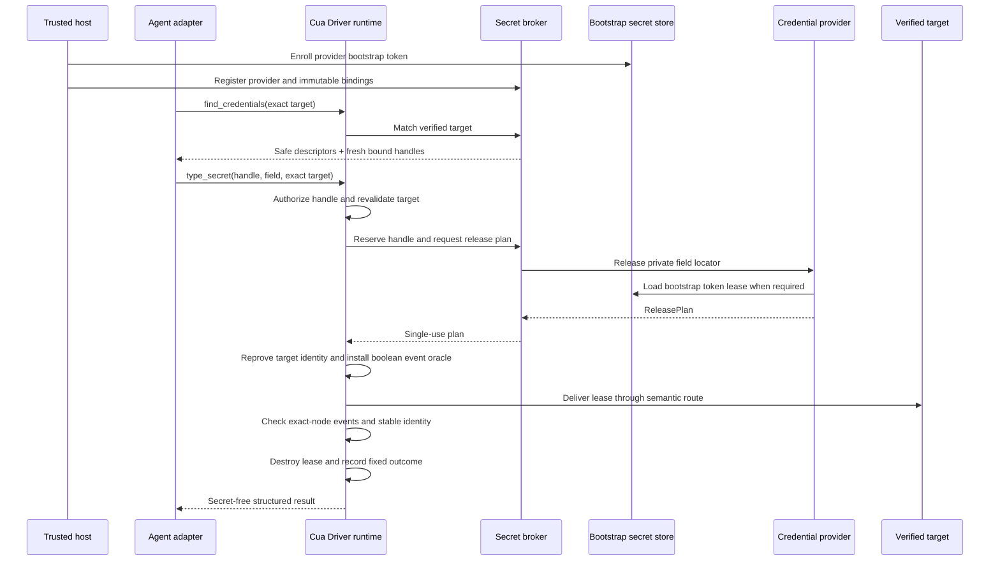

# RFC 2942: Cua Driver: Target-bound credential delivery

## Summary

Cua Driver will add provider-neutral, target-first credential discovery and
target-bound delivery to its canonical typed SDK. The agent first presents the
exact destination to `find_credentials(target)`. Cua Driver matches only
host-registered bindings and returns safe descriptors with fresh, opaque,
short-lived handles already bound to that destination. The agent may then call
`type_secret(handle, field, target)`; it never supplies a provider locator or
secret value.

The runtime resolves the secret locally, delivers it directly to a freshly
verified semantic target, and disposes of the value without placing plaintext
in model input, public SDK or MCP arguments, CLI arguments, clipboard state,
action recordings, overlays, telemetry, or ordinary logs. A bounded internal
delivery buffer necessarily contains the value, and browser delivery may
serialize it inside the private CDP connection. The destination application
receives the value by design; neither the agent nor an intermediate generic
text channel does.

The first provider integration will target a dedicated 1Password automation
service account and least-privilege automation vault. Its externally issued,
variable-length bootstrap token is enrolled through a trusted host-only setup
path and stored in a separate OS credential-store namespace. The public
contract remains provider-neutral so other password managers, OS keychains,
managed secret stores, and provider-owned fill mechanisms can implement the
same lifecycle and privacy requirements.

The first implementation slices remain internal and non-invocable: recording
hardening, secure browser semantics, a fake provider, the broker, target-bound
handles, and browser delivery are certified before the public manifest changes.
Because current SDK parity requires every manifest tool to be exported by the
generated SDKs, the public flip adds the contract, ABI, UniFFI, generated
Python and TypeScript SDKs, and MCP together. Native delivery, shared-daemon,
and service exposure remain deferred until each topology has a trusted binding
registration path and equivalent privacy evidence.

Credential delivery is a release capability, not a vault-reading capability.
Version one never searches a provider vault dynamically: discovery matches
only bindings already registered by trusted host code. It does not reveal or
return a value, expose provider metadata, unlock a personal vault, or bypass
provider-required user presence.

## Motivation

Authenticated browser and desktop workflows sometimes need to enter a saved
password or another sensitive value. The current `type_text` contract requires
the caller to send the plaintext as a tool argument. Redacting that argument
from later telemetry or recordings is useful, but it cannot remove plaintext
that was already present in a model request, client transcript, transport
payload, shell pipeline, or generic action path.

Password-manager browser extensions provide a safer interactive flow, but
they intentionally depend on application unlock state and user interaction.
Secrets-automation products provide unattended resolution, but Cua Driver has
no typed bridge between a trusted secret binding and an exact GUI target. A
caller must currently choose among exposing plaintext to `type_text`, using a
clipboard, composing shell commands, or taking over an interactive extension.

The missing contract is not “read this secret.” It is:

> Release the value represented by this already-authorized binding to this
> exact, freshly verified target, without giving the value or provider locator
> to the agent.

That distinction lets an agent express intent while the trusted host continues
to own credential selection, provider authority, destination scope, and
lifecycle.

## Goals

- Keep secret plaintext out of model-visible requests, agent transcripts,
  public transport envelopes, CLI arguments, clipboard state, recordings,
  overlays, telemetry, and ordinary logs.
- Define one provider-neutral typed SDK contract rather than one public tool
  per provider, while exposing it only through certified topologies.
- Make discovery target-first and return only safe descriptors with fresh,
  target-bound handles for trusted host-registered bindings.
- Let trusted host code register private provider locators, safe descriptors,
  exact target constraints, expiry, field policy, and use limits.
- Resolve and deliver a secret only to a freshly verified semantic browser
  target in the first release, with native accessibility delivery deferred.
- Make 1Password the first provider without exposing raw `op://` references,
  vault names, item names, or field names to the agent-facing tool.
- Treat NVIDIA OpenShell as the standard outer runtime for unattended agents:
  OpenShell restricts the agent process, filesystem, network, and MCP route,
  while Cua Driver independently authorizes the live GUI target and release.
- Preserve canonical authorization and permission-mode ceilings in the
  directly supervised runtime first, then require equivalent evidence before
  enabling private-worker, service, MCP, CLI, or shared-daemon topologies.
- Return stable structured outcomes for provider, authorization, target, and
  partial-delivery failures without including secret-derived data.
- Define cross-platform evidence required before any target route is
  advertised as supported.
- Keep form submission and other consequential actions separate from secret
  delivery.
- Keep provider bootstrap credentials in a dedicated OS credential-store
  namespace with enrollment, rotation, revocation, and health reporting.
- Detect possible same-page delivery misdirection, consume the use, destroy the
  lease, and never retry.

## Non-goals

- Store, generate, rotate, recover, display, or return credentials.
- Automatically unlock a personal password-manager vault with its account
  password.
- Bypass Touch ID, Apple Watch, Windows Hello, MFA, passkeys, provider policy,
  or another user-presence requirement.
- Expose vault search, item enumeration, raw provider URIs, or secret values to
  the model.
- Dynamically search a provider vault from agent input in version one.
- Deliver secrets to terminals, shells, clipboards, browser address bars,
  arbitrary content-editable controls, or pixel-only targets in the first
  release.
- Support visibly unmasked destination fields in the first release.
- Make Cua Driver a security boundary against arbitrary unsandboxed code
  running as the same OS principal as the configured provider credential.
- Prevent the approved destination application or page from reading the value
  it receives.
- Automatically submit a form or perform a consequential action after filling
  a field.
- Replace workload identity, OAuth refresh tokens, service accounts, or API
  integrations where those are the appropriate solution.
- Standardize provider-side credential creation, sharing, or rotation policy.

## Terminology

**Secret provider**
: A trusted runtime adapter that can return an ephemeral lease, fill through a
provider-managed route, or require provider-owned user presence.

**Provider locator**
: A provider-specific pointer such as a 1Password secret reference. It may
reveal vault, item, or field metadata and is therefore private trusted-host
configuration, not an agent-visible tool argument.

**Secret binding**
: An immutable trusted mapping from safe discovery metadata to private provider
and field locators plus allowed targets, lifetime, use limits, and authorization
metadata. Bindings are never enumerated directly by an agent.

**Credential handle**
: A fresh opaque capability minted only after a binding matches a verified
target. It is bound to the runtime generation, lifecycle session, binding
definition digest, provider and field, browser endpoint generation, tab,
frame/document, origin, semantic-v2 element ref, expiry, and use count.

**Secret broker**
: The internal owner of matching, handle minting, atomic reservations, release
planning, cancellation, and revocation. It is separate from provider adapters.

**Secret lease**
: A single-use, non-cloneable, zeroizing in-memory value returned by a provider
for one authorized delivery attempt.

**Bootstrap secret store**
: A separate OS credential-store interface for externally issued,
variable-length provider bootstrap tokens. It does not reuse or widen Computer
History's generated fixed-size encryption-key interface or namespace.

**Delivery target**
: In the first release, a semantic browser password element bound to a live
browser process, tab, origin, runtime generation, and element identity. The
contract may later add native accessibility targets after separate review.

**Trusted configuration surface**
: In the first release, a Rust SDK constructor or directly supervised host API
unavailable to agent-visible tool calls. A later authenticated service setup or
managed manifest must prove equivalent ownership before it can register
bindings.

**Agent-facing surface**
: MCP, CLI automation arguments, or another adapter through which an agent can
choose published tools and their public inputs.

## Current state

### Plaintext is part of the current text-input contract

[`TypeTextInput`](../libs/cua-driver/rust/crates/cua-driver-contract/src/inputs.rs)
contains a public `text` string. The generated Rust, Python, TypeScript, CLI,
and MCP projections must therefore receive the value before the native runtime
can type it.

The canonical tool registry already provides useful foundations:

- all runtime topologies pass through one authorization boundary;
- desktop and browser input have risk and target scopes;
- concurrent text delivery to one process is coordinated;
- runtime generations, sessions, browser bindings, and element refs support
  stale-target refusal;
- tool observation avoids retaining arbitrary request arguments; and
- sensitive fields for several existing tools are redacted from deterministic
  recordings.

These controls reduce accidental retention after a call reaches the runtime.
They do not create a channel in which the caller can request secret delivery
without first possessing the plaintext.

### Generic input observability is not a secret-delivery contract

The current action label for `type_text` can summarize text for the visible
overlay, and deterministic recording receives public action arguments before
tool-specific redaction. A future secret operation cannot rely on every generic
consumer remembering to scrub one more field. Its contract must make plaintext
unrepresentable in public inputs and require fixed, secret-free observability
at the canonical boundary.

The current browser semantic projection also exposes password inputs as an
ordinary `textbox`, without a secure-field bit. Browser delivery serializes
text into private CDP JSON, recording redaction defaults to pass-through for
tools without an explicit arm, and the shared daemon authenticates same-user
peers without proving which host registered a secret binding. Native macOS text
delivery may read back accessibility values to verify ordinary input. These are
not defects in generic input, but they establish four prerequisites for this
feature: secure-field semantics, fail-closed per-tool recording policy, trusted
binding registration per topology, and a secret route that never performs
plaintext readback.

This RFC does not classify the existing behavior as a vulnerability. Generic
text input is expected to accept and display arbitrary text. It is the wrong
primitive for a value that the agent must never receive.

### Authorization is already runtime-owned

[RFC 2549](2549-cua-driver-sdk-owned-runtime.md) makes trusted host code the
owner of runtime and session authorization. Agent-visible calls cannot create,
select, or widen that authority. `type_secret` extends this model: trusted host
code owns providers and bindings, while an agent may invoke only bindings
already present in its effective session context.

Issue [#2381](https://github.com/trycua/cua/issues/2381) defines the permission
mode and protected-consent direction. Unrestricted mode suppresses Cua prompts
within a trusted runtime ceiling; it does not turn a denied provider, missing
binding, or wrong destination into an allow.

### 1Password provides two relevant operating modes

1Password documents desktop-app and browser-extension integration for
interactive filling, and CLI service accounts for unattended scripts with
vault-scoped access. It also supports secret-reference URIs for `op read` and
`op run`.

Those provider facilities do not define Cua Driver target identity,
authorization, transport redaction, action recording, cancellation, or
cross-platform delivery. The initial adapter must preserve 1Password's own
unlock and user-presence behavior while adding Cua's target-bound delivery
contract.

## Delivery routes

Several implementation routes are complementary, but they do not provide the
same security boundary.

| Route                                            | Plaintext reaches model | Plaintext reaches Cua runtime | Unattended                | Target proof                  | Role                                 |
| ------------------------------------------------ | ----------------------- | ----------------------------- | ------------------------- | ----------------------------- | ------------------------------------ |
| Persistent authenticated profile                 | No                      | No                            | Yes, until expiry         | Existing browser binding      | Preferred steady state               |
| Password-manager extension or Universal Autofill | No                      | Usually no                    | Usually no                | Provider UI plus current page | Interactive recovery                 |
| Host-provided fake provider                      | No                      | Yes                           | Yes                       | Cua semantic target           | First contract and delivery slice    |
| In-runtime provider trait                        | No                      | Yes                           | Provider-dependent        | Cua semantic target           | Primary architecture                 |
| Provider subprocess adapter                      | No                      | Yes, at delivery edge         | Yes with service identity | Cua semantic target           | Optional provider-packaging fallback |
| Provider-owned target-bound fill API             | No                      | No                            | Provider-dependent        | Provider and Cua proof        | Strongest future route               |

### Route A: Host-backed fake provider

A trusted host registers a binding whose synthetic value is already present in
protected host memory. Discovery exposes only a safe descriptor and fresh
target-bound handle, and the runtime injects the value at execution. This is
the fastest way to prove the public contract, handle binding, redaction,
recording, and cross-platform behavior with a deterministic fake provider.

It does not solve provider acquisition or isolate the secret from the host
process. It should be the first implementation slice and test seam, not the
final 1Password architecture.

### Route B: In-runtime provider trait

Trusted host code supplies a `CredentialProvider` implementation through
runtime construction options. The broker asks it for a release plan. The
interface is provider-neutral; the first slice uses a deterministic fake
provider, and a later 1Password adapter implements the same trait.

The resolved value necessarily crosses the runtime's delivery edge. This route
therefore keeps the secret outside the agent and public tool contract, not
outside the runtime or machine. That boundary is suitable for an agent limited
to the published driver contract, but not for unsandboxed same-user code with
arbitrary process access.

### Route C: Provider subprocess adapter

A `CredentialProvider` implementation may launch a private, non-reattachable child
through an inherited authenticated channel. The child owns the provider SDK or
CLI session, raw locator, and bootstrap credential. The runtime sends only an
authorized resolution request and receives a single-use lease immediately
before target delivery.

This can contain provider dependencies and bootstrap authentication state and
permit strict output controls. It is not the architecture itself and is not
the same topology as RFC 2549's host-launched driver worker: the direction of
supervision and trust is different. The runtime still sees the resolved value
at the delivery edge.

Use this adapter only if the provider packaging spike demonstrates a meaningful
credential-containment or dependency benefit. It adds authenticated IPC,
worker lifecycle, cancellation, cross-platform packaging, and process-identity
work, so it is not the default durable route.

### Route D: Provider-owned fill

Cua Driver navigates to and identifies the exact field, then a password-manager
extension, OS autofill service, or future documented provider API fills it. The
secret never materializes in Cua memory. This is the strongest data-flow route
when the provider offers a programmable target-bound API.

Current extension and desktop-app flows are designed around interactive user
intent and unlock state, and Cua cannot assume a stable agent API. This remains
the recommended interactive fallback and a future provider capability, not the
unattended first release.

### Route E: Persistent session first, `type_secret` only on expiry

Cua Driver can minimize secret handling by preserving an isolated authenticated
browser profile and checking for a logged-out state before invoking
`type_secret`. Reauthentication produces fresh browser state, after which
ordinary scheduled work reuses it.

This route should be combined with A, B, or C. It reduces secret-release
frequency and MFA friction but adds responsibility for protecting and revoking
the browser profile as a bearer credential.

### Recommended sequence

1. Keep persistent authenticated profiles as the default steady state and
   retain provider extension/Universal Autofill for interactive recovery.
2. Make recording and visible action labels fail closed before introducing any
   secret-capable operation.
3. Add semantic-v2 secure browser-field semantics.
4. Add internal `SecretBroker`, `CredentialProvider`,
   `BootstrapSecretStore`, immutable bindings, and a fake provider without
   publishing either operation.
5. Add a distinct R3 `secret_release` authorization adapter.
6. Add target-first discovery, fresh target-bound handles, and the dedicated
   browser delivery path, then prove target, retention, and race behavior.
7. Add OS credential-store enrollment, rotation, revocation, and health for a
   dedicated automation service account.
8. Run a throwaway 1Password packaging spike and implement the selected adapter
   behind the provider interface.
9. Certify the OpenShell-standard authenticated Streamable HTTP MCP bridge and
   the directly supervised stdio compatibility path, then make one
   all-surfaces public flip across the manifest, ABI, UniFFI, generated SDKs,
   and MCP.
10. Consider native, shared-daemon, and service exposure only after each
    topology has trusted registration and equivalent acceptance evidence.
11. Adopt Route D when a provider exposes a documented target-bound fill API.

## Proposal

### 1. Add canonical discovery and delivery operations

After internal certification, the canonical typed SDK publishes two
provider-neutral operations:

```text
find_credentials {
  session?,
  target
} -> safe descriptors with fresh target-bound handles

type_secret {
  session?,
  handle,
  field,
  target
} -> ActionResult
```

`find_credentials` matches only bindings already registered by trusted host
code. Version one does not forward a search string to a provider, enumerate a
vault, or dynamically discover provider items. Each returned descriptor may
contain only a host-authored safe label, supported public field kinds, fixed
provider class when policy permits it, and a fresh opaque handle. It never
contains a provider locator, vault name, item name, provider field name, or
secret-derived metadata.

The eventual canonical contract uses closed types equivalent to:

```rust
pub struct FindCredentialsInput {
    pub session: Option<String>,
    pub target: BrowserSecretTarget,
}

pub struct CredentialDescriptor {
    pub handle: CredentialHandle,
    pub label: Option<SafeCredentialLabel>,
    pub fields: Vec<CredentialField>,
    pub provider_class: Option<CredentialProviderClass>,
}

pub struct TypeSecretInput {
    pub session: Option<String>,
    pub handle: CredentialHandle,
    pub field: CredentialField,
    pub target: BrowserSecretTarget,
}
```

The handle is minted only after the target passes discovery-time eligibility
and a binding matches it. It binds at least the runtime generation, lifecycle
session, binding definition digest, provider and field, browser process and
endpoint generation, tab, frame/document identity, origin, semantic-v2 element
ref, expiry, and remaining use count. Replaying it against another target,
field, session, process, document, origin, ref, or runtime fails before provider
release.

The first implementation keeps these operations outside the public tool
manifest and generated contracts. Test-only and internal entry points exercise
the same broker and delivery path. Once certified, both operations are defined
once at the canonical SDK/tool boundary and projected into the ABI, UniFFI,
generated Python and TypeScript SDKs, and MCP in the same change. No adapter may
match bindings, resolve providers, or deliver input independently.

### 2. Separate broker, provider, and bootstrap-token ownership

The trusted runtime uses three separate internal interfaces:

```rust
pub trait CredentialProvider: Send + Sync {
    fn class(&self) -> CredentialProviderClass;

    fn release<'a>(
        &'a self,
        request: &'a ProviderReleaseRequest,
    ) -> ProviderFuture<'a, Result<ReleasePlan, CredentialProviderError>>;

    fn cancel<'a>(
        &'a self,
        release: ProviderReleaseId,
    ) -> ProviderFuture<'a, Result<(), CredentialProviderError>>;

    fn health<'a>(&'a self) -> ProviderFuture<'a, ProviderHealth>;
}

pub enum ReleasePlan {
    RuntimeDelivers(SecretLease),
    ProviderFills(ProviderFillSession),
    NeedsUserPresence(UserPresenceHandle),
}

pub trait BootstrapSecretStore: Send + Sync {
    fn enroll(&self, namespace: BootstrapNamespace, value: BootstrapSecret)
        -> Result<BootstrapVersion, BootstrapStoreError>;
    fn load(&self, namespace: &BootstrapNamespace)
        -> Result<BootstrapSecretLease, BootstrapStoreError>;
    fn rotate(&self, namespace: &BootstrapNamespace, value: BootstrapSecret)
        -> Result<BootstrapVersion, BootstrapStoreError>;
    fn revoke(&self, namespace: &BootstrapNamespace)
        -> Result<(), BootstrapStoreError>;
    fn health(&self, namespace: &BootstrapNamespace) -> BootstrapStoreHealth;
}
```

`SecretBroker` is a concrete internal owner rather than a provider trait. It
matches bindings, mints handles, atomically reserves uses, asks a provider for a
release plan, coordinates cancellation, and revokes handles and reservations.
A provider owns acquisition, provider-managed fill, user-presence handoff,
cancellation, and provider health. `BootstrapSecretStore` owns only the
provider's externally issued bootstrap token.

Computer History's `KeyProvider` remains unchanged. It models generated,
fixed-size encryption keys and has different lifecycle and namespace
assumptions. Reusing it for provider tokens would couple unrelated records,
retention, and failure modes.

### 3. Register providers and bindings through trusted host configuration

Trusted host code supplies providers, the broker, bootstrap-store namespaces,
and immutable bindings through a host-owned startup surface before admitting
agent work. A binding is conceptually equivalent to:

```rust
pub struct CredentialBindingSpec {
    pub provider: CredentialProviderId,
    pub private_fields: Vec<PrivateCredentialFieldLocator>,
    pub safe_label: Option<SafeCredentialLabel>,
    pub allowed_targets: Vec<SecretTargetConstraint>,
    pub expires_at: Option<Timestamp>,
    pub max_releases: Option<u32>,
    pub authorization: SecretReleaseAuthorization,
}
```

This registration operation is not exposed through UniFFI, generated language
bindings, MCP, CLI, HTTP, or an already-running shared service. Underscore
arguments, public session IDs, environment metadata on an already-running
process, and agent-provided manifests cannot create or replace a binding.

A binding belongs to one runtime generation and effective session authorization
context. Its definition has a canonical digest used in every minted handle. It
is revoked on session teardown, runtime restart, provider replacement,
bootstrap-token rotation or revocation, managed-policy change, explicit revoke,
or expiry. Adapters never serialize binding definitions or private locators
into an agent-visible schema or result.

### 4. Treat secret release as an R3 capability

Secret release can disclose an account credential to a destination and is more
sensitive than ordinary keyboard input. It uses a distinct canonical
`secret_release` authorization adapter at R3 with a resource kind such as
`bound_secret_release_to_verified_target`.

- **Standard:** denied in version one. A later protected grant flow must bind
  provider, binding definition, handle, and exact target scope before Standard can enable
  the capability.
- **Bounded/autonomous:** requires an immutable trusted session manifest that
  admits the binding definition and exact target scope.
- **Unrestricted:** suppresses Cua approval prompts only when the trusted
  runtime ceiling admits secret release and the binding already exists. It
  cannot create or widen a binding.

Managed policy, user policy, hard target invariants, binding scope, expiry, use
limits, provider authentication, and provider-required user presence apply in
every mode. No Cua mode can unlock a provider or widen its vault access.

The permission adapter uses a distinct operation and resource kind rather than
inheriting the broad `desktop_input` grant. Ordinary permission to type text is
not permission to release a secret.

The authorization scope binds at least the runtime and session generation,
handle digest and binding definition digest, provider ID and class, browser
fingerprint and endpoint generation, tab, frame/document identity, origin,
semantic-v2 element ref and secure-field state, permission mode, and relevant
policy hashes. Hard target, binding, provider, OS,
user-presence, and managed-policy checks remain mandatory even in unrestricted
mode. Form submission remains a separate authorized action.

### 5. Reserve release and execute one provider plan

After authorization and initial target validation, `SecretBroker` atomically
reserves the handle and release use, then asks the configured provider for one
`ReleasePlan`.

`RuntimeDelivers` returns a `SecretLease` with these properties:

- UTF-8 text only in the first version;
- a conservative maximum size fixed by the contract;
- non-cloneable, non-debuggable, and non-serializable;
- best-effort zeroized on success, refusal, cancellation, timeout, panic
  containment, provider death, or partial delivery;
- consumed by one delivery attempt;
- never cached by Cua Driver; and
- unavailable to debug formatting and error conversion.

`ProviderFills` returns an opaque provider session that remains bound to the
same target and authorization context and reports only fixed completion state.
`NeedsUserPresence` returns a fixed state plus an opaque handoff identifier; it
never supplies instructions containing provider metadata or accepts model text
as authentication. Version one may support only `RuntimeDelivers`, but the
provider contract must not force every future adapter through plaintext leases.

The provider may keep its own authenticated connection or cache only
non-secret availability state. Cua Driver does not cache resolved values.

Zeroization is a defense-in-depth lifecycle property, not a proof that copies
never exist. The runtime cannot prove erasure across allocator moves, provider
libraries, JSON construction, CDP WebSocket buffers, browser internals, FFI, or
platform input APIs. Acceptance therefore focuses on bounded lifetime and the
absence of the secret from public or retained artifacts.

Release and delivery counts are reserved atomically so concurrent calls cannot
exceed a binding limit. Once provider release begins, the handle use is consumed
even when later delivery fails. This conservative rule prevents retry races for
rotating or one-time values. Automatic retry after provider release or any
possible delivery is prohibited.

### 6. Bind version-one delivery to an exact semantic-v2 target

The runtime validates the target before provider resolution and reproves it
immediately before delivery.

For a browser target, the proof includes:

- authenticated browser binding and runtime generation;
- browser process and endpoint generation;
- tab, frame, and document identity;
- exact semantic-v2 element ref;
- current origin matching the binding constraint;
- a live DOM `HTMLInputElement` whose current `type` is exactly `password`; and
- no redirect, popup, frame, or navigation transition that invalidates scope.

Initial support excludes terminal controls, shells, clipboard targets, browser
address bars, legacy refs, CSS-masked custom controls, ARIA-only password
claims, content-editable controls, unmasked fields, and pixel-only coordinates.
A platform or browser without a trustworthy route returns a stable structured
refusal; it does not downgrade to generic keyboard or clipboard input.

Native desktop targets are deferred. A future route must bind live process,
window, runtime generation, accessibility element, secure-text role, and focus
or background-delivery guarantees. It must not read the accessibility value
for verification; if no non-secret mutation oracle exists, it reports an
unverifiable effect.

The runtime holds the appropriate browser/process input coordinator from final
revalidation through delivery. If identity changes after provider release but
before delivery, the plan is cancelled when supported, the lease is destroyed,
the use remains consumed, and the call fails closed.

### 7. Deliver without plaintext readback and report misdirection honestly

The approved browser adapter consumes the lease directly. It does not route the
value through:

- an agent-visible SDK object;
- agent-visible or public transport serialization;
- CLI arguments;
- shell command construction;
- environment variables controlled by the action caller;
- clipboard state;
- a generic action label;
- a replay record; or
- another public Cua tool.

Browser CDP delivery necessarily constructs a bounded private JSON payload in
runtime memory. That is an unavoidable delivery-edge copy, not a public tool
transport, and it must never be logged, recorded, replayed, or returned.

The initial browser route uses the browser's focus-directed text insertion
primitive. Target validation, coordinator ownership, and immediate focus checks
minimize races, but they cannot make same-page focus changes impossible while
the browser processes the insertion. The contract therefore does not claim
perfect exact-node delivery after the final preflight.

The destination necessarily receives the value. Browser page script may read
a value entered into its page, and a native application may process its secure
field. Origin and application constraints reduce misdirection; they do not
make an approved destination unable to observe its own input.

Immediately before insertion, trusted browser instrumentation attaches a
boolean-only observer to the exact live node. Confirmation requires trusted
`beforeinput` and `input` events on that node plus stable focus, document,
origin, process, endpoint, and element identity through the post-check. The
observer never reads `value`, event data, selection contents, secret length,
masked-character count, or replaced-character count.

If the browser acknowledges insertion but the exact-node event and identity
oracle does not hold, the runtime returns `secret_delivery_misdirected`,
consumes the handle use, destroys the lease, and never retries. This may mean a
different same-origin element received all or part of the value; the destination
page can observe its own input by design. A route lacking the trusted event
oracle returns `secret_delivery_unverified` and is not advertised as supported.

Form submission remains a separate `press_key`, `click`, or browser action
with its own authorization and verification.

### 8. Define fixed, secret-free results and refusals

The result reuses the existing action-result contract and adds no
secret-derived fields. It may report:

- fixed effect: `Confirmed`, `Partial`, `Unverifiable`, `SuspectedNoop`, or
  `Refused`;
- fixed provider class;
- fixed delivery route class;
- sanitized target identity already available to the caller; and
- fixed structured outcome code.

Initial refusal and failure codes include:

```text
secret_binding_not_found
secret_binding_expired
secret_binding_revoked
secret_binding_scope_denied
secret_handle_expired
secret_handle_consumed
secret_handle_target_mismatch
secret_provider_unavailable
secret_provider_locked
secret_user_presence_required
secret_resolution_failed
secret_value_invalid
secret_target_stale
secret_target_mismatch
secret_target_unsupported
secret_delivery_incomplete
secret_delivery_misdirected
secret_delivery_unverified
```

Error messages are fixed prose selected by code. Provider stdout, stderr,
exception text, item metadata, value length, and destination readback never
enter the public error.

### 9. Make recordings intentionally non-secret and non-replayable

The tool registry requires an explicit recording policy for every operation;
an unclassified tool fails closed rather than inheriting pass-through
recording. The `type_secret` recording arm stores only:

- operation name;
- fixed outcome code and effect;
- fixed route/provider classes when allowed;
- sanitized target identity; and
- a session-scoped digest when local audit correlation is enabled.

They omit the raw handle, binding definition, provider locator, provider
metadata, value, length, masked character count, replaced character count, and
provider diagnostics.

A recording marks the operation non-replayable. Playback fails before provider
resolution. A later explicit rebind workflow would require a fresh trusted
binding in a new authorization context and is outside this proposal.

The visible action label is fixed text such as `Fill saved secret`. It never
contains the binding, item, field, target label, or value.

### 10. Add 1Password through a dedicated service-account boundary

The first real adapter uses a dedicated automation service account and a
dedicated least-privilege automation vault populated only with synthetic test
records during certification. It follows the fake-provider browser slice rather
than landing with the initial contract.

Two modes require separate certification:

1. **Service-account mode** for unattended workflows. The 1Password service
   account is restricted to the required automation vault. Its variable-length
   bootstrap token is enrolled through a trusted host-only setup path and
   stored in the platform `BootstrapSecretStore` namespace. There is no
   environment-variable or `~/.cua-driver/config.json` fallback.
2. **Desktop-app mode** for interactive workflows. The adapter integrates with
   the signed 1Password application/CLI path and preserves account-password,
   device-unlock, biometric, Apple Watch, or system-authentication prompts.

The first real-provider spike compares supported packaging routes and measures
executable or library identity, bootstrap-token handling, bounded output,
cancellation, stderr containment, subprocess cleanup, and secret lifetime. No
production adapter is selected before that evidence exists.

The CLI route is rejected if the executable cannot be pinned or verified,
output cannot be bounded, stderr can leak provider data, cancellation cannot
reliably reap children, or a locator or bootstrap token must enter
agent-visible arguments. The Go helper is rejected if its packaging and
lifecycle cost outweighs a measurable control benefit. A separate provider
subprocess is abandoned if it costs materially more than an in-process adapter
without meaningfully containing bootstrap authority.

Raw `op://` references remain inside trusted binding configuration. The agent
sees only safe descriptors and fresh target-bound handles. Enrollment,
rotation, revocation, locked/unavailable/corrupt health, and destroy-then-recheck
behavior receive focused platform tests. Bootstrap records and service names
remain strictly separate from Computer History records and namespaces.

### 11. Keep provider and runtime boundaries explicit

`type_secret` keeps secrets out of the agent's reach, not out of the machine.
It protects against agents limited to Cua Driver's published contract. It does
not protect provider credentials from arbitrary unsandboxed code running as the
same OS user or inside the same trusted host process.

Deployments that need that boundary use a separate service identity, sandbox,
VM, or equivalent external isolation. The first release does not expose the
capability through the current shared daemon: same-UID peer authentication does
not prove which host owns a provider registry. Any future daemon or service
mode must authenticate the host and bind an immutable trusted registry before
admitting calls; remote clients cannot upload provider locators or bootstrap
credentials.

The provider adapter never broadens the runtime's existing platform
permissions. Accessibility, browser attachment, focus, secure-input, and
provider permissions must already be available or produce a structured
refusal.

## Data and control flow



The host-to-runtime registration channel is trusted. The agent-to-runtime
channel never carries provider configuration or plaintext. The
provider-to-runtime edge and bounded browser-delivery buffer may carry
plaintext inside the trusted runtime boundary for `RuntimeDelivers`. A
provider-managed fill plan may avoid that copy. The runtime-to-target edge is
the only intended external release.

## Lifecycle and concurrency

1. Trusted host constructs the runtime authorization ceiling, broker,
   providers, bootstrap-store namespaces, and immutable bindings.
2. Trusted host admits an immutable session context.
3. Agent calls `find_credentials` with an exact target.
4. Runtime validates the target; broker matches registered bindings and mints
   short-lived handles bound to the current target and generations.
5. Agent calls `type_secret` with one handle, field, and the same exact target.
6. Runtime authorizes, validates, reserves use, requests one provider release
   plan, reproves, installs the event oracle, and delivers.
7. Runtime destroys the lease or closes the provider fill session before
   returning.
8. Session end, revoke, provider replacement, bootstrap rotation, policy
   change, navigation, browser endpoint replacement, or runtime restart
   invalidates matching handles and cancels pending releases.

Only one secret delivery may be active for the same target at a time. Binding
and handle counters are atomic inside the broker. Cancellation before provider
release reports no effect. Cancellation after provider release or possible
delivery consumes the use, destroys the lease, reports a fixed outcome, and
never retries.

Provider resolution has an explicit deadline shorter than the binding's
lifetime. A user-presence prompt may extend only through a trusted provider
state transition, not by accepting arbitrary agent-provided text.

## Alternatives considered

### Continue using `type_text` plus redaction

Redaction occurs after a caller already possessed and transmitted the secret.
It cannot prove absence from model context, agent transcripts, client logs, or
transport capture. Generic text input also has valid observability behavior
that is inappropriate for a secret.

### Pipe `op read` into an existing tool or CLI

Shell pipelines, command substitution, process arguments, captured stdout,
environment variables, and generic tool arguments create several independent
plaintext surfaces. A local wrapper can reduce some exposure but cannot create
the target and authorization contract shared by every adapter.

### Use the clipboard

Clipboard managers, application observers, synchronization, later reads, and
recording make the clipboard an unsuitable secret transport. The first release
prohibits it as a hard invariant.

### Rely only on password-manager browser autofill

Provider-owned autofill is excellent when available because Cua Driver may
never materialize the value. It remains an interactive, browser-specific UI
flow whose availability and unlock behavior vary by provider and platform.
This RFC does not replace it; interactive automation may continue to prefer it.

If a future provider exposes a documented target-bound fill API, it may
implement the provider interface without returning plaintext to Cua Driver,
provided it meets the same authorization and evidence contract.

### Put `provider` and `op://...` in `type_secret`

This simple schema leaks vault structure and lets an agent select arbitrary
items or fields within the provider credential's reach. Provider selection and
raw locators therefore remain trusted configuration. The model receives only
an opaque, pre-authorized binding.

### Add one public tool per provider

Provider-specific tools would duplicate target validation, authorization,
redaction, recording, generated bindings, and platform tests. Providers belong
behind one SDK contract.

### Use only OS keychains

OS keychains are useful provider implementations but do not define a portable
password-manager contract. Limiting the design to one OS would also encourage
platform-specific target and permission behavior to drift.

### Let the provider extension fill the field through pixel automation

This keeps plaintext outside the model but cannot always prove which vault
item or destination field was selected. It remains a supported interactive
fallback, not the unattended `type_secret` acceptance path.

## Compatibility and migration

The change is additive. Existing `type_text` behavior and signatures remain
available. Documentation recommends target-first discovery and `type_secret`
when trusted bindings exist, but the runtime never silently rewrites
`type_text`, scrapes a password manager, or falls back from a failed
`type_secret` call to plaintext input.

The broker and operations remain behind an internal capability until the public
flip. Disabling the capability is the rollback path. Rollback removes
provider-backed discovery and delivery; it does not weaken target or
authorization checks and does not reveal a binding locator to enable a
fallback.

The first slices expose no public capability. Internal and test-only entry
points certify broker, provider, store, authorization, target, delivery, and
retention behavior without changing the public tool manifest. Once the
directly supervised path and OpenShell-standard authenticated MCP bridge pass,
the manifest, contract types, ABI, UniFFI, generated Python and TypeScript
SDKs, and MCP are updated together. Local stdio remains a compatibility path
only when a trusted host directly supervises both endpoints and installs
immutable configuration before accepting requests. It is not a substitute for
OpenShell's proxied policy boundary. CLI, HTTP, worker, daemon, service, and
native routes advertise only after their topology-specific registration,
authorization, retention, and target tests pass.

Provider implementations may be added behind the same internal trait without
changing the public operation when they satisfy the same lifecycle and privacy
requirements.

The first release supports only routes certified by the acceptance matrix.
Unsupported platforms or target kinds return `secret_target_unsupported`
rather than emulating support through generic input.

## Security, privacy, and telemetry

### Threat model

The agent may be influenced by untrusted page or application content. It can
choose only published tools and public arguments. It may try to enumerate
bindings, redirect delivery, race navigation or focus, induce verbose provider
errors, trigger partial input, or recover a value from observability surfaces.

Trusted host code owns provider authentication, private locators, binding
registration, runtime ceiling, and effective session authorization. The
approved destination is trusted to receive the selected value but may still be
compromised; target constraints minimize accidental or prompt-injected release
without claiming to secure the destination itself.

An agent with arbitrary unsandboxed code execution as the provider OS principal
is outside this boundary. It may invoke the provider independently, inspect the
destination, or read trusted-host memory. Such deployments require an external
isolation boundary.

### Forbidden data surfaces

The following agent-visible, public, or retained surfaces must never contain
plaintext, provider authentication tokens, raw provider locators, vault names,
item names, field names, one-time codes, or value lengths:

- model and agent-visible tool schemas;
- public SDK, MCP, HTTP, daemon, and CLI serialized requests or results;
- command-line arguments and shell source;
- generic inherited environment controlled by the action caller;
- debug formatting, panic text, error conversion, stdout, and stderr;
- logs, telemetry, tracing attributes, metrics labels, and crash diagnostics;
- overlays, notifications, action labels, and driver-owned screenshots;
- action recordings, replay artifacts, journals, and deterministic fixtures;
- clipboard state and clipboard history; and
- serialized session authority, grants, or binding manifests available to the
  agent.

Provider-specific bootstrap credentials and locators exist inside trusted host
configuration and provider IPC by necessity. They are forbidden from the
agent-facing and observability surfaces above.

Resolved plaintext exists transiently in the provider lease, the bounded
runtime delivery buffer, private browser-protocol serialization, and the
destination. Those unavoidable surfaces must be enumerated, minimized, and
excluded from all retained artifacts; they are not covered by an impossible
claim of process-wide non-serialization.

### Telemetry and local audit

Telemetry may record only fixed provider classes, fixed delivery-route classes,
fixed outcome codes, and coarse timing buckets. It must not record raw handles,
binding identifiers, or target labels.

An explicitly enabled local audit log may correlate calls using a keyed,
session-scoped digest that changes across sessions and cannot be reversed into
the handle or binding definition. It records authorization decision, fixed
effect, fixed route, and timestamps. It omits provider diagnostics and all
secret-derived data.

### Hard invariants

- Agent-visible calls cannot register, replace, enumerate, or widen bindings.
- Discovery cannot search a provider vault or mint a handle before target
  eligibility and binding matching succeed.
- A generic text-input grant does not authorize secret release.
- A secret-release grant cannot outlive its session or runtime generation.
- Unrestricted mode cannot bypass binding, target, provider, managed-policy,
  or OS/platform constraints.
- Provider-required user presence cannot be synthesized through MCP, terminal,
  or model text.
- Wrong, stale, unmasked, pixel-only, terminal, shell, clipboard, and address
  bar targets fail before provider resolution where possible and always before
  delivery.
- Secret plaintext is never returned or read back for verification.
- Verification never exposes secret length, masked-character count, replaced
  character count, or event data.
- A possible same-page misdirection consumes the handle, destroys the lease,
  returns `secret_delivery_misdirected`, and is never retried.
- No automatic retry follows provider resolution or any possible partial
  delivery.
- Disabling the feature cannot fall back to `type_text`.
- Provider bootstrap credentials never fall back to environment variables or
  the ordinary Cua Driver config file.
- Bootstrap credential-store namespaces and records remain separate from
  Computer History.

## Implementation plan

### Slice A: Fail-closed recording and visible labels

- Replace permissive recording defaults with an explicit policy for every
  registered operation.
- Remove caller text from visible input labels and overlays.
- Add fixed, secret-free, non-replayable action metadata and canary scans.

Exit: unclassified tools fail registration or recording tests, visible labels
contain no typed text, and no retained artifact contains a canary.

### Slice B: Secure semantic-v2 browser fields

- Project password state separately from a generic textbox.
- Accept only a live DOM `input[type=password]` reached through a semantic-v2
  ref in a bound standalone Chrome or Edge target.
- Refuse legacy refs, custom masked widgets, ARIA-only claims,
  content-editable, unmasked, address-bar, terminal, and pixel targets.

Exit: secure target eligibility has focused fixtures and cannot fall back to a
generic text route.

### Slice C: Internal broker, provider, binding, and lease foundation

- Add internal `SecretBroker`, object-safe `CredentialProvider`,
  `ReleasePlan`, binding, reservation, handle, fake provider, and zeroizing
  lease types.
- Keep both operations out of the public manifest, ABI, generated adapters,
  MCP, CLI, HTTP, worker, daemon, and service routes.
- Scope bindings and handles to runtime and lifecycle generations.

Exit: matching, handle expiry, revocation, cancellation, provider-plan, and
concurrency tests pass without reaching platform input.

### Slice D: R3 authorization

- Add the distinct `secret_release` adapter and exact resource scope.
- Deny Standard in version one, require a trusted manifest in Bounded, and keep
  hard checks active in Unrestricted.
- Prove generic browser and desktop input grants never imply secret release.

Exit: every mode and policy ceiling has stable allow or refusal evidence.

### Slice E: Target-first discovery and fresh handles

- Match only trusted host-registered bindings after validating the exact
  target.
- Return safe descriptors with fresh handles bound to the full browser,
  document, origin, semantic-ref, binding-digest, field, expiry, and use scope.
- Prove that vault search, raw binding enumeration, handle substitution, and
  cross-target replay are impossible through the public shape.

Exit: deterministic discovery and adversarial replay tests pass without
provider release.

### Slice F: Dedicated browser delivery and boolean event oracle

- Add the direct broker-to-browser route without generic `type_text`, shell,
  environment, or clipboard mediation.
- Install trusted boolean-only `beforeinput` and `input` observers on the exact
  node and reprove identity after focus-directed insertion.
- Report `secret_delivery_misdirected`, consume the handle, destroy the lease,
  and never retry when the exact-node oracle fails.

Exit: the intended synthetic password field changes, no other field changes in
the non-adversarial case, and stale, redirect, frame, navigation, focus, and
same-page misdirection cases return fixed outcomes with no readback.

### Slice G: Bootstrap secret stores

- Add platform `BootstrapSecretStore` implementations with a dedicated service
  and namespace on Windows, Linux, and later macOS.
- Reuse Computer History's validation, no-sync, read-after-write,
  destroy-then-recheck, zeroization, and typed health lessons without reusing
  its `KeyProvider`, records, or namespace.
- Add trusted enrollment, rotation, revocation, cancellation, and health; add
  no environment or config-file fallback.

Exit: variable-length synthetic token lifecycle tests pass on every advertised
platform and remain strictly separate from Computer History.

### Slice H: Dedicated 1Password provider

- Run the packaging spike against a synthetic dedicated automation vault and
  select the supported adapter route.
- Implement service-account release, cancellation, fixed health, bootstrap
  rotation, and revocation behind `CredentialProvider`.
- Preserve provider-owned user presence for interactive desktop mode.

Exit: the synthetic-vault matrix passes without provider metadata, bootstrap
tokens, or canaries entering public or retained surfaces.

### Slice I: MCP startup configuration and all-surfaces public flip

- Certify an authenticated Streamable HTTP MCP bridge from the OpenShell
  sandbox to the trusted Cua runtime. OpenShell policy allows only
  `find_credentials` and `type_secret`; Cua still checks every argument,
  immutable authorization context, binding, and live target.
- Keep stdio only as a directly supervised compatibility path that installs
  immutable bindings and store namespaces before it begins accepting requests.
  Do not place provider authority inside the sandbox to make stdio convenient.
- Add `find_credentials` and `type_secret` contract types, manifest entries,
  ABI, UniFFI methods, generated Python and TypeScript SDKs, and MCP together.
- Satisfy the existing manifest-to-exported-SDK parity test; do not add a new
  exposure framework for this feature.

Exit: every public surface has equivalent schemas, authorization, fixed
outcomes, and negative secret-retention evidence.

### Slice J: Fleet certification and later topologies

- Run exact-candidate-SHA Linux and Windows standalone-browser rows through the
  Cua Cloud Fleet SDK, including interactive-session preflight and deterministic
  claim/pool cleanup.
- Run the full supported cross-platform matrix before declaring general
  availability.
- Keep CLI, HTTP, worker, shared-daemon, service, native secure-field, OTP, and
  provider-managed fill routes independently gated.

Exit: only rows with exact-SHA behavior and cleanup evidence are advertised;
unsupported rows return a structured refusal and never fall back to
`type_text`.

## Test and acceptance plan

The RFC is completed only when the following evidence passes.

### Contract and authorization

- Internal entry points exercise the canonical discovery, browser input,
  existing action result, and stable refusal codes before public exposure.
- Every uncertified adapter omits the invocable capability or returns a typed
  unsupported result without accepting a handle.
- No agent-visible schema contains provider configuration or plaintext fields.
- Dynamic provider-vault search and raw binding enumeration are absent.
- Duplicate, substituted, expired, consumed, revoked, cross-target,
  cross-document, cross-session, cross-endpoint, and cross-generation handles
  fail before provider release.
- Standard denial, Bounded manifest enforcement, and Unrestricted hard-check
  behavior match the R3 rules above.
- Managed and user policy denials remain effective in unrestricted mode.
- Generic input grants cannot authorize secret release.
- Runtime and session teardown invalidate pending leases and bindings.
- Manifest tools and exported Rust, Python, TypeScript, ABI, UniFFI, and MCP
  methods remain parity-checked at the public flip.

### Canary and retention tests

For each run, generate a unique synthetic canary and scan:

- public request and result envelopes;
- current public SDK and transport fixtures plus negative fixtures for every
  deferred adapter;
- process arguments and captured generic environment;
- stdout, stderr, tracing, logs, metrics, and telemetry;
- debug, error, panic, cancellation, timeout, and crash output;
- overlays, notifications, action labels, screenshots, and videos;
- action records, recording bundles, replay artifacts, and reports; and
- clipboard state before, during, and after delivery.

The canary may appear transiently only in the fake provider lease, enumerated
bounded runtime delivery buffers including private CDP serialization, and the
intended destination oracle. It must not appear in any public request, result,
recording, log, crash output, fixture, or other retained artifact. Test
harnesses must never publish the canary in CI summaries or artifacts.

### Provider behavior

- Fake-provider success, missing provider, permission denial, malformed output,
  oversized value, invalid UTF-8, timeout, cancellation, and provider death
  produce fixed secret-free outcomes before the first real adapter lands.
- Lease, provider-fill, and user-presence release plans have distinct lifecycle
  and cancellation tests even if version one advertises only lease delivery.
- The provider spike covers wrong executable or SDK identity, locked provider,
  required user presence, missing item, stderr noise, cancellation, and child
  cleanup.
- Service-account access is confined to the synthetic vault used by the test.
- Bootstrap enrollment, rotation, revocation, locked/unavailable/corrupt health,
  and destroy-then-recheck behavior pass without environment or config fallback.
- Desktop integration preserves provider-required authentication.
- Resolution values are not cached and leases are destroyed on every path.
- Provider processes are bounded, cancelled, and reaped without orphaning.

### Adversarial target behavior

- Stale refs, wrong origin, redirects, popups, nested frames, navigation during
  resolution, process replacement, runtime restart, focus swap, window swap,
  wrong role, legacy ref, CSS-masked custom control, ARIA-only claim,
  content-editable, unmasked field, terminal, shell, clipboard, address bar,
  arbitrary editable, and pixel-only targets fail closed.
- An allowed target cannot be substituted between provider resolution and
  delivery.
- Partial delivery is reported honestly, consumes the reserved use, and is not
  retried.
- The intended field changes and no other field or application changes.
- No plaintext readback occurs.
- Verification records only boolean exact-node trusted-event evidence and stable
  identity; it never records event data, length, masks, replacements, or value.
- Same-page focus misdirection returns `secret_delivery_misdirected`, consumes
  the handle, destroys the lease, and is never retried.
- Focus, z-order, cursor, and input isolation claims have independent external
  oracles.

### Representative environments

- Standalone Chrome and Edge browser rows run on each environment advertised by
  the first capability.
- Linux and Windows Fleet SDK preflights prove an interactive desktop, usable
  browser attachment, source-built exact-SHA driver, and deterministic ephemeral
  claim and pool cleanup before those rows are used as release evidence.
- Windows records the actual session and input desktop and rejects Session 0;
  Linux records X11 or Wayland display and compositor limitations explicitly.
- Native secure-field rows are deferred and cannot be inferred from browser
  evidence.
- Every row uses a source-built driver at the exact candidate SHA and a
  synthetic provider/vault.
- Before/after evidence, external outcomes, focus/z-order/cursor guards, and
  fixed reports exist for every declared row.
- Environment limitations are established by preflight and reported as
  unavailable, never as passing or silently skipped.

### Release gate

- No plaintext or secret-derived metadata appears in any scanned surface.
- Canonical authorization and target validation cover every transport.
- The fake-provider browser matrix passes before the experimental capability is
  published, and the dedicated-vault service-account mode passes before a
  real-provider capability is advertised.
- Shared-daemon, service, generated adapter, and native support are advertised
  only after their own trusted-registration and target matrices pass.
- Discovery distinguishes safe host-registered matches; capability and health
  reporting distinguish provider availability, bootstrap-store state,
  user-presence requirements, and target-route support.
- Documentation states same-user limitations, destination trust, provider
  policy, and safe rollback without suggesting a plaintext fallback.
- The whole feature is stopped if repeated retention scans find secret material
  in an unenumerated public or retained surface.

## Unresolved questions

- Should the delivery name remain `type_secret`, or should the public pair use
  `find_credentials` and `fill_credential` while retaining one internal broker
  operation?
- Which host-authored safe descriptor fields are useful enough to expose
  without leaking provider or account metadata?
- What authenticated manifest design could later let a daemon or service host
  register bindings without making registration agent-visible?
- What protected grant design could safely enable Standard mode?
- Which supported 1Password packaging route best satisfies executable/library
  identity, cancellation, token containment, and cross-platform distribution?
- Can a provider-owned target-bound fill API avoid materializing plaintext in
  Cua Driver while preserving the same evidence contract?
- Which fixed provider metadata is useful enough to permit in local audit and
  telemetry?
- How should deterministic replay request an explicit fresh binding without
  making binding registration agent-visible?
- Which non-secret mutation oracle is sufficient for a future native route that
  cannot read back accessibility plaintext?
- Should one-time passwords use single-use `type_secret` bindings or a narrower
  operation with stricter expiry and replay rules?

## References

- [Diagram-first architecture, permission-model fit, and OpenShell integration](../libs/cua-driver/docs/target-bound-credential-delivery-architecture.md)
- [RFC 2549: Cua Driver SDK-owned runtime and optional services](2549-cua-driver-sdk-owned-runtime.md)
- [Cua Driver permission modes, protected consent, and bounded autonomy](https://github.com/trycua/cua/issues/2381)
- [1Password: Load secrets into scripts](https://developer.1password.com/docs/cli/secrets-scripts)
- [1Password SDKs](https://www.1password.dev/sdks)
- [1Password: About browser autofill security](https://support.1password.com/browser-autofill-security/)
- [1Password: Unlock with device](https://support.1password.com/device-unlock/)

## Decision record

Pending maintainer disposition. The architecture review resolves the initial
direction as follows:

- discovery is target-first and matches only trusted host-registered bindings;
- agents receive safe descriptors with fresh target-bound handles, not binding
  identifiers or provider locators;
- broker, provider, bootstrap-token store, and Computer History key storage are
  separate boundaries;
- providers return a release plan that can represent runtime delivery,
  provider-managed fill, or required user presence;
- version-one browser targets are semantic-v2 live `input[type=password]`
  elements only;
- focus-directed browser insertion is not described as race-proof, and a
  failed exact-node boolean event oracle reports misdirection without retry;
- the first real provider uses a dedicated service account, automation vault,
  host-only bootstrap enrollment, and separate OS credential-store namespace;
  and
- the public contract, ABI, UniFFI, generated SDKs, and MCP land together only
  after internal certification.

Remaining product decisions are the public operation names, safe descriptor
fields, later protected grants and service manifests, and the provider
packaging result after the spike.
