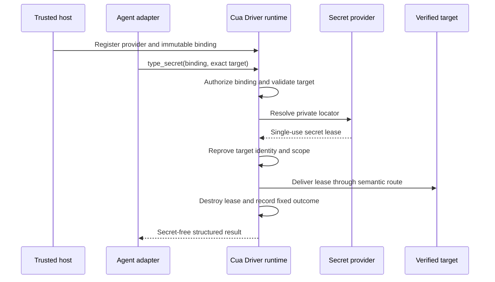

# RFC 2942: Cua Driver: Secret-reference typing

## Summary

Cua Driver will add a provider-neutral `type_secret` operation to its canonical
typed SDK. Agent-visible calls provide an opaque, pre-authorized binding and an
exact delivery target. Trusted host code maps that binding to a private
password-manager or secret-store locator and constrains the applications,
origins, fields, lifetime, and number of uses for which it is valid.

The runtime resolves the secret locally, delivers it directly to a freshly
verified semantic target, and disposes of the value without placing plaintext
in model input, public SDK or MCP arguments, CLI arguments, clipboard state,
action recordings, overlays, telemetry, or ordinary logs. A bounded internal
delivery buffer necessarily contains the value, and browser delivery may
serialize it inside the private CDP connection. The destination application
receives the value by design; neither the agent nor an intermediate generic
text channel does.

The first provider integration will target 1Password. The public contract will
remain provider-neutral so other password managers, OS keychains, and managed
secret stores can implement the same lifecycle and privacy requirements.

The first user-visible slice is deliberately narrower than the eventual
contract: it supports a fake provider, browser password fields, and a directly
supervised runtime only. Persistent authenticated browser profiles remain the
default steady state. Native delivery and agent-facing CLI, MCP, shared-daemon,
and service exposure are deferred until each topology has a trusted binding
registration path and equivalent privacy evidence.

`type_secret` is a release capability, not a vault-reading capability. It does
not search a vault, reveal a value, return a value, or let an agent select a raw
provider locator. It cannot automatically unlock a personal vault or bypass
provider-required user presence.

## Motivation

Authenticated browser and desktop workflows sometimes need to enter a saved
password or another sensitive value. The current `type_text` contract requires
the caller to send the plaintext as a tool argument. Redacting that argument
from later telemetry or recordings is useful, but it cannot remove plaintext
that was already present in a model request, client transcript, transport
payload, shell pipeline, or generic action path.

Password-manager browser extensions provide a safer interactive flow, but
they intentionally depend on application unlock state and user interaction.
Secrets-automation products provide unattended resolution, but Cua Driver has
no typed bridge between a trusted secret binding and an exact GUI target. A
caller must currently choose among exposing plaintext to `type_text`, using a
clipboard, composing shell commands, or taking over an interactive extension.

The missing contract is not “read this secret.” It is:

> Release the value represented by this already-authorized binding to this
> exact, freshly verified target, without giving the value or provider locator
> to the agent.

That distinction lets an agent express intent while the trusted host continues
to own credential selection, provider authority, destination scope, and
lifecycle.

## Goals

- Keep secret plaintext out of model-visible requests, agent transcripts,
  public transport envelopes, CLI arguments, clipboard state, recordings,
  overlays, telemetry, and ordinary logs.
- Define one provider-neutral typed SDK contract rather than one public tool
  per provider, while exposing it only through certified topologies.
- Let trusted host code register opaque bindings with private provider
  locators, exact target constraints, expiry, and use limits.
- Resolve and deliver a secret only to a freshly verified semantic browser
  target in the first release, with native accessibility delivery deferred.
- Make 1Password the first provider without exposing raw `op://` references,
  vault names, item names, or field names to the agent-facing tool.
- Preserve canonical authorization and permission-mode ceilings in the
  directly supervised runtime first, then require equivalent evidence before
  enabling private-worker, service, MCP, CLI, or shared-daemon topologies.
- Return stable structured outcomes for provider, authorization, target, and
  partial-delivery failures without including secret-derived data.
- Define cross-platform evidence required before any target route is
  advertised as supported.
- Keep form submission and other consequential actions separate from secret
  delivery.

## Non-goals

- Store, generate, rotate, recover, display, or return credentials.
- Automatically unlock a personal password-manager vault with its account
  password.
- Bypass Touch ID, Apple Watch, Windows Hello, MFA, passkeys, provider policy,
  or another user-presence requirement.
- Expose vault search, item enumeration, raw provider URIs, or secret values to
  the model.
- Deliver secrets to terminals, shells, clipboards, browser address bars,
  arbitrary content-editable controls, or pixel-only targets in the first
  release.
- Support visibly unmasked destination fields in the first release.
- Make Cua Driver a security boundary against arbitrary unsandboxed code
  running as the same OS principal as the configured provider credential.
- Prevent the approved destination application or page from reading the value
  it receives.
- Automatically submit a form or perform a consequential action after filling
  a field.
- Replace workload identity, OAuth refresh tokens, service accounts, or API
  integrations where those are the appropriate solution.
- Standardize provider-side credential creation, sharing, or rotation policy.

## Terminology

**Secret provider**
: A trusted runtime adapter that resolves a private locator through a password
manager, OS keychain, or managed secret store.

**Provider locator**
: A provider-specific pointer such as a 1Password secret reference. It may
reveal vault, item, or field metadata and is therefore private trusted-host
configuration, not an agent-visible tool argument.

**Secret binding**
: An immutable trusted mapping from an opaque public binding identifier to a
private provider locator plus allowed targets, lifetime, use limits, and
authorization metadata.

**Binding identifier**
: An opaque label available to an agent for selecting one pre-authorized
capability. It is not a bearer credential and cannot be used outside its
runtime, session, generation, or target scope.

**Secret lease**
: A single-use, non-cloneable, zeroizing in-memory value returned by a provider
for one authorized delivery attempt.

**Delivery target**
: In the first release, a semantic browser password element bound to a live
browser process, tab, origin, runtime generation, and element identity. The
contract may later add native accessibility targets after separate review.

**Trusted configuration surface**
: In the first release, a Rust SDK constructor or directly supervised host API
unavailable to agent-visible tool calls. A later authenticated service setup or
managed manifest must prove equivalent ownership before it can register
bindings.

**Agent-facing surface**
: MCP, CLI automation arguments, or another adapter through which an agent can
choose published tools and their public inputs.

## Current state

### Plaintext is part of the current text-input contract

[`TypeTextInput`](../libs/cua-driver/rust/crates/cua-driver-contract/src/inputs.rs)
contains a public `text` string. The generated Rust, Python, TypeScript, CLI,
and MCP projections must therefore receive the value before the native runtime
can type it.

The canonical tool registry already provides useful foundations:

- all runtime topologies pass through one authorization boundary;
- desktop and browser input have risk and target scopes;
- concurrent text delivery to one process is coordinated;
- runtime generations, sessions, browser bindings, and element refs support
  stale-target refusal;
- tool observation avoids retaining arbitrary request arguments; and
- sensitive fields for several existing tools are redacted from deterministic
  recordings.

These controls reduce accidental retention after a call reaches the runtime.
They do not create a channel in which the caller can request secret delivery
without first possessing the plaintext.

### Generic input observability is not a secret-delivery contract

The current action label for `type_text` can summarize text for the visible
overlay, and deterministic recording receives public action arguments before
tool-specific redaction. A future secret operation cannot rely on every generic
consumer remembering to scrub one more field. Its contract must make plaintext
unrepresentable in public inputs and require fixed, secret-free observability
at the canonical boundary.

The current browser semantic projection also exposes password inputs as an
ordinary `textbox`, without a secure-field bit. Browser delivery serializes
text into private CDP JSON, recording redaction defaults to pass-through for
tools without an explicit arm, and the shared daemon authenticates same-user
peers without proving which host registered a secret binding. Native macOS text
delivery may read back accessibility values to verify ordinary input. These are
not defects in generic input, but they establish four prerequisites for this
feature: secure-field semantics, fail-closed per-tool recording policy, trusted
binding registration per topology, and a secret route that never performs
plaintext readback.

This RFC does not classify the existing behavior as a vulnerability. Generic
text input is expected to accept and display arbitrary text. It is the wrong
primitive for a value that the agent must never receive.

### Authorization is already runtime-owned

[RFC 2549](2549-cua-driver-sdk-owned-runtime.md) makes trusted host code the
owner of runtime and session authorization. Agent-visible calls cannot create,
select, or widen that authority. `type_secret` extends this model: trusted host
code owns providers and bindings, while an agent may invoke only bindings
already present in its effective session context.

Issue [#2381](https://github.com/trycua/cua/issues/2381) defines the permission
mode and protected-consent direction. Unrestricted mode suppresses Cua prompts
within a trusted runtime ceiling; it does not turn a denied provider, missing
binding, or wrong destination into an allow.

### 1Password provides two relevant operating modes

1Password documents desktop-app and browser-extension integration for
interactive filling, and CLI service accounts for unattended scripts with
vault-scoped access. It also supports secret-reference URIs for `op read` and
`op run`.

Those provider facilities do not define Cua Driver target identity,
authorization, transport redaction, action recording, cancellation, or
cross-platform delivery. The initial adapter must preserve 1Password's own
unlock and user-presence behavior while adding Cua's target-bound delivery
contract.

## Delivery routes

Several implementation routes are complementary, but they do not provide the
same security boundary.

| Route                                            | Plaintext reaches model | Plaintext reaches Cua runtime | Unattended                | Target proof                  | Role                                 |
| ------------------------------------------------ | ----------------------- | ----------------------------- | ------------------------- | ----------------------------- | ------------------------------------ |
| Persistent authenticated profile                 | No                      | No                            | Yes, until expiry         | Existing browser binding      | Preferred steady state               |
| Password-manager extension or Universal Autofill | No                      | Usually no                    | Usually no                | Provider UI plus current page | Interactive recovery                 |
| Host-provided fake provider                      | No                      | Yes                           | Yes                       | Cua semantic target           | First contract and delivery slice    |
| In-runtime provider trait                        | No                      | Yes                           | Provider-dependent        | Cua semantic target           | Primary architecture                 |
| Provider subprocess adapter                      | No                      | Yes, at delivery edge         | Yes with service identity | Cua semantic target           | Optional provider-packaging fallback |
| Provider-owned target-bound fill API             | No                      | No                            | Provider-dependent        | Provider and Cua proof        | Strongest future route               |

### Route A: Placeholder-backed `type_secret`

A trusted host registers an opaque binding whose value is already present in
protected host memory. The model sees only the binding, and the runtime injects
the value at execution. This is the fastest way to prove the public contract,
target binding, redaction, recording, and cross-platform behavior with a
deterministic fake provider.

It does not solve provider acquisition or isolate the secret from the host
process. It should be the first implementation slice and test seam, not the
final 1Password architecture.

### Route B: In-runtime provider trait

Trusted host code supplies a `SecretProvider` implementation through runtime
construction options. The runtime resolves a binding into a single-use lease
and delivers it directly. The interface is provider-neutral; the first slice
uses a deterministic fake provider, and a later 1Password adapter implements
the same trait.

The resolved value necessarily crosses the runtime's delivery edge. This route
therefore keeps the secret outside the agent and public tool contract, not
outside the runtime or machine. That boundary is suitable for an agent limited
to the published driver contract, but not for unsandboxed same-user code with
arbitrary process access.

### Route C: Provider subprocess adapter

A `SecretProvider` implementation may launch a private, non-reattachable child
through an inherited authenticated channel. The child owns the provider SDK or
CLI session, raw locator, and bootstrap credential. The runtime sends only an
authorized resolution request and receives a single-use lease immediately
before target delivery.

This can contain provider dependencies and bootstrap authentication state and
permit strict output controls. It is not the architecture itself and is not
the same topology as RFC 2549's host-launched driver worker: the direction of
supervision and trust is different. The runtime still sees the resolved value
at the delivery edge.

Use this adapter only if the provider packaging spike demonstrates a meaningful
credential-containment or dependency benefit. It adds authenticated IPC,
worker lifecycle, cancellation, cross-platform packaging, and process-identity
work, so it is not the default durable route.

### Route D: Provider-owned fill

Cua Driver navigates to and identifies the exact field, then a password-manager
extension, OS autofill service, or future documented provider API fills it. The
secret never materializes in Cua memory. This is the strongest data-flow route
when the provider offers a programmable target-bound API.

Current extension and desktop-app flows are designed around interactive user
intent and unlock state, and Cua cannot assume a stable agent API. This remains
the recommended interactive fallback and a future provider capability, not the
unattended first release.

### Route E: Persistent session first, `type_secret` only on expiry

Cua Driver can minimize secret handling by preserving an isolated authenticated
browser profile and checking for a logged-out state before invoking
`type_secret`. Reauthentication produces fresh browser state, after which
ordinary scheduled work reuses it.

This route should be combined with A, B, or C. It reduces secret-release
frequency and MFA friction but adds responsibility for protecting and revoking
the browser profile as a bearer credential.

### Recommended sequence

1. Keep persistent authenticated profiles as the default steady state and
   retain provider extension/Universal Autofill for interactive recovery.
2. Add secure browser-field semantics and explicit fail-closed recording policy.
3. Add the provider-neutral contract, trusted in-runtime `SecretProvider`
   trait, immutable bindings, and fake provider without publishing the tool.
4. Add a distinct R3 `secret_release` authorization adapter.
5. Enable an off-by-default browser-only fake-provider slice in a directly
   supervised runtime and prove target, retention, and failure behavior.
6. Run a throwaway 1Password packaging spike comparing a supervised official
   CLI adapter with an optional helper using an official SDK.
7. Implement the winning adapter behind the same provider trait; use a
   subprocess only when the spike proves a material benefit.
8. Consider shared-daemon, service, MCP, CLI, and native exposure only after
   each topology has trusted registration and equivalent acceptance evidence.
9. Adopt Route D when a provider exposes a documented target-bound fill API.

## Proposal

### 1. Add one canonical `type_secret` operation

`type_secret` is a canonical typed SDK operation. The first slice remains a
Rust-only experimental capability in a directly supervised runtime; it is not
projected into generated language bindings, MCP, CLI, HTTP, or shared service
adapters until those topologies are certified. Its conceptual public input is:

```text
type_secret {
  session,
  binding,
  target
}
```

The public input contains no plaintext, provider selection, provider token,
provider locator, vault name, item name, field name, command, environment
variable, or value-derived metadata.

The canonical Rust contract will use closed types equivalent to:

```rust
pub struct TypeSecretInput {
    pub session: Option<String>,
    pub binding: SecretBindingId,
    pub target: BrowserSecretTarget,
}
```

The exact browser target fields remain a review decision, but they must carry
enough identity to reprove the destination immediately before delivery. A
caller-chosen session label or element ref alone is never authority. A future
native target is a contract extension, not part of version one.

`type_secret` is defined once at the canonical SDK/tool boundary. Only adapters
that advertise the certified capability may register it, and no adapter may
resolve providers or deliver input independently.

### 2. Register providers and bindings through trusted host configuration

Trusted host code supplies a provider registry through Rust-only
`DriverHostOptions` before admitting agent work. It registers immutable
bindings through the same SDK-only constructor surface, conceptually equivalent
to:

```rust
pub trait SecretProvider: Send + Sync {
    fn class(&self) -> SecretProviderClass;

    fn resolve<'a>(
        &'a self,
        locator: &'a ProviderSecretLocator,
        context: &'a SecretResolutionContext,
    ) -> SecretProviderFuture<'a>;
}

pub type SecretProviderFuture<'a> = Pin<Box<dyn Future<
    Output = Result<SecretLease, SecretProviderError>,
> + Send + 'a>>;
```

The trait is the architecture boundary. An implementation may call an SDK,
supervise an official CLI, or use a private child adapter without changing the
binding, authorization, delivery, or observability contracts.

Bindings are also trusted constructor configuration in version one:

```rust
pub struct SecretBindingSpec {
    pub id: SecretBindingId,
    pub provider: SecretProviderId,
    pub private_locator: ProviderSecretLocator,
    pub allowed_targets: Vec<SecretTargetConstraint>,
    pub expires_at: Option<Timestamp>,
    pub max_resolutions: Option<u32>,
    pub max_deliveries: Option<u32>,
    pub authorization: SecretReleaseAuthorization,
}
```

This registration operation is not exposed through UniFFI, generated language
bindings, MCP, CLI, HTTP, or an already-running shared service. Underscore
arguments, public session IDs, environment metadata on an already-running
process, and agent-provided manifests cannot create or replace a binding.

A binding belongs to one runtime generation and one effective session
authorization context. It is revoked on session teardown, runtime restart,
provider replacement, managed-policy change, explicit revoke, or expiry.

Binding identifiers are opaque labels, not global locators or bearer tokens.
The runtime rejects duplicate IDs with conflicting definitions. Adapters never
serialize provider locators into an agent-visible schema or result.

### 3. Treat secret release as an R3 capability

Secret release can disclose an account credential to a destination and is more
sensitive than ordinary keyboard input. It uses a distinct canonical
`secret_release` authorization adapter at R3 with a resource kind such as
`bound_secret_release_to_verified_target`.

- **Standard:** denied in version one. A later protected grant flow must bind
  provider, secret binding, and exact target scope before Standard can enable
  the capability.
- **Bounded/autonomous:** requires an immutable trusted session manifest that
  names the binding and exact target scope.
- **Unrestricted:** suppresses Cua approval prompts only when the trusted
  runtime ceiling admits secret release and the binding already exists. It
  cannot create or widen a binding.

Managed policy, user policy, hard target invariants, binding scope, expiry, use
limits, provider authentication, and provider-required user presence apply in
every mode. No Cua mode can unlock a provider or widen its vault access.

The permission adapter uses a distinct operation and resource kind rather than
inheriting the broad `desktop_input` grant. Ordinary permission to type text is
not permission to release a secret.

The authorization scope binds at least the runtime and session generation,
binding ID and definition digest, provider ID and class, browser fingerprint,
tab or target identity, origin, element ref and secure-field state, permission
mode, and relevant policy hashes. Hard target, binding, provider, OS,
user-presence, and managed-policy checks remain mandatory even in unrestricted
mode. Form submission remains a separate authorized action.

### 4. Resolve into a single-use in-memory lease

After authorization and initial target validation, the runtime asks the
configured provider to resolve the binding's private locator. The provider
returns a `SecretLease` with these properties:

- UTF-8 text only in the first version;
- a conservative maximum size fixed by the contract;
- non-cloneable, non-debuggable, and non-serializable;
- best-effort zeroized on success, refusal, cancellation, timeout, panic
  containment, provider death, or partial delivery;
- consumed by one delivery attempt;
- never cached by Cua Driver; and
- unavailable to debug formatting and error conversion.

The provider adapter may keep its own authenticated connection or cache only
non-secret availability state. Cua Driver does not cache resolved values.

Zeroization is a defense-in-depth lifecycle property, not a proof that copies
never exist. The runtime cannot prove erasure across allocator moves, provider
libraries, JSON construction, CDP WebSocket buffers, browser internals, FFI, or
platform input APIs. Acceptance therefore focuses on bounded lifetime and the
absence of the secret from public or retained artifacts.

Resolution and delivery counts are reserved atomically so concurrent calls
cannot exceed a binding limit. A successful provider resolution consumes one
resolution allowance even when later delivery fails. This conservative rule
prevents retry races for rotating or one-time values. Automatic retry after any
delivered prefix is prohibited.

### 5. Bind delivery to an exact semantic target

The runtime validates the target before provider resolution and reproves it
immediately before delivery.

For a browser target, the proof includes:

- authenticated browser binding and runtime generation;
- browser process and endpoint generation;
- tab or target identity;
- exact element ref and compatible element role;
- current origin matching the binding constraint;
- masked input behavior; and
- no redirect, popup, frame, or navigation transition that invalidates scope.

Initial support excludes terminal controls, shells, clipboard targets, browser
address bars, arbitrary editable controls, unmasked fields, and pixel-only
coordinates. A platform or compositor without a trustworthy route returns a
stable structured refusal; it does not downgrade to generic keyboard or
clipboard input.

Native desktop targets are deferred. A future route must bind live process,
window, runtime generation, accessibility element, secure-text role, and focus
or background-delivery guarantees. It must not read the accessibility value
for verification; if no non-secret mutation oracle exists, it reports an
unverifiable effect.

The runtime holds the appropriate target/process input coordinator from final
revalidation through delivery. If identity changes after resolution but before
delivery, the lease is destroyed and the call fails closed.

### 6. Deliver without plaintext readback

The approved browser adapter consumes the lease directly. It does not route the
value through:

- an agent-visible SDK object;
- agent-visible or public transport serialization;
- CLI arguments;
- shell command construction;
- environment variables controlled by the action caller;
- clipboard state;
- a generic action label;
- a replay record; or
- another public Cua tool.

Browser CDP delivery necessarily constructs a bounded private JSON payload in
runtime memory. That is an unavoidable delivery-edge copy, not a public tool
transport, and it must never be logged, recorded, replayed, or returned.

The destination necessarily receives the value. Browser page script may read
a value entered into its page, and a native application may process its secure
field. Origin and application constraints reduce misdirection; they do not
make an approved destination unable to observe its own input.

Verification uses non-secret evidence only: a secure-field mutation event,
masked control state, or another platform signal that confirms a change
without reading or comparing plaintext. The result reuses existing
`ActionResult` and `ActionEffect` states: `Confirmed`, `Partial`,
`Unverifiable`, `SuspectedNoop`, or `Refused`. A route that can acknowledge
delivery but cannot confirm mutation reports `Unverifiable`. It must not reveal
length or masked-character count as a proxy for the secret.

Form submission remains a separate `press_key`, `click`, or browser action
with its own authorization and verification.

### 7. Define fixed, secret-free results and refusals

The result reuses the existing action-result contract and adds no
secret-derived fields. It may report:

- fixed effect: `Confirmed`, `Partial`, `Unverifiable`, `SuspectedNoop`, or
  `Refused`;
- fixed provider class;
- fixed delivery route class;
- sanitized target identity already available to the caller; and
- fixed structured outcome code.

Initial refusal and failure codes include:

```text
secret_binding_not_found
secret_binding_expired
secret_binding_revoked
secret_binding_scope_denied
secret_provider_unavailable
secret_provider_locked
secret_user_presence_required
secret_resolution_failed
secret_value_invalid
secret_target_stale
secret_target_mismatch
secret_target_unsupported
secret_delivery_incomplete
secret_delivery_unverified
```

Error messages are fixed prose selected by code. Provider stdout, stderr,
exception text, item metadata, value length, and destination readback never
enter the public error.

### 8. Make recordings intentionally non-secret and non-replayable

The tool registry requires an explicit recording policy for every operation;
an unclassified tool fails closed rather than inheriting pass-through
recording. The `type_secret` recording arm stores only:

- operation name;
- fixed outcome code and effect;
- fixed route/provider classes when allowed;
- sanitized target identity; and
- a session-scoped digest when local audit correlation is enabled.

They omit the raw binding ID, provider locator, provider metadata, value,
length, masked character count, and provider diagnostics.

A recording marks the operation non-replayable. Playback fails before provider
resolution. A later explicit rebind workflow would require a fresh trusted
binding in a new authorization context and is outside this proposal.

The visible action label is fixed text such as `Fill saved secret`. It never
contains the binding, item, field, target label, or value.

### 9. Add 1Password through a provider adapter

The first real adapter supports a synthetic, dedicated automation vault and
the least-privilege authentication modes offered by 1Password. It follows the
fake-provider browser slice rather than landing with the initial contract.

Two modes require separate certification:

1. **Service-account mode** for unattended workflows. The 1Password service
   account is restricted to the required vaults. Its bootstrap credential is
   trusted host configuration and never an agent argument.
2. **Desktop-app mode** for interactive workflows. The adapter integrates with
   the signed 1Password application/CLI path and preserves account-password,
   device-unlock, biometric, Apple Watch, or system-authentication prompts.

The official 1Password SDKs currently cover Go, JavaScript, and Python, are
version 0, and do not provide a Rust SDK. The first real-provider spike
therefore compares a supervised official CLI service-account adapter with an
optional small Go helper using the official SDK. It measures packaging,
executable identity, bootstrap-token handling, bounded output, cancellation,
stderr containment, subprocess cleanup, and secret lifetime. No production
adapter is selected before that evidence exists.

The CLI route is rejected if the executable cannot be pinned or verified,
output cannot be bounded, stderr can leak provider data, cancellation cannot
reliably reap children, or a locator or bootstrap token must enter
agent-visible arguments. The Go helper is rejected if its packaging and
lifecycle cost outweighs a measurable control benefit. A separate provider
subprocess is abandoned if it costs materially more than an in-process adapter
without meaningfully containing bootstrap authority.

Raw `op://` references remain inside trusted binding configuration. The agent
sees only its opaque binding ID.

### 10. Keep provider and runtime boundaries explicit

`type_secret` keeps secrets out of the agent's reach, not out of the machine.
It protects against agents limited to Cua Driver's published contract. It does
not protect provider credentials from arbitrary unsandboxed code running as the
same OS user or inside the same trusted host process.

Deployments that need that boundary use a separate service identity, sandbox,
VM, or equivalent external isolation. The first release does not expose the
capability through the current shared daemon: same-UID peer authentication does
not prove which host owns a provider registry. Any future daemon or service
mode must authenticate the host and bind an immutable trusted registry before
admitting calls; remote clients cannot upload provider locators or bootstrap
credentials.

The provider adapter never broadens the runtime's existing platform
permissions. Accessibility, browser attachment, focus, secure-input, and
provider permissions must already be available or produce a structured
refusal.

## Data and control flow



The host-to-runtime registration channel is trusted. The agent-to-runtime
channel never carries provider configuration or plaintext. The
provider-to-runtime edge and bounded browser-delivery buffer carry plaintext
inside the trusted runtime boundary. The runtime-to-target edge is the only
intended external release.

## Lifecycle and concurrency

1. Trusted host constructs the runtime authorization ceiling and provider
   registry.
2. Trusted host admits an immutable session context and its secret bindings.
3. Agent calls `type_secret` using a published binding ID and exact target.
4. Runtime authorizes, validates, reserves use, resolves, reproves, and
   delivers.
5. Runtime destroys the lease before returning.
6. Session end, revoke, provider replacement, policy change, or runtime restart
   invalidates the binding and cancels pending resolutions.

Only one secret delivery may be active for the same target at a time. Binding
use counters are atomic across adapters and runtime registries. Cancellation
before delivery reports no effect. Cancellation after a delivered prefix
reports partial effect, consumes the use, destroys the lease, and never retries.

Provider resolution has an explicit deadline shorter than the binding's
lifetime. A user-presence prompt may extend only through a trusted provider
state transition, not by accepting arbitrary agent-provided text.

## Alternatives considered

### Continue using `type_text` plus redaction

Redaction occurs after a caller already possessed and transmitted the secret.
It cannot prove absence from model context, agent transcripts, client logs, or
transport capture. Generic text input also has valid observability behavior
that is inappropriate for a secret.

### Pipe `op read` into an existing tool or CLI

Shell pipelines, command substitution, process arguments, captured stdout,
environment variables, and generic tool arguments create several independent
plaintext surfaces. A local wrapper can reduce some exposure but cannot create
the target and authorization contract shared by every adapter.

### Use the clipboard

Clipboard managers, application observers, synchronization, later reads, and
recording make the clipboard an unsuitable secret transport. The first release
prohibits it as a hard invariant.

### Rely only on password-manager browser autofill

Provider-owned autofill is excellent when available because Cua Driver may
never materialize the value. It remains an interactive, browser-specific UI
flow whose availability and unlock behavior vary by provider and platform.
This RFC does not replace it; interactive automation may continue to prefer it.

If a future provider exposes a documented target-bound fill API, it may
implement the provider interface without returning plaintext to Cua Driver,
provided it meets the same authorization and evidence contract.

### Put `provider` and `op://...` in `type_secret`

This simple schema leaks vault structure and lets an agent select arbitrary
items or fields within the provider credential's reach. Provider selection and
raw locators therefore remain trusted configuration. The model receives only
an opaque, pre-authorized binding.

### Add one public tool per provider

Provider-specific tools would duplicate target validation, authorization,
redaction, recording, generated bindings, and platform tests. Providers belong
behind one SDK contract.

### Use only OS keychains

OS keychains are useful provider implementations but do not define a portable
password-manager contract. Limiting the design to one OS would also encourage
platform-specific target and permission behavior to drift.

### Let the provider extension fill the field through pixel automation

This keeps plaintext outside the model but cannot always prove which vault
item or destination field was selected. It remains a supported interactive
fallback, not the unattended `type_secret` acceptance path.

## Compatibility and migration

The change is additive. Existing `type_text` behavior and signatures remain
available. Documentation recommends `type_secret` when a trusted binding
exists, but the runtime never silently rewrites `type_text`, scrapes a password
manager, or falls back from a failed `type_secret` call to plaintext input.

The provider registry and operation ship behind an experimental capability.
Disabling the capability is the rollback path. Rollback removes provider-backed
delivery; it does not weaken target or authorization checks and does not reveal
the binding locator to enable a fallback.

The first slice exposes the capability only through the Rust SDK in a directly
supervised runtime. Other generated SDKs and MCP, CLI, HTTP, worker, daemon, or
service adapters advertise the capability only after they pass
topology-specific registration, authorization, retention, and target tests.
Until then they return a structured unsupported refusal and do not publish an
invocable tool.

Provider implementations may be added behind the same internal trait without
changing the public operation when they satisfy the same lifecycle and privacy
requirements.

The first release supports only routes certified by the acceptance matrix.
Unsupported platforms or target kinds return `secret_target_unsupported`
rather than emulating support through generic input.

## Security, privacy, and telemetry

### Threat model

The agent may be influenced by untrusted page or application content. It can
choose only published tools and public arguments. It may try to enumerate
bindings, redirect delivery, race navigation or focus, induce verbose provider
errors, trigger partial input, or recover a value from observability surfaces.

Trusted host code owns provider authentication, private locators, binding
registration, runtime ceiling, and effective session authorization. The
approved destination is trusted to receive the selected value but may still be
compromised; target constraints minimize accidental or prompt-injected release
without claiming to secure the destination itself.

An agent with arbitrary unsandboxed code execution as the provider OS principal
is outside this boundary. It may invoke the provider independently, inspect the
destination, or read trusted-host memory. Such deployments require an external
isolation boundary.

### Forbidden data surfaces

The following agent-visible, public, or retained surfaces must never contain
plaintext, provider authentication tokens, raw provider locators, vault names,
item names, field names, one-time codes, or value lengths:

- model and agent-visible tool schemas;
- public SDK, MCP, HTTP, daemon, and CLI serialized requests or results;
- command-line arguments and shell source;
- generic inherited environment controlled by the action caller;
- debug formatting, panic text, error conversion, stdout, and stderr;
- logs, telemetry, tracing attributes, metrics labels, and crash diagnostics;
- overlays, notifications, action labels, and driver-owned screenshots;
- action recordings, replay artifacts, journals, and deterministic fixtures;
- clipboard state and clipboard history; and
- serialized session authority, grants, or binding manifests available to the
  agent.

Provider-specific bootstrap credentials and locators exist inside trusted host
configuration and provider IPC by necessity. They are forbidden from the
agent-facing and observability surfaces above.

Resolved plaintext exists transiently in the provider lease, the bounded
runtime delivery buffer, private browser-protocol serialization, and the
destination. Those unavoidable surfaces must be enumerated, minimized, and
excluded from all retained artifacts; they are not covered by an impossible
claim of process-wide non-serialization.

### Telemetry and local audit

Telemetry may record only fixed provider classes, fixed delivery-route
classes, fixed outcome codes, and coarse timing buckets. It must not record raw
binding IDs or target labels.

An explicitly enabled local audit log may correlate calls using a keyed,
session-scoped digest that changes across sessions and cannot be reversed into
the binding ID. It records authorization decision, fixed effect, fixed route,
and timestamps. It omits provider diagnostics and all secret-derived data.

### Hard invariants

- Agent-visible calls cannot register, replace, enumerate, or widen bindings.
- A generic text-input grant does not authorize secret release.
- A secret-release grant cannot outlive its session or runtime generation.
- Unrestricted mode cannot bypass binding, target, provider, managed-policy,
  or OS/platform constraints.
- Provider-required user presence cannot be synthesized through MCP, terminal,
  or model text.
- Wrong, stale, unmasked, pixel-only, terminal, shell, clipboard, and address
  bar targets fail before provider resolution where possible and always before
  delivery.
- Secret plaintext is never returned or read back for verification.
- No automatic retry follows provider resolution or any possible partial
  delivery.
- Disabling the feature cannot fall back to `type_text`.

## Implementation plan

### Slice A: Contract types, not invocable

- Add canonical browser input, result, provider, binding, lease, and refusal
  types.
- Keep registration out of the tool registry and every generated adapter.
- Compile contract fixtures without exposing an invocable operation.

Exit: the provider-neutral shape is reviewable without creating a release path.

### Slice B: Trusted provider and binding foundation

- Add an object-safe `SecretProvider` trait supplied through Rust-only
  `DriverHostOptions`.
- Add immutable constructor-time bindings scoped to runtime and session
  generations.
- Implement a deterministic fake provider and single-use, non-cloneable,
  non-debuggable leases with bounded size and lifetime.

Exit: provider, binding, expiry, revocation, cancellation, and concurrency tests
pass without reaching platform input.

### Slice C: R3 authorization

- Add the distinct `secret_release` adapter and exact resource scope.
- Deny Standard in version one, require a trusted manifest in Bounded, and keep
  hard checks active in Unrestricted.
- Prove generic browser and desktop input grants never imply secret release.

Exit: every mode and policy ceiling has stable allow or refusal evidence.

### Slice D: Fail-closed privacy policy

- Require an explicit recording policy for each registered operation.
- Add fixed action labels, results, telemetry, errors, panic handling, and a
  non-replayable `type_secret` recording arm.
- Scan retained artifacts with randomized synthetic canaries.

Exit: unclassified tools fail registration or recording tests, and no retained
artifact contains a canary.

### Slice E: Secure browser semantics

- Project password/secure state separately from a generic `textbox`.
- Add exact browser target input and origin, field, ref, and generation checks.
- Hold authenticated browser and target identity through final revalidation and
  delivery.
- Support only masked password controls in certified standalone Chrome/Edge
  paths.

Exit: redirect, popup, frame, navigation, target-generation, and focus races
fail closed before delivery.

### Slice F: Browser-only fake-provider capability

- Register the operation off by default only for a directly supervised runtime.
- Deliver through the dedicated browser route without generic text handling or
  plaintext readback.
- Reuse existing action effects and publish typed capability discovery.

Exit: the intended synthetic password field changes, no other field changes,
and all authorization and retention tests pass at the candidate SHA.

### Slice G: Throwaway 1Password packaging spike

- Compare a supervised official CLI service-account adapter with an optional Go
  helper using the official SDK.
- Measure executable identity, bootstrap-token handling, locator isolation,
  bounded output, cancellation, stderr containment, reaping, packaging, and
  secret lifetime against a synthetic vault.
- Publish no provider capability from the spike.

Exit: an evidence memo selects one adapter or records that neither route meets
the release criteria.

### Slice H: First real provider and later topologies

- Implement the selected adapter behind the existing `SecretProvider` trait.
- Certify service-account mode; keep desktop-app mode interactive and preserve
  provider-required user presence.
- Add generated bindings, MCP, CLI, daemon, service, and native routes only in
  later slices with topology-specific trusted registration and acceptance
  evidence.

Exit: at least one real provider and browser matrix pass before the feature is
advertised outside an experimental directly supervised runtime.

## Test and acceptance plan

The RFC is completed only when the following evidence passes.

### Contract and authorization

- The directly supervised Rust runtime exposes the canonical browser input,
  existing action result, and stable refusal codes.
- Every uncertified adapter omits the invocable capability or returns a typed
  unsupported result without accepting a binding.
- No agent-visible schema contains provider configuration or plaintext fields.
- Duplicate, substituted, expired, revoked, cross-session, and
  cross-generation bindings fail before provider resolution.
- Standard denial, Bounded manifest enforcement, and Unrestricted hard-check
  behavior match the R3 rules above.
- Managed and user policy denials remain effective in unrestricted mode.
- Generic input grants cannot authorize secret release.
- Runtime and session teardown invalidate pending leases and bindings.

### Canary and retention tests

For each run, generate a unique synthetic canary and scan:

- public request and result envelopes;
- current public SDK and transport fixtures plus negative fixtures for every
  deferred adapter;
- process arguments and captured generic environment;
- stdout, stderr, tracing, logs, metrics, and telemetry;
- debug, error, panic, cancellation, timeout, and crash output;
- overlays, notifications, action labels, screenshots, and videos;
- action records, recording bundles, replay artifacts, and reports; and
- clipboard state before, during, and after delivery.

The canary may appear transiently only in the fake provider lease, enumerated
bounded runtime delivery buffers including private CDP serialization, and the
intended destination oracle. It must not appear in any public request, result,
recording, log, crash output, fixture, or other retained artifact. Test
harnesses must never publish the canary in CI summaries or artifacts.

### Provider behavior

- Fake-provider success, missing provider, permission denial, malformed output,
  oversized value, invalid UTF-8, timeout, cancellation, and provider death
  produce fixed secret-free outcomes before the first real adapter lands.
- The provider spike covers wrong executable or SDK identity, locked provider,
  required user presence, missing item, stderr noise, cancellation, and child
  cleanup.
- Service-account access is confined to the synthetic vault used by the test.
- Desktop integration preserves provider-required authentication.
- Resolution values are not cached and leases are destroyed on every path.
- Provider processes are bounded, cancelled, and reaped without orphaning.

### Adversarial target behavior

- Stale refs, wrong origin, redirects, popups, nested frames, navigation during
  resolution, process replacement, runtime restart, focus swap, window swap,
  wrong role, unmasked field, terminal, shell, clipboard, address bar,
  arbitrary editable, and pixel-only targets fail closed.
- An allowed target cannot be substituted between provider resolution and
  delivery.
- Partial delivery is reported honestly, consumes the reserved use, and is not
  retried.
- The intended field changes and no other field or application changes.
- No plaintext readback occurs.
- Focus, z-order, cursor, and input isolation claims have independent external
  oracles.

### Representative environments

- Standalone Chrome and Edge browser rows run on each environment advertised by
  the first capability.
- Native secure-field rows are deferred and cannot be inferred from browser
  evidence.
- Every row uses a source-built driver at the exact candidate SHA and a
  synthetic provider/vault.
- Before/after evidence, external outcomes, focus/z-order/cursor guards, and
  fixed reports exist for every declared row.
- Environment limitations are established by preflight and reported as
  unavailable, never as passing or silently skipped.

### Release gate

- No plaintext or secret-derived metadata appears in any scanned surface.
- Canonical authorization and target validation cover every transport.
- The fake-provider browser matrix passes before the experimental capability is
  enabled, and at least one 1Password mode passes before a real-provider
  capability is advertised.
- Shared-daemon, service, generated adapter, and native support are advertised
  only after their own trusted-registration and target matrices pass.
- Capability discovery distinguishes provider availability, user-presence
  requirements, and target-route support.
- Documentation states same-user limitations, destination trust, provider
  policy, and safe rollback without suggesting a plaintext fallback.
- The whole feature is stopped if repeated retention scans find secret material
  in an unenumerated public or retained surface.

## Unresolved questions

- Should the public name remain `type_secret`, or should browser and native
  semantic delivery use narrower public names above one internal operation?
- What exact browser target shape provides stable identity without duplicating
  existing action schemas?
- What authenticated manifest design could later let a daemon or service host
  register bindings without making registration agent-visible?
- What protected grant design could safely enable Standard mode?
- Does the 1Password spike select the supervised CLI adapter or justify the
  additional Go helper?
- Can a provider-owned target-bound fill API avoid materializing plaintext in
  Cua Driver while preserving the same evidence contract?
- Which fixed provider metadata is useful enough to permit in local audit and
  telemetry?
- How should deterministic replay request an explicit fresh binding without
  making binding registration agent-visible?
- Which non-secret mutation oracle is sufficient for a future native route that
  cannot read back accessibility plaintext?
- Should one-time passwords use single-use `type_secret` bindings or a narrower
  operation with stricter expiry and replay rules?

## References

- [RFC 2549: Cua Driver SDK-owned runtime and optional services](2549-cua-driver-sdk-owned-runtime.md)
- [Cua Driver permission modes, protected consent, and bounded autonomy](https://github.com/trycua/cua/issues/2381)
- [1Password: Load secrets into scripts](https://developer.1password.com/docs/cli/secrets-scripts)
- [1Password SDKs](https://www.1password.dev/sdks)
- [1Password: About browser autofill security](https://support.1password.com/browser-autofill-security/)
- [1Password: Unlock with device](https://support.1password.com/device-unlock/)

## Decision record

Pending review. The current review draft recommends persistent profiles first;
a browser-only, fake-provider MVP; an in-runtime provider trait supplied by
trusted host options; an optional provider subprocess only when justified by
the packaging spike; and a distinct R3 `secret_release` permission with
Standard denied, Bounded manifest-gated, and Unrestricted still subject to hard
binding, target, provider, OS, user-presence, and managed-policy checks.

Review should resolve the public name and exact browser target shape, the
future protected grant and service-manifest designs, and the supervised CLI
versus optional Go-helper choice after the 1Password spike.
