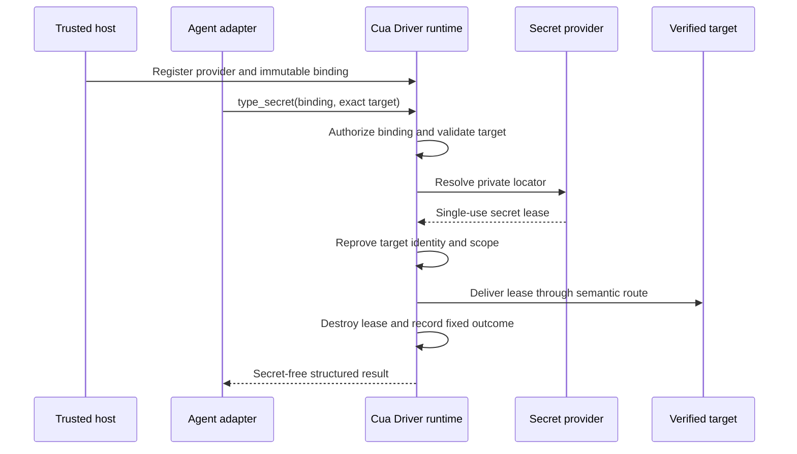

# RFC 2942: Cua Driver: Secret-reference typing

## Summary

Cua Driver will add a provider-neutral `type_secret` operation to its canonical
typed SDK. Agent-visible calls provide an opaque, pre-authorized binding and an
exact delivery target. Trusted host code maps that binding to a private
password-manager or secret-store locator and constrains the applications,
origins, fields, lifetime, and number of uses for which it is valid.

The runtime resolves the secret locally, delivers it directly to a freshly
verified semantic target, and disposes of the value without placing plaintext
in model input, public SDK or MCP arguments, CLI arguments, clipboard state,
action recordings, overlays, telemetry, or ordinary logs. The destination
application receives the value by design; neither the agent nor an
intermediate generic text channel does.

The first provider integration will target 1Password. The public contract will
remain provider-neutral so other password managers, OS keychains, and managed
secret stores can implement the same lifecycle and privacy requirements.

`type_secret` is a release capability, not a vault-reading capability. It does
not search a vault, reveal a value, return a value, or let an agent select a raw
provider locator. It cannot automatically unlock a personal vault or bypass
provider-required user presence.

## Motivation

Authenticated browser and desktop workflows sometimes need to enter a saved
password or another sensitive value. The current `type_text` contract requires
the caller to send the plaintext as a tool argument. Redacting that argument
from later telemetry or recordings is useful, but it cannot remove plaintext
that was already present in a model request, client transcript, transport
payload, shell pipeline, or generic action path.

Password-manager browser extensions provide a safer interactive flow, but
they intentionally depend on application unlock state and user interaction.
Secrets-automation products provide unattended resolution, but Cua Driver has
no typed bridge between a trusted secret binding and an exact GUI target. A
caller must currently choose among exposing plaintext to `type_text`, using a
clipboard, composing shell commands, or taking over an interactive extension.

The missing contract is not “read this secret.” It is:

> Release the value represented by this already-authorized binding to this
> exact, freshly verified target, without giving the value or provider locator
> to the agent.

That distinction lets an agent express intent while the trusted host continues
to own credential selection, provider authority, destination scope, and
lifecycle.

## Goals

- Keep secret plaintext out of model-visible requests, agent transcripts,
  public transport envelopes, CLI arguments, clipboard state, recordings,
  overlays, telemetry, and ordinary logs.
- Define one typed SDK contract consumed by MCP, CLI, and generated language
  bindings rather than one public tool per provider.
- Let trusted host code register opaque bindings with private provider
  locators, exact target constraints, expiry, and use limits.
- Resolve and deliver a secret only to a freshly verified semantic browser or
  native accessibility target.
- Make 1Password the first provider without exposing raw `op://` references,
  vault names, item names, or field names to the agent-facing tool.
- Preserve canonical authorization and permission-mode ceilings across direct,
  private-worker, service, MCP, and CLI topologies.
- Return stable structured outcomes for provider, authorization, target, and
  partial-delivery failures without including secret-derived data.
- Define cross-platform evidence required before any target route is
  advertised as supported.
- Keep form submission and other consequential actions separate from secret
  delivery.

## Non-goals

- Store, generate, rotate, recover, display, or return credentials.
- Automatically unlock a personal password-manager vault with its account
  password.
- Bypass Touch ID, Apple Watch, Windows Hello, MFA, passkeys, provider policy,
  or another user-presence requirement.
- Expose vault search, item enumeration, raw provider URIs, or secret values to
  the model.
- Deliver secrets to terminals, shells, clipboards, browser address bars,
  arbitrary content-editable controls, or pixel-only targets in the first
  release.
- Support visibly unmasked destination fields in the first release.
- Make Cua Driver a security boundary against arbitrary unsandboxed code
  running as the same OS principal as the configured provider credential.
- Prevent the approved destination application or page from reading the value
  it receives.
- Automatically submit a form or perform a consequential action after filling
  a field.
- Replace workload identity, OAuth refresh tokens, service accounts, or API
  integrations where those are the appropriate solution.
- Standardize provider-side credential creation, sharing, or rotation policy.

## Terminology

**Secret provider**
: A trusted runtime adapter that resolves a private locator through a password
manager, OS keychain, or managed secret store.

**Provider locator**
: A provider-specific pointer such as a 1Password secret reference. It may
reveal vault, item, or field metadata and is therefore private trusted-host
configuration, not an agent-visible tool argument.

**Secret binding**
: An immutable trusted mapping from an opaque public binding identifier to a
private provider locator plus allowed targets, lifetime, use limits, and
authorization metadata.

**Binding identifier**
: An opaque label available to an agent for selecting one pre-authorized
capability. It is not a bearer credential and cannot be used outside its
runtime, session, generation, or target scope.

**Secret lease**
: A single-use, non-cloneable, zeroizing in-memory value returned by a provider
for one authorized delivery attempt.

**Delivery target**
: A semantic browser or native accessibility element bound to live process,
window or tab, origin where applicable, runtime generation, and element
identity.

**Trusted configuration surface**
: An SDK constructor, embedded host API, authenticated service setup, or
managed manifest unavailable to agent-visible tool calls.

**Agent-facing surface**
: MCP, CLI automation arguments, or another adapter through which an agent can
choose published tools and their public inputs.

## Current state

### Plaintext is part of the current text-input contract

[`TypeTextInput`](../libs/cua-driver/rust/crates/cua-driver-contract/src/inputs.rs)
contains a public `text` string. The generated Rust, Python, TypeScript, CLI,
and MCP projections must therefore receive the value before the native runtime
can type it.

The canonical tool registry already provides useful foundations:

- all runtime topologies pass through one authorization boundary;
- desktop and browser input have risk and target scopes;
- concurrent text delivery to one process is coordinated;
- runtime generations, sessions, browser bindings, and element refs support
  stale-target refusal;
- tool observation avoids retaining arbitrary request arguments; and
- sensitive fields for several existing tools are redacted from deterministic
  recordings.

These controls reduce accidental retention after a call reaches the runtime.
They do not create a channel in which the caller can request secret delivery
without first possessing the plaintext.

### Generic input observability is not a secret-delivery contract

The current action label for `type_text` can summarize text for the visible
overlay, and deterministic recording receives public action arguments before
tool-specific redaction. A future secret operation cannot rely on every generic
consumer remembering to scrub one more field. Its contract must make plaintext
unrepresentable in public inputs and require fixed, secret-free observability
at the canonical boundary.

This RFC does not classify the existing behavior as a vulnerability. Generic
text input is expected to accept and display arbitrary text. It is the wrong
primitive for a value that the agent must never receive.

### Authorization is already runtime-owned

[RFC 2549](2549-cua-driver-sdk-owned-runtime.md) makes trusted host code the
owner of runtime and session authorization. Agent-visible calls cannot create,
select, or widen that authority. `type_secret` extends this model: trusted host
code owns providers and bindings, while an agent may invoke only bindings
already present in its effective session context.

Issue [#2381](https://github.com/trycua/cua/issues/2381) defines the permission
mode and protected-consent direction. Unrestricted mode suppresses Cua prompts
within a trusted runtime ceiling; it does not turn a denied provider, missing
binding, or wrong destination into an allow.

### 1Password provides two relevant operating modes

1Password documents desktop-app and browser-extension integration for
interactive filling, and CLI service accounts for unattended scripts with
vault-scoped access. It also supports secret-reference URIs for `op read` and
`op run`.

Those provider facilities do not define Cua Driver target identity,
authorization, transport redaction, action recording, cancellation, or
cross-platform delivery. The initial adapter must preserve 1Password's own
unlock and user-presence behavior while adding Cua's target-bound delivery
contract.

## Delivery routes

Several implementation routes are complementary, but they do not provide the
same security boundary.

| Route                                            | Plaintext reaches model | Plaintext reaches Cua runtime | Unattended                | Target proof                  | Role                             |
| ------------------------------------------------ | ----------------------- | ----------------------------- | ------------------------- | ----------------------------- | -------------------------------- |
| Persistent authenticated profile                 | No                      | No                            | Yes, until expiry         | Existing browser binding      | Preferred steady state           |
| Password-manager extension or Universal Autofill | No                      | Usually no                    | Usually no                | Provider UI plus current page | Interactive recovery             |
| Host-provided placeholder substitution           | No                      | Yes                           | Yes                       | Cua semantic target           | Fast contract prototype          |
| In-runtime provider adapter                      | No                      | Yes                           | Yes with service identity | Cua semantic target           | Simple provider MVP              |
| Private secret-provider worker                   | No                      | Yes, only at delivery edge    | Yes with service identity | Cua semantic target           | Recommended durable architecture |
| Provider-owned target-bound fill API             | No                      | No                            | Provider-dependent        | Provider and Cua proof        | Strongest future route           |

### Route A: Placeholder-backed `type_secret`

A trusted host registers an opaque binding whose value is already present in
protected host memory. The model sees only the binding, and the runtime injects
the value at execution. This is the fastest way to prove the public contract,
target binding, redaction, recording, and cross-platform behavior with a
deterministic fake provider.

It does not solve provider acquisition or isolate the secret from the host
process. It should be the first implementation slice and test seam, not the
final 1Password architecture.

### Route B: In-runtime 1Password adapter

The Cua runtime calls a validated 1Password SDK or CLI integration, receives a
zeroizing lease, and delivers it directly. This is the shortest path to a real
unattended provider.

The drawback is that the provider bootstrap credential and resolved value
share the Cua runtime's process boundary. That is acceptable for an agent
limited to the public driver contract, but not for an unsandboxed same-user
agent with arbitrary process access.

### Route C: Private secret-provider worker

A trusted host launches a private, non-reattachable provider worker through an
inherited authenticated channel. The worker owns the 1Password SDK or CLI
session, raw locator, and bootstrap credential. The Cua runtime sends only a
binding digest and authorized resolution request. The worker returns a
single-use lease over the private channel immediately before target delivery.

This contains provider dependencies and authentication state, permits strict
process output controls, and matches RFC 2549's private-worker topology. The
runtime still sees the value at the final delivery edge, but the model-facing
adapter and general driver service do not own provider credentials.

This is the recommended durable architecture after Route A proves the contract.
It adds packaging, authenticated IPC, worker lifecycle, cancellation, and
cross-platform process-identity work.

### Route D: Provider-owned fill

Cua Driver navigates to and identifies the exact field, then a password-manager
extension, OS autofill service, or future documented provider API fills it. The
secret never materializes in Cua memory. This is the strongest data-flow route
when the provider offers a programmable target-bound API.

Current extension and desktop-app flows are designed around interactive user
intent and unlock state, and Cua cannot assume a stable agent API. This remains
the recommended interactive fallback and a future provider capability, not the
unattended first release.

### Route E: Persistent session first, `type_secret` only on expiry

Cua Driver can minimize secret handling by preserving an isolated authenticated
browser profile and checking for a logged-out state before invoking
`type_secret`. Reauthentication produces fresh browser state, after which
ordinary scheduled work reuses it.

This route should be combined with A, B, or C. It reduces secret-release
frequency and MFA friction but adds responsibility for protecting and revoking
the browser profile as a bearer credential.

### Recommended sequence

1. Keep persistent authenticated profiles as the default steady state and
   retain provider extension/Universal Autofill for interactive recovery.
2. Implement Route A with a fake provider, opaque host-registered bindings,
   semantic browser targets, and exhaustive canary tests.
3. Spike Route B against the 1Password SDK and CLI to measure packaging,
   cancellation, output, and memory behavior.
4. Ship the first real provider through Route C unless the spike proves that an
   in-runtime adapter provides the same boundary with materially less risk.
5. Add native secure fields only after the browser target contract is stable.
6. Adopt Route D when a provider exposes a documented target-bound fill API.

## Proposal

### 1. Add one canonical `type_secret` operation

`type_secret` is a typed SDK operation projected through generated language
bindings and agent adapters. Its conceptual public input is:

```text
type_secret {
  session,
  binding,
  target
}
```

The public input contains no plaintext, provider selection, provider token,
provider locator, vault name, item name, field name, command, environment
variable, or value-derived metadata.

The canonical Rust contract will use closed types equivalent to:

```rust
pub struct TypeSecretInput {
    pub session: Option<String>,
    pub binding: SecretBindingId,
    pub target: SecretTarget,
}

pub enum SecretTarget {
    Browser(BrowserSecretTarget),
    Desktop(DesktopSecretTarget),
}
```

The exact target fields remain a review decision, but every variant must carry
enough identity to reprove the destination immediately before delivery. A
caller-chosen session label or element ref alone is never authority.

`type_secret` is registered once at the canonical SDK/tool boundary. MCP,
CLI, HTTP, daemon, and private-worker adapters map to that operation and cannot
resolve providers or deliver input independently.

### 2. Register providers and bindings through trusted host configuration

Trusted host code constructs a provider registry before admitting agent work.
It then registers immutable bindings through an SDK-only or authenticated
managed surface conceptually equivalent to:

```rust
pub struct SecretBindingSpec {
    pub id: SecretBindingId,
    pub provider: SecretProviderId,
    pub private_locator: ProviderSecretLocator,
    pub allowed_targets: Vec<SecretTargetConstraint>,
    pub expires_at: Option<Timestamp>,
    pub max_resolutions: Option<u32>,
    pub max_deliveries: Option<u32>,
    pub authorization: SecretReleaseAuthorization,
}
```

This registration operation is not published as an MCP tool. Underscore
arguments, public session IDs, environment metadata on an already-running
process, and agent-provided manifests cannot create or replace a binding.

A binding belongs to one runtime generation and one effective session
authorization context. It is revoked on session teardown, runtime restart,
provider replacement, managed-policy change, explicit revoke, or expiry.

Binding identifiers are opaque labels, not global locators or bearer tokens.
The runtime rejects duplicate IDs with conflicting definitions. Adapters never
serialize provider locators into an agent-visible schema or result.

### 3. Treat secret release as an R3 capability

Secret release can disclose an account credential to a destination and is more
sensitive than ordinary keyboard input. The initial risk classification is R3.

- **Standard:** requires a protected grant covering the binding and exact
  target constraint unless managed policy denies the capability entirely.
- **Bounded/autonomous:** requires an immutable trusted session manifest that
  names the binding and target scope.
- **Unrestricted:** suppresses Cua approval prompts only when the trusted
  runtime ceiling admits secret release and the binding already exists.

Managed policy, user policy, hard target invariants, binding scope, expiry, use
limits, provider authentication, and provider-required user presence apply in
every mode. No Cua mode can unlock a provider or widen its vault access.

The permission adapter uses a distinct operation and resource kind rather than
inheriting the broad `desktop_input` grant. Ordinary permission to type text is
not permission to release a secret.

### 4. Resolve into a single-use in-memory lease

After authorization and initial target validation, the runtime asks the
configured provider to resolve the binding's private locator. The provider
returns a `SecretLease` with these properties:

- UTF-8 text only in the first version;
- a conservative maximum size fixed by the contract;
- non-cloneable and non-serializable;
- zeroized on success, refusal, cancellation, timeout, panic containment,
  provider death, or partial delivery;
- consumed by one delivery attempt;
- never cached by Cua Driver; and
- unavailable to debug formatting and error conversion.

The provider adapter may keep its own authenticated connection or cache only
non-secret availability state. Cua Driver does not cache resolved values.

Resolution and delivery counts are reserved atomically so concurrent calls
cannot exceed a binding limit. A successful provider resolution consumes one
resolution allowance even when later delivery fails. This conservative rule
prevents retry races for rotating or one-time values. Automatic retry after any
delivered prefix is prohibited.

### 5. Bind delivery to an exact semantic target

The runtime validates the target before provider resolution and reproves it
immediately before delivery.

For a browser target, the proof includes:

- authenticated browser binding and runtime generation;
- browser process and endpoint generation;
- tab or target identity;
- exact element ref and compatible element role;
- current origin matching the binding constraint;
- masked input behavior; and
- no redirect, popup, frame, or navigation transition that invalidates scope.

For a native desktop target, the proof includes:

- live process fingerprint;
- window identity and runtime generation;
- exact accessibility element ref;
- supported secure-text role and masking behavior;
- required focus or background-delivery guarantees; and
- no process, window, focus, or element substitution during delivery.

Initial support excludes terminal controls, shells, clipboard targets, browser
address bars, arbitrary editable controls, unmasked fields, and pixel-only
coordinates. A platform or compositor without a trustworthy route returns a
stable structured refusal; it does not downgrade to generic keyboard or
clipboard input.

The runtime holds the appropriate target/process input coordinator from final
revalidation through delivery. If identity changes after resolution but before
delivery, the lease is destroyed and the call fails closed.

### 6. Deliver without plaintext readback

The approved platform adapter consumes the lease directly. It does not route
the value through:

- an agent-visible SDK object;
- JSON serialization;
- CLI arguments;
- shell command construction;
- environment variables controlled by the action caller;
- clipboard state;
- a generic action label;
- a replay record; or
- another public Cua tool.

The destination necessarily receives the value. Browser page script may read
a value entered into its page, and a native application may process its secure
field. Origin and application constraints reduce misdirection; they do not
make an approved destination unable to observe its own input.

Verification uses non-secret evidence only: a secure field mutation event,
masked control state, or another platform signal that confirms a change
without reading or comparing plaintext. A platform that can acknowledge
delivery but cannot confirm mutation reports `delivered_unverified`. It must
not reveal length or masked-character count as a proxy for the secret.

Form submission remains a separate `press_key`, `click`, or browser action
with its own authorization and verification.

### 7. Define fixed, secret-free results and refusals

The success result reuses the action-result contract where possible and adds
no secret-derived fields. It may report:

- fixed effect: `confirmed`, `delivered_unverified`, `partial`, or `none`;
- fixed provider class;
- fixed delivery route class;
- sanitized target identity already available to the caller; and
- fixed structured outcome code.

Initial refusal and failure codes include:

```text
secret_binding_not_found
secret_binding_expired
secret_binding_revoked
secret_binding_scope_denied
secret_provider_unavailable
secret_provider_locked
secret_user_presence_required
secret_resolution_failed
secret_value_invalid
secret_target_stale
secret_target_mismatch
secret_target_unsupported
secret_delivery_incomplete
secret_delivery_unverified
```

Error messages are fixed prose selected by code. Provider stdout, stderr,
exception text, item metadata, value length, and destination readback never
enter the public error.

### 8. Make recordings intentionally non-secret and non-replayable

Action recordings store only:

- operation name;
- fixed outcome code and effect;
- fixed route/provider classes when allowed;
- sanitized target identity; and
- a session-scoped digest when local audit correlation is enabled.

They omit the raw binding ID, provider locator, provider metadata, value,
length, masked character count, and provider diagnostics.

A recording cannot silently replay secret delivery. Replay requires a fresh
trusted binding mapped into the new authorization context and an explicit
rebind step outside agent-visible playback. Without it, replay returns
`secret_binding_not_found` before provider resolution.

The visible action label is fixed text such as `Fill saved secret`. It never
contains the binding, item, field, target label, or value.

### 9. Add 1Password through a provider adapter

The first adapter supports a synthetic, dedicated automation vault and the
least-privilege authentication modes offered by 1Password.

Two modes require separate certification:

1. **Service-account mode** for unattended workflows. The 1Password service
   account is restricted to the required vaults. Its bootstrap credential is
   trusted host configuration and never an agent argument.
2. **Desktop-app mode** for interactive workflows. The adapter integrates with
   the signed 1Password application/CLI path and preserves account-password,
   device-unlock, biometric, Apple Watch, or system-authentication prompts.

The implementation must pin or verify the provider executable or SDK it loads,
bound its runtime and output, isolate stderr, cancel and reap subprocesses, and
prove that no secret appears in process arguments or inherited generic
environment. The exact CLI-versus-SDK choice remains gated on a spike because
`op read` resolves a secret into process output, while desktop integration has
user-presence and lifecycle behavior that unattended mode cannot assume.

Raw `op://` references remain inside trusted binding configuration. The agent
sees only its opaque binding ID.

### 10. Keep provider and runtime boundaries explicit

`type_secret` protects against agents limited to Cua Driver's published
contract. It does not protect provider credentials from arbitrary unsandboxed
code running as the same OS user or inside the same trusted host process.

Deployments that need that boundary use a private worker, separate service
identity, sandbox, VM, or equivalent external isolation. Service mode must
authenticate the host before binding its trusted registry; remote clients
cannot upload provider locators or bootstrap credentials.

The provider adapter never broadens the runtime's existing platform
permissions. Accessibility, browser attachment, focus, secure-input, and
provider permissions must already be available or produce a structured
refusal.

## Data and control flow



The host-to-runtime registration channel is trusted. The agent-to-runtime
channel never carries provider configuration or plaintext. The
provider-to-runtime edge carries plaintext only inside the runtime's protected
provider boundary, and the runtime-to-target edge is the only intended release.

## Lifecycle and concurrency

1. Trusted host constructs the runtime authorization ceiling and provider
   registry.
2. Trusted host admits an immutable session context and its secret bindings.
3. Agent calls `type_secret` using a published binding ID and exact target.
4. Runtime authorizes, validates, reserves use, resolves, reproves, and
   delivers.
5. Runtime destroys the lease before returning.
6. Session end, revoke, provider replacement, policy change, or runtime restart
   invalidates the binding and cancels pending resolutions.

Only one secret delivery may be active for the same target at a time. Binding
use counters are atomic across adapters and runtime registries. Cancellation
before delivery reports no effect. Cancellation after a delivered prefix
reports partial effect, consumes the use, destroys the lease, and never retries.

Provider resolution has an explicit deadline shorter than the binding's
lifetime. A user-presence prompt may extend only through a trusted provider
state transition, not by accepting arbitrary agent-provided text.

## Alternatives considered

### Continue using `type_text` plus redaction

Redaction occurs after a caller already possessed and transmitted the secret.
It cannot prove absence from model context, agent transcripts, client logs, or
transport capture. Generic text input also has valid observability behavior
that is inappropriate for a secret.

### Pipe `op read` into an existing tool or CLI

Shell pipelines, command substitution, process arguments, captured stdout,
environment variables, and generic tool arguments create several independent
plaintext surfaces. A local wrapper can reduce some exposure but cannot create
the target and authorization contract shared by every adapter.

### Use the clipboard

Clipboard managers, application observers, synchronization, later reads, and
recording make the clipboard an unsuitable secret transport. The first release
prohibits it as a hard invariant.

### Rely only on password-manager browser autofill

Provider-owned autofill is excellent when available because Cua Driver may
never materialize the value. It remains an interactive, browser-specific UI
flow whose availability and unlock behavior vary by provider and platform.
This RFC does not replace it; interactive automation may continue to prefer it.

If a future provider exposes a documented target-bound fill API, it may
implement the provider interface without returning plaintext to Cua Driver,
provided it meets the same authorization and evidence contract.

### Put `provider` and `op://...` in `type_secret`

This simple schema leaks vault structure and lets an agent select arbitrary
items or fields within the provider credential's reach. Provider selection and
raw locators therefore remain trusted configuration. The model receives only
an opaque, pre-authorized binding.

### Add one public tool per provider

Provider-specific tools would duplicate target validation, authorization,
redaction, recording, generated bindings, and platform tests. Providers belong
behind one SDK contract.

### Use only OS keychains

OS keychains are useful provider implementations but do not define a portable
password-manager contract. Limiting the design to one OS would also encourage
platform-specific target and permission behavior to drift.

### Let the provider extension fill the field through pixel automation

This keeps plaintext outside the model but cannot always prove which vault
item or destination field was selected. It remains a supported interactive
fallback, not the unattended `type_secret` acceptance path.

## Compatibility and migration

The change is additive. Existing `type_text` behavior and signatures remain
available. Documentation recommends `type_secret` when a trusted binding
exists, but the runtime never silently rewrites `type_text`, scrapes a password
manager, or falls back from a failed `type_secret` call to plaintext input.

The provider registry and operation ship behind an experimental capability.
Disabling the capability is the rollback path. Rollback removes provider-backed
delivery; it does not weaken target or authorization checks and does not reveal
the binding locator to enable a fallback.

Generated Rust, Python, and TypeScript SDKs, MCP metadata, CLI JSON, direct
runtime, worker, and service adapters expose compatible operation and result
contracts. Provider implementations may be added without changing public tool
shape when they satisfy the same lifecycle and privacy requirements.

The first release supports only routes certified by the acceptance matrix.
Unsupported platforms or target kinds return `secret_target_unsupported`
rather than emulating support through generic input.

## Security, privacy, and telemetry

### Threat model

The agent may be influenced by untrusted page or application content. It can
choose only published tools and public arguments. It may try to enumerate
bindings, redirect delivery, race navigation or focus, induce verbose provider
errors, trigger partial input, or recover a value from observability surfaces.

Trusted host code owns provider authentication, private locators, binding
registration, runtime ceiling, and effective session authorization. The
approved destination is trusted to receive the selected value but may still be
compromised; target constraints minimize accidental or prompt-injected release
without claiming to secure the destination itself.

An agent with arbitrary unsandboxed code execution as the provider OS principal
is outside this boundary. It may invoke the provider independently, inspect the
destination, or read trusted-host memory. Such deployments require an external
isolation boundary.

### Forbidden data surfaces

The following must never contain plaintext, provider authentication tokens,
raw provider locators, vault names, item names, field names, one-time codes, or
value lengths:

- model and agent-visible tool schemas;
- SDK, MCP, HTTP, daemon, and CLI serialized requests or results;
- command-line arguments and shell source;
- generic inherited environment controlled by the action caller;
- debug formatting, panic text, error conversion, stdout, and stderr;
- logs, telemetry, tracing attributes, metrics labels, and crash diagnostics;
- overlays, notifications, action labels, and driver-owned screenshots;
- action recordings, replay artifacts, journals, and deterministic fixtures;
- clipboard state and clipboard history; and
- serialized session authority, grants, or binding manifests available to the
  agent.

Provider-specific bootstrap credentials and locators exist inside trusted host
configuration and provider IPC by necessity. They are forbidden from the
agent-facing and observability surfaces above.

### Telemetry and local audit

Telemetry may record only fixed provider classes, fixed delivery-route
classes, fixed outcome codes, and coarse timing buckets. It must not record raw
binding IDs or target labels.

An explicitly enabled local audit log may correlate calls using a keyed,
session-scoped digest that changes across sessions and cannot be reversed into
the binding ID. It records authorization decision, fixed effect, fixed route,
and timestamps. It omits provider diagnostics and all secret-derived data.

### Hard invariants

- Agent-visible calls cannot register, replace, enumerate, or widen bindings.
- A generic text-input grant does not authorize secret release.
- A secret-release grant cannot outlive its session or runtime generation.
- Unrestricted mode cannot bypass binding, target, provider, managed-policy,
  or OS/platform constraints.
- Provider-required user presence cannot be synthesized through MCP, terminal,
  or model text.
- Wrong, stale, unmasked, pixel-only, terminal, shell, clipboard, and address
  bar targets fail before provider resolution where possible and always before
  delivery.
- Secret plaintext is never returned or read back for verification.
- No automatic retry follows provider resolution or any possible partial
  delivery.
- Disabling the feature cannot fall back to `type_text`.

## Implementation plan

### Slice A: Provider-neutral contract and binding registry

- Add canonical input, result, target, provider, binding, and refusal types.
- Add trusted runtime/provider construction APIs without publishing them as
  agent tools.
- Bind immutable secret capabilities to session authorization and runtime
  generation.
- Add R3 policy metadata and hard target invariants.
- Generate Rust, Python, and TypeScript projections and MCP/CLI schema fixtures.

Exit: a deterministic fake provider reaches no platform input and proves
contract, authorization, expiry, revocation, and adapter parity.

### Slice B: Privacy and lifecycle foundation

- Implement non-cloneable zeroizing leases, limits, deadlines, cancellation,
  and atomic use reservations.
- Add fixed observability and result vocabulary.
- Make action labels, recordings, replay, telemetry, tracing, errors, debug,
  panic containment, and crash diagnostics secret-free by construction.
- Add canary scans across every retained artifact and transport fixture.

Exit: a fake provider can resolve randomized canaries and the full artifact
scan finds none outside the destination oracle.

### Slice C: 1Password provider spike and adapter

- Evaluate CLI service-account, desktop-app, and supported SDK routes.
- Choose a backend only after proving executable identity, private locator
  handling, bootstrap credential isolation, bounded output, cancellation,
  stderr containment, subprocess cleanup, and zeroization.
- Implement service-account and desktop-app modes as independently advertised
  capabilities.
- Validate against a synthetic dedicated vault only.

Exit: provider availability, locked/user-presence states, resolution, failure,
and cleanup pass without plaintext in captured artifacts.

### Slice D: Semantic browser delivery

- Add exact browser target input and origin/role constraints.
- Hold authenticated browser and target identity through final revalidation and
  delivery.
- Support only masked input controls and certified standalone Chrome/Edge paths
  initially.
- Add redirect, popup, frame, navigation, target-generation, and focus-race
  adversarial tests.

Exit: each supported browser/platform row changes only the intended synthetic
field and passes canary, focus, cursor, z-order, and isolation oracles.

### Slice E: Native accessibility delivery

- Implement secure-field routes in shared contract code with thin macOS,
  Windows, AT-SPI/X11, and Wayland adapters.
- Refuse unsupported platform or compositor routes explicitly.
- Certify exact process, window, element, masking, focus/background, and no
  leaked-input behavior on representative environments.

Exit: each advertised platform row passes at the exact candidate SHA.

### Slice F: Documentation and rollout

- Document interactive autofill versus provider-backed unattended delivery.
- Document trusted binding setup, provider unlock/user-presence states,
  permission modes, target limitations, revocation, and rollback.
- Publish provider and target capabilities through typed capability discovery.
- Keep the feature experimental until provider, privacy, and first target
  matrices pass.

Exit: users can determine whether a route is supported without attempting a
plaintext fallback.

## Test and acceptance plan

The RFC is completed only when the following evidence passes.

### Contract and authorization

- Rust, Python, TypeScript, MCP, CLI, direct runtime, private worker, and service
  expose compatible typed inputs, results, and stable error codes.
- No agent-visible schema contains provider configuration or plaintext fields.
- Duplicate, substituted, expired, revoked, cross-session, and
  cross-generation bindings fail before provider resolution.
- Standard, bounded, and unrestricted behavior matches the R3 rules above.
- Managed and user policy denials remain effective in unrestricted mode.
- Generic input grants cannot authorize secret release.
- Runtime and session teardown invalidate pending leases and bindings.

### Canary and retention tests

For each run, generate a unique synthetic canary and scan:

- public request and result envelopes;
- MCP, CLI, SDK, daemon, worker, HTTP, and remote fixtures;
- process arguments and captured generic environment;
- stdout, stderr, tracing, logs, metrics, and telemetry;
- debug, error, panic, cancellation, timeout, and crash output;
- overlays, notifications, action labels, screenshots, and videos;
- action records, recording bundles, replay artifacts, and reports; and
- clipboard state before, during, and after delivery.

The canary may appear only in the fake provider's protected test boundary and
the intended destination oracle. Test harnesses must never publish the canary
in CI summaries or artifacts.

### Provider behavior

- Success, missing provider, wrong executable or SDK identity, locked provider,
  required user presence, missing item, permission denial, malformed output,
  oversized value, invalid UTF-8, timeout, cancellation, provider restart,
  process death, and stderr noise produce fixed secret-free outcomes.
- Service-account access is confined to the synthetic vault used by the test.
- Desktop integration preserves provider-required authentication.
- Resolution values are not cached and leases are destroyed on every path.
- Provider processes are bounded, cancelled, and reaped without orphaning.

### Adversarial target behavior

- Stale refs, wrong origin, redirects, popups, nested frames, navigation during
  resolution, process replacement, runtime restart, focus swap, window swap,
  wrong role, unmasked field, terminal, shell, clipboard, address bar,
  arbitrary editable, and pixel-only targets fail closed.
- An allowed target cannot be substituted between provider resolution and
  delivery.
- Partial delivery is reported honestly, consumes the reserved use, and is not
  retried.
- The intended field changes and no other field or application changes.
- No plaintext readback occurs.
- Focus, z-order, cursor, and input isolation claims have independent external
  oracles.

### Representative environments

- Standalone Chrome and Edge browser rows run on each advertised macOS,
  Windows, X11, and Wayland environment.
- Native secure-field rows run on each advertised platform and compositor.
- Every row uses a source-built driver at the exact candidate SHA and a
  synthetic provider/vault.
- Before/after evidence, external outcomes, focus/z-order/cursor guards, and
  fixed reports exist for every declared row.
- Environment limitations are established by preflight and reported as
  unavailable, never as passing or silently skipped.

### Release gate

- No plaintext or secret-derived metadata appears in any scanned surface.
- Canonical authorization and target validation cover every transport.
- At least one 1Password mode and one browser target matrix pass before the
  feature is advertised.
- Native target support is advertised per platform only after its own matrix
  passes.
- Capability discovery distinguishes provider availability, user-presence
  requirements, and target-route support.
- Documentation states same-user limitations, destination trust, provider
  policy, and safe rollback without suggesting a plaintext fallback.

## Unresolved questions

- Should the public name remain `type_secret`, or should browser and native
  semantic delivery use narrower public names above one internal operation?
- What exact browser and desktop target union provides stable identity without
  duplicating existing action schemas?
- Should trusted hosts register bindings only through SDK construction, or also
  through a signed managed manifest with equivalent authenticated ownership?
- Should the initial 1Password implementation use CLI service accounts,
  desktop-app integration, a supported SDK, or two separately certified modes?
- Can a provider-owned target-bound fill API avoid materializing plaintext in
  Cua Driver while preserving the same evidence contract?
- Which fixed provider metadata is useful enough to permit in local audit and
  telemetry?
- How should deterministic replay request an explicit fresh binding without
  making binding registration agent-visible?
- Which memory-zeroization claims can be proven across Rust, FFI, generated
  bindings, provider subprocesses, and platform input APIs?
- Should one-time passwords use single-use `type_secret` bindings or a narrower
  operation with stricter expiry and replay rules?
- Is R3 the correct risk class for all secret releases, or should managed policy
  distinguish credentials, recovery material, and lower-impact opaque values?

## References

- [RFC 2549: Cua Driver SDK-owned runtime and optional services](2549-cua-driver-sdk-owned-runtime.md)
- [Cua Driver permission modes, protected consent, and bounded autonomy](https://github.com/trycua/cua/issues/2381)
- [1Password: Load secrets into scripts](https://developer.1password.com/docs/cli/secrets-scripts)
- [1Password: About browser autofill security](https://support.1password.com/browser-autofill-security/)
- [1Password: Unlock with device](https://support.1password.com/device-unlock/)

## Decision record

Pending review. Review should resolve the public naming and target shape, the
trusted binding-registration surface, the initial 1Password backend, and the
scope of first-release target support before implementation begins.
