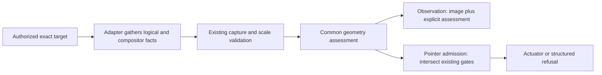

# RFC: Native capture geometry and compositor-limited window input

## Summary

Add a native logical-window/compositor geometry assessment, separate from the
existing PNG-to-compositor scale check. Preserve observational images and
independently usable semantic actions, but refuse window-pointer delivery when
an adapter that requires this assessment cannot establish compatible geometry.
Do not automatically activate windows or promise full-resolution background
capture that the tested operating-system APIs did not provide.

The common core owns comparison rules, assessment vocabulary, and admission
policy. macOS supplies exact-window AX and compositor facts. Windows, X11, and
Wayland publish explicit assessment coverage while retaining their existing
platform mapping and authorization requirements.

This is a proposed contract, not approval to implement it. The discussion issue
owns the decision. [Issue #3631](https://github.com/trycua/cua/issues/3631),
reported by [@f-trycua](https://github.com/f-trycua), remains the bug record and
is not resolved by merging this document.

## Motivation

With Stage Manager enabled, a native application's recent-app-strip image can
be a perspective-transformed thumbnail even though its exact AX window remains
usable. The driver currently validates capture dimensions against WindowServer
bounds. When both quantities describe the thumbnail, the scale check passes.
Callers need to distinguish that result from a frame whose geometry agrees with
the logical native window before choosing screenshot-based input.

The [sanitized investigation summary](3711/evidence-summary.md) records the
observed mechanism, experiments, provenance, and limits. In particular:

- Calculator retained a 230×408 AX frame while WindowServer, a fresh
  ScreenCaptureKit filter, and its capture reported 31×102.
- AX-sized screenshot requests retained exactly the same thumbnail pixels on a
  larger canvas. The tested macOS 26 API, shell fallback, retained filter, and
  live stream did not recover untransformed content.
- A genuine 90×102 control window matched all geometry sources while active but
  became 47×105 in the strip. Absolute size and a requirement that both
  dimensions shrink are insufficient classifiers.
- A controlled strip-targeted pixel click produced no application event despite
  the pointer route being advertised as available. This is not a finding of
  wrong-target delivery or proof that every such click is a no-op.

These observations justify explicit limitations and conservative admission.
They do not establish a universal Stage Manager detector, image freshness, or a
supported full-content recovery mechanism.

## Goals

1. Distinguish legacy image-scale consistency from native/compositor geometry
   consistency in machine-readable observations.
2. Preserve screenshots and independently valid semantic actions when native
   geometry is incompatible or cannot be established.
3. Apply the same geometry requirement to explicit pixel actions, implicit
   pointer fallbacks, and foreground window-pointer delivery.
4. Bound metadata gathering and define transitions, uncertainty, error
   precedence, and cleanup without automatic activation.
5. Specify platform coverage, client compatibility, and reproducible acceptance
   evidence without relying on private evidence directories.

## Non-goals

- Recovering full native pixels by enlarging thumbnails, private compositor
  APIs, automatic activation, moving windows, or changing Spaces.
- Detecting every transformed compositor surface or attributing every geometry
  mismatch specifically to Stage Manager.
- Changing typed page screenshots, DOM/CDP-only actions, or generic PID-keyboard
  routing. Native pointer delivery beneath any tool still follows this RFC.
- Redefining screenshot freshness, repaint completeness, legibility, or browser
  capture coverage.
- Replacing the existing exact-target, hidden/minimized, permission, or
  off-Space policies; see [#3458](https://github.com/trycua/cua/issues/3458).
- Making every bare `x,y` action snapshot-bound, or guaranteeing that coordinates
  supplied after an external stage switch came from the latest screenshot.
- Adding history, telemetry content, recordings, or a persistent capture stream.

## Terminology

| Term                       | Meaning                                                                                                                                                         |
| -------------------------- | --------------------------------------------------------------------------------------------------------------------------------------------------------------- |
| Logical frame              | The outer native window rectangle from an independently resolved native window provider; exact AXWindow position/size on macOS.                                 |
| Compositor frame           | The current representation rectangle used by the capture backend; WindowServer bounds on macOS.                                                                 |
| Capture scale check        | The existing comparison of raw capture pixels with compositor-frame dimensions, including supported backing scales.                                             |
| Native geometry assessment | A bounded comparison of independently gathered logical and compositor frames for the same exact target.                                                         |
| Consistent                 | No discrepancy beyond the defined tolerance was found in stable samples. It is not proof of fidelity, freshness, or action effect.                              |
| Pointer admission          | Permission to attempt a particular actuator after all existing gates and this additional geometry requirement pass. It is not a promise of delivery or success. |

All new frame coordinates are outer-window rectangles in the adapter's logical
desktop coordinate system, with top-left origin after normalization. They are
not screenshot pixels, client-content rectangles, or a replacement input
transform. Backing scale and optional image downscaling remain separate.

## Current state

The relevant code is:

- [macOS capture](../libs/cua-driver/rust/crates/platform-macos/src/capture.rs):
  desktop-independent ScreenCaptureKit filter, output sizing from filter content
  rectangle × backing scale, bounded plan cache, identity checks, and shell
  fallback.
- [macOS window state](../libs/cua-driver/rust/crates/platform-macos/src/tools/get_window_state.rs):
  combines AX and screenshot observations and emits `screenshot_frame_valid`.
- [macOS pixel frame](../libs/cua-driver/rust/crates/platform-macos/src/tools/px_frame.rs):
  verifies supported image/compositor scale and derives a scale/translation for
  window-local pixels.
- [Background input policy](../libs/cua-driver/rust/crates/cua-driver-core/src/background_input.rs):
  admits routes from exact-target and visibility facts. Capture availability and
  unknown freshness are reported separately.

The current capture validator does not compare the independent logical frame.
Changing its ratio tolerance cannot detect two mutually consistent thumbnail
measurements. Substituting AX bounds into `window_bounds` would instead
misdescribe the returned PNG and its existing transform.

## Proposal

### 1. Public observation contract

Every native `get_window_state` result that reaches observation processing adds
`capture_geometry`. Early authorization and exact-owner refusals retain their
existing shapes and do not gather or publish additional target facts.

The object has these fields:

| Field               | Contract                                                                                                                                              |
| ------------------- | ----------------------------------------------------------------------------------------------------------------------------------------------------- |
| `status`            | `consistent`, `mismatch`, `unknown`, or `not_assessed`.                                                                                               |
| `reason`            | Required unless status is `consistent`; values below.                                                                                                 |
| `logical_bounds`    | Optional `{x,y,width,height}`; present only when a stable, exact logical frame participated in the assessment.                                        |
| `compositor_bounds` | Optional rectangle in the same units; when describing the returned capture it must agree with existing `window_bounds`, not a newer unrelated sample. |

The closed status/reason combinations are:

| Status         | Reason                         | Meaning                                                                                                       |
| -------------- | ------------------------------ | ------------------------------------------------------------------------------------------------------------- |
| `consistent`   | Omitted                        | Both stable frames agree within tolerance and the existing capture scale check passed.                        |
| `mismatch`     | `logical_compositor_mismatch`  | Stable, independently gathered frames disagree beyond tolerance. No Stage Manager-specific cause is asserted. |
| `unknown`      | `logical_geometry_unavailable` | Exact logical position/size could not be established, including unsupported AX attributes.                    |
| `unknown`      | `geometry_unstable`            | Identity/frame samples changed or yielded contradictory classifications during the bounded observation.       |
| `unknown`      | `assessment_timeout`           | The metadata budget expired; do not reuse older logical geometry.                                             |
| `unknown`      | `capture_frame_unverified`     | No image frame passed the existing capture/scale validation. Existing screenshot errors remain authoritative. |
| `not_assessed` | `screenshot_not_requested`     | Effective capture selection did not request an image; no new capture is performed solely for the assessment.  |
| `not_assessed` | `adapter_not_supported`        | This adapter has not implemented the additional independent-frame assessment. Not a successful assessment.    |

`include_screenshot:false` with `screenshot_out_file` still requests capture
under the existing rules, so it does not produce `screenshot_not_requested`.
When both no-capture and unsupported-adapter conditions apply, report
`screenshot_not_requested`. Otherwise unsupported adapters report
`adapter_not_supported`, including when their existing capture fails; retain
that capture error separately. On required adapters, an existing capture/scale
failure takes precedence over logical-geometry reasons. These are output-only
facts; callers cannot submit an assessment to authorize an action.

Examples are complete new objects, not complete tool responses:

```json
{
  "capture_geometry": {
    "status": "mismatch",
    "reason": "logical_compositor_mismatch",
    "logical_bounds": { "x": 62, "y": 660, "width": 230, "height": 408 },
    "compositor_bounds": { "x": 16, "y": 536, "width": 31, "height": 102 }
  }
}
```

```json
{
  "capture_geometry": {
    "status": "not_assessed",
    "reason": "adapter_not_supported"
  }
}
```

Do not emit a `full_window`, `readable`, `fresh`, or `stage_manager_thumbnail`
claim from this comparison. A mismatched image is an observation of a compositor
representation, not an established coordinate map into the logical window.

### 2. Existing observation fields and degradation

- Keep `screenshot_frame_valid`'s existing PNG/compositor scale meaning. A
  thumbnail may have `screenshot_frame_valid:true` and
  `capture_geometry.status:"mismatch"`. Document this explicitly.
- Keep `window_bounds`, image dimensions, backing scale, MIME type, and file
  delivery consistent with the actual delivered image. Never relabel a thumbnail
  using full AX bounds.
- Keep `background_input.observation.frame_freshness` unchanged. Do not infer
  repaint or freshness from matching geometry or a stream status.
- Do not discard otherwise usable image bytes solely because logical geometry
  mismatches or is unknown. Existing capture/scale failures retain their current
  image/error behavior.
- A required assessment returning `mismatch` or `unknown` sets `degraded:true`.
  If an existing AX degradation already owns `degraded_reason`, preserve it;
  `capture_geometry.reason` independently carries the capture limitation. If
  there is no prior reason, use a concise native-geometry limitation message.
- `not_assessed` alone does not add degradation. In particular, opting out of a
  screenshot must not degrade an otherwise healthy semantic-only observation.
- Existing observation escalation must not recommend pixels when the geometry
  gate would refuse them. Preserve an applicable semantic alternative; otherwise
  describe explicit selection into an active stage followed by a new snapshot.
  Never advise retrying the same thumbnail coordinates with foreground delivery.

A screenshot/geometry limitation must not invalidate exact semantic element
tokens, change the actionable-element projection, or create false actionability
for display-only AX rows. Existing token lifetime and ancestry rules remain.

### 3. Shared types and ownership

Add a common-core geometry module with:

- normalized finite rectangles and an exact-target identity binding;
- `NativeGeometryRequirement::{IndependentFrameRequired, AdapterMappingOnly}`;
- a typed assessment matching the public status/reason vocabulary;
- pure comparison and assessment-selection functions;
- a pure pointer-admission combinator that only narrows an existing decision.

The requirement is trusted adapter configuration, not a client argument,
permission-profile option, or a global fallback on errors. A platform claiming
`IndependentFrameRequired` cannot downgrade itself when a read times out.

The macOS adapter supplies the exact resolved AX window and CG/SCK capture
facts. Reuse existing exact-window resolution and bounded AX infrastructure;
do not search by title, choose a process's largest window, or duplicate a full
AX tree walk to obtain two geometry attributes.

Do not add a new last-screenshot global cache or session mode. The assessment is
request-local, bound to the same exact target as its image. Reuse it within the
operation; future actions gather their own facts. Existing capture-plan caching
and resize bookkeeping retain their ownership and lifecycle.



### 4. macOS sampling and comparison algorithm

Proposed constants, subject to acceptance in the RFC decision:

- **2 logical points** absolute tolerance per `x`, `y`, `width`, and `height`.
  Do not grow the tolerance proportionally with window size or accept arbitrary
  scale ratios. Normalize the two sources before comparison.
- **250 ms** total additional logical-geometry metadata budget per operation,
  counting geometry IO and its settling delay, not intervening existing capture
  work. It is bounded further by the operation's remaining deadline. Existing
  capture and AX-walk deadlines are not extended.
- At most **one metadata-only resample**, after up to **50 ms** settling delay
  within that budget. Do not add another screenshot loop on top of existing
  capture-backend retries.

The algorithm is:

1. Resolve the exact PID/window and a fresh native AXWindow. Retain its identity
   for this attempt; verify ownership and exact window mapping using existing
   platform rules. Missing/stale/foreign targets keep their earlier refusals.
2. Read logical position and outer size, and the compositor rectangle, before
   capture. Reject non-finite values, nonpositive extents, wrong coordinate
   conventions, or an unproven exact AX mapping as unavailable evidence.
3. Perform the existing capture, including its current owner/frame checks,
   supported backing-scale validation, and fallback behavior. Do not weaken
   those checks or retain an old filter merely because its rectangle looks full
   sized.
4. Read the exact logical/compositor frames again. Bind the assessment to the
   image's validated compositor frame. A newer rectangle cannot validate an
   older image by replacement.
5. If both endpoint pairs are stable within tolerance and both comparisons
   agree, return `consistent` or `mismatch`. Compare all four components;
   neither tiny size nor uniform downscaling is assumed.
6. If sampling suggests a transition or contradictory classifications, take
   the single metadata resample if budget remains. It may establish consistency
   only if the capture's compositor binding is still valid. A changed image
   frame yields `unknown`, even if later frames agree with each other.
7. On unresolved changes, missing geometry, or timeout, return the corresponding
   `unknown` reason. Do not guess using global Stage Manager state, old AX
   values, SCK buffer dimensions, or stream content rectangles.

The budget must bound actual AX requests through the adapter's bounded worker
and messaging-timeout facilities. Timing out an await and launching unlimited
replacement threads is not an acceptable implementation. Reuse a bounded
worker/gate; an exhausted worker returns unknown rather than leaking work.

The shared comparison rule defines a detectable discrepancy, not a universal
proof that there is no compositor transform. Native acceptance must cover the
proposed tolerance and any deliberate limitations. A different constant is a
reviewed contract change, not an undocumented per-app exception.

### 5. Pointer admission and refusals

Every action still passes existing authorization, exact-target, element-ancestry,
visibility, platform-route, and capture/scale gates. This assessment cannot turn
any prior refusal into permission to act.

| Adapter requirement        | Current assessment                        | Additional result                                                                                           |
| -------------------------- | ----------------------------------------- | ----------------------------------------------------------------------------------------------------------- |
| `IndependentFrameRequired` | `consistent`                              | No additional refusal; remaining existing gates still apply.                                                |
| `IndependentFrameRequired` | `mismatch`                                | Refuse with `px_native_frame_mismatch`.                                                                     |
| `IndependentFrameRequired` | `unknown`                                 | Refuse with `px_native_frame_unverified`.                                                                   |
| `IndependentFrameRequired` | `not_assessed`                            | Action must gather its required evidence; if it cannot, refuse as unverified.                               |
| `AdapterMappingOnly`       | `not_assessed` with either defined reason | Keep the adapter's existing action-time mapping admission; do not claim an independent geometry assessment. |

A required adapter reporting `adapter_not_supported` is an implementation error
and fails closed. Unsupported coverage is allowed only by the trusted coverage
table below; it is not a runtime escape hatch.

Add the two new refusal variants alongside existing pixel-frame errors, not to
the successful, closed `ActionResult` object. Follow the existing error-shaped
`ToolResult`/SDK error envelope, with a stable code and actionable suggestion.
For example, the structured error portion is:

```json
{
  "code": "px_native_frame_mismatch",
  "window_id": 63,
  "suggestion": "Use an available semantic element action, or select this window into the active stage and take a fresh snapshot before pixel input."
}
```

No pointer/keyboard input is delivered for a pre-dispatch geometry refusal;
do not attach delivery or effect-confirming evidence. Initial-preflight refusals
also must not activate the target. A refusal after authorized foreground
preparation must not claim zero UI side effects: report the focus-restoration
outcome through the existing error/cleanup reporting facilities. Preserve
earlier error precedence: authorization and exact-target
errors first, existing route/visibility and capture-frame failures next, then
the additional geometry refusal. An AX-only action does not acquire a pointer
refusal merely because its accompanying image is limited.

For `background_input.routes` on required adapters:

- Existing refusals keep their original reason.
- A completed assessment narrows `window_pointer` with the same two refusal
  codes; `consistent` can leave an otherwise available route available.
- If screenshot capture was deliberately omitted, publish pointer
  `status:"unknown"`, `reason:"capture_geometry_not_assessed"` when earlier
  prerequisites passed. Do not capture pixels to avoid this unknown.
- Semantic and PID-keyboard entries retain their independent existing policy.

This adds `unknown` to the pointer capability-entry status vocabulary. It is an
advisory observation, not a new successful action result. Actual pixel actions
perform their own capture/preflight even after a semantic-only snapshot.

### 6. Dispatch coverage, foreground behavior, and cleanup

Apply the requirement based on the actuator, not merely the tool's public name:

- Window-local pointer clicks, double/right clicks, scroll, drag, held-button
  operations, and parallel pointer operations use it.
- Pixel-focus variants of text/key tools must pass it before clicking or typing.
- AX-to-pointer fallbacks must pass it before dispatch. AXPress/value operations
  that genuinely stay semantic remain available under their existing rules.
- A typed browser tool that ultimately uses a native window-pointer actuator is
  covered; DOM/CDP-only actions and page screenshots are not reclassified as
  native window captures.
- An overlay-only cursor animation is not a native pointer actuator and does
  not authorize delivery. It may decorate observational content without
  bypassing this gate.

Preflight occurs before activation, native cursor movement, mouse-down, or
keyboard delivery associated with a pointer-focus action. For an explicitly
requested foreground window action, assess the initial frame first. A mismatch
or unknown must refuse **without activating the target**. Foreground delivery
is not an inverse-thumbnail transform.

If initial geometry passes and foreground activation is otherwise authorized,
revalidate the exact target and relevant frame before input. A geometry change
caused by activation refuses further input; restore focus using existing
best-effort cleanup. Do not recompute a different interpretation of the caller's
coordinates and dispatch anyway.

For compound operations, validate every exact target before its first input
boundary and revalidate before later independently addressed segments. Do not
capture on every interpolated mouse-move sample. If a change/refusal occurs
after partial delivery, release driver-owned held buttons/modifiers through the
existing cleanup path and report the existing partial/error semantics with
accurate delivery accounting. Never label a partially executed operation as a
no-side-effect refusal or leave a button held because a new gate failed.

The platform cannot atomically lock a window against every concurrent compositor
change. Existing postcondition verification remains necessary. Bare pixel inputs
remain unbound to a caller's historical image: after a separately performed
stage switch, the harness must re-snapshot. This RFC does not claim to enforce
that provenance for all legacy `x,y` callers.

### 7. Platform coverage

| Platform/path                | Requirement in this change             | Evidence and limitations                                                                                                                                                                |
| ---------------------------- | -------------------------------------- | --------------------------------------------------------------------------------------------------------------------------------------------------------------------------------------- |
| macOS native windows         | `IndependentFrameRequired`             | Exact AX outer frame versus validated CG compositor frame. Missing AX geometry is unknown, not proof of normality.                                                                      |
| Windows native windows       | `AdapterMappingOnly`                   | Publish `not_assessed: adapter_not_supported` for the new cross-check; preserve existing capture/native mapping and visibility gates. No Stage Manager inference from UIA or DWM alone. |
| Linux X11 native windows     | `AdapterMappingOnly`                   | Same explicit unsupported cross-check; preserve existing X11 capture/scale and background-input rules.                                                                                  |
| Linux Wayland native windows | `AdapterMappingOnly`                   | Same explicit unsupported cross-check; preserve compositor-specific discovery/input limitations and foreground authorization requirements.                                              |
| Typed browser page images    | Outside this native observation object | Preserve existing page-native contracts; native actuator fallbacks remain covered as above.                                                                                             |

The macOS-specific requirement is explicit because this investigation only
established an independent-frame source and limitation there. Shared pure types
and policies must run in cross-platform tests. An additional adapter cannot
claim `consistent` without independently gathered, normalized, tested facts.
Parity does not mean fabricating a classification on unsupported platforms.

### 8. Lifecycle, performance, and failure isolation

- Assessment data lives only for its observation/action and exact target. Do not
  key logical frames solely by PID or let one transport's observation authorize
  another transport's input.
- Existing capture-plan TTL/size bounds and target identity validation remain.
  Owner changes, stale native handles, window closure, and detected ID reuse
  invalidate the attempt; do not publish logical bounds from a previous target.
- Keep geometry IO off the main GUI thread where the platform permits. Share
  exact-window discovery with the current snapshot to avoid a second AX walk.
- Honor cancellation and the original request deadline. Late worker results
  cannot mutate resize bookkeeping or publish an assessment for a cancelled
  request.
- Neither cached filter dimensions, live stream metadata, nor a prior
  `consistent` observation may be used to skip action-time revalidation.
- If logical geometry fails but the image is usable, observation survives with
  `unknown`. If capture fails, semantic observation survives under existing
  behavior and reports `capture_frame_unverified` where applicable.

## Alternatives considered

| Alternative                                                                             | Why not selected                                                                                                                                                                |
| --------------------------------------------------------------------------------------- | ------------------------------------------------------------------------------------------------------------------------------------------------------------------------------- |
| Increase capture dimensions, choose best resolution, or use the macOS 26 screenshot API | Tested variants padded or enlarged the same thumbnail pixels. No evidence of recovered content.                                                                                 |
| Keep a filter or stream created while active                                            | Tested cached-filter and live-stream output still transformed after the stage switch; cached metadata could remain full sized.                                                  |
| Always use shell fallback                                                               | Its decoded thumbnail pixels matched the native path in the tested case.                                                                                                        |
| Detect tiny windows or require both dimensions to shrink                                | Misclassifies genuine small windows and misses the observed small-window height increase.                                                                                       |
| Use global Stage Manager enabled as the detector                                        | Active-stage windows work while it is enabled; the global setting does not identify an exact window's representation.                                                           |
| Replace CG bounds with AX bounds                                                        | Relabels the image and can create a misleading coordinate transform. Preserve both sources instead.                                                                             |
| Set the old validity boolean false for every native mismatch                            | Conflates the existing scale check with the new independent assessment and changes established field meaning. Use an explicit new object and enforce admission at the actuator. |
| Require snapshot tokens on every pixel call now                                         | Stronger provenance could address stale caller coordinates, but changes every client/action surface and is a separate decision. This RFC documents that residual limitation.    |
| Continue admitting when required logical geometry is unknown                            | Preserves more window-only fallbacks but cannot establish the new prerequisite. This proposal chooses explicit refusal and an authorized desktop/semantic alternative.          |

## Compatibility and migration

This is additive for observation JSON but **not behavior-neutral**:

1. Preserve all existing screenshot fields, successful action envelopes, token
   semantics, and independent semantic/keyboard policies.
2. Add typed/common assessment definitions and SDK/CLI/MCP serialization tests.
   SDKs that keep structured observations opaque must preserve the new object.
   Where generated contracts enumerate capability statuses, add `unknown` and
   verify every shipped binding rather than relying on permissive parsing.
3. New clients use `capture_geometry` and current route prerequisites; they must
   not treat either validity field or `available` as effect confirmation.
4. Older clients may ignore the new object but cannot bypass action-side
   geometry refusals. Upgrade guidance explains the new codes and requires a
   fresh snapshot after explicit activation/stage selection.
5. Required macOS pointer paths with unavailable AX position/size now refuse,
   including foreground window-only paths that previously worked without that
   evidence. Empty child trees are not automatically refused if the exact
   AXWindow geometry is still available. This distinction needs native tests.
6. An explicitly authorized desktop target remains the alternate coordinate
   domain when native-window geometry cannot be established. It requires its
   own fresh desktop screenshot and permissions; no implicit escalation occurs.

The RFC PR is documentation-only and non-releasing. The combined runtime change
is a user-visible correction and must not use `docs`, `test`, or `no-release` to
hide its impact. Use `fix(cua-driver): ...` if compatibility review determines
these are newly enforced existing prerequisites; use
`fix(cua-driver)!: ...` if the agreed contract change is breaking. Record that
choice and client migration in the RFC decision before implementation is
approved, including the repository's review period for breaking contracts.

Do not introduce a public "ignore native geometry" switch. A metadata rollout
without actuator enforcement does not resolve #3631. If implementation regresses
a supported workflow, prefer a targeted correction or an explicit unsupported
limitation. Any emergency binary rollback must identify that the old limitation
is again unmitigated; do not relabel it as a successful assessment.

## Security, privacy, permissions, and telemetry

This proposal creates no permission, resource grant, session authority, or
consent automation. All observation remains behind the existing capture and
accessibility policies. A false preflight must not be worked around by changing
TCC, switching profiles, or accepting dialogs automatically.

The investigation's extra OS consent dialog was not approved, even though APIs
returned images. Required acceptance must use an independently verified,
logged-in, correctly authorized desktop without an unresolved prompt. That
permission-readiness issue is not silently solved by this RFC.

New structured metadata contains only target-scoped geometry and closed reason
codes, with no titles, control values, pixels, native pointers, or credentials.
Do not add raw geometry to product telemetry. If existing content-free telemetry
is extended, allow only bounded enum outcomes and platform/adapter identity,
subject to its normal opt-out and review. No new persistence is required.

## Implementation plan

Implementation begins only after the RFC decision. Use one linked implementation
workstream unless maintainers explicitly select independent follow-up work.
Within it, keep these increments independently reviewable:

1. **Common contract and tests:** typed assessments, normalized comparison,
   requirement policy, admission combinator, and serialization fixtures. No
   production claim of assessment support until an adapter supplies evidence.
2. **macOS observation:** exact AX/CG sampling, deadline enforcement, normalized
   fields, independent degradation, and capture-error coexistence. Preserve
   image bytes, capture-plan checks, and semantic tokens.
3. **Actuator integration:** audit every direct/implicit native pointer entry,
   foreground ordering, pointer-focus keyboard variants, compound-operation
   cleanup, and capability-report consistency. This gate must land with any
   production announcement that the issue is resolved.
4. **Compatibility and platform accounting:** generated bindings where needed,
   CLI/MCP examples, skills and fallback guidance, explicit Windows/X11/Wayland
   unsupported assessments, and ordinary platform regression evidence.
5. **Certification:** stable candidate SHA, canonical desktop harnesses and
   focused Stage Manager supplement, then readiness/release metadata checks.

The linked implementation PR must keep its scope, progress, tests, gaps, and
blockers current. Do not close #3631 from this documentation PR.

## Test and acceptance plan

### Pure and contract coverage

- Equal logical/compositor frames at 1× and 2× backing scale; image downscale
  remains distinct from native logical geometry.
- Recorded 230×408 versus 31×102 and 90×102 versus 47×105 disagreements.
- A real 90×102 frame that is consistent; no absolute-size heuristic.
- Every rectangle component immediately below, at, and above the proposed
  2-point tolerance; NaN/infinity, invalid extents, and coordinate normalization.
- Stable endpoint agreement, contradictory classifications, stale capture
  binding, one resample, exhausted budget, and cancellation with late results.
- Missing AX geometry, exact-owner failure, stale handles, detected ID reuse,
  sibling windows, and no cross-target/transport reuse.
- Preservation of legacy scale-error precedence and coexistence with AX
  degradation; usable images and semantic tokens survive native mismatch.
- All status/reason combinations, omitted optional fields, screenshot opt-out,
  file-only capture, unsupported adapters, and the new pointer `unknown` status.
- Existing refusals never become admissions; no successful action schema gains
  geometry fields; new refusals have no delivery/evidence claims.

### Native macOS acceptance

Use an isolated, logged-in, TCC-authorized target on an exact candidate SHA.
Record OS/build, binary/source provenance, display scale, initial settings, and
cleanup. An unresolved permission prompt is a blocked acceptance run, not a
passing screenshot test.

1. Stage Manager off: Calculator and a purpose-built small/normal native fixture
   produce consistent geometry and ordinary pointer/semantic behavior.
2. Stage Manager on, active stage: the same IDs remain consistent after settling;
   the genuinely small fixture is not degraded solely for its size.
3. Move the targets to the recent-app strip using an explicit desktop action.
   Repeated snapshots return useful images plus `mismatch`; legacy scale
   validity may remain true; pointer capability is refused.
4. Background AX Calculator computation still reaches 42, independently checked
   through fresh AX/visual readback. Do not confuse actuator `unverifiable` with
   a failed computation or claim that every AX action is effect-confirmed.
5. Every explicit and implicit native pointer route refuses before native input,
   activation, or cursor takeover when initially mismatched/unknown. Verify with
   app event logs and frontmost/focus/cursor oracles, not tool success alone.
6. Explicit foreground retry of the same thumbnail coordinates also refuses
   without activation. After separate, authorized stage selection and a fresh
   snapshot, ordinary window-pointer behavior recovers for the same ID.
7. Test a transition during sampling/foreground preparation and a change during
   a compound operation. Verify bounded return, no stale reframe dispatch, and
   release of already-owned buttons/modifiers after partial delivery.
8. Test exact AXWindow geometry available with an empty child tree separately
   from geometry attributes unavailable. Verify the documented migration and
   independent semantic/desktop alternatives.
9. Exercise cold/warm capture plans, shell fallback, resize/move, and file-only
   capture; record concrete Retina/multi-display coverage or the unavailable
   environment as a gap before declaring that behavior supported.
10. Restore initial Stage Manager state and focus where possible; report any
    cleanup limitation rather than silently leaving a changed desktop.

### Cross-platform and release gates

Run shared contract tests on macOS, Windows, X11, and Wayland adapters. For the
initial unsupported cross-check on the latter three, assert explicit metadata
and unchanged existing mapping/refusal behavior; do not claim native Stage
Manager-equivalent detection. Include normal Windows/X11 pointer regressions,
Wayland compositor capability/refusal checks, and typed-page versus native
browser-fallback regressions.

Use focused tests and normal PR CI during implementation. On the stable exact
candidate, follow the [canonical harness guide](../libs/cua-driver/docs/test-harnesses-guide.md)
and [CI guide](../scripts/ci/README.md), including the authorized macOS wrapper
and installed-browser lane when native browser fallback is affected. The
Stage Manager supplement augments, not replaces, the canonical desktop gate.
Follow [repository E2E timing](../AGENTS.md#expensive-end-to-end-test-timing)
for final-diff accounting and post-merge smoke/release-path verification.

For this RFC-only change, validate document formatting, relative links, JSON
examples, status/reason/admission consistency, and source references. No desktop
E2E or runtime certification is claimed by the documentation PR.

## Unresolved questions

These are review decisions, not unstated implementation choices:

1. Accept or revise the proposed 2-point tolerance, 250 ms metadata budget, and
   single 50 ms resample policy, using the specified native evidence.
2. Approve the stricter unknown-geometry policy for macOS foreground/window-only
   input, or explicitly select a narrower alternative and document what it does
   not establish. There must be no silent fail-open fallback.
3. Confirm supported-client handling of the new pointer capability `unknown`
   status and record whether the runtime release is breaking.
4. Confirm the generic mismatch vocabulary without a Stage Manager-specific
   representation claim. A future reliable platform classifier can be proposed
   separately; it is not presumed here.

## Decision record

Pending in [#3711](https://github.com/trycua/cua/issues/3711). No design acceptance,
implementation authorization, platform certification, or release decision has
been recorded. Preserve material feedback, accepted and rejected alternatives,
remaining risks, and the final compatibility disposition here when review ends.
