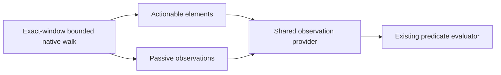

# RFC: Passive native observations without action handles

## Summary

Add passive `observations` alongside the unchanged actionable `elements` in
`get_window_state`. Shared `verify_state` consumes both from the same native
walk. Observation must not require an action handle. This proposal preserves
the typed action contract; it is not accepted or implemented yet.

## Motivation

[#2958](https://github.com/trycua/cua/issues/2958) reports Calculator display
text present in `tree_markdown` but invisible to structured verification.
Retrying a delivered click does not fix missing observation data and can
change the application again. Callers need typed readback, not markdown parsing.

## Goals

- Publish readable passive state without inventing action authority.
- Verify uniquely selected raw values through the shared predicate engine.
- Preserve action handles, counts, cache isolation, scope, and trust provenance.
- Define bounded and query-consistent behavior across native adapters.

## Non-goals

No new tools, observation cache, action retries, ordinal selectors, implicit
bidi/number/whitespace normalization, or first-match semantics. This does not
promise that a role-only selector distinguishes Calculator expression/result
rows. It does not absorb #3817 or #3814.

## Terminology

- **Actionable element:** an indexed row in the existing action projection.
- **Passive observation:** readable native state without an action index/token.
- **Complete domain:** a projection whose applicable native walk was proven
  exhaustive, not merely a nonempty array or a successful tool response.

## Current state

At main `625118a9076e51da2f57b6a5d475972030197443`:

- [macOS projection](../libs/cua-driver/rust/crates/platform-macos/src/tools/get_window_state.rs)
  requires `node.element_index` before projecting a row. Its existing test
  explicitly expects passive rows to be omitted.
- [Shared observation](../libs/cua-driver/rust/crates/cua-driver-core/src/expectation.rs)
  consumes only `structuredContent.elements`. Observation-only mode avoids
  action-cache mutation; it does not widen the projection.
- [The typed contract](../libs/cua-driver/rust/crates/cua-driver-contract/src/windows.rs)
  requires `WindowElement.element_index: u64`. Missing and null indices both
  fail deserialization.
- Linux and Windows builders also filter non-indexed rows. Native providers
  differ in which nodes they index; source symmetry is not native parity proof.

Eight public-evaluator cases, two public-type rejection assertions, and 16
existing shared expectation tests passed during investigation. This is
characterization, not a fix certification or fresh current-main native run.

## Proposal

### Typed contract

Keep `WindowElement` unchanged. Add the following conceptual record and optional
fields to the generated shared contract:

```rust
struct WindowObservation {
    role: String,
    depth: u32,
    label: Option<String>,
    value: Option<String>,
    frame: Option<ElementFrame>,
    parent_index: Option<u64>,
    in_web_content: Option<bool>,
}

struct WindowStateOutput {
    elements: Option<Vec<WindowElement>>,
    observations: Option<Vec<WindowObservation>>,
    observations_complete: Option<bool>,
}
```

The output excerpt omits unchanged fields. The new array contains passive rows
only; it does not duplicate indexed rows. `parent_index`, when present, refers
to the nearest published actionable ancestor, not a new passive-node identity.
Unknown properties remain absent. Values retain their raw native text.

### Data flow and ownership



```diff
 get_window_state(exact_window)
   ↳ bounded native walk
     ↳ indexed rows → elements
-    ↳ passive rows → markdown only
+    ↳ passive rows → observations + markdown
 verify_state(exact_window, expect)
   ↳ observation-only window state
-    ↳ elements → ObservationSnapshot
+    ↳ elements + observations → ObservationSnapshot
     ↳ evaluate_predicates(expect, snapshot)
```

Both arrays come from one walk, respecting its window, query, and traversal
bounds. Reuse native field projection instead of copying a second serializer.
Query filtering excludes unrelated passive rows without fabricating action
indices to satisfy the current index-only query projector. Carry native row
membership through filtering rather than recovering passive identity by parsing
presentation markdown. Existing actionable query behavior remains unchanged.

The shared provider creates a private evaluation projection; it does not change
the public actionable array, perform an extra OS walk, or refresh action caches.
Web-region provenance survives collapsed containers. Existing trust and
ambiguity checks apply to passive rows too.

### Completeness and platform behavior

`elements_complete` keeps its addressable-domain meaning.
`observations_complete` describes the passive domain; absence means unknown.
Combined verification may claim completeness only when both domains are proven
complete and unfiltered. A legacy response lacking passive observations cannot
prove that passive state is absent. Positive matching remains possible without
complete coverage.

Adapters may publish `observations_complete: false` until their native walk can
prove exhaustion. Do not duplicate #3817's addressable-completeness work or
claim that it alone proves passive coverage. Query/cap/depth limits, unreadable
children, and unresolved scope cannot silently become complete observations.

macOS AX, Windows UIA, and Linux AT-SPI implement the same public semantics.
X11 and Wayland use available AT-SPI state; inaccessible providers/compositors
retain explicit degraded or incomplete results rather than synthetic values.
No foreground activation or desktop-wide fallback is added.

## Alternatives considered

1. **One unified array with optional index.** Structurally simpler: one record
   and no provider union. However, it changes a required SDK field and the
   addressable-only/count/query contract. It requires explicit migration and
   consumer audits. This remains the strongest alternative for review.
2. **Assign indices to passive rows.** Conflates observation with actionability
   and alters cache/dispatch behavior; rejected.
3. **Parse markdown in verification.** Makes presentation authoritative and
   bypasses typed provenance; rejected.
4. **Change completeness only.** Does not publish the missing values.
5. **Normalize all values or choose the first match.** Weakens exact comparison
   or ambiguity handling and may claim misleading success; excluded.

## Compatibility and migration

The proposed fields and record are additive. Existing elements, tokens, and
counts are unchanged. Regenerate MCP schemas, SDK bindings, and documentation
together; clients must tolerate missing observations from older producers.

The shared verifier can newly answer passive predicates when evidence exists.
Raw `"\u200e7"` remains unequal to `"7"`; two property targets remain
`unknown / multi_match`. A distinct existing label selector can narrow a match,
but does not provide a stable semantic identity for every Calculator state.

A feature release is appropriate for this typed public capability. There is no
disk migration, new dependency, or retained observation lifecycle. Rollback can
stop adapter publication and provider consumption while retaining optional
contract fields; missing fields must never mean empty, complete state.

## Security, privacy, and telemetry

Use existing read-only admission, exact-window authorization, native
accessibility permissions, and data-redaction/retention rules. Passive data
never grants action authority. Preserve web-content trust markers. No new
telemetry, persistence, or raw-value logging is introduced. Validation uses
controlled fixtures rather than user content.

## Implementation plan

After the recorded maintainer decision:

1. Capture public native fixture reds for missing passive state. Add the shared
   typed record/provider path and thin native projections, preserving handles.
2. Verify query/bounds/provenance and conservative completeness across adapters.
   Extend existing fixture suites; do not create a parallel test framework.
3. Regenerate contracts, bindings, and docs; collect focused native evidence.
4. Certify the stable candidate through the complete canonical desktop matrix.

Change existing `windows.rs`, `expectation.rs`, native snapshot builders, and
necessary native retention/query plumbing. No new production file or dependency
is planned. Preliminary estimate: 150–300 handwritten non-test changed lines;
query/retention review must refine it. Generated changes are additional and
must be reported separately. The unified alternative may need 100–250 lines
plus typed-consumer migration; these estimates are not measured diffs.

The compatible design increases structured output and introduces a second
observation domain. The unified alternative removes that split but requires a
breaking typed-contract migration. Neither should add a second native walk.

## Test and acceptance plan

- Public snapshot exposes a fixture's readable passive value without a token;
  unique exact-value verification satisfies and a wrong value is unsatisfied.
- Verification preserves an existing session action token. Passive rows do not
  gain action handles or enter the actionable cache.
- Duplicate matches remain unknown; untrusted regions remain unknown; raw bidi
  text is preserved and compared exactly.
- Query, traversal caps/depth, unreadable children, unresolved scope, and legacy
  output cannot widen scope or falsely prove completeness.
- Equivalent native fixture coverage passes on macOS, Windows, and Linux X11;
  document concrete Wayland/provider limitations where applicable.
- Supporting Calculator evidence uses an actually unique selector and raw
  result value, not an implicit text normalization or role-only assumption.
- Generated contracts/bindings/docs and ordinary CI pass. Run the full canonical
  desktop matrix once on the stable implementation candidate, not this RFC.

## Unresolved questions

- Confirm additive passive observations versus the breaking unified array.
- Confirm separate passive completeness and conservative legacy fallback.
- Refine native retention/query scope before committing to the size estimate.

## Decision record

Pending. Implementation selection is recorded on #2958; it does not substitute
for acceptance of this public-contract RFC. No product implementation has begun.
