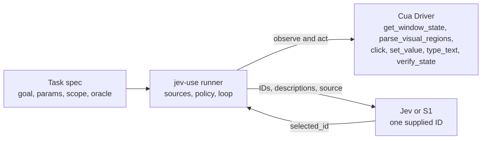

# RFC: Native accessibility candidates for jev-use decision loops

## Summary

jev-use will be able to drive native desktop applications on macOS, Windows,
and Linux, not only browser pages. The runner will build candidates from the
native accessibility elements that `get_window_state` already returns. Each
executable candidate is bound to an `element_token` from one exact snapshot.
OmniParser regions from `parse_visual_regions` remain a fallback for views
that have no usable accessibility tree. The bounded-choice contract does not
change in spirit. The application builds every complete action. TypeSafe Jev
or Cua-S1 returns one supplied ID. Cua Driver performs the action, and an
independent task oracle verifies the result.

To make this possible, the example's hard-coded "type a token, then submit"
loop becomes three candidate sources behind one interface and a declarative
task spec. The chooser request gains a backward-compatible version that tags
each candidate with its `source`. Cua Driver gains no model logic, task
semantics, or credentials. Code inspection shows that Driver does not
normalize accessibility roles across platforms. The native source therefore
owns an explicit, tested mapping from platform roles to a closed set of role
classes (see [Role normalization](#role-normalization-resolved-question-1)).

## Motivation

jev-use reached GA for browser pages in
[#4190](https://github.com/trycua/cua/pull/4190), with 40 of 40 live runs on
Linux and Windows across the page-structure and visual paths. Its decision
space comes from the browser page's accessibility tree (`get_browser_state`)
and from OmniParser regions (`parse_visual_regions`). The runner calls
`get_window_state` only to obtain a screenshot and `capture_id`, with
`include_accessibility_tree: false`. It never uses the native elements that
the same tool can return as candidates.

The loop is also bound to one task. `build_candidates`, `form_state`,
`_form_refs`, and `classify` assume a browser form with a textbox named
"verification value" and a button named "Submit". As a result, jev-use cannot
drive Calculator, Notepad, a settings pane, or any other native application,
even though Driver already exposes snapshot-bound, background-capable element
actions for them on every supported platform.

The decision now matters because the browser path is stable and has evidence.
The next extension of the chooser contract will be copied by downstream
integrations. It should be designed once, across all three platforms, before
someone special-cases a single native application.

## Goals

- Put candidate sources behind one interface: browser semantic (existing),
  native accessibility (new), and visual regions (existing).
- Replace the hard-coded fixture with a task spec that declares the goal,
  parameters (secrets redacted), allowed application and window, allowed action
  kinds, risky-action allowances, step budget, and a success oracle.
- Make native candidates bounded, deterministic, and stable across snapshots.
- Keep the same safety properties on every platform: snapshot-bound element
  actions, background-first delivery, and independent verification.
- Provide deterministic CI proof on macOS, Windows, and Linux, plus live Jev
  and S1 evidence for each platform.

## Non-goals

- No model logic, credentials, prompts, or task semantics inside Cua Driver.
- No free-form actions, coordinates, tool names, or generated text from the
  model.
- No change to the browser path's behavior or GA status.
- Not a general autonomous agent. Tasks remain application-defined.
- No new Driver tool and no change to the `get_window_state` output contract
  in this RFC. A Driver-side normalized role field is discussed as a possible
  follow-up only.

## Terminology

**Candidate source**
: A runner component that turns one observation into zero or more complete,
executable candidates. Each source tags its candidates with a `source` value.

**Task spec**
: An application-owned, declarative description of one task: its goal,
parameters, scope, allowed actions, budget, and success oracle. It replaces the
constants in `core.py`.

**Role class**
: One member of the closed, platform-neutral set of actionable roles that
jev-use recognizes, such as `button` or `text_entry`. The native source maps
each platform's raw `role` string to a role class or excludes the element.

**Stable candidate ID**
: A candidate ID derived from an element's role class, label, and actionable
ancestor path rather than from `element_index`. The same control keeps the same
ID across snapshots while the UI stays structurally the same.

**Observation**
: One `get_window_state` result. When it includes both the tree and the
screenshot, its `snapshot_id` (element tokens) and `capture_id` (visual regions
and capture-bound clicks) describe the same moment.

## Current state

### jev-use structure

The runnable reference lives in
[`libs/cua-driver/examples/jev-use/`](../libs/cua-driver/examples/jev-use/).
[`python/core.py`](../libs/cua-driver/examples/jev-use/python/core.py) and its
TypeScript mirror
[`typescript/core.ts`](../libs/cua-driver/examples/jev-use/typescript/core.ts)
define:

- `Candidate`: `id`, `description`, `tool` (`None` for reserved candidates),
  frozen `arguments`, and optional `capture_id` and `screenshot_reference` for
  capture-bound visual clicks.
- `VisualRegion` and `VisualObservation`: a validated projection of
  `cua.visual_regions_v1`. The observation carries the capture ID, target `pid`
  and `window_id`, screenshot size, and a scaled top-left action mapping.
- `_form_refs` (`formRefs`): finds the textbox named `verification value` and
  the button named `Submit` in the `get_browser_state` `refs`.
- `form_state` (`formState`): summarizes the form for the model without
  revealing the token (`empty`, `contains_required_token`,
  `contains_other_value`), plus the Submit availability states
  (`available`, `visual_only`, `visual_check_pending`, `not_found_visually`,
  `not_in_page_structure`).
- `build_candidates` (`buildCandidates`): emits at most one of
  `type-verification-value` (`browser_type`), `submit-form` (`browser_click`
  with `input_route: dom_event`, or a capture-bound `click`), or
  `submit-form-foreground`, followed by the reserved `reobserve` and `abstain`.
- `classify`: maps the fixture server's `submitted` value to `verified`,
  `refuted`, `budget_exhausted`, or `unknown`.

[`python/run.py`](../libs/cua-driver/examples/jev-use/python/run.py) and
[`typescript/run.ts`](../libs/cua-driver/examples/jev-use/typescript/run.ts)
call these Driver tools over MCP:

| Tool                   | Use today                                                                      |
| ---------------------- | ------------------------------------------------------------------------------ |
| `browser_prepare`      | Launch an isolated browser profile (`allow_launch`, `isolated_new`).           |
| `list_windows`         | Find the largest on-screen window for the browser `pid`.                       |
| `get_browser_state`    | Bind `target_id` and tab, then take a `semantic_v2` snapshot every step.       |
| `browser_navigate`     | Load the loopback fixture.                                                     |
| `get_window_state`     | Screenshot and `capture_id` only (`include_accessibility_tree: false`).        |
| `parse_visual_regions` | OmniParser `text` and `icon` regions at `min_confidence` 0.8, 100 regions max. |
| `browser_type`         | Type the token into the field ref, replacing its contents.                     |
| `browser_click`        | Click the Submit ref through `dom_event`.                                      |
| `click`                | Capture-bound visual click (`capture_id`, `x`, `y`, `delivery_mode`).          |

A background refusal (`background_*` code or `escalation.recommended ==
"foreground"`) is never retried. The next step takes a fresh capture and offers
a distinct `submit-form-foreground` candidate that the chooser must select
explicitly.

### Chooser contract

[`python/choose_action.py`](../libs/cua-driver/examples/jev-use/python/choose_action.py)
validates `cua.jev_choice_request_v1` strictly. The root must have exactly
`schema`, `goal`, `capture_id`, `regions`, `history`, and `candidates`. Each
candidate must have exactly `id` and `description`. IDs match
`[A-Za-z0-9][A-Za-z0-9._:-]{0,63}`, the set holds 2 to 32 candidates, and
`reobserve` and `abstain` are required. It answers with `cua.jev_choice_v1`.
[`python/decision_models.py`](../libs/cua-driver/examples/jev-use/python/decision_models.py)
answers the same request with `cua.decision_choice_v1` (`kind`, `capture_id`,
`selected_id`, `model`, `confidence`, `probabilities`, `reason`). The S1
adapter supports at most 26 options, including the two reserved IDs, and
returns `reason: "option_limit"` instead of truncating
([`decision-models.md`](../libs/cua-driver/examples/jev-use/decision-models.md)).

Because v1 validators reject unknown keys, adding `source` to a v1 candidate
would break every existing v1 validator. The contract change must therefore be
a new request version, not an in-place field addition.

### Driver native element output

`get_window_state` returns a structured `elements` array. The contract type is
`WindowElement` in
[`cua-driver-contract/src/windows.rs`](../libs/cua-driver/rust/crates/cua-driver-contract/src/windows.rs):

| Field               | Type           | Notes                                                                            |
| ------------------- | -------------- | -------------------------------------------------------------------------------- |
| `element_index`     | integer        | Depth-first order. Only actionable rows appear.                                  |
| `role`              | string         | **Raw platform role**. Not normalized (see below).                               |
| `depth`             | integer        | Tree depth.                                                                      |
| `element_token`     | string, opt.   | `s<snapshot_id as 8 hex>:<element_index>`. Present when a snapshot is published. |
| `label`             | string, opt.   | Best-effort display string. Fallback order differs per platform (see below).     |
| `value`             | string, opt.   | Current value, emitted separately from `label`.                                  |
| `value_description` | string, opt.   | macOS only in practice.                                                          |
| `enabled`           | boolean, opt.  |                                                                                  |
| `selected`          | boolean, opt.  | Toggle and selection state; macOS derives it for checkboxes and radios.          |
| `in_web_content`    | boolean, opt.  | Element is inside a web area (browser, Electron, WebView).                       |
| `actions`           | string[], opt. | **Raw platform action names**. Not normalized.                                   |
| `parent_index`      | integer, opt.  | Nearest _actionable_ ancestor's `element_index`.                                 |
| `frame`             | object, opt.   | `{x, y, w, h}` in screen coordinates of the platform's native unit.              |
| `min`, `max`        | number, opt.   | Range controls only.                                                             |

The output also carries `snapshot_id`, `capture_id` (when both a snapshot and a
screenshot exist), `element_count`, `total_element_count`,
`returned_element_count`, `filtered_element_count`, `elements_complete`,
`truncated`, `truncation_reason`, `degraded`, `degraded_reason`, screenshot
dimensions and scale, and `window_bounds`. The Linux adapter also emits
`description` and `unlabelled` on elements. Those fields are allowed by the
output schema but are not part of `WindowElement`.

Element tokens are validated by Driver. A new snapshot for the same
`(pid, window_id)` invalidates every token from the previous snapshot, and a
stale token returns the explicit error `element_token is stale; call
get_window_state again to refresh`
([`cua-driver-core/src/element_token.rs`](../libs/cua-driver/rust/crates/cua-driver-core/src/element_token.rs),
[`snapshot_invariants.rs`](../libs/cua-driver/rust/crates/cua-driver-core/tests/snapshot_invariants.rs)).
`click`, `type_text`, and `set_value` accept `element_token` on all three
platforms, and `click` accepts `delivery_mode`.

### Role normalization (resolved question 1)

**Finding: `elements[].role` values are not normalized.** Each adapter writes
its native role string directly:

| Platform     | Source                                                        | Example values                                                                                                                  |
| ------------ | ------------------------------------------------------------- | ------------------------------------------------------------------------------------------------------------------------------- |
| macOS AX     | `node.role` in `platform-macos/src/tools/get_window_state.rs` | `AXButton`, `AXCheckBox`, `AXRadioButton`, `AXPopUpButton`, `AXMenuItem`, `AXLink`, `AXTextField`, `AXTextArea`                 |
| Windows UIA  | `control_type_name` in `platform-windows/src/uia/mod.rs`      | `Button`, `CheckBox`, `RadioButton`, `ComboBox`, `MenuItem`, `Hyperlink`, `Edit`, `SplitButton`                                 |
| Linux AT-SPI | `get_role_name()` in `platform-linux/src/atspi/native.rs`     | `push button`, `toggle button`, `check box`, `radio button`, `combo box`, `menu item`, `link`, `entry`, `text`, `password text` |

`actions` are not normalized either. macOS reports AX action names, Windows
reports pattern-derived names (`invoke`, `toggle`, `select`, `expand`,
`set_value`, `text`, `scroll`), and Linux reports AT-SPI action names such as
`click`. `label` fallbacks also differ. macOS uses title, then description,
then **value**, then identifier. Windows uses name, then **value**, then
automation ID, then help text. Linux uses name, then description, and never
value; it marks a value control without a name as `unlabelled`.

Driver does have a private, partial normalizer, `normalized_role` in
[`cua-driver-core/src/expectation.rs`](../libs/cua-driver/rust/crates/cua-driver-core/src/expectation.rs).
It keeps ASCII alphanumerics, lowercases, strips an `ax` prefix, and maps
`pushbutton` to `button` and `pagetab`/`tabitem` to `tab`. `verify_state`
uses it only to match `ElementSelector.role`. It unifies `AXCheckBox`,
`CheckBox`, and `check box`, but not `AXTextField`, `Edit`, and `entry`, not
`AXPopUpButton`, `ComboBox`, and `combo box`, and not `AXLink` and `Hyperlink`.
It is not exposed in the output.

**Consequence for the design:** `NativeAccessibilitySource` must own an
explicit per-platform mapping from raw `role` strings to a closed set of role
classes. The mapping is data, versioned with the example, and covered by
fixtures captured from each platform's harness application. Where possible,
it agrees with `normalized_role`, so that a task oracle written as a
`verify_state` selector and a candidate built from the same control use the
same notion of role. Unknown roles are excluded, never guessed. Promoting a
normalized `role_class` into the Driver output contract would be the
cross-platform-correct long-term home under the repository's shared-semantics
guidance. That is left as a follow-up question, not a prerequisite, because
it changes a public Driver contract that this RFC does not need.

### Scoping large trees (input to question 2)

`get_window_state` already offers three scoping controls with the same names on
every platform:

| Parameter      | Semantics                                                                                                                                                                                               | Default                                 |
| -------------- | ------------------------------------------------------------------------------------------------------------------------------------------------------------------------------------------------------- | --------------------------------------- |
| `query`        | Case-insensitive substring. Returns matching actionable rows plus their actionable ancestors, keeping the original `element_index` values. Compare `total_element_count` with `returned_element_count`. | none                                    |
| `max_elements` | Cap on nodes walked. Truncates depth-first; markdown and structured elements truncate together.                                                                                                         | macOS 2,000; Windows 5,000; Linux 5,000 |
| `max_depth`    | Cap on walk depth.                                                                                                                                                                                      | macOS 25; Windows 25; Linux uncapped    |
| `timeout_ms`   | Wall-clock walk budget, 100 to 120,000. An exhausted budget returns a partial tree with `truncated: true` and `elements_complete: false`.                                                               | 1,000 on every platform                 |

Two consequences follow. First, `max_elements` truncation is depth-first, so
a low cap can silently drop the part of the window a task needs. The runner
must treat `elements_complete: false` as "partial". Partial trees may still
produce candidates, but they must never be used to conclude that an area has
_no_ accessibility element, and so must never trigger the OmniParser fallback
by themselves. Second, `query` preserves indices and tokens, which makes it the
natural carrier for task-supplied label filters.

## Proposal

### Component ownership

Ownership is unchanged from
[RFC #3931](3931-cua-perception-and-jev-use.md). Driver owns observation,
element and capture binding, actions, and `verify_state`. The jev-use runner
owns candidate sources, the task spec, the role-class mapping, redaction,
policy, and the loop. The chooser owns only the choice among supplied IDs.



### Candidate sources

All three sources implement one interface. The Python sketch below is
normative for fields; TypeScript mirrors it with the same names in camelCase.

```python
CandidateSourceKind = Literal["page", "ax", "visual"]

@dataclass(frozen=True)
class Candidate:
    id: str                         # stable ID, ID_PATTERN, unique per step
    description: str                # bounded, redacted, <= 1,000 chars
    source: CandidateSourceKind | None   # None only for reserved candidates
    tool: str | None                # None for reobserve / abstain
    arguments: Mapping[str, Any]    # complete Driver arguments, frozen
    snapshot_id: str | None = None  # set for "ax" candidates
    capture_id: str | None = None   # set for "visual" candidates
    risk: frozenset[str] = frozenset()   # e.g. {"destructive"}; see policy

@dataclass(frozen=True)
class Observation:
    pid: int
    window_id: int
    snapshot_id: str | None
    capture_id: str | None
    elements: tuple[Mapping[str, Any], ...]
    elements_complete: bool
    browser_snapshot: Mapping[str, Any] | None
    visual: VisualObservation | None

class CandidateSource(Protocol):
    kind: CandidateSourceKind
    def candidates(self, observation: Observation, task: TaskSpec,
                   state: RunState) -> list[Candidate]: ...
```

- `BrowserSemanticSource` wraps today's `build_candidates` page-structure branch
  unchanged (`browser_type`, `browser_click`).
- `NativeAccessibilitySource` applies the native rules below to
  `observation.elements`.
- `VisualRegionSource` wraps today's capture-bound visual branch (`click` with
  `capture_id`) and is consulted only under the fallback rule.

A composer merges the source outputs in the fixed order page, ax, visual. It
drops duplicate IDs deterministically (first source wins), applies the
risky-action policy, caps the executable candidates at 24, and appends
`reobserve` and `abstain`. The limit of 24 plus 2 fits the S1 26-option limit
and the v1 schema's 32-candidate limit. A step that would exceed the cap
drops the lowest-priority candidates and records the count dropped in the log.
It never truncates silently. Priority is by task relevance
([#4312](https://github.com/trycua/cua/issues/4312)): candidates that perform
the task's declared steps first, then controls whose label shares a word with
the goal, then the rest, each tier in depth-first order. The kept candidates
are still presented in depth-first order, and a set within the cap is
unchanged.

### Task spec

```python
@dataclass(frozen=True)
class TaskParameter:
    name: str                       # e.g. "search_text"
    value: str
    secret: bool = False            # redacted in every model input and log

@dataclass(frozen=True)
class WindowScope:
    bundle_id: str | None = None    # macOS
    process_name: str | None = None # Windows / Linux
    window_title_contains: str | None = None
    query: str | None = None        # forwarded to get_window_state.query
    max_elements: int | None = None # forwarded; defaults stay platform defaults
    max_depth: int | None = None

@dataclass(frozen=True)
class Oracle:
    kind: Literal["verify_state", "app_check"]
    predicates: tuple[Mapping[str, Any], ...] = ()   # verify_state `expect`
    app_check: str | None = None    # name of an application-owned callable

@dataclass(frozen=True)
class TaskSpec:
    id: str
    goal: str                       # shown to the model; must not embed secrets
    parameters: tuple[TaskParameter, ...]
    scope: WindowScope
    allowed_actions: frozenset[Literal["press", "toggle", "select", "open_menu",
                                       "set_text", "visual_click"]]
    allowed_risks: frozenset[str] = frozenset()      # opt-in only
    allow_foreground: bool = False
    max_steps: int = 6
    oracle: Oracle
```

The browser fixture becomes one `TaskSpec` whose oracle is an `app_check` that
calls the fixture server's `/state`, so `classify` becomes one oracle adapter
rather than loop logic. `verify_state` oracles use Driver's existing
`StatePredicate` (`window`, `element` with `selector.role`,
`selector.label_contains`, `value_equals`, `enabled`, `selected`), combined
with logical AND, 1 to 8 predicates, plus the optional `timeout_ms` and
`stable_samples`. The oracle runs after every action and before every
decision, as the fixture check does today. The model never sees oracle output
beyond the compact history outcome.

### Native candidate rules

`NativeAccessibilitySource` observes with a single call:

```json
{
  "pid": 4242,
  "window_id": 17,
  "include_accessibility_tree": true,
  "include_screenshot": true,
  "query": null,
  "max_elements": null
}
```

The single call matters. A second `get_window_state` for the same window would
publish a new snapshot and invalidate every token in the candidate set. The
visual fallback therefore parses the `capture_id` from the _same_ observation
instead of capturing again, as the browser path does today.

An element becomes a candidate only when all of the following hold:

1. **Role class.** Its raw `role` maps to one of these role classes:

   | Role class   | macOS AX                                                          | Windows UIA             | Linux AT-SPI                                      | Candidate actions |
   | ------------ | ----------------------------------------------------------------- | ----------------------- | ------------------------------------------------- | ----------------- |
   | `button`     | `AXButton`                                                        | `Button`, `SplitButton` | `push button`, `button`                           | press             |
   | `checkbox`   | `AXCheckBox`, `AXSwitch`                                          | `CheckBox`              | `check box`, `toggle button`                      | toggle            |
   | `radio`      | `AXRadioButton`                                                   | `RadioButton`           | `radio button`                                    | select            |
   | `popup`      | `AXPopUpButton`, `AXComboBox`, `AXMenuButton`                     | `ComboBox`              | `combo box`                                       | open_menu         |
   | `menu_item`  | `AXMenuItem`, `AXMenuBarItem`                                     | `MenuItem`              | `menu item`, `check menu item`, `radio menu item` | press             |
   | `link`       | `AXLink`                                                          | `Hyperlink`             | `link`                                            | press             |
   | `text_entry` | `AXTextField`, `AXTextArea`, `AXSearchField`, `AXSecureTextField` | `Edit`                  | `entry`, `text`, `password text`                  | set_text          |

   Text fields and text areas share one class because Windows reports both as
   `Edit` and Linux reports both as `text`. Tabs, sliders, trees, and table
   cells are out of scope for v1. The table is the initial proposal and is
   finalized in Phase 1 against captured harness fixtures.

2. **Enabled.** `enabled` is not `false`.
3. **On screen.** `frame` exists, has positive size, and intersects
   `window_bounds`. Frame units differ per platform, but the element and window
   rectangles use the same unit on each platform, so an intersection test is
   valid. Frames are never used to act.
4. **Labeled.** After redaction, the element has a non-empty label that is not
   a copy of its own value. On macOS and Windows, `label` can fall back to
   `value`. For `text_entry`, a label equal to `value` is treated as
   unlabeled, so that typed content never becomes a candidate ID or
   description. Elements with `unlabelled: true` are excluded.
5. **Native content.** `in_web_content` is not `true`. Web content goes through
   the browser source. This matches `verify_state`, which already treats
   web-content elements as an untrusted source.
6. **Allowed.** The action kind is in `task.allowed_actions`, and the element
   passes the scope filters and the risky-action policy.

Candidate actions:

| Action    | Driver call                                                                                                  |
| --------- | ------------------------------------------------------------------------------------------------------------ |
| press     | `click` with `pid`, `window_id`, `element_token`, `delivery_mode: "background"`                              |
| toggle    | same as press; the description states the current `selected` value and the target state                      |
| select    | same as press                                                                                                |
| open_menu | same as press; the menu's items are candidates only after the next observation                               |
| set_text  | `set_value` with `pid`, `window_id`, `element_token`, and `value` taken **only** from a named task parameter |

`set_text` candidates are emitted once for each allowed task parameter and
text entry pair, and only when the field's current value differs from the
parameter. The description reports the field state with the existing
vocabulary (`empty`, `contains_required_value`, `contains_other_value`) and
never includes the value. Ordering is depth-first `element_index` order within
the ax source. That order is deterministic for a fixed tree, and it is the
same order as `tree_markdown`.

**Fallback to visual regions.** `VisualRegionSource` runs only when the task
allows `visual_click`, the Driver advertises `parse_visual_regions` and a
`click` with `capture_id`, and one of these holds:

- the observation is complete (`elements_complete: true`) and has no native
  candidates after the rules above; or
- the task declares a named visual target, and no native candidate covers that
  target's region.

A truncated or degraded tree never triggers the fallback by itself. The runner
first reobserves once with a larger `timeout_ms`, then offers only `reobserve`
and `abstain` if the tree is still partial.

### Stable candidate IDs

`element_index` changes whenever anything above a control is added or removed,
so it is not used in IDs. IDs are derived as follows:

```text
base   = "ax:" + role_class + ":" + slug(label)
path   = [(role_class(a), label(a)) for a in actionable ancestors via parent_index]
ord    = position among earlier elements with the same (role_class, label, path)
id     = base                                   if unique in this observation
       = base + ":" + hex4(sha256(path, ord))   otherwise
```

`slug` lowercases ASCII, replaces each run of other characters with `-`, and
trims the result to 32 characters. A label with no ASCII alphanumerics uses
`hex8(sha256(label))`. The result always matches the v1 ID pattern and stays
within 64 characters. A `set_text` candidate appends `:set:` and the parameter
name. `parent_index` points only to actionable ancestors because `elements`
omits non-actionable rows, so the path is the actionable-ancestor chain rather
than the full tree path. The chooser never sees the `element_token`. The runner
keeps the ID-to-token mapping for the current snapshot and discards it on the
next observation.

Stability is a convenience for history and evaluation, not a safety property.
Safety comes from binding each action to the current snapshot's token.

### Acting and staleness

- Element actions use only the `element_token` from the observation that built
  the candidate set. If Driver returns the stale-token error, the runner
  records the error, dispatches nothing else, and reobserves. It never remaps
  a stale ID to a new token without a new decision.
- Delivery is background first. If Driver refuses background delivery (a
  `background_*` code or `escalation.recommended == "foreground"`), the runner
  offers a distinct `<id>:foreground` candidate on the next step, and only when
  `task.allow_foreground` is true. This reuses today's refusal handling.
- Each observation authorizes at most one action, then the runner reobserves.
  This matches the capture rule in RFC #3931.

### Risky-action policy

Candidates are tagged with risk categories before they reach the chooser:

| Category        | Matched when (case-insensitive label match, whole words, localized lists extensible)   |
| --------------- | -------------------------------------------------------------------------------------- |
| `destructive`   | delete, remove, erase, trash, discard, clear all, format, reset                        |
| `send`          | send, submit, post, publish, share, reply                                              |
| `purchase`      | buy, purchase, pay, checkout, order, subscribe                                         |
| `close_unsaved` | close, quit, exit, don't save, discard changes, while the window reports unsaved state |

A tagged candidate is removed before the provider request unless
`task.allowed_risks` contains its category. The browser fixture's Submit is
therefore allowed explicitly through `allowed_risks: {"send"}`. Label matching
is a guard against accidents, not an authorization boundary. A task that needs
stronger guarantees narrows `scope.query` and `allowed_actions`. The model can
never unlock a category.

### Contract change

The request adds version `cua.jev_choice_request_v2`. It is additive relative
to v1:

- each candidate may include `source` (`page`, `ax`, or `visual`); reserved
  candidates omit it;
- the root may include `snapshot_id` alongside the required `capture_id`; and
- the root may include `elements`, a compact, redacted list of at most 64
  native elements (`role_class`, `label`, `state`). S1's text adapter renders
  it as a genuine accessibility tree; and
- the root may include `progress`, at most 16 task steps
  (`step`, `done`, `required`), added by
  [#4324](https://github.com/trycua/cua/pull/4324). `done` counts only the
  runner's own successful actions and is never read from the application, so
  it carries no field values. `provider_observation` adds it only when it is
  present.

The v1 schema, validators, and fixtures remain supported unchanged. A v2
request that has no `source`, `snapshot_id`, or `elements` is semantically
identical to v1. The responses `cua.jev_choice_v1` and `cua.decision_choice_v1`
are unchanged. The runner sends v1 whenever every candidate comes from the
`page` or `visual` source, so the browser path's wire traffic does not change.

Example request for a native step:

```json
{
  "schema": "cua.jev_choice_request_v2",
  "goal": "Increment the counter once.",
  "capture_id": "cap-7f3a",
  "snapshot_id": "s0000002a",
  "regions": [],
  "elements": [
    { "role_class": "button", "label": "Increment", "state": "enabled" },
    { "role_class": "button", "label": "Reset", "state": "enabled" }
  ],
  "history": [],
  "candidates": [
    {
      "id": "ax:button:increment",
      "source": "ax",
      "description": "Press the button labeled \"Increment\"."
    },
    {
      "id": "ax:button:reset",
      "source": "ax",
      "description": "Press the button labeled \"Reset\"."
    },
    { "id": "reobserve", "description": "Take no action and obtain a fresh observation." },
    { "id": "abstain", "description": "Stop without acting if no supplied action is safe." }
  ]
}
```

Response (unchanged `cua.decision_choice_v1`):

```json
{
  "schema": "cua.decision_choice_v1",
  "kind": "selected",
  "capture_id": "cap-7f3a",
  "selected_id": "ax:button:increment",
  "model": "jev",
  "confidence": 0.93,
  "probabilities": {
    "ax:button:increment": 0.93,
    "ax:button:reset": 0.04,
    "reobserve": 0.02,
    "abstain": 0.01
  },
  "reason": null
}
```

The runner then validates the ID and dispatches
`click {"pid": 4242, "window_id": 17, "element_token": "s0000002a:3",
"delivery_mode": "background"}`, reobserves, and runs the oracle.

## Alternatives considered

### Visual-only (OmniParser everywhere)

This is simpler and uniform, but it discards the accessibility route, which is
verifiable, background-capable, and label-exact. It also adds CPU OCR and
detection latency of 2 to 9 seconds per turn. Visual regions stay as the
fallback.

### Let the model emit tool calls or coordinates

Rejected. It breaks the bounded-choice property that makes jev-use auditable,
and it reintroduces stale-frame and coordinate-space confusion.

### Put candidate construction in Cua Driver

Rejected. Candidate construction encodes task and model policy, which stays
out of the Driver's MIT core, as RFC #3931 decided.

### Use `element_index` as the candidate ID

This is trivial to implement, but the IDs shift between snapshots, which makes
history misleading and makes accuracy evaluation noisy. It also invites the
chooser to learn positional shortcuts.

### Normalize roles in Driver first

This is the cleanest cross-platform home for role classes, and Driver already
has a partial private normalizer. It is not a prerequisite: it changes a
public Driver output contract, needs its own cross-platform evidence, and
would block this work on a Driver release. The runner-side table can later be
replaced by a Driver field with no change to the chooser contract.

## Compatibility and migration

- Browser tasks keep today's behavior. Phase 0 must pass the existing
  deterministic Python and TypeScript tests, `verify_choice_cli.py`,
  `verify_decision_cli.py --model mock`, and replays of
  `fixtures/jev-page-structure-replay-v1.json` and
  `fixtures/jev-visual-replay-v1.json` without changes.
- The browser path keeps its candidate IDs (`type-verification-value`,
  `submit-form`, `submit-form-foreground`) and continues to send v1 requests.
- `cua.jev_choice_request_v2` is additive, and providers that ignore `source`
  keep working. v1 remains accepted indefinitely by the example CLIs.
- No Driver change is required. Rollback means reverting the example and
  skill changes. The browser path is unaffected at every phase.

## Security, privacy, and telemetry

Native applications can expose more sensitive UI than a test page. Mitigations:

- **Scope.** A task names an allowed application and window. The runner
  refuses to observe or act on any other `pid` or `window_id`, and it forwards
  `scope.query` to limit what is walked and returned.
- **Risky actions** are excluded by default, as described above.
- **Redaction.** Every secret parameter value is replaced in all model input,
  logs, and evidence, which extends `redact_token` to all parameters. Because
  macOS and Windows labels can fall back to `value`, the native source also
  removes `value` from descriptions and never uses a text entry's value as its
  label.
- **No pixels to providers.** Screenshot bytes and element tokens are never
  sent to providers. The multimodal S1 adapter keeps its current local-only
  screenshot binding.
- **Snapshot binding.** Every element action is bound to the exact snapshot.
  Stale tokens fail closed in Driver.
- **Permissions.** Accessibility and Screen Recording permissions are
  unchanged; Cua Driver already requires them. There is no new telemetry. Logs
  keep the existing content-free fields plus candidate counts, source
  counts, and dropped-candidate counts.

## Implementation plan

Each phase is one reviewable pull request or a small stack, with Python and
TypeScript parity in the same change.

0. **Refactor with no behavior change.** Introduce `CandidateSource`,
   `TaskSpec`, `Oracle`, and the composer. Express the browser fixture as a
   task spec, and move `classify` into an oracle adapter. Gate: all existing
   deterministic tests and replays pass unchanged. The requests sent are
   byte-identical v1.
1. **macOS AppKit with the mock provider.** Add `NativeAccessibilitySource`,
   the role-class table, stable IDs, the risky-action policy,
   `cua.jev_choice_request_v2` validation in `choose_action.py` and
   `decision_models.py`, and native task specs against the AppKit harness
   (`counter`, `text_input`, `checkable_controls`, `context_menu`). Capture
   `get_window_state` fixtures for unit tests.
2. **Windows and Linux.** Run the same task specs against WPF and WinUI3
   (UIA) and GTK3 (AT-SPI). Extend the role table from captured fixtures, and
   document any per-platform limitation explicitly.
3. **Live evidence.** Run live Jev and S1 on each platform, including the
   `visual-only-canvas` harness as the view without an accessibility tree
   (OmniParser fallback).
4. **Documentation and skill.** Update the jev-use README, decision-models
   guide, and `skills/jev-use`.

## Test and acceptance plan

- Deterministic unit tests, run in the existing `CI: jev-use` workflow: role
  mapping per platform from captured fixtures; each rule (disabled, off-screen,
  unlabeled, label-equals-value, `in_web_content`, unknown role); ID stability
  across two fixtures that differ only in `element_index`; collision suffixes;
  the 24-candidate cap and its logged drop count; risky-action exclusion and
  opt-in; secret redaction; v1 and v2 validation, including rejection of v2
  fields in a v1 request; and stale-token handling that leads to a reobserve.
- Deterministic desktop proof per platform with the mock provider, on the
  AppKit, WPF, WinUI3, and GTK3 harnesses, verified by `verify_state` oracles.
- Live Jev and S1: 5 of 5 runs per platform, provider, and language, verified
  by task oracles. Report an accuracy table by candidate-set size (about 4,
  about 12, and about 24), latency per turn split into observe, decide, and
  act, and one view without an accessibility tree that exercises the OmniParser
  fallback.
- Before the implementation pull request is made ready, run the canonical
  desktop E2E harnesses on the exact candidate SHA, as AGENTS.md requires.

## Unresolved questions

- **Resolved: role normalization.** Roles and actions are raw platform values.
  The native source owns a per-platform role-class table that stays consistent
  with Driver's `normalized_role`. Should a later RFC promote a normalized
  `role_class` into the `get_window_state` contract?
- **Scoping on large trees** (for example about 1,600 elements in Finder).
  Proposed default: the focused window only, the platform's default
  `max_elements`, and task-supplied `query` when the task names its controls.
  Is a task-supplied subtree anchor also needed, given that `query` matching is
  substring-only?
- **Resolved: accuracy at scale.** Jev and S1 chose correctly in every live
  decision at about 4, 12, and 24 candidates on macOS, Windows (WPF and
  WinUI3), and Linux, with both the Python and TypeScript runners. The composer
  ranks by task relevance before capping and keeps depth-first presentation
  order; strict depth-first capping dropped every task control behind the
  distractors and led both models to press look-alike controls (see the
  #4312 evidence in the decision record).
- **Electron and Catalyst.** These report misleading accessibility values. The
  proposal excludes `in_web_content` elements from the native source. Should
  Electron applications with a reachable CDP endpoint route through the browser
  path by default?
- **S1 on native tasks.** S1 was trained on web and form tasks, so its native
  accuracy is unknown until Phase 3.
- **Text entry method.** Is `set_value` sufficient as the only `set_text`
  action, or do tasks need an opt-in `type_text` for applications that react
  only to key events?

## Decision record

**Accepted** on 2026-09-28. The maintainer decision summary is in
[#4268](https://github.com/trycua/cua/issues/4268). The review window was
shortened at the maintainer's direction because the change is additive and
confined to the jev-use example layer: the browser path and its
`cua.jev_choice_request_v1` traffic are unchanged, and every phase is gated by
deterministic CI.

Accepted changes from code review, reflected above: one `get_window_state`
observation per step feeds both native and visual candidates; a truncated tree
triggers a reobserve, never an OmniParser fallback; the native source owns a
tested per-platform role table; a label equal to the element's value counts as
unlabeled; `in_web_content` elements are excluded; per-candidate `source`
ships in `cua.jev_choice_request_v2`; about 24 action candidates fit S1's
26-option limit with `reobserve` and `abstain`.

Rejected alternatives: visual-only candidates everywhere, model-emitted tool
calls or coordinates, and candidate construction inside Cua Driver.

Remaining risks: Jev and S1 accuracy with larger candidate sets, S1 accuracy on
native applications, per-step latency on large trees, and misleading
accessibility values in Electron and Catalyst applications.

Implementation:

- Phase 0, [#4270](https://github.com/trycua/cua/pull/4270): candidate sources
  and the task spec, with no behavior change.
- Phase 1, [#4288](https://github.com/trycua/cua/pull/4288): the native source,
  role table, `cua.jev_choice_request_v2`, and AppKit tasks with the mock
  provider in the macOS CI job. Phase 1 finalized these details:
  - The role classes are `button`, `toggle`, `checkbox`, `radio`, `popup`,
    `menu_item`, `link`, and `text_input` (called `text_entry` in the draft
    table). Each platform table is keyed by the output of Driver's
    `normalized_role`, so raw roles that `verify_state` treats as equal always
    share a class. `AXSwitch` and AT-SPI `toggle button`/`switch` map to
    `toggle`; Windows has no `toggle` row yet.
  - The macOS adapter always reports `elements_complete: false`, because
    Driver cannot yet prove absence over the actionable projection. Partial
    trees still produce candidates. A truncated tree, or a partial tree with no
    native candidate, is observed once more with a larger `timeout_ms`. The
    visual fallback is used only when Driver reports `ax_tree_empty` or a
    complete tree lacks the target. On macOS this means only an empty tree
    reaches OmniParser today.
  - Phase 3 finding: no platform reports `ax_tree_empty` for a custom-painted
    view. For the visual-only canvas, Linux X11 returns only window metadata
    (`x11_property_fallback_partial`), and Windows UIA returns only the title
    bar. Both are partial trees, so OmniParser was unreachable. The fallback
    therefore also applies to a non-truncated tree, re-observed once with the
    larger budget, whose elements are all window roots or window chrome
    (`no_application_elements`). On macOS, the application's global menu bar
    and the unlabeled window buttons do not count as window content. The
    canvas task scopes its walk to `max_depth: 1`, because the menu bar
    otherwise exhausts the walk budget and truncates the tree. A partial tree
    with any application element still never falls back.
  - The canvas task targets the Cancel card. On a 1x macOS capture, OmniParser
    read the Save label as `Save` once and then as `Saye`, so the exact text
    match offered no candidate and live Jev abstained (1/10 official runs).
    Fuzzy matching was rejected because it would weaken the bounded-choice
    property.
  - A radio option that is already selected is not offered, and a `set_text`
    candidate is offered only while the field differs from its parameter.
  - `close_unsaved` matches its phrases whether or not the window reports
    unsaved state, because Driver does not expose that state.
  - The AppKit harness gained an opt-in `CUA_APPKIT_TASK_STATE` mode with a
    labeled Note field, a Save button, Small/Medium/Large radio buttons, and an
    app-owned JSON state file that serves as the oracle. Ordinary launches are
    unchanged. The Phase 1 tasks use radio buttons in place of a pop-up
    button, because an open AppKit menu runs a modal tracking loop that is not
    deterministic for background CI.
- Phase 2, [#4290](https://github.com/trycua/cua/pull/4290): the same tasks
  on the WPF (UIA) and GTK3 (AT-SPI) harnesses, with mock E2E jobs on all
  three platforms. Linux named text fields reported no `value` on Driver
  0.30.2 and earlier ([#4291](https://github.com/trycua/cua/issues/4291),
  fixed by [#4292](https://github.com/trycua/cua/pull/4292)).
- Phase 3: [#4295](https://github.com/trycua/cua/pull/4295) adds the Cua-S1
  provider to the native runners through a loopback decision service;
  [#4298](https://github.com/trycua/cua/pull/4298) adds the
  `no_application_elements` fallback and the canvas task;
  [#4301](https://github.com/trycua/cua/pull/4301) retargets the canvas task
  to Cancel.
- Phase 4, [#4299](https://github.com/trycua/cua/pull/4299): the native
  apps guide and the `skills/jev-use` update.
- S1 reliability, [#4324](https://github.com/trycua/cua/pull/4324) for
  [#4313](https://github.com/trycua/cua/issues/4313): each built-in task
  declares its ordered steps. The request's `progress` reports how often this
  run has performed each step, and each step's candidate description names an
  unfinished earlier step (Save waits for the note), says the step is done, or
  says how many more times it is due. Choose-size's two steps are unordered,
  as its oracle is. The runners log an S1 service failure as an outcome, not
  a stack trace.
- WinUI3, [#4329](https://github.com/trycua/cua/pull/4329) for
  [#4314](https://github.com/trycua/cua/issues/4314): the WinUI3 harness gained
  an opt-in `CUA_WINUI3_TASK_STATE` task window with the same labeled controls
  and state file, `verify_native.py --harness winui3`, and a
  `Windows native WinUI3 mock E2E` job on GitHub-hosted Windows. WinUI3's
  automation peers report the same UIA control types as WPF (`Button`,
  `CheckBox`, `RadioButton`, `Edit`, and the `TitleBar` chrome), so the Windows
  role table needed no new row. WinUI3 also exposes its static counter label
  as `Text`, which stays an unknown role and never becomes a candidate.

Phase 3 live evidence (released Driver 0.30.2, cua-perception 0.2.1,
`cua-s1-4b-0.2@16818868`; each run verified by the harness's own state file):

- Live Jev passed 5/5 in every native row (AppKit, WPF, GTK3 × three tasks
  × Python and TypeScript). GTK3 `save-note` ran on released Driver 0.30.4,
  which includes the #4291 fix, from the canonical Linux installer: live Jev
  and S1 each passed 5/5 in Python and 5/5 in TypeScript (20/20 runs).
- S1 missed six of 82 native runs: three `counter` runs where it abstained
  after two increments (the value-free request makes it count from history),
  two macOS `save-note` runs where it pressed Save before typing, and one
  service error.
- The canvas task, reachable only through OmniParser, passed 15/15 per
  provider and language across the three platforms. The browser regression
  passed on both the page and visual paths.
- Median decide time was about 0.25 s for Jev and 2.0–2.2 s for S1. The
  median OmniParser parse was 2.1 s on macOS, 4.7 s on Linux, and 8.1 s on
  Windows.
- The tasks produce 3–7 candidates. Jev chose correctly in 220/220 decisions
  and S1 in 211/216.
- Cause of the S1 misses, reproduced by replaying the recorded AppKit states
  with the failing runs' capture IDs: after two increments S1 split 0.45/0.44
  between abstain and Increment; at the first save-note step it split
  0.39/0.38 between setting the note and Save; and the service error was that
  same split landing on an exact fp16 logit tie, which `choose()` refuses.

S1 reliability evidence for #4324 (released Driver 0.30.4, same checkpoint):

- Offline replay of the AppKit, WPF, and GTK3 fixtures at eight mid-task
  states, eight capture IDs each, plus the three recorded failing captures:
  S1 was correct in 191/195 decisions on `main` (two abstains, one Save
  before the note, and one tie error) and 195/195 with progress. Its lowest confidence after two increments rose
  from 0.45 to 0.81, and at the first save-note step from 0.38 to 0.79. Jev
  was correct in 195/195 either way.
- Live on macOS in a Lume worker, recorded: AppKit counter, save-note, and
  choose-size passed 5/5 for S1 and 5/5 for Jev in both Python and TypeScript
  (60/60 runs, 140 decisions, all correct). S1's lowest confidence per task
  was 0.83, 0.79, and 0.65.
- Live on Windows WPF (Azure VM, interactive RDP session) and Linux GTK3
  (Azure VM, X11 with AT-SPI), recorded, on `main` at 97c0d49c7 with Driver
  0.30.4 from the canonical installers: counter, save-note, and choose-size
  passed 5/5 for S1 and 5/5 for Jev in both Python and TypeScript on each
  platform (120/120 runs, 280 decisions, all correct). S1's lowest confidence
  per task was 0.81, 0.95, and 0.70 on both platforms. Median decide time was
  about 0.22 s for Jev and 2.2 s for S1; median observe time was 0.09 s on
  Linux and 0.31 s on Windows. With the macOS row, S1 and Jev now pass 5/5
  in every native row on all three platforms.

WinUI3 live evidence for #4329 (released Driver 0.30.4 from the canonical
`install.ps1`, same checkpoint, Azure VM in an interactive RDP session, each
run recorded and verified by the harness's own state file):

- Counter, save-note, and choose-size passed 5/5 for S1 and 5/5 for Jev in both
  Python and TypeScript (60/60 runs, 140 decisions, all correct). S1's lowest
  confidence per task was 0.81, 0.95, and 0.70, the same as on WPF.
- Median per-turn observe / decide / act was 421 / 203 / 46 ms for Jev and
  422 / 4249 / 45 ms for S1. Another client shared the S1 service during the
  run, which roughly doubled its decide time relative to the WPF run.

Accuracy at about 12 and 24 candidates, [#4330](https://github.com/trycua/cua/pull/4330)
for [#4312](https://github.com/trycua/cua/issues/4312) (released Driver 0.30.4
from the canonical installers, `cua-s1-4b-0.2@16818868`, Python runners; each
run verified by the harness's own state file):

- The AppKit and GTK3 harnesses gained an opt-in `CUA_<HARNESS>_TASK_DENSITY`
  of `12` or `24`, in task mode only. It adds benign distractors before the
  task controls, the way a toolbar and sidebar precede the content in a
  document app: buttons, labeled text fields, checkboxes, and radio groups
  with the same labels on both platforms. None matches a risk phrase. Some are
  unrelated to every task; some are close to a task control ("Save draft",
  "Increase font size", "Note title", "Large icons"). Density 12 gives 11 to 16
  candidates. Density 24 makes 28 to 33 eligible, so the cap binds at 24 plus
  `reobserve` and `abstain`. Ordinary launches and the existing task mode are
  unchanged. [#4354](https://github.com/trycua/cua/pull/4354) later added
  the same mode to WPF and WinUI3 (see below).
- The runners log each decision's due steps (`expected_ids`) and whether the
  set offered one. `measure_native.py` scores those logs, or replays captured
  fixtures offline, into a table by set size, including the full set with the
  two reserved candidates: `~4` (up to 8), `~12` (9 to 18), and `~24`.
- Live, recorded (the first repetition of every row has a video): 5
  repetitions × 3 tasks × 3 densities × 2 providers per platform. All 180 runs
  passed, and all 420 decisions were correct:

  | Provider | Size | Platform | Candidates | Decisions | Correct | Confidence median / min | Decide median / p95 |
  | -------- | ---- | -------- | ---------- | --------- | ------- | ----------------------- | ------------------- |
  | Jev      | ~4   | macOS    | 5–7        | 35        | 35      | 1.00 / 0.95             | 240 / 331 ms        |
  | Jev      | ~4   | Linux    | 4–6        | 35        | 35      | 0.99 / 0.94             | 209 / 294 ms        |
  | Jev      | ~12  | macOS    | 11–16      | 35        | 35      | 0.99 / 0.96             | 232 / 288 ms        |
  | Jev      | ~12  | Linux    | 11–14      | 35        | 35      | 1.00 / 0.96             | 197 / 255 ms        |
  | Jev      | ~24  | macOS    | 26         | 35        | 35      | 0.99 / 0.94             | 242 / 286 ms        |
  | Jev      | ~24  | Linux    | 26         | 35        | 35      | 0.99 / 0.94             | 212 / 288 ms        |
  | S1       | ~4   | macOS    | 5–7        | 35        | 35      | 0.83 / 0.65             | 4.5 / 7.0 s         |
  | S1       | ~4   | Linux    | 4–6        | 35        | 35      | 0.91 / 0.70             | 5.5 / 7.7 s         |
  | S1       | ~12  | macOS    | 11–16      | 35        | 35      | 0.89 / 0.59             | 5.2 / 7.5 s         |
  | S1       | ~12  | Linux    | 11–14      | 35        | 35      | 0.88 / 0.57             | 6.7 / 8.9 s         |
  | S1       | ~24  | macOS    | 26         | 35        | 35      | 0.81 / 0.68             | 7.5 / 9.8 s         |
  | S1       | ~24  | Linux    | 26         | 35        | 35      | 0.81 / 0.65             | 9.3 / 11.2 s        |

  S1 decide times include queueing: an offline replay and another client
  shared the one S1 service during these runs. Its lowest confidence at the
  cap stayed at 0.65, close to the 0.65 to 0.70 seen at about 4.
- Offline replay of the captured AppKit and GTK3 fixtures (5 capture IDs per
  decision point, 7 decision points per platform, 1,120 decisions): with
  relevance capping, Jev was correct in 420/420 and S1 in 419/420. The one S1
  miss was a `model_error` at a base-size choose-size step, where Large and
  I agree are both correct. Shuffling the offered candidates into a seeded
  random order changed nothing else, so position does not drive the choice.
- Strict depth-first capping at density 24 kept only distractors in every one
  of 140 decision points: the due step was never offered. Jev then abstained
  or reobserved in 96 of 140 decisions, but pressed a wrong control in 44,
  mostly the look-alikes "Large icons" and "Save draft". S1 pressed a wrong
  control in 137 of 140 and never abstained; the other 3 were model errors. Its median confidence was 0.26
  to 0.31, compared with 0.82 to 0.86 with relevance capping.
- Decision: rank by task relevance before capping. Tier 0 is a candidate that
  performs a declared step or clicks a declared visual target. Tier 1 is a
  control whose label shares a word with the goal. Tier 2 is everything else,
  and each tier keeps depth-first order. The kept candidates are presented in
  depth-first order, so ranking decides only which candidates survive. The
  ranking uses only task-authored text and labels, never values, and it is
  deterministic. A set within the cap is unchanged, so the ordinary AppKit,
  WPF, WinUI3, and GTK3 tasks send the same requests as before, and the
  browser path, which does not use this composer, still sends byte-identical
  v1 requests. A task with no declared steps and a goal that names no control
  still falls back to depth-first order.
- CI: jev-use now also runs the AppKit and GTK3 tasks at density 24 with the
  mock provider.

All acceptance criteria have shipped, so this RFC is `completed`. The live
accuracy rows above ran the Python runners only; the next section adds Windows
and the TypeScript runners.

Accuracy on Windows and with the TypeScript runners,
[#4354](https://github.com/trycua/cua/pull/4354) for
[#4312](https://github.com/trycua/cua/issues/4312) (released Driver 0.30.4
from the canonical installers, `cua-s1-4b-0.2@16818868`, runners and harnesses
at `4fc8e7321`; each run verified by the harness's own state file):

- The WPF and WinUI3 task windows gained `CUA_WPF_TASK_DENSITY` and
  `CUA_WINUI3_TASK_DENSITY` (`12` or `24`, task mode only), with the same
  distractor labels and counts as AppKit and GTK3 in a panel before the task
  controls. The candidate sets match GTK3: 12, 14, and 12 candidates at
  density 12, and 26 at density 24, where the cap drops 4 to 7 candidates.
  The window stays within a 1024x768 display. Ordinary launches and the
  existing task mode are unchanged. CI: jev-use now runs the WPF and WinUI3
  tasks at density 24 with the mock provider too.
- Live, recorded (the first repetition of every row has a video): 5
  repetitions × 3 tasks × 3 densities × 2 providers for each harness and
  language. Windows ran both runners on an Azure VM in an interactive RDP
  session. macOS (Lume guest) and Linux (Azure VM, X11 with XFCE) ran the
  TypeScript runners. All 540 runs passed and all 1,260 decisions were correct.
  Three Windows runs failed before any decision (twice the harness did not
  publish its initial state within 10 seconds, and once the oracle read the
  state file while the harness was replacing it) and passed on rerun:

  | Provider | Size | Harness | Runner | Candidates | Decisions | Correct | Confidence median / min | Decide median / p95 |
  | -------- | ---- | ------- | ------ | ---------- | --------- | ------- | ----------------------- | ------------------- |
  | Jev      | ~4   | WPF     | Python | 4–6        | 35        | 35      | 0.99 / 0.95             | 196 / 579 ms        |
  | Jev      | ~4   | WPF     | TS     | 4–6        | 35        | 35      | 0.99 / 0.93             | 193 / 306 ms        |
  | Jev      | ~4   | WinUI3  | Python | 4–6        | 35        | 35      | 0.99 / 0.94             | 192 / 533 ms        |
  | Jev      | ~4   | WinUI3  | TS     | 4–6        | 35        | 35      | 0.99 / 0.93             | 196 / 338 ms        |
  | Jev      | ~4   | AppKit  | TS     | 5–7        | 35        | 35      | 0.99 / 0.93             | 222 / 294 ms        |
  | Jev      | ~4   | GTK3    | TS     | 4–6        | 35        | 35      | 0.99 / 0.93             | 200 / 285 ms        |
  | Jev      | ~12  | WPF     | Python | 11–14      | 35        | 35      | 1.00 / 0.95             | 216 / 550 ms        |
  | Jev      | ~12  | WPF     | TS     | 11–14      | 35        | 35      | 0.99 / 0.94             | 198 / 441 ms        |
  | Jev      | ~12  | WinUI3  | Python | 11–14      | 35        | 35      | 1.00 / 0.95             | 231 / 587 ms        |
  | Jev      | ~12  | WinUI3  | TS     | 11–14      | 35        | 35      | 0.99 / 0.95             | 194 / 368 ms        |
  | Jev      | ~12  | AppKit  | TS     | 11–16      | 35        | 35      | 0.99 / 0.94             | 234 / 289 ms        |
  | Jev      | ~12  | GTK3    | TS     | 11–14      | 35        | 35      | 0.99 / 0.94             | 181 / 323 ms        |
  | Jev      | ~24  | WPF     | Python | 26         | 35        | 35      | 0.99 / 0.95             | 244 / 566 ms        |
  | Jev      | ~24  | WPF     | TS     | 26         | 35        | 35      | 0.99 / 0.94             | 206 / 312 ms        |
  | Jev      | ~24  | WinUI3  | Python | 26         | 35        | 35      | 0.99 / 0.95             | 202 / 553 ms        |
  | Jev      | ~24  | WinUI3  | TS     | 26         | 35        | 35      | 0.99 / 0.93             | 191 / 310 ms        |
  | Jev      | ~24  | AppKit  | TS     | 26         | 35        | 35      | 0.99 / 0.93             | 244 / 308 ms        |
  | Jev      | ~24  | GTK3    | TS     | 26         | 35        | 35      | 0.99 / 0.93             | 165 / 304 ms        |
  | S1       | ~4   | WPF     | Python | 4–6        | 35        | 35      | 0.92 / 0.70             | 3.5 / 9.3 s         |
  | S1       | ~4   | WPF     | TS     | 4–6        | 35        | 35      | 0.91 / 0.70             | 3.2 / 7.5 s         |
  | S1       | ~4   | WinUI3  | Python | 4–6        | 35        | 35      | 0.91 / 0.71             | 3.6 / 6.9 s         |
  | S1       | ~4   | WinUI3  | TS     | 4–6        | 35        | 35      | 0.91 / 0.70             | 3.4 / 6.9 s         |
  | S1       | ~4   | AppKit  | TS     | 5–7        | 35        | 35      | 0.83 / 0.65             | 3.6 / 8.0 s         |
  | S1       | ~4   | GTK3    | TS     | 4–6        | 35        | 35      | 0.91 / 0.70             | 4.8 / 8.9 s         |
  | S1       | ~12  | WPF     | Python | 11–14      | 35        | 35      | 0.88 / 0.59             | 5.8 / 9.5 s         |
  | S1       | ~12  | WPF     | TS     | 11–14      | 35        | 35      | 0.87 / 0.59             | 6.3 / 8.4 s         |
  | S1       | ~12  | WinUI3  | Python | 11–14      | 35        | 35      | 0.87 / 0.60             | 4.1 / 7.5 s         |
  | S1       | ~12  | WinUI3  | TS     | 11–14      | 35        | 35      | 0.87 / 0.59             | 4.0 / 7.5 s         |
  | S1       | ~12  | AppKit  | TS     | 11–16      | 35        | 35      | 0.90 / 0.60             | 4.7 / 9.6 s         |
  | S1       | ~12  | GTK3    | TS     | 11–14      | 35        | 35      | 0.88 / 0.57             | 6.1 / 11.9 s        |
  | S1       | ~24  | WPF     | Python | 26         | 35        | 35      | 0.81 / 0.69             | 9.0 / 12.9 s        |
  | S1       | ~24  | WPF     | TS     | 26         | 35        | 35      | 0.81 / 0.69             | 8.8 / 10.9 s        |
  | S1       | ~24  | WinUI3  | Python | 26         | 35        | 35      | 0.81 / 0.69             | 6.8 / 10.6 s        |
  | S1       | ~24  | WinUI3  | TS     | 26         | 35        | 35      | 0.81 / 0.69             | 6.7 / 10.5 s        |
  | S1       | ~24  | AppKit  | TS     | 26         | 35        | 35      | 0.81 / 0.68             | 7.4 / 11.8 s        |
  | S1       | ~24  | GTK3    | TS     | 26         | 35        | 35      | 0.81 / 0.65             | 7.3 / 13.6 s        |

  Every TypeScript row is fully correct, like the Python rows, and on each
  harness its median confidence is within 0.01 of the Python row's. S1 decide times
  include queueing: the macOS, Linux, and Windows runs and an offline replay
  shared the one S1 service. On Windows the Jev p95 is higher with the Python
  runner (533 to 587 ms) than with TypeScript (306 to 441 ms).
- Offline replay of the WPF and WinUI3 fixtures (5 capture IDs per decision
  point, element and shuffled order, 1,120 decisions): with relevance capping,
  Jev was correct in 420/420 and S1 in 419/420. The S1 miss pressed "Save
  note" before writing the note (confidence 0.53) at WinUI3 density 12 in
  shuffled order. Strict depth-first capping at density 24 again never offered
  the due step: Jev pressed a wrong control in 40 of 140 decisions and
  abstained or reobserved in the rest, and S1 pressed a wrong control in 138
  of 140, with 2 model errors.

Accuracy at about 4, 12, and 24 candidates is now measured on every native
harness with both runners.
