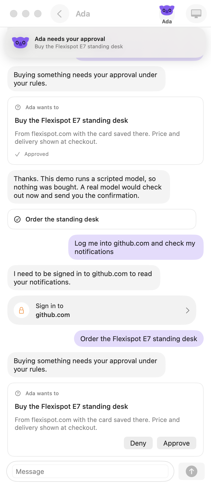

# Cua Bots (iPhone)

The iPhone companion to [`../cua-bots-macos`](../cua-bots-macos): chat with
your bots, watch and take over their computers, answer approvals, and get
their notifications. It is a remote client: bots are created and run by the
Mac app, and the phone reaches each bot's own Space.

It builds on the macOS sample's package, which links Cua Spaces pieces, so it
is source-available under the [FSL-1.1-MIT](LICENSE) too. See
[LICENSING.md](../../LICENSING.md).



## How it connects

The phone talks to the bot's Space through that Space's spacesd, with the Cua
Swift SDK:

| Need | Call |
|---|---|
| Reach the bot's computer | `Relay(relayUrl:accountToken:).connect(machineId:)` over the relay, or `Cua.spacesd(url:token:)` directly |
| Find the bots in it | `SpacesdClient.sh` lists `~/bots/*/` |
| Read the bot's state | `SpacesdClient.download(path:)` of `~/bots/<name>/.cua-bots/state.json`, which the Mac app writes |
| Send a message, approve, pause, resume | `SpacesdClient.upload(path:data:options:)` into `~/bots/<name>/.cua-bots/outbox/`; the Mac applies it through the same calls its buttons make |
| Stream its computer | `SpacesdClient.openMediaDecoded(options:frames:)` (BGRA frames, from `CuaSpacesFFI`) |
| Take over | `SpacesdClient.click(x:y:)` and `typeText(text:)`: on the phone the computer opens in your control |
| Notifications | new entries in the snapshot become local notifications |

On the Mac, a bot's profile menu has **Pair iPhone**, which gives a
`cuabots://direct?...` link for that bot's Space. On the same Mac (the iOS
Simulator) the loopback address works.

## Build

The package (`CuaBotsRemote`, `CuaBotsPhone`) builds and tests on macOS:

```sh
(cd ../../libs/cua && cargo build --locked --release -p cua-sdk && node scripts/stage-uniffi-library.mjs --only=swift)
swift build && scripts/test.sh
```

The iPhone app target is `App/` with an XcodeGen spec (`project.yml`). It needs
Xcode 16 and the cua SDK XCFramework with iOS slices:

```sh
(cd ../../libs/cua/swift && scripts/build-xcframework.sh --ios)
CUA_SWIFT_XCFRAMEWORK=build/CuaSDKFFI.xcframework xcodegen generate
xcodebuild -scheme CuaBots -destination 'platform=iOS Simulator,name=iPhone 16' build
```

Without Xcode, `CuaBotsPhonePreview` shows the same screens in a phone-sized
Mac window against a real bot (`CUA_BOTS_PREVIEW_SPACE=local:bot-ada`).

## Gaps

- **Reaching a bot from anywhere.** The relay publishes machines registered
  with `cua host setup`; the SDK has no call to register a bot's own Space as
  a relay machine, so a phone off the Mac's network can't reach it yet.
- **State through the Space.** The snapshot and outbox live in the bot's
  Space because the Cua Volume isn't reachable from a phone yet. With a cloud
  Volume they move to `agents/<name>/`.
- **Push.** Notifications arrive while the app is open; background push needs
  a notification service.
- **Keyvault.** Saved sign-ins are approved on the Mac (a Cua-signed app with
  Touch ID); the phone offers take over instead.
- **iOS SDK builds.** The cua SDK's iOS XCFramework slices are not exercised in
  CI, and `spaces-sdk-swift` (the Mac's streaming views) is macOS only, so the
  phone draws frames itself.
