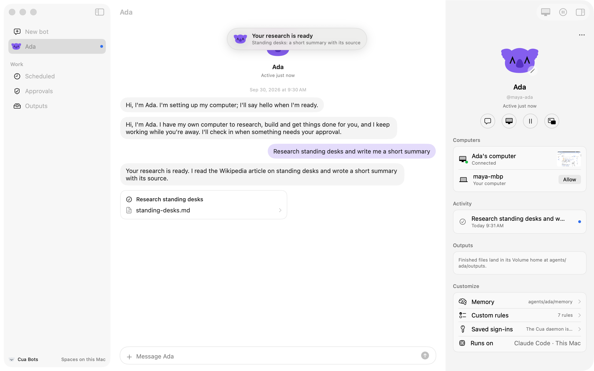

# Cua Bots (macOS)

Persistent bots on Cua: each bot has a name, a koala face you design, its own
computer (a Space), a memory that outlives that computer (Cua Volume), work it
does on its own (routines), and rules for when it must ask you first. A
SwiftUI app on the Cua Swift SDK (`Cua`, `CuaSpaces`) and the Cua Spaces
Swift packages (`CuaSpacesFFI`, for saved sign-ins through the Cua Keyvault,
and `CuaSpacesStreaming`, for the live view of a bot's computer). Its
iPhone companion is [`../cua-bots-ios`](../cua-bots-ios).

The sample links Cua Spaces pieces, so it is source-available under the
[Functional Source License, Version 1.1, MIT Future License](LICENSE)
(FSL-1.1-MIT), like Cua Spaces itself. See [LICENSING.md](../../LICENSING.md).



## Quick start

```sh
git clone https://github.com/trycua/cua && cd cua
(cd libs/cua && cargo build --locked --release -p cua-spaces-ffi)
libs/spaces-app-swift/scripts/stage-library.sh
cd samples/cua-bots-macos
swift build && .build/debug/CuaBots
```

`stage-library.sh` stages the Cua Spaces app export, which carries the MIT
cua SDK too, where the Swift packages link it.

A bot's agent needs a model key in the app's environment
(`ANTHROPIC_API_KEY` for Claude Code, `OPENAI_API_KEY` for Codex; Hermes and
OpenClaw take either). `CUA_BOTS_MODEL_URL`, `CUA_BOTS_MODEL` and
`CUA_BOTS_MODEL_KEY_VARS` point every bot at another endpoint.
`CUA_BOTS_OWNER` and `CUA_BOTS_DEVICE_NAME` set the name the bots use for you
and the name shown for this Mac (default: your account and computer names).
`CUA_BOTS_APPEARANCE=light` or `dark` pins the app's appearance (light is the
design target; unset follows the system). Local Spaces
need Docker (or Colima).

## What maps to what

| In the app | Cua underneath |
|---|---|
| New bot: name, look, where it runs, which agent | `Spaces.create` (`on: local` or `cloud`, `reuse`), one Space per bot named `bot-<name>`; `Space.agentStart` with the harness (`hermes`, `openclaw`, `openai-codex`, `claude-code`) |
| The koala face and its expressions | `KoalaAvatar` (this sample), drawn from geometry derived from the Cua koala mark |
| "Ada's computer", live, with picture in picture | `LiveStreamSession` and `StreamPiPController` (`CuaSpacesStreaming`) on the bot's Space |
| Ada has control · Take over | the stream turns interactive and `agentInterrupt` pauses the turn |
| Ada's face as her pointer | `SpacesdClient.cursorPosition()` |
| Memory, outputs, inbox | Cua Volume layout `agents/<name>/` (`memory/MEMORY.md`, `outputs/`, `inbox/`), copied into the Space before a turn and back after it |
| Works on its own | scheduled tasks on the SDK's routine clock (`RoutineStore`) |
| Approvals and custom rules | `rules.yaml` and the instructions file in the bot's Volume home; the bot asks with `[[ask: ...]]`, the app answers in the conversation |
| Log me into this site | `[[login: site]]`; a saved sign-in from the Cua Keyvault (`KeyvaultClient` from `CuaSpacesFFI`, `Space.teleport`), or take over and type it yourself |
| Access to this Mac: Allow, Revoke | `Host.startSharing` / `Host.stopSharing` (`cua host`) |
| Pause, Resume, Reset | interrupt the run and disarm routines (optionally `Sandbox.suspend`); reset stops the run, deletes the Space and the Volume home |
| The iPhone app | the bot's snapshot and an outbox in its Space, read and written through spacesd (`RemoteBridge`) |

## How a bot talks to the app

The app writes the bot's standing instructions (`CLAUDE.md`, `SOUL.md` or
`AGENTS.md`) into its home. They teach a few markers the app turns into UI and
hides from the text:

```text
[[status: Checking inbox]]                     status under its name
[[step: Read the docs]] [[step-done: ...]]      Activity
[[ask: Buy the desk | details]]                 an approval card
[[handoff: Change the bank password]]           you do it yourself
[[login: github.com]]                           the sign-in card
[[output: outputs/summary.md]]                  Outputs
[[notify: Your research is ready | one line]]   a notification
[[schedule: daily 09:00 | title | what to do]]  a routine
[[done: Research standing desks]]               a result card
```

The rules are instructions, not enforcement: the harness runs with its
permissions auto-approved inside the bot's own Space. See the gaps below.

## Tests and screenshots

```sh
scripts/test.sh                                    # unit tests (swift-testing)
scripts/capture.sh <out-dir> [<scratch-home>] [--phone]
```

`capture.sh` runs the app in a throwaway `HOME` with the file credential
store, against a real local Space, with the scripted mock provider
(`cua-mock-llm`, `scripts/demo-model.json`) behind the real harness. It
photographs each surface with `screencapture -l` and deletes the Spaces it
made. With `--phone` it also photographs the iPhone screens (in the macOS
preview host) against the same bot.

## Gaps

What the sample does with today's primitives, and what needs core work:

- Rules are guidance: agent runs auto-approve their own permissions. Enforced
  approvals need the runner to route permission requests to the app.
- The Volume is a folder in the app's data (`LocalVolume`) with the Cua
  Volume layout and secret refusal. The SDK's `Spaces.volumeRead`,
  `volumeWrite` and `volumeLs` reach the daemon's Cua Volume; the app doesn't
  sync through them yet.
- The routine clock runs in the app, so routines fire while it's open.
- The app runs each bot with `Space.agentStart` and copies its home in and
  out itself. The SDK's persistent agents (`Spaces.persistentAgentCreate`,
  `persistentAgentSend`, `agentPause`, `agentResume`, `routineAdd`,
  `notifications`) keep the home in the Cua Volume, with saves, routines and
  notifications run by `cua daemon`; the app doesn't use them yet.
- Host access is per account, not per bot.
- Saved sign-ins need the Cua daemon's Keyvault and a Cua-signed app to
  approve; this sample's build shows the request and falls back to take over.
- Pause on a Cua Cloud Space can't suspend it (Fleet claims have no suspend).
