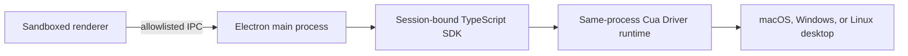

# Cua Driver Electron workbench

This reference app embeds the Cua Driver TypeScript SDK directly in an Electron
main process. It does not launch a daemon or expose a reusable socket.

The renderer receives a narrow `contextBridge` API for permission status,
session lifecycle, and a curated set of desktop tools. The native SDK and its
session authority never enter the renderer.

The Forge configuration keeps the application unpacked. In SDK `0.18.0`, the
native library resolver can locate the platform package through Electron's
virtual ASAR filesystem, but the operating system loader cannot open the
resulting virtual `app.asar` path. ASAR is not a security boundary, so this
sample keeps renderer sandboxing, context isolation, CSP, and IPC validation
while using an unpacked `Resources/app` directory.

## Run from source

```bash
cd samples/driver/electron-sdk-workbench
npm install
npm start
```

On macOS, grant Accessibility and Screen Recording to the packaged app when
prompted. A source run is identified as Electron by macOS, while the packaged
app is identified by `ai.cua.driver.workbench`.

## Package a macOS app

```bash
npm run package
```

The `.app` is written under `out/`. This local package is not notarized for
public distribution.

Node 22 through 25 is supported by the packaging toolchain. To sign with a
local macOS identity after packaging, run:

```bash
codesign --force --deep --options runtime \
  --entitlements entitlements.plist \
  --sign "Developer ID Application: Your Company" \
  "out/Cua Driver Workbench-darwin-arm64/Cua Driver Workbench.app"
```

Signing does not notarize the app.

## Architecture



The workbench defaults to `standard` permission mode. `bounded` requires an
absolute manifest path. `unrestricted` is available for trusted local testing.
